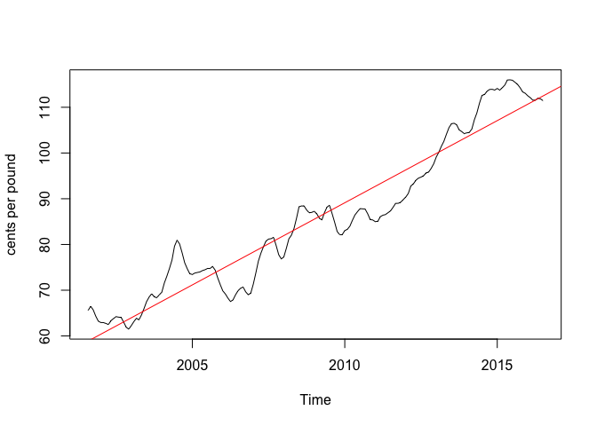
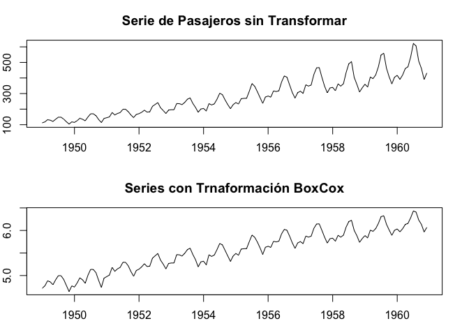
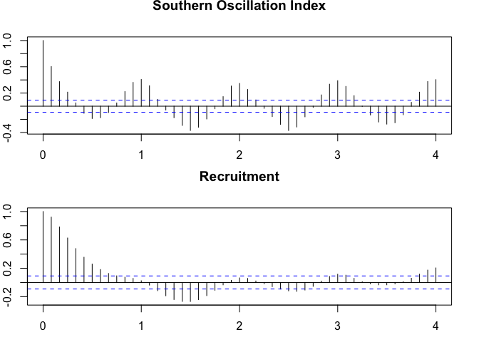

Analisis Descriptivo Series de Tiempo
================

## Gráfico de una Serie de tiempo

Vamos a analizar de forma descriptiva algunas serie de tiempo.
Empezaremos por la serie de desempleo de los Estados Unidos que viene en
el paquete TSstudio.

``` r
library(TSstudio)
data(USUnRate)
ts_info(USUnRate)
```

    ##  The USUnRate series is a ts object with 1 variable and 864 observations
    ##  Frequency: 12 
    ##  Start time: 1948 1 
    ##  End time: 2019 12

``` r
plot(USUnRate,main = "US Monthly Unemployment Rate",ylab="Unemployment Rate (%)")
```

<!-- --> La serie es
medida mensula, es decir, presenta una frecuencia de 12. Qué
carcaterísticas podemos observar? \* Tendencia? \* Estacionalidad? \*
Cíclos? \* Varianza marginal no constante? Vamos a seleccionar un
periodo de tiempo mas corto

``` r
# unemployment <- window(USUnRate, start = c(1990,1))
#   ts_plot(unemployment,
#           title = "US Monthly Unemployment Rate",
#           Ytitle = "Unemployment Rate (%)",
#           Xtitle = "Year",
#           Xgrid = TRUE,
#Ygrid = TRUE)
```

Note que aquí podemos ver varias características: Estacionalidad(no es
tan evidente), tres periodos de cíclos, el primero de 1990 a 2000,el
segundo de 2000 a 2007, y el tercero de 2007 a 2019. No parece tener una
hetocedasticidad marginal.

Veamos ahora la tasa de desempleo de Colombia. Hay que hacerle un ajuste
a la base de datos porque está en order descendente en el tiempo.

## Including Plots

``` r
library(readxl)
library(tidyverse)
```

    ## ── Attaching packages ─────────────────────────────────────── tidyverse 1.3.0 ──

    ## ✓ ggplot2 3.3.3     ✓ purrr   0.3.4
    ## ✓ tibble  3.0.6     ✓ dplyr   1.0.4
    ## ✓ tidyr   1.1.2     ✓ stringr 1.4.0
    ## ✓ readr   1.4.0     ✓ forcats 0.5.1

    ## ── Conflicts ────────────────────────────────────────── tidyverse_conflicts() ──
    ## x dplyr::filter() masks stats::filter()
    ## x dplyr::lag()    masks stats::lag()

``` r
DesempleoyEmpleo <- read_excel("DesempleoyEmpleo.xlsx", range="A9:C249")
str(DesempleoyEmpleo)
```

    ## tibble [240 × 3] (S3: tbl_df/tbl/data.frame)
    ##  $ Fecha          : chr [1:240] "2020-12" "2020-11" "2020-10" "2020-09" ...
    ##  $ Tasadeempleo   : num [1:240] 53.4 53.2 53.2 50.6 49.3 ...
    ##  $ Tasadedesempleo: num [1:240] 13.4 13.3 14.7 15.8 16.8 ...

``` r
DesempleoyEmpleo_1=DesempleoyEmpleo %>% map_df(rev)
tail(DesempleoyEmpleo)
```

    ## # A tibble: 6 x 3
    ##   Fecha   Tasadeempleo Tasadedesempleo
    ##   <chr>          <dbl>           <dbl>
    ## 1 2001-06         51.8            15.2
    ## 2 2001-05         51.2            14.2
    ## 3 2001-04         51.5            14.6
    ## 4 2001-03         53.0            15.7
    ## 5 2001-02         52.7            17.3
    ## 6 2001-01         53.0            16.7

``` r
head(DesempleoyEmpleo_1)
```

    ## # A tibble: 6 x 3
    ##   Fecha   Tasadeempleo Tasadedesempleo
    ##   <chr>          <dbl>           <dbl>
    ## 1 2001-01         53.0            16.7
    ## 2 2001-02         52.7            17.3
    ## 3 2001-03         53.0            15.7
    ## 4 2001-04         51.5            14.6
    ## 5 2001-05         51.2            14.2
    ## 6 2001-06         51.8            15.2

``` r
library(zoo)
```

    ## 
    ## Attaching package: 'zoo'

    ## The following objects are masked from 'package:base':
    ## 
    ##     as.Date, as.Date.numeric

``` r
library(xts)
```

    ## 
    ## Attaching package: 'xts'

    ## The following objects are masked from 'package:dplyr':
    ## 
    ##     first, last

``` r
Fechas=as.yearmon(DesempleoyEmpleo_1$Fecha)
Desempleo_Col_xts=xts(x = DesempleoyEmpleo_1$Tasadedesempleo,frequency = 12,
order.by = Fechas)
ts_info(Desempleo_Col_xts)
```

    ##  The Desempleo_Col_xts series is a xts object with 1 variable and 240 observations
    ##  Frequency: monthly 
    ##  Start time: Jan 2001 
    ##  End time: Dec 2020

``` r
plot(Desempleo_Col_xts)
```

<!-- -->

``` r
#ts_plot(Desempleo_Col_xts,
#           title = "Tasa de Desemplo Mensual Colombia",
#           Ytitle = "Tasa de Desempleo(%)",
#           Xtitle = "Año",
#           Xgrid = TRUE,
#Ygrid = TRUE)
```

Qué características presenta esta serie?

## Análisis de Tendencias

Vamos a ver la forma de estimar la tendencia y/o eliminarla.

``` r
library(astsa)
library(TSstudio)
data(chicken)
ts_info(chicken)
```

    ##  The chicken series is a ts object with 1 variable and 180 observations
    ##  Frequency: 12 
    ##  Start time: 2001 8 
    ##  End time: 2016 7

``` r
plot(chicken,main="Precio Mensual de la Libra de Pollo en Estados Unidos", ylab="Precio en Centavos de Dólar")
```

<!-- -->

``` r
#ts_plot(chicken)
```

Al parecer la serie de precios mensuales del pollo presenta una
tendencia creciente al parecer lineal, es decir
*y*<sub>*t*</sub> = *μ*<sub>*t*</sub> + *a*<sub>*t*</sub>
o mas específicamente

*y*<sub>*t*</sub> = *β*<sub>0</sub> + *β*<sub>1</sub>*t* + *a*<sub>*t*</sub>

``` r
summary(fit <- lm(chicken~time(chicken), na.action=NULL))
```

    ## 
    ## Call:
    ## lm(formula = chicken ~ time(chicken), na.action = NULL)
    ## 
    ## Residuals:
    ##     Min      1Q  Median      3Q     Max 
    ## -8.7411 -3.4730  0.8251  2.7738 11.5804 
    ## 
    ## Coefficients:
    ##                 Estimate Std. Error t value Pr(>|t|)    
    ## (Intercept)   -7.131e+03  1.624e+02  -43.91   <2e-16 ***
    ## time(chicken)  3.592e+00  8.084e-02   44.43   <2e-16 ***
    ## ---
    ## Signif. codes:  0 '***' 0.001 '**' 0.01 '*' 0.05 '.' 0.1 ' ' 1
    ## 
    ## Residual standard error: 4.696 on 178 degrees of freedom
    ## Multiple R-squared:  0.9173, Adjusted R-squared:  0.9168 
    ## F-statistic:  1974 on 1 and 178 DF,  p-value: < 2.2e-16

``` r
plot(chicken, ylab="centavos por libra") 
abline(fit,col = "red") # Se añade la recta ajusta
```

<!-- -->

``` r
###Eliminamos la tendencia con la predicción la recta
ElimiTendchick=chicken-predict(fit)
plot(ElimiTendchick,main="Serie Chicken Sin tendencia")
```

<!-- -->

``` r
set.seed(154) 
w = rnorm(200); x = cumsum(w) 
wd = w +.2; xd = cumsum(wd)
plot.ts(xd, ylim=c(-5,55), main="Caminata Aletoria", ylab='')
lines(x, col=4); abline(h=0, col=4, lty=2); abline(a=0, b=.2, lty=2)
```

<!-- -->

``` r
par(mar = c(2,2,2,2))
fit = lm(chicken~time(chicken), na.action=NULL) # Regresión sobre el tiempo
par(mfrow=c(2,1))
plot(resid(fit), type="o", main="sin tendencia") 
plot(diff(chicken), type="o", main="Primera Diferencia") 
```

<!-- -->

``` r
par(mar = c(3,2,3,2))
par(mfrow=c(3,1)) # plot ACFs
acf(chicken, 48, main="ACF Pollo")
acf(resid(fit), 48, main="ACF Sin tendencia") 
acf(diff(chicken), 48, main="ACF Primera Diferencia")
```

<!-- -->

## Transformación de Box-Cox para Estabilizar la Varianza Marginal

En ocaciones la serie presenta varianza marginal no constante a lo largo
del tiempo, lo cual hace necesario tener en cuenta tal caracaterística.
En este caso, se siguiere hacer una transformación de potencia para
estabilizar la varianza. Esta familia de transformaciones se llaman
transformaciones Box-Cox.

``` r
data("AirPassengers")
plot(AirPassengers)
```

<!-- -->

``` r
#####Transformación Box-Cox
library(FitAR)
```

    ## Loading required package: lattice

    ## Loading required package: leaps

    ## Loading required package: ltsa

    ## Loading required package: bestglm

``` r
library(forecast)
```

    ## Registered S3 method overwritten by 'quantmod':
    ##   method            from
    ##   as.zoo.data.frame zoo

    ## 
    ## Attaching package: 'forecast'

    ## The following object is masked from 'package:FitAR':
    ## 
    ##     BoxCox

    ## The following object is masked from 'package:astsa':
    ## 
    ##     gas

``` r
forecast::BoxCox.lambda(AirPassengers, method = "guerrero", lower = 0, upper = 2) ###Me etrega el valor de lambda 
```

    ## [1] 4.102259e-05

``` r
##method="loglik"
FitAR::BoxCox(AirPassengers)###Me entrega una gráfica
```

<!-- -->

``` r
lAirPass=log(AirPassengers)
par(mar = c(3,2,3,2))
par(mfrow=c(2,1))
plot(AirPassengers,main="Serie de Pasajeros sin Transformar")
plot(lAirPass,main="Series con Trnaformación BoxCox")
```

<!-- --> Note que ahora
usamos la misma función para verificar si en verdad la varianza fue
estabilizada.ç

``` r
FitAR::BoxCox(lAirPass)
```

<!-- -->

``` r
forecast::BoxCox.lambda(lAirPass, method = "guerrero", lower = -1, upper = 2)
```

    ## [1] -0.419081

Vamos a correr lo mismo pero en Python para la transformacion de BoxCox

\#`{r configuración, include=FALSE} #library(knitr)  #library(reticulate) #use_condaenv(condaenv = "Python38andR", conda = "auto", required = TRUE) #pandas=import("pandas") #knitr::knit_engines$set(python = reticulate::eng_python)  #`

\#\`\`\`{python inicio} \#import sys \#print(sys.path) \#import pandas
as pd \#import matplotlib.pylab as plt \#data =
pd.read\_csv(‘AirPassengers.csv’) \#print(data) \#print(‘Data Types:’)
\#print(data.dtypes) \#con=data\[‘Month’\]
\#data\[‘Month’\]=pd.to\_datetime(data\[‘Month’\])
\#\#data.set\_index(‘Month’, inplace=True)
\#pasajeros=data.set\_index(‘Month’) \#check datatype of index

\#convert to time series: \#ts = pasajeros\[‘NPassengers’\]
\#ts.head(10)

\#\#\#\#Graficar la Serie\#\#\#\#\# \#plt.plot(ts)
\#plt.title(‘AirPassengers’) \#plt.show()

\#\`\`\`

\#\`\`\`{python inicio\_1} \#ts.index.freq \#pasajeros.index.freq=‘MS’
\#ts.index.freq=‘MS’ \#ts.index

\#\#\#\#\#Transformación Box-Cox \#import scipy as sp \#import
scipy.stats \#\#\#\#En ocasiones puede funcionar la línea 46 sin ésta
línea. \#print(sp.stats.boxcox(ts,alpha=0.05))
\#sp.stats.boxcox(data\[‘NPassengers’\],alpha=0.05)
\#logAirp=sp.stats.boxcox(data\[‘NPassengers’\],lmbda=0) \#data =
data.assign(logAirp=logAirp)

\#logpasajeros=data.set\_index(‘Month’)  
\#logAirPass= logpasajeros\[‘logAirp’\] \#plt.plot(logAirPass)
\#plt.show() \#sp.stats.boxcox(logAirp,alpha=0.05) \#\#\#Note que la
transformación Box-Cox si sutión efecto.

\#\`\`\`

## Gráficas de Retardos

Vamos a hacer gráficos de dispersión para chequear que tipos de
relaciones hay entre los retardos de la variable interés. Vamos a
trabajar con algunas series, por ejemplo: \* Índice ambiental mensual
(soi)(Southern Oscillation Index), el cual mide los cambios en la
presión del aire, relacionados con las temperaturas de la superficie del
mar en el Océano Pacífico central. \* la serie rec (reclutamiento
asociada al soi), número de nuevos peces. \* Consumo mensual de gas
natural en EE. UU.(USgas) medido en Billones de pies cúbicos. Esto
permite chequear si hay posibles relaciones no-lineales.

``` r
library(astsa)
data("soi")
ts_info(soi)
```

    ##  The soi series is a ts object with 1 variable and 453 observations
    ##  Frequency: 12 
    ##  Start time: 1950 1 
    ##  End time: 1987 9

``` r
?soi

par(mar = c(2,2,2,2))
plot(soi, main="Indice soi")
```

<!-- -->

``` r
par(mar = c(3,2,3,2))
astsa::lag1.plot(soi, 12)  ###El 12 indica cuantos retardos y_t-k contra y_t 
```

<!-- -->

``` r
###Hacer la gráfica con x11()
```

``` r
#pdf('/Users/sergiocalderon/Documents/Documentos - iMac de Sergio/Documentos iMac Sergio/Notas de Clase/Notas de clase/Notas de Clase Series de Tiempo Univariadas/Graficas/DispersionSoiRec.pdf',paper="USr")
par(mar = c(3,2,3,2))
lag2.plot(soi, rec, 8)   #El 2 de lag2.plot es porque intervenienen dos serie de tiempo.
```

<!-- -->

``` r
#dev.off()
lag2.plot(soi, rec, 8,corr=F)
```

<!-- -->
Note que con la función ts\_lags de TSstudio podemos hacer una gráfica
similar.

``` r
ts_lags(soi,lags=1:12)
```

    ## PhantomJS not found. You can install it with webshot::install_phantomjs(). If it is installed, please make sure the phantomjs executable can be found via the PATH variable.

<div id="htmlwidget-c3d03e6947c385dabb82" style="width:672px;height:480px;" class="plotly html-widget"></div>
<script type="application/json" data-for="htmlwidget-c3d03e6947c385dabb82">{"x":{"data":[{"x":[0.377,0.246,0.311,0.104,-0.016,0.235,0.137,0.191,-0.016,0.29,0.038,-0.016,-0.158,0.366,0.607,-0.355,-0.18,0.268,0.093,0.027,0.246,0.202,0.432,0.617,0.76,0.891,0.607,0.574,0.005,0.475,0.202,-0.027,-0.038,0.716,0.836,0.891,0.53,0.53,0.377,-0.235,-0.585,-0.18,-0.53,-0.464,-0.443,0.049,0.454,0.257,0.41,0.224,0.148,-0.432,-0.093,-0.268,0.158,-0.06,-0.399,0.235,0.366,0.202,0.344,-0.038,0.29,-0.126,-0.366,-0.115,-0.301,-0.486,-0.137,0.738,0.366,0.366,0.65,0.628,0.126,0.169,0.137,-0.257,0.169,-0.093,0.475,0.639,0.596,0.749,0.191,1,0.486,0.41,0.158,0.126,0.06,0.246,0.738,0.803,0.421,0.617,0.705,0.639,0.454,0.311,0.355,-0.158,-0.038,0.115,0.137,0.257,0.115,0.038,0.082,0.148,0.06,-0.191,-0.607,-0.585,-0.268,-0.093,-0.093,0.257,-0.005,0.224,0.169,0.432,0.202,-0.366,-0.661,0.093,-0.716,0.148,-0.093,0.279,0.432,-0.104,0.607,0.18,0.071,0.246,-0.432,0.06,-0.388,0.202,-0.104,0.191,0.475,0.552,0.169,0.333,-0.005,-0.038,-0.126,-0.443,-0.016,0.027,0.333,0.355,0.344,0.115,0.311,0.596,0.005,0.388,-0.5080001,-0.552,-0.858,-0.596,0.06,0.071,0.224,0.279,0.322,0.18,0.126,0.082,0.126,-0.213,-0.235,0.169,0.388,0.519,0.126,0.41,0.738,0.443,0.596,-0.137,-0.486,-0.377,0.268,-0.169,-0.213,-0.191,0.377,0.126,0.311,0.388,0.388,0.18,-0.333,0.049,-0.082,0.191,0.399,0.093,0.005,0.366,0.333,0.377,0.071,-0.158,-0.541,-0.683,-0.683,-0.344,-0.301,0.202,-0.126,0.082,0.115,0.464,0.104,-0.18,-0.672,0.104,-0.486,0.093,0.279,0.104,0.18,0.475,0.53,0.661,0.355,-0.344,-0.038,0.235,0.486,0.169,0.333,0.137,0.169,0.333,0.705,0.377,0.585,-0.126,-0.213,0.148,-0.126,-0.344,-0.5080001,0.279,0.082,0.355,0.082,0.574,0.355,-0.257,-0.377,-0.344,-0.65,-0.093,-0.137,0.115,0.705,0.399,0.366,0.366,0.038,-0.268,0.322,0.082,0.082,0.06,0.268,0.421,0.77,0.803,0.661,0.716,0.628,0.191,0.53,0.18,-0.464,0.279,0.355,0.202,0.552,0.617,0.104,0.224,0.432,-0.213,-0.967,-1,-0.432,-0.683,-0.5080001,-0.137,0.082,-0.06,0.333,0.355,0.388,-0.06,-0.202,0.005,-0.115,0.137,0.454,0.388,0.738,0.77,0.803,0.836,0.65,0.005,-0.366,0.071,-0.005,-0.454,0.191,0.432,0.683,0.388,0.235,-0.093,0.475,-0.082,-0.617,-0.093,-0.071,0.432,0.421,0.497,0.454,0.596,0.552,0.607,0.464,-0.301,-0.77,-0.65,-0.694,-0.137,-0.464,-0.246,0.169,-0.202,0.082,0.607,-0.158,-0.454,-0.781,-0.388,0.18,0.06,-0.5080001,-0.268,0.224,0.115,0.399,0.027,0.016,-0.377,-0.18,-0.038,-0.202,0.137,0.093,-0.279,-0.038,0.235,0.169,0.399,0.158,-0.541,-0.628,0.027,-0.738,-0.913,-0.027,0.071,-0.126,0.049,0.454,0.301,-0.005,-0.093,-0.224,-0.213,-0.311,-0.235,-0.322,0.322,0.093,0.115,0.77,0.607,-0.158,-0.235,-0.202,-0.333,-0.158,-0.224,-0.355,0.005,0.454,0.41,0.519,0.541,0.301,-0.574,-0.344,-0.279,-0.716,-0.869,-0.596,-0.29,-0.454,-0.246,-0.607,-0.563,-0.235,-0.246,-0.399,-0.333,-0.53,-0.049,0.158,0.115,0.322,0.115,0.049,0.454,0.158,-0.421,-0.268,-0.311,-0.115,-0.322,-0.322,0.126,0.333,0.519,0.399,0.519,0.432,0.355,-0.126,-0.5080001,-0.388,0.388],"y":[0.246,0.311,0.104,-0.016,0.235,0.137,0.191,-0.016,0.29,0.038,-0.016,-0.158,0.366,0.607,-0.355,-0.18,0.268,0.093,0.027,0.246,0.202,0.432,0.617,0.76,0.891,0.607,0.574,0.005,0.475,0.202,-0.027,-0.038,0.716,0.836,0.891,0.53,0.53,0.377,-0.235,-0.585,-0.18,-0.53,-0.464,-0.443,0.049,0.454,0.257,0.41,0.224,0.148,-0.432,-0.093,-0.268,0.158,-0.06,-0.399,0.235,0.366,0.202,0.344,-0.038,0.29,-0.126,-0.366,-0.115,-0.301,-0.486,-0.137,0.738,0.366,0.366,0.65,0.628,0.126,0.169,0.137,-0.257,0.169,-0.093,0.475,0.639,0.596,0.749,0.191,1,0.486,0.41,0.158,0.126,0.06,0.246,0.738,0.803,0.421,0.617,0.705,0.639,0.454,0.311,0.355,-0.158,-0.038,0.115,0.137,0.257,0.115,0.038,0.082,0.148,0.06,-0.191,-0.607,-0.585,-0.268,-0.093,-0.093,0.257,-0.005,0.224,0.169,0.432,0.202,-0.366,-0.661,0.093,-0.716,0.148,-0.093,0.279,0.432,-0.104,0.607,0.18,0.071,0.246,-0.432,0.06,-0.388,0.202,-0.104,0.191,0.475,0.552,0.169,0.333,-0.005,-0.038,-0.126,-0.443,-0.016,0.027,0.333,0.355,0.344,0.115,0.311,0.596,0.005,0.388,-0.5080001,-0.552,-0.858,-0.596,0.06,0.071,0.224,0.279,0.322,0.18,0.126,0.082,0.126,-0.213,-0.235,0.169,0.388,0.519,0.126,0.41,0.738,0.443,0.596,-0.137,-0.486,-0.377,0.268,-0.169,-0.213,-0.191,0.377,0.126,0.311,0.388,0.388,0.18,-0.333,0.049,-0.082,0.191,0.399,0.093,0.005,0.366,0.333,0.377,0.071,-0.158,-0.541,-0.683,-0.683,-0.344,-0.301,0.202,-0.126,0.082,0.115,0.464,0.104,-0.18,-0.672,0.104,-0.486,0.093,0.279,0.104,0.18,0.475,0.53,0.661,0.355,-0.344,-0.038,0.235,0.486,0.169,0.333,0.137,0.169,0.333,0.705,0.377,0.585,-0.126,-0.213,0.148,-0.126,-0.344,-0.5080001,0.279,0.082,0.355,0.082,0.574,0.355,-0.257,-0.377,-0.344,-0.65,-0.093,-0.137,0.115,0.705,0.399,0.366,0.366,0.038,-0.268,0.322,0.082,0.082,0.06,0.268,0.421,0.77,0.803,0.661,0.716,0.628,0.191,0.53,0.18,-0.464,0.279,0.355,0.202,0.552,0.617,0.104,0.224,0.432,-0.213,-0.967,-1,-0.432,-0.683,-0.5080001,-0.137,0.082,-0.06,0.333,0.355,0.388,-0.06,-0.202,0.005,-0.115,0.137,0.454,0.388,0.738,0.77,0.803,0.836,0.65,0.005,-0.366,0.071,-0.005,-0.454,0.191,0.432,0.683,0.388,0.235,-0.093,0.475,-0.082,-0.617,-0.093,-0.071,0.432,0.421,0.497,0.454,0.596,0.552,0.607,0.464,-0.301,-0.77,-0.65,-0.694,-0.137,-0.464,-0.246,0.169,-0.202,0.082,0.607,-0.158,-0.454,-0.781,-0.388,0.18,0.06,-0.5080001,-0.268,0.224,0.115,0.399,0.027,0.016,-0.377,-0.18,-0.038,-0.202,0.137,0.093,-0.279,-0.038,0.235,0.169,0.399,0.158,-0.541,-0.628,0.027,-0.738,-0.913,-0.027,0.071,-0.126,0.049,0.454,0.301,-0.005,-0.093,-0.224,-0.213,-0.311,-0.235,-0.322,0.322,0.093,0.115,0.77,0.607,-0.158,-0.235,-0.202,-0.333,-0.158,-0.224,-0.355,0.005,0.454,0.41,0.519,0.541,0.301,-0.574,-0.344,-0.279,-0.716,-0.869,-0.596,-0.29,-0.454,-0.246,-0.607,-0.563,-0.235,-0.246,-0.399,-0.333,-0.53,-0.049,0.158,0.115,0.322,0.115,0.049,0.454,0.158,-0.421,-0.268,-0.311,-0.115,-0.322,-0.322,0.126,0.333,0.519,0.399,0.519,0.432,0.355,-0.126,-0.5080001,-0.388,0.388,0.071],"mode":"markers","type":"scatter","marker":{"color":"rgba(31,119,180,1)","line":{"color":"rgba(31,119,180,1)"}},"error_y":{"color":"rgba(31,119,180,1)"},"error_x":{"color":"rgba(31,119,180,1)"},"line":{"color":"rgba(31,119,180,1)"},"xaxis":"x","yaxis":"y","frame":null},{"x":[0.377,0.246,0.311,0.104,-0.016,0.235,0.137,0.191,-0.016,0.29,0.038,-0.016,-0.158,0.366,0.607,-0.355,-0.18,0.268,0.093,0.027,0.246,0.202,0.432,0.617,0.76,0.891,0.607,0.574,0.005,0.475,0.202,-0.027,-0.038,0.716,0.836,0.891,0.53,0.53,0.377,-0.235,-0.585,-0.18,-0.53,-0.464,-0.443,0.049,0.454,0.257,0.41,0.224,0.148,-0.432,-0.093,-0.268,0.158,-0.06,-0.399,0.235,0.366,0.202,0.344,-0.038,0.29,-0.126,-0.366,-0.115,-0.301,-0.486,-0.137,0.738,0.366,0.366,0.65,0.628,0.126,0.169,0.137,-0.257,0.169,-0.093,0.475,0.639,0.596,0.749,0.191,1,0.486,0.41,0.158,0.126,0.06,0.246,0.738,0.803,0.421,0.617,0.705,0.639,0.454,0.311,0.355,-0.158,-0.038,0.115,0.137,0.257,0.115,0.038,0.082,0.148,0.06,-0.191,-0.607,-0.585,-0.268,-0.093,-0.093,0.257,-0.005,0.224,0.169,0.432,0.202,-0.366,-0.661,0.093,-0.716,0.148,-0.093,0.279,0.432,-0.104,0.607,0.18,0.071,0.246,-0.432,0.06,-0.388,0.202,-0.104,0.191,0.475,0.552,0.169,0.333,-0.005,-0.038,-0.126,-0.443,-0.016,0.027,0.333,0.355,0.344,0.115,0.311,0.596,0.005,0.388,-0.5080001,-0.552,-0.858,-0.596,0.06,0.071,0.224,0.279,0.322,0.18,0.126,0.082,0.126,-0.213,-0.235,0.169,0.388,0.519,0.126,0.41,0.738,0.443,0.596,-0.137,-0.486,-0.377,0.268,-0.169,-0.213,-0.191,0.377,0.126,0.311,0.388,0.388,0.18,-0.333,0.049,-0.082,0.191,0.399,0.093,0.005,0.366,0.333,0.377,0.071,-0.158,-0.541,-0.683,-0.683,-0.344,-0.301,0.202,-0.126,0.082,0.115,0.464,0.104,-0.18,-0.672,0.104,-0.486,0.093,0.279,0.104,0.18,0.475,0.53,0.661,0.355,-0.344,-0.038,0.235,0.486,0.169,0.333,0.137,0.169,0.333,0.705,0.377,0.585,-0.126,-0.213,0.148,-0.126,-0.344,-0.5080001,0.279,0.082,0.355,0.082,0.574,0.355,-0.257,-0.377,-0.344,-0.65,-0.093,-0.137,0.115,0.705,0.399,0.366,0.366,0.038,-0.268,0.322,0.082,0.082,0.06,0.268,0.421,0.77,0.803,0.661,0.716,0.628,0.191,0.53,0.18,-0.464,0.279,0.355,0.202,0.552,0.617,0.104,0.224,0.432,-0.213,-0.967,-1,-0.432,-0.683,-0.5080001,-0.137,0.082,-0.06,0.333,0.355,0.388,-0.06,-0.202,0.005,-0.115,0.137,0.454,0.388,0.738,0.77,0.803,0.836,0.65,0.005,-0.366,0.071,-0.005,-0.454,0.191,0.432,0.683,0.388,0.235,-0.093,0.475,-0.082,-0.617,-0.093,-0.071,0.432,0.421,0.497,0.454,0.596,0.552,0.607,0.464,-0.301,-0.77,-0.65,-0.694,-0.137,-0.464,-0.246,0.169,-0.202,0.082,0.607,-0.158,-0.454,-0.781,-0.388,0.18,0.06,-0.5080001,-0.268,0.224,0.115,0.399,0.027,0.016,-0.377,-0.18,-0.038,-0.202,0.137,0.093,-0.279,-0.038,0.235,0.169,0.399,0.158,-0.541,-0.628,0.027,-0.738,-0.913,-0.027,0.071,-0.126,0.049,0.454,0.301,-0.005,-0.093,-0.224,-0.213,-0.311,-0.235,-0.322,0.322,0.093,0.115,0.77,0.607,-0.158,-0.235,-0.202,-0.333,-0.158,-0.224,-0.355,0.005,0.454,0.41,0.519,0.541,0.301,-0.574,-0.344,-0.279,-0.716,-0.869,-0.596,-0.29,-0.454,-0.246,-0.607,-0.563,-0.235,-0.246,-0.399,-0.333,-0.53,-0.049,0.158,0.115,0.322,0.115,0.049,0.454,0.158,-0.421,-0.268,-0.311,-0.115,-0.322,-0.322,0.126,0.333,0.519,0.399,0.519,0.432,0.355,-0.126,-0.5080001,-0.388],"y":[0.311,0.104,-0.016,0.235,0.137,0.191,-0.016,0.29,0.038,-0.016,-0.158,0.366,0.607,-0.355,-0.18,0.268,0.093,0.027,0.246,0.202,0.432,0.617,0.76,0.891,0.607,0.574,0.005,0.475,0.202,-0.027,-0.038,0.716,0.836,0.891,0.53,0.53,0.377,-0.235,-0.585,-0.18,-0.53,-0.464,-0.443,0.049,0.454,0.257,0.41,0.224,0.148,-0.432,-0.093,-0.268,0.158,-0.06,-0.399,0.235,0.366,0.202,0.344,-0.038,0.29,-0.126,-0.366,-0.115,-0.301,-0.486,-0.137,0.738,0.366,0.366,0.65,0.628,0.126,0.169,0.137,-0.257,0.169,-0.093,0.475,0.639,0.596,0.749,0.191,1,0.486,0.41,0.158,0.126,0.06,0.246,0.738,0.803,0.421,0.617,0.705,0.639,0.454,0.311,0.355,-0.158,-0.038,0.115,0.137,0.257,0.115,0.038,0.082,0.148,0.06,-0.191,-0.607,-0.585,-0.268,-0.093,-0.093,0.257,-0.005,0.224,0.169,0.432,0.202,-0.366,-0.661,0.093,-0.716,0.148,-0.093,0.279,0.432,-0.104,0.607,0.18,0.071,0.246,-0.432,0.06,-0.388,0.202,-0.104,0.191,0.475,0.552,0.169,0.333,-0.005,-0.038,-0.126,-0.443,-0.016,0.027,0.333,0.355,0.344,0.115,0.311,0.596,0.005,0.388,-0.5080001,-0.552,-0.858,-0.596,0.06,0.071,0.224,0.279,0.322,0.18,0.126,0.082,0.126,-0.213,-0.235,0.169,0.388,0.519,0.126,0.41,0.738,0.443,0.596,-0.137,-0.486,-0.377,0.268,-0.169,-0.213,-0.191,0.377,0.126,0.311,0.388,0.388,0.18,-0.333,0.049,-0.082,0.191,0.399,0.093,0.005,0.366,0.333,0.377,0.071,-0.158,-0.541,-0.683,-0.683,-0.344,-0.301,0.202,-0.126,0.082,0.115,0.464,0.104,-0.18,-0.672,0.104,-0.486,0.093,0.279,0.104,0.18,0.475,0.53,0.661,0.355,-0.344,-0.038,0.235,0.486,0.169,0.333,0.137,0.169,0.333,0.705,0.377,0.585,-0.126,-0.213,0.148,-0.126,-0.344,-0.5080001,0.279,0.082,0.355,0.082,0.574,0.355,-0.257,-0.377,-0.344,-0.65,-0.093,-0.137,0.115,0.705,0.399,0.366,0.366,0.038,-0.268,0.322,0.082,0.082,0.06,0.268,0.421,0.77,0.803,0.661,0.716,0.628,0.191,0.53,0.18,-0.464,0.279,0.355,0.202,0.552,0.617,0.104,0.224,0.432,-0.213,-0.967,-1,-0.432,-0.683,-0.5080001,-0.137,0.082,-0.06,0.333,0.355,0.388,-0.06,-0.202,0.005,-0.115,0.137,0.454,0.388,0.738,0.77,0.803,0.836,0.65,0.005,-0.366,0.071,-0.005,-0.454,0.191,0.432,0.683,0.388,0.235,-0.093,0.475,-0.082,-0.617,-0.093,-0.071,0.432,0.421,0.497,0.454,0.596,0.552,0.607,0.464,-0.301,-0.77,-0.65,-0.694,-0.137,-0.464,-0.246,0.169,-0.202,0.082,0.607,-0.158,-0.454,-0.781,-0.388,0.18,0.06,-0.5080001,-0.268,0.224,0.115,0.399,0.027,0.016,-0.377,-0.18,-0.038,-0.202,0.137,0.093,-0.279,-0.038,0.235,0.169,0.399,0.158,-0.541,-0.628,0.027,-0.738,-0.913,-0.027,0.071,-0.126,0.049,0.454,0.301,-0.005,-0.093,-0.224,-0.213,-0.311,-0.235,-0.322,0.322,0.093,0.115,0.77,0.607,-0.158,-0.235,-0.202,-0.333,-0.158,-0.224,-0.355,0.005,0.454,0.41,0.519,0.541,0.301,-0.574,-0.344,-0.279,-0.716,-0.869,-0.596,-0.29,-0.454,-0.246,-0.607,-0.563,-0.235,-0.246,-0.399,-0.333,-0.53,-0.049,0.158,0.115,0.322,0.115,0.049,0.454,0.158,-0.421,-0.268,-0.311,-0.115,-0.322,-0.322,0.126,0.333,0.519,0.399,0.519,0.432,0.355,-0.126,-0.5080001,-0.388,0.388,0.071],"mode":"markers","type":"scatter","marker":{"color":"rgba(255,127,14,1)","line":{"color":"rgba(255,127,14,1)"}},"error_y":{"color":"rgba(255,127,14,1)"},"error_x":{"color":"rgba(255,127,14,1)"},"line":{"color":"rgba(255,127,14,1)"},"xaxis":"x2","yaxis":"y","frame":null},{"x":[0.377,0.246,0.311,0.104,-0.016,0.235,0.137,0.191,-0.016,0.29,0.038,-0.016,-0.158,0.366,0.607,-0.355,-0.18,0.268,0.093,0.027,0.246,0.202,0.432,0.617,0.76,0.891,0.607,0.574,0.005,0.475,0.202,-0.027,-0.038,0.716,0.836,0.891,0.53,0.53,0.377,-0.235,-0.585,-0.18,-0.53,-0.464,-0.443,0.049,0.454,0.257,0.41,0.224,0.148,-0.432,-0.093,-0.268,0.158,-0.06,-0.399,0.235,0.366,0.202,0.344,-0.038,0.29,-0.126,-0.366,-0.115,-0.301,-0.486,-0.137,0.738,0.366,0.366,0.65,0.628,0.126,0.169,0.137,-0.257,0.169,-0.093,0.475,0.639,0.596,0.749,0.191,1,0.486,0.41,0.158,0.126,0.06,0.246,0.738,0.803,0.421,0.617,0.705,0.639,0.454,0.311,0.355,-0.158,-0.038,0.115,0.137,0.257,0.115,0.038,0.082,0.148,0.06,-0.191,-0.607,-0.585,-0.268,-0.093,-0.093,0.257,-0.005,0.224,0.169,0.432,0.202,-0.366,-0.661,0.093,-0.716,0.148,-0.093,0.279,0.432,-0.104,0.607,0.18,0.071,0.246,-0.432,0.06,-0.388,0.202,-0.104,0.191,0.475,0.552,0.169,0.333,-0.005,-0.038,-0.126,-0.443,-0.016,0.027,0.333,0.355,0.344,0.115,0.311,0.596,0.005,0.388,-0.5080001,-0.552,-0.858,-0.596,0.06,0.071,0.224,0.279,0.322,0.18,0.126,0.082,0.126,-0.213,-0.235,0.169,0.388,0.519,0.126,0.41,0.738,0.443,0.596,-0.137,-0.486,-0.377,0.268,-0.169,-0.213,-0.191,0.377,0.126,0.311,0.388,0.388,0.18,-0.333,0.049,-0.082,0.191,0.399,0.093,0.005,0.366,0.333,0.377,0.071,-0.158,-0.541,-0.683,-0.683,-0.344,-0.301,0.202,-0.126,0.082,0.115,0.464,0.104,-0.18,-0.672,0.104,-0.486,0.093,0.279,0.104,0.18,0.475,0.53,0.661,0.355,-0.344,-0.038,0.235,0.486,0.169,0.333,0.137,0.169,0.333,0.705,0.377,0.585,-0.126,-0.213,0.148,-0.126,-0.344,-0.5080001,0.279,0.082,0.355,0.082,0.574,0.355,-0.257,-0.377,-0.344,-0.65,-0.093,-0.137,0.115,0.705,0.399,0.366,0.366,0.038,-0.268,0.322,0.082,0.082,0.06,0.268,0.421,0.77,0.803,0.661,0.716,0.628,0.191,0.53,0.18,-0.464,0.279,0.355,0.202,0.552,0.617,0.104,0.224,0.432,-0.213,-0.967,-1,-0.432,-0.683,-0.5080001,-0.137,0.082,-0.06,0.333,0.355,0.388,-0.06,-0.202,0.005,-0.115,0.137,0.454,0.388,0.738,0.77,0.803,0.836,0.65,0.005,-0.366,0.071,-0.005,-0.454,0.191,0.432,0.683,0.388,0.235,-0.093,0.475,-0.082,-0.617,-0.093,-0.071,0.432,0.421,0.497,0.454,0.596,0.552,0.607,0.464,-0.301,-0.77,-0.65,-0.694,-0.137,-0.464,-0.246,0.169,-0.202,0.082,0.607,-0.158,-0.454,-0.781,-0.388,0.18,0.06,-0.5080001,-0.268,0.224,0.115,0.399,0.027,0.016,-0.377,-0.18,-0.038,-0.202,0.137,0.093,-0.279,-0.038,0.235,0.169,0.399,0.158,-0.541,-0.628,0.027,-0.738,-0.913,-0.027,0.071,-0.126,0.049,0.454,0.301,-0.005,-0.093,-0.224,-0.213,-0.311,-0.235,-0.322,0.322,0.093,0.115,0.77,0.607,-0.158,-0.235,-0.202,-0.333,-0.158,-0.224,-0.355,0.005,0.454,0.41,0.519,0.541,0.301,-0.574,-0.344,-0.279,-0.716,-0.869,-0.596,-0.29,-0.454,-0.246,-0.607,-0.563,-0.235,-0.246,-0.399,-0.333,-0.53,-0.049,0.158,0.115,0.322,0.115,0.049,0.454,0.158,-0.421,-0.268,-0.311,-0.115,-0.322,-0.322,0.126,0.333,0.519,0.399,0.519,0.432,0.355,-0.126,-0.5080001],"y":[0.104,-0.016,0.235,0.137,0.191,-0.016,0.29,0.038,-0.016,-0.158,0.366,0.607,-0.355,-0.18,0.268,0.093,0.027,0.246,0.202,0.432,0.617,0.76,0.891,0.607,0.574,0.005,0.475,0.202,-0.027,-0.038,0.716,0.836,0.891,0.53,0.53,0.377,-0.235,-0.585,-0.18,-0.53,-0.464,-0.443,0.049,0.454,0.257,0.41,0.224,0.148,-0.432,-0.093,-0.268,0.158,-0.06,-0.399,0.235,0.366,0.202,0.344,-0.038,0.29,-0.126,-0.366,-0.115,-0.301,-0.486,-0.137,0.738,0.366,0.366,0.65,0.628,0.126,0.169,0.137,-0.257,0.169,-0.093,0.475,0.639,0.596,0.749,0.191,1,0.486,0.41,0.158,0.126,0.06,0.246,0.738,0.803,0.421,0.617,0.705,0.639,0.454,0.311,0.355,-0.158,-0.038,0.115,0.137,0.257,0.115,0.038,0.082,0.148,0.06,-0.191,-0.607,-0.585,-0.268,-0.093,-0.093,0.257,-0.005,0.224,0.169,0.432,0.202,-0.366,-0.661,0.093,-0.716,0.148,-0.093,0.279,0.432,-0.104,0.607,0.18,0.071,0.246,-0.432,0.06,-0.388,0.202,-0.104,0.191,0.475,0.552,0.169,0.333,-0.005,-0.038,-0.126,-0.443,-0.016,0.027,0.333,0.355,0.344,0.115,0.311,0.596,0.005,0.388,-0.5080001,-0.552,-0.858,-0.596,0.06,0.071,0.224,0.279,0.322,0.18,0.126,0.082,0.126,-0.213,-0.235,0.169,0.388,0.519,0.126,0.41,0.738,0.443,0.596,-0.137,-0.486,-0.377,0.268,-0.169,-0.213,-0.191,0.377,0.126,0.311,0.388,0.388,0.18,-0.333,0.049,-0.082,0.191,0.399,0.093,0.005,0.366,0.333,0.377,0.071,-0.158,-0.541,-0.683,-0.683,-0.344,-0.301,0.202,-0.126,0.082,0.115,0.464,0.104,-0.18,-0.672,0.104,-0.486,0.093,0.279,0.104,0.18,0.475,0.53,0.661,0.355,-0.344,-0.038,0.235,0.486,0.169,0.333,0.137,0.169,0.333,0.705,0.377,0.585,-0.126,-0.213,0.148,-0.126,-0.344,-0.5080001,0.279,0.082,0.355,0.082,0.574,0.355,-0.257,-0.377,-0.344,-0.65,-0.093,-0.137,0.115,0.705,0.399,0.366,0.366,0.038,-0.268,0.322,0.082,0.082,0.06,0.268,0.421,0.77,0.803,0.661,0.716,0.628,0.191,0.53,0.18,-0.464,0.279,0.355,0.202,0.552,0.617,0.104,0.224,0.432,-0.213,-0.967,-1,-0.432,-0.683,-0.5080001,-0.137,0.082,-0.06,0.333,0.355,0.388,-0.06,-0.202,0.005,-0.115,0.137,0.454,0.388,0.738,0.77,0.803,0.836,0.65,0.005,-0.366,0.071,-0.005,-0.454,0.191,0.432,0.683,0.388,0.235,-0.093,0.475,-0.082,-0.617,-0.093,-0.071,0.432,0.421,0.497,0.454,0.596,0.552,0.607,0.464,-0.301,-0.77,-0.65,-0.694,-0.137,-0.464,-0.246,0.169,-0.202,0.082,0.607,-0.158,-0.454,-0.781,-0.388,0.18,0.06,-0.5080001,-0.268,0.224,0.115,0.399,0.027,0.016,-0.377,-0.18,-0.038,-0.202,0.137,0.093,-0.279,-0.038,0.235,0.169,0.399,0.158,-0.541,-0.628,0.027,-0.738,-0.913,-0.027,0.071,-0.126,0.049,0.454,0.301,-0.005,-0.093,-0.224,-0.213,-0.311,-0.235,-0.322,0.322,0.093,0.115,0.77,0.607,-0.158,-0.235,-0.202,-0.333,-0.158,-0.224,-0.355,0.005,0.454,0.41,0.519,0.541,0.301,-0.574,-0.344,-0.279,-0.716,-0.869,-0.596,-0.29,-0.454,-0.246,-0.607,-0.563,-0.235,-0.246,-0.399,-0.333,-0.53,-0.049,0.158,0.115,0.322,0.115,0.049,0.454,0.158,-0.421,-0.268,-0.311,-0.115,-0.322,-0.322,0.126,0.333,0.519,0.399,0.519,0.432,0.355,-0.126,-0.5080001,-0.388,0.388,0.071],"mode":"markers","type":"scatter","marker":{"color":"rgba(44,160,44,1)","line":{"color":"rgba(44,160,44,1)"}},"error_y":{"color":"rgba(44,160,44,1)"},"error_x":{"color":"rgba(44,160,44,1)"},"line":{"color":"rgba(44,160,44,1)"},"xaxis":"x3","yaxis":"y","frame":null},{"x":[0.377,0.246,0.311,0.104,-0.016,0.235,0.137,0.191,-0.016,0.29,0.038,-0.016,-0.158,0.366,0.607,-0.355,-0.18,0.268,0.093,0.027,0.246,0.202,0.432,0.617,0.76,0.891,0.607,0.574,0.005,0.475,0.202,-0.027,-0.038,0.716,0.836,0.891,0.53,0.53,0.377,-0.235,-0.585,-0.18,-0.53,-0.464,-0.443,0.049,0.454,0.257,0.41,0.224,0.148,-0.432,-0.093,-0.268,0.158,-0.06,-0.399,0.235,0.366,0.202,0.344,-0.038,0.29,-0.126,-0.366,-0.115,-0.301,-0.486,-0.137,0.738,0.366,0.366,0.65,0.628,0.126,0.169,0.137,-0.257,0.169,-0.093,0.475,0.639,0.596,0.749,0.191,1,0.486,0.41,0.158,0.126,0.06,0.246,0.738,0.803,0.421,0.617,0.705,0.639,0.454,0.311,0.355,-0.158,-0.038,0.115,0.137,0.257,0.115,0.038,0.082,0.148,0.06,-0.191,-0.607,-0.585,-0.268,-0.093,-0.093,0.257,-0.005,0.224,0.169,0.432,0.202,-0.366,-0.661,0.093,-0.716,0.148,-0.093,0.279,0.432,-0.104,0.607,0.18,0.071,0.246,-0.432,0.06,-0.388,0.202,-0.104,0.191,0.475,0.552,0.169,0.333,-0.005,-0.038,-0.126,-0.443,-0.016,0.027,0.333,0.355,0.344,0.115,0.311,0.596,0.005,0.388,-0.5080001,-0.552,-0.858,-0.596,0.06,0.071,0.224,0.279,0.322,0.18,0.126,0.082,0.126,-0.213,-0.235,0.169,0.388,0.519,0.126,0.41,0.738,0.443,0.596,-0.137,-0.486,-0.377,0.268,-0.169,-0.213,-0.191,0.377,0.126,0.311,0.388,0.388,0.18,-0.333,0.049,-0.082,0.191,0.399,0.093,0.005,0.366,0.333,0.377,0.071,-0.158,-0.541,-0.683,-0.683,-0.344,-0.301,0.202,-0.126,0.082,0.115,0.464,0.104,-0.18,-0.672,0.104,-0.486,0.093,0.279,0.104,0.18,0.475,0.53,0.661,0.355,-0.344,-0.038,0.235,0.486,0.169,0.333,0.137,0.169,0.333,0.705,0.377,0.585,-0.126,-0.213,0.148,-0.126,-0.344,-0.5080001,0.279,0.082,0.355,0.082,0.574,0.355,-0.257,-0.377,-0.344,-0.65,-0.093,-0.137,0.115,0.705,0.399,0.366,0.366,0.038,-0.268,0.322,0.082,0.082,0.06,0.268,0.421,0.77,0.803,0.661,0.716,0.628,0.191,0.53,0.18,-0.464,0.279,0.355,0.202,0.552,0.617,0.104,0.224,0.432,-0.213,-0.967,-1,-0.432,-0.683,-0.5080001,-0.137,0.082,-0.06,0.333,0.355,0.388,-0.06,-0.202,0.005,-0.115,0.137,0.454,0.388,0.738,0.77,0.803,0.836,0.65,0.005,-0.366,0.071,-0.005,-0.454,0.191,0.432,0.683,0.388,0.235,-0.093,0.475,-0.082,-0.617,-0.093,-0.071,0.432,0.421,0.497,0.454,0.596,0.552,0.607,0.464,-0.301,-0.77,-0.65,-0.694,-0.137,-0.464,-0.246,0.169,-0.202,0.082,0.607,-0.158,-0.454,-0.781,-0.388,0.18,0.06,-0.5080001,-0.268,0.224,0.115,0.399,0.027,0.016,-0.377,-0.18,-0.038,-0.202,0.137,0.093,-0.279,-0.038,0.235,0.169,0.399,0.158,-0.541,-0.628,0.027,-0.738,-0.913,-0.027,0.071,-0.126,0.049,0.454,0.301,-0.005,-0.093,-0.224,-0.213,-0.311,-0.235,-0.322,0.322,0.093,0.115,0.77,0.607,-0.158,-0.235,-0.202,-0.333,-0.158,-0.224,-0.355,0.005,0.454,0.41,0.519,0.541,0.301,-0.574,-0.344,-0.279,-0.716,-0.869,-0.596,-0.29,-0.454,-0.246,-0.607,-0.563,-0.235,-0.246,-0.399,-0.333,-0.53,-0.049,0.158,0.115,0.322,0.115,0.049,0.454,0.158,-0.421,-0.268,-0.311,-0.115,-0.322,-0.322,0.126,0.333,0.519,0.399,0.519,0.432,0.355,-0.126],"y":[-0.016,0.235,0.137,0.191,-0.016,0.29,0.038,-0.016,-0.158,0.366,0.607,-0.355,-0.18,0.268,0.093,0.027,0.246,0.202,0.432,0.617,0.76,0.891,0.607,0.574,0.005,0.475,0.202,-0.027,-0.038,0.716,0.836,0.891,0.53,0.53,0.377,-0.235,-0.585,-0.18,-0.53,-0.464,-0.443,0.049,0.454,0.257,0.41,0.224,0.148,-0.432,-0.093,-0.268,0.158,-0.06,-0.399,0.235,0.366,0.202,0.344,-0.038,0.29,-0.126,-0.366,-0.115,-0.301,-0.486,-0.137,0.738,0.366,0.366,0.65,0.628,0.126,0.169,0.137,-0.257,0.169,-0.093,0.475,0.639,0.596,0.749,0.191,1,0.486,0.41,0.158,0.126,0.06,0.246,0.738,0.803,0.421,0.617,0.705,0.639,0.454,0.311,0.355,-0.158,-0.038,0.115,0.137,0.257,0.115,0.038,0.082,0.148,0.06,-0.191,-0.607,-0.585,-0.268,-0.093,-0.093,0.257,-0.005,0.224,0.169,0.432,0.202,-0.366,-0.661,0.093,-0.716,0.148,-0.093,0.279,0.432,-0.104,0.607,0.18,0.071,0.246,-0.432,0.06,-0.388,0.202,-0.104,0.191,0.475,0.552,0.169,0.333,-0.005,-0.038,-0.126,-0.443,-0.016,0.027,0.333,0.355,0.344,0.115,0.311,0.596,0.005,0.388,-0.5080001,-0.552,-0.858,-0.596,0.06,0.071,0.224,0.279,0.322,0.18,0.126,0.082,0.126,-0.213,-0.235,0.169,0.388,0.519,0.126,0.41,0.738,0.443,0.596,-0.137,-0.486,-0.377,0.268,-0.169,-0.213,-0.191,0.377,0.126,0.311,0.388,0.388,0.18,-0.333,0.049,-0.082,0.191,0.399,0.093,0.005,0.366,0.333,0.377,0.071,-0.158,-0.541,-0.683,-0.683,-0.344,-0.301,0.202,-0.126,0.082,0.115,0.464,0.104,-0.18,-0.672,0.104,-0.486,0.093,0.279,0.104,0.18,0.475,0.53,0.661,0.355,-0.344,-0.038,0.235,0.486,0.169,0.333,0.137,0.169,0.333,0.705,0.377,0.585,-0.126,-0.213,0.148,-0.126,-0.344,-0.5080001,0.279,0.082,0.355,0.082,0.574,0.355,-0.257,-0.377,-0.344,-0.65,-0.093,-0.137,0.115,0.705,0.399,0.366,0.366,0.038,-0.268,0.322,0.082,0.082,0.06,0.268,0.421,0.77,0.803,0.661,0.716,0.628,0.191,0.53,0.18,-0.464,0.279,0.355,0.202,0.552,0.617,0.104,0.224,0.432,-0.213,-0.967,-1,-0.432,-0.683,-0.5080001,-0.137,0.082,-0.06,0.333,0.355,0.388,-0.06,-0.202,0.005,-0.115,0.137,0.454,0.388,0.738,0.77,0.803,0.836,0.65,0.005,-0.366,0.071,-0.005,-0.454,0.191,0.432,0.683,0.388,0.235,-0.093,0.475,-0.082,-0.617,-0.093,-0.071,0.432,0.421,0.497,0.454,0.596,0.552,0.607,0.464,-0.301,-0.77,-0.65,-0.694,-0.137,-0.464,-0.246,0.169,-0.202,0.082,0.607,-0.158,-0.454,-0.781,-0.388,0.18,0.06,-0.5080001,-0.268,0.224,0.115,0.399,0.027,0.016,-0.377,-0.18,-0.038,-0.202,0.137,0.093,-0.279,-0.038,0.235,0.169,0.399,0.158,-0.541,-0.628,0.027,-0.738,-0.913,-0.027,0.071,-0.126,0.049,0.454,0.301,-0.005,-0.093,-0.224,-0.213,-0.311,-0.235,-0.322,0.322,0.093,0.115,0.77,0.607,-0.158,-0.235,-0.202,-0.333,-0.158,-0.224,-0.355,0.005,0.454,0.41,0.519,0.541,0.301,-0.574,-0.344,-0.279,-0.716,-0.869,-0.596,-0.29,-0.454,-0.246,-0.607,-0.563,-0.235,-0.246,-0.399,-0.333,-0.53,-0.049,0.158,0.115,0.322,0.115,0.049,0.454,0.158,-0.421,-0.268,-0.311,-0.115,-0.322,-0.322,0.126,0.333,0.519,0.399,0.519,0.432,0.355,-0.126,-0.5080001,-0.388,0.388,0.071],"mode":"markers","type":"scatter","marker":{"color":"rgba(214,39,40,1)","line":{"color":"rgba(214,39,40,1)"}},"error_y":{"color":"rgba(214,39,40,1)"},"error_x":{"color":"rgba(214,39,40,1)"},"line":{"color":"rgba(214,39,40,1)"},"xaxis":"x","yaxis":"y2","frame":null},{"x":[0.377,0.246,0.311,0.104,-0.016,0.235,0.137,0.191,-0.016,0.29,0.038,-0.016,-0.158,0.366,0.607,-0.355,-0.18,0.268,0.093,0.027,0.246,0.202,0.432,0.617,0.76,0.891,0.607,0.574,0.005,0.475,0.202,-0.027,-0.038,0.716,0.836,0.891,0.53,0.53,0.377,-0.235,-0.585,-0.18,-0.53,-0.464,-0.443,0.049,0.454,0.257,0.41,0.224,0.148,-0.432,-0.093,-0.268,0.158,-0.06,-0.399,0.235,0.366,0.202,0.344,-0.038,0.29,-0.126,-0.366,-0.115,-0.301,-0.486,-0.137,0.738,0.366,0.366,0.65,0.628,0.126,0.169,0.137,-0.257,0.169,-0.093,0.475,0.639,0.596,0.749,0.191,1,0.486,0.41,0.158,0.126,0.06,0.246,0.738,0.803,0.421,0.617,0.705,0.639,0.454,0.311,0.355,-0.158,-0.038,0.115,0.137,0.257,0.115,0.038,0.082,0.148,0.06,-0.191,-0.607,-0.585,-0.268,-0.093,-0.093,0.257,-0.005,0.224,0.169,0.432,0.202,-0.366,-0.661,0.093,-0.716,0.148,-0.093,0.279,0.432,-0.104,0.607,0.18,0.071,0.246,-0.432,0.06,-0.388,0.202,-0.104,0.191,0.475,0.552,0.169,0.333,-0.005,-0.038,-0.126,-0.443,-0.016,0.027,0.333,0.355,0.344,0.115,0.311,0.596,0.005,0.388,-0.5080001,-0.552,-0.858,-0.596,0.06,0.071,0.224,0.279,0.322,0.18,0.126,0.082,0.126,-0.213,-0.235,0.169,0.388,0.519,0.126,0.41,0.738,0.443,0.596,-0.137,-0.486,-0.377,0.268,-0.169,-0.213,-0.191,0.377,0.126,0.311,0.388,0.388,0.18,-0.333,0.049,-0.082,0.191,0.399,0.093,0.005,0.366,0.333,0.377,0.071,-0.158,-0.541,-0.683,-0.683,-0.344,-0.301,0.202,-0.126,0.082,0.115,0.464,0.104,-0.18,-0.672,0.104,-0.486,0.093,0.279,0.104,0.18,0.475,0.53,0.661,0.355,-0.344,-0.038,0.235,0.486,0.169,0.333,0.137,0.169,0.333,0.705,0.377,0.585,-0.126,-0.213,0.148,-0.126,-0.344,-0.5080001,0.279,0.082,0.355,0.082,0.574,0.355,-0.257,-0.377,-0.344,-0.65,-0.093,-0.137,0.115,0.705,0.399,0.366,0.366,0.038,-0.268,0.322,0.082,0.082,0.06,0.268,0.421,0.77,0.803,0.661,0.716,0.628,0.191,0.53,0.18,-0.464,0.279,0.355,0.202,0.552,0.617,0.104,0.224,0.432,-0.213,-0.967,-1,-0.432,-0.683,-0.5080001,-0.137,0.082,-0.06,0.333,0.355,0.388,-0.06,-0.202,0.005,-0.115,0.137,0.454,0.388,0.738,0.77,0.803,0.836,0.65,0.005,-0.366,0.071,-0.005,-0.454,0.191,0.432,0.683,0.388,0.235,-0.093,0.475,-0.082,-0.617,-0.093,-0.071,0.432,0.421,0.497,0.454,0.596,0.552,0.607,0.464,-0.301,-0.77,-0.65,-0.694,-0.137,-0.464,-0.246,0.169,-0.202,0.082,0.607,-0.158,-0.454,-0.781,-0.388,0.18,0.06,-0.5080001,-0.268,0.224,0.115,0.399,0.027,0.016,-0.377,-0.18,-0.038,-0.202,0.137,0.093,-0.279,-0.038,0.235,0.169,0.399,0.158,-0.541,-0.628,0.027,-0.738,-0.913,-0.027,0.071,-0.126,0.049,0.454,0.301,-0.005,-0.093,-0.224,-0.213,-0.311,-0.235,-0.322,0.322,0.093,0.115,0.77,0.607,-0.158,-0.235,-0.202,-0.333,-0.158,-0.224,-0.355,0.005,0.454,0.41,0.519,0.541,0.301,-0.574,-0.344,-0.279,-0.716,-0.869,-0.596,-0.29,-0.454,-0.246,-0.607,-0.563,-0.235,-0.246,-0.399,-0.333,-0.53,-0.049,0.158,0.115,0.322,0.115,0.049,0.454,0.158,-0.421,-0.268,-0.311,-0.115,-0.322,-0.322,0.126,0.333,0.519,0.399,0.519,0.432,0.355],"y":[0.235,0.137,0.191,-0.016,0.29,0.038,-0.016,-0.158,0.366,0.607,-0.355,-0.18,0.268,0.093,0.027,0.246,0.202,0.432,0.617,0.76,0.891,0.607,0.574,0.005,0.475,0.202,-0.027,-0.038,0.716,0.836,0.891,0.53,0.53,0.377,-0.235,-0.585,-0.18,-0.53,-0.464,-0.443,0.049,0.454,0.257,0.41,0.224,0.148,-0.432,-0.093,-0.268,0.158,-0.06,-0.399,0.235,0.366,0.202,0.344,-0.038,0.29,-0.126,-0.366,-0.115,-0.301,-0.486,-0.137,0.738,0.366,0.366,0.65,0.628,0.126,0.169,0.137,-0.257,0.169,-0.093,0.475,0.639,0.596,0.749,0.191,1,0.486,0.41,0.158,0.126,0.06,0.246,0.738,0.803,0.421,0.617,0.705,0.639,0.454,0.311,0.355,-0.158,-0.038,0.115,0.137,0.257,0.115,0.038,0.082,0.148,0.06,-0.191,-0.607,-0.585,-0.268,-0.093,-0.093,0.257,-0.005,0.224,0.169,0.432,0.202,-0.366,-0.661,0.093,-0.716,0.148,-0.093,0.279,0.432,-0.104,0.607,0.18,0.071,0.246,-0.432,0.06,-0.388,0.202,-0.104,0.191,0.475,0.552,0.169,0.333,-0.005,-0.038,-0.126,-0.443,-0.016,0.027,0.333,0.355,0.344,0.115,0.311,0.596,0.005,0.388,-0.5080001,-0.552,-0.858,-0.596,0.06,0.071,0.224,0.279,0.322,0.18,0.126,0.082,0.126,-0.213,-0.235,0.169,0.388,0.519,0.126,0.41,0.738,0.443,0.596,-0.137,-0.486,-0.377,0.268,-0.169,-0.213,-0.191,0.377,0.126,0.311,0.388,0.388,0.18,-0.333,0.049,-0.082,0.191,0.399,0.093,0.005,0.366,0.333,0.377,0.071,-0.158,-0.541,-0.683,-0.683,-0.344,-0.301,0.202,-0.126,0.082,0.115,0.464,0.104,-0.18,-0.672,0.104,-0.486,0.093,0.279,0.104,0.18,0.475,0.53,0.661,0.355,-0.344,-0.038,0.235,0.486,0.169,0.333,0.137,0.169,0.333,0.705,0.377,0.585,-0.126,-0.213,0.148,-0.126,-0.344,-0.5080001,0.279,0.082,0.355,0.082,0.574,0.355,-0.257,-0.377,-0.344,-0.65,-0.093,-0.137,0.115,0.705,0.399,0.366,0.366,0.038,-0.268,0.322,0.082,0.082,0.06,0.268,0.421,0.77,0.803,0.661,0.716,0.628,0.191,0.53,0.18,-0.464,0.279,0.355,0.202,0.552,0.617,0.104,0.224,0.432,-0.213,-0.967,-1,-0.432,-0.683,-0.5080001,-0.137,0.082,-0.06,0.333,0.355,0.388,-0.06,-0.202,0.005,-0.115,0.137,0.454,0.388,0.738,0.77,0.803,0.836,0.65,0.005,-0.366,0.071,-0.005,-0.454,0.191,0.432,0.683,0.388,0.235,-0.093,0.475,-0.082,-0.617,-0.093,-0.071,0.432,0.421,0.497,0.454,0.596,0.552,0.607,0.464,-0.301,-0.77,-0.65,-0.694,-0.137,-0.464,-0.246,0.169,-0.202,0.082,0.607,-0.158,-0.454,-0.781,-0.388,0.18,0.06,-0.5080001,-0.268,0.224,0.115,0.399,0.027,0.016,-0.377,-0.18,-0.038,-0.202,0.137,0.093,-0.279,-0.038,0.235,0.169,0.399,0.158,-0.541,-0.628,0.027,-0.738,-0.913,-0.027,0.071,-0.126,0.049,0.454,0.301,-0.005,-0.093,-0.224,-0.213,-0.311,-0.235,-0.322,0.322,0.093,0.115,0.77,0.607,-0.158,-0.235,-0.202,-0.333,-0.158,-0.224,-0.355,0.005,0.454,0.41,0.519,0.541,0.301,-0.574,-0.344,-0.279,-0.716,-0.869,-0.596,-0.29,-0.454,-0.246,-0.607,-0.563,-0.235,-0.246,-0.399,-0.333,-0.53,-0.049,0.158,0.115,0.322,0.115,0.049,0.454,0.158,-0.421,-0.268,-0.311,-0.115,-0.322,-0.322,0.126,0.333,0.519,0.399,0.519,0.432,0.355,-0.126,-0.5080001,-0.388,0.388,0.071],"mode":"markers","type":"scatter","marker":{"color":"rgba(148,103,189,1)","line":{"color":"rgba(148,103,189,1)"}},"error_y":{"color":"rgba(148,103,189,1)"},"error_x":{"color":"rgba(148,103,189,1)"},"line":{"color":"rgba(148,103,189,1)"},"xaxis":"x2","yaxis":"y2","frame":null},{"x":[0.377,0.246,0.311,0.104,-0.016,0.235,0.137,0.191,-0.016,0.29,0.038,-0.016,-0.158,0.366,0.607,-0.355,-0.18,0.268,0.093,0.027,0.246,0.202,0.432,0.617,0.76,0.891,0.607,0.574,0.005,0.475,0.202,-0.027,-0.038,0.716,0.836,0.891,0.53,0.53,0.377,-0.235,-0.585,-0.18,-0.53,-0.464,-0.443,0.049,0.454,0.257,0.41,0.224,0.148,-0.432,-0.093,-0.268,0.158,-0.06,-0.399,0.235,0.366,0.202,0.344,-0.038,0.29,-0.126,-0.366,-0.115,-0.301,-0.486,-0.137,0.738,0.366,0.366,0.65,0.628,0.126,0.169,0.137,-0.257,0.169,-0.093,0.475,0.639,0.596,0.749,0.191,1,0.486,0.41,0.158,0.126,0.06,0.246,0.738,0.803,0.421,0.617,0.705,0.639,0.454,0.311,0.355,-0.158,-0.038,0.115,0.137,0.257,0.115,0.038,0.082,0.148,0.06,-0.191,-0.607,-0.585,-0.268,-0.093,-0.093,0.257,-0.005,0.224,0.169,0.432,0.202,-0.366,-0.661,0.093,-0.716,0.148,-0.093,0.279,0.432,-0.104,0.607,0.18,0.071,0.246,-0.432,0.06,-0.388,0.202,-0.104,0.191,0.475,0.552,0.169,0.333,-0.005,-0.038,-0.126,-0.443,-0.016,0.027,0.333,0.355,0.344,0.115,0.311,0.596,0.005,0.388,-0.5080001,-0.552,-0.858,-0.596,0.06,0.071,0.224,0.279,0.322,0.18,0.126,0.082,0.126,-0.213,-0.235,0.169,0.388,0.519,0.126,0.41,0.738,0.443,0.596,-0.137,-0.486,-0.377,0.268,-0.169,-0.213,-0.191,0.377,0.126,0.311,0.388,0.388,0.18,-0.333,0.049,-0.082,0.191,0.399,0.093,0.005,0.366,0.333,0.377,0.071,-0.158,-0.541,-0.683,-0.683,-0.344,-0.301,0.202,-0.126,0.082,0.115,0.464,0.104,-0.18,-0.672,0.104,-0.486,0.093,0.279,0.104,0.18,0.475,0.53,0.661,0.355,-0.344,-0.038,0.235,0.486,0.169,0.333,0.137,0.169,0.333,0.705,0.377,0.585,-0.126,-0.213,0.148,-0.126,-0.344,-0.5080001,0.279,0.082,0.355,0.082,0.574,0.355,-0.257,-0.377,-0.344,-0.65,-0.093,-0.137,0.115,0.705,0.399,0.366,0.366,0.038,-0.268,0.322,0.082,0.082,0.06,0.268,0.421,0.77,0.803,0.661,0.716,0.628,0.191,0.53,0.18,-0.464,0.279,0.355,0.202,0.552,0.617,0.104,0.224,0.432,-0.213,-0.967,-1,-0.432,-0.683,-0.5080001,-0.137,0.082,-0.06,0.333,0.355,0.388,-0.06,-0.202,0.005,-0.115,0.137,0.454,0.388,0.738,0.77,0.803,0.836,0.65,0.005,-0.366,0.071,-0.005,-0.454,0.191,0.432,0.683,0.388,0.235,-0.093,0.475,-0.082,-0.617,-0.093,-0.071,0.432,0.421,0.497,0.454,0.596,0.552,0.607,0.464,-0.301,-0.77,-0.65,-0.694,-0.137,-0.464,-0.246,0.169,-0.202,0.082,0.607,-0.158,-0.454,-0.781,-0.388,0.18,0.06,-0.5080001,-0.268,0.224,0.115,0.399,0.027,0.016,-0.377,-0.18,-0.038,-0.202,0.137,0.093,-0.279,-0.038,0.235,0.169,0.399,0.158,-0.541,-0.628,0.027,-0.738,-0.913,-0.027,0.071,-0.126,0.049,0.454,0.301,-0.005,-0.093,-0.224,-0.213,-0.311,-0.235,-0.322,0.322,0.093,0.115,0.77,0.607,-0.158,-0.235,-0.202,-0.333,-0.158,-0.224,-0.355,0.005,0.454,0.41,0.519,0.541,0.301,-0.574,-0.344,-0.279,-0.716,-0.869,-0.596,-0.29,-0.454,-0.246,-0.607,-0.563,-0.235,-0.246,-0.399,-0.333,-0.53,-0.049,0.158,0.115,0.322,0.115,0.049,0.454,0.158,-0.421,-0.268,-0.311,-0.115,-0.322,-0.322,0.126,0.333,0.519,0.399,0.519,0.432],"y":[0.137,0.191,-0.016,0.29,0.038,-0.016,-0.158,0.366,0.607,-0.355,-0.18,0.268,0.093,0.027,0.246,0.202,0.432,0.617,0.76,0.891,0.607,0.574,0.005,0.475,0.202,-0.027,-0.038,0.716,0.836,0.891,0.53,0.53,0.377,-0.235,-0.585,-0.18,-0.53,-0.464,-0.443,0.049,0.454,0.257,0.41,0.224,0.148,-0.432,-0.093,-0.268,0.158,-0.06,-0.399,0.235,0.366,0.202,0.344,-0.038,0.29,-0.126,-0.366,-0.115,-0.301,-0.486,-0.137,0.738,0.366,0.366,0.65,0.628,0.126,0.169,0.137,-0.257,0.169,-0.093,0.475,0.639,0.596,0.749,0.191,1,0.486,0.41,0.158,0.126,0.06,0.246,0.738,0.803,0.421,0.617,0.705,0.639,0.454,0.311,0.355,-0.158,-0.038,0.115,0.137,0.257,0.115,0.038,0.082,0.148,0.06,-0.191,-0.607,-0.585,-0.268,-0.093,-0.093,0.257,-0.005,0.224,0.169,0.432,0.202,-0.366,-0.661,0.093,-0.716,0.148,-0.093,0.279,0.432,-0.104,0.607,0.18,0.071,0.246,-0.432,0.06,-0.388,0.202,-0.104,0.191,0.475,0.552,0.169,0.333,-0.005,-0.038,-0.126,-0.443,-0.016,0.027,0.333,0.355,0.344,0.115,0.311,0.596,0.005,0.388,-0.5080001,-0.552,-0.858,-0.596,0.06,0.071,0.224,0.279,0.322,0.18,0.126,0.082,0.126,-0.213,-0.235,0.169,0.388,0.519,0.126,0.41,0.738,0.443,0.596,-0.137,-0.486,-0.377,0.268,-0.169,-0.213,-0.191,0.377,0.126,0.311,0.388,0.388,0.18,-0.333,0.049,-0.082,0.191,0.399,0.093,0.005,0.366,0.333,0.377,0.071,-0.158,-0.541,-0.683,-0.683,-0.344,-0.301,0.202,-0.126,0.082,0.115,0.464,0.104,-0.18,-0.672,0.104,-0.486,0.093,0.279,0.104,0.18,0.475,0.53,0.661,0.355,-0.344,-0.038,0.235,0.486,0.169,0.333,0.137,0.169,0.333,0.705,0.377,0.585,-0.126,-0.213,0.148,-0.126,-0.344,-0.5080001,0.279,0.082,0.355,0.082,0.574,0.355,-0.257,-0.377,-0.344,-0.65,-0.093,-0.137,0.115,0.705,0.399,0.366,0.366,0.038,-0.268,0.322,0.082,0.082,0.06,0.268,0.421,0.77,0.803,0.661,0.716,0.628,0.191,0.53,0.18,-0.464,0.279,0.355,0.202,0.552,0.617,0.104,0.224,0.432,-0.213,-0.967,-1,-0.432,-0.683,-0.5080001,-0.137,0.082,-0.06,0.333,0.355,0.388,-0.06,-0.202,0.005,-0.115,0.137,0.454,0.388,0.738,0.77,0.803,0.836,0.65,0.005,-0.366,0.071,-0.005,-0.454,0.191,0.432,0.683,0.388,0.235,-0.093,0.475,-0.082,-0.617,-0.093,-0.071,0.432,0.421,0.497,0.454,0.596,0.552,0.607,0.464,-0.301,-0.77,-0.65,-0.694,-0.137,-0.464,-0.246,0.169,-0.202,0.082,0.607,-0.158,-0.454,-0.781,-0.388,0.18,0.06,-0.5080001,-0.268,0.224,0.115,0.399,0.027,0.016,-0.377,-0.18,-0.038,-0.202,0.137,0.093,-0.279,-0.038,0.235,0.169,0.399,0.158,-0.541,-0.628,0.027,-0.738,-0.913,-0.027,0.071,-0.126,0.049,0.454,0.301,-0.005,-0.093,-0.224,-0.213,-0.311,-0.235,-0.322,0.322,0.093,0.115,0.77,0.607,-0.158,-0.235,-0.202,-0.333,-0.158,-0.224,-0.355,0.005,0.454,0.41,0.519,0.541,0.301,-0.574,-0.344,-0.279,-0.716,-0.869,-0.596,-0.29,-0.454,-0.246,-0.607,-0.563,-0.235,-0.246,-0.399,-0.333,-0.53,-0.049,0.158,0.115,0.322,0.115,0.049,0.454,0.158,-0.421,-0.268,-0.311,-0.115,-0.322,-0.322,0.126,0.333,0.519,0.399,0.519,0.432,0.355,-0.126,-0.5080001,-0.388,0.388,0.071],"mode":"markers","type":"scatter","marker":{"color":"rgba(140,86,75,1)","line":{"color":"rgba(140,86,75,1)"}},"error_y":{"color":"rgba(140,86,75,1)"},"error_x":{"color":"rgba(140,86,75,1)"},"line":{"color":"rgba(140,86,75,1)"},"xaxis":"x3","yaxis":"y2","frame":null},{"x":[0.377,0.246,0.311,0.104,-0.016,0.235,0.137,0.191,-0.016,0.29,0.038,-0.016,-0.158,0.366,0.607,-0.355,-0.18,0.268,0.093,0.027,0.246,0.202,0.432,0.617,0.76,0.891,0.607,0.574,0.005,0.475,0.202,-0.027,-0.038,0.716,0.836,0.891,0.53,0.53,0.377,-0.235,-0.585,-0.18,-0.53,-0.464,-0.443,0.049,0.454,0.257,0.41,0.224,0.148,-0.432,-0.093,-0.268,0.158,-0.06,-0.399,0.235,0.366,0.202,0.344,-0.038,0.29,-0.126,-0.366,-0.115,-0.301,-0.486,-0.137,0.738,0.366,0.366,0.65,0.628,0.126,0.169,0.137,-0.257,0.169,-0.093,0.475,0.639,0.596,0.749,0.191,1,0.486,0.41,0.158,0.126,0.06,0.246,0.738,0.803,0.421,0.617,0.705,0.639,0.454,0.311,0.355,-0.158,-0.038,0.115,0.137,0.257,0.115,0.038,0.082,0.148,0.06,-0.191,-0.607,-0.585,-0.268,-0.093,-0.093,0.257,-0.005,0.224,0.169,0.432,0.202,-0.366,-0.661,0.093,-0.716,0.148,-0.093,0.279,0.432,-0.104,0.607,0.18,0.071,0.246,-0.432,0.06,-0.388,0.202,-0.104,0.191,0.475,0.552,0.169,0.333,-0.005,-0.038,-0.126,-0.443,-0.016,0.027,0.333,0.355,0.344,0.115,0.311,0.596,0.005,0.388,-0.5080001,-0.552,-0.858,-0.596,0.06,0.071,0.224,0.279,0.322,0.18,0.126,0.082,0.126,-0.213,-0.235,0.169,0.388,0.519,0.126,0.41,0.738,0.443,0.596,-0.137,-0.486,-0.377,0.268,-0.169,-0.213,-0.191,0.377,0.126,0.311,0.388,0.388,0.18,-0.333,0.049,-0.082,0.191,0.399,0.093,0.005,0.366,0.333,0.377,0.071,-0.158,-0.541,-0.683,-0.683,-0.344,-0.301,0.202,-0.126,0.082,0.115,0.464,0.104,-0.18,-0.672,0.104,-0.486,0.093,0.279,0.104,0.18,0.475,0.53,0.661,0.355,-0.344,-0.038,0.235,0.486,0.169,0.333,0.137,0.169,0.333,0.705,0.377,0.585,-0.126,-0.213,0.148,-0.126,-0.344,-0.5080001,0.279,0.082,0.355,0.082,0.574,0.355,-0.257,-0.377,-0.344,-0.65,-0.093,-0.137,0.115,0.705,0.399,0.366,0.366,0.038,-0.268,0.322,0.082,0.082,0.06,0.268,0.421,0.77,0.803,0.661,0.716,0.628,0.191,0.53,0.18,-0.464,0.279,0.355,0.202,0.552,0.617,0.104,0.224,0.432,-0.213,-0.967,-1,-0.432,-0.683,-0.5080001,-0.137,0.082,-0.06,0.333,0.355,0.388,-0.06,-0.202,0.005,-0.115,0.137,0.454,0.388,0.738,0.77,0.803,0.836,0.65,0.005,-0.366,0.071,-0.005,-0.454,0.191,0.432,0.683,0.388,0.235,-0.093,0.475,-0.082,-0.617,-0.093,-0.071,0.432,0.421,0.497,0.454,0.596,0.552,0.607,0.464,-0.301,-0.77,-0.65,-0.694,-0.137,-0.464,-0.246,0.169,-0.202,0.082,0.607,-0.158,-0.454,-0.781,-0.388,0.18,0.06,-0.5080001,-0.268,0.224,0.115,0.399,0.027,0.016,-0.377,-0.18,-0.038,-0.202,0.137,0.093,-0.279,-0.038,0.235,0.169,0.399,0.158,-0.541,-0.628,0.027,-0.738,-0.913,-0.027,0.071,-0.126,0.049,0.454,0.301,-0.005,-0.093,-0.224,-0.213,-0.311,-0.235,-0.322,0.322,0.093,0.115,0.77,0.607,-0.158,-0.235,-0.202,-0.333,-0.158,-0.224,-0.355,0.005,0.454,0.41,0.519,0.541,0.301,-0.574,-0.344,-0.279,-0.716,-0.869,-0.596,-0.29,-0.454,-0.246,-0.607,-0.563,-0.235,-0.246,-0.399,-0.333,-0.53,-0.049,0.158,0.115,0.322,0.115,0.049,0.454,0.158,-0.421,-0.268,-0.311,-0.115,-0.322,-0.322,0.126,0.333,0.519,0.399,0.519],"y":[0.191,-0.016,0.29,0.038,-0.016,-0.158,0.366,0.607,-0.355,-0.18,0.268,0.093,0.027,0.246,0.202,0.432,0.617,0.76,0.891,0.607,0.574,0.005,0.475,0.202,-0.027,-0.038,0.716,0.836,0.891,0.53,0.53,0.377,-0.235,-0.585,-0.18,-0.53,-0.464,-0.443,0.049,0.454,0.257,0.41,0.224,0.148,-0.432,-0.093,-0.268,0.158,-0.06,-0.399,0.235,0.366,0.202,0.344,-0.038,0.29,-0.126,-0.366,-0.115,-0.301,-0.486,-0.137,0.738,0.366,0.366,0.65,0.628,0.126,0.169,0.137,-0.257,0.169,-0.093,0.475,0.639,0.596,0.749,0.191,1,0.486,0.41,0.158,0.126,0.06,0.246,0.738,0.803,0.421,0.617,0.705,0.639,0.454,0.311,0.355,-0.158,-0.038,0.115,0.137,0.257,0.115,0.038,0.082,0.148,0.06,-0.191,-0.607,-0.585,-0.268,-0.093,-0.093,0.257,-0.005,0.224,0.169,0.432,0.202,-0.366,-0.661,0.093,-0.716,0.148,-0.093,0.279,0.432,-0.104,0.607,0.18,0.071,0.246,-0.432,0.06,-0.388,0.202,-0.104,0.191,0.475,0.552,0.169,0.333,-0.005,-0.038,-0.126,-0.443,-0.016,0.027,0.333,0.355,0.344,0.115,0.311,0.596,0.005,0.388,-0.5080001,-0.552,-0.858,-0.596,0.06,0.071,0.224,0.279,0.322,0.18,0.126,0.082,0.126,-0.213,-0.235,0.169,0.388,0.519,0.126,0.41,0.738,0.443,0.596,-0.137,-0.486,-0.377,0.268,-0.169,-0.213,-0.191,0.377,0.126,0.311,0.388,0.388,0.18,-0.333,0.049,-0.082,0.191,0.399,0.093,0.005,0.366,0.333,0.377,0.071,-0.158,-0.541,-0.683,-0.683,-0.344,-0.301,0.202,-0.126,0.082,0.115,0.464,0.104,-0.18,-0.672,0.104,-0.486,0.093,0.279,0.104,0.18,0.475,0.53,0.661,0.355,-0.344,-0.038,0.235,0.486,0.169,0.333,0.137,0.169,0.333,0.705,0.377,0.585,-0.126,-0.213,0.148,-0.126,-0.344,-0.5080001,0.279,0.082,0.355,0.082,0.574,0.355,-0.257,-0.377,-0.344,-0.65,-0.093,-0.137,0.115,0.705,0.399,0.366,0.366,0.038,-0.268,0.322,0.082,0.082,0.06,0.268,0.421,0.77,0.803,0.661,0.716,0.628,0.191,0.53,0.18,-0.464,0.279,0.355,0.202,0.552,0.617,0.104,0.224,0.432,-0.213,-0.967,-1,-0.432,-0.683,-0.5080001,-0.137,0.082,-0.06,0.333,0.355,0.388,-0.06,-0.202,0.005,-0.115,0.137,0.454,0.388,0.738,0.77,0.803,0.836,0.65,0.005,-0.366,0.071,-0.005,-0.454,0.191,0.432,0.683,0.388,0.235,-0.093,0.475,-0.082,-0.617,-0.093,-0.071,0.432,0.421,0.497,0.454,0.596,0.552,0.607,0.464,-0.301,-0.77,-0.65,-0.694,-0.137,-0.464,-0.246,0.169,-0.202,0.082,0.607,-0.158,-0.454,-0.781,-0.388,0.18,0.06,-0.5080001,-0.268,0.224,0.115,0.399,0.027,0.016,-0.377,-0.18,-0.038,-0.202,0.137,0.093,-0.279,-0.038,0.235,0.169,0.399,0.158,-0.541,-0.628,0.027,-0.738,-0.913,-0.027,0.071,-0.126,0.049,0.454,0.301,-0.005,-0.093,-0.224,-0.213,-0.311,-0.235,-0.322,0.322,0.093,0.115,0.77,0.607,-0.158,-0.235,-0.202,-0.333,-0.158,-0.224,-0.355,0.005,0.454,0.41,0.519,0.541,0.301,-0.574,-0.344,-0.279,-0.716,-0.869,-0.596,-0.29,-0.454,-0.246,-0.607,-0.563,-0.235,-0.246,-0.399,-0.333,-0.53,-0.049,0.158,0.115,0.322,0.115,0.049,0.454,0.158,-0.421,-0.268,-0.311,-0.115,-0.322,-0.322,0.126,0.333,0.519,0.399,0.519,0.432,0.355,-0.126,-0.5080001,-0.388,0.388,0.071],"mode":"markers","type":"scatter","marker":{"color":"rgba(227,119,194,1)","line":{"color":"rgba(227,119,194,1)"}},"error_y":{"color":"rgba(227,119,194,1)"},"error_x":{"color":"rgba(227,119,194,1)"},"line":{"color":"rgba(227,119,194,1)"},"xaxis":"x","yaxis":"y3","frame":null},{"x":[0.377,0.246,0.311,0.104,-0.016,0.235,0.137,0.191,-0.016,0.29,0.038,-0.016,-0.158,0.366,0.607,-0.355,-0.18,0.268,0.093,0.027,0.246,0.202,0.432,0.617,0.76,0.891,0.607,0.574,0.005,0.475,0.202,-0.027,-0.038,0.716,0.836,0.891,0.53,0.53,0.377,-0.235,-0.585,-0.18,-0.53,-0.464,-0.443,0.049,0.454,0.257,0.41,0.224,0.148,-0.432,-0.093,-0.268,0.158,-0.06,-0.399,0.235,0.366,0.202,0.344,-0.038,0.29,-0.126,-0.366,-0.115,-0.301,-0.486,-0.137,0.738,0.366,0.366,0.65,0.628,0.126,0.169,0.137,-0.257,0.169,-0.093,0.475,0.639,0.596,0.749,0.191,1,0.486,0.41,0.158,0.126,0.06,0.246,0.738,0.803,0.421,0.617,0.705,0.639,0.454,0.311,0.355,-0.158,-0.038,0.115,0.137,0.257,0.115,0.038,0.082,0.148,0.06,-0.191,-0.607,-0.585,-0.268,-0.093,-0.093,0.257,-0.005,0.224,0.169,0.432,0.202,-0.366,-0.661,0.093,-0.716,0.148,-0.093,0.279,0.432,-0.104,0.607,0.18,0.071,0.246,-0.432,0.06,-0.388,0.202,-0.104,0.191,0.475,0.552,0.169,0.333,-0.005,-0.038,-0.126,-0.443,-0.016,0.027,0.333,0.355,0.344,0.115,0.311,0.596,0.005,0.388,-0.5080001,-0.552,-0.858,-0.596,0.06,0.071,0.224,0.279,0.322,0.18,0.126,0.082,0.126,-0.213,-0.235,0.169,0.388,0.519,0.126,0.41,0.738,0.443,0.596,-0.137,-0.486,-0.377,0.268,-0.169,-0.213,-0.191,0.377,0.126,0.311,0.388,0.388,0.18,-0.333,0.049,-0.082,0.191,0.399,0.093,0.005,0.366,0.333,0.377,0.071,-0.158,-0.541,-0.683,-0.683,-0.344,-0.301,0.202,-0.126,0.082,0.115,0.464,0.104,-0.18,-0.672,0.104,-0.486,0.093,0.279,0.104,0.18,0.475,0.53,0.661,0.355,-0.344,-0.038,0.235,0.486,0.169,0.333,0.137,0.169,0.333,0.705,0.377,0.585,-0.126,-0.213,0.148,-0.126,-0.344,-0.5080001,0.279,0.082,0.355,0.082,0.574,0.355,-0.257,-0.377,-0.344,-0.65,-0.093,-0.137,0.115,0.705,0.399,0.366,0.366,0.038,-0.268,0.322,0.082,0.082,0.06,0.268,0.421,0.77,0.803,0.661,0.716,0.628,0.191,0.53,0.18,-0.464,0.279,0.355,0.202,0.552,0.617,0.104,0.224,0.432,-0.213,-0.967,-1,-0.432,-0.683,-0.5080001,-0.137,0.082,-0.06,0.333,0.355,0.388,-0.06,-0.202,0.005,-0.115,0.137,0.454,0.388,0.738,0.77,0.803,0.836,0.65,0.005,-0.366,0.071,-0.005,-0.454,0.191,0.432,0.683,0.388,0.235,-0.093,0.475,-0.082,-0.617,-0.093,-0.071,0.432,0.421,0.497,0.454,0.596,0.552,0.607,0.464,-0.301,-0.77,-0.65,-0.694,-0.137,-0.464,-0.246,0.169,-0.202,0.082,0.607,-0.158,-0.454,-0.781,-0.388,0.18,0.06,-0.5080001,-0.268,0.224,0.115,0.399,0.027,0.016,-0.377,-0.18,-0.038,-0.202,0.137,0.093,-0.279,-0.038,0.235,0.169,0.399,0.158,-0.541,-0.628,0.027,-0.738,-0.913,-0.027,0.071,-0.126,0.049,0.454,0.301,-0.005,-0.093,-0.224,-0.213,-0.311,-0.235,-0.322,0.322,0.093,0.115,0.77,0.607,-0.158,-0.235,-0.202,-0.333,-0.158,-0.224,-0.355,0.005,0.454,0.41,0.519,0.541,0.301,-0.574,-0.344,-0.279,-0.716,-0.869,-0.596,-0.29,-0.454,-0.246,-0.607,-0.563,-0.235,-0.246,-0.399,-0.333,-0.53,-0.049,0.158,0.115,0.322,0.115,0.049,0.454,0.158,-0.421,-0.268,-0.311,-0.115,-0.322,-0.322,0.126,0.333,0.519,0.399],"y":[-0.016,0.29,0.038,-0.016,-0.158,0.366,0.607,-0.355,-0.18,0.268,0.093,0.027,0.246,0.202,0.432,0.617,0.76,0.891,0.607,0.574,0.005,0.475,0.202,-0.027,-0.038,0.716,0.836,0.891,0.53,0.53,0.377,-0.235,-0.585,-0.18,-0.53,-0.464,-0.443,0.049,0.454,0.257,0.41,0.224,0.148,-0.432,-0.093,-0.268,0.158,-0.06,-0.399,0.235,0.366,0.202,0.344,-0.038,0.29,-0.126,-0.366,-0.115,-0.301,-0.486,-0.137,0.738,0.366,0.366,0.65,0.628,0.126,0.169,0.137,-0.257,0.169,-0.093,0.475,0.639,0.596,0.749,0.191,1,0.486,0.41,0.158,0.126,0.06,0.246,0.738,0.803,0.421,0.617,0.705,0.639,0.454,0.311,0.355,-0.158,-0.038,0.115,0.137,0.257,0.115,0.038,0.082,0.148,0.06,-0.191,-0.607,-0.585,-0.268,-0.093,-0.093,0.257,-0.005,0.224,0.169,0.432,0.202,-0.366,-0.661,0.093,-0.716,0.148,-0.093,0.279,0.432,-0.104,0.607,0.18,0.071,0.246,-0.432,0.06,-0.388,0.202,-0.104,0.191,0.475,0.552,0.169,0.333,-0.005,-0.038,-0.126,-0.443,-0.016,0.027,0.333,0.355,0.344,0.115,0.311,0.596,0.005,0.388,-0.5080001,-0.552,-0.858,-0.596,0.06,0.071,0.224,0.279,0.322,0.18,0.126,0.082,0.126,-0.213,-0.235,0.169,0.388,0.519,0.126,0.41,0.738,0.443,0.596,-0.137,-0.486,-0.377,0.268,-0.169,-0.213,-0.191,0.377,0.126,0.311,0.388,0.388,0.18,-0.333,0.049,-0.082,0.191,0.399,0.093,0.005,0.366,0.333,0.377,0.071,-0.158,-0.541,-0.683,-0.683,-0.344,-0.301,0.202,-0.126,0.082,0.115,0.464,0.104,-0.18,-0.672,0.104,-0.486,0.093,0.279,0.104,0.18,0.475,0.53,0.661,0.355,-0.344,-0.038,0.235,0.486,0.169,0.333,0.137,0.169,0.333,0.705,0.377,0.585,-0.126,-0.213,0.148,-0.126,-0.344,-0.5080001,0.279,0.082,0.355,0.082,0.574,0.355,-0.257,-0.377,-0.344,-0.65,-0.093,-0.137,0.115,0.705,0.399,0.366,0.366,0.038,-0.268,0.322,0.082,0.082,0.06,0.268,0.421,0.77,0.803,0.661,0.716,0.628,0.191,0.53,0.18,-0.464,0.279,0.355,0.202,0.552,0.617,0.104,0.224,0.432,-0.213,-0.967,-1,-0.432,-0.683,-0.5080001,-0.137,0.082,-0.06,0.333,0.355,0.388,-0.06,-0.202,0.005,-0.115,0.137,0.454,0.388,0.738,0.77,0.803,0.836,0.65,0.005,-0.366,0.071,-0.005,-0.454,0.191,0.432,0.683,0.388,0.235,-0.093,0.475,-0.082,-0.617,-0.093,-0.071,0.432,0.421,0.497,0.454,0.596,0.552,0.607,0.464,-0.301,-0.77,-0.65,-0.694,-0.137,-0.464,-0.246,0.169,-0.202,0.082,0.607,-0.158,-0.454,-0.781,-0.388,0.18,0.06,-0.5080001,-0.268,0.224,0.115,0.399,0.027,0.016,-0.377,-0.18,-0.038,-0.202,0.137,0.093,-0.279,-0.038,0.235,0.169,0.399,0.158,-0.541,-0.628,0.027,-0.738,-0.913,-0.027,0.071,-0.126,0.049,0.454,0.301,-0.005,-0.093,-0.224,-0.213,-0.311,-0.235,-0.322,0.322,0.093,0.115,0.77,0.607,-0.158,-0.235,-0.202,-0.333,-0.158,-0.224,-0.355,0.005,0.454,0.41,0.519,0.541,0.301,-0.574,-0.344,-0.279,-0.716,-0.869,-0.596,-0.29,-0.454,-0.246,-0.607,-0.563,-0.235,-0.246,-0.399,-0.333,-0.53,-0.049,0.158,0.115,0.322,0.115,0.049,0.454,0.158,-0.421,-0.268,-0.311,-0.115,-0.322,-0.322,0.126,0.333,0.519,0.399,0.519,0.432,0.355,-0.126,-0.5080001,-0.388,0.388,0.071],"mode":"markers","type":"scatter","marker":{"color":"rgba(127,127,127,1)","line":{"color":"rgba(127,127,127,1)"}},"error_y":{"color":"rgba(127,127,127,1)"},"error_x":{"color":"rgba(127,127,127,1)"},"line":{"color":"rgba(127,127,127,1)"},"xaxis":"x2","yaxis":"y3","frame":null},{"x":[0.377,0.246,0.311,0.104,-0.016,0.235,0.137,0.191,-0.016,0.29,0.038,-0.016,-0.158,0.366,0.607,-0.355,-0.18,0.268,0.093,0.027,0.246,0.202,0.432,0.617,0.76,0.891,0.607,0.574,0.005,0.475,0.202,-0.027,-0.038,0.716,0.836,0.891,0.53,0.53,0.377,-0.235,-0.585,-0.18,-0.53,-0.464,-0.443,0.049,0.454,0.257,0.41,0.224,0.148,-0.432,-0.093,-0.268,0.158,-0.06,-0.399,0.235,0.366,0.202,0.344,-0.038,0.29,-0.126,-0.366,-0.115,-0.301,-0.486,-0.137,0.738,0.366,0.366,0.65,0.628,0.126,0.169,0.137,-0.257,0.169,-0.093,0.475,0.639,0.596,0.749,0.191,1,0.486,0.41,0.158,0.126,0.06,0.246,0.738,0.803,0.421,0.617,0.705,0.639,0.454,0.311,0.355,-0.158,-0.038,0.115,0.137,0.257,0.115,0.038,0.082,0.148,0.06,-0.191,-0.607,-0.585,-0.268,-0.093,-0.093,0.257,-0.005,0.224,0.169,0.432,0.202,-0.366,-0.661,0.093,-0.716,0.148,-0.093,0.279,0.432,-0.104,0.607,0.18,0.071,0.246,-0.432,0.06,-0.388,0.202,-0.104,0.191,0.475,0.552,0.169,0.333,-0.005,-0.038,-0.126,-0.443,-0.016,0.027,0.333,0.355,0.344,0.115,0.311,0.596,0.005,0.388,-0.5080001,-0.552,-0.858,-0.596,0.06,0.071,0.224,0.279,0.322,0.18,0.126,0.082,0.126,-0.213,-0.235,0.169,0.388,0.519,0.126,0.41,0.738,0.443,0.596,-0.137,-0.486,-0.377,0.268,-0.169,-0.213,-0.191,0.377,0.126,0.311,0.388,0.388,0.18,-0.333,0.049,-0.082,0.191,0.399,0.093,0.005,0.366,0.333,0.377,0.071,-0.158,-0.541,-0.683,-0.683,-0.344,-0.301,0.202,-0.126,0.082,0.115,0.464,0.104,-0.18,-0.672,0.104,-0.486,0.093,0.279,0.104,0.18,0.475,0.53,0.661,0.355,-0.344,-0.038,0.235,0.486,0.169,0.333,0.137,0.169,0.333,0.705,0.377,0.585,-0.126,-0.213,0.148,-0.126,-0.344,-0.5080001,0.279,0.082,0.355,0.082,0.574,0.355,-0.257,-0.377,-0.344,-0.65,-0.093,-0.137,0.115,0.705,0.399,0.366,0.366,0.038,-0.268,0.322,0.082,0.082,0.06,0.268,0.421,0.77,0.803,0.661,0.716,0.628,0.191,0.53,0.18,-0.464,0.279,0.355,0.202,0.552,0.617,0.104,0.224,0.432,-0.213,-0.967,-1,-0.432,-0.683,-0.5080001,-0.137,0.082,-0.06,0.333,0.355,0.388,-0.06,-0.202,0.005,-0.115,0.137,0.454,0.388,0.738,0.77,0.803,0.836,0.65,0.005,-0.366,0.071,-0.005,-0.454,0.191,0.432,0.683,0.388,0.235,-0.093,0.475,-0.082,-0.617,-0.093,-0.071,0.432,0.421,0.497,0.454,0.596,0.552,0.607,0.464,-0.301,-0.77,-0.65,-0.694,-0.137,-0.464,-0.246,0.169,-0.202,0.082,0.607,-0.158,-0.454,-0.781,-0.388,0.18,0.06,-0.5080001,-0.268,0.224,0.115,0.399,0.027,0.016,-0.377,-0.18,-0.038,-0.202,0.137,0.093,-0.279,-0.038,0.235,0.169,0.399,0.158,-0.541,-0.628,0.027,-0.738,-0.913,-0.027,0.071,-0.126,0.049,0.454,0.301,-0.005,-0.093,-0.224,-0.213,-0.311,-0.235,-0.322,0.322,0.093,0.115,0.77,0.607,-0.158,-0.235,-0.202,-0.333,-0.158,-0.224,-0.355,0.005,0.454,0.41,0.519,0.541,0.301,-0.574,-0.344,-0.279,-0.716,-0.869,-0.596,-0.29,-0.454,-0.246,-0.607,-0.563,-0.235,-0.246,-0.399,-0.333,-0.53,-0.049,0.158,0.115,0.322,0.115,0.049,0.454,0.158,-0.421,-0.268,-0.311,-0.115,-0.322,-0.322,0.126,0.333,0.519],"y":[0.29,0.038,-0.016,-0.158,0.366,0.607,-0.355,-0.18,0.268,0.093,0.027,0.246,0.202,0.432,0.617,0.76,0.891,0.607,0.574,0.005,0.475,0.202,-0.027,-0.038,0.716,0.836,0.891,0.53,0.53,0.377,-0.235,-0.585,-0.18,-0.53,-0.464,-0.443,0.049,0.454,0.257,0.41,0.224,0.148,-0.432,-0.093,-0.268,0.158,-0.06,-0.399,0.235,0.366,0.202,0.344,-0.038,0.29,-0.126,-0.366,-0.115,-0.301,-0.486,-0.137,0.738,0.366,0.366,0.65,0.628,0.126,0.169,0.137,-0.257,0.169,-0.093,0.475,0.639,0.596,0.749,0.191,1,0.486,0.41,0.158,0.126,0.06,0.246,0.738,0.803,0.421,0.617,0.705,0.639,0.454,0.311,0.355,-0.158,-0.038,0.115,0.137,0.257,0.115,0.038,0.082,0.148,0.06,-0.191,-0.607,-0.585,-0.268,-0.093,-0.093,0.257,-0.005,0.224,0.169,0.432,0.202,-0.366,-0.661,0.093,-0.716,0.148,-0.093,0.279,0.432,-0.104,0.607,0.18,0.071,0.246,-0.432,0.06,-0.388,0.202,-0.104,0.191,0.475,0.552,0.169,0.333,-0.005,-0.038,-0.126,-0.443,-0.016,0.027,0.333,0.355,0.344,0.115,0.311,0.596,0.005,0.388,-0.5080001,-0.552,-0.858,-0.596,0.06,0.071,0.224,0.279,0.322,0.18,0.126,0.082,0.126,-0.213,-0.235,0.169,0.388,0.519,0.126,0.41,0.738,0.443,0.596,-0.137,-0.486,-0.377,0.268,-0.169,-0.213,-0.191,0.377,0.126,0.311,0.388,0.388,0.18,-0.333,0.049,-0.082,0.191,0.399,0.093,0.005,0.366,0.333,0.377,0.071,-0.158,-0.541,-0.683,-0.683,-0.344,-0.301,0.202,-0.126,0.082,0.115,0.464,0.104,-0.18,-0.672,0.104,-0.486,0.093,0.279,0.104,0.18,0.475,0.53,0.661,0.355,-0.344,-0.038,0.235,0.486,0.169,0.333,0.137,0.169,0.333,0.705,0.377,0.585,-0.126,-0.213,0.148,-0.126,-0.344,-0.5080001,0.279,0.082,0.355,0.082,0.574,0.355,-0.257,-0.377,-0.344,-0.65,-0.093,-0.137,0.115,0.705,0.399,0.366,0.366,0.038,-0.268,0.322,0.082,0.082,0.06,0.268,0.421,0.77,0.803,0.661,0.716,0.628,0.191,0.53,0.18,-0.464,0.279,0.355,0.202,0.552,0.617,0.104,0.224,0.432,-0.213,-0.967,-1,-0.432,-0.683,-0.5080001,-0.137,0.082,-0.06,0.333,0.355,0.388,-0.06,-0.202,0.005,-0.115,0.137,0.454,0.388,0.738,0.77,0.803,0.836,0.65,0.005,-0.366,0.071,-0.005,-0.454,0.191,0.432,0.683,0.388,0.235,-0.093,0.475,-0.082,-0.617,-0.093,-0.071,0.432,0.421,0.497,0.454,0.596,0.552,0.607,0.464,-0.301,-0.77,-0.65,-0.694,-0.137,-0.464,-0.246,0.169,-0.202,0.082,0.607,-0.158,-0.454,-0.781,-0.388,0.18,0.06,-0.5080001,-0.268,0.224,0.115,0.399,0.027,0.016,-0.377,-0.18,-0.038,-0.202,0.137,0.093,-0.279,-0.038,0.235,0.169,0.399,0.158,-0.541,-0.628,0.027,-0.738,-0.913,-0.027,0.071,-0.126,0.049,0.454,0.301,-0.005,-0.093,-0.224,-0.213,-0.311,-0.235,-0.322,0.322,0.093,0.115,0.77,0.607,-0.158,-0.235,-0.202,-0.333,-0.158,-0.224,-0.355,0.005,0.454,0.41,0.519,0.541,0.301,-0.574,-0.344,-0.279,-0.716,-0.869,-0.596,-0.29,-0.454,-0.246,-0.607,-0.563,-0.235,-0.246,-0.399,-0.333,-0.53,-0.049,0.158,0.115,0.322,0.115,0.049,0.454,0.158,-0.421,-0.268,-0.311,-0.115,-0.322,-0.322,0.126,0.333,0.519,0.399,0.519,0.432,0.355,-0.126,-0.5080001,-0.388,0.388,0.071],"mode":"markers","type":"scatter","marker":{"color":"rgba(188,189,34,1)","line":{"color":"rgba(188,189,34,1)"}},"error_y":{"color":"rgba(188,189,34,1)"},"error_x":{"color":"rgba(188,189,34,1)"},"line":{"color":"rgba(188,189,34,1)"},"xaxis":"x3","yaxis":"y3","frame":null},{"x":[0.377,0.246,0.311,0.104,-0.016,0.235,0.137,0.191,-0.016,0.29,0.038,-0.016,-0.158,0.366,0.607,-0.355,-0.18,0.268,0.093,0.027,0.246,0.202,0.432,0.617,0.76,0.891,0.607,0.574,0.005,0.475,0.202,-0.027,-0.038,0.716,0.836,0.891,0.53,0.53,0.377,-0.235,-0.585,-0.18,-0.53,-0.464,-0.443,0.049,0.454,0.257,0.41,0.224,0.148,-0.432,-0.093,-0.268,0.158,-0.06,-0.399,0.235,0.366,0.202,0.344,-0.038,0.29,-0.126,-0.366,-0.115,-0.301,-0.486,-0.137,0.738,0.366,0.366,0.65,0.628,0.126,0.169,0.137,-0.257,0.169,-0.093,0.475,0.639,0.596,0.749,0.191,1,0.486,0.41,0.158,0.126,0.06,0.246,0.738,0.803,0.421,0.617,0.705,0.639,0.454,0.311,0.355,-0.158,-0.038,0.115,0.137,0.257,0.115,0.038,0.082,0.148,0.06,-0.191,-0.607,-0.585,-0.268,-0.093,-0.093,0.257,-0.005,0.224,0.169,0.432,0.202,-0.366,-0.661,0.093,-0.716,0.148,-0.093,0.279,0.432,-0.104,0.607,0.18,0.071,0.246,-0.432,0.06,-0.388,0.202,-0.104,0.191,0.475,0.552,0.169,0.333,-0.005,-0.038,-0.126,-0.443,-0.016,0.027,0.333,0.355,0.344,0.115,0.311,0.596,0.005,0.388,-0.5080001,-0.552,-0.858,-0.596,0.06,0.071,0.224,0.279,0.322,0.18,0.126,0.082,0.126,-0.213,-0.235,0.169,0.388,0.519,0.126,0.41,0.738,0.443,0.596,-0.137,-0.486,-0.377,0.268,-0.169,-0.213,-0.191,0.377,0.126,0.311,0.388,0.388,0.18,-0.333,0.049,-0.082,0.191,0.399,0.093,0.005,0.366,0.333,0.377,0.071,-0.158,-0.541,-0.683,-0.683,-0.344,-0.301,0.202,-0.126,0.082,0.115,0.464,0.104,-0.18,-0.672,0.104,-0.486,0.093,0.279,0.104,0.18,0.475,0.53,0.661,0.355,-0.344,-0.038,0.235,0.486,0.169,0.333,0.137,0.169,0.333,0.705,0.377,0.585,-0.126,-0.213,0.148,-0.126,-0.344,-0.5080001,0.279,0.082,0.355,0.082,0.574,0.355,-0.257,-0.377,-0.344,-0.65,-0.093,-0.137,0.115,0.705,0.399,0.366,0.366,0.038,-0.268,0.322,0.082,0.082,0.06,0.268,0.421,0.77,0.803,0.661,0.716,0.628,0.191,0.53,0.18,-0.464,0.279,0.355,0.202,0.552,0.617,0.104,0.224,0.432,-0.213,-0.967,-1,-0.432,-0.683,-0.5080001,-0.137,0.082,-0.06,0.333,0.355,0.388,-0.06,-0.202,0.005,-0.115,0.137,0.454,0.388,0.738,0.77,0.803,0.836,0.65,0.005,-0.366,0.071,-0.005,-0.454,0.191,0.432,0.683,0.388,0.235,-0.093,0.475,-0.082,-0.617,-0.093,-0.071,0.432,0.421,0.497,0.454,0.596,0.552,0.607,0.464,-0.301,-0.77,-0.65,-0.694,-0.137,-0.464,-0.246,0.169,-0.202,0.082,0.607,-0.158,-0.454,-0.781,-0.388,0.18,0.06,-0.5080001,-0.268,0.224,0.115,0.399,0.027,0.016,-0.377,-0.18,-0.038,-0.202,0.137,0.093,-0.279,-0.038,0.235,0.169,0.399,0.158,-0.541,-0.628,0.027,-0.738,-0.913,-0.027,0.071,-0.126,0.049,0.454,0.301,-0.005,-0.093,-0.224,-0.213,-0.311,-0.235,-0.322,0.322,0.093,0.115,0.77,0.607,-0.158,-0.235,-0.202,-0.333,-0.158,-0.224,-0.355,0.005,0.454,0.41,0.519,0.541,0.301,-0.574,-0.344,-0.279,-0.716,-0.869,-0.596,-0.29,-0.454,-0.246,-0.607,-0.563,-0.235,-0.246,-0.399,-0.333,-0.53,-0.049,0.158,0.115,0.322,0.115,0.049,0.454,0.158,-0.421,-0.268,-0.311,-0.115,-0.322,-0.322,0.126,0.333],"y":[0.038,-0.016,-0.158,0.366,0.607,-0.355,-0.18,0.268,0.093,0.027,0.246,0.202,0.432,0.617,0.76,0.891,0.607,0.574,0.005,0.475,0.202,-0.027,-0.038,0.716,0.836,0.891,0.53,0.53,0.377,-0.235,-0.585,-0.18,-0.53,-0.464,-0.443,0.049,0.454,0.257,0.41,0.224,0.148,-0.432,-0.093,-0.268,0.158,-0.06,-0.399,0.235,0.366,0.202,0.344,-0.038,0.29,-0.126,-0.366,-0.115,-0.301,-0.486,-0.137,0.738,0.366,0.366,0.65,0.628,0.126,0.169,0.137,-0.257,0.169,-0.093,0.475,0.639,0.596,0.749,0.191,1,0.486,0.41,0.158,0.126,0.06,0.246,0.738,0.803,0.421,0.617,0.705,0.639,0.454,0.311,0.355,-0.158,-0.038,0.115,0.137,0.257,0.115,0.038,0.082,0.148,0.06,-0.191,-0.607,-0.585,-0.268,-0.093,-0.093,0.257,-0.005,0.224,0.169,0.432,0.202,-0.366,-0.661,0.093,-0.716,0.148,-0.093,0.279,0.432,-0.104,0.607,0.18,0.071,0.246,-0.432,0.06,-0.388,0.202,-0.104,0.191,0.475,0.552,0.169,0.333,-0.005,-0.038,-0.126,-0.443,-0.016,0.027,0.333,0.355,0.344,0.115,0.311,0.596,0.005,0.388,-0.5080001,-0.552,-0.858,-0.596,0.06,0.071,0.224,0.279,0.322,0.18,0.126,0.082,0.126,-0.213,-0.235,0.169,0.388,0.519,0.126,0.41,0.738,0.443,0.596,-0.137,-0.486,-0.377,0.268,-0.169,-0.213,-0.191,0.377,0.126,0.311,0.388,0.388,0.18,-0.333,0.049,-0.082,0.191,0.399,0.093,0.005,0.366,0.333,0.377,0.071,-0.158,-0.541,-0.683,-0.683,-0.344,-0.301,0.202,-0.126,0.082,0.115,0.464,0.104,-0.18,-0.672,0.104,-0.486,0.093,0.279,0.104,0.18,0.475,0.53,0.661,0.355,-0.344,-0.038,0.235,0.486,0.169,0.333,0.137,0.169,0.333,0.705,0.377,0.585,-0.126,-0.213,0.148,-0.126,-0.344,-0.5080001,0.279,0.082,0.355,0.082,0.574,0.355,-0.257,-0.377,-0.344,-0.65,-0.093,-0.137,0.115,0.705,0.399,0.366,0.366,0.038,-0.268,0.322,0.082,0.082,0.06,0.268,0.421,0.77,0.803,0.661,0.716,0.628,0.191,0.53,0.18,-0.464,0.279,0.355,0.202,0.552,0.617,0.104,0.224,0.432,-0.213,-0.967,-1,-0.432,-0.683,-0.5080001,-0.137,0.082,-0.06,0.333,0.355,0.388,-0.06,-0.202,0.005,-0.115,0.137,0.454,0.388,0.738,0.77,0.803,0.836,0.65,0.005,-0.366,0.071,-0.005,-0.454,0.191,0.432,0.683,0.388,0.235,-0.093,0.475,-0.082,-0.617,-0.093,-0.071,0.432,0.421,0.497,0.454,0.596,0.552,0.607,0.464,-0.301,-0.77,-0.65,-0.694,-0.137,-0.464,-0.246,0.169,-0.202,0.082,0.607,-0.158,-0.454,-0.781,-0.388,0.18,0.06,-0.5080001,-0.268,0.224,0.115,0.399,0.027,0.016,-0.377,-0.18,-0.038,-0.202,0.137,0.093,-0.279,-0.038,0.235,0.169,0.399,0.158,-0.541,-0.628,0.027,-0.738,-0.913,-0.027,0.071,-0.126,0.049,0.454,0.301,-0.005,-0.093,-0.224,-0.213,-0.311,-0.235,-0.322,0.322,0.093,0.115,0.77,0.607,-0.158,-0.235,-0.202,-0.333,-0.158,-0.224,-0.355,0.005,0.454,0.41,0.519,0.541,0.301,-0.574,-0.344,-0.279,-0.716,-0.869,-0.596,-0.29,-0.454,-0.246,-0.607,-0.563,-0.235,-0.246,-0.399,-0.333,-0.53,-0.049,0.158,0.115,0.322,0.115,0.049,0.454,0.158,-0.421,-0.268,-0.311,-0.115,-0.322,-0.322,0.126,0.333,0.519,0.399,0.519,0.432,0.355,-0.126,-0.5080001,-0.388,0.388,0.071],"mode":"markers","type":"scatter","marker":{"color":"rgba(23,190,207,1)","line":{"color":"rgba(23,190,207,1)"}},"error_y":{"color":"rgba(23,190,207,1)"},"error_x":{"color":"rgba(23,190,207,1)"},"line":{"color":"rgba(23,190,207,1)"},"xaxis":"x","yaxis":"y4","frame":null},{"x":[0.377,0.246,0.311,0.104,-0.016,0.235,0.137,0.191,-0.016,0.29,0.038,-0.016,-0.158,0.366,0.607,-0.355,-0.18,0.268,0.093,0.027,0.246,0.202,0.432,0.617,0.76,0.891,0.607,0.574,0.005,0.475,0.202,-0.027,-0.038,0.716,0.836,0.891,0.53,0.53,0.377,-0.235,-0.585,-0.18,-0.53,-0.464,-0.443,0.049,0.454,0.257,0.41,0.224,0.148,-0.432,-0.093,-0.268,0.158,-0.06,-0.399,0.235,0.366,0.202,0.344,-0.038,0.29,-0.126,-0.366,-0.115,-0.301,-0.486,-0.137,0.738,0.366,0.366,0.65,0.628,0.126,0.169,0.137,-0.257,0.169,-0.093,0.475,0.639,0.596,0.749,0.191,1,0.486,0.41,0.158,0.126,0.06,0.246,0.738,0.803,0.421,0.617,0.705,0.639,0.454,0.311,0.355,-0.158,-0.038,0.115,0.137,0.257,0.115,0.038,0.082,0.148,0.06,-0.191,-0.607,-0.585,-0.268,-0.093,-0.093,0.257,-0.005,0.224,0.169,0.432,0.202,-0.366,-0.661,0.093,-0.716,0.148,-0.093,0.279,0.432,-0.104,0.607,0.18,0.071,0.246,-0.432,0.06,-0.388,0.202,-0.104,0.191,0.475,0.552,0.169,0.333,-0.005,-0.038,-0.126,-0.443,-0.016,0.027,0.333,0.355,0.344,0.115,0.311,0.596,0.005,0.388,-0.5080001,-0.552,-0.858,-0.596,0.06,0.071,0.224,0.279,0.322,0.18,0.126,0.082,0.126,-0.213,-0.235,0.169,0.388,0.519,0.126,0.41,0.738,0.443,0.596,-0.137,-0.486,-0.377,0.268,-0.169,-0.213,-0.191,0.377,0.126,0.311,0.388,0.388,0.18,-0.333,0.049,-0.082,0.191,0.399,0.093,0.005,0.366,0.333,0.377,0.071,-0.158,-0.541,-0.683,-0.683,-0.344,-0.301,0.202,-0.126,0.082,0.115,0.464,0.104,-0.18,-0.672,0.104,-0.486,0.093,0.279,0.104,0.18,0.475,0.53,0.661,0.355,-0.344,-0.038,0.235,0.486,0.169,0.333,0.137,0.169,0.333,0.705,0.377,0.585,-0.126,-0.213,0.148,-0.126,-0.344,-0.5080001,0.279,0.082,0.355,0.082,0.574,0.355,-0.257,-0.377,-0.344,-0.65,-0.093,-0.137,0.115,0.705,0.399,0.366,0.366,0.038,-0.268,0.322,0.082,0.082,0.06,0.268,0.421,0.77,0.803,0.661,0.716,0.628,0.191,0.53,0.18,-0.464,0.279,0.355,0.202,0.552,0.617,0.104,0.224,0.432,-0.213,-0.967,-1,-0.432,-0.683,-0.5080001,-0.137,0.082,-0.06,0.333,0.355,0.388,-0.06,-0.202,0.005,-0.115,0.137,0.454,0.388,0.738,0.77,0.803,0.836,0.65,0.005,-0.366,0.071,-0.005,-0.454,0.191,0.432,0.683,0.388,0.235,-0.093,0.475,-0.082,-0.617,-0.093,-0.071,0.432,0.421,0.497,0.454,0.596,0.552,0.607,0.464,-0.301,-0.77,-0.65,-0.694,-0.137,-0.464,-0.246,0.169,-0.202,0.082,0.607,-0.158,-0.454,-0.781,-0.388,0.18,0.06,-0.5080001,-0.268,0.224,0.115,0.399,0.027,0.016,-0.377,-0.18,-0.038,-0.202,0.137,0.093,-0.279,-0.038,0.235,0.169,0.399,0.158,-0.541,-0.628,0.027,-0.738,-0.913,-0.027,0.071,-0.126,0.049,0.454,0.301,-0.005,-0.093,-0.224,-0.213,-0.311,-0.235,-0.322,0.322,0.093,0.115,0.77,0.607,-0.158,-0.235,-0.202,-0.333,-0.158,-0.224,-0.355,0.005,0.454,0.41,0.519,0.541,0.301,-0.574,-0.344,-0.279,-0.716,-0.869,-0.596,-0.29,-0.454,-0.246,-0.607,-0.563,-0.235,-0.246,-0.399,-0.333,-0.53,-0.049,0.158,0.115,0.322,0.115,0.049,0.454,0.158,-0.421,-0.268,-0.311,-0.115,-0.322,-0.322,0.126],"y":[-0.016,-0.158,0.366,0.607,-0.355,-0.18,0.268,0.093,0.027,0.246,0.202,0.432,0.617,0.76,0.891,0.607,0.574,0.005,0.475,0.202,-0.027,-0.038,0.716,0.836,0.891,0.53,0.53,0.377,-0.235,-0.585,-0.18,-0.53,-0.464,-0.443,0.049,0.454,0.257,0.41,0.224,0.148,-0.432,-0.093,-0.268,0.158,-0.06,-0.399,0.235,0.366,0.202,0.344,-0.038,0.29,-0.126,-0.366,-0.115,-0.301,-0.486,-0.137,0.738,0.366,0.366,0.65,0.628,0.126,0.169,0.137,-0.257,0.169,-0.093,0.475,0.639,0.596,0.749,0.191,1,0.486,0.41,0.158,0.126,0.06,0.246,0.738,0.803,0.421,0.617,0.705,0.639,0.454,0.311,0.355,-0.158,-0.038,0.115,0.137,0.257,0.115,0.038,0.082,0.148,0.06,-0.191,-0.607,-0.585,-0.268,-0.093,-0.093,0.257,-0.005,0.224,0.169,0.432,0.202,-0.366,-0.661,0.093,-0.716,0.148,-0.093,0.279,0.432,-0.104,0.607,0.18,0.071,0.246,-0.432,0.06,-0.388,0.202,-0.104,0.191,0.475,0.552,0.169,0.333,-0.005,-0.038,-0.126,-0.443,-0.016,0.027,0.333,0.355,0.344,0.115,0.311,0.596,0.005,0.388,-0.5080001,-0.552,-0.858,-0.596,0.06,0.071,0.224,0.279,0.322,0.18,0.126,0.082,0.126,-0.213,-0.235,0.169,0.388,0.519,0.126,0.41,0.738,0.443,0.596,-0.137,-0.486,-0.377,0.268,-0.169,-0.213,-0.191,0.377,0.126,0.311,0.388,0.388,0.18,-0.333,0.049,-0.082,0.191,0.399,0.093,0.005,0.366,0.333,0.377,0.071,-0.158,-0.541,-0.683,-0.683,-0.344,-0.301,0.202,-0.126,0.082,0.115,0.464,0.104,-0.18,-0.672,0.104,-0.486,0.093,0.279,0.104,0.18,0.475,0.53,0.661,0.355,-0.344,-0.038,0.235,0.486,0.169,0.333,0.137,0.169,0.333,0.705,0.377,0.585,-0.126,-0.213,0.148,-0.126,-0.344,-0.5080001,0.279,0.082,0.355,0.082,0.574,0.355,-0.257,-0.377,-0.344,-0.65,-0.093,-0.137,0.115,0.705,0.399,0.366,0.366,0.038,-0.268,0.322,0.082,0.082,0.06,0.268,0.421,0.77,0.803,0.661,0.716,0.628,0.191,0.53,0.18,-0.464,0.279,0.355,0.202,0.552,0.617,0.104,0.224,0.432,-0.213,-0.967,-1,-0.432,-0.683,-0.5080001,-0.137,0.082,-0.06,0.333,0.355,0.388,-0.06,-0.202,0.005,-0.115,0.137,0.454,0.388,0.738,0.77,0.803,0.836,0.65,0.005,-0.366,0.071,-0.005,-0.454,0.191,0.432,0.683,0.388,0.235,-0.093,0.475,-0.082,-0.617,-0.093,-0.071,0.432,0.421,0.497,0.454,0.596,0.552,0.607,0.464,-0.301,-0.77,-0.65,-0.694,-0.137,-0.464,-0.246,0.169,-0.202,0.082,0.607,-0.158,-0.454,-0.781,-0.388,0.18,0.06,-0.5080001,-0.268,0.224,0.115,0.399,0.027,0.016,-0.377,-0.18,-0.038,-0.202,0.137,0.093,-0.279,-0.038,0.235,0.169,0.399,0.158,-0.541,-0.628,0.027,-0.738,-0.913,-0.027,0.071,-0.126,0.049,0.454,0.301,-0.005,-0.093,-0.224,-0.213,-0.311,-0.235,-0.322,0.322,0.093,0.115,0.77,0.607,-0.158,-0.235,-0.202,-0.333,-0.158,-0.224,-0.355,0.005,0.454,0.41,0.519,0.541,0.301,-0.574,-0.344,-0.279,-0.716,-0.869,-0.596,-0.29,-0.454,-0.246,-0.607,-0.563,-0.235,-0.246,-0.399,-0.333,-0.53,-0.049,0.158,0.115,0.322,0.115,0.049,0.454,0.158,-0.421,-0.268,-0.311,-0.115,-0.322,-0.322,0.126,0.333,0.519,0.399,0.519,0.432,0.355,-0.126,-0.5080001,-0.388,0.388,0.071],"mode":"markers","type":"scatter","marker":{"color":"rgba(31,119,180,1)","line":{"color":"rgba(31,119,180,1)"}},"error_y":{"color":"rgba(31,119,180,1)"},"error_x":{"color":"rgba(31,119,180,1)"},"line":{"color":"rgba(31,119,180,1)"},"xaxis":"x2","yaxis":"y4","frame":null},{"x":[0.377,0.246,0.311,0.104,-0.016,0.235,0.137,0.191,-0.016,0.29,0.038,-0.016,-0.158,0.366,0.607,-0.355,-0.18,0.268,0.093,0.027,0.246,0.202,0.432,0.617,0.76,0.891,0.607,0.574,0.005,0.475,0.202,-0.027,-0.038,0.716,0.836,0.891,0.53,0.53,0.377,-0.235,-0.585,-0.18,-0.53,-0.464,-0.443,0.049,0.454,0.257,0.41,0.224,0.148,-0.432,-0.093,-0.268,0.158,-0.06,-0.399,0.235,0.366,0.202,0.344,-0.038,0.29,-0.126,-0.366,-0.115,-0.301,-0.486,-0.137,0.738,0.366,0.366,0.65,0.628,0.126,0.169,0.137,-0.257,0.169,-0.093,0.475,0.639,0.596,0.749,0.191,1,0.486,0.41,0.158,0.126,0.06,0.246,0.738,0.803,0.421,0.617,0.705,0.639,0.454,0.311,0.355,-0.158,-0.038,0.115,0.137,0.257,0.115,0.038,0.082,0.148,0.06,-0.191,-0.607,-0.585,-0.268,-0.093,-0.093,0.257,-0.005,0.224,0.169,0.432,0.202,-0.366,-0.661,0.093,-0.716,0.148,-0.093,0.279,0.432,-0.104,0.607,0.18,0.071,0.246,-0.432,0.06,-0.388,0.202,-0.104,0.191,0.475,0.552,0.169,0.333,-0.005,-0.038,-0.126,-0.443,-0.016,0.027,0.333,0.355,0.344,0.115,0.311,0.596,0.005,0.388,-0.5080001,-0.552,-0.858,-0.596,0.06,0.071,0.224,0.279,0.322,0.18,0.126,0.082,0.126,-0.213,-0.235,0.169,0.388,0.519,0.126,0.41,0.738,0.443,0.596,-0.137,-0.486,-0.377,0.268,-0.169,-0.213,-0.191,0.377,0.126,0.311,0.388,0.388,0.18,-0.333,0.049,-0.082,0.191,0.399,0.093,0.005,0.366,0.333,0.377,0.071,-0.158,-0.541,-0.683,-0.683,-0.344,-0.301,0.202,-0.126,0.082,0.115,0.464,0.104,-0.18,-0.672,0.104,-0.486,0.093,0.279,0.104,0.18,0.475,0.53,0.661,0.355,-0.344,-0.038,0.235,0.486,0.169,0.333,0.137,0.169,0.333,0.705,0.377,0.585,-0.126,-0.213,0.148,-0.126,-0.344,-0.5080001,0.279,0.082,0.355,0.082,0.574,0.355,-0.257,-0.377,-0.344,-0.65,-0.093,-0.137,0.115,0.705,0.399,0.366,0.366,0.038,-0.268,0.322,0.082,0.082,0.06,0.268,0.421,0.77,0.803,0.661,0.716,0.628,0.191,0.53,0.18,-0.464,0.279,0.355,0.202,0.552,0.617,0.104,0.224,0.432,-0.213,-0.967,-1,-0.432,-0.683,-0.5080001,-0.137,0.082,-0.06,0.333,0.355,0.388,-0.06,-0.202,0.005,-0.115,0.137,0.454,0.388,0.738,0.77,0.803,0.836,0.65,0.005,-0.366,0.071,-0.005,-0.454,0.191,0.432,0.683,0.388,0.235,-0.093,0.475,-0.082,-0.617,-0.093,-0.071,0.432,0.421,0.497,0.454,0.596,0.552,0.607,0.464,-0.301,-0.77,-0.65,-0.694,-0.137,-0.464,-0.246,0.169,-0.202,0.082,0.607,-0.158,-0.454,-0.781,-0.388,0.18,0.06,-0.5080001,-0.268,0.224,0.115,0.399,0.027,0.016,-0.377,-0.18,-0.038,-0.202,0.137,0.093,-0.279,-0.038,0.235,0.169,0.399,0.158,-0.541,-0.628,0.027,-0.738,-0.913,-0.027,0.071,-0.126,0.049,0.454,0.301,-0.005,-0.093,-0.224,-0.213,-0.311,-0.235,-0.322,0.322,0.093,0.115,0.77,0.607,-0.158,-0.235,-0.202,-0.333,-0.158,-0.224,-0.355,0.005,0.454,0.41,0.519,0.541,0.301,-0.574,-0.344,-0.279,-0.716,-0.869,-0.596,-0.29,-0.454,-0.246,-0.607,-0.563,-0.235,-0.246,-0.399,-0.333,-0.53,-0.049,0.158,0.115,0.322,0.115,0.049,0.454,0.158,-0.421,-0.268,-0.311,-0.115,-0.322,-0.322],"y":[-0.158,0.366,0.607,-0.355,-0.18,0.268,0.093,0.027,0.246,0.202,0.432,0.617,0.76,0.891,0.607,0.574,0.005,0.475,0.202,-0.027,-0.038,0.716,0.836,0.891,0.53,0.53,0.377,-0.235,-0.585,-0.18,-0.53,-0.464,-0.443,0.049,0.454,0.257,0.41,0.224,0.148,-0.432,-0.093,-0.268,0.158,-0.06,-0.399,0.235,0.366,0.202,0.344,-0.038,0.29,-0.126,-0.366,-0.115,-0.301,-0.486,-0.137,0.738,0.366,0.366,0.65,0.628,0.126,0.169,0.137,-0.257,0.169,-0.093,0.475,0.639,0.596,0.749,0.191,1,0.486,0.41,0.158,0.126,0.06,0.246,0.738,0.803,0.421,0.617,0.705,0.639,0.454,0.311,0.355,-0.158,-0.038,0.115,0.137,0.257,0.115,0.038,0.082,0.148,0.06,-0.191,-0.607,-0.585,-0.268,-0.093,-0.093,0.257,-0.005,0.224,0.169,0.432,0.202,-0.366,-0.661,0.093,-0.716,0.148,-0.093,0.279,0.432,-0.104,0.607,0.18,0.071,0.246,-0.432,0.06,-0.388,0.202,-0.104,0.191,0.475,0.552,0.169,0.333,-0.005,-0.038,-0.126,-0.443,-0.016,0.027,0.333,0.355,0.344,0.115,0.311,0.596,0.005,0.388,-0.5080001,-0.552,-0.858,-0.596,0.06,0.071,0.224,0.279,0.322,0.18,0.126,0.082,0.126,-0.213,-0.235,0.169,0.388,0.519,0.126,0.41,0.738,0.443,0.596,-0.137,-0.486,-0.377,0.268,-0.169,-0.213,-0.191,0.377,0.126,0.311,0.388,0.388,0.18,-0.333,0.049,-0.082,0.191,0.399,0.093,0.005,0.366,0.333,0.377,0.071,-0.158,-0.541,-0.683,-0.683,-0.344,-0.301,0.202,-0.126,0.082,0.115,0.464,0.104,-0.18,-0.672,0.104,-0.486,0.093,0.279,0.104,0.18,0.475,0.53,0.661,0.355,-0.344,-0.038,0.235,0.486,0.169,0.333,0.137,0.169,0.333,0.705,0.377,0.585,-0.126,-0.213,0.148,-0.126,-0.344,-0.5080001,0.279,0.082,0.355,0.082,0.574,0.355,-0.257,-0.377,-0.344,-0.65,-0.093,-0.137,0.115,0.705,0.399,0.366,0.366,0.038,-0.268,0.322,0.082,0.082,0.06,0.268,0.421,0.77,0.803,0.661,0.716,0.628,0.191,0.53,0.18,-0.464,0.279,0.355,0.202,0.552,0.617,0.104,0.224,0.432,-0.213,-0.967,-1,-0.432,-0.683,-0.5080001,-0.137,0.082,-0.06,0.333,0.355,0.388,-0.06,-0.202,0.005,-0.115,0.137,0.454,0.388,0.738,0.77,0.803,0.836,0.65,0.005,-0.366,0.071,-0.005,-0.454,0.191,0.432,0.683,0.388,0.235,-0.093,0.475,-0.082,-0.617,-0.093,-0.071,0.432,0.421,0.497,0.454,0.596,0.552,0.607,0.464,-0.301,-0.77,-0.65,-0.694,-0.137,-0.464,-0.246,0.169,-0.202,0.082,0.607,-0.158,-0.454,-0.781,-0.388,0.18,0.06,-0.5080001,-0.268,0.224,0.115,0.399,0.027,0.016,-0.377,-0.18,-0.038,-0.202,0.137,0.093,-0.279,-0.038,0.235,0.169,0.399,0.158,-0.541,-0.628,0.027,-0.738,-0.913,-0.027,0.071,-0.126,0.049,0.454,0.301,-0.005,-0.093,-0.224,-0.213,-0.311,-0.235,-0.322,0.322,0.093,0.115,0.77,0.607,-0.158,-0.235,-0.202,-0.333,-0.158,-0.224,-0.355,0.005,0.454,0.41,0.519,0.541,0.301,-0.574,-0.344,-0.279,-0.716,-0.869,-0.596,-0.29,-0.454,-0.246,-0.607,-0.563,-0.235,-0.246,-0.399,-0.333,-0.53,-0.049,0.158,0.115,0.322,0.115,0.049,0.454,0.158,-0.421,-0.268,-0.311,-0.115,-0.322,-0.322,0.126,0.333,0.519,0.399,0.519,0.432,0.355,-0.126,-0.5080001,-0.388,0.388,0.071],"mode":"markers","type":"scatter","marker":{"color":"rgba(255,127,14,1)","line":{"color":"rgba(255,127,14,1)"}},"error_y":{"color":"rgba(255,127,14,1)"},"error_x":{"color":"rgba(255,127,14,1)"},"line":{"color":"rgba(255,127,14,1)"},"xaxis":"x3","yaxis":"y4","frame":null}],"layout":{"xaxis":{"domain":[0,0.313333333333333],"automargin":true,"title":"","range":[-1,1],"anchor":"y4"},"xaxis2":{"domain":[0.353333333333333,0.646666666666667],"automargin":true,"title":"","range":[-1,1],"anchor":"y4"},"xaxis3":{"domain":[0.686666666666667,1],"automargin":true,"title":"","range":[-1,1],"anchor":"y4"},"yaxis4":{"domain":[0,0.23],"automargin":true,"range":[-1,1],"title":[],"anchor":"x"},"yaxis3":{"domain":[0.27,0.48],"automargin":true,"range":[-1,1],"title":[],"anchor":"x"},"yaxis2":{"domain":[0.52,0.73],"automargin":true,"range":[-1,1],"title":[],"anchor":"x"},"yaxis":{"domain":[0.77,1],"automargin":true,"range":[-1,1],"title":[],"anchor":"x"},"annotations":[{"text":"Lag 1","xref":"paper","yref":"paper","yanchor":"bottom","xanchor":"center","align":"center","x":0.156666666666667,"y":0.977,"showarrow":false},{"text":"Lag 2","xref":"paper","yref":"paper","yanchor":"bottom","xanchor":"center","align":"center","x":0.5,"y":0.977,"showarrow":false},{"text":"Lag 3","xref":"paper","yref":"paper","yanchor":"bottom","xanchor":"center","align":"center","x":0.843333333333333,"y":0.977,"showarrow":false},{"text":"Lag 4","xref":"paper","yref":"paper","yanchor":"bottom","xanchor":"center","align":"center","x":0.156666666666667,"y":0.709,"showarrow":false},{"text":"Lag 5","xref":"paper","yref":"paper","yanchor":"bottom","xanchor":"center","align":"center","x":0.5,"y":0.709,"showarrow":false},{"text":"Lag 6","xref":"paper","yref":"paper","yanchor":"bottom","xanchor":"center","align":"center","x":0.843333333333333,"y":0.709,"showarrow":false},{"text":"Lag 7","xref":"paper","yref":"paper","yanchor":"bottom","xanchor":"center","align":"center","x":0.156666666666667,"y":0.459,"showarrow":false},{"text":"Lag 8","xref":"paper","yref":"paper","yanchor":"bottom","xanchor":"center","align":"center","x":0.5,"y":0.459,"showarrow":false},{"text":"Lag 9","xref":"paper","yref":"paper","yanchor":"bottom","xanchor":"center","align":"center","x":0.843333333333333,"y":0.459,"showarrow":false},{"text":"Lag 10","xref":"paper","yref":"paper","yanchor":"bottom","xanchor":"center","align":"center","x":0.156666666666667,"y":0.207,"showarrow":false},{"text":"Lag 11","xref":"paper","yref":"paper","yanchor":"bottom","xanchor":"center","align":"center","x":0.5,"y":0.207,"showarrow":false},{"text":"Lag 12","xref":"paper","yref":"paper","yanchor":"bottom","xanchor":"center","align":"center","x":0.843333333333333,"y":0.207,"showarrow":false}],"shapes":[],"images":[],"margin":{"b":40,"l":60,"t":25,"r":10},"hovermode":"closest","showlegend":false,"title":"soi - Series (Y axis) vs. Lags (X axis)"},"attrs":{"198830f1932f":{"x":[null,0.377,0.246,0.311,0.104,-0.016,0.235,0.137,0.191,-0.016,0.29,0.038,-0.016,-0.158,0.366,0.607,-0.355,-0.18,0.268,0.093,0.027,0.246,0.202,0.432,0.617,0.76,0.891,0.607,0.574,0.005,0.475,0.202,-0.027,-0.038,0.716,0.836,0.891,0.53,0.53,0.377,-0.235,-0.585,-0.18,-0.53,-0.464,-0.443,0.049,0.454,0.257,0.41,0.224,0.148,-0.432,-0.093,-0.268,0.158,-0.06,-0.399,0.235,0.366,0.202,0.344,-0.038,0.29,-0.126,-0.366,-0.115,-0.301,-0.486,-0.137,0.738,0.366,0.366,0.65,0.628,0.126,0.169,0.137,-0.257,0.169,-0.093,0.475,0.639,0.596,0.749,0.191,1,0.486,0.41,0.158,0.126,0.06,0.246,0.738,0.803,0.421,0.617,0.705,0.639,0.454,0.311,0.355,-0.158,-0.038,0.115,0.137,0.257,0.115,0.038,0.082,0.148,0.06,-0.191,-0.607,-0.585,-0.268,-0.093,-0.093,0.257,-0.005,0.224,0.169,0.432,0.202,-0.366,-0.661,0.093,-0.716,0.148,-0.093,0.279,0.432,-0.104,0.607,0.18,0.071,0.246,-0.432,0.06,-0.388,0.202,-0.104,0.191,0.475,0.552,0.169,0.333,-0.005,-0.038,-0.126,-0.443,-0.016,0.027,0.333,0.355,0.344,0.115,0.311,0.596,0.005,0.388,-0.5080001,-0.552,-0.858,-0.596,0.06,0.071,0.224,0.279,0.322,0.18,0.126,0.082,0.126,-0.213,-0.235,0.169,0.388,0.519,0.126,0.41,0.738,0.443,0.596,-0.137,-0.486,-0.377,0.268,-0.169,-0.213,-0.191,0.377,0.126,0.311,0.388,0.388,0.18,-0.333,0.049,-0.082,0.191,0.399,0.093,0.005,0.366,0.333,0.377,0.071,-0.158,-0.541,-0.683,-0.683,-0.344,-0.301,0.202,-0.126,0.082,0.115,0.464,0.104,-0.18,-0.672,0.104,-0.486,0.093,0.279,0.104,0.18,0.475,0.53,0.661,0.355,-0.344,-0.038,0.235,0.486,0.169,0.333,0.137,0.169,0.333,0.705,0.377,0.585,-0.126,-0.213,0.148,-0.126,-0.344,-0.5080001,0.279,0.082,0.355,0.082,0.574,0.355,-0.257,-0.377,-0.344,-0.65,-0.093,-0.137,0.115,0.705,0.399,0.366,0.366,0.038,-0.268,0.322,0.082,0.082,0.06,0.268,0.421,0.77,0.803,0.661,0.716,0.628,0.191,0.53,0.18,-0.464,0.279,0.355,0.202,0.552,0.617,0.104,0.224,0.432,-0.213,-0.967,-1,-0.432,-0.683,-0.5080001,-0.137,0.082,-0.06,0.333,0.355,0.388,-0.06,-0.202,0.005,-0.115,0.137,0.454,0.388,0.738,0.77,0.803,0.836,0.65,0.005,-0.366,0.071,-0.005,-0.454,0.191,0.432,0.683,0.388,0.235,-0.093,0.475,-0.082,-0.617,-0.093,-0.071,0.432,0.421,0.497,0.454,0.596,0.552,0.607,0.464,-0.301,-0.77,-0.65,-0.694,-0.137,-0.464,-0.246,0.169,-0.202,0.082,0.607,-0.158,-0.454,-0.781,-0.388,0.18,0.06,-0.5080001,-0.268,0.224,0.115,0.399,0.027,0.016,-0.377,-0.18,-0.038,-0.202,0.137,0.093,-0.279,-0.038,0.235,0.169,0.399,0.158,-0.541,-0.628,0.027,-0.738,-0.913,-0.027,0.071,-0.126,0.049,0.454,0.301,-0.005,-0.093,-0.224,-0.213,-0.311,-0.235,-0.322,0.322,0.093,0.115,0.77,0.607,-0.158,-0.235,-0.202,-0.333,-0.158,-0.224,-0.355,0.005,0.454,0.41,0.519,0.541,0.301,-0.574,-0.344,-0.279,-0.716,-0.869,-0.596,-0.29,-0.454,-0.246,-0.607,-0.563,-0.235,-0.246,-0.399,-0.333,-0.53,-0.049,0.158,0.115,0.322,0.115,0.049,0.454,0.158,-0.421,-0.268,-0.311,-0.115,-0.322,-0.322,0.126,0.333,0.519,0.399,0.519,0.432,0.355,-0.126,-0.5080001,-0.388,0.388],"y":[0.377,0.246,0.311,0.104,-0.016,0.235,0.137,0.191,-0.016,0.29,0.038,-0.016,-0.158,0.366,0.607,-0.355,-0.18,0.268,0.093,0.027,0.246,0.202,0.432,0.617,0.76,0.891,0.607,0.574,0.005,0.475,0.202,-0.027,-0.038,0.716,0.836,0.891,0.53,0.53,0.377,-0.235,-0.585,-0.18,-0.53,-0.464,-0.443,0.049,0.454,0.257,0.41,0.224,0.148,-0.432,-0.093,-0.268,0.158,-0.06,-0.399,0.235,0.366,0.202,0.344,-0.038,0.29,-0.126,-0.366,-0.115,-0.301,-0.486,-0.137,0.738,0.366,0.366,0.65,0.628,0.126,0.169,0.137,-0.257,0.169,-0.093,0.475,0.639,0.596,0.749,0.191,1,0.486,0.41,0.158,0.126,0.06,0.246,0.738,0.803,0.421,0.617,0.705,0.639,0.454,0.311,0.355,-0.158,-0.038,0.115,0.137,0.257,0.115,0.038,0.082,0.148,0.06,-0.191,-0.607,-0.585,-0.268,-0.093,-0.093,0.257,-0.005,0.224,0.169,0.432,0.202,-0.366,-0.661,0.093,-0.716,0.148,-0.093,0.279,0.432,-0.104,0.607,0.18,0.071,0.246,-0.432,0.06,-0.388,0.202,-0.104,0.191,0.475,0.552,0.169,0.333,-0.005,-0.038,-0.126,-0.443,-0.016,0.027,0.333,0.355,0.344,0.115,0.311,0.596,0.005,0.388,-0.5080001,-0.552,-0.858,-0.596,0.06,0.071,0.224,0.279,0.322,0.18,0.126,0.082,0.126,-0.213,-0.235,0.169,0.388,0.519,0.126,0.41,0.738,0.443,0.596,-0.137,-0.486,-0.377,0.268,-0.169,-0.213,-0.191,0.377,0.126,0.311,0.388,0.388,0.18,-0.333,0.049,-0.082,0.191,0.399,0.093,0.005,0.366,0.333,0.377,0.071,-0.158,-0.541,-0.683,-0.683,-0.344,-0.301,0.202,-0.126,0.082,0.115,0.464,0.104,-0.18,-0.672,0.104,-0.486,0.093,0.279,0.104,0.18,0.475,0.53,0.661,0.355,-0.344,-0.038,0.235,0.486,0.169,0.333,0.137,0.169,0.333,0.705,0.377,0.585,-0.126,-0.213,0.148,-0.126,-0.344,-0.5080001,0.279,0.082,0.355,0.082,0.574,0.355,-0.257,-0.377,-0.344,-0.65,-0.093,-0.137,0.115,0.705,0.399,0.366,0.366,0.038,-0.268,0.322,0.082,0.082,0.06,0.268,0.421,0.77,0.803,0.661,0.716,0.628,0.191,0.53,0.18,-0.464,0.279,0.355,0.202,0.552,0.617,0.104,0.224,0.432,-0.213,-0.967,-1,-0.432,-0.683,-0.5080001,-0.137,0.082,-0.06,0.333,0.355,0.388,-0.06,-0.202,0.005,-0.115,0.137,0.454,0.388,0.738,0.77,0.803,0.836,0.65,0.005,-0.366,0.071,-0.005,-0.454,0.191,0.432,0.683,0.388,0.235,-0.093,0.475,-0.082,-0.617,-0.093,-0.071,0.432,0.421,0.497,0.454,0.596,0.552,0.607,0.464,-0.301,-0.77,-0.65,-0.694,-0.137,-0.464,-0.246,0.169,-0.202,0.082,0.607,-0.158,-0.454,-0.781,-0.388,0.18,0.06,-0.5080001,-0.268,0.224,0.115,0.399,0.027,0.016,-0.377,-0.18,-0.038,-0.202,0.137,0.093,-0.279,-0.038,0.235,0.169,0.399,0.158,-0.541,-0.628,0.027,-0.738,-0.913,-0.027,0.071,-0.126,0.049,0.454,0.301,-0.005,-0.093,-0.224,-0.213,-0.311,-0.235,-0.322,0.322,0.093,0.115,0.77,0.607,-0.158,-0.235,-0.202,-0.333,-0.158,-0.224,-0.355,0.005,0.454,0.41,0.519,0.541,0.301,-0.574,-0.344,-0.279,-0.716,-0.869,-0.596,-0.29,-0.454,-0.246,-0.607,-0.563,-0.235,-0.246,-0.399,-0.333,-0.53,-0.049,0.158,0.115,0.322,0.115,0.049,0.454,0.158,-0.421,-0.268,-0.311,-0.115,-0.322,-0.322,0.126,0.333,0.519,0.399,0.519,0.432,0.355,-0.126,-0.5080001,-0.388,0.388,0.071],"mode":"markers","alpha_stroke":1,"sizes":[10,100],"spans":[1,20],"type":"scatter"},"198843f60bc3":{"x":[null,null,0.377,0.246,0.311,0.104,-0.016,0.235,0.137,0.191,-0.016,0.29,0.038,-0.016,-0.158,0.366,0.607,-0.355,-0.18,0.268,0.093,0.027,0.246,0.202,0.432,0.617,0.76,0.891,0.607,0.574,0.005,0.475,0.202,-0.027,-0.038,0.716,0.836,0.891,0.53,0.53,0.377,-0.235,-0.585,-0.18,-0.53,-0.464,-0.443,0.049,0.454,0.257,0.41,0.224,0.148,-0.432,-0.093,-0.268,0.158,-0.06,-0.399,0.235,0.366,0.202,0.344,-0.038,0.29,-0.126,-0.366,-0.115,-0.301,-0.486,-0.137,0.738,0.366,0.366,0.65,0.628,0.126,0.169,0.137,-0.257,0.169,-0.093,0.475,0.639,0.596,0.749,0.191,1,0.486,0.41,0.158,0.126,0.06,0.246,0.738,0.803,0.421,0.617,0.705,0.639,0.454,0.311,0.355,-0.158,-0.038,0.115,0.137,0.257,0.115,0.038,0.082,0.148,0.06,-0.191,-0.607,-0.585,-0.268,-0.093,-0.093,0.257,-0.005,0.224,0.169,0.432,0.202,-0.366,-0.661,0.093,-0.716,0.148,-0.093,0.279,0.432,-0.104,0.607,0.18,0.071,0.246,-0.432,0.06,-0.388,0.202,-0.104,0.191,0.475,0.552,0.169,0.333,-0.005,-0.038,-0.126,-0.443,-0.016,0.027,0.333,0.355,0.344,0.115,0.311,0.596,0.005,0.388,-0.5080001,-0.552,-0.858,-0.596,0.06,0.071,0.224,0.279,0.322,0.18,0.126,0.082,0.126,-0.213,-0.235,0.169,0.388,0.519,0.126,0.41,0.738,0.443,0.596,-0.137,-0.486,-0.377,0.268,-0.169,-0.213,-0.191,0.377,0.126,0.311,0.388,0.388,0.18,-0.333,0.049,-0.082,0.191,0.399,0.093,0.005,0.366,0.333,0.377,0.071,-0.158,-0.541,-0.683,-0.683,-0.344,-0.301,0.202,-0.126,0.082,0.115,0.464,0.104,-0.18,-0.672,0.104,-0.486,0.093,0.279,0.104,0.18,0.475,0.53,0.661,0.355,-0.344,-0.038,0.235,0.486,0.169,0.333,0.137,0.169,0.333,0.705,0.377,0.585,-0.126,-0.213,0.148,-0.126,-0.344,-0.5080001,0.279,0.082,0.355,0.082,0.574,0.355,-0.257,-0.377,-0.344,-0.65,-0.093,-0.137,0.115,0.705,0.399,0.366,0.366,0.038,-0.268,0.322,0.082,0.082,0.06,0.268,0.421,0.77,0.803,0.661,0.716,0.628,0.191,0.53,0.18,-0.464,0.279,0.355,0.202,0.552,0.617,0.104,0.224,0.432,-0.213,-0.967,-1,-0.432,-0.683,-0.5080001,-0.137,0.082,-0.06,0.333,0.355,0.388,-0.06,-0.202,0.005,-0.115,0.137,0.454,0.388,0.738,0.77,0.803,0.836,0.65,0.005,-0.366,0.071,-0.005,-0.454,0.191,0.432,0.683,0.388,0.235,-0.093,0.475,-0.082,-0.617,-0.093,-0.071,0.432,0.421,0.497,0.454,0.596,0.552,0.607,0.464,-0.301,-0.77,-0.65,-0.694,-0.137,-0.464,-0.246,0.169,-0.202,0.082,0.607,-0.158,-0.454,-0.781,-0.388,0.18,0.06,-0.5080001,-0.268,0.224,0.115,0.399,0.027,0.016,-0.377,-0.18,-0.038,-0.202,0.137,0.093,-0.279,-0.038,0.235,0.169,0.399,0.158,-0.541,-0.628,0.027,-0.738,-0.913,-0.027,0.071,-0.126,0.049,0.454,0.301,-0.005,-0.093,-0.224,-0.213,-0.311,-0.235,-0.322,0.322,0.093,0.115,0.77,0.607,-0.158,-0.235,-0.202,-0.333,-0.158,-0.224,-0.355,0.005,0.454,0.41,0.519,0.541,0.301,-0.574,-0.344,-0.279,-0.716,-0.869,-0.596,-0.29,-0.454,-0.246,-0.607,-0.563,-0.235,-0.246,-0.399,-0.333,-0.53,-0.049,0.158,0.115,0.322,0.115,0.049,0.454,0.158,-0.421,-0.268,-0.311,-0.115,-0.322,-0.322,0.126,0.333,0.519,0.399,0.519,0.432,0.355,-0.126,-0.5080001,-0.388],"y":[0.377,0.246,0.311,0.104,-0.016,0.235,0.137,0.191,-0.016,0.29,0.038,-0.016,-0.158,0.366,0.607,-0.355,-0.18,0.268,0.093,0.027,0.246,0.202,0.432,0.617,0.76,0.891,0.607,0.574,0.005,0.475,0.202,-0.027,-0.038,0.716,0.836,0.891,0.53,0.53,0.377,-0.235,-0.585,-0.18,-0.53,-0.464,-0.443,0.049,0.454,0.257,0.41,0.224,0.148,-0.432,-0.093,-0.268,0.158,-0.06,-0.399,0.235,0.366,0.202,0.344,-0.038,0.29,-0.126,-0.366,-0.115,-0.301,-0.486,-0.137,0.738,0.366,0.366,0.65,0.628,0.126,0.169,0.137,-0.257,0.169,-0.093,0.475,0.639,0.596,0.749,0.191,1,0.486,0.41,0.158,0.126,0.06,0.246,0.738,0.803,0.421,0.617,0.705,0.639,0.454,0.311,0.355,-0.158,-0.038,0.115,0.137,0.257,0.115,0.038,0.082,0.148,0.06,-0.191,-0.607,-0.585,-0.268,-0.093,-0.093,0.257,-0.005,0.224,0.169,0.432,0.202,-0.366,-0.661,0.093,-0.716,0.148,-0.093,0.279,0.432,-0.104,0.607,0.18,0.071,0.246,-0.432,0.06,-0.388,0.202,-0.104,0.191,0.475,0.552,0.169,0.333,-0.005,-0.038,-0.126,-0.443,-0.016,0.027,0.333,0.355,0.344,0.115,0.311,0.596,0.005,0.388,-0.5080001,-0.552,-0.858,-0.596,0.06,0.071,0.224,0.279,0.322,0.18,0.126,0.082,0.126,-0.213,-0.235,0.169,0.388,0.519,0.126,0.41,0.738,0.443,0.596,-0.137,-0.486,-0.377,0.268,-0.169,-0.213,-0.191,0.377,0.126,0.311,0.388,0.388,0.18,-0.333,0.049,-0.082,0.191,0.399,0.093,0.005,0.366,0.333,0.377,0.071,-0.158,-0.541,-0.683,-0.683,-0.344,-0.301,0.202,-0.126,0.082,0.115,0.464,0.104,-0.18,-0.672,0.104,-0.486,0.093,0.279,0.104,0.18,0.475,0.53,0.661,0.355,-0.344,-0.038,0.235,0.486,0.169,0.333,0.137,0.169,0.333,0.705,0.377,0.585,-0.126,-0.213,0.148,-0.126,-0.344,-0.5080001,0.279,0.082,0.355,0.082,0.574,0.355,-0.257,-0.377,-0.344,-0.65,-0.093,-0.137,0.115,0.705,0.399,0.366,0.366,0.038,-0.268,0.322,0.082,0.082,0.06,0.268,0.421,0.77,0.803,0.661,0.716,0.628,0.191,0.53,0.18,-0.464,0.279,0.355,0.202,0.552,0.617,0.104,0.224,0.432,-0.213,-0.967,-1,-0.432,-0.683,-0.5080001,-0.137,0.082,-0.06,0.333,0.355,0.388,-0.06,-0.202,0.005,-0.115,0.137,0.454,0.388,0.738,0.77,0.803,0.836,0.65,0.005,-0.366,0.071,-0.005,-0.454,0.191,0.432,0.683,0.388,0.235,-0.093,0.475,-0.082,-0.617,-0.093,-0.071,0.432,0.421,0.497,0.454,0.596,0.552,0.607,0.464,-0.301,-0.77,-0.65,-0.694,-0.137,-0.464,-0.246,0.169,-0.202,0.082,0.607,-0.158,-0.454,-0.781,-0.388,0.18,0.06,-0.5080001,-0.268,0.224,0.115,0.399,0.027,0.016,-0.377,-0.18,-0.038,-0.202,0.137,0.093,-0.279,-0.038,0.235,0.169,0.399,0.158,-0.541,-0.628,0.027,-0.738,-0.913,-0.027,0.071,-0.126,0.049,0.454,0.301,-0.005,-0.093,-0.224,-0.213,-0.311,-0.235,-0.322,0.322,0.093,0.115,0.77,0.607,-0.158,-0.235,-0.202,-0.333,-0.158,-0.224,-0.355,0.005,0.454,0.41,0.519,0.541,0.301,-0.574,-0.344,-0.279,-0.716,-0.869,-0.596,-0.29,-0.454,-0.246,-0.607,-0.563,-0.235,-0.246,-0.399,-0.333,-0.53,-0.049,0.158,0.115,0.322,0.115,0.049,0.454,0.158,-0.421,-0.268,-0.311,-0.115,-0.322,-0.322,0.126,0.333,0.519,0.399,0.519,0.432,0.355,-0.126,-0.5080001,-0.388,0.388,0.071],"mode":"markers","alpha_stroke":1,"sizes":[10,100],"spans":[1,20],"type":"scatter"},"19884e7e5210":{"x":[null,null,null,0.377,0.246,0.311,0.104,-0.016,0.235,0.137,0.191,-0.016,0.29,0.038,-0.016,-0.158,0.366,0.607,-0.355,-0.18,0.268,0.093,0.027,0.246,0.202,0.432,0.617,0.76,0.891,0.607,0.574,0.005,0.475,0.202,-0.027,-0.038,0.716,0.836,0.891,0.53,0.53,0.377,-0.235,-0.585,-0.18,-0.53,-0.464,-0.443,0.049,0.454,0.257,0.41,0.224,0.148,-0.432,-0.093,-0.268,0.158,-0.06,-0.399,0.235,0.366,0.202,0.344,-0.038,0.29,-0.126,-0.366,-0.115,-0.301,-0.486,-0.137,0.738,0.366,0.366,0.65,0.628,0.126,0.169,0.137,-0.257,0.169,-0.093,0.475,0.639,0.596,0.749,0.191,1,0.486,0.41,0.158,0.126,0.06,0.246,0.738,0.803,0.421,0.617,0.705,0.639,0.454,0.311,0.355,-0.158,-0.038,0.115,0.137,0.257,0.115,0.038,0.082,0.148,0.06,-0.191,-0.607,-0.585,-0.268,-0.093,-0.093,0.257,-0.005,0.224,0.169,0.432,0.202,-0.366,-0.661,0.093,-0.716,0.148,-0.093,0.279,0.432,-0.104,0.607,0.18,0.071,0.246,-0.432,0.06,-0.388,0.202,-0.104,0.191,0.475,0.552,0.169,0.333,-0.005,-0.038,-0.126,-0.443,-0.016,0.027,0.333,0.355,0.344,0.115,0.311,0.596,0.005,0.388,-0.5080001,-0.552,-0.858,-0.596,0.06,0.071,0.224,0.279,0.322,0.18,0.126,0.082,0.126,-0.213,-0.235,0.169,0.388,0.519,0.126,0.41,0.738,0.443,0.596,-0.137,-0.486,-0.377,0.268,-0.169,-0.213,-0.191,0.377,0.126,0.311,0.388,0.388,0.18,-0.333,0.049,-0.082,0.191,0.399,0.093,0.005,0.366,0.333,0.377,0.071,-0.158,-0.541,-0.683,-0.683,-0.344,-0.301,0.202,-0.126,0.082,0.115,0.464,0.104,-0.18,-0.672,0.104,-0.486,0.093,0.279,0.104,0.18,0.475,0.53,0.661,0.355,-0.344,-0.038,0.235,0.486,0.169,0.333,0.137,0.169,0.333,0.705,0.377,0.585,-0.126,-0.213,0.148,-0.126,-0.344,-0.5080001,0.279,0.082,0.355,0.082,0.574,0.355,-0.257,-0.377,-0.344,-0.65,-0.093,-0.137,0.115,0.705,0.399,0.366,0.366,0.038,-0.268,0.322,0.082,0.082,0.06,0.268,0.421,0.77,0.803,0.661,0.716,0.628,0.191,0.53,0.18,-0.464,0.279,0.355,0.202,0.552,0.617,0.104,0.224,0.432,-0.213,-0.967,-1,-0.432,-0.683,-0.5080001,-0.137,0.082,-0.06,0.333,0.355,0.388,-0.06,-0.202,0.005,-0.115,0.137,0.454,0.388,0.738,0.77,0.803,0.836,0.65,0.005,-0.366,0.071,-0.005,-0.454,0.191,0.432,0.683,0.388,0.235,-0.093,0.475,-0.082,-0.617,-0.093,-0.071,0.432,0.421,0.497,0.454,0.596,0.552,0.607,0.464,-0.301,-0.77,-0.65,-0.694,-0.137,-0.464,-0.246,0.169,-0.202,0.082,0.607,-0.158,-0.454,-0.781,-0.388,0.18,0.06,-0.5080001,-0.268,0.224,0.115,0.399,0.027,0.016,-0.377,-0.18,-0.038,-0.202,0.137,0.093,-0.279,-0.038,0.235,0.169,0.399,0.158,-0.541,-0.628,0.027,-0.738,-0.913,-0.027,0.071,-0.126,0.049,0.454,0.301,-0.005,-0.093,-0.224,-0.213,-0.311,-0.235,-0.322,0.322,0.093,0.115,0.77,0.607,-0.158,-0.235,-0.202,-0.333,-0.158,-0.224,-0.355,0.005,0.454,0.41,0.519,0.541,0.301,-0.574,-0.344,-0.279,-0.716,-0.869,-0.596,-0.29,-0.454,-0.246,-0.607,-0.563,-0.235,-0.246,-0.399,-0.333,-0.53,-0.049,0.158,0.115,0.322,0.115,0.049,0.454,0.158,-0.421,-0.268,-0.311,-0.115,-0.322,-0.322,0.126,0.333,0.519,0.399,0.519,0.432,0.355,-0.126,-0.5080001],"y":[0.377,0.246,0.311,0.104,-0.016,0.235,0.137,0.191,-0.016,0.29,0.038,-0.016,-0.158,0.366,0.607,-0.355,-0.18,0.268,0.093,0.027,0.246,0.202,0.432,0.617,0.76,0.891,0.607,0.574,0.005,0.475,0.202,-0.027,-0.038,0.716,0.836,0.891,0.53,0.53,0.377,-0.235,-0.585,-0.18,-0.53,-0.464,-0.443,0.049,0.454,0.257,0.41,0.224,0.148,-0.432,-0.093,-0.268,0.158,-0.06,-0.399,0.235,0.366,0.202,0.344,-0.038,0.29,-0.126,-0.366,-0.115,-0.301,-0.486,-0.137,0.738,0.366,0.366,0.65,0.628,0.126,0.169,0.137,-0.257,0.169,-0.093,0.475,0.639,0.596,0.749,0.191,1,0.486,0.41,0.158,0.126,0.06,0.246,0.738,0.803,0.421,0.617,0.705,0.639,0.454,0.311,0.355,-0.158,-0.038,0.115,0.137,0.257,0.115,0.038,0.082,0.148,0.06,-0.191,-0.607,-0.585,-0.268,-0.093,-0.093,0.257,-0.005,0.224,0.169,0.432,0.202,-0.366,-0.661,0.093,-0.716,0.148,-0.093,0.279,0.432,-0.104,0.607,0.18,0.071,0.246,-0.432,0.06,-0.388,0.202,-0.104,0.191,0.475,0.552,0.169,0.333,-0.005,-0.038,-0.126,-0.443,-0.016,0.027,0.333,0.355,0.344,0.115,0.311,0.596,0.005,0.388,-0.5080001,-0.552,-0.858,-0.596,0.06,0.071,0.224,0.279,0.322,0.18,0.126,0.082,0.126,-0.213,-0.235,0.169,0.388,0.519,0.126,0.41,0.738,0.443,0.596,-0.137,-0.486,-0.377,0.268,-0.169,-0.213,-0.191,0.377,0.126,0.311,0.388,0.388,0.18,-0.333,0.049,-0.082,0.191,0.399,0.093,0.005,0.366,0.333,0.377,0.071,-0.158,-0.541,-0.683,-0.683,-0.344,-0.301,0.202,-0.126,0.082,0.115,0.464,0.104,-0.18,-0.672,0.104,-0.486,0.093,0.279,0.104,0.18,0.475,0.53,0.661,0.355,-0.344,-0.038,0.235,0.486,0.169,0.333,0.137,0.169,0.333,0.705,0.377,0.585,-0.126,-0.213,0.148,-0.126,-0.344,-0.5080001,0.279,0.082,0.355,0.082,0.574,0.355,-0.257,-0.377,-0.344,-0.65,-0.093,-0.137,0.115,0.705,0.399,0.366,0.366,0.038,-0.268,0.322,0.082,0.082,0.06,0.268,0.421,0.77,0.803,0.661,0.716,0.628,0.191,0.53,0.18,-0.464,0.279,0.355,0.202,0.552,0.617,0.104,0.224,0.432,-0.213,-0.967,-1,-0.432,-0.683,-0.5080001,-0.137,0.082,-0.06,0.333,0.355,0.388,-0.06,-0.202,0.005,-0.115,0.137,0.454,0.388,0.738,0.77,0.803,0.836,0.65,0.005,-0.366,0.071,-0.005,-0.454,0.191,0.432,0.683,0.388,0.235,-0.093,0.475,-0.082,-0.617,-0.093,-0.071,0.432,0.421,0.497,0.454,0.596,0.552,0.607,0.464,-0.301,-0.77,-0.65,-0.694,-0.137,-0.464,-0.246,0.169,-0.202,0.082,0.607,-0.158,-0.454,-0.781,-0.388,0.18,0.06,-0.5080001,-0.268,0.224,0.115,0.399,0.027,0.016,-0.377,-0.18,-0.038,-0.202,0.137,0.093,-0.279,-0.038,0.235,0.169,0.399,0.158,-0.541,-0.628,0.027,-0.738,-0.913,-0.027,0.071,-0.126,0.049,0.454,0.301,-0.005,-0.093,-0.224,-0.213,-0.311,-0.235,-0.322,0.322,0.093,0.115,0.77,0.607,-0.158,-0.235,-0.202,-0.333,-0.158,-0.224,-0.355,0.005,0.454,0.41,0.519,0.541,0.301,-0.574,-0.344,-0.279,-0.716,-0.869,-0.596,-0.29,-0.454,-0.246,-0.607,-0.563,-0.235,-0.246,-0.399,-0.333,-0.53,-0.049,0.158,0.115,0.322,0.115,0.049,0.454,0.158,-0.421,-0.268,-0.311,-0.115,-0.322,-0.322,0.126,0.333,0.519,0.399,0.519,0.432,0.355,-0.126,-0.5080001,-0.388,0.388,0.071],"mode":"markers","alpha_stroke":1,"sizes":[10,100],"spans":[1,20],"type":"scatter"},"1988473dc0b2":{"x":[null,null,null,null,0.377,0.246,0.311,0.104,-0.016,0.235,0.137,0.191,-0.016,0.29,0.038,-0.016,-0.158,0.366,0.607,-0.355,-0.18,0.268,0.093,0.027,0.246,0.202,0.432,0.617,0.76,0.891,0.607,0.574,0.005,0.475,0.202,-0.027,-0.038,0.716,0.836,0.891,0.53,0.53,0.377,-0.235,-0.585,-0.18,-0.53,-0.464,-0.443,0.049,0.454,0.257,0.41,0.224,0.148,-0.432,-0.093,-0.268,0.158,-0.06,-0.399,0.235,0.366,0.202,0.344,-0.038,0.29,-0.126,-0.366,-0.115,-0.301,-0.486,-0.137,0.738,0.366,0.366,0.65,0.628,0.126,0.169,0.137,-0.257,0.169,-0.093,0.475,0.639,0.596,0.749,0.191,1,0.486,0.41,0.158,0.126,0.06,0.246,0.738,0.803,0.421,0.617,0.705,0.639,0.454,0.311,0.355,-0.158,-0.038,0.115,0.137,0.257,0.115,0.038,0.082,0.148,0.06,-0.191,-0.607,-0.585,-0.268,-0.093,-0.093,0.257,-0.005,0.224,0.169,0.432,0.202,-0.366,-0.661,0.093,-0.716,0.148,-0.093,0.279,0.432,-0.104,0.607,0.18,0.071,0.246,-0.432,0.06,-0.388,0.202,-0.104,0.191,0.475,0.552,0.169,0.333,-0.005,-0.038,-0.126,-0.443,-0.016,0.027,0.333,0.355,0.344,0.115,0.311,0.596,0.005,0.388,-0.5080001,-0.552,-0.858,-0.596,0.06,0.071,0.224,0.279,0.322,0.18,0.126,0.082,0.126,-0.213,-0.235,0.169,0.388,0.519,0.126,0.41,0.738,0.443,0.596,-0.137,-0.486,-0.377,0.268,-0.169,-0.213,-0.191,0.377,0.126,0.311,0.388,0.388,0.18,-0.333,0.049,-0.082,0.191,0.399,0.093,0.005,0.366,0.333,0.377,0.071,-0.158,-0.541,-0.683,-0.683,-0.344,-0.301,0.202,-0.126,0.082,0.115,0.464,0.104,-0.18,-0.672,0.104,-0.486,0.093,0.279,0.104,0.18,0.475,0.53,0.661,0.355,-0.344,-0.038,0.235,0.486,0.169,0.333,0.137,0.169,0.333,0.705,0.377,0.585,-0.126,-0.213,0.148,-0.126,-0.344,-0.5080001,0.279,0.082,0.355,0.082,0.574,0.355,-0.257,-0.377,-0.344,-0.65,-0.093,-0.137,0.115,0.705,0.399,0.366,0.366,0.038,-0.268,0.322,0.082,0.082,0.06,0.268,0.421,0.77,0.803,0.661,0.716,0.628,0.191,0.53,0.18,-0.464,0.279,0.355,0.202,0.552,0.617,0.104,0.224,0.432,-0.213,-0.967,-1,-0.432,-0.683,-0.5080001,-0.137,0.082,-0.06,0.333,0.355,0.388,-0.06,-0.202,0.005,-0.115,0.137,0.454,0.388,0.738,0.77,0.803,0.836,0.65,0.005,-0.366,0.071,-0.005,-0.454,0.191,0.432,0.683,0.388,0.235,-0.093,0.475,-0.082,-0.617,-0.093,-0.071,0.432,0.421,0.497,0.454,0.596,0.552,0.607,0.464,-0.301,-0.77,-0.65,-0.694,-0.137,-0.464,-0.246,0.169,-0.202,0.082,0.607,-0.158,-0.454,-0.781,-0.388,0.18,0.06,-0.5080001,-0.268,0.224,0.115,0.399,0.027,0.016,-0.377,-0.18,-0.038,-0.202,0.137,0.093,-0.279,-0.038,0.235,0.169,0.399,0.158,-0.541,-0.628,0.027,-0.738,-0.913,-0.027,0.071,-0.126,0.049,0.454,0.301,-0.005,-0.093,-0.224,-0.213,-0.311,-0.235,-0.322,0.322,0.093,0.115,0.77,0.607,-0.158,-0.235,-0.202,-0.333,-0.158,-0.224,-0.355,0.005,0.454,0.41,0.519,0.541,0.301,-0.574,-0.344,-0.279,-0.716,-0.869,-0.596,-0.29,-0.454,-0.246,-0.607,-0.563,-0.235,-0.246,-0.399,-0.333,-0.53,-0.049,0.158,0.115,0.322,0.115,0.049,0.454,0.158,-0.421,-0.268,-0.311,-0.115,-0.322,-0.322,0.126,0.333,0.519,0.399,0.519,0.432,0.355,-0.126],"y":[0.377,0.246,0.311,0.104,-0.016,0.235,0.137,0.191,-0.016,0.29,0.038,-0.016,-0.158,0.366,0.607,-0.355,-0.18,0.268,0.093,0.027,0.246,0.202,0.432,0.617,0.76,0.891,0.607,0.574,0.005,0.475,0.202,-0.027,-0.038,0.716,0.836,0.891,0.53,0.53,0.377,-0.235,-0.585,-0.18,-0.53,-0.464,-0.443,0.049,0.454,0.257,0.41,0.224,0.148,-0.432,-0.093,-0.268,0.158,-0.06,-0.399,0.235,0.366,0.202,0.344,-0.038,0.29,-0.126,-0.366,-0.115,-0.301,-0.486,-0.137,0.738,0.366,0.366,0.65,0.628,0.126,0.169,0.137,-0.257,0.169,-0.093,0.475,0.639,0.596,0.749,0.191,1,0.486,0.41,0.158,0.126,0.06,0.246,0.738,0.803,0.421,0.617,0.705,0.639,0.454,0.311,0.355,-0.158,-0.038,0.115,0.137,0.257,0.115,0.038,0.082,0.148,0.06,-0.191,-0.607,-0.585,-0.268,-0.093,-0.093,0.257,-0.005,0.224,0.169,0.432,0.202,-0.366,-0.661,0.093,-0.716,0.148,-0.093,0.279,0.432,-0.104,0.607,0.18,0.071,0.246,-0.432,0.06,-0.388,0.202,-0.104,0.191,0.475,0.552,0.169,0.333,-0.005,-0.038,-0.126,-0.443,-0.016,0.027,0.333,0.355,0.344,0.115,0.311,0.596,0.005,0.388,-0.5080001,-0.552,-0.858,-0.596,0.06,0.071,0.224,0.279,0.322,0.18,0.126,0.082,0.126,-0.213,-0.235,0.169,0.388,0.519,0.126,0.41,0.738,0.443,0.596,-0.137,-0.486,-0.377,0.268,-0.169,-0.213,-0.191,0.377,0.126,0.311,0.388,0.388,0.18,-0.333,0.049,-0.082,0.191,0.399,0.093,0.005,0.366,0.333,0.377,0.071,-0.158,-0.541,-0.683,-0.683,-0.344,-0.301,0.202,-0.126,0.082,0.115,0.464,0.104,-0.18,-0.672,0.104,-0.486,0.093,0.279,0.104,0.18,0.475,0.53,0.661,0.355,-0.344,-0.038,0.235,0.486,0.169,0.333,0.137,0.169,0.333,0.705,0.377,0.585,-0.126,-0.213,0.148,-0.126,-0.344,-0.5080001,0.279,0.082,0.355,0.082,0.574,0.355,-0.257,-0.377,-0.344,-0.65,-0.093,-0.137,0.115,0.705,0.399,0.366,0.366,0.038,-0.268,0.322,0.082,0.082,0.06,0.268,0.421,0.77,0.803,0.661,0.716,0.628,0.191,0.53,0.18,-0.464,0.279,0.355,0.202,0.552,0.617,0.104,0.224,0.432,-0.213,-0.967,-1,-0.432,-0.683,-0.5080001,-0.137,0.082,-0.06,0.333,0.355,0.388,-0.06,-0.202,0.005,-0.115,0.137,0.454,0.388,0.738,0.77,0.803,0.836,0.65,0.005,-0.366,0.071,-0.005,-0.454,0.191,0.432,0.683,0.388,0.235,-0.093,0.475,-0.082,-0.617,-0.093,-0.071,0.432,0.421,0.497,0.454,0.596,0.552,0.607,0.464,-0.301,-0.77,-0.65,-0.694,-0.137,-0.464,-0.246,0.169,-0.202,0.082,0.607,-0.158,-0.454,-0.781,-0.388,0.18,0.06,-0.5080001,-0.268,0.224,0.115,0.399,0.027,0.016,-0.377,-0.18,-0.038,-0.202,0.137,0.093,-0.279,-0.038,0.235,0.169,0.399,0.158,-0.541,-0.628,0.027,-0.738,-0.913,-0.027,0.071,-0.126,0.049,0.454,0.301,-0.005,-0.093,-0.224,-0.213,-0.311,-0.235,-0.322,0.322,0.093,0.115,0.77,0.607,-0.158,-0.235,-0.202,-0.333,-0.158,-0.224,-0.355,0.005,0.454,0.41,0.519,0.541,0.301,-0.574,-0.344,-0.279,-0.716,-0.869,-0.596,-0.29,-0.454,-0.246,-0.607,-0.563,-0.235,-0.246,-0.399,-0.333,-0.53,-0.049,0.158,0.115,0.322,0.115,0.049,0.454,0.158,-0.421,-0.268,-0.311,-0.115,-0.322,-0.322,0.126,0.333,0.519,0.399,0.519,0.432,0.355,-0.126,-0.5080001,-0.388,0.388,0.071],"mode":"markers","alpha_stroke":1,"sizes":[10,100],"spans":[1,20],"type":"scatter"},"198827360aa8":{"x":[null,null,null,null,null,0.377,0.246,0.311,0.104,-0.016,0.235,0.137,0.191,-0.016,0.29,0.038,-0.016,-0.158,0.366,0.607,-0.355,-0.18,0.268,0.093,0.027,0.246,0.202,0.432,0.617,0.76,0.891,0.607,0.574,0.005,0.475,0.202,-0.027,-0.038,0.716,0.836,0.891,0.53,0.53,0.377,-0.235,-0.585,-0.18,-0.53,-0.464,-0.443,0.049,0.454,0.257,0.41,0.224,0.148,-0.432,-0.093,-0.268,0.158,-0.06,-0.399,0.235,0.366,0.202,0.344,-0.038,0.29,-0.126,-0.366,-0.115,-0.301,-0.486,-0.137,0.738,0.366,0.366,0.65,0.628,0.126,0.169,0.137,-0.257,0.169,-0.093,0.475,0.639,0.596,0.749,0.191,1,0.486,0.41,0.158,0.126,0.06,0.246,0.738,0.803,0.421,0.617,0.705,0.639,0.454,0.311,0.355,-0.158,-0.038,0.115,0.137,0.257,0.115,0.038,0.082,0.148,0.06,-0.191,-0.607,-0.585,-0.268,-0.093,-0.093,0.257,-0.005,0.224,0.169,0.432,0.202,-0.366,-0.661,0.093,-0.716,0.148,-0.093,0.279,0.432,-0.104,0.607,0.18,0.071,0.246,-0.432,0.06,-0.388,0.202,-0.104,0.191,0.475,0.552,0.169,0.333,-0.005,-0.038,-0.126,-0.443,-0.016,0.027,0.333,0.355,0.344,0.115,0.311,0.596,0.005,0.388,-0.5080001,-0.552,-0.858,-0.596,0.06,0.071,0.224,0.279,0.322,0.18,0.126,0.082,0.126,-0.213,-0.235,0.169,0.388,0.519,0.126,0.41,0.738,0.443,0.596,-0.137,-0.486,-0.377,0.268,-0.169,-0.213,-0.191,0.377,0.126,0.311,0.388,0.388,0.18,-0.333,0.049,-0.082,0.191,0.399,0.093,0.005,0.366,0.333,0.377,0.071,-0.158,-0.541,-0.683,-0.683,-0.344,-0.301,0.202,-0.126,0.082,0.115,0.464,0.104,-0.18,-0.672,0.104,-0.486,0.093,0.279,0.104,0.18,0.475,0.53,0.661,0.355,-0.344,-0.038,0.235,0.486,0.169,0.333,0.137,0.169,0.333,0.705,0.377,0.585,-0.126,-0.213,0.148,-0.126,-0.344,-0.5080001,0.279,0.082,0.355,0.082,0.574,0.355,-0.257,-0.377,-0.344,-0.65,-0.093,-0.137,0.115,0.705,0.399,0.366,0.366,0.038,-0.268,0.322,0.082,0.082,0.06,0.268,0.421,0.77,0.803,0.661,0.716,0.628,0.191,0.53,0.18,-0.464,0.279,0.355,0.202,0.552,0.617,0.104,0.224,0.432,-0.213,-0.967,-1,-0.432,-0.683,-0.5080001,-0.137,0.082,-0.06,0.333,0.355,0.388,-0.06,-0.202,0.005,-0.115,0.137,0.454,0.388,0.738,0.77,0.803,0.836,0.65,0.005,-0.366,0.071,-0.005,-0.454,0.191,0.432,0.683,0.388,0.235,-0.093,0.475,-0.082,-0.617,-0.093,-0.071,0.432,0.421,0.497,0.454,0.596,0.552,0.607,0.464,-0.301,-0.77,-0.65,-0.694,-0.137,-0.464,-0.246,0.169,-0.202,0.082,0.607,-0.158,-0.454,-0.781,-0.388,0.18,0.06,-0.5080001,-0.268,0.224,0.115,0.399,0.027,0.016,-0.377,-0.18,-0.038,-0.202,0.137,0.093,-0.279,-0.038,0.235,0.169,0.399,0.158,-0.541,-0.628,0.027,-0.738,-0.913,-0.027,0.071,-0.126,0.049,0.454,0.301,-0.005,-0.093,-0.224,-0.213,-0.311,-0.235,-0.322,0.322,0.093,0.115,0.77,0.607,-0.158,-0.235,-0.202,-0.333,-0.158,-0.224,-0.355,0.005,0.454,0.41,0.519,0.541,0.301,-0.574,-0.344,-0.279,-0.716,-0.869,-0.596,-0.29,-0.454,-0.246,-0.607,-0.563,-0.235,-0.246,-0.399,-0.333,-0.53,-0.049,0.158,0.115,0.322,0.115,0.049,0.454,0.158,-0.421,-0.268,-0.311,-0.115,-0.322,-0.322,0.126,0.333,0.519,0.399,0.519,0.432,0.355],"y":[0.377,0.246,0.311,0.104,-0.016,0.235,0.137,0.191,-0.016,0.29,0.038,-0.016,-0.158,0.366,0.607,-0.355,-0.18,0.268,0.093,0.027,0.246,0.202,0.432,0.617,0.76,0.891,0.607,0.574,0.005,0.475,0.202,-0.027,-0.038,0.716,0.836,0.891,0.53,0.53,0.377,-0.235,-0.585,-0.18,-0.53,-0.464,-0.443,0.049,0.454,0.257,0.41,0.224,0.148,-0.432,-0.093,-0.268,0.158,-0.06,-0.399,0.235,0.366,0.202,0.344,-0.038,0.29,-0.126,-0.366,-0.115,-0.301,-0.486,-0.137,0.738,0.366,0.366,0.65,0.628,0.126,0.169,0.137,-0.257,0.169,-0.093,0.475,0.639,0.596,0.749,0.191,1,0.486,0.41,0.158,0.126,0.06,0.246,0.738,0.803,0.421,0.617,0.705,0.639,0.454,0.311,0.355,-0.158,-0.038,0.115,0.137,0.257,0.115,0.038,0.082,0.148,0.06,-0.191,-0.607,-0.585,-0.268,-0.093,-0.093,0.257,-0.005,0.224,0.169,0.432,0.202,-0.366,-0.661,0.093,-0.716,0.148,-0.093,0.279,0.432,-0.104,0.607,0.18,0.071,0.246,-0.432,0.06,-0.388,0.202,-0.104,0.191,0.475,0.552,0.169,0.333,-0.005,-0.038,-0.126,-0.443,-0.016,0.027,0.333,0.355,0.344,0.115,0.311,0.596,0.005,0.388,-0.5080001,-0.552,-0.858,-0.596,0.06,0.071,0.224,0.279,0.322,0.18,0.126,0.082,0.126,-0.213,-0.235,0.169,0.388,0.519,0.126,0.41,0.738,0.443,0.596,-0.137,-0.486,-0.377,0.268,-0.169,-0.213,-0.191,0.377,0.126,0.311,0.388,0.388,0.18,-0.333,0.049,-0.082,0.191,0.399,0.093,0.005,0.366,0.333,0.377,0.071,-0.158,-0.541,-0.683,-0.683,-0.344,-0.301,0.202,-0.126,0.082,0.115,0.464,0.104,-0.18,-0.672,0.104,-0.486,0.093,0.279,0.104,0.18,0.475,0.53,0.661,0.355,-0.344,-0.038,0.235,0.486,0.169,0.333,0.137,0.169,0.333,0.705,0.377,0.585,-0.126,-0.213,0.148,-0.126,-0.344,-0.5080001,0.279,0.082,0.355,0.082,0.574,0.355,-0.257,-0.377,-0.344,-0.65,-0.093,-0.137,0.115,0.705,0.399,0.366,0.366,0.038,-0.268,0.322,0.082,0.082,0.06,0.268,0.421,0.77,0.803,0.661,0.716,0.628,0.191,0.53,0.18,-0.464,0.279,0.355,0.202,0.552,0.617,0.104,0.224,0.432,-0.213,-0.967,-1,-0.432,-0.683,-0.5080001,-0.137,0.082,-0.06,0.333,0.355,0.388,-0.06,-0.202,0.005,-0.115,0.137,0.454,0.388,0.738,0.77,0.803,0.836,0.65,0.005,-0.366,0.071,-0.005,-0.454,0.191,0.432,0.683,0.388,0.235,-0.093,0.475,-0.082,-0.617,-0.093,-0.071,0.432,0.421,0.497,0.454,0.596,0.552,0.607,0.464,-0.301,-0.77,-0.65,-0.694,-0.137,-0.464,-0.246,0.169,-0.202,0.082,0.607,-0.158,-0.454,-0.781,-0.388,0.18,0.06,-0.5080001,-0.268,0.224,0.115,0.399,0.027,0.016,-0.377,-0.18,-0.038,-0.202,0.137,0.093,-0.279,-0.038,0.235,0.169,0.399,0.158,-0.541,-0.628,0.027,-0.738,-0.913,-0.027,0.071,-0.126,0.049,0.454,0.301,-0.005,-0.093,-0.224,-0.213,-0.311,-0.235,-0.322,0.322,0.093,0.115,0.77,0.607,-0.158,-0.235,-0.202,-0.333,-0.158,-0.224,-0.355,0.005,0.454,0.41,0.519,0.541,0.301,-0.574,-0.344,-0.279,-0.716,-0.869,-0.596,-0.29,-0.454,-0.246,-0.607,-0.563,-0.235,-0.246,-0.399,-0.333,-0.53,-0.049,0.158,0.115,0.322,0.115,0.049,0.454,0.158,-0.421,-0.268,-0.311,-0.115,-0.322,-0.322,0.126,0.333,0.519,0.399,0.519,0.432,0.355,-0.126,-0.5080001,-0.388,0.388,0.071],"mode":"markers","alpha_stroke":1,"sizes":[10,100],"spans":[1,20],"type":"scatter"},"19884cf5afb4":{"x":[null,null,null,null,null,null,0.377,0.246,0.311,0.104,-0.016,0.235,0.137,0.191,-0.016,0.29,0.038,-0.016,-0.158,0.366,0.607,-0.355,-0.18,0.268,0.093,0.027,0.246,0.202,0.432,0.617,0.76,0.891,0.607,0.574,0.005,0.475,0.202,-0.027,-0.038,0.716,0.836,0.891,0.53,0.53,0.377,-0.235,-0.585,-0.18,-0.53,-0.464,-0.443,0.049,0.454,0.257,0.41,0.224,0.148,-0.432,-0.093,-0.268,0.158,-0.06,-0.399,0.235,0.366,0.202,0.344,-0.038,0.29,-0.126,-0.366,-0.115,-0.301,-0.486,-0.137,0.738,0.366,0.366,0.65,0.628,0.126,0.169,0.137,-0.257,0.169,-0.093,0.475,0.639,0.596,0.749,0.191,1,0.486,0.41,0.158,0.126,0.06,0.246,0.738,0.803,0.421,0.617,0.705,0.639,0.454,0.311,0.355,-0.158,-0.038,0.115,0.137,0.257,0.115,0.038,0.082,0.148,0.06,-0.191,-0.607,-0.585,-0.268,-0.093,-0.093,0.257,-0.005,0.224,0.169,0.432,0.202,-0.366,-0.661,0.093,-0.716,0.148,-0.093,0.279,0.432,-0.104,0.607,0.18,0.071,0.246,-0.432,0.06,-0.388,0.202,-0.104,0.191,0.475,0.552,0.169,0.333,-0.005,-0.038,-0.126,-0.443,-0.016,0.027,0.333,0.355,0.344,0.115,0.311,0.596,0.005,0.388,-0.5080001,-0.552,-0.858,-0.596,0.06,0.071,0.224,0.279,0.322,0.18,0.126,0.082,0.126,-0.213,-0.235,0.169,0.388,0.519,0.126,0.41,0.738,0.443,0.596,-0.137,-0.486,-0.377,0.268,-0.169,-0.213,-0.191,0.377,0.126,0.311,0.388,0.388,0.18,-0.333,0.049,-0.082,0.191,0.399,0.093,0.005,0.366,0.333,0.377,0.071,-0.158,-0.541,-0.683,-0.683,-0.344,-0.301,0.202,-0.126,0.082,0.115,0.464,0.104,-0.18,-0.672,0.104,-0.486,0.093,0.279,0.104,0.18,0.475,0.53,0.661,0.355,-0.344,-0.038,0.235,0.486,0.169,0.333,0.137,0.169,0.333,0.705,0.377,0.585,-0.126,-0.213,0.148,-0.126,-0.344,-0.5080001,0.279,0.082,0.355,0.082,0.574,0.355,-0.257,-0.377,-0.344,-0.65,-0.093,-0.137,0.115,0.705,0.399,0.366,0.366,0.038,-0.268,0.322,0.082,0.082,0.06,0.268,0.421,0.77,0.803,0.661,0.716,0.628,0.191,0.53,0.18,-0.464,0.279,0.355,0.202,0.552,0.617,0.104,0.224,0.432,-0.213,-0.967,-1,-0.432,-0.683,-0.5080001,-0.137,0.082,-0.06,0.333,0.355,0.388,-0.06,-0.202,0.005,-0.115,0.137,0.454,0.388,0.738,0.77,0.803,0.836,0.65,0.005,-0.366,0.071,-0.005,-0.454,0.191,0.432,0.683,0.388,0.235,-0.093,0.475,-0.082,-0.617,-0.093,-0.071,0.432,0.421,0.497,0.454,0.596,0.552,0.607,0.464,-0.301,-0.77,-0.65,-0.694,-0.137,-0.464,-0.246,0.169,-0.202,0.082,0.607,-0.158,-0.454,-0.781,-0.388,0.18,0.06,-0.5080001,-0.268,0.224,0.115,0.399,0.027,0.016,-0.377,-0.18,-0.038,-0.202,0.137,0.093,-0.279,-0.038,0.235,0.169,0.399,0.158,-0.541,-0.628,0.027,-0.738,-0.913,-0.027,0.071,-0.126,0.049,0.454,0.301,-0.005,-0.093,-0.224,-0.213,-0.311,-0.235,-0.322,0.322,0.093,0.115,0.77,0.607,-0.158,-0.235,-0.202,-0.333,-0.158,-0.224,-0.355,0.005,0.454,0.41,0.519,0.541,0.301,-0.574,-0.344,-0.279,-0.716,-0.869,-0.596,-0.29,-0.454,-0.246,-0.607,-0.563,-0.235,-0.246,-0.399,-0.333,-0.53,-0.049,0.158,0.115,0.322,0.115,0.049,0.454,0.158,-0.421,-0.268,-0.311,-0.115,-0.322,-0.322,0.126,0.333,0.519,0.399,0.519,0.432],"y":[0.377,0.246,0.311,0.104,-0.016,0.235,0.137,0.191,-0.016,0.29,0.038,-0.016,-0.158,0.366,0.607,-0.355,-0.18,0.268,0.093,0.027,0.246,0.202,0.432,0.617,0.76,0.891,0.607,0.574,0.005,0.475,0.202,-0.027,-0.038,0.716,0.836,0.891,0.53,0.53,0.377,-0.235,-0.585,-0.18,-0.53,-0.464,-0.443,0.049,0.454,0.257,0.41,0.224,0.148,-0.432,-0.093,-0.268,0.158,-0.06,-0.399,0.235,0.366,0.202,0.344,-0.038,0.29,-0.126,-0.366,-0.115,-0.301,-0.486,-0.137,0.738,0.366,0.366,0.65,0.628,0.126,0.169,0.137,-0.257,0.169,-0.093,0.475,0.639,0.596,0.749,0.191,1,0.486,0.41,0.158,0.126,0.06,0.246,0.738,0.803,0.421,0.617,0.705,0.639,0.454,0.311,0.355,-0.158,-0.038,0.115,0.137,0.257,0.115,0.038,0.082,0.148,0.06,-0.191,-0.607,-0.585,-0.268,-0.093,-0.093,0.257,-0.005,0.224,0.169,0.432,0.202,-0.366,-0.661,0.093,-0.716,0.148,-0.093,0.279,0.432,-0.104,0.607,0.18,0.071,0.246,-0.432,0.06,-0.388,0.202,-0.104,0.191,0.475,0.552,0.169,0.333,-0.005,-0.038,-0.126,-0.443,-0.016,0.027,0.333,0.355,0.344,0.115,0.311,0.596,0.005,0.388,-0.5080001,-0.552,-0.858,-0.596,0.06,0.071,0.224,0.279,0.322,0.18,0.126,0.082,0.126,-0.213,-0.235,0.169,0.388,0.519,0.126,0.41,0.738,0.443,0.596,-0.137,-0.486,-0.377,0.268,-0.169,-0.213,-0.191,0.377,0.126,0.311,0.388,0.388,0.18,-0.333,0.049,-0.082,0.191,0.399,0.093,0.005,0.366,0.333,0.377,0.071,-0.158,-0.541,-0.683,-0.683,-0.344,-0.301,0.202,-0.126,0.082,0.115,0.464,0.104,-0.18,-0.672,0.104,-0.486,0.093,0.279,0.104,0.18,0.475,0.53,0.661,0.355,-0.344,-0.038,0.235,0.486,0.169,0.333,0.137,0.169,0.333,0.705,0.377,0.585,-0.126,-0.213,0.148,-0.126,-0.344,-0.5080001,0.279,0.082,0.355,0.082,0.574,0.355,-0.257,-0.377,-0.344,-0.65,-0.093,-0.137,0.115,0.705,0.399,0.366,0.366,0.038,-0.268,0.322,0.082,0.082,0.06,0.268,0.421,0.77,0.803,0.661,0.716,0.628,0.191,0.53,0.18,-0.464,0.279,0.355,0.202,0.552,0.617,0.104,0.224,0.432,-0.213,-0.967,-1,-0.432,-0.683,-0.5080001,-0.137,0.082,-0.06,0.333,0.355,0.388,-0.06,-0.202,0.005,-0.115,0.137,0.454,0.388,0.738,0.77,0.803,0.836,0.65,0.005,-0.366,0.071,-0.005,-0.454,0.191,0.432,0.683,0.388,0.235,-0.093,0.475,-0.082,-0.617,-0.093,-0.071,0.432,0.421,0.497,0.454,0.596,0.552,0.607,0.464,-0.301,-0.77,-0.65,-0.694,-0.137,-0.464,-0.246,0.169,-0.202,0.082,0.607,-0.158,-0.454,-0.781,-0.388,0.18,0.06,-0.5080001,-0.268,0.224,0.115,0.399,0.027,0.016,-0.377,-0.18,-0.038,-0.202,0.137,0.093,-0.279,-0.038,0.235,0.169,0.399,0.158,-0.541,-0.628,0.027,-0.738,-0.913,-0.027,0.071,-0.126,0.049,0.454,0.301,-0.005,-0.093,-0.224,-0.213,-0.311,-0.235,-0.322,0.322,0.093,0.115,0.77,0.607,-0.158,-0.235,-0.202,-0.333,-0.158,-0.224,-0.355,0.005,0.454,0.41,0.519,0.541,0.301,-0.574,-0.344,-0.279,-0.716,-0.869,-0.596,-0.29,-0.454,-0.246,-0.607,-0.563,-0.235,-0.246,-0.399,-0.333,-0.53,-0.049,0.158,0.115,0.322,0.115,0.049,0.454,0.158,-0.421,-0.268,-0.311,-0.115,-0.322,-0.322,0.126,0.333,0.519,0.399,0.519,0.432,0.355,-0.126,-0.5080001,-0.388,0.388,0.071],"mode":"markers","alpha_stroke":1,"sizes":[10,100],"spans":[1,20],"type":"scatter"},"198815e279e5":{"x":[null,null,null,null,null,null,null,0.377,0.246,0.311,0.104,-0.016,0.235,0.137,0.191,-0.016,0.29,0.038,-0.016,-0.158,0.366,0.607,-0.355,-0.18,0.268,0.093,0.027,0.246,0.202,0.432,0.617,0.76,0.891,0.607,0.574,0.005,0.475,0.202,-0.027,-0.038,0.716,0.836,0.891,0.53,0.53,0.377,-0.235,-0.585,-0.18,-0.53,-0.464,-0.443,0.049,0.454,0.257,0.41,0.224,0.148,-0.432,-0.093,-0.268,0.158,-0.06,-0.399,0.235,0.366,0.202,0.344,-0.038,0.29,-0.126,-0.366,-0.115,-0.301,-0.486,-0.137,0.738,0.366,0.366,0.65,0.628,0.126,0.169,0.137,-0.257,0.169,-0.093,0.475,0.639,0.596,0.749,0.191,1,0.486,0.41,0.158,0.126,0.06,0.246,0.738,0.803,0.421,0.617,0.705,0.639,0.454,0.311,0.355,-0.158,-0.038,0.115,0.137,0.257,0.115,0.038,0.082,0.148,0.06,-0.191,-0.607,-0.585,-0.268,-0.093,-0.093,0.257,-0.005,0.224,0.169,0.432,0.202,-0.366,-0.661,0.093,-0.716,0.148,-0.093,0.279,0.432,-0.104,0.607,0.18,0.071,0.246,-0.432,0.06,-0.388,0.202,-0.104,0.191,0.475,0.552,0.169,0.333,-0.005,-0.038,-0.126,-0.443,-0.016,0.027,0.333,0.355,0.344,0.115,0.311,0.596,0.005,0.388,-0.5080001,-0.552,-0.858,-0.596,0.06,0.071,0.224,0.279,0.322,0.18,0.126,0.082,0.126,-0.213,-0.235,0.169,0.388,0.519,0.126,0.41,0.738,0.443,0.596,-0.137,-0.486,-0.377,0.268,-0.169,-0.213,-0.191,0.377,0.126,0.311,0.388,0.388,0.18,-0.333,0.049,-0.082,0.191,0.399,0.093,0.005,0.366,0.333,0.377,0.071,-0.158,-0.541,-0.683,-0.683,-0.344,-0.301,0.202,-0.126,0.082,0.115,0.464,0.104,-0.18,-0.672,0.104,-0.486,0.093,0.279,0.104,0.18,0.475,0.53,0.661,0.355,-0.344,-0.038,0.235,0.486,0.169,0.333,0.137,0.169,0.333,0.705,0.377,0.585,-0.126,-0.213,0.148,-0.126,-0.344,-0.5080001,0.279,0.082,0.355,0.082,0.574,0.355,-0.257,-0.377,-0.344,-0.65,-0.093,-0.137,0.115,0.705,0.399,0.366,0.366,0.038,-0.268,0.322,0.082,0.082,0.06,0.268,0.421,0.77,0.803,0.661,0.716,0.628,0.191,0.53,0.18,-0.464,0.279,0.355,0.202,0.552,0.617,0.104,0.224,0.432,-0.213,-0.967,-1,-0.432,-0.683,-0.5080001,-0.137,0.082,-0.06,0.333,0.355,0.388,-0.06,-0.202,0.005,-0.115,0.137,0.454,0.388,0.738,0.77,0.803,0.836,0.65,0.005,-0.366,0.071,-0.005,-0.454,0.191,0.432,0.683,0.388,0.235,-0.093,0.475,-0.082,-0.617,-0.093,-0.071,0.432,0.421,0.497,0.454,0.596,0.552,0.607,0.464,-0.301,-0.77,-0.65,-0.694,-0.137,-0.464,-0.246,0.169,-0.202,0.082,0.607,-0.158,-0.454,-0.781,-0.388,0.18,0.06,-0.5080001,-0.268,0.224,0.115,0.399,0.027,0.016,-0.377,-0.18,-0.038,-0.202,0.137,0.093,-0.279,-0.038,0.235,0.169,0.399,0.158,-0.541,-0.628,0.027,-0.738,-0.913,-0.027,0.071,-0.126,0.049,0.454,0.301,-0.005,-0.093,-0.224,-0.213,-0.311,-0.235,-0.322,0.322,0.093,0.115,0.77,0.607,-0.158,-0.235,-0.202,-0.333,-0.158,-0.224,-0.355,0.005,0.454,0.41,0.519,0.541,0.301,-0.574,-0.344,-0.279,-0.716,-0.869,-0.596,-0.29,-0.454,-0.246,-0.607,-0.563,-0.235,-0.246,-0.399,-0.333,-0.53,-0.049,0.158,0.115,0.322,0.115,0.049,0.454,0.158,-0.421,-0.268,-0.311,-0.115,-0.322,-0.322,0.126,0.333,0.519,0.399,0.519],"y":[0.377,0.246,0.311,0.104,-0.016,0.235,0.137,0.191,-0.016,0.29,0.038,-0.016,-0.158,0.366,0.607,-0.355,-0.18,0.268,0.093,0.027,0.246,0.202,0.432,0.617,0.76,0.891,0.607,0.574,0.005,0.475,0.202,-0.027,-0.038,0.716,0.836,0.891,0.53,0.53,0.377,-0.235,-0.585,-0.18,-0.53,-0.464,-0.443,0.049,0.454,0.257,0.41,0.224,0.148,-0.432,-0.093,-0.268,0.158,-0.06,-0.399,0.235,0.366,0.202,0.344,-0.038,0.29,-0.126,-0.366,-0.115,-0.301,-0.486,-0.137,0.738,0.366,0.366,0.65,0.628,0.126,0.169,0.137,-0.257,0.169,-0.093,0.475,0.639,0.596,0.749,0.191,1,0.486,0.41,0.158,0.126,0.06,0.246,0.738,0.803,0.421,0.617,0.705,0.639,0.454,0.311,0.355,-0.158,-0.038,0.115,0.137,0.257,0.115,0.038,0.082,0.148,0.06,-0.191,-0.607,-0.585,-0.268,-0.093,-0.093,0.257,-0.005,0.224,0.169,0.432,0.202,-0.366,-0.661,0.093,-0.716,0.148,-0.093,0.279,0.432,-0.104,0.607,0.18,0.071,0.246,-0.432,0.06,-0.388,0.202,-0.104,0.191,0.475,0.552,0.169,0.333,-0.005,-0.038,-0.126,-0.443,-0.016,0.027,0.333,0.355,0.344,0.115,0.311,0.596,0.005,0.388,-0.5080001,-0.552,-0.858,-0.596,0.06,0.071,0.224,0.279,0.322,0.18,0.126,0.082,0.126,-0.213,-0.235,0.169,0.388,0.519,0.126,0.41,0.738,0.443,0.596,-0.137,-0.486,-0.377,0.268,-0.169,-0.213,-0.191,0.377,0.126,0.311,0.388,0.388,0.18,-0.333,0.049,-0.082,0.191,0.399,0.093,0.005,0.366,0.333,0.377,0.071,-0.158,-0.541,-0.683,-0.683,-0.344,-0.301,0.202,-0.126,0.082,0.115,0.464,0.104,-0.18,-0.672,0.104,-0.486,0.093,0.279,0.104,0.18,0.475,0.53,0.661,0.355,-0.344,-0.038,0.235,0.486,0.169,0.333,0.137,0.169,0.333,0.705,0.377,0.585,-0.126,-0.213,0.148,-0.126,-0.344,-0.5080001,0.279,0.082,0.355,0.082,0.574,0.355,-0.257,-0.377,-0.344,-0.65,-0.093,-0.137,0.115,0.705,0.399,0.366,0.366,0.038,-0.268,0.322,0.082,0.082,0.06,0.268,0.421,0.77,0.803,0.661,0.716,0.628,0.191,0.53,0.18,-0.464,0.279,0.355,0.202,0.552,0.617,0.104,0.224,0.432,-0.213,-0.967,-1,-0.432,-0.683,-0.5080001,-0.137,0.082,-0.06,0.333,0.355,0.388,-0.06,-0.202,0.005,-0.115,0.137,0.454,0.388,0.738,0.77,0.803,0.836,0.65,0.005,-0.366,0.071,-0.005,-0.454,0.191,0.432,0.683,0.388,0.235,-0.093,0.475,-0.082,-0.617,-0.093,-0.071,0.432,0.421,0.497,0.454,0.596,0.552,0.607,0.464,-0.301,-0.77,-0.65,-0.694,-0.137,-0.464,-0.246,0.169,-0.202,0.082,0.607,-0.158,-0.454,-0.781,-0.388,0.18,0.06,-0.5080001,-0.268,0.224,0.115,0.399,0.027,0.016,-0.377,-0.18,-0.038,-0.202,0.137,0.093,-0.279,-0.038,0.235,0.169,0.399,0.158,-0.541,-0.628,0.027,-0.738,-0.913,-0.027,0.071,-0.126,0.049,0.454,0.301,-0.005,-0.093,-0.224,-0.213,-0.311,-0.235,-0.322,0.322,0.093,0.115,0.77,0.607,-0.158,-0.235,-0.202,-0.333,-0.158,-0.224,-0.355,0.005,0.454,0.41,0.519,0.541,0.301,-0.574,-0.344,-0.279,-0.716,-0.869,-0.596,-0.29,-0.454,-0.246,-0.607,-0.563,-0.235,-0.246,-0.399,-0.333,-0.53,-0.049,0.158,0.115,0.322,0.115,0.049,0.454,0.158,-0.421,-0.268,-0.311,-0.115,-0.322,-0.322,0.126,0.333,0.519,0.399,0.519,0.432,0.355,-0.126,-0.5080001,-0.388,0.388,0.071],"mode":"markers","alpha_stroke":1,"sizes":[10,100],"spans":[1,20],"type":"scatter"},"198847b0b49c":{"x":[null,null,null,null,null,null,null,null,0.377,0.246,0.311,0.104,-0.016,0.235,0.137,0.191,-0.016,0.29,0.038,-0.016,-0.158,0.366,0.607,-0.355,-0.18,0.268,0.093,0.027,0.246,0.202,0.432,0.617,0.76,0.891,0.607,0.574,0.005,0.475,0.202,-0.027,-0.038,0.716,0.836,0.891,0.53,0.53,0.377,-0.235,-0.585,-0.18,-0.53,-0.464,-0.443,0.049,0.454,0.257,0.41,0.224,0.148,-0.432,-0.093,-0.268,0.158,-0.06,-0.399,0.235,0.366,0.202,0.344,-0.038,0.29,-0.126,-0.366,-0.115,-0.301,-0.486,-0.137,0.738,0.366,0.366,0.65,0.628,0.126,0.169,0.137,-0.257,0.169,-0.093,0.475,0.639,0.596,0.749,0.191,1,0.486,0.41,0.158,0.126,0.06,0.246,0.738,0.803,0.421,0.617,0.705,0.639,0.454,0.311,0.355,-0.158,-0.038,0.115,0.137,0.257,0.115,0.038,0.082,0.148,0.06,-0.191,-0.607,-0.585,-0.268,-0.093,-0.093,0.257,-0.005,0.224,0.169,0.432,0.202,-0.366,-0.661,0.093,-0.716,0.148,-0.093,0.279,0.432,-0.104,0.607,0.18,0.071,0.246,-0.432,0.06,-0.388,0.202,-0.104,0.191,0.475,0.552,0.169,0.333,-0.005,-0.038,-0.126,-0.443,-0.016,0.027,0.333,0.355,0.344,0.115,0.311,0.596,0.005,0.388,-0.5080001,-0.552,-0.858,-0.596,0.06,0.071,0.224,0.279,0.322,0.18,0.126,0.082,0.126,-0.213,-0.235,0.169,0.388,0.519,0.126,0.41,0.738,0.443,0.596,-0.137,-0.486,-0.377,0.268,-0.169,-0.213,-0.191,0.377,0.126,0.311,0.388,0.388,0.18,-0.333,0.049,-0.082,0.191,0.399,0.093,0.005,0.366,0.333,0.377,0.071,-0.158,-0.541,-0.683,-0.683,-0.344,-0.301,0.202,-0.126,0.082,0.115,0.464,0.104,-0.18,-0.672,0.104,-0.486,0.093,0.279,0.104,0.18,0.475,0.53,0.661,0.355,-0.344,-0.038,0.235,0.486,0.169,0.333,0.137,0.169,0.333,0.705,0.377,0.585,-0.126,-0.213,0.148,-0.126,-0.344,-0.5080001,0.279,0.082,0.355,0.082,0.574,0.355,-0.257,-0.377,-0.344,-0.65,-0.093,-0.137,0.115,0.705,0.399,0.366,0.366,0.038,-0.268,0.322,0.082,0.082,0.06,0.268,0.421,0.77,0.803,0.661,0.716,0.628,0.191,0.53,0.18,-0.464,0.279,0.355,0.202,0.552,0.617,0.104,0.224,0.432,-0.213,-0.967,-1,-0.432,-0.683,-0.5080001,-0.137,0.082,-0.06,0.333,0.355,0.388,-0.06,-0.202,0.005,-0.115,0.137,0.454,0.388,0.738,0.77,0.803,0.836,0.65,0.005,-0.366,0.071,-0.005,-0.454,0.191,0.432,0.683,0.388,0.235,-0.093,0.475,-0.082,-0.617,-0.093,-0.071,0.432,0.421,0.497,0.454,0.596,0.552,0.607,0.464,-0.301,-0.77,-0.65,-0.694,-0.137,-0.464,-0.246,0.169,-0.202,0.082,0.607,-0.158,-0.454,-0.781,-0.388,0.18,0.06,-0.5080001,-0.268,0.224,0.115,0.399,0.027,0.016,-0.377,-0.18,-0.038,-0.202,0.137,0.093,-0.279,-0.038,0.235,0.169,0.399,0.158,-0.541,-0.628,0.027,-0.738,-0.913,-0.027,0.071,-0.126,0.049,0.454,0.301,-0.005,-0.093,-0.224,-0.213,-0.311,-0.235,-0.322,0.322,0.093,0.115,0.77,0.607,-0.158,-0.235,-0.202,-0.333,-0.158,-0.224,-0.355,0.005,0.454,0.41,0.519,0.541,0.301,-0.574,-0.344,-0.279,-0.716,-0.869,-0.596,-0.29,-0.454,-0.246,-0.607,-0.563,-0.235,-0.246,-0.399,-0.333,-0.53,-0.049,0.158,0.115,0.322,0.115,0.049,0.454,0.158,-0.421,-0.268,-0.311,-0.115,-0.322,-0.322,0.126,0.333,0.519,0.399],"y":[0.377,0.246,0.311,0.104,-0.016,0.235,0.137,0.191,-0.016,0.29,0.038,-0.016,-0.158,0.366,0.607,-0.355,-0.18,0.268,0.093,0.027,0.246,0.202,0.432,0.617,0.76,0.891,0.607,0.574,0.005,0.475,0.202,-0.027,-0.038,0.716,0.836,0.891,0.53,0.53,0.377,-0.235,-0.585,-0.18,-0.53,-0.464,-0.443,0.049,0.454,0.257,0.41,0.224,0.148,-0.432,-0.093,-0.268,0.158,-0.06,-0.399,0.235,0.366,0.202,0.344,-0.038,0.29,-0.126,-0.366,-0.115,-0.301,-0.486,-0.137,0.738,0.366,0.366,0.65,0.628,0.126,0.169,0.137,-0.257,0.169,-0.093,0.475,0.639,0.596,0.749,0.191,1,0.486,0.41,0.158,0.126,0.06,0.246,0.738,0.803,0.421,0.617,0.705,0.639,0.454,0.311,0.355,-0.158,-0.038,0.115,0.137,0.257,0.115,0.038,0.082,0.148,0.06,-0.191,-0.607,-0.585,-0.268,-0.093,-0.093,0.257,-0.005,0.224,0.169,0.432,0.202,-0.366,-0.661,0.093,-0.716,0.148,-0.093,0.279,0.432,-0.104,0.607,0.18,0.071,0.246,-0.432,0.06,-0.388,0.202,-0.104,0.191,0.475,0.552,0.169,0.333,-0.005,-0.038,-0.126,-0.443,-0.016,0.027,0.333,0.355,0.344,0.115,0.311,0.596,0.005,0.388,-0.5080001,-0.552,-0.858,-0.596,0.06,0.071,0.224,0.279,0.322,0.18,0.126,0.082,0.126,-0.213,-0.235,0.169,0.388,0.519,0.126,0.41,0.738,0.443,0.596,-0.137,-0.486,-0.377,0.268,-0.169,-0.213,-0.191,0.377,0.126,0.311,0.388,0.388,0.18,-0.333,0.049,-0.082,0.191,0.399,0.093,0.005,0.366,0.333,0.377,0.071,-0.158,-0.541,-0.683,-0.683,-0.344,-0.301,0.202,-0.126,0.082,0.115,0.464,0.104,-0.18,-0.672,0.104,-0.486,0.093,0.279,0.104,0.18,0.475,0.53,0.661,0.355,-0.344,-0.038,0.235,0.486,0.169,0.333,0.137,0.169,0.333,0.705,0.377,0.585,-0.126,-0.213,0.148,-0.126,-0.344,-0.5080001,0.279,0.082,0.355,0.082,0.574,0.355,-0.257,-0.377,-0.344,-0.65,-0.093,-0.137,0.115,0.705,0.399,0.366,0.366,0.038,-0.268,0.322,0.082,0.082,0.06,0.268,0.421,0.77,0.803,0.661,0.716,0.628,0.191,0.53,0.18,-0.464,0.279,0.355,0.202,0.552,0.617,0.104,0.224,0.432,-0.213,-0.967,-1,-0.432,-0.683,-0.5080001,-0.137,0.082,-0.06,0.333,0.355,0.388,-0.06,-0.202,0.005,-0.115,0.137,0.454,0.388,0.738,0.77,0.803,0.836,0.65,0.005,-0.366,0.071,-0.005,-0.454,0.191,0.432,0.683,0.388,0.235,-0.093,0.475,-0.082,-0.617,-0.093,-0.071,0.432,0.421,0.497,0.454,0.596,0.552,0.607,0.464,-0.301,-0.77,-0.65,-0.694,-0.137,-0.464,-0.246,0.169,-0.202,0.082,0.607,-0.158,-0.454,-0.781,-0.388,0.18,0.06,-0.5080001,-0.268,0.224,0.115,0.399,0.027,0.016,-0.377,-0.18,-0.038,-0.202,0.137,0.093,-0.279,-0.038,0.235,0.169,0.399,0.158,-0.541,-0.628,0.027,-0.738,-0.913,-0.027,0.071,-0.126,0.049,0.454,0.301,-0.005,-0.093,-0.224,-0.213,-0.311,-0.235,-0.322,0.322,0.093,0.115,0.77,0.607,-0.158,-0.235,-0.202,-0.333,-0.158,-0.224,-0.355,0.005,0.454,0.41,0.519,0.541,0.301,-0.574,-0.344,-0.279,-0.716,-0.869,-0.596,-0.29,-0.454,-0.246,-0.607,-0.563,-0.235,-0.246,-0.399,-0.333,-0.53,-0.049,0.158,0.115,0.322,0.115,0.049,0.454,0.158,-0.421,-0.268,-0.311,-0.115,-0.322,-0.322,0.126,0.333,0.519,0.399,0.519,0.432,0.355,-0.126,-0.5080001,-0.388,0.388,0.071],"mode":"markers","alpha_stroke":1,"sizes":[10,100],"spans":[1,20],"type":"scatter"},"198822219289":{"x":[null,null,null,null,null,null,null,null,null,0.377,0.246,0.311,0.104,-0.016,0.235,0.137,0.191,-0.016,0.29,0.038,-0.016,-0.158,0.366,0.607,-0.355,-0.18,0.268,0.093,0.027,0.246,0.202,0.432,0.617,0.76,0.891,0.607,0.574,0.005,0.475,0.202,-0.027,-0.038,0.716,0.836,0.891,0.53,0.53,0.377,-0.235,-0.585,-0.18,-0.53,-0.464,-0.443,0.049,0.454,0.257,0.41,0.224,0.148,-0.432,-0.093,-0.268,0.158,-0.06,-0.399,0.235,0.366,0.202,0.344,-0.038,0.29,-0.126,-0.366,-0.115,-0.301,-0.486,-0.137,0.738,0.366,0.366,0.65,0.628,0.126,0.169,0.137,-0.257,0.169,-0.093,0.475,0.639,0.596,0.749,0.191,1,0.486,0.41,0.158,0.126,0.06,0.246,0.738,0.803,0.421,0.617,0.705,0.639,0.454,0.311,0.355,-0.158,-0.038,0.115,0.137,0.257,0.115,0.038,0.082,0.148,0.06,-0.191,-0.607,-0.585,-0.268,-0.093,-0.093,0.257,-0.005,0.224,0.169,0.432,0.202,-0.366,-0.661,0.093,-0.716,0.148,-0.093,0.279,0.432,-0.104,0.607,0.18,0.071,0.246,-0.432,0.06,-0.388,0.202,-0.104,0.191,0.475,0.552,0.169,0.333,-0.005,-0.038,-0.126,-0.443,-0.016,0.027,0.333,0.355,0.344,0.115,0.311,0.596,0.005,0.388,-0.5080001,-0.552,-0.858,-0.596,0.06,0.071,0.224,0.279,0.322,0.18,0.126,0.082,0.126,-0.213,-0.235,0.169,0.388,0.519,0.126,0.41,0.738,0.443,0.596,-0.137,-0.486,-0.377,0.268,-0.169,-0.213,-0.191,0.377,0.126,0.311,0.388,0.388,0.18,-0.333,0.049,-0.082,0.191,0.399,0.093,0.005,0.366,0.333,0.377,0.071,-0.158,-0.541,-0.683,-0.683,-0.344,-0.301,0.202,-0.126,0.082,0.115,0.464,0.104,-0.18,-0.672,0.104,-0.486,0.093,0.279,0.104,0.18,0.475,0.53,0.661,0.355,-0.344,-0.038,0.235,0.486,0.169,0.333,0.137,0.169,0.333,0.705,0.377,0.585,-0.126,-0.213,0.148,-0.126,-0.344,-0.5080001,0.279,0.082,0.355,0.082,0.574,0.355,-0.257,-0.377,-0.344,-0.65,-0.093,-0.137,0.115,0.705,0.399,0.366,0.366,0.038,-0.268,0.322,0.082,0.082,0.06,0.268,0.421,0.77,0.803,0.661,0.716,0.628,0.191,0.53,0.18,-0.464,0.279,0.355,0.202,0.552,0.617,0.104,0.224,0.432,-0.213,-0.967,-1,-0.432,-0.683,-0.5080001,-0.137,0.082,-0.06,0.333,0.355,0.388,-0.06,-0.202,0.005,-0.115,0.137,0.454,0.388,0.738,0.77,0.803,0.836,0.65,0.005,-0.366,0.071,-0.005,-0.454,0.191,0.432,0.683,0.388,0.235,-0.093,0.475,-0.082,-0.617,-0.093,-0.071,0.432,0.421,0.497,0.454,0.596,0.552,0.607,0.464,-0.301,-0.77,-0.65,-0.694,-0.137,-0.464,-0.246,0.169,-0.202,0.082,0.607,-0.158,-0.454,-0.781,-0.388,0.18,0.06,-0.5080001,-0.268,0.224,0.115,0.399,0.027,0.016,-0.377,-0.18,-0.038,-0.202,0.137,0.093,-0.279,-0.038,0.235,0.169,0.399,0.158,-0.541,-0.628,0.027,-0.738,-0.913,-0.027,0.071,-0.126,0.049,0.454,0.301,-0.005,-0.093,-0.224,-0.213,-0.311,-0.235,-0.322,0.322,0.093,0.115,0.77,0.607,-0.158,-0.235,-0.202,-0.333,-0.158,-0.224,-0.355,0.005,0.454,0.41,0.519,0.541,0.301,-0.574,-0.344,-0.279,-0.716,-0.869,-0.596,-0.29,-0.454,-0.246,-0.607,-0.563,-0.235,-0.246,-0.399,-0.333,-0.53,-0.049,0.158,0.115,0.322,0.115,0.049,0.454,0.158,-0.421,-0.268,-0.311,-0.115,-0.322,-0.322,0.126,0.333,0.519],"y":[0.377,0.246,0.311,0.104,-0.016,0.235,0.137,0.191,-0.016,0.29,0.038,-0.016,-0.158,0.366,0.607,-0.355,-0.18,0.268,0.093,0.027,0.246,0.202,0.432,0.617,0.76,0.891,0.607,0.574,0.005,0.475,0.202,-0.027,-0.038,0.716,0.836,0.891,0.53,0.53,0.377,-0.235,-0.585,-0.18,-0.53,-0.464,-0.443,0.049,0.454,0.257,0.41,0.224,0.148,-0.432,-0.093,-0.268,0.158,-0.06,-0.399,0.235,0.366,0.202,0.344,-0.038,0.29,-0.126,-0.366,-0.115,-0.301,-0.486,-0.137,0.738,0.366,0.366,0.65,0.628,0.126,0.169,0.137,-0.257,0.169,-0.093,0.475,0.639,0.596,0.749,0.191,1,0.486,0.41,0.158,0.126,0.06,0.246,0.738,0.803,0.421,0.617,0.705,0.639,0.454,0.311,0.355,-0.158,-0.038,0.115,0.137,0.257,0.115,0.038,0.082,0.148,0.06,-0.191,-0.607,-0.585,-0.268,-0.093,-0.093,0.257,-0.005,0.224,0.169,0.432,0.202,-0.366,-0.661,0.093,-0.716,0.148,-0.093,0.279,0.432,-0.104,0.607,0.18,0.071,0.246,-0.432,0.06,-0.388,0.202,-0.104,0.191,0.475,0.552,0.169,0.333,-0.005,-0.038,-0.126,-0.443,-0.016,0.027,0.333,0.355,0.344,0.115,0.311,0.596,0.005,0.388,-0.5080001,-0.552,-0.858,-0.596,0.06,0.071,0.224,0.279,0.322,0.18,0.126,0.082,0.126,-0.213,-0.235,0.169,0.388,0.519,0.126,0.41,0.738,0.443,0.596,-0.137,-0.486,-0.377,0.268,-0.169,-0.213,-0.191,0.377,0.126,0.311,0.388,0.388,0.18,-0.333,0.049,-0.082,0.191,0.399,0.093,0.005,0.366,0.333,0.377,0.071,-0.158,-0.541,-0.683,-0.683,-0.344,-0.301,0.202,-0.126,0.082,0.115,0.464,0.104,-0.18,-0.672,0.104,-0.486,0.093,0.279,0.104,0.18,0.475,0.53,0.661,0.355,-0.344,-0.038,0.235,0.486,0.169,0.333,0.137,0.169,0.333,0.705,0.377,0.585,-0.126,-0.213,0.148,-0.126,-0.344,-0.5080001,0.279,0.082,0.355,0.082,0.574,0.355,-0.257,-0.377,-0.344,-0.65,-0.093,-0.137,0.115,0.705,0.399,0.366,0.366,0.038,-0.268,0.322,0.082,0.082,0.06,0.268,0.421,0.77,0.803,0.661,0.716,0.628,0.191,0.53,0.18,-0.464,0.279,0.355,0.202,0.552,0.617,0.104,0.224,0.432,-0.213,-0.967,-1,-0.432,-0.683,-0.5080001,-0.137,0.082,-0.06,0.333,0.355,0.388,-0.06,-0.202,0.005,-0.115,0.137,0.454,0.388,0.738,0.77,0.803,0.836,0.65,0.005,-0.366,0.071,-0.005,-0.454,0.191,0.432,0.683,0.388,0.235,-0.093,0.475,-0.082,-0.617,-0.093,-0.071,0.432,0.421,0.497,0.454,0.596,0.552,0.607,0.464,-0.301,-0.77,-0.65,-0.694,-0.137,-0.464,-0.246,0.169,-0.202,0.082,0.607,-0.158,-0.454,-0.781,-0.388,0.18,0.06,-0.5080001,-0.268,0.224,0.115,0.399,0.027,0.016,-0.377,-0.18,-0.038,-0.202,0.137,0.093,-0.279,-0.038,0.235,0.169,0.399,0.158,-0.541,-0.628,0.027,-0.738,-0.913,-0.027,0.071,-0.126,0.049,0.454,0.301,-0.005,-0.093,-0.224,-0.213,-0.311,-0.235,-0.322,0.322,0.093,0.115,0.77,0.607,-0.158,-0.235,-0.202,-0.333,-0.158,-0.224,-0.355,0.005,0.454,0.41,0.519,0.541,0.301,-0.574,-0.344,-0.279,-0.716,-0.869,-0.596,-0.29,-0.454,-0.246,-0.607,-0.563,-0.235,-0.246,-0.399,-0.333,-0.53,-0.049,0.158,0.115,0.322,0.115,0.049,0.454,0.158,-0.421,-0.268,-0.311,-0.115,-0.322,-0.322,0.126,0.333,0.519,0.399,0.519,0.432,0.355,-0.126,-0.5080001,-0.388,0.388,0.071],"mode":"markers","alpha_stroke":1,"sizes":[10,100],"spans":[1,20],"type":"scatter"},"19884a1b71e0":{"x":[null,null,null,null,null,null,null,null,null,null,0.377,0.246,0.311,0.104,-0.016,0.235,0.137,0.191,-0.016,0.29,0.038,-0.016,-0.158,0.366,0.607,-0.355,-0.18,0.268,0.093,0.027,0.246,0.202,0.432,0.617,0.76,0.891,0.607,0.574,0.005,0.475,0.202,-0.027,-0.038,0.716,0.836,0.891,0.53,0.53,0.377,-0.235,-0.585,-0.18,-0.53,-0.464,-0.443,0.049,0.454,0.257,0.41,0.224,0.148,-0.432,-0.093,-0.268,0.158,-0.06,-0.399,0.235,0.366,0.202,0.344,-0.038,0.29,-0.126,-0.366,-0.115,-0.301,-0.486,-0.137,0.738,0.366,0.366,0.65,0.628,0.126,0.169,0.137,-0.257,0.169,-0.093,0.475,0.639,0.596,0.749,0.191,1,0.486,0.41,0.158,0.126,0.06,0.246,0.738,0.803,0.421,0.617,0.705,0.639,0.454,0.311,0.355,-0.158,-0.038,0.115,0.137,0.257,0.115,0.038,0.082,0.148,0.06,-0.191,-0.607,-0.585,-0.268,-0.093,-0.093,0.257,-0.005,0.224,0.169,0.432,0.202,-0.366,-0.661,0.093,-0.716,0.148,-0.093,0.279,0.432,-0.104,0.607,0.18,0.071,0.246,-0.432,0.06,-0.388,0.202,-0.104,0.191,0.475,0.552,0.169,0.333,-0.005,-0.038,-0.126,-0.443,-0.016,0.027,0.333,0.355,0.344,0.115,0.311,0.596,0.005,0.388,-0.5080001,-0.552,-0.858,-0.596,0.06,0.071,0.224,0.279,0.322,0.18,0.126,0.082,0.126,-0.213,-0.235,0.169,0.388,0.519,0.126,0.41,0.738,0.443,0.596,-0.137,-0.486,-0.377,0.268,-0.169,-0.213,-0.191,0.377,0.126,0.311,0.388,0.388,0.18,-0.333,0.049,-0.082,0.191,0.399,0.093,0.005,0.366,0.333,0.377,0.071,-0.158,-0.541,-0.683,-0.683,-0.344,-0.301,0.202,-0.126,0.082,0.115,0.464,0.104,-0.18,-0.672,0.104,-0.486,0.093,0.279,0.104,0.18,0.475,0.53,0.661,0.355,-0.344,-0.038,0.235,0.486,0.169,0.333,0.137,0.169,0.333,0.705,0.377,0.585,-0.126,-0.213,0.148,-0.126,-0.344,-0.5080001,0.279,0.082,0.355,0.082,0.574,0.355,-0.257,-0.377,-0.344,-0.65,-0.093,-0.137,0.115,0.705,0.399,0.366,0.366,0.038,-0.268,0.322,0.082,0.082,0.06,0.268,0.421,0.77,0.803,0.661,0.716,0.628,0.191,0.53,0.18,-0.464,0.279,0.355,0.202,0.552,0.617,0.104,0.224,0.432,-0.213,-0.967,-1,-0.432,-0.683,-0.5080001,-0.137,0.082,-0.06,0.333,0.355,0.388,-0.06,-0.202,0.005,-0.115,0.137,0.454,0.388,0.738,0.77,0.803,0.836,0.65,0.005,-0.366,0.071,-0.005,-0.454,0.191,0.432,0.683,0.388,0.235,-0.093,0.475,-0.082,-0.617,-0.093,-0.071,0.432,0.421,0.497,0.454,0.596,0.552,0.607,0.464,-0.301,-0.77,-0.65,-0.694,-0.137,-0.464,-0.246,0.169,-0.202,0.082,0.607,-0.158,-0.454,-0.781,-0.388,0.18,0.06,-0.5080001,-0.268,0.224,0.115,0.399,0.027,0.016,-0.377,-0.18,-0.038,-0.202,0.137,0.093,-0.279,-0.038,0.235,0.169,0.399,0.158,-0.541,-0.628,0.027,-0.738,-0.913,-0.027,0.071,-0.126,0.049,0.454,0.301,-0.005,-0.093,-0.224,-0.213,-0.311,-0.235,-0.322,0.322,0.093,0.115,0.77,0.607,-0.158,-0.235,-0.202,-0.333,-0.158,-0.224,-0.355,0.005,0.454,0.41,0.519,0.541,0.301,-0.574,-0.344,-0.279,-0.716,-0.869,-0.596,-0.29,-0.454,-0.246,-0.607,-0.563,-0.235,-0.246,-0.399,-0.333,-0.53,-0.049,0.158,0.115,0.322,0.115,0.049,0.454,0.158,-0.421,-0.268,-0.311,-0.115,-0.322,-0.322,0.126,0.333],"y":[0.377,0.246,0.311,0.104,-0.016,0.235,0.137,0.191,-0.016,0.29,0.038,-0.016,-0.158,0.366,0.607,-0.355,-0.18,0.268,0.093,0.027,0.246,0.202,0.432,0.617,0.76,0.891,0.607,0.574,0.005,0.475,0.202,-0.027,-0.038,0.716,0.836,0.891,0.53,0.53,0.377,-0.235,-0.585,-0.18,-0.53,-0.464,-0.443,0.049,0.454,0.257,0.41,0.224,0.148,-0.432,-0.093,-0.268,0.158,-0.06,-0.399,0.235,0.366,0.202,0.344,-0.038,0.29,-0.126,-0.366,-0.115,-0.301,-0.486,-0.137,0.738,0.366,0.366,0.65,0.628,0.126,0.169,0.137,-0.257,0.169,-0.093,0.475,0.639,0.596,0.749,0.191,1,0.486,0.41,0.158,0.126,0.06,0.246,0.738,0.803,0.421,0.617,0.705,0.639,0.454,0.311,0.355,-0.158,-0.038,0.115,0.137,0.257,0.115,0.038,0.082,0.148,0.06,-0.191,-0.607,-0.585,-0.268,-0.093,-0.093,0.257,-0.005,0.224,0.169,0.432,0.202,-0.366,-0.661,0.093,-0.716,0.148,-0.093,0.279,0.432,-0.104,0.607,0.18,0.071,0.246,-0.432,0.06,-0.388,0.202,-0.104,0.191,0.475,0.552,0.169,0.333,-0.005,-0.038,-0.126,-0.443,-0.016,0.027,0.333,0.355,0.344,0.115,0.311,0.596,0.005,0.388,-0.5080001,-0.552,-0.858,-0.596,0.06,0.071,0.224,0.279,0.322,0.18,0.126,0.082,0.126,-0.213,-0.235,0.169,0.388,0.519,0.126,0.41,0.738,0.443,0.596,-0.137,-0.486,-0.377,0.268,-0.169,-0.213,-0.191,0.377,0.126,0.311,0.388,0.388,0.18,-0.333,0.049,-0.082,0.191,0.399,0.093,0.005,0.366,0.333,0.377,0.071,-0.158,-0.541,-0.683,-0.683,-0.344,-0.301,0.202,-0.126,0.082,0.115,0.464,0.104,-0.18,-0.672,0.104,-0.486,0.093,0.279,0.104,0.18,0.475,0.53,0.661,0.355,-0.344,-0.038,0.235,0.486,0.169,0.333,0.137,0.169,0.333,0.705,0.377,0.585,-0.126,-0.213,0.148,-0.126,-0.344,-0.5080001,0.279,0.082,0.355,0.082,0.574,0.355,-0.257,-0.377,-0.344,-0.65,-0.093,-0.137,0.115,0.705,0.399,0.366,0.366,0.038,-0.268,0.322,0.082,0.082,0.06,0.268,0.421,0.77,0.803,0.661,0.716,0.628,0.191,0.53,0.18,-0.464,0.279,0.355,0.202,0.552,0.617,0.104,0.224,0.432,-0.213,-0.967,-1,-0.432,-0.683,-0.5080001,-0.137,0.082,-0.06,0.333,0.355,0.388,-0.06,-0.202,0.005,-0.115,0.137,0.454,0.388,0.738,0.77,0.803,0.836,0.65,0.005,-0.366,0.071,-0.005,-0.454,0.191,0.432,0.683,0.388,0.235,-0.093,0.475,-0.082,-0.617,-0.093,-0.071,0.432,0.421,0.497,0.454,0.596,0.552,0.607,0.464,-0.301,-0.77,-0.65,-0.694,-0.137,-0.464,-0.246,0.169,-0.202,0.082,0.607,-0.158,-0.454,-0.781,-0.388,0.18,0.06,-0.5080001,-0.268,0.224,0.115,0.399,0.027,0.016,-0.377,-0.18,-0.038,-0.202,0.137,0.093,-0.279,-0.038,0.235,0.169,0.399,0.158,-0.541,-0.628,0.027,-0.738,-0.913,-0.027,0.071,-0.126,0.049,0.454,0.301,-0.005,-0.093,-0.224,-0.213,-0.311,-0.235,-0.322,0.322,0.093,0.115,0.77,0.607,-0.158,-0.235,-0.202,-0.333,-0.158,-0.224,-0.355,0.005,0.454,0.41,0.519,0.541,0.301,-0.574,-0.344,-0.279,-0.716,-0.869,-0.596,-0.29,-0.454,-0.246,-0.607,-0.563,-0.235,-0.246,-0.399,-0.333,-0.53,-0.049,0.158,0.115,0.322,0.115,0.049,0.454,0.158,-0.421,-0.268,-0.311,-0.115,-0.322,-0.322,0.126,0.333,0.519,0.399,0.519,0.432,0.355,-0.126,-0.5080001,-0.388,0.388,0.071],"mode":"markers","alpha_stroke":1,"sizes":[10,100],"spans":[1,20],"type":"scatter"},"19884fd14f22":{"x":[null,null,null,null,null,null,null,null,null,null,null,0.377,0.246,0.311,0.104,-0.016,0.235,0.137,0.191,-0.016,0.29,0.038,-0.016,-0.158,0.366,0.607,-0.355,-0.18,0.268,0.093,0.027,0.246,0.202,0.432,0.617,0.76,0.891,0.607,0.574,0.005,0.475,0.202,-0.027,-0.038,0.716,0.836,0.891,0.53,0.53,0.377,-0.235,-0.585,-0.18,-0.53,-0.464,-0.443,0.049,0.454,0.257,0.41,0.224,0.148,-0.432,-0.093,-0.268,0.158,-0.06,-0.399,0.235,0.366,0.202,0.344,-0.038,0.29,-0.126,-0.366,-0.115,-0.301,-0.486,-0.137,0.738,0.366,0.366,0.65,0.628,0.126,0.169,0.137,-0.257,0.169,-0.093,0.475,0.639,0.596,0.749,0.191,1,0.486,0.41,0.158,0.126,0.06,0.246,0.738,0.803,0.421,0.617,0.705,0.639,0.454,0.311,0.355,-0.158,-0.038,0.115,0.137,0.257,0.115,0.038,0.082,0.148,0.06,-0.191,-0.607,-0.585,-0.268,-0.093,-0.093,0.257,-0.005,0.224,0.169,0.432,0.202,-0.366,-0.661,0.093,-0.716,0.148,-0.093,0.279,0.432,-0.104,0.607,0.18,0.071,0.246,-0.432,0.06,-0.388,0.202,-0.104,0.191,0.475,0.552,0.169,0.333,-0.005,-0.038,-0.126,-0.443,-0.016,0.027,0.333,0.355,0.344,0.115,0.311,0.596,0.005,0.388,-0.5080001,-0.552,-0.858,-0.596,0.06,0.071,0.224,0.279,0.322,0.18,0.126,0.082,0.126,-0.213,-0.235,0.169,0.388,0.519,0.126,0.41,0.738,0.443,0.596,-0.137,-0.486,-0.377,0.268,-0.169,-0.213,-0.191,0.377,0.126,0.311,0.388,0.388,0.18,-0.333,0.049,-0.082,0.191,0.399,0.093,0.005,0.366,0.333,0.377,0.071,-0.158,-0.541,-0.683,-0.683,-0.344,-0.301,0.202,-0.126,0.082,0.115,0.464,0.104,-0.18,-0.672,0.104,-0.486,0.093,0.279,0.104,0.18,0.475,0.53,0.661,0.355,-0.344,-0.038,0.235,0.486,0.169,0.333,0.137,0.169,0.333,0.705,0.377,0.585,-0.126,-0.213,0.148,-0.126,-0.344,-0.5080001,0.279,0.082,0.355,0.082,0.574,0.355,-0.257,-0.377,-0.344,-0.65,-0.093,-0.137,0.115,0.705,0.399,0.366,0.366,0.038,-0.268,0.322,0.082,0.082,0.06,0.268,0.421,0.77,0.803,0.661,0.716,0.628,0.191,0.53,0.18,-0.464,0.279,0.355,0.202,0.552,0.617,0.104,0.224,0.432,-0.213,-0.967,-1,-0.432,-0.683,-0.5080001,-0.137,0.082,-0.06,0.333,0.355,0.388,-0.06,-0.202,0.005,-0.115,0.137,0.454,0.388,0.738,0.77,0.803,0.836,0.65,0.005,-0.366,0.071,-0.005,-0.454,0.191,0.432,0.683,0.388,0.235,-0.093,0.475,-0.082,-0.617,-0.093,-0.071,0.432,0.421,0.497,0.454,0.596,0.552,0.607,0.464,-0.301,-0.77,-0.65,-0.694,-0.137,-0.464,-0.246,0.169,-0.202,0.082,0.607,-0.158,-0.454,-0.781,-0.388,0.18,0.06,-0.5080001,-0.268,0.224,0.115,0.399,0.027,0.016,-0.377,-0.18,-0.038,-0.202,0.137,0.093,-0.279,-0.038,0.235,0.169,0.399,0.158,-0.541,-0.628,0.027,-0.738,-0.913,-0.027,0.071,-0.126,0.049,0.454,0.301,-0.005,-0.093,-0.224,-0.213,-0.311,-0.235,-0.322,0.322,0.093,0.115,0.77,0.607,-0.158,-0.235,-0.202,-0.333,-0.158,-0.224,-0.355,0.005,0.454,0.41,0.519,0.541,0.301,-0.574,-0.344,-0.279,-0.716,-0.869,-0.596,-0.29,-0.454,-0.246,-0.607,-0.563,-0.235,-0.246,-0.399,-0.333,-0.53,-0.049,0.158,0.115,0.322,0.115,0.049,0.454,0.158,-0.421,-0.268,-0.311,-0.115,-0.322,-0.322,0.126],"y":[0.377,0.246,0.311,0.104,-0.016,0.235,0.137,0.191,-0.016,0.29,0.038,-0.016,-0.158,0.366,0.607,-0.355,-0.18,0.268,0.093,0.027,0.246,0.202,0.432,0.617,0.76,0.891,0.607,0.574,0.005,0.475,0.202,-0.027,-0.038,0.716,0.836,0.891,0.53,0.53,0.377,-0.235,-0.585,-0.18,-0.53,-0.464,-0.443,0.049,0.454,0.257,0.41,0.224,0.148,-0.432,-0.093,-0.268,0.158,-0.06,-0.399,0.235,0.366,0.202,0.344,-0.038,0.29,-0.126,-0.366,-0.115,-0.301,-0.486,-0.137,0.738,0.366,0.366,0.65,0.628,0.126,0.169,0.137,-0.257,0.169,-0.093,0.475,0.639,0.596,0.749,0.191,1,0.486,0.41,0.158,0.126,0.06,0.246,0.738,0.803,0.421,0.617,0.705,0.639,0.454,0.311,0.355,-0.158,-0.038,0.115,0.137,0.257,0.115,0.038,0.082,0.148,0.06,-0.191,-0.607,-0.585,-0.268,-0.093,-0.093,0.257,-0.005,0.224,0.169,0.432,0.202,-0.366,-0.661,0.093,-0.716,0.148,-0.093,0.279,0.432,-0.104,0.607,0.18,0.071,0.246,-0.432,0.06,-0.388,0.202,-0.104,0.191,0.475,0.552,0.169,0.333,-0.005,-0.038,-0.126,-0.443,-0.016,0.027,0.333,0.355,0.344,0.115,0.311,0.596,0.005,0.388,-0.5080001,-0.552,-0.858,-0.596,0.06,0.071,0.224,0.279,0.322,0.18,0.126,0.082,0.126,-0.213,-0.235,0.169,0.388,0.519,0.126,0.41,0.738,0.443,0.596,-0.137,-0.486,-0.377,0.268,-0.169,-0.213,-0.191,0.377,0.126,0.311,0.388,0.388,0.18,-0.333,0.049,-0.082,0.191,0.399,0.093,0.005,0.366,0.333,0.377,0.071,-0.158,-0.541,-0.683,-0.683,-0.344,-0.301,0.202,-0.126,0.082,0.115,0.464,0.104,-0.18,-0.672,0.104,-0.486,0.093,0.279,0.104,0.18,0.475,0.53,0.661,0.355,-0.344,-0.038,0.235,0.486,0.169,0.333,0.137,0.169,0.333,0.705,0.377,0.585,-0.126,-0.213,0.148,-0.126,-0.344,-0.5080001,0.279,0.082,0.355,0.082,0.574,0.355,-0.257,-0.377,-0.344,-0.65,-0.093,-0.137,0.115,0.705,0.399,0.366,0.366,0.038,-0.268,0.322,0.082,0.082,0.06,0.268,0.421,0.77,0.803,0.661,0.716,0.628,0.191,0.53,0.18,-0.464,0.279,0.355,0.202,0.552,0.617,0.104,0.224,0.432,-0.213,-0.967,-1,-0.432,-0.683,-0.5080001,-0.137,0.082,-0.06,0.333,0.355,0.388,-0.06,-0.202,0.005,-0.115,0.137,0.454,0.388,0.738,0.77,0.803,0.836,0.65,0.005,-0.366,0.071,-0.005,-0.454,0.191,0.432,0.683,0.388,0.235,-0.093,0.475,-0.082,-0.617,-0.093,-0.071,0.432,0.421,0.497,0.454,0.596,0.552,0.607,0.464,-0.301,-0.77,-0.65,-0.694,-0.137,-0.464,-0.246,0.169,-0.202,0.082,0.607,-0.158,-0.454,-0.781,-0.388,0.18,0.06,-0.5080001,-0.268,0.224,0.115,0.399,0.027,0.016,-0.377,-0.18,-0.038,-0.202,0.137,0.093,-0.279,-0.038,0.235,0.169,0.399,0.158,-0.541,-0.628,0.027,-0.738,-0.913,-0.027,0.071,-0.126,0.049,0.454,0.301,-0.005,-0.093,-0.224,-0.213,-0.311,-0.235,-0.322,0.322,0.093,0.115,0.77,0.607,-0.158,-0.235,-0.202,-0.333,-0.158,-0.224,-0.355,0.005,0.454,0.41,0.519,0.541,0.301,-0.574,-0.344,-0.279,-0.716,-0.869,-0.596,-0.29,-0.454,-0.246,-0.607,-0.563,-0.235,-0.246,-0.399,-0.333,-0.53,-0.049,0.158,0.115,0.322,0.115,0.049,0.454,0.158,-0.421,-0.268,-0.311,-0.115,-0.322,-0.322,0.126,0.333,0.519,0.399,0.519,0.432,0.355,-0.126,-0.5080001,-0.388,0.388,0.071],"mode":"markers","alpha_stroke":1,"sizes":[10,100],"spans":[1,20],"type":"scatter"},"198836a26a1e":{"x":[null,null,null,null,null,null,null,null,null,null,null,null,0.377,0.246,0.311,0.104,-0.016,0.235,0.137,0.191,-0.016,0.29,0.038,-0.016,-0.158,0.366,0.607,-0.355,-0.18,0.268,0.093,0.027,0.246,0.202,0.432,0.617,0.76,0.891,0.607,0.574,0.005,0.475,0.202,-0.027,-0.038,0.716,0.836,0.891,0.53,0.53,0.377,-0.235,-0.585,-0.18,-0.53,-0.464,-0.443,0.049,0.454,0.257,0.41,0.224,0.148,-0.432,-0.093,-0.268,0.158,-0.06,-0.399,0.235,0.366,0.202,0.344,-0.038,0.29,-0.126,-0.366,-0.115,-0.301,-0.486,-0.137,0.738,0.366,0.366,0.65,0.628,0.126,0.169,0.137,-0.257,0.169,-0.093,0.475,0.639,0.596,0.749,0.191,1,0.486,0.41,0.158,0.126,0.06,0.246,0.738,0.803,0.421,0.617,0.705,0.639,0.454,0.311,0.355,-0.158,-0.038,0.115,0.137,0.257,0.115,0.038,0.082,0.148,0.06,-0.191,-0.607,-0.585,-0.268,-0.093,-0.093,0.257,-0.005,0.224,0.169,0.432,0.202,-0.366,-0.661,0.093,-0.716,0.148,-0.093,0.279,0.432,-0.104,0.607,0.18,0.071,0.246,-0.432,0.06,-0.388,0.202,-0.104,0.191,0.475,0.552,0.169,0.333,-0.005,-0.038,-0.126,-0.443,-0.016,0.027,0.333,0.355,0.344,0.115,0.311,0.596,0.005,0.388,-0.5080001,-0.552,-0.858,-0.596,0.06,0.071,0.224,0.279,0.322,0.18,0.126,0.082,0.126,-0.213,-0.235,0.169,0.388,0.519,0.126,0.41,0.738,0.443,0.596,-0.137,-0.486,-0.377,0.268,-0.169,-0.213,-0.191,0.377,0.126,0.311,0.388,0.388,0.18,-0.333,0.049,-0.082,0.191,0.399,0.093,0.005,0.366,0.333,0.377,0.071,-0.158,-0.541,-0.683,-0.683,-0.344,-0.301,0.202,-0.126,0.082,0.115,0.464,0.104,-0.18,-0.672,0.104,-0.486,0.093,0.279,0.104,0.18,0.475,0.53,0.661,0.355,-0.344,-0.038,0.235,0.486,0.169,0.333,0.137,0.169,0.333,0.705,0.377,0.585,-0.126,-0.213,0.148,-0.126,-0.344,-0.5080001,0.279,0.082,0.355,0.082,0.574,0.355,-0.257,-0.377,-0.344,-0.65,-0.093,-0.137,0.115,0.705,0.399,0.366,0.366,0.038,-0.268,0.322,0.082,0.082,0.06,0.268,0.421,0.77,0.803,0.661,0.716,0.628,0.191,0.53,0.18,-0.464,0.279,0.355,0.202,0.552,0.617,0.104,0.224,0.432,-0.213,-0.967,-1,-0.432,-0.683,-0.5080001,-0.137,0.082,-0.06,0.333,0.355,0.388,-0.06,-0.202,0.005,-0.115,0.137,0.454,0.388,0.738,0.77,0.803,0.836,0.65,0.005,-0.366,0.071,-0.005,-0.454,0.191,0.432,0.683,0.388,0.235,-0.093,0.475,-0.082,-0.617,-0.093,-0.071,0.432,0.421,0.497,0.454,0.596,0.552,0.607,0.464,-0.301,-0.77,-0.65,-0.694,-0.137,-0.464,-0.246,0.169,-0.202,0.082,0.607,-0.158,-0.454,-0.781,-0.388,0.18,0.06,-0.5080001,-0.268,0.224,0.115,0.399,0.027,0.016,-0.377,-0.18,-0.038,-0.202,0.137,0.093,-0.279,-0.038,0.235,0.169,0.399,0.158,-0.541,-0.628,0.027,-0.738,-0.913,-0.027,0.071,-0.126,0.049,0.454,0.301,-0.005,-0.093,-0.224,-0.213,-0.311,-0.235,-0.322,0.322,0.093,0.115,0.77,0.607,-0.158,-0.235,-0.202,-0.333,-0.158,-0.224,-0.355,0.005,0.454,0.41,0.519,0.541,0.301,-0.574,-0.344,-0.279,-0.716,-0.869,-0.596,-0.29,-0.454,-0.246,-0.607,-0.563,-0.235,-0.246,-0.399,-0.333,-0.53,-0.049,0.158,0.115,0.322,0.115,0.049,0.454,0.158,-0.421,-0.268,-0.311,-0.115,-0.322,-0.322],"y":[0.377,0.246,0.311,0.104,-0.016,0.235,0.137,0.191,-0.016,0.29,0.038,-0.016,-0.158,0.366,0.607,-0.355,-0.18,0.268,0.093,0.027,0.246,0.202,0.432,0.617,0.76,0.891,0.607,0.574,0.005,0.475,0.202,-0.027,-0.038,0.716,0.836,0.891,0.53,0.53,0.377,-0.235,-0.585,-0.18,-0.53,-0.464,-0.443,0.049,0.454,0.257,0.41,0.224,0.148,-0.432,-0.093,-0.268,0.158,-0.06,-0.399,0.235,0.366,0.202,0.344,-0.038,0.29,-0.126,-0.366,-0.115,-0.301,-0.486,-0.137,0.738,0.366,0.366,0.65,0.628,0.126,0.169,0.137,-0.257,0.169,-0.093,0.475,0.639,0.596,0.749,0.191,1,0.486,0.41,0.158,0.126,0.06,0.246,0.738,0.803,0.421,0.617,0.705,0.639,0.454,0.311,0.355,-0.158,-0.038,0.115,0.137,0.257,0.115,0.038,0.082,0.148,0.06,-0.191,-0.607,-0.585,-0.268,-0.093,-0.093,0.257,-0.005,0.224,0.169,0.432,0.202,-0.366,-0.661,0.093,-0.716,0.148,-0.093,0.279,0.432,-0.104,0.607,0.18,0.071,0.246,-0.432,0.06,-0.388,0.202,-0.104,0.191,0.475,0.552,0.169,0.333,-0.005,-0.038,-0.126,-0.443,-0.016,0.027,0.333,0.355,0.344,0.115,0.311,0.596,0.005,0.388,-0.5080001,-0.552,-0.858,-0.596,0.06,0.071,0.224,0.279,0.322,0.18,0.126,0.082,0.126,-0.213,-0.235,0.169,0.388,0.519,0.126,0.41,0.738,0.443,0.596,-0.137,-0.486,-0.377,0.268,-0.169,-0.213,-0.191,0.377,0.126,0.311,0.388,0.388,0.18,-0.333,0.049,-0.082,0.191,0.399,0.093,0.005,0.366,0.333,0.377,0.071,-0.158,-0.541,-0.683,-0.683,-0.344,-0.301,0.202,-0.126,0.082,0.115,0.464,0.104,-0.18,-0.672,0.104,-0.486,0.093,0.279,0.104,0.18,0.475,0.53,0.661,0.355,-0.344,-0.038,0.235,0.486,0.169,0.333,0.137,0.169,0.333,0.705,0.377,0.585,-0.126,-0.213,0.148,-0.126,-0.344,-0.5080001,0.279,0.082,0.355,0.082,0.574,0.355,-0.257,-0.377,-0.344,-0.65,-0.093,-0.137,0.115,0.705,0.399,0.366,0.366,0.038,-0.268,0.322,0.082,0.082,0.06,0.268,0.421,0.77,0.803,0.661,0.716,0.628,0.191,0.53,0.18,-0.464,0.279,0.355,0.202,0.552,0.617,0.104,0.224,0.432,-0.213,-0.967,-1,-0.432,-0.683,-0.5080001,-0.137,0.082,-0.06,0.333,0.355,0.388,-0.06,-0.202,0.005,-0.115,0.137,0.454,0.388,0.738,0.77,0.803,0.836,0.65,0.005,-0.366,0.071,-0.005,-0.454,0.191,0.432,0.683,0.388,0.235,-0.093,0.475,-0.082,-0.617,-0.093,-0.071,0.432,0.421,0.497,0.454,0.596,0.552,0.607,0.464,-0.301,-0.77,-0.65,-0.694,-0.137,-0.464,-0.246,0.169,-0.202,0.082,0.607,-0.158,-0.454,-0.781,-0.388,0.18,0.06,-0.5080001,-0.268,0.224,0.115,0.399,0.027,0.016,-0.377,-0.18,-0.038,-0.202,0.137,0.093,-0.279,-0.038,0.235,0.169,0.399,0.158,-0.541,-0.628,0.027,-0.738,-0.913,-0.027,0.071,-0.126,0.049,0.454,0.301,-0.005,-0.093,-0.224,-0.213,-0.311,-0.235,-0.322,0.322,0.093,0.115,0.77,0.607,-0.158,-0.235,-0.202,-0.333,-0.158,-0.224,-0.355,0.005,0.454,0.41,0.519,0.541,0.301,-0.574,-0.344,-0.279,-0.716,-0.869,-0.596,-0.29,-0.454,-0.246,-0.607,-0.563,-0.235,-0.246,-0.399,-0.333,-0.53,-0.049,0.158,0.115,0.322,0.115,0.049,0.454,0.158,-0.421,-0.268,-0.311,-0.115,-0.322,-0.322,0.126,0.333,0.519,0.399,0.519,0.432,0.355,-0.126,-0.5080001,-0.388,0.388,0.071],"mode":"markers","alpha_stroke":1,"sizes":[10,100],"spans":[1,20],"type":"scatter"}},"source":"A","config":{"showSendToCloud":false},"highlight":{"on":"plotly_click","persistent":false,"dynamic":false,"selectize":false,"opacityDim":0.2,"selected":{"opacity":1},"debounce":0},"subplot":true,".hideLegend":true,"shinyEvents":["plotly_hover","plotly_click","plotly_selected","plotly_relayout","plotly_brushed","plotly_brushing","plotly_clickannotation","plotly_doubleclick","plotly_deselect","plotly_afterplot","plotly_sunburstclick"],"base_url":"https://plot.ly"},"evals":[],"jsHooks":[]}</script>

## La función de autocorrelación simple o gráfico ACF

Cuando el proceso es estacionario, o al menos nompresenta tendencia,
podemos usar el gráfico acf para explorar las posibles relaciones
lineales a diferentes rezagos. En seguida mostramos la función de
autocorrelación para el índice soi y la serie de nuevos peces.

``` r
#pdf('/Users/sergiocalderon/Documents/Documentos - iMac de Sergio/Documentos iMac Sergio/Notas de Clase/Notas de clase/Notas de Clase Series de Tiempo Univariadas/Graficas/ACFsoiRec.pdf',paper="USr")
par(mfrow=c(2,1))
par(mar = c(2.7,2,2.7,2))
acf(soi, 48, main="Southern Oscillation Index")
acf(rec, 48, main="Recruitment")
```

<!-- -->

``` r
#dev.off()
```

``` r
ccf(soi, rec, 48, main="SOI vs Recruitment", ylab="CCF")
```

<!-- --> \#\# Detección de
cíclos y estacionalidades Podemos usar la función
*TSstudio::ts\_heatmap*

``` r
TSstudio::ts_heatmap(USgas,title = "Mapa de Calor - Consumo de Gas Natural en EEUU")
```

<div id="htmlwidget-093227152fba9745a4fc" style="width:672px;height:480px;" class="plotly html-widget"></div>
<script type="application/json" data-for="htmlwidget-093227152fba9745a4fc">{"x":{"visdat":{"19887fe3afdc":["function () ","plotlyVisDat"]},"cur_data":"19887fe3afdc","attrs":{"19887fe3afdc":{"z":[[2510.5,2677,2487.6,2700.5,2675.8,2561.9,2165.3,2475.6,2734,2729.7,2809.8,2888.6,2756.2,2878.8,3204.1,3115,3091.7,2914.2,3335,3399.9],[2330.7,2309.5,2242.4,2500.3,2511.1,2243,2144.4,2567,2503.4,2332.5,2481,2452.4,2500.7,2567.2,2741.2,2925.2,2652.3,2340.6,2705.9,2999.2],[2050.6,2246.6,2258.4,2197.9,2100.9,2205.8,2126.4,2128.8,2278.2,2170.7,2142.9,2230.5,2127.8,2521.1,2557.9,2591.3,2356.3,2523.7,2792.6,2899.9],[1783.3,1807.2,1881,1743.5,1745.2,1724.9,1681,1810.1,1823.9,1741.3,1691.8,1825,1953.1,1967.5,1961.7,2007.9,2083.8,1932.5,2346.3,2201.1],[1632.9,1522.4,1611.5,1514.7,1573,1522.6,1526.3,1559.1,1576.4,1504,1617.3,1667.4,1873.8,1752.5,1810.2,1858.1,1965.8,1892.5,2050.9,2121],[1513.1,1444.4,1591.4,1368.4,1483.7,1534.1,1550.9,1555.2,1604.2,1527.8,1649.5,1657.3,1868.4,1742.9,1745.4,1899.9,2000.7,1910.9,2058.7,2115.2],[1525.6,1598.1,1748.4,1600.5,1584.9,1686.6,1758.7,1659.9,1708.6,1658,1825.8,1890.5,2069.8,1926.3,1881,2067.7,2186.6,2142.1,2344.6,2407.5],[1653.1,1669.2,1725.7,1651.6,1578,1695.1,1751.7,1896.1,1682.9,1736.5,1878.9,1891.8,2008.8,1927.4,1933.1,2052.7,2208.4,2094.3,2307.7,2437.2],[1475,1494.1,1542.2,1428.6,1482.2,1422.5,1462.1,1590.5,1460.9,1575,1637.5,1655.6,1807.2,1767,1809.3,1901.3,1947.8,1920.9,2151.5,2215.6],[1567.8,1649.1,1645.9,1553.2,1557.2,1428.2,1644.2,1627.8,1635.8,1666.5,1664.9,1744.5,1901.1,1866.8,1912.8,1987.3,1925.2,2032,2279.1,2472.3],[1908.5,1701,1913.6,1753.6,1782.8,1663.4,1765.4,1834.5,1868.9,1776.2,1973.3,2031.9,2167.8,2316.9,2357.5,2249.1,2159.4,2357.7,2709.9,null],[2587.5,2120.2,2378.9,2263.7,2327.7,2326.4,2122.8,2399.2,2399.7,2491.9,2714.1,2541.9,2503.9,2920.8,2679.2,2588.2,2866.3,3084.5,2993.1,null]],"x":["2000","2001","2002","2003","2004","2005","2006","2007","2008","2009","2010","2011","2012","2013","2014","2015","2016","2017","2018","2019"],"y":["Jan","Feb","Mar","Apr","May","Jun","Jul","Aug","Sep","Oct","Nov","Dec"],"colorscale":[[0,"#F7FBFF"],[0.0266305685454098,"#F2F8FD"],[0.0294363770612847,"#F1F7FD"],[0.029633275904504,"#F1F7FD"],[0.0374107802116663,"#F0F6FD"],[0.0455328574944622,"#EEF5FC"],[0.04612355402412,"#EEF5FC"],[0.0524735417179424,"#EDF4FC"],[0.0560177208958897,"#ECF4FB"],[0.0567560915579621,"#ECF4FB"],[0.0618754614816637,"#EBF3FB"],[0.0667487078513413,"#EAF2FB"],[0.0712281565345803,"#E9F2FA"],[0.0720157519074575,"#E9F2FA"],[0.075806054639429,"#E8F1FA"],[0.0759045040610385,"#E8F1FA"],[0.0773812453851833,"#E8F1FA"],[0.0777258183608171,"#E7F1FA"],[0.0784641890228894,"#E7F1FA"],[0.0815653458035933,"#E7F1FA"],[0.0855525473787841,"#E6F0FA"],[0.0898350972188038,"#E5EFF9"],[0.0909672655673148,"#E5EFF9"],[0.0919517597834112,"#E5EFF9"],[0.0929362539995077,"#E4EFF9"],[0.0938715235047993,"#E4EFF9"],[0.098154073344819,"#E3EEF9"],[0.10071375830667,"#E3EEF9"],[0.101698252522766,"#E3EEF8"],[0.102387398474034,"#E3EEF8"],[0.103174993846911,"#E2EEF8"],[0.106571498892444,"#E2EDF8"],[0.109328082697514,"#E1EDF8"],[0.109771105094758,"#E1EDF8"],[0.113069160718681,"#E0EDF8"],[0.114250553777997,"#E0ECF8"],[0.116071868077775,"#E0ECF8"],[0.119665271966527,"#DFECF7"],[0.122520305193207,"#DEEBF7"],[0.127688899827713,"#DDEBF7"],[0.13019936007876,"#DDEAF7"],[0.131626876692099,"#DDEAF7"],[0.132463696775781,"#DDEAF7"],[0.135761752399705,"#DCEAF6"],[0.136598572483387,"#DCEAF6"],[0.138173763229141,"#DBE9F6"],[0.13837066207236,"#DBE9F6"],[0.139404380999262,"#DBE9F6"],[0.140142751661334,"#DBE9F6"],[0.141373369431455,"#DBE9F6"],[0.142210189515137,"#DBE9F6"],[0.14255476249077,"#DBE9F6"],[0.143490031996062,"#DAE9F6"],[0.145212896874231,"#DAE8F6"],[0.145951267536303,"#DAE8F6"],[0.14673886290918,"#DAE8F6"],[0.147181885306424,"#DAE8F6"],[0.148067930100911,"#DAE8F6"],[0.15387644597588,"#D8E7F5"],[0.154811715481172,"#D8E7F5"],[0.15663302978095,"#D8E7F5"],[0.159192714742801,"#D7E7F5"],[0.16081713019936,"#D7E6F5"],[0.163721388136845,"#D7E6F5"],[0.167462466158011,"#D6E6F4"],[0.175486094019198,"#D4E5F4"],[0.175879891705636,"#D4E4F4"],[0.181196160472557,"#D3E4F3"],[0.183558946591189,"#D3E3F3"],[0.184346541964066,"#D3E3F3"],[0.184641890228895,"#D3E3F3"],[0.185134137336943,"#D2E3F3"],[0.185478710312577,"#D2E3F3"],[0.185577159734187,"#D2E3F3"],[0.187053901058331,"#D2E3F3"],[0.18867831651489,"#D2E3F3"],[0.189072114201329,"#D2E3F3"],[0.189613586020182,"#D2E3F3"],[0.192124046271228,"#D1E2F3"],[0.195422101895151,"#D1E2F2"],[0.196209697268029,"#D0E2F2"],[0.200738370662072,"#CFE1F2"],[0.203987201575191,"#CFE1F2"],[0.204233325129215,"#CFE1F2"],[0.215998031011568,"#CDDFF1"],[0.217031749938469,"#CCDFF1"],[0.217425547624908,"#CCDFF1"],[0.217474772335712,"#CCDFF1"],[0.224218557715973,"#CBDEF1"],[0.224760029534826,"#CBDEF1"],[0.225153827221265,"#CBDEF1"],[0.229436377061285,"#CADEF0"],[0.241053408811223,"#C8DCF0"],[0.245335958651243,"#C7DCEF"],[0.24612355402412,"#C7DBEF"],[0.246369677578144,"#C7DBEF"],[0.248781688407581,"#C6DBEF"],[0.251292148658627,"#C6DBEF"],[0.252325867585528,"#C5DBEF"],[0.257002215111986,"#C4DAEE"],[0.257642136352449,"#C4DAEE"],[0.257986709328083,"#C4DAEE"],[0.259758798917056,"#C3DAEE"],[0.26162933792764,"#C2D9EE"],[0.262220034457297,"#C2D9EE"],[0.262318483878907,"#C2D9EE"],[0.265862663056855,"#C1D9ED"],[0.26704405611617,"#C1D9ED"],[0.267979325621462,"#C0D9ED"],[0.2683731233079,"#C0D8ED"],[0.271966527196653,"#BFD8ED"],[0.27408318976126,"#BED8EC"],[0.274624661580113,"#BED8EC"],[0.275166133398966,"#BED8EC"],[0.277676593650012,"#BDD7EC"],[0.277971941914841,"#BDD7EC"],[0.28520797440315,"#BBD6EB"],[0.287816884075806,"#BAD6EB"],[0.292050209205021,"#B9D5EA"],[0.294068422348019,"#B8D5EA"],[0.294905242431701,"#B8D5EA"],[0.29776027565838,"#B7D5EA"],[0.304651735171056,"#B5D4E9"],[0.311247846418902,"#B3D3E8"],[0.31479202559685,"#B2D2E8"],[0.315235047994093,"#B1D2E8"],[0.326605956190007,"#AED1E6"],[0.326655180900812,"#AED1E6"],[0.335810977110509,"#ABCFE5"],[0.335958651242924,"#ABCFE5"],[0.336844696037411,"#AACFE5"],[0.3397981786857,"#AACFE5"],[0.344228402658134,"#A8CEE4"],[0.345262121585036,"#A8CEE4"],[0.352153581097711,"#A5CDE4"],[0.357322175732218,"#A4CCE3"],[0.360571006645336,"#A3CCE3"],[0.367610140290426,"#A0CBE2"],[0.370071375830667,"#A0CBE2"],[0.370465173517106,"#9FCBE2"],[0.371351218311592,"#9FCAE1"],[0.373123307900566,"#9FCAE1"],[0.373812453851834,"#9ECAE1"],[0.374304700959882,"#9ECAE1"],[0.380851587496923,"#9CC9E0"],[0.381245385183362,"#9CC9E0"],[0.381983755845434,"#9BC8E0"],[0.385478710312577,"#9AC8E0"],[0.389367462466158,"#99C7E0"],[0.392271720403643,"#97C6DF"],[0.393502338173763,"#97C6DF"],[0.394929854787103,"#96C5DF"],[0.40275658380507,"#93C4DF"],[0.408318976126015,"#91C2DE"],[0.40989416687177,"#91C2DE"],[0.412207728279596,"#90C2DE"],[0.413487570760522,"#8FC1DE"],[0.417031749938469,"#8EC0DD"],[0.424366231848388,"#8BBFDD"],[0.430223972434162,"#89BEDC"],[0.430519320698991,"#88BDDC"],[0.432291410287964,"#88BDDC"],[0.433522028058085,"#87BDDC"],[0.438099926162934,"#85BCDB"],[0.440708835835589,"#84BBDB"],[0.447846418902289,"#81BADB"],[0.448289441299532,"#81B9DB"],[0.462367708589712,"#7BB6D9"],[0.463253753384199,"#7BB6D9"],[0.466896381983756,"#79B5D9"],[0.471572729510214,"#77B4D9"],[0.472212650750677,"#77B4D8"],[0.473689392074821,"#77B4D8"],[0.474575436869308,"#76B4D8"],[0.478562638444499,"#74B3D8"],[0.480531626876692,"#74B2D8"],[0.481368446960374,"#73B2D8"],[0.486290918040857,"#71B1D7"],[0.486881614570514,"#71B1D7"],[0.486980063992124,"#71B1D7"],[0.497415702682747,"#6CAFD6"],[0.507408318976126,"#69ACD5"],[0.50765444253015,"#69ACD5"],[0.511493969972926,"#68ABD5"],[0.526113709081959,"#63A8D3"],[0.533595865124292,"#61A6D2"],[0.543391582574452,"#5EA4D0"],[0.545015998031012,"#5DA4D0"],[0.547674132414472,"#5CA3D0"],[0.55092296332759,"#5BA2CF"],[0.553039625892198,"#5BA2CF"],[0.557174501599803,"#59A1CF"],[0.557371400443022,"#59A1CF"],[0.558700467634753,"#59A1CE"],[0.558946591188777,"#59A1CE"],[0.562195422101895,"#58A0CE"],[0.562490770366724,"#58A0CE"],[0.567413241447206,"#569FCD"],[0.568693083928132,"#569ECD"],[0.57765198129461,"#539CCC"],[0.585527935023382,"#509BCB"],[0.587496923455575,"#4F9ACB"],[0.590007383706621,"#4F9ACA"],[0.59010583312823,"#4F9ACA"],[0.60009844942161,"#4B97C9"],[0.600443022397243,"#4B97C9"],[0.601968988432193,"#4A97C9"],[0.631996062023136,"#4090C5"],[0.643563869062269,"#3E8DC3"],[0.644154565591927,"#3E8DC3"],[0.645237509229633,"#3E8DC3"],[0.655722372631061,"#3B8AC2"],[0.658380507014521,"#3B89C1"],[0.660349495446714,"#3A89C1"],[0.662416933300517,"#3A88C1"],[0.670095988186069,"#3886C0"],[0.672212650750677,"#3785C0"],[0.675756829928624,"#3684BF"],[0.683140536549348,"#3582BE"],[0.701058331282304,"#307EBC"],[0.709524981540734,"#2E7CBB"],[0.737336943145459,"#2574B7"],[0.743490031996062,"#2373B6"],[0.748314053654935,"#2271B5"],[0.75387644597588,"#2070B4"],[0.76091557962097,"#1F6EB3"],[0.764164410534088,"#1F6DB2"],[0.7663302978095,"#1F6DB2"],[0.799753876445976,"#1964AB"],[0.80275658380507,"#1963AA"],[0.844745262121585,"#1059A2"],[0.848289441299532,"#0F58A1"],[0.859758798917056,"#0D559F"],[0.903618016244154,"#094990"],[0.968053162687669,"#093877"],[1,"#08306B"]],"hoverinfo":"text","text":[["Value:  2510.5 <br> Year :  2000 <br> Month  : 1","Value:  2677 <br> Year :  2001 <br> Month  : 1","Value:  2487.6 <br> Year :  2002 <br> Month  : 1","Value:  2700.5 <br> Year :  2003 <br> Month  : 1","Value:  2675.8 <br> Year :  2004 <br> Month  : 1","Value:  2561.9 <br> Year :  2005 <br> Month  : 1","Value:  2165.3 <br> Year :  2006 <br> Month  : 1","Value:  2475.6 <br> Year :  2007 <br> Month  : 1","Value:  2734 <br> Year :  2008 <br> Month  : 1","Value:  2729.7 <br> Year :  2009 <br> Month  : 1","Value:  2809.8 <br> Year :  2010 <br> Month  : 1","Value:  2888.6 <br> Year :  2011 <br> Month  : 1","Value:  2756.2 <br> Year :  2012 <br> Month  : 1","Value:  2878.8 <br> Year :  2013 <br> Month  : 1","Value:  3204.1 <br> Year :  2014 <br> Month  : 1","Value:  3115 <br> Year :  2015 <br> Month  : 1","Value:  3091.7 <br> Year :  2016 <br> Month  : 1","Value:  2914.2 <br> Year :  2017 <br> Month  : 1","Value:  3335 <br> Year :  2018 <br> Month  : 1","Value:  3399.9 <br> Year :  2019 <br> Month  : 1"],["Value:  2330.7 <br> Year :  2000 <br> Month  : 2","Value:  2309.5 <br> Year :  2001 <br> Month  : 2","Value:  2242.4 <br> Year :  2002 <br> Month  : 2","Value:  2500.3 <br> Year :  2003 <br> Month  : 2","Value:  2511.1 <br> Year :  2004 <br> Month  : 2","Value:  2243 <br> Year :  2005 <br> Month  : 2","Value:  2144.4 <br> Year :  2006 <br> Month  : 2","Value:  2567 <br> Year :  2007 <br> Month  : 2","Value:  2503.4 <br> Year :  2008 <br> Month  : 2","Value:  2332.5 <br> Year :  2009 <br> Month  : 2","Value:  2481 <br> Year :  2010 <br> Month  : 2","Value:  2452.4 <br> Year :  2011 <br> Month  : 2","Value:  2500.7 <br> Year :  2012 <br> Month  : 2","Value:  2567.2 <br> Year :  2013 <br> Month  : 2","Value:  2741.2 <br> Year :  2014 <br> Month  : 2","Value:  2925.2 <br> Year :  2015 <br> Month  : 2","Value:  2652.3 <br> Year :  2016 <br> Month  : 2","Value:  2340.6 <br> Year :  2017 <br> Month  : 2","Value:  2705.9 <br> Year :  2018 <br> Month  : 2","Value:  2999.2 <br> Year :  2019 <br> Month  : 2"],["Value:  2050.6 <br> Year :  2000 <br> Month  : 3","Value:  2246.6 <br> Year :  2001 <br> Month  : 3","Value:  2258.4 <br> Year :  2002 <br> Month  : 3","Value:  2197.9 <br> Year :  2003 <br> Month  : 3","Value:  2100.9 <br> Year :  2004 <br> Month  : 3","Value:  2205.8 <br> Year :  2005 <br> Month  : 3","Value:  2126.4 <br> Year :  2006 <br> Month  : 3","Value:  2128.8 <br> Year :  2007 <br> Month  : 3","Value:  2278.2 <br> Year :  2008 <br> Month  : 3","Value:  2170.7 <br> Year :  2009 <br> Month  : 3","Value:  2142.9 <br> Year :  2010 <br> Month  : 3","Value:  2230.5 <br> Year :  2011 <br> Month  : 3","Value:  2127.8 <br> Year :  2012 <br> Month  : 3","Value:  2521.1 <br> Year :  2013 <br> Month  : 3","Value:  2557.9 <br> Year :  2014 <br> Month  : 3","Value:  2591.3 <br> Year :  2015 <br> Month  : 3","Value:  2356.3 <br> Year :  2016 <br> Month  : 3","Value:  2523.7 <br> Year :  2017 <br> Month  : 3","Value:  2792.6 <br> Year :  2018 <br> Month  : 3","Value:  2899.9 <br> Year :  2019 <br> Month  : 3"],["Value:  1783.3 <br> Year :  2000 <br> Month  : 4","Value:  1807.2 <br> Year :  2001 <br> Month  : 4","Value:  1881 <br> Year :  2002 <br> Month  : 4","Value:  1743.5 <br> Year :  2003 <br> Month  : 4","Value:  1745.2 <br> Year :  2004 <br> Month  : 4","Value:  1724.9 <br> Year :  2005 <br> Month  : 4","Value:  1681 <br> Year :  2006 <br> Month  : 4","Value:  1810.1 <br> Year :  2007 <br> Month  : 4","Value:  1823.9 <br> Year :  2008 <br> Month  : 4","Value:  1741.3 <br> Year :  2009 <br> Month  : 4","Value:  1691.8 <br> Year :  2010 <br> Month  : 4","Value:  1825 <br> Year :  2011 <br> Month  : 4","Value:  1953.1 <br> Year :  2012 <br> Month  : 4","Value:  1967.5 <br> Year :  2013 <br> Month  : 4","Value:  1961.7 <br> Year :  2014 <br> Month  : 4","Value:  2007.9 <br> Year :  2015 <br> Month  : 4","Value:  2083.8 <br> Year :  2016 <br> Month  : 4","Value:  1932.5 <br> Year :  2017 <br> Month  : 4","Value:  2346.3 <br> Year :  2018 <br> Month  : 4","Value:  2201.1 <br> Year :  2019 <br> Month  : 4"],["Value:  1632.9 <br> Year :  2000 <br> Month  : 5","Value:  1522.4 <br> Year :  2001 <br> Month  : 5","Value:  1611.5 <br> Year :  2002 <br> Month  : 5","Value:  1514.7 <br> Year :  2003 <br> Month  : 5","Value:  1573 <br> Year :  2004 <br> Month  : 5","Value:  1522.6 <br> Year :  2005 <br> Month  : 5","Value:  1526.3 <br> Year :  2006 <br> Month  : 5","Value:  1559.1 <br> Year :  2007 <br> Month  : 5","Value:  1576.4 <br> Year :  2008 <br> Month  : 5","Value:  1504 <br> Year :  2009 <br> Month  : 5","Value:  1617.3 <br> Year :  2010 <br> Month  : 5","Value:  1667.4 <br> Year :  2011 <br> Month  : 5","Value:  1873.8 <br> Year :  2012 <br> Month  : 5","Value:  1752.5 <br> Year :  2013 <br> Month  : 5","Value:  1810.2 <br> Year :  2014 <br> Month  : 5","Value:  1858.1 <br> Year :  2015 <br> Month  : 5","Value:  1965.8 <br> Year :  2016 <br> Month  : 5","Value:  1892.5 <br> Year :  2017 <br> Month  : 5","Value:  2050.9 <br> Year :  2018 <br> Month  : 5","Value:  2121 <br> Year :  2019 <br> Month  : 5"],["Value:  1513.1 <br> Year :  2000 <br> Month  : 6","Value:  1444.4 <br> Year :  2001 <br> Month  : 6","Value:  1591.4 <br> Year :  2002 <br> Month  : 6","Value:  1368.4 <br> Year :  2003 <br> Month  : 6","Value:  1483.7 <br> Year :  2004 <br> Month  : 6","Value:  1534.1 <br> Year :  2005 <br> Month  : 6","Value:  1550.9 <br> Year :  2006 <br> Month  : 6","Value:  1555.2 <br> Year :  2007 <br> Month  : 6","Value:  1604.2 <br> Year :  2008 <br> Month  : 6","Value:  1527.8 <br> Year :  2009 <br> Month  : 6","Value:  1649.5 <br> Year :  2010 <br> Month  : 6","Value:  1657.3 <br> Year :  2011 <br> Month  : 6","Value:  1868.4 <br> Year :  2012 <br> Month  : 6","Value:  1742.9 <br> Year :  2013 <br> Month  : 6","Value:  1745.4 <br> Year :  2014 <br> Month  : 6","Value:  1899.9 <br> Year :  2015 <br> Month  : 6","Value:  2000.7 <br> Year :  2016 <br> Month  : 6","Value:  1910.9 <br> Year :  2017 <br> Month  : 6","Value:  2058.7 <br> Year :  2018 <br> Month  : 6","Value:  2115.2 <br> Year :  2019 <br> Month  : 6"],["Value:  1525.6 <br> Year :  2000 <br> Month  : 7","Value:  1598.1 <br> Year :  2001 <br> Month  : 7","Value:  1748.4 <br> Year :  2002 <br> Month  : 7","Value:  1600.5 <br> Year :  2003 <br> Month  : 7","Value:  1584.9 <br> Year :  2004 <br> Month  : 7","Value:  1686.6 <br> Year :  2005 <br> Month  : 7","Value:  1758.7 <br> Year :  2006 <br> Month  : 7","Value:  1659.9 <br> Year :  2007 <br> Month  : 7","Value:  1708.6 <br> Year :  2008 <br> Month  : 7","Value:  1658 <br> Year :  2009 <br> Month  : 7","Value:  1825.8 <br> Year :  2010 <br> Month  : 7","Value:  1890.5 <br> Year :  2011 <br> Month  : 7","Value:  2069.8 <br> Year :  2012 <br> Month  : 7","Value:  1926.3 <br> Year :  2013 <br> Month  : 7","Value:  1881 <br> Year :  2014 <br> Month  : 7","Value:  2067.7 <br> Year :  2015 <br> Month  : 7","Value:  2186.6 <br> Year :  2016 <br> Month  : 7","Value:  2142.1 <br> Year :  2017 <br> Month  : 7","Value:  2344.6 <br> Year :  2018 <br> Month  : 7","Value:  2407.5 <br> Year :  2019 <br> Month  : 7"],["Value:  1653.1 <br> Year :  2000 <br> Month  : 8","Value:  1669.2 <br> Year :  2001 <br> Month  : 8","Value:  1725.7 <br> Year :  2002 <br> Month  : 8","Value:  1651.6 <br> Year :  2003 <br> Month  : 8","Value:  1578 <br> Year :  2004 <br> Month  : 8","Value:  1695.1 <br> Year :  2005 <br> Month  : 8","Value:  1751.7 <br> Year :  2006 <br> Month  : 8","Value:  1896.1 <br> Year :  2007 <br> Month  : 8","Value:  1682.9 <br> Year :  2008 <br> Month  : 8","Value:  1736.5 <br> Year :  2009 <br> Month  : 8","Value:  1878.9 <br> Year :  2010 <br> Month  : 8","Value:  1891.8 <br> Year :  2011 <br> Month  : 8","Value:  2008.8 <br> Year :  2012 <br> Month  : 8","Value:  1927.4 <br> Year :  2013 <br> Month  : 8","Value:  1933.1 <br> Year :  2014 <br> Month  : 8","Value:  2052.7 <br> Year :  2015 <br> Month  : 8","Value:  2208.4 <br> Year :  2016 <br> Month  : 8","Value:  2094.3 <br> Year :  2017 <br> Month  : 8","Value:  2307.7 <br> Year :  2018 <br> Month  : 8","Value:  2437.2 <br> Year :  2019 <br> Month  : 8"],["Value:  1475 <br> Year :  2000 <br> Month  : 9","Value:  1494.1 <br> Year :  2001 <br> Month  : 9","Value:  1542.2 <br> Year :  2002 <br> Month  : 9","Value:  1428.6 <br> Year :  2003 <br> Month  : 9","Value:  1482.2 <br> Year :  2004 <br> Month  : 9","Value:  1422.5 <br> Year :  2005 <br> Month  : 9","Value:  1462.1 <br> Year :  2006 <br> Month  : 9","Value:  1590.5 <br> Year :  2007 <br> Month  : 9","Value:  1460.9 <br> Year :  2008 <br> Month  : 9","Value:  1575 <br> Year :  2009 <br> Month  : 9","Value:  1637.5 <br> Year :  2010 <br> Month  : 9","Value:  1655.6 <br> Year :  2011 <br> Month  : 9","Value:  1807.2 <br> Year :  2012 <br> Month  : 9","Value:  1767 <br> Year :  2013 <br> Month  : 9","Value:  1809.3 <br> Year :  2014 <br> Month  : 9","Value:  1901.3 <br> Year :  2015 <br> Month  : 9","Value:  1947.8 <br> Year :  2016 <br> Month  : 9","Value:  1920.9 <br> Year :  2017 <br> Month  : 9","Value:  2151.5 <br> Year :  2018 <br> Month  : 9","Value:  2215.6 <br> Year :  2019 <br> Month  : 9"],["Value:  1567.8 <br> Year :  2000 <br> Month  : 10","Value:  1649.1 <br> Year :  2001 <br> Month  : 10","Value:  1645.9 <br> Year :  2002 <br> Month  : 10","Value:  1553.2 <br> Year :  2003 <br> Month  : 10","Value:  1557.2 <br> Year :  2004 <br> Month  : 10","Value:  1428.2 <br> Year :  2005 <br> Month  : 10","Value:  1644.2 <br> Year :  2006 <br> Month  : 10","Value:  1627.8 <br> Year :  2007 <br> Month  : 10","Value:  1635.8 <br> Year :  2008 <br> Month  : 10","Value:  1666.5 <br> Year :  2009 <br> Month  : 10","Value:  1664.9 <br> Year :  2010 <br> Month  : 10","Value:  1744.5 <br> Year :  2011 <br> Month  : 10","Value:  1901.1 <br> Year :  2012 <br> Month  : 10","Value:  1866.8 <br> Year :  2013 <br> Month  : 10","Value:  1912.8 <br> Year :  2014 <br> Month  : 10","Value:  1987.3 <br> Year :  2015 <br> Month  : 10","Value:  1925.2 <br> Year :  2016 <br> Month  : 10","Value:  2032 <br> Year :  2017 <br> Month  : 10","Value:  2279.1 <br> Year :  2018 <br> Month  : 10","Value:  2472.3 <br> Year :  2019 <br> Month  : 10"],["Value:  1908.5 <br> Year :  2000 <br> Month  : 11","Value:  1701 <br> Year :  2001 <br> Month  : 11","Value:  1913.6 <br> Year :  2002 <br> Month  : 11","Value:  1753.6 <br> Year :  2003 <br> Month  : 11","Value:  1782.8 <br> Year :  2004 <br> Month  : 11","Value:  1663.4 <br> Year :  2005 <br> Month  : 11","Value:  1765.4 <br> Year :  2006 <br> Month  : 11","Value:  1834.5 <br> Year :  2007 <br> Month  : 11","Value:  1868.9 <br> Year :  2008 <br> Month  : 11","Value:  1776.2 <br> Year :  2009 <br> Month  : 11","Value:  1973.3 <br> Year :  2010 <br> Month  : 11","Value:  2031.9 <br> Year :  2011 <br> Month  : 11","Value:  2167.8 <br> Year :  2012 <br> Month  : 11","Value:  2316.9 <br> Year :  2013 <br> Month  : 11","Value:  2357.5 <br> Year :  2014 <br> Month  : 11","Value:  2249.1 <br> Year :  2015 <br> Month  : 11","Value:  2159.4 <br> Year :  2016 <br> Month  : 11","Value:  2357.7 <br> Year :  2017 <br> Month  : 11","Value:  2709.9 <br> Year :  2018 <br> Month  : 11","Value:  NA <br> Year :  2019 <br> Month  : 11"],["Value:  2587.5 <br> Year :  2000 <br> Month  : 12","Value:  2120.2 <br> Year :  2001 <br> Month  : 12","Value:  2378.9 <br> Year :  2002 <br> Month  : 12","Value:  2263.7 <br> Year :  2003 <br> Month  : 12","Value:  2327.7 <br> Year :  2004 <br> Month  : 12","Value:  2326.4 <br> Year :  2005 <br> Month  : 12","Value:  2122.8 <br> Year :  2006 <br> Month  : 12","Value:  2399.2 <br> Year :  2007 <br> Month  : 12","Value:  2399.7 <br> Year :  2008 <br> Month  : 12","Value:  2491.9 <br> Year :  2009 <br> Month  : 12","Value:  2714.1 <br> Year :  2010 <br> Month  : 12","Value:  2541.9 <br> Year :  2011 <br> Month  : 12","Value:  2503.9 <br> Year :  2012 <br> Month  : 12","Value:  2920.8 <br> Year :  2013 <br> Month  : 12","Value:  2679.2 <br> Year :  2014 <br> Month  : 12","Value:  2588.2 <br> Year :  2015 <br> Month  : 12","Value:  2866.3 <br> Year :  2016 <br> Month  : 12","Value:  3084.5 <br> Year :  2017 <br> Month  : 12","Value:  2993.1 <br> Year :  2018 <br> Month  : 12","Value:  NA <br> Year :  2019 <br> Month  : 12"]],"xgap":3,"ygap":3,"alpha_stroke":1,"sizes":[10,100],"spans":[1,20],"type":"heatmap"}},"layout":{"margin":{"b":40,"l":60,"t":25,"r":10},"title":"Mapa de Calor - Consumo de Gas Natural en EEUU","xaxis":{"domain":[0,1],"automargin":true,"title":"Year"},"yaxis":{"domain":[0,1],"automargin":true,"title":"Month"},"scene":{"zaxis":{"title":[]}},"hovermode":"closest","showlegend":false,"legend":{"yanchor":"top","y":0.5}},"source":"A","config":{"showSendToCloud":false},"data":[{"colorbar":{"title":"","ticklen":2,"len":0.5,"lenmode":"fraction","y":1,"yanchor":"top"},"colorscale":[[0,"#F7FBFF"],[0.0266305685454098,"#F2F8FD"],[0.0294363770612847,"#F1F7FD"],[0.029633275904504,"#F1F7FD"],[0.0374107802116663,"#F0F6FD"],[0.0455328574944622,"#EEF5FC"],[0.04612355402412,"#EEF5FC"],[0.0524735417179424,"#EDF4FC"],[0.0560177208958897,"#ECF4FB"],[0.0567560915579621,"#ECF4FB"],[0.0618754614816637,"#EBF3FB"],[0.0667487078513413,"#EAF2FB"],[0.0712281565345803,"#E9F2FA"],[0.0720157519074575,"#E9F2FA"],[0.075806054639429,"#E8F1FA"],[0.0759045040610385,"#E8F1FA"],[0.0773812453851833,"#E8F1FA"],[0.0777258183608171,"#E7F1FA"],[0.0784641890228894,"#E7F1FA"],[0.0815653458035933,"#E7F1FA"],[0.0855525473787841,"#E6F0FA"],[0.0898350972188038,"#E5EFF9"],[0.0909672655673148,"#E5EFF9"],[0.0919517597834112,"#E5EFF9"],[0.0929362539995077,"#E4EFF9"],[0.0938715235047993,"#E4EFF9"],[0.098154073344819,"#E3EEF9"],[0.10071375830667,"#E3EEF9"],[0.101698252522766,"#E3EEF8"],[0.102387398474034,"#E3EEF8"],[0.103174993846911,"#E2EEF8"],[0.106571498892444,"#E2EDF8"],[0.109328082697514,"#E1EDF8"],[0.109771105094758,"#E1EDF8"],[0.113069160718681,"#E0EDF8"],[0.114250553777997,"#E0ECF8"],[0.116071868077775,"#E0ECF8"],[0.119665271966527,"#DFECF7"],[0.122520305193207,"#DEEBF7"],[0.127688899827713,"#DDEBF7"],[0.13019936007876,"#DDEAF7"],[0.131626876692099,"#DDEAF7"],[0.132463696775781,"#DDEAF7"],[0.135761752399705,"#DCEAF6"],[0.136598572483387,"#DCEAF6"],[0.138173763229141,"#DBE9F6"],[0.13837066207236,"#DBE9F6"],[0.139404380999262,"#DBE9F6"],[0.140142751661334,"#DBE9F6"],[0.141373369431455,"#DBE9F6"],[0.142210189515137,"#DBE9F6"],[0.14255476249077,"#DBE9F6"],[0.143490031996062,"#DAE9F6"],[0.145212896874231,"#DAE8F6"],[0.145951267536303,"#DAE8F6"],[0.14673886290918,"#DAE8F6"],[0.147181885306424,"#DAE8F6"],[0.148067930100911,"#DAE8F6"],[0.15387644597588,"#D8E7F5"],[0.154811715481172,"#D8E7F5"],[0.15663302978095,"#D8E7F5"],[0.159192714742801,"#D7E7F5"],[0.16081713019936,"#D7E6F5"],[0.163721388136845,"#D7E6F5"],[0.167462466158011,"#D6E6F4"],[0.175486094019198,"#D4E5F4"],[0.175879891705636,"#D4E4F4"],[0.181196160472557,"#D3E4F3"],[0.183558946591189,"#D3E3F3"],[0.184346541964066,"#D3E3F3"],[0.184641890228895,"#D3E3F3"],[0.185134137336943,"#D2E3F3"],[0.185478710312577,"#D2E3F3"],[0.185577159734187,"#D2E3F3"],[0.187053901058331,"#D2E3F3"],[0.18867831651489,"#D2E3F3"],[0.189072114201329,"#D2E3F3"],[0.189613586020182,"#D2E3F3"],[0.192124046271228,"#D1E2F3"],[0.195422101895151,"#D1E2F2"],[0.196209697268029,"#D0E2F2"],[0.200738370662072,"#CFE1F2"],[0.203987201575191,"#CFE1F2"],[0.204233325129215,"#CFE1F2"],[0.215998031011568,"#CDDFF1"],[0.217031749938469,"#CCDFF1"],[0.217425547624908,"#CCDFF1"],[0.217474772335712,"#CCDFF1"],[0.224218557715973,"#CBDEF1"],[0.224760029534826,"#CBDEF1"],[0.225153827221265,"#CBDEF1"],[0.229436377061285,"#CADEF0"],[0.241053408811223,"#C8DCF0"],[0.245335958651243,"#C7DCEF"],[0.24612355402412,"#C7DBEF"],[0.246369677578144,"#C7DBEF"],[0.248781688407581,"#C6DBEF"],[0.251292148658627,"#C6DBEF"],[0.252325867585528,"#C5DBEF"],[0.257002215111986,"#C4DAEE"],[0.257642136352449,"#C4DAEE"],[0.257986709328083,"#C4DAEE"],[0.259758798917056,"#C3DAEE"],[0.26162933792764,"#C2D9EE"],[0.262220034457297,"#C2D9EE"],[0.262318483878907,"#C2D9EE"],[0.265862663056855,"#C1D9ED"],[0.26704405611617,"#C1D9ED"],[0.267979325621462,"#C0D9ED"],[0.2683731233079,"#C0D8ED"],[0.271966527196653,"#BFD8ED"],[0.27408318976126,"#BED8EC"],[0.274624661580113,"#BED8EC"],[0.275166133398966,"#BED8EC"],[0.277676593650012,"#BDD7EC"],[0.277971941914841,"#BDD7EC"],[0.28520797440315,"#BBD6EB"],[0.287816884075806,"#BAD6EB"],[0.292050209205021,"#B9D5EA"],[0.294068422348019,"#B8D5EA"],[0.294905242431701,"#B8D5EA"],[0.29776027565838,"#B7D5EA"],[0.304651735171056,"#B5D4E9"],[0.311247846418902,"#B3D3E8"],[0.31479202559685,"#B2D2E8"],[0.315235047994093,"#B1D2E8"],[0.326605956190007,"#AED1E6"],[0.326655180900812,"#AED1E6"],[0.335810977110509,"#ABCFE5"],[0.335958651242924,"#ABCFE5"],[0.336844696037411,"#AACFE5"],[0.3397981786857,"#AACFE5"],[0.344228402658134,"#A8CEE4"],[0.345262121585036,"#A8CEE4"],[0.352153581097711,"#A5CDE4"],[0.357322175732218,"#A4CCE3"],[0.360571006645336,"#A3CCE3"],[0.367610140290426,"#A0CBE2"],[0.370071375830667,"#A0CBE2"],[0.370465173517106,"#9FCBE2"],[0.371351218311592,"#9FCAE1"],[0.373123307900566,"#9FCAE1"],[0.373812453851834,"#9ECAE1"],[0.374304700959882,"#9ECAE1"],[0.380851587496923,"#9CC9E0"],[0.381245385183362,"#9CC9E0"],[0.381983755845434,"#9BC8E0"],[0.385478710312577,"#9AC8E0"],[0.389367462466158,"#99C7E0"],[0.392271720403643,"#97C6DF"],[0.393502338173763,"#97C6DF"],[0.394929854787103,"#96C5DF"],[0.40275658380507,"#93C4DF"],[0.408318976126015,"#91C2DE"],[0.40989416687177,"#91C2DE"],[0.412207728279596,"#90C2DE"],[0.413487570760522,"#8FC1DE"],[0.417031749938469,"#8EC0DD"],[0.424366231848388,"#8BBFDD"],[0.430223972434162,"#89BEDC"],[0.430519320698991,"#88BDDC"],[0.432291410287964,"#88BDDC"],[0.433522028058085,"#87BDDC"],[0.438099926162934,"#85BCDB"],[0.440708835835589,"#84BBDB"],[0.447846418902289,"#81BADB"],[0.448289441299532,"#81B9DB"],[0.462367708589712,"#7BB6D9"],[0.463253753384199,"#7BB6D9"],[0.466896381983756,"#79B5D9"],[0.471572729510214,"#77B4D9"],[0.472212650750677,"#77B4D8"],[0.473689392074821,"#77B4D8"],[0.474575436869308,"#76B4D8"],[0.478562638444499,"#74B3D8"],[0.480531626876692,"#74B2D8"],[0.481368446960374,"#73B2D8"],[0.486290918040857,"#71B1D7"],[0.486881614570514,"#71B1D7"],[0.486980063992124,"#71B1D7"],[0.497415702682747,"#6CAFD6"],[0.507408318976126,"#69ACD5"],[0.50765444253015,"#69ACD5"],[0.511493969972926,"#68ABD5"],[0.526113709081959,"#63A8D3"],[0.533595865124292,"#61A6D2"],[0.543391582574452,"#5EA4D0"],[0.545015998031012,"#5DA4D0"],[0.547674132414472,"#5CA3D0"],[0.55092296332759,"#5BA2CF"],[0.553039625892198,"#5BA2CF"],[0.557174501599803,"#59A1CF"],[0.557371400443022,"#59A1CF"],[0.558700467634753,"#59A1CE"],[0.558946591188777,"#59A1CE"],[0.562195422101895,"#58A0CE"],[0.562490770366724,"#58A0CE"],[0.567413241447206,"#569FCD"],[0.568693083928132,"#569ECD"],[0.57765198129461,"#539CCC"],[0.585527935023382,"#509BCB"],[0.587496923455575,"#4F9ACB"],[0.590007383706621,"#4F9ACA"],[0.59010583312823,"#4F9ACA"],[0.60009844942161,"#4B97C9"],[0.600443022397243,"#4B97C9"],[0.601968988432193,"#4A97C9"],[0.631996062023136,"#4090C5"],[0.643563869062269,"#3E8DC3"],[0.644154565591927,"#3E8DC3"],[0.645237509229633,"#3E8DC3"],[0.655722372631061,"#3B8AC2"],[0.658380507014521,"#3B89C1"],[0.660349495446714,"#3A89C1"],[0.662416933300517,"#3A88C1"],[0.670095988186069,"#3886C0"],[0.672212650750677,"#3785C0"],[0.675756829928624,"#3684BF"],[0.683140536549348,"#3582BE"],[0.701058331282304,"#307EBC"],[0.709524981540734,"#2E7CBB"],[0.737336943145459,"#2574B7"],[0.743490031996062,"#2373B6"],[0.748314053654935,"#2271B5"],[0.75387644597588,"#2070B4"],[0.76091557962097,"#1F6EB3"],[0.764164410534088,"#1F6DB2"],[0.7663302978095,"#1F6DB2"],[0.799753876445976,"#1964AB"],[0.80275658380507,"#1963AA"],[0.844745262121585,"#1059A2"],[0.848289441299532,"#0F58A1"],[0.859758798917056,"#0D559F"],[0.903618016244154,"#094990"],[0.968053162687669,"#093877"],[1,"#08306B"]],"showscale":true,"z":[[2510.5,2677,2487.6,2700.5,2675.8,2561.9,2165.3,2475.6,2734,2729.7,2809.8,2888.6,2756.2,2878.8,3204.1,3115,3091.7,2914.2,3335,3399.9],[2330.7,2309.5,2242.4,2500.3,2511.1,2243,2144.4,2567,2503.4,2332.5,2481,2452.4,2500.7,2567.2,2741.2,2925.2,2652.3,2340.6,2705.9,2999.2],[2050.6,2246.6,2258.4,2197.9,2100.9,2205.8,2126.4,2128.8,2278.2,2170.7,2142.9,2230.5,2127.8,2521.1,2557.9,2591.3,2356.3,2523.7,2792.6,2899.9],[1783.3,1807.2,1881,1743.5,1745.2,1724.9,1681,1810.1,1823.9,1741.3,1691.8,1825,1953.1,1967.5,1961.7,2007.9,2083.8,1932.5,2346.3,2201.1],[1632.9,1522.4,1611.5,1514.7,1573,1522.6,1526.3,1559.1,1576.4,1504,1617.3,1667.4,1873.8,1752.5,1810.2,1858.1,1965.8,1892.5,2050.9,2121],[1513.1,1444.4,1591.4,1368.4,1483.7,1534.1,1550.9,1555.2,1604.2,1527.8,1649.5,1657.3,1868.4,1742.9,1745.4,1899.9,2000.7,1910.9,2058.7,2115.2],[1525.6,1598.1,1748.4,1600.5,1584.9,1686.6,1758.7,1659.9,1708.6,1658,1825.8,1890.5,2069.8,1926.3,1881,2067.7,2186.6,2142.1,2344.6,2407.5],[1653.1,1669.2,1725.7,1651.6,1578,1695.1,1751.7,1896.1,1682.9,1736.5,1878.9,1891.8,2008.8,1927.4,1933.1,2052.7,2208.4,2094.3,2307.7,2437.2],[1475,1494.1,1542.2,1428.6,1482.2,1422.5,1462.1,1590.5,1460.9,1575,1637.5,1655.6,1807.2,1767,1809.3,1901.3,1947.8,1920.9,2151.5,2215.6],[1567.8,1649.1,1645.9,1553.2,1557.2,1428.2,1644.2,1627.8,1635.8,1666.5,1664.9,1744.5,1901.1,1866.8,1912.8,1987.3,1925.2,2032,2279.1,2472.3],[1908.5,1701,1913.6,1753.6,1782.8,1663.4,1765.4,1834.5,1868.9,1776.2,1973.3,2031.9,2167.8,2316.9,2357.5,2249.1,2159.4,2357.7,2709.9,null],[2587.5,2120.2,2378.9,2263.7,2327.7,2326.4,2122.8,2399.2,2399.7,2491.9,2714.1,2541.9,2503.9,2920.8,2679.2,2588.2,2866.3,3084.5,2993.1,null]],"x":["2000","2001","2002","2003","2004","2005","2006","2007","2008","2009","2010","2011","2012","2013","2014","2015","2016","2017","2018","2019"],"y":["Jan","Feb","Mar","Apr","May","Jun","Jul","Aug","Sep","Oct","Nov","Dec"],"hoverinfo":"text","text":[["Value:  2510.5 <br> Year :  2000 <br> Month  : 1","Value:  2677 <br> Year :  2001 <br> Month  : 1","Value:  2487.6 <br> Year :  2002 <br> Month  : 1","Value:  2700.5 <br> Year :  2003 <br> Month  : 1","Value:  2675.8 <br> Year :  2004 <br> Month  : 1","Value:  2561.9 <br> Year :  2005 <br> Month  : 1","Value:  2165.3 <br> Year :  2006 <br> Month  : 1","Value:  2475.6 <br> Year :  2007 <br> Month  : 1","Value:  2734 <br> Year :  2008 <br> Month  : 1","Value:  2729.7 <br> Year :  2009 <br> Month  : 1","Value:  2809.8 <br> Year :  2010 <br> Month  : 1","Value:  2888.6 <br> Year :  2011 <br> Month  : 1","Value:  2756.2 <br> Year :  2012 <br> Month  : 1","Value:  2878.8 <br> Year :  2013 <br> Month  : 1","Value:  3204.1 <br> Year :  2014 <br> Month  : 1","Value:  3115 <br> Year :  2015 <br> Month  : 1","Value:  3091.7 <br> Year :  2016 <br> Month  : 1","Value:  2914.2 <br> Year :  2017 <br> Month  : 1","Value:  3335 <br> Year :  2018 <br> Month  : 1","Value:  3399.9 <br> Year :  2019 <br> Month  : 1"],["Value:  2330.7 <br> Year :  2000 <br> Month  : 2","Value:  2309.5 <br> Year :  2001 <br> Month  : 2","Value:  2242.4 <br> Year :  2002 <br> Month  : 2","Value:  2500.3 <br> Year :  2003 <br> Month  : 2","Value:  2511.1 <br> Year :  2004 <br> Month  : 2","Value:  2243 <br> Year :  2005 <br> Month  : 2","Value:  2144.4 <br> Year :  2006 <br> Month  : 2","Value:  2567 <br> Year :  2007 <br> Month  : 2","Value:  2503.4 <br> Year :  2008 <br> Month  : 2","Value:  2332.5 <br> Year :  2009 <br> Month  : 2","Value:  2481 <br> Year :  2010 <br> Month  : 2","Value:  2452.4 <br> Year :  2011 <br> Month  : 2","Value:  2500.7 <br> Year :  2012 <br> Month  : 2","Value:  2567.2 <br> Year :  2013 <br> Month  : 2","Value:  2741.2 <br> Year :  2014 <br> Month  : 2","Value:  2925.2 <br> Year :  2015 <br> Month  : 2","Value:  2652.3 <br> Year :  2016 <br> Month  : 2","Value:  2340.6 <br> Year :  2017 <br> Month  : 2","Value:  2705.9 <br> Year :  2018 <br> Month  : 2","Value:  2999.2 <br> Year :  2019 <br> Month  : 2"],["Value:  2050.6 <br> Year :  2000 <br> Month  : 3","Value:  2246.6 <br> Year :  2001 <br> Month  : 3","Value:  2258.4 <br> Year :  2002 <br> Month  : 3","Value:  2197.9 <br> Year :  2003 <br> Month  : 3","Value:  2100.9 <br> Year :  2004 <br> Month  : 3","Value:  2205.8 <br> Year :  2005 <br> Month  : 3","Value:  2126.4 <br> Year :  2006 <br> Month  : 3","Value:  2128.8 <br> Year :  2007 <br> Month  : 3","Value:  2278.2 <br> Year :  2008 <br> Month  : 3","Value:  2170.7 <br> Year :  2009 <br> Month  : 3","Value:  2142.9 <br> Year :  2010 <br> Month  : 3","Value:  2230.5 <br> Year :  2011 <br> Month  : 3","Value:  2127.8 <br> Year :  2012 <br> Month  : 3","Value:  2521.1 <br> Year :  2013 <br> Month  : 3","Value:  2557.9 <br> Year :  2014 <br> Month  : 3","Value:  2591.3 <br> Year :  2015 <br> Month  : 3","Value:  2356.3 <br> Year :  2016 <br> Month  : 3","Value:  2523.7 <br> Year :  2017 <br> Month  : 3","Value:  2792.6 <br> Year :  2018 <br> Month  : 3","Value:  2899.9 <br> Year :  2019 <br> Month  : 3"],["Value:  1783.3 <br> Year :  2000 <br> Month  : 4","Value:  1807.2 <br> Year :  2001 <br> Month  : 4","Value:  1881 <br> Year :  2002 <br> Month  : 4","Value:  1743.5 <br> Year :  2003 <br> Month  : 4","Value:  1745.2 <br> Year :  2004 <br> Month  : 4","Value:  1724.9 <br> Year :  2005 <br> Month  : 4","Value:  1681 <br> Year :  2006 <br> Month  : 4","Value:  1810.1 <br> Year :  2007 <br> Month  : 4","Value:  1823.9 <br> Year :  2008 <br> Month  : 4","Value:  1741.3 <br> Year :  2009 <br> Month  : 4","Value:  1691.8 <br> Year :  2010 <br> Month  : 4","Value:  1825 <br> Year :  2011 <br> Month  : 4","Value:  1953.1 <br> Year :  2012 <br> Month  : 4","Value:  1967.5 <br> Year :  2013 <br> Month  : 4","Value:  1961.7 <br> Year :  2014 <br> Month  : 4","Value:  2007.9 <br> Year :  2015 <br> Month  : 4","Value:  2083.8 <br> Year :  2016 <br> Month  : 4","Value:  1932.5 <br> Year :  2017 <br> Month  : 4","Value:  2346.3 <br> Year :  2018 <br> Month  : 4","Value:  2201.1 <br> Year :  2019 <br> Month  : 4"],["Value:  1632.9 <br> Year :  2000 <br> Month  : 5","Value:  1522.4 <br> Year :  2001 <br> Month  : 5","Value:  1611.5 <br> Year :  2002 <br> Month  : 5","Value:  1514.7 <br> Year :  2003 <br> Month  : 5","Value:  1573 <br> Year :  2004 <br> Month  : 5","Value:  1522.6 <br> Year :  2005 <br> Month  : 5","Value:  1526.3 <br> Year :  2006 <br> Month  : 5","Value:  1559.1 <br> Year :  2007 <br> Month  : 5","Value:  1576.4 <br> Year :  2008 <br> Month  : 5","Value:  1504 <br> Year :  2009 <br> Month  : 5","Value:  1617.3 <br> Year :  2010 <br> Month  : 5","Value:  1667.4 <br> Year :  2011 <br> Month  : 5","Value:  1873.8 <br> Year :  2012 <br> Month  : 5","Value:  1752.5 <br> Year :  2013 <br> Month  : 5","Value:  1810.2 <br> Year :  2014 <br> Month  : 5","Value:  1858.1 <br> Year :  2015 <br> Month  : 5","Value:  1965.8 <br> Year :  2016 <br> Month  : 5","Value:  1892.5 <br> Year :  2017 <br> Month  : 5","Value:  2050.9 <br> Year :  2018 <br> Month  : 5","Value:  2121 <br> Year :  2019 <br> Month  : 5"],["Value:  1513.1 <br> Year :  2000 <br> Month  : 6","Value:  1444.4 <br> Year :  2001 <br> Month  : 6","Value:  1591.4 <br> Year :  2002 <br> Month  : 6","Value:  1368.4 <br> Year :  2003 <br> Month  : 6","Value:  1483.7 <br> Year :  2004 <br> Month  : 6","Value:  1534.1 <br> Year :  2005 <br> Month  : 6","Value:  1550.9 <br> Year :  2006 <br> Month  : 6","Value:  1555.2 <br> Year :  2007 <br> Month  : 6","Value:  1604.2 <br> Year :  2008 <br> Month  : 6","Value:  1527.8 <br> Year :  2009 <br> Month  : 6","Value:  1649.5 <br> Year :  2010 <br> Month  : 6","Value:  1657.3 <br> Year :  2011 <br> Month  : 6","Value:  1868.4 <br> Year :  2012 <br> Month  : 6","Value:  1742.9 <br> Year :  2013 <br> Month  : 6","Value:  1745.4 <br> Year :  2014 <br> Month  : 6","Value:  1899.9 <br> Year :  2015 <br> Month  : 6","Value:  2000.7 <br> Year :  2016 <br> Month  : 6","Value:  1910.9 <br> Year :  2017 <br> Month  : 6","Value:  2058.7 <br> Year :  2018 <br> Month  : 6","Value:  2115.2 <br> Year :  2019 <br> Month  : 6"],["Value:  1525.6 <br> Year :  2000 <br> Month  : 7","Value:  1598.1 <br> Year :  2001 <br> Month  : 7","Value:  1748.4 <br> Year :  2002 <br> Month  : 7","Value:  1600.5 <br> Year :  2003 <br> Month  : 7","Value:  1584.9 <br> Year :  2004 <br> Month  : 7","Value:  1686.6 <br> Year :  2005 <br> Month  : 7","Value:  1758.7 <br> Year :  2006 <br> Month  : 7","Value:  1659.9 <br> Year :  2007 <br> Month  : 7","Value:  1708.6 <br> Year :  2008 <br> Month  : 7","Value:  1658 <br> Year :  2009 <br> Month  : 7","Value:  1825.8 <br> Year :  2010 <br> Month  : 7","Value:  1890.5 <br> Year :  2011 <br> Month  : 7","Value:  2069.8 <br> Year :  2012 <br> Month  : 7","Value:  1926.3 <br> Year :  2013 <br> Month  : 7","Value:  1881 <br> Year :  2014 <br> Month  : 7","Value:  2067.7 <br> Year :  2015 <br> Month  : 7","Value:  2186.6 <br> Year :  2016 <br> Month  : 7","Value:  2142.1 <br> Year :  2017 <br> Month  : 7","Value:  2344.6 <br> Year :  2018 <br> Month  : 7","Value:  2407.5 <br> Year :  2019 <br> Month  : 7"],["Value:  1653.1 <br> Year :  2000 <br> Month  : 8","Value:  1669.2 <br> Year :  2001 <br> Month  : 8","Value:  1725.7 <br> Year :  2002 <br> Month  : 8","Value:  1651.6 <br> Year :  2003 <br> Month  : 8","Value:  1578 <br> Year :  2004 <br> Month  : 8","Value:  1695.1 <br> Year :  2005 <br> Month  : 8","Value:  1751.7 <br> Year :  2006 <br> Month  : 8","Value:  1896.1 <br> Year :  2007 <br> Month  : 8","Value:  1682.9 <br> Year :  2008 <br> Month  : 8","Value:  1736.5 <br> Year :  2009 <br> Month  : 8","Value:  1878.9 <br> Year :  2010 <br> Month  : 8","Value:  1891.8 <br> Year :  2011 <br> Month  : 8","Value:  2008.8 <br> Year :  2012 <br> Month  : 8","Value:  1927.4 <br> Year :  2013 <br> Month  : 8","Value:  1933.1 <br> Year :  2014 <br> Month  : 8","Value:  2052.7 <br> Year :  2015 <br> Month  : 8","Value:  2208.4 <br> Year :  2016 <br> Month  : 8","Value:  2094.3 <br> Year :  2017 <br> Month  : 8","Value:  2307.7 <br> Year :  2018 <br> Month  : 8","Value:  2437.2 <br> Year :  2019 <br> Month  : 8"],["Value:  1475 <br> Year :  2000 <br> Month  : 9","Value:  1494.1 <br> Year :  2001 <br> Month  : 9","Value:  1542.2 <br> Year :  2002 <br> Month  : 9","Value:  1428.6 <br> Year :  2003 <br> Month  : 9","Value:  1482.2 <br> Year :  2004 <br> Month  : 9","Value:  1422.5 <br> Year :  2005 <br> Month  : 9","Value:  1462.1 <br> Year :  2006 <br> Month  : 9","Value:  1590.5 <br> Year :  2007 <br> Month  : 9","Value:  1460.9 <br> Year :  2008 <br> Month  : 9","Value:  1575 <br> Year :  2009 <br> Month  : 9","Value:  1637.5 <br> Year :  2010 <br> Month  : 9","Value:  1655.6 <br> Year :  2011 <br> Month  : 9","Value:  1807.2 <br> Year :  2012 <br> Month  : 9","Value:  1767 <br> Year :  2013 <br> Month  : 9","Value:  1809.3 <br> Year :  2014 <br> Month  : 9","Value:  1901.3 <br> Year :  2015 <br> Month  : 9","Value:  1947.8 <br> Year :  2016 <br> Month  : 9","Value:  1920.9 <br> Year :  2017 <br> Month  : 9","Value:  2151.5 <br> Year :  2018 <br> Month  : 9","Value:  2215.6 <br> Year :  2019 <br> Month  : 9"],["Value:  1567.8 <br> Year :  2000 <br> Month  : 10","Value:  1649.1 <br> Year :  2001 <br> Month  : 10","Value:  1645.9 <br> Year :  2002 <br> Month  : 10","Value:  1553.2 <br> Year :  2003 <br> Month  : 10","Value:  1557.2 <br> Year :  2004 <br> Month  : 10","Value:  1428.2 <br> Year :  2005 <br> Month  : 10","Value:  1644.2 <br> Year :  2006 <br> Month  : 10","Value:  1627.8 <br> Year :  2007 <br> Month  : 10","Value:  1635.8 <br> Year :  2008 <br> Month  : 10","Value:  1666.5 <br> Year :  2009 <br> Month  : 10","Value:  1664.9 <br> Year :  2010 <br> Month  : 10","Value:  1744.5 <br> Year :  2011 <br> Month  : 10","Value:  1901.1 <br> Year :  2012 <br> Month  : 10","Value:  1866.8 <br> Year :  2013 <br> Month  : 10","Value:  1912.8 <br> Year :  2014 <br> Month  : 10","Value:  1987.3 <br> Year :  2015 <br> Month  : 10","Value:  1925.2 <br> Year :  2016 <br> Month  : 10","Value:  2032 <br> Year :  2017 <br> Month  : 10","Value:  2279.1 <br> Year :  2018 <br> Month  : 10","Value:  2472.3 <br> Year :  2019 <br> Month  : 10"],["Value:  1908.5 <br> Year :  2000 <br> Month  : 11","Value:  1701 <br> Year :  2001 <br> Month  : 11","Value:  1913.6 <br> Year :  2002 <br> Month  : 11","Value:  1753.6 <br> Year :  2003 <br> Month  : 11","Value:  1782.8 <br> Year :  2004 <br> Month  : 11","Value:  1663.4 <br> Year :  2005 <br> Month  : 11","Value:  1765.4 <br> Year :  2006 <br> Month  : 11","Value:  1834.5 <br> Year :  2007 <br> Month  : 11","Value:  1868.9 <br> Year :  2008 <br> Month  : 11","Value:  1776.2 <br> Year :  2009 <br> Month  : 11","Value:  1973.3 <br> Year :  2010 <br> Month  : 11","Value:  2031.9 <br> Year :  2011 <br> Month  : 11","Value:  2167.8 <br> Year :  2012 <br> Month  : 11","Value:  2316.9 <br> Year :  2013 <br> Month  : 11","Value:  2357.5 <br> Year :  2014 <br> Month  : 11","Value:  2249.1 <br> Year :  2015 <br> Month  : 11","Value:  2159.4 <br> Year :  2016 <br> Month  : 11","Value:  2357.7 <br> Year :  2017 <br> Month  : 11","Value:  2709.9 <br> Year :  2018 <br> Month  : 11","Value:  NA <br> Year :  2019 <br> Month  : 11"],["Value:  2587.5 <br> Year :  2000 <br> Month  : 12","Value:  2120.2 <br> Year :  2001 <br> Month  : 12","Value:  2378.9 <br> Year :  2002 <br> Month  : 12","Value:  2263.7 <br> Year :  2003 <br> Month  : 12","Value:  2327.7 <br> Year :  2004 <br> Month  : 12","Value:  2326.4 <br> Year :  2005 <br> Month  : 12","Value:  2122.8 <br> Year :  2006 <br> Month  : 12","Value:  2399.2 <br> Year :  2007 <br> Month  : 12","Value:  2399.7 <br> Year :  2008 <br> Month  : 12","Value:  2491.9 <br> Year :  2009 <br> Month  : 12","Value:  2714.1 <br> Year :  2010 <br> Month  : 12","Value:  2541.9 <br> Year :  2011 <br> Month  : 12","Value:  2503.9 <br> Year :  2012 <br> Month  : 12","Value:  2920.8 <br> Year :  2013 <br> Month  : 12","Value:  2679.2 <br> Year :  2014 <br> Month  : 12","Value:  2588.2 <br> Year :  2015 <br> Month  : 12","Value:  2866.3 <br> Year :  2016 <br> Month  : 12","Value:  3084.5 <br> Year :  2017 <br> Month  : 12","Value:  2993.1 <br> Year :  2018 <br> Month  : 12","Value:  NA <br> Year :  2019 <br> Month  : 12"]],"xgap":3,"ygap":3,"type":"heatmap","xaxis":"x","yaxis":"y","frame":null}],"highlight":{"on":"plotly_click","persistent":false,"dynamic":false,"selectize":false,"opacityDim":0.2,"selected":{"opacity":1},"debounce":0},"shinyEvents":["plotly_hover","plotly_click","plotly_selected","plotly_relayout","plotly_brushed","plotly_brushing","plotly_clickannotation","plotly_doubleclick","plotly_deselect","plotly_afterplot","plotly_sunburstclick"],"base_url":"https://plot.ly"},"evals":[],"jsHooks":[]}</script>
