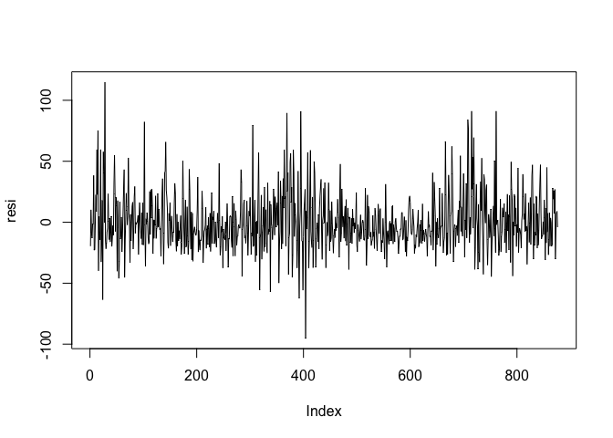
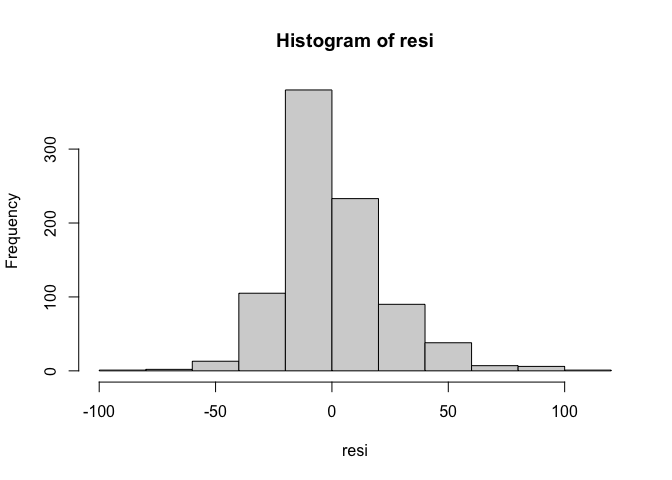
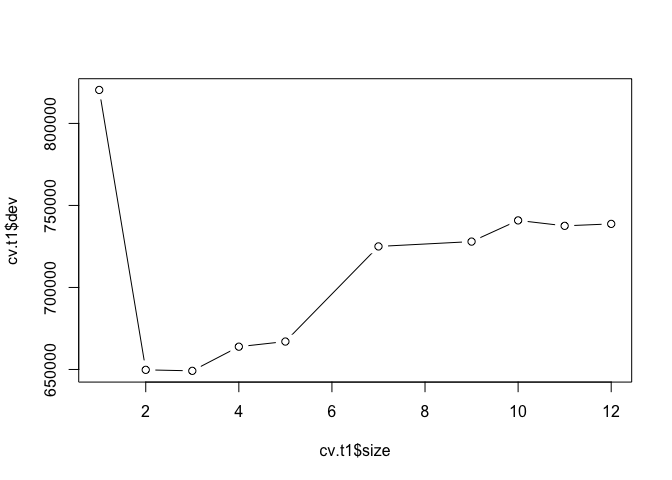
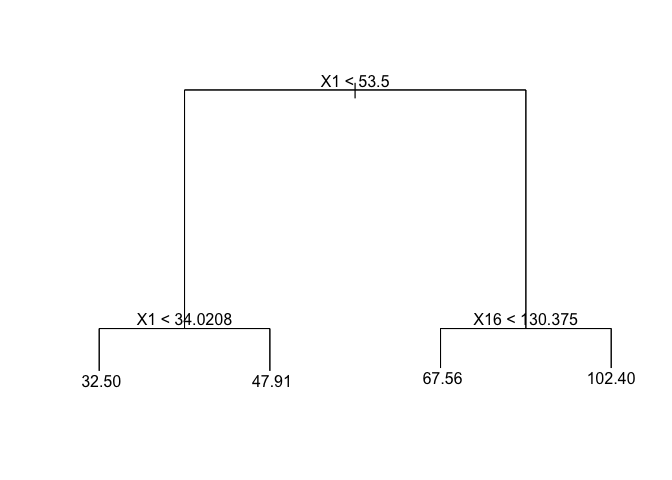

Arboles
================

## Métodos Basados en Árboles

Los árboles binarios son el componente básico de la mayoría de los
métodos estadísticos basados en árboles.\\ Binario quiere decir, que
cada rama del árbol puede ser dividido dentro de 2 sub-ramas Estos
árboles son comúnmente referidos a árboles de decisión.

``` r
da=read.table("GDPC1.txt",header=T) 
gdp = diff(log(da$rgdp))
tdx = da$year + (da$mon/12)
tdx = tdx[-1]
plot(tdx,gdp,xlab='año',ylab='tasa-PIB',type='l') 
```

<!-- -->

``` r
length(gdp)
```

    ## [1] 273

## Configuración y Arbol

*y**t* = *g*(*y*<sub>*t*</sub> − 1, *y*<sub>*t*</sub> − 2, *y*<sub>*t*</sub> − 3) + *a*<sub>*t*</sub>.
Se debe empezar desde el tiempo t=4 porque hay 3 condiciones iniciales.

``` r
gdp = round(gdp*100,2)
X = cbind(gdp[4:273],gdp[3:272],gdp[2:271],gdp[1:270])
colnames(X) = c("gdp","gdp1","gdp2","gdp3")
require(tree)
```

    ## Loading required package: tree

``` r
t1 = tree(gdp~.,data=data.frame(X))
summary(t1)
```

    ## 
    ## Regression tree:
    ## tree(formula = gdp ~ ., data = data.frame(X))
    ## Number of terminal nodes:  11 
    ## Residual mean deviance:  0.6654 = 172.3 / 259 
    ## Distribution of residuals:
    ##     Min.  1st Qu.   Median     Mean  3rd Qu.     Max. 
    ## -3.27300 -0.46200 -0.03298  0.00000  0.51020  3.25700

``` r
plot(t1)
text(t1,pretty=0)
```

<!-- -->

# Ejemplo completo

Considere la medición diaria de PM2.5 (materia particular fina con un
diámetro menor a 2.5 mm) de Shanghai, China, desde el 1 de enero de 2013
al 31 de mayo de 2017. Los datos originales son por hora, medidos en
unidades (𝜇g / m3), y se puede descargar de www.stateair.net, que es
parte del programa de monitoreo de la calidad del aire del Departamento
de Estado de EE. UU.\\ Tomamos el promedio de datos por hora como la
medida de PM2.5 para un día determinado. Para simplificar el análisis,
eliminamos la observación del 29 de febrero de 2016 para que cada año
tenga el mismo número de observaciones.\\ Se toman 365 observaciones, es
decir el último año como muestra de prueba, es decir nos quedan 1246
para el entrenamiento.\\ En el árbol, se ve que la variable rezago-1
yt\_1 es la variable explicativa más importante, y las variables
rezagadas estacionales yt\_370 y yt\_367 también son importantes.

``` r
library(NTS)
PM2.5 = scan(file="d-Shanghai-1317.txt")
tdx = c(1:length(PM2.5))/365+2013
par(mfcol=c(2,1))
plot(tdx,PM2.5,xlab='year',ylab='PM2.5',type='l') 
acf(PM2.5,lag=800)###Chequeamos un ciclo anual
```

<!-- -->

``` r
m1 = NNsetting(PM2.5,nfore=365,lags=c(1:10,365:370))###configuración prueba y entrenamiento al igual que las covariables.Es decir, los rezagos son y_1,....,y_10, y y_365,..,y_370, debido al ciclo anual.
names(m1)
```

    ## [1] "X"     "y"     "predX" "predY"

``` r
X= m1$X; y = m1$y; predX = m1$predX; predY = m1$predY
t1 = tree(y~.,data=data.frame(X))
par(mfcol=c(1,1))
plot(t1)
text(t1,pretty=0) 
```

<!-- -->

``` r
pt1 = predict(t1,newdata=data.frame(predX)) ###Predicción sobre la muestra de prueba
er3 = pt1-predY ###Errores de predicción
mean(abs(er3))
```

    ## [1] 16.3767

``` r
sqrt(mean(er3^2)) ###Promedio de los errores de predicción al cuadrado
```

    ## [1] 22.2729

# Residuales del Modelo

``` r
pp1 =predict(t1,newdata=data.frame(X))
resi= y-pp1
acf(resi,lag.max = 400)
```

<!-- -->

``` r
plot(resi,type='l')
```

<!-- -->

``` r
hist(resi)
```

<!-- --> \# Poda del Árbol

``` r
cv.t1 = cv.tree(t1)
plot(cv.t1$size,cv.t1$dev,type="b")##Parece que el tamaño del árbol es 4
```

<!-- -->

``` r
prune.t1= prune.tree(t1,best=4)
plot(prune.t1)   ####Gráfica de árbol con la poda
text(prune.t1,pretty=0)
```

<!-- -->

``` r
prun = predict(prune.t1,newdata=data.frame(predX)) 
per =predY-prun
mean(abs(per))
```

    ## [1] 17.11805

``` r
sqrt(mean(per^2))
```

    ## [1] 22.03309

``` r
pp1_tune =predict(prune.t1,newdata=data.frame(X))
resi_tune= y-pp1_tune
acf(resi_tune)
```

<!-- -->

``` r
plot(resi_tune,type='l')
```

<!-- -->
