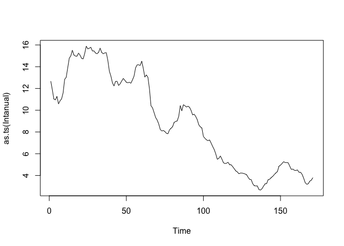
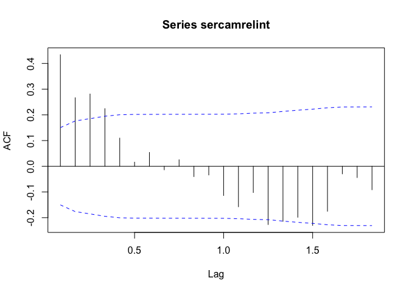
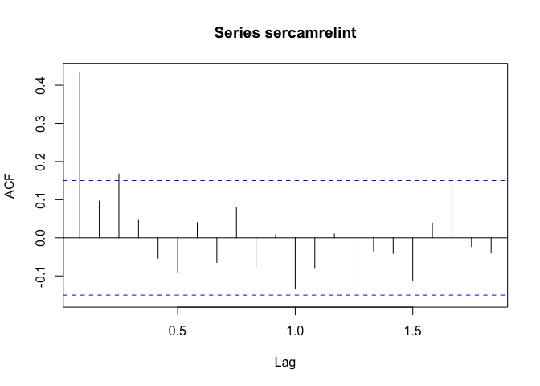
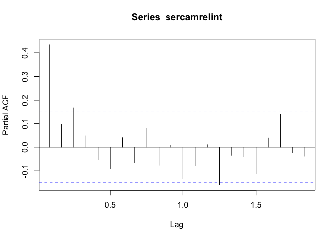

ARMA Estimation
================

Este Markdown Permite hacer la estimación de modelos ARMA.

Primero un ejemplo Simulado.
*X*<sub>*t*</sub> = *ϕ*<sub>1</sub>*X*<sub>*t* − 1</sub> + *ϕ*<sub>2</sub>*X*<sub>*t* − 2</sub> + *Z*<sub>*t*</sub> + *θ**Z*<sub>*t* − 1</sub>
con *ϕ*<sub>1</sub> =  − 0.2 y *ϕ*<sub>2</sub> =  − 0.48.

``` r
library(TSA)
```

    ## 
    ## Attaching package: 'TSA'

    ## The following objects are masked from 'package:stats':
    ## 
    ##     acf, arima

    ## The following object is masked from 'package:utils':
    ## 
    ##     tar

``` r
library(lmtest)
```

    ## Loading required package: zoo

    ## 
    ## Attaching package: 'zoo'

    ## The following objects are masked from 'package:base':
    ## 
    ##     as.Date, as.Date.numeric

``` r
library(forecast)
```

    ## Registered S3 method overwritten by 'quantmod':
    ##   method            from
    ##   as.zoo.data.frame zoo

    ## Registered S3 methods overwritten by 'forecast':
    ##   method       from
    ##   fitted.Arima TSA 
    ##   plot.Arima   TSA

``` r
library(tseries)
phi1=0.2
phi2=0.48
theta=0.7
Tlength=200
set.seed(123)
y=arima.sim(list(order =c(2,0,1),ar=c(phi1,phi2),ma=c(theta)),n = Tlength)
#x11()
plot(y)
```

<!-- -->

``` r
###Búsqueda de p,q vía acf y pacf
acf(y)
```

<!-- -->

``` r
acf(y,ci.type='ma') ###q máximo 4
```

<!-- -->

``` r
pacf(y) ###p máximo 1
```

<!-- -->

``` r
##Se puede postular un ARMA(1,4), pero este sería menos parsimonioso.
#####Arima Automático
modelo.automatico1=auto.arima(y,d=0,D=0,max.p=1,max.q=4,start.p=0, start.q=0,seasonal=FALSE,max.order=5,stationary=TRUE,ic="aicc",stepwise=FALSE,allowmean = TRUE)  ###Se propuso un modelo ARMA(1,4), aunque varioscoeficientes no son significativo
modelo.automatico1
```

    ## Series: y 
    ## ARIMA(1,0,4) with zero mean 
    ## 
    ## Coefficients:
    ##          ar1    ma1      ma2     ma3      ma4
    ##       0.8300  0.034  -0.2309  0.0868  -0.1932
    ## s.e.  0.1175  0.138   0.1249  0.0973   0.0925
    ## 
    ## sigma^2 estimated as 0.8592:  log likelihood=-266.66
    ## AIC=545.31   AICc=545.75   BIC=565.1

``` r
coeftest(modelo.automatico1)
```

    ## 
    ## z test of coefficients:
    ## 
    ##      Estimate Std. Error z value  Pr(>|z|)    
    ## ar1  0.830021   0.117509  7.0635 1.624e-12 ***
    ## ma1  0.034001   0.138006  0.2464   0.80539    
    ## ma2 -0.230903   0.124883 -1.8489   0.06447 .  
    ## ma3  0.086761   0.097341  0.8913   0.37276    
    ## ma4 -0.193243   0.092497 -2.0892   0.03669 *  
    ## ---
    ## Signif. codes:  0 '***' 0.001 '**' 0.01 '*' 0.05 '.' 0.1 ' ' 1

``` r
######
modelo.propuesto1=forecast::Arima(y,order=c(1,0,0)) ###AR(1)
modelo.propuesto1
```

    ## Series: y 
    ## ARIMA(1,0,0) with non-zero mean 
    ## 
    ## Coefficients:
    ##          ar1    mean
    ##       0.7406  0.0179
    ## s.e.  0.0469  0.2535
    ## 
    ## sigma^2 estimated as 0.8985:  log likelihood=-272.48
    ## AIC=550.95   AICc=551.08   BIC=560.85

``` r
coeftest(modelo.propuesto1)
```

    ## 
    ## z test of coefficients:
    ## 
    ##           Estimate Std. Error z value Pr(>|z|)    
    ## ar1       0.740580   0.046936 15.7785   <2e-16 ***
    ## intercept 0.017940   0.253505  0.0708   0.9436    
    ## ---
    ## Signif. codes:  0 '***' 0.001 '**' 0.01 '*' 0.05 '.' 0.1 ' ' 1

``` r
####Reestimación quitando la constante
modelo.propuesto1=forecast::Arima(y,order=c(1,0,0),include.mean=FALSE) ###AR(1)
####Se puede usar la función arima de stats o TSA
coeftest(modelo.propuesto1)  ###Todos los parámetros son significativos
```

    ## 
    ## z test of coefficients:
    ## 
    ##     Estimate Std. Error z value  Pr(>|z|)    
    ## ar1  0.74067    0.04692  15.786 < 2.2e-16 ***
    ## ---
    ## Signif. codes:  0 '***' 0.001 '**' 0.01 '*' 0.05 '.' 0.1 ' ' 1

``` r
AIC(modelo.propuesto1)
```

    ## [1] 548.9584

``` r
BIC(modelo.propuesto1)
```

    ## [1] 555.555

``` r
modelo.propuesto1
```

    ## Series: y 
    ## ARIMA(1,0,0) with zero mean 
    ## 
    ## Coefficients:
    ##          ar1
    ##       0.7407
    ## s.e.  0.0469
    ## 
    ## sigma^2 estimated as 0.894:  log likelihood=-272.48
    ## AIC=548.96   AICc=549.02   BIC=555.55

``` r
####Ajustar un modelo MA puro


####Use el argumento fixed=c(NA,0,NA) en la función ARIMA#

modelo.propuesto_arma=forecast::Arima(y,order=c(1,0,4),include.mean=FALSE,fixed=c(NA,0,NA,0,NA)) ###ARMA(1,4)
coeftest(modelo.propuesto_arma)
```

    ## 
    ## z test of coefficients:
    ## 
    ##      Estimate Std. Error z value  Pr(>|z|)    
    ## ar1  0.878877   0.046708 18.8163 < 2.2e-16 ***
    ## ma2 -0.267645   0.086176 -3.1058  0.001898 ** 
    ## ma4 -0.211492   0.080634 -2.6228  0.008720 ** 
    ## ---
    ## Signif. codes:  0 '***' 0.001 '**' 0.01 '*' 0.05 '.' 0.1 ' ' 1

``` r
####Ajustar un modelo ARMA(p,q) mixto

####Ajuste del modelo Teórico
forecast::Arima(y,order=c(2,0,1),include.mean=FALSE)
```

    ## Series: y 
    ## ARIMA(2,0,1) with zero mean 
    ## 
    ## Coefficients:
    ##           ar1     ar2     ma1
    ##       -0.0730  0.5580  0.9573
    ## s.e.   0.0714  0.0697  0.0316
    ## 
    ## sigma^2 estimated as 0.839:  log likelihood=-265.48
    ## AIC=538.97   AICc=539.17   BIC=552.16

``` r
forecast::Arima(y,order=c(2,0,1),include.mean=FALSE,fixed=c(0,NA,NA))
```

    ## Series: y 
    ## ARIMA(2,0,1) with zero mean 
    ## 
    ## Coefficients:
    ##       ar1     ar2     ma1
    ##         0  0.5357  0.9328
    ## s.e.    0  0.0738  0.0388
    ## 
    ## sigma^2 estimated as 0.8391:  log likelihood=-265.97
    ## AIC=537.93   AICc=538.06   BIC=547.83

``` r
#######Tipos de interés interbancario a un año medido mensualmente
tipos88  <- read.table("~/Documents/GitHub/TimeSeries/Bases de Datos/Estacionarias/tipos88.dat", quote="\"", comment.char="")
Intanual=tipos88$V5  #Tipo de interés Anual
?ts
plot(as.ts(Intanual))
```

<!-- -->

``` r
###Se trabajará con los cambios relativos o serie de retornos
camrelintanual=log(Intanual[2:length(Intanual)]/Intanual[1:(length(Intanual)-1)])
sercamrelint=ts(camrelintanual,start=c(1988,01),frequency=12)
sercamrelint
```

    ##                Jan           Feb           Mar           Apr           May
    ## 1988 -0.0647016108 -0.0741533020 -0.0070054419  0.0293291983 -0.0632213053
    ## 1989  0.0139674578  0.0344748736 -0.0294196546 -0.0059224928 -0.0012020838
    ## 1990  0.0038282443  0.0052716944 -0.0217734011  0.0009706540 -0.0130856983
    ## 1991 -0.0473362125 -0.0706593752 -0.0339776755 -0.0481090624 -0.0231102722
    ## 1992 -0.0149215258 -0.0035059797  0.0031081914 -0.0065464069  0.0244483873
    ## 1993 -0.0589149305  0.0147553635 -0.0165192353 -0.0852823342 -0.1391477367
    ## 1994  0.0060385913 -0.0121138688 -0.0203524613 -0.0056001165  0.0452893463
    ## 1995 -0.0471507488  0.0551783149 -0.0092757060 -0.0105269213  0.0060978750
    ## 1996 -0.0217146052 -0.0128283028 -0.0978837216 -0.0221283356 -0.0194630166
    ## 1997  0.0162605209  0.0369435152 -0.0513841993 -0.0618754037 -0.0136321488
    ## 1998 -0.0205721541 -0.0400524677  0.0143200538  0.0000000000 -0.0071343941
    ## 1999 -0.0065574005 -0.0032948959 -0.1116139846 -0.0186225121  0.0441248049
    ## 2000  0.0424533163  0.0360182992  0.0279087881  0.1065066476  0.0204088716
    ## 2001  0.0065574005 -0.0242569776 -0.0044742804  0.0111483875 -0.0500104206
    ## 2002  0.0255333020  0.0624354709                                          
    ##                Jun           Jul           Aug           Sep           Oct
    ## 1988  0.0259173638  0.0157958089  0.0494844305  0.1018021619  0.0140727599
    ## 1989  0.0188653617 -0.0127365037 -0.0195157587 -0.0033239525  0.0330813019
    ## 1990 -0.0039395980  0.0076678948  0.0255887121 -0.0254581467 -0.0079958481
    ## 1991  0.0332037416  0.0007904514 -0.0306482071  0.0131122882  0.0195881731
    ## 1992  0.0264563655  0.0558804584  0.0200256113  0.0000000000 -0.0038173382
    ## 1993 -0.0182263892 -0.0436960290 -0.0470847509 -0.0251694779 -0.0403551732
    ## 1994  0.0177723350  0.0162837139  0.0452920643  0.0106473407  0.0054477871
    ## 1995 -0.0088200233 -0.0286382759 -0.0419413010  0.0064563382 -0.0214024116
    ## 1996 -0.0103613554  0.0093988252 -0.0412864028 -0.0450123628 -0.0428987345
    ## 1997  0.0058651195  0.0154741966 -0.0431439460 -0.0020060187 -0.0347328069
    ## 1998 -0.0120049461 -0.0170527884 -0.0607781963 -0.0508811215 -0.0055096558
    ## 1999  0.0828059037  0.0672253058  0.0092450581  0.1019805770  0.0137553751
    ## 2000  0.0298529631  0.0327898228 -0.0152966654  0.0000000000 -0.0057971177
    ## 2001  0.0023282898 -0.0451919942 -0.0890040711 -0.1154586116 -0.0489394290
    ## 2002                                                                      
    ##                Nov           Dec
    ## 1988  0.0655985012  0.0614237306
    ## 1989  0.0439829152 -0.0160439727
    ## 1990  0.0046610949  0.0015706810
    ## 1991  0.0189797551 -0.0127697756
    ## 1992  0.0271098835 -0.0468516019
    ## 1993 -0.0593814004 -0.0181288649
    ## 1994  0.0461520378  0.0984334555
    ## 1995 -0.0316734437 -0.0536234104
    ## 1996 -0.0643298182 -0.0871631566
    ## 1997 -0.0403023790 -0.0442550090
    ## 1998 -0.1109006960 -0.0571584138
    ## 1999  0.0401660417  0.0284624647
    ## 2000 -0.0598981416 -0.0637158144
    ## 2001  0.0155524130  0.0714589640
    ## 2002

``` r
plot(sercamrelint)
```

<!-- -->

``` r
acf(sercamrelint)
```

<!-- -->

``` r
acf(sercamrelint,ci.type='ma')##Rezago máximo q=4
```

<!-- -->

``` r
acf(sercamrelint,type='partial')##Rezago máximo p=3
```

<!-- -->

``` r
pacf(sercamrelint)
```

<!-- -->

``` r
###Se puede proponer un modelo ARMA(3,4)
```

``` r
library(lmtest)
ARPURO=arima(sercamrelint,order=c(3,0,0),include.mean = TRUE)
MAPURO=arima(sercamrelint,order=c(0,0,4),include.mean = TRUE)
ARMAMIXTO=arima(sercamrelint,order=c(3,0,4),include.mean = TRUE)
coeftest(ARPURO)
```

    ## 
    ## z test of coefficients:
    ## 
    ##             Estimate Std. Error z value  Pr(>|z|)    
    ## ar1        0.3819400  0.0756544  5.0485 4.453e-07 ***
    ## ar2        0.0341526  0.0815331  0.4189   0.67530    
    ## ar3        0.1803434  0.0767639  2.3493   0.01881 *  
    ## intercept -0.0068888  0.0069429 -0.9922   0.32109    
    ## ---
    ## Signif. codes:  0 '***' 0.001 '**' 0.01 '*' 0.05 '.' 0.1 ' ' 1

``` r
coeftest(MAPURO)
```

    ## 
    ## z test of coefficients:
    ## 
    ##             Estimate Std. Error z value  Pr(>|z|)    
    ## ma1        0.3305780  0.0747982  4.4196 9.888e-06 ***
    ## ma2        0.1711079  0.0772777  2.2142  0.026816 *  
    ## ma3        0.2387500  0.0811113  2.9435  0.003245 ** 
    ## ma4        0.2340952  0.0953199  2.4559  0.014054 *  
    ## intercept -0.0068496  0.0055750 -1.2286  0.219212    
    ## ---
    ## Signif. codes:  0 '***' 0.001 '**' 0.01 '*' 0.05 '.' 0.1 ' ' 1

``` r
coeftest(ARMAMIXTO)
```

    ## 
    ## z test of coefficients:
    ## 
    ##             Estimate Std. Error z value Pr(>|z|)
    ## ar1        1.1445303  0.8170145  1.4009   0.1613
    ## ar2       -0.8705457  1.0994822 -0.7918   0.4285
    ## ar3        0.3557508  0.5892339  0.6038   0.5460
    ## ma1       -0.7754598  0.8169786 -0.9492   0.3425
    ## ma2        0.6378161  0.8280376  0.7703   0.4411
    ## ma3        0.0272645  0.3747212  0.0728   0.9420
    ## ma4       -0.0161990  0.2509859 -0.0645   0.9485
    ## intercept -0.0067449  0.0065686 -1.0268   0.3045

``` r
summary(ARPURO)
```

    ## 
    ## Call:
    ## arima(x = sercamrelint, order = c(3, 0, 0), include.mean = TRUE)
    ## 
    ## Coefficients:
    ##          ar1     ar2     ar3  intercept
    ##       0.3819  0.0342  0.1803    -0.0069
    ## s.e.  0.0757  0.0815  0.0768     0.0069
    ## 
    ## sigma^2 estimated as 0.001373:  log likelihood = 318.84,  aic = -629.68
    ## 
    ## Training set error measures:

    ## Warning in trainingaccuracy(object, test, d, D): test elements must be within
    ## sample

    ##               ME RMSE MAE MPE MAPE
    ## Training set NaN  NaN NaN NaN  NaN

``` r
ARPURO_fixed=stats::arima(sercamrelint,order=c(3,0,0),include.mean = FALSE,fixed=c(NA,0,NA),method = c("CSS-ML"))
```

    ## Warning in stats::arima(sercamrelint, order = c(3, 0, 0), include.mean =
    ## FALSE, : some AR parameters were fixed: setting transform.pars = FALSE

``` r
coeftest(ARPURO_fixed)  
```

    ## 
    ## z test of coefficients:
    ## 
    ##     Estimate Std. Error z value  Pr(>|z|)    
    ## ar1 0.402301   0.070021  5.7454 9.169e-09 ***
    ## ar3 0.201510   0.071035  2.8368  0.004557 ** 
    ## ---
    ## Signif. codes:  0 '***' 0.001 '**' 0.01 '*' 0.05 '.' 0.1 ' ' 1

``` r
ARPURO_fixed1=forecast::Arima(sercamrelint,order=c(3,0,0),include.mean = FALSE,fixed=c(NA,0,NA),method = c("CSS-ML"))
coeftest(ARPURO_fixed1)
```

    ## 
    ## z test of coefficients:
    ## 
    ##     Estimate Std. Error z value  Pr(>|z|)    
    ## ar1 0.402301   0.070021  5.7454 9.169e-09 ***
    ## ar3 0.201510   0.071035  2.8368  0.004557 ** 
    ## ---
    ## Signif. codes:  0 '***' 0.001 '**' 0.01 '*' 0.05 '.' 0.1 ' ' 1

``` r
summary(ARPURO_fixed1)
```

    ## Series: sercamrelint 
    ## ARIMA(3,0,0) with zero mean 
    ## 
    ## Coefficients:
    ##          ar1  ar2     ar3
    ##       0.4023    0  0.2015
    ## s.e.  0.0700    0  0.0710
    ## 
    ## sigma^2 estimated as 0.001398:  log likelihood=318.26
    ## AIC=-630.52   AICc=-630.38   BIC=-621.11
    ## 
    ## Training set error measures:
    ##                        ME       RMSE       MAE MPE MAPE      MASE        ACF1
    ## Training set -0.002356406 0.03717355 0.0286276 NaN  Inf 0.5849325 -0.03005276

``` r
###Note que uno usa la función arima y el otro ARIMA
```

``` r
PronosticosAR12=forecast(ARPURO_fixed1,h=12,level=0.95)  ###Es mejor usar el objeto de la función ARIMA
plot(PronosticosAR12)
```

<!-- -->

Hacer el mismo ajuste para la serie de tiempo de precipitación mensual
en Londres de Enero 1983 to Abril 1994

``` r
m.precipitationLondon <- read.table("~/Documents/GitHub/TimeSeries/Bases de Datos/Estacionarias/m-precipitationLondon.txt", quote="\"", comment.char="")

LondresPrecip=ts(m.precipitationLondon,frequency = 12, start = c(1983,01))
plot(LondresPrecip)
```

<!-- -->

``` r
# An?lisis de residuales
residuales=ARPURO_fixed1$residuals
plot(residuales)
```

<!-- -->

``` r
acf(residuales)
```

<!-- -->

``` r
pacf(residuales)
```

<!-- -->

``` r
#Test de normalidad
jarque.bera.test(residuales)
```

    ## 
    ##  Jarque Bera Test
    ## 
    ## data:  residuales
    ## X-squared = 0.62858, df = 2, p-value = 0.7303

``` r
#Test de autocorrelaci?n
length(residuales)/4
```

    ## [1] 42.5

``` r
sqrt(length(residuales))
```

    ## [1] 13.0384

``` r
Box.test(residuales, lag =20 , type = "Ljung-Box", fitdf = 2)
```

    ## 
    ##  Box-Ljung test
    ## 
    ## data:  residuales
    ## X-squared = 23.304, df = 18, p-value = 0.1792

``` r
###Estad?sticas CUSUM
res=residuales
cum=cumsum(res)/sd(res)
N=length(res)
cumq=cumsum(res^2)/sum(res^2)
Af=0.948 ###Cuantil del 95% para la estad?stica cusum
co=0.12531####Valor del cuantil aproximado para cusumsq para n/2
LS=Af*sqrt(N)+2*Af*c(1:length(res))/sqrt(N)
LI=-LS
LQS=co+(1:length(res))/N
LQI=-co+(1:length(res))/N
plot(cum,type="l",ylim=c(min(LI),max(LS)),xlab="t",ylab="",main="CUSUM")
lines(LS,type="S",col="red")
lines(LI,type="S",col="red")
```

<!-- -->

``` r
#CUSUMSQ
plot(cumq,type="l",xlab="t",ylab="",main="CUSUMSQ")                      
lines(LQS,type="S",col="red")                                                                           
lines(LQI,type="S",col="red")
```

<!-- -->

``` r
?auto.arima
auto.arima(sercamrelint,max.p = 3,max.q=4,max.order = 7,stationary = TRUE,seasonal = FALSE,stepwise = FALSE,ic='bic')
```

    ## Series: sercamrelint 
    ## ARIMA(1,0,1) with zero mean 
    ## 
    ## Coefficients:
    ##          ar1      ma1
    ##       0.7695  -0.4131
    ## s.e.  0.0942   0.1330
    ## 
    ## sigma^2 estimated as 0.001423:  log likelihood=316.83
    ## AIC=-627.66   AICc=-627.51   BIC=-618.25

``` r
#auto.arima(sercamrelint,stationary = TRUE)
```

``` r
h=1
lserie=length(sercamrelint)
ntrain=trunc(length(sercamrelint)*0.8)
ntrain
```

    ## [1] 136

``` r
time(sercamrelint)
```

    ##           Jan      Feb      Mar      Apr      May      Jun      Jul      Aug
    ## 1988 1988.000 1988.083 1988.167 1988.250 1988.333 1988.417 1988.500 1988.583
    ## 1989 1989.000 1989.083 1989.167 1989.250 1989.333 1989.417 1989.500 1989.583
    ## 1990 1990.000 1990.083 1990.167 1990.250 1990.333 1990.417 1990.500 1990.583
    ## 1991 1991.000 1991.083 1991.167 1991.250 1991.333 1991.417 1991.500 1991.583
    ## 1992 1992.000 1992.083 1992.167 1992.250 1992.333 1992.417 1992.500 1992.583
    ## 1993 1993.000 1993.083 1993.167 1993.250 1993.333 1993.417 1993.500 1993.583
    ## 1994 1994.000 1994.083 1994.167 1994.250 1994.333 1994.417 1994.500 1994.583
    ## 1995 1995.000 1995.083 1995.167 1995.250 1995.333 1995.417 1995.500 1995.583
    ## 1996 1996.000 1996.083 1996.167 1996.250 1996.333 1996.417 1996.500 1996.583
    ## 1997 1997.000 1997.083 1997.167 1997.250 1997.333 1997.417 1997.500 1997.583
    ## 1998 1998.000 1998.083 1998.167 1998.250 1998.333 1998.417 1998.500 1998.583
    ## 1999 1999.000 1999.083 1999.167 1999.250 1999.333 1999.417 1999.500 1999.583
    ## 2000 2000.000 2000.083 2000.167 2000.250 2000.333 2000.417 2000.500 2000.583
    ## 2001 2001.000 2001.083 2001.167 2001.250 2001.333 2001.417 2001.500 2001.583
    ## 2002 2002.000 2002.083                                                      
    ##           Sep      Oct      Nov      Dec
    ## 1988 1988.667 1988.750 1988.833 1988.917
    ## 1989 1989.667 1989.750 1989.833 1989.917
    ## 1990 1990.667 1990.750 1990.833 1990.917
    ## 1991 1991.667 1991.750 1991.833 1991.917
    ## 1992 1992.667 1992.750 1992.833 1992.917
    ## 1993 1993.667 1993.750 1993.833 1993.917
    ## 1994 1994.667 1994.750 1994.833 1994.917
    ## 1995 1995.667 1995.750 1995.833 1995.917
    ## 1996 1996.667 1996.750 1996.833 1996.917
    ## 1997 1997.667 1997.750 1997.833 1997.917
    ## 1998 1998.667 1998.750 1998.833 1998.917
    ## 1999 1999.667 1999.750 1999.833 1999.917
    ## 2000 2000.667 2000.750 2000.833 2000.917
    ## 2001 2001.667 2001.750 2001.833 2001.917
    ## 2002

``` r
time(sercamrelint)[ntrain]###Me entrega la ultima fecha de la posici?n ntrain
```

    ## [1] 1999.25

``` r
train=window(sercamrelint,end=c(1999,4))
test=window(sercamrelint,start=c(1999,5))
length(train)
```

    ## [1] 136

``` r
ntest=length(test)
ntest
```

    ## [1] 34

``` r
fcmat=matrix(0,nrow=ntest,ncol=h)
for(i in 1:ntest)
{
  x=window(sercamrelint,end=c(1999,4)+(i-1)/12)
  print(length(x))
  refit=Arima(x,order=c(3,0,0),include.mean = FALSE,fixed=c(NA,0,NA),method = c("CSS-ML"))
  fcmat[i,]=forecast(refit,h=h)$mean
}
```

    ## [1] 136
    ## [1] 137
    ## [1] 138
    ## [1] 139
    ## [1] 140
    ## [1] 141
    ## [1] 142
    ## [1] 143
    ## [1] 144
    ## [1] 145
    ## [1] 146
    ## [1] 147
    ## [1] 149
    ## [1] 150
    ## [1] 151
    ## [1] 152
    ## [1] 153
    ## [1] 154
    ## [1] 155
    ## [1] 156
    ## [1] 157
    ## [1] 158
    ## [1] 159
    ## [1] 160
    ## [1] 162
    ## [1] 163
    ## [1] 164
    ## [1] 165
    ## [1] 166
    ## [1] 167
    ## [1] 168
    ## [1] 169

    ## Warning in window.default(x, ...): 'end' value not changed

    ## [1] 170

    ## Warning in window.default(x, ...): 'end' value not changed

    ## [1] 170

``` r
fcmat
```

    ##                [,1]
    ##  [1,] -7.265072e-03
    ##  [2,] -1.897456e-02
    ##  [3,]  2.593002e-02
    ##  [4,]  3.606162e-02
    ##  [5,]  2.244027e-02
    ##  [6,]  5.542205e-02
    ##  [7,]  7.236603e-03
    ##  [8,]  4.010120e-02
    ##  [9,]  1.360211e-02
    ## [10,]  2.530747e-02
    ## [11,]  2.017208e-02
    ## [12,]  2.077000e-02
    ## [13,]  1.463295e-02
    ## [14,]  3.881117e-02
    ## [15,]  1.711247e-02
    ## [16,]  2.315418e-03
    ## [17,]  8.509417e-03
    ## [18,] -6.006847e-03
    ## [19,] -2.137076e-02
    ## [20,] -2.488595e-02
    ## [21,] -1.316628e-02
    ## [22,] -2.538358e-02
    ## [23,]  8.568255e-05
    ## [24,] -2.262414e-03
    ## [25,]  3.755595e-03
    ## [26,] -2.890882e-02
    ## [27,] -3.116341e-02
    ## [28,] -5.636947e-02
    ## [29,] -4.195016e-02
    ## [30,] -2.224939e-02
    ## [31,]  1.845617e-02
    ## [32,]  1.328989e-02
    ## [33,]  3.951754e-02
    ## [34,]  3.951754e-02

``` r
ECM=mean(fcmat^2)

##Falta elevar al cudrado y hacer le promedio.
```
