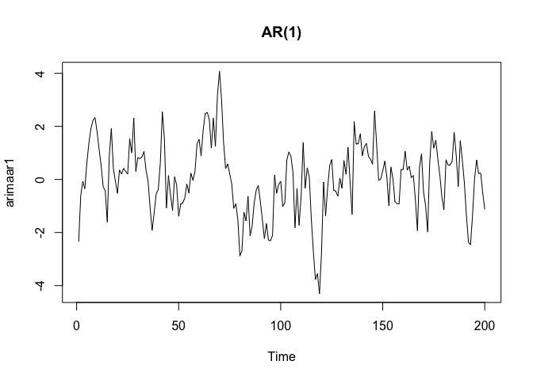
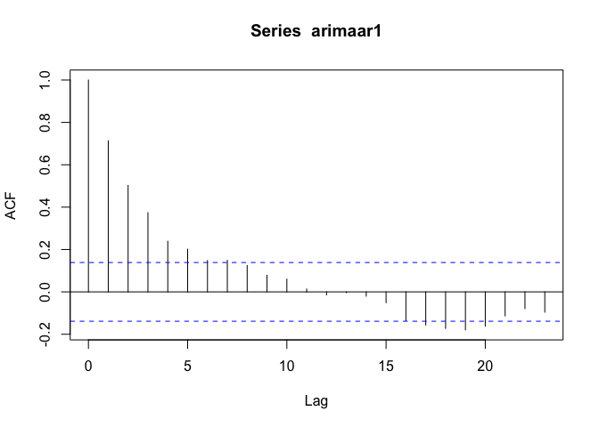
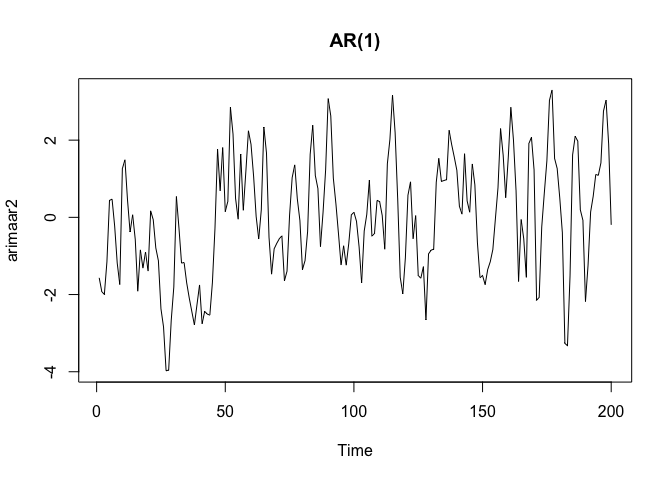
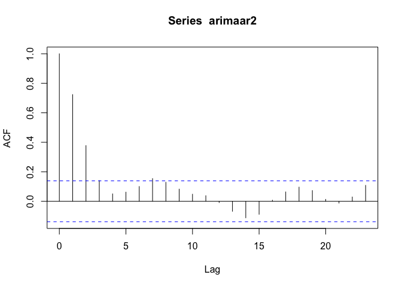
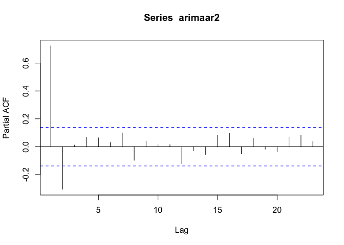

Identificación AR y MA Puros
================

## Identificación MA Puros

En este script encontraremos la manera de indentificar procesos MA puros
y AR Puros. Empezamos con Ma Puros.

``` r
#####Identificación MA y AR puros
####Identificación de un MA puro
set.seed(1)
y=rnorm(200,0,1)
x11()
acf(y,lag.max=sqrt(length(y)))
```

<!-- -->

``` r
####Ejemplo MA(1)
set.seed(12345)
theta1=0.7
theta2=0.5
Tlength=200
arimaej=arima.sim(list(order = c(0,0,1),ma=c(theta1)), n = Tlength)
plot(arimaej,main='MA(1)')
```

<!-- -->

``` r
acf(arimaej)####Bandas para probar no autocorrelación
```

<!-- -->

``` r
acf(arimaej,ci.type='ma',lag.max = trunc((Tlength)/4)) ####Bandas para probar MA, note que es consecuente con un MA(1)
```

<!-- -->

``` r
###Ejemplo MA(2)
set.seed(123456)
arimaej=arima.sim(list(order = c(0,0,2),ma=c(theta1,theta2)), n = Tlength)
plot(arimaej,main='MA(2)')
```

<!-- -->

``` r
acf(arimaej,ci.type='ma')####Bandas para probar no autocorrelación
```

<!-- -->

``` r
###Simular un AR(1) phi=0.8
arimaej=arima.sim(list(order = c(1,0,0),ar=c(0.8)), n = Tlength)
acf(arimaej,ci.type='ma')
```

<!-- -->

## Identificación AR Puros

You can also embed plots, for example:

``` r
######Ejemplos Autoregresivos AR(p)
####Ejemplo AR(1)
set.seed(123)
phi1=0.8
Tlength=200
arimaar1=arima.sim(list(order = c(1,0,0),ar = c(phi1)), n = Tlength)
plot(arimaar1,main='AR(1)')
```

<!-- -->

``` r
acf(arimaar1)
```

<!-- -->

``` r
pacf(arimaar1)
```

<!-- -->

``` r
####Ejemplo AR(1)
set.seed(1234)
phi1=0.8
phi2=-0.2
Tlength=200
arimaar2=arima.sim(list(order = c(2,0,0),ar = c(phi1,phi2)), n = Tlength)
plot(arimaar2,main='AR(1)')
```

<!-- -->

``` r
acf(arimaar2)
```

<!-- -->

``` r
pacf(arimaar2)
```

<!-- -->
