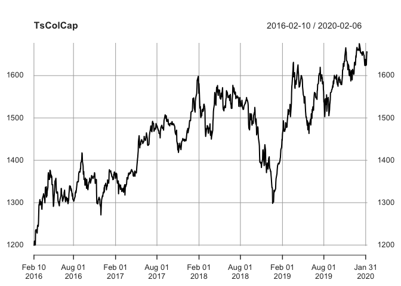
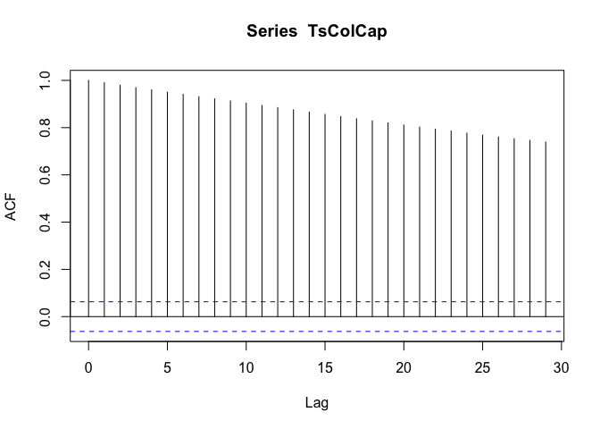

Importacion
================

## Creación de un objeto de Series de Tiempo y gráficas

## Serie de interés

Este script se basa en el libro: Hands-on Time Series Analysis with
R(2019) del autor Rami Krispin.

``` r
library(TSstudio)
tipos88 <- read.table("tipos88.dat", quote="\"", comment.char="")
Intanual=tipos88$V5  #Tipo de interés Anual
plot(as.ts(Intanual))
```

<!-- -->

## Creando y graficando la serie de retornos para ver los cambios

El objeto ts es un formato para series de tiempo univariadas regulares.
Las caraterísticas de una serie regular son; Ciclo o periodo(unidad de
tiempo regular y repetitiva que divide la serie en ubconjuntos
consecutivos e igualmente espaciados), Frecuencia(define la longitud o
el número de unidades de un cíclo) y las marcas de tiempo(provee el
tiempo en que cada observación fue obtenida y puede ser usada como
índice de la serie. La diferencia(*δ*) entre los tiempos de dos
observaciones consecutivas debe ser igual).

Este objeto ts tiene dos elementos: los valores de la serie y sus
correspondientes marcas de tiempo.

El problema con el objeto ts es que las marcas de tiempo no soporta
mútiples cíclos, es decir, series diarias con ciclos semanales y ciclos
anuales. Adicionalmente, en los casos en que la marca de tiempo de la
serie tenga más de dos elementos, como la fecha o la hora, no es posible
recuperar el valor original de la marca de tiempo de la serie, ya que
uno o más elementos se pierden durante el proceso de transformación. Ver
ejemplo página 73, en donde el día de la fecha se pierde al
transformarse el data frame en una objeto ts.

``` r
camrelintanual=log(Intanual[2:length(Intanual)]/Intanual[1:(length(Intanual)-1)])
sercamrelint=ts(camrelintanual,start=c(1988,01),frequency=12)
sercamrelint
```

    ##                Jan           Feb           Mar           Apr           May
    ## 1988 -0.0647016108 -0.0741533020 -0.0070054419  0.0293291983 -0.0632213053
    ## 1989  0.0139674578  0.0344748736 -0.0294196546 -0.0059224928 -0.0012020838
    ## 1990  0.0038282443  0.0052716944 -0.0217734011  0.0009706540 -0.0130856983
    ## 1991 -0.0473362125 -0.0706593752 -0.0339776755 -0.0481090624 -0.0231102722
    ## 1992 -0.0149215258 -0.0035059797  0.0031081914 -0.0065464069  0.0244483873
    ## 1993 -0.0589149305  0.0147553635 -0.0165192353 -0.0852823342 -0.1391477367
    ## 1994  0.0060385913 -0.0121138688 -0.0203524613 -0.0056001165  0.0452893463
    ## 1995 -0.0471507488  0.0551783149 -0.0092757060 -0.0105269213  0.0060978750
    ## 1996 -0.0217146052 -0.0128283028 -0.0978837216 -0.0221283356 -0.0194630166
    ## 1997  0.0162605209  0.0369435152 -0.0513841993 -0.0618754037 -0.0136321488
    ## 1998 -0.0205721541 -0.0400524677  0.0143200538  0.0000000000 -0.0071343941
    ## 1999 -0.0065574005 -0.0032948959 -0.1116139846 -0.0186225121  0.0441248049
    ## 2000  0.0424533163  0.0360182992  0.0279087881  0.1065066476  0.0204088716
    ## 2001  0.0065574005 -0.0242569776 -0.0044742804  0.0111483875 -0.0500104206
    ## 2002  0.0255333020  0.0624354709                                          
    ##                Jun           Jul           Aug           Sep           Oct
    ## 1988  0.0259173638  0.0157958089  0.0494844305  0.1018021619  0.0140727599
    ## 1989  0.0188653617 -0.0127365037 -0.0195157587 -0.0033239525  0.0330813019
    ## 1990 -0.0039395980  0.0076678948  0.0255887121 -0.0254581467 -0.0079958481
    ## 1991  0.0332037416  0.0007904514 -0.0306482071  0.0131122882  0.0195881731
    ## 1992  0.0264563655  0.0558804584  0.0200256113  0.0000000000 -0.0038173382
    ## 1993 -0.0182263892 -0.0436960290 -0.0470847509 -0.0251694779 -0.0403551732
    ## 1994  0.0177723350  0.0162837139  0.0452920643  0.0106473407  0.0054477871
    ## 1995 -0.0088200233 -0.0286382759 -0.0419413010  0.0064563382 -0.0214024116
    ## 1996 -0.0103613554  0.0093988252 -0.0412864028 -0.0450123628 -0.0428987345
    ## 1997  0.0058651195  0.0154741966 -0.0431439460 -0.0020060187 -0.0347328069
    ## 1998 -0.0120049461 -0.0170527884 -0.0607781963 -0.0508811215 -0.0055096558
    ## 1999  0.0828059037  0.0672253058  0.0092450581  0.1019805770  0.0137553751
    ## 2000  0.0298529631  0.0327898228 -0.0152966654  0.0000000000 -0.0057971177
    ## 2001  0.0023282898 -0.0451919942 -0.0890040711 -0.1154586116 -0.0489394290
    ## 2002                                                                      
    ##                Nov           Dec
    ## 1988  0.0655985012  0.0614237306
    ## 1989  0.0439829152 -0.0160439727
    ## 1990  0.0046610949  0.0015706810
    ## 1991  0.0189797551 -0.0127697756
    ## 1992  0.0271098835 -0.0468516019
    ## 1993 -0.0593814004 -0.0181288649
    ## 1994  0.0461520378  0.0984334555
    ## 1995 -0.0316734437 -0.0536234104
    ## 1996 -0.0643298182 -0.0871631566
    ## 1997 -0.0403023790 -0.0442550090
    ## 1998 -0.1109006960 -0.0571584138
    ## 1999  0.0401660417  0.0284624647
    ## 2000 -0.0598981416 -0.0637158144
    ## 2001  0.0155524130  0.0714589640
    ## 2002

``` r
plot(sercamrelint,main="Cambios relativos")
```

<!-- -->

``` r
plot.ts(sercamrelint)
```

<!-- -->

``` r
acf(sercamrelint,ci.type='ma')
```

<!-- -->

``` r
acf(sercamrelint,type='partial')
str(sercamrelint)
```

    ##  Time-Series [1:170] from 1988 to 2002: -0.0647 -0.07415 -0.00701 0.02933 -0.06322 ...

``` r
head(time(sercamrelint),20)
```

    ##  [1] 1988.000 1988.083 1988.167 1988.250 1988.333 1988.417 1988.500 1988.583
    ##  [9] 1988.667 1988.750 1988.833 1988.917 1989.000 1989.083 1989.167 1989.250
    ## [17] 1989.333 1989.417 1989.500 1989.583

``` r
head(cycle(sercamrelint),15)
```

    ##  [1]  1  2  3  4  5  6  7  8  9 10 11 12  1  2  3

``` r
frequency(sercamrelint)
```

    ## [1] 12

``` r
deltat(sercamrelint)###en este caso es 1/12
```

    ## [1] 0.08333333

``` r
ts_info(sercamrelint)
```

<!-- -->

    ##  The sercamrelint series is a ts object with 1 variable and 170 observations
    ##  Frequency: 12 
    ##  Start time: 1988 1 
    ##  End time: 2002 2

``` r
TSstudio::ts_plot(sercamrelint,title="",slider=TRUE)
```

    ## PhantomJS not found. You can install it with webshot::install_phantomjs(). If it is installed, please make sure the phantomjs executable can be found via the PATH variable.

<div id="htmlwidget-b0e88c307951c7b34956" style="width:672px;height:480px;" class="plotly html-widget"></div>
<script type="application/json" data-for="htmlwidget-b0e88c307951c7b34956">{"x":{"visdat":{"da93becf7c9":["function () ","plotlyVisDat"]},"cur_data":"da93becf7c9","attrs":{"da93becf7c9":{"x":{},"y":{},"mode":"lines","line":{"width":2,"dash":null,"color":"#00526d"},"alpha_stroke":1,"sizes":[10,100],"spans":[1,20],"type":"scatter"}},"layout":{"margin":{"b":40,"l":60,"t":25,"r":10},"xaxis":{"domain":[0,1],"automargin":true,"rangeslider":{"type":"date"},"title":"","showgrid":false},"yaxis":{"domain":[0,1],"automargin":true,"title":"","showgrid":false},"title":"","hovermode":"closest","showlegend":false},"source":"A","config":{"showSendToCloud":false},"data":[{"x":[1988,1988.08333333333,1988.16666666667,1988.25,1988.33333333333,1988.41666666667,1988.5,1988.58333333333,1988.66666666667,1988.75,1988.83333333333,1988.91666666667,1989,1989.08333333333,1989.16666666667,1989.25,1989.33333333333,1989.41666666667,1989.5,1989.58333333333,1989.66666666667,1989.75,1989.83333333333,1989.91666666667,1990,1990.08333333333,1990.16666666667,1990.25,1990.33333333333,1990.41666666667,1990.5,1990.58333333333,1990.66666666667,1990.75,1990.83333333333,1990.91666666667,1991,1991.08333333333,1991.16666666667,1991.25,1991.33333333333,1991.41666666667,1991.5,1991.58333333333,1991.66666666667,1991.75,1991.83333333333,1991.91666666667,1992,1992.08333333333,1992.16666666667,1992.25,1992.33333333333,1992.41666666667,1992.5,1992.58333333333,1992.66666666667,1992.75,1992.83333333333,1992.91666666667,1993,1993.08333333333,1993.16666666667,1993.25,1993.33333333333,1993.41666666667,1993.5,1993.58333333333,1993.66666666667,1993.75,1993.83333333333,1993.91666666667,1994,1994.08333333333,1994.16666666667,1994.25,1994.33333333333,1994.41666666667,1994.5,1994.58333333333,1994.66666666667,1994.75,1994.83333333333,1994.91666666667,1995,1995.08333333333,1995.16666666667,1995.25,1995.33333333333,1995.41666666667,1995.5,1995.58333333333,1995.66666666667,1995.75,1995.83333333333,1995.91666666667,1996,1996.08333333333,1996.16666666667,1996.25,1996.33333333333,1996.41666666667,1996.5,1996.58333333333,1996.66666666667,1996.75,1996.83333333333,1996.91666666667,1997,1997.08333333333,1997.16666666667,1997.25,1997.33333333333,1997.41666666667,1997.5,1997.58333333333,1997.66666666667,1997.75,1997.83333333333,1997.91666666667,1998,1998.08333333333,1998.16666666667,1998.25,1998.33333333333,1998.41666666667,1998.5,1998.58333333333,1998.66666666667,1998.75,1998.83333333333,1998.91666666667,1999,1999.08333333333,1999.16666666667,1999.25,1999.33333333333,1999.41666666667,1999.5,1999.58333333333,1999.66666666667,1999.75,1999.83333333333,1999.91666666667,2000,2000.08333333333,2000.16666666667,2000.25,2000.33333333333,2000.41666666667,2000.5,2000.58333333333,2000.66666666667,2000.75,2000.83333333333,2000.91666666667,2001,2001.08333333333,2001.16666666667,2001.25,2001.33333333333,2001.41666666667,2001.5,2001.58333333333,2001.66666666667,2001.75,2001.83333333333,2001.91666666667,2002,2002.08333333333],"y":[-0.0647016107925246,-0.0741533020419915,-0.00700544192380154,0.0293291983161702,-0.063221305292925,0.0259173637644766,0.0157958089068832,0.0494844304635247,0.101802161872117,0.0140727598883277,0.0655985012362895,0.0614237305779118,0.0139674577992801,0.0344748735582815,-0.0294196545979399,-0.005922492773,-0.00120208375634496,0.0188653617487584,-0.0127365037125143,-0.0195157587039325,-0.00332395245499794,0.0330813018840374,0.0439829151835026,-0.0160439726698825,0.00382824432318341,0.00527169438339389,-0.0217734011391386,0.000970653973385485,-0.0130856982641466,-0.00393959800408031,0.00766789483018623,0.025588712071213,-0.0254581467230707,-0.00799584807909113,0.00466109493151533,0.00157068095118296,-0.0473362125144816,-0.0706593751566324,-0.0339776754529799,-0.0481090624325471,-0.0231102722127459,0.0332037415716422,0.000790451388876648,-0.0306482070583929,0.0131122882296021,0.0195881730813326,0.0189797551166529,-0.0127697756426537,-0.0149215258165182,-0.00350597968687372,0.00310819138456017,-0.00654640690127102,0.0244483872962094,0.0264563654594252,0.0558804583944564,0.0200256113029408,0,-0.00381733815738028,0.0271098835293771,-0.0468516018511672,-0.0589149305202073,0.0147553635386424,-0.0165192353100459,-0.08528233422522,-0.139147736655436,-0.0182263891863922,-0.0436960289620679,-0.0470847508572474,-0.0251694779331736,-0.0403551731533274,-0.0593814004272339,-0.0181288649434886,0.00603859127450405,-0.0121138687788922,-0.020352461302461,-0.00560011645556681,0.0452893462741617,0.0177723350316525,0.0162837139386004,0.0452920643090807,0.0106473407092254,0.00544778711286641,0.0461520377699018,0.0984334555335501,-0.0471507488145421,0.0551783148592889,-0.0092757059984384,-0.0105269212977413,0.00609787496649011,-0.00882002325447497,-0.028638275900188,-0.0419413010012906,0.00645633816190226,-0.021402411562663,-0.0316734437317117,-0.05362341044799,-0.0217146052493371,-0.0128283027775398,-0.0978837216382918,-0.0221283355931068,-0.019463016551513,-0.0103613553891461,0.00939882523576878,-0.0412864027950691,-0.0450123628188817,-0.0428987345357816,-0.064329818225408,-0.0871631566059187,0.0162605208717803,0.0369435151916843,-0.0513841993464786,-0.0618754037180875,-0.0136321487900578,0.00586511945239806,0.0154741965825974,-0.0431439460018482,-0.00200601872686574,-0.034732806918892,-0.0403023790240223,-0.0442550090040408,-0.0205721540752082,-0.0400524677412266,0.0143200537747485,0,-0.00713439411387387,-0.0120049460968235,-0.0170527883827192,-0.060778196261949,-0.0508811215439054,-0.00550965581096958,-0.110900696033442,-0.0571584138399486,-0.00655740054615905,-0.00329489589685265,-0.111613984629668,-0.0186225120980018,0.0441248049089379,0.0828059036842327,0.0672253058477869,0.00924505814405099,0.101980576966173,0.0137553750684854,0.0401660417253347,0.0284624646637615,0.0424533162523391,0.0360182991891561,0.0279087881170767,0.106506647588449,0.0204088716312073,0.0298529631496811,0.0327898228229908,-0.0152966653754735,0,-0.00579711768432596,-0.059898141581069,-0.0637158143861079,0.00655740054615904,-0.0242569776455599,-0.00447428039492119,0.0111483874826142,-0.0500104205746613,0.00232828975959117,-0.0451919941913734,-0.0890040711063402,-0.115458611564828,-0.0489394290402219,0.015552413007485,0.0714589639821449,0.0255333020051646,0.0624354709407924],"mode":"lines","line":{"color":"#00526d","width":2,"dash":[]},"type":"scatter","marker":{"color":"rgba(31,119,180,1)","line":{"color":"rgba(31,119,180,1)"}},"error_y":{"color":"rgba(31,119,180,1)"},"error_x":{"color":"rgba(31,119,180,1)"},"xaxis":"x","yaxis":"y","frame":null}],"highlight":{"on":"plotly_click","persistent":false,"dynamic":false,"selectize":false,"opacityDim":0.2,"selected":{"opacity":1},"debounce":0},"shinyEvents":["plotly_hover","plotly_click","plotly_selected","plotly_relayout","plotly_brushed","plotly_brushing","plotly_clickannotation","plotly_doubleclick","plotly_deselect","plotly_afterplot","plotly_sunburstclick"],"base_url":"https://plot.ly"},"evals":[],"jsHooks":[]}</script>

``` r
library(dygraphs)
dygraph(sercamrelint,main="Gráfico de Retorno Interés Anual", ylab="Cambios relativos del tipo de interés anual")%>% dyRangeSelector()
```

<div id="htmlwidget-d33725a8a9640b02fc93" style="width:672px;height:480px;" class="dygraphs html-widget"></div>
<script type="application/json" data-for="htmlwidget-d33725a8a9640b02fc93">{"x":{"attrs":{"title":"Gráfico de Retorno Interés Anual","ylabel":"Cambios relativos del tipo de interés anual","labels":["month","V1"],"legend":"auto","retainDateWindow":false,"axes":{"x":{"pixelsPerLabel":60}},"showRangeSelector":true,"rangeSelectorHeight":40,"rangeSelectorPlotFillColor":" #A7B1C4","rangeSelectorPlotStrokeColor":"#808FAB","interactionModel":"Dygraph.Interaction.defaultModel"},"scale":"monthly","annotations":[],"shadings":[],"events":[],"format":"date","data":[["1988-01-01T00:00:00.000Z","1988-02-01T00:00:00.000Z","1988-03-01T00:00:00.000Z","1988-04-01T00:00:00.000Z","1988-05-01T00:00:00.000Z","1988-06-01T00:00:00.000Z","1988-07-01T00:00:00.000Z","1988-08-01T00:00:00.000Z","1988-09-01T00:00:00.000Z","1988-10-01T00:00:00.000Z","1988-11-01T00:00:00.000Z","1988-12-01T00:00:00.000Z","1989-01-01T00:00:00.000Z","1989-02-01T00:00:00.000Z","1989-03-01T00:00:00.000Z","1989-04-01T00:00:00.000Z","1989-05-01T00:00:00.000Z","1989-06-01T00:00:00.000Z","1989-07-01T00:00:00.000Z","1989-08-01T00:00:00.000Z","1989-09-01T00:00:00.000Z","1989-10-01T00:00:00.000Z","1989-11-01T00:00:00.000Z","1989-12-01T00:00:00.000Z","1990-01-01T00:00:00.000Z","1990-02-01T00:00:00.000Z","1990-03-01T00:00:00.000Z","1990-04-01T00:00:00.000Z","1990-05-01T00:00:00.000Z","1990-06-01T00:00:00.000Z","1990-07-01T00:00:00.000Z","1990-08-01T00:00:00.000Z","1990-09-01T00:00:00.000Z","1990-10-01T00:00:00.000Z","1990-11-01T00:00:00.000Z","1990-12-01T00:00:00.000Z","1991-01-01T00:00:00.000Z","1991-02-01T00:00:00.000Z","1991-03-01T00:00:00.000Z","1991-04-01T00:00:00.000Z","1991-05-01T00:00:00.000Z","1991-06-01T00:00:00.000Z","1991-07-01T00:00:00.000Z","1991-08-01T00:00:00.000Z","1991-09-01T00:00:00.000Z","1991-10-01T00:00:00.000Z","1991-11-01T00:00:00.000Z","1991-12-01T00:00:00.000Z","1992-01-01T00:00:00.000Z","1992-02-01T00:00:00.000Z","1992-03-01T00:00:00.000Z","1992-04-01T00:00:00.000Z","1992-05-01T00:00:00.000Z","1992-06-01T00:00:00.000Z","1992-07-01T00:00:00.000Z","1992-08-01T00:00:00.000Z","1992-09-01T00:00:00.000Z","1992-10-01T00:00:00.000Z","1992-11-01T00:00:00.000Z","1992-12-01T00:00:00.000Z","1993-01-01T00:00:00.000Z","1993-02-01T00:00:00.000Z","1993-03-01T00:00:00.000Z","1993-04-01T00:00:00.000Z","1993-05-01T00:00:00.000Z","1993-06-01T00:00:00.000Z","1993-07-01T00:00:00.000Z","1993-08-01T00:00:00.000Z","1993-09-01T00:00:00.000Z","1993-10-01T00:00:00.000Z","1993-11-01T00:00:00.000Z","1993-12-01T00:00:00.000Z","1994-01-01T00:00:00.000Z","1994-02-01T00:00:00.000Z","1994-03-01T00:00:00.000Z","1994-04-01T00:00:00.000Z","1994-05-01T00:00:00.000Z","1994-06-01T00:00:00.000Z","1994-07-01T00:00:00.000Z","1994-08-01T00:00:00.000Z","1994-09-01T00:00:00.000Z","1994-10-01T00:00:00.000Z","1994-11-01T00:00:00.000Z","1994-12-01T00:00:00.000Z","1995-01-01T00:00:00.000Z","1995-02-01T00:00:00.000Z","1995-03-01T00:00:00.000Z","1995-04-01T00:00:00.000Z","1995-05-01T00:00:00.000Z","1995-06-01T00:00:00.000Z","1995-07-01T00:00:00.000Z","1995-08-01T00:00:00.000Z","1995-09-01T00:00:00.000Z","1995-10-01T00:00:00.000Z","1995-11-01T00:00:00.000Z","1995-12-01T00:00:00.000Z","1996-01-01T00:00:00.000Z","1996-02-01T00:00:00.000Z","1996-03-01T00:00:00.000Z","1996-04-01T00:00:00.000Z","1996-05-01T00:00:00.000Z","1996-06-01T00:00:00.000Z","1996-07-01T00:00:00.000Z","1996-08-01T00:00:00.000Z","1996-09-01T00:00:00.000Z","1996-10-01T00:00:00.000Z","1996-11-01T00:00:00.000Z","1996-12-01T00:00:00.000Z","1997-01-01T00:00:00.000Z","1997-02-01T00:00:00.000Z","1997-03-01T00:00:00.000Z","1997-04-01T00:00:00.000Z","1997-05-01T00:00:00.000Z","1997-06-01T00:00:00.000Z","1997-07-01T00:00:00.000Z","1997-08-01T00:00:00.000Z","1997-09-01T00:00:00.000Z","1997-10-01T00:00:00.000Z","1997-11-01T00:00:00.000Z","1997-12-01T00:00:00.000Z","1998-01-01T00:00:00.000Z","1998-02-01T00:00:00.000Z","1998-03-01T00:00:00.000Z","1998-04-01T00:00:00.000Z","1998-05-01T00:00:00.000Z","1998-06-01T00:00:00.000Z","1998-07-01T00:00:00.000Z","1998-08-01T00:00:00.000Z","1998-09-01T00:00:00.000Z","1998-10-01T00:00:00.000Z","1998-11-01T00:00:00.000Z","1998-12-01T00:00:00.000Z","1999-01-01T00:00:00.000Z","1999-02-01T00:00:00.000Z","1999-03-01T00:00:00.000Z","1999-04-01T00:00:00.000Z","1999-05-01T00:00:00.000Z","1999-06-01T00:00:00.000Z","1999-07-01T00:00:00.000Z","1999-08-01T00:00:00.000Z","1999-09-01T00:00:00.000Z","1999-10-01T00:00:00.000Z","1999-11-01T00:00:00.000Z","1999-12-01T00:00:00.000Z","2000-01-01T00:00:00.000Z","2000-02-01T00:00:00.000Z","2000-03-01T00:00:00.000Z","2000-04-01T00:00:00.000Z","2000-05-01T00:00:00.000Z","2000-06-01T00:00:00.000Z","2000-07-01T00:00:00.000Z","2000-08-01T00:00:00.000Z","2000-09-01T00:00:00.000Z","2000-10-01T00:00:00.000Z","2000-11-01T00:00:00.000Z","2000-12-01T00:00:00.000Z","2001-01-01T00:00:00.000Z","2001-02-01T00:00:00.000Z","2001-03-01T00:00:00.000Z","2001-04-01T00:00:00.000Z","2001-05-01T00:00:00.000Z","2001-06-01T00:00:00.000Z","2001-07-01T00:00:00.000Z","2001-08-01T00:00:00.000Z","2001-09-01T00:00:00.000Z","2001-10-01T00:00:00.000Z","2001-11-01T00:00:00.000Z","2001-12-01T00:00:00.000Z","2002-01-01T00:00:00.000Z","2002-02-01T00:00:00.000Z"],[-0.0647016107925246,-0.0741533020419915,-0.00700544192380154,0.0293291983161702,-0.063221305292925,0.0259173637644766,0.0157958089068832,0.0494844304635247,0.101802161872117,0.0140727598883277,0.0655985012362895,0.0614237305779118,0.0139674577992801,0.0344748735582815,-0.0294196545979399,-0.005922492773,-0.00120208375634496,0.0188653617487584,-0.0127365037125143,-0.0195157587039325,-0.00332395245499794,0.0330813018840374,0.0439829151835026,-0.0160439726698825,0.00382824432318341,0.00527169438339389,-0.0217734011391386,0.000970653973385485,-0.0130856982641466,-0.00393959800408031,0.00766789483018623,0.025588712071213,-0.0254581467230707,-0.00799584807909113,0.00466109493151533,0.00157068095118296,-0.0473362125144816,-0.0706593751566324,-0.0339776754529799,-0.0481090624325471,-0.0231102722127459,0.0332037415716422,0.000790451388876648,-0.0306482070583929,0.0131122882296021,0.0195881730813326,0.0189797551166529,-0.0127697756426537,-0.0149215258165182,-0.00350597968687372,0.00310819138456017,-0.00654640690127102,0.0244483872962094,0.0264563654594252,0.0558804583944564,0.0200256113029408,0,-0.00381733815738028,0.0271098835293771,-0.0468516018511672,-0.0589149305202073,0.0147553635386424,-0.0165192353100459,-0.08528233422522,-0.139147736655436,-0.0182263891863922,-0.0436960289620679,-0.0470847508572474,-0.0251694779331736,-0.0403551731533274,-0.0593814004272339,-0.0181288649434886,0.00603859127450405,-0.0121138687788922,-0.020352461302461,-0.00560011645556681,0.0452893462741617,0.0177723350316525,0.0162837139386004,0.0452920643090807,0.0106473407092254,0.00544778711286641,0.0461520377699018,0.0984334555335501,-0.0471507488145421,0.0551783148592889,-0.0092757059984384,-0.0105269212977413,0.00609787496649011,-0.00882002325447497,-0.028638275900188,-0.0419413010012906,0.00645633816190226,-0.021402411562663,-0.0316734437317117,-0.05362341044799,-0.0217146052493371,-0.0128283027775398,-0.0978837216382918,-0.0221283355931068,-0.019463016551513,-0.0103613553891461,0.00939882523576878,-0.0412864027950691,-0.0450123628188817,-0.0428987345357816,-0.064329818225408,-0.0871631566059187,0.0162605208717803,0.0369435151916843,-0.0513841993464786,-0.0618754037180875,-0.0136321487900578,0.00586511945239806,0.0154741965825974,-0.0431439460018482,-0.00200601872686574,-0.034732806918892,-0.0403023790240223,-0.0442550090040408,-0.0205721540752082,-0.0400524677412266,0.0143200537747485,0,-0.00713439411387387,-0.0120049460968235,-0.0170527883827192,-0.060778196261949,-0.0508811215439054,-0.00550965581096958,-0.110900696033442,-0.0571584138399486,-0.00655740054615905,-0.00329489589685265,-0.111613984629668,-0.0186225120980018,0.0441248049089379,0.0828059036842327,0.0672253058477869,0.00924505814405099,0.101980576966173,0.0137553750684854,0.0401660417253347,0.0284624646637615,0.0424533162523391,0.0360182991891561,0.0279087881170767,0.106506647588449,0.0204088716312073,0.0298529631496811,0.0327898228229908,-0.0152966653754735,0,-0.00579711768432596,-0.059898141581069,-0.0637158143861079,0.00655740054615904,-0.0242569776455599,-0.00447428039492119,0.0111483874826142,-0.0500104205746613,0.00232828975959117,-0.0451919941913734,-0.0890040711063402,-0.115458611564828,-0.0489394290402219,0.015552413007485,0.0714589639821449,0.0255333020051646,0.0624354709407924]]},"evals":["attrs.interactionModel"],"jsHooks":[]}</script>

El Paquete zoo se puede usar para trabajar con series regulares e
irregulares espaciadas en el tiempo. Tiene dos componentes: la
estructura de los datos y el vector de índices.

``` r
data(EURO_Brent)
library(zoo)####
```

    ## 
    ## Attaching package: 'zoo'

    ## The following objects are masked from 'package:base':
    ## 
    ##     as.Date, as.Date.numeric

``` r
ts_info(EURO_Brent)
```

    ##  The EURO_Brent series is a zoo object with 1 variable and 392 observations
    ##  Frequency: monthly 
    ##  Start time: May 1987 
    ##  End time: Dec 2019

``` r
class(EURO_Brent)####Es un objeto zoo y es una serie regularmente espaciada zooreg
```

    ## [1] "zooreg" "zoo"

``` r
head(index(EURO_Brent))
```

    ## [1] "May 1987" "Jun 1987" "Jul 1987" "Aug 1987" "Sep 1987" "Oct 1987"

``` r
class(index(EURO_Brent))
```

    ## [1] "yearmon"

``` r
attributes(index(EURO_Brent))
```

    ## $class
    ## [1] "yearmon"

``` r
###Podemos cambiar la clase
index(EURO_Brent) <- as.Date(index(EURO_Brent))
head(EURO_Brent)
```

    ## 1987-05-01 1987-06-01 1987-07-01 1987-08-01 1987-09-01 1987-10-01 
    ##      18.58      18.86      19.86      18.98      18.31      18.76

``` r
class(index(EURO_Brent))
```

    ## [1] "Date"

## Creación de objetos zoo

Vamos a crear objetos reguslar e irregularmente espaciados

``` r
data(US_indicators)
str(US_indicators)
```

    ## 'data.frame':    528 obs. of  3 variables:
    ##  $ Date             : Date, format: "1976-01-31" "1976-02-29" ...
    ##  $ Vehicle Sales    : num  885 995 1244 1191 1203 ...
    ##  $ Unemployment Rate: num  8.8 8.7 8.1 7.4 6.8 8 7.8 7.6 7.4 7.2 ...

``` r
Ventas_vehiculos1=zoo(x=US_indicators$`Vehicle Sales`,frequency=12)  #Crea un objeto zoo de frecuencia 12, note que el crea el índice automáticamente
class(Ventas_vehiculos1)
```

    ## [1] "zooreg" "zoo"

``` r
frequency(Ventas_vehiculos1)
```

    ## [1] 12

``` r
head(Ventas_vehiculos1)
```

    ## Jan 0001 Jan 0002 Jan 0003 Jan 0004 Jan 0005 Jan 0006 
    ##    885.2    994.7   1243.6   1191.2   1203.2   1254.7

``` r
class(index(Ventas_vehiculos1))
```

    ## [1] "yearmon"

``` r
###establecemos cual es el índice
Ventas_vehiculos2=zoo(x = US_indicators$`Vehicle Sales`,
                         order.by = US_indicators$Date,
frequency = 12)
head(Ventas_vehiculos2)
```

    ## 1976-01-31 1976-02-29 1976-03-31 1976-04-30 1976-05-31 1976-06-30 
    ##      885.2      994.7     1243.6     1191.2     1203.2     1254.7

``` r
class(Ventas_vehiculos2)
```

    ## [1] "zooreg" "zoo"

``` r
class(index(Ventas_vehiculos2))
```

    ## [1] "Date"

``` r
#TSstudio::ts_plot(Ventas_vehiculos1)
TSstudio::ts_plot(Ventas_vehiculos2)
```

<div id="htmlwidget-5598a67b7bcafa9dd676" style="width:672px;height:480px;" class="plotly html-widget"></div>
<script type="application/json" data-for="htmlwidget-5598a67b7bcafa9dd676">{"x":{"visdat":{"da947173609":["function () ","plotlyVisDat"]},"cur_data":"da947173609","attrs":{"da947173609":{"x":{},"y":{},"mode":"lines","line":{"width":2,"dash":null,"color":"#00526d"},"alpha_stroke":1,"sizes":[10,100],"spans":[1,20],"type":"scatter"}},"layout":{"margin":{"b":40,"l":60,"t":25,"r":10},"xaxis":{"domain":[0,1],"automargin":true,"title":"","showgrid":false},"yaxis":{"domain":[0,1],"automargin":true,"title":"","showgrid":false},"title":"Ventas_vehiculos2","hovermode":"closest","showlegend":false},"source":"A","config":{"showSendToCloud":false},"data":[{"x":["1976-01-31","1976-02-29","1976-03-31","1976-04-30","1976-05-31","1976-06-30","1976-07-31","1976-08-31","1976-09-30","1976-10-31","1976-11-30","1976-12-31","1977-01-31","1977-02-28","1977-03-31","1977-04-30","1977-05-31","1977-06-30","1977-07-31","1977-08-31","1977-09-30","1977-10-31","1977-11-30","1977-12-31","1978-01-31","1978-02-28","1978-03-31","1978-04-30","1978-05-31","1978-06-30","1978-07-31","1978-08-31","1978-09-30","1978-10-31","1978-11-30","1978-12-31","1979-01-31","1979-02-28","1979-03-31","1979-04-30","1979-05-31","1979-06-30","1979-07-31","1979-08-31","1979-09-30","1979-10-31","1979-11-30","1979-12-31","1980-01-31","1980-02-29","1980-03-31","1980-04-30","1980-05-31","1980-06-30","1980-07-31","1980-08-31","1980-09-30","1980-10-31","1980-11-30","1980-12-31","1981-01-31","1981-02-28","1981-03-31","1981-04-30","1981-05-31","1981-06-30","1981-07-31","1981-08-31","1981-09-30","1981-10-31","1981-11-30","1981-12-31","1982-01-31","1982-02-28","1982-03-31","1982-04-30","1982-05-31","1982-06-30","1982-07-31","1982-08-31","1982-09-30","1982-10-31","1982-11-30","1982-12-31","1983-01-31","1983-02-28","1983-03-31","1983-04-30","1983-05-31","1983-06-30","1983-07-31","1983-08-31","1983-09-30","1983-10-31","1983-11-30","1983-12-31","1984-01-31","1984-02-29","1984-03-31","1984-04-30","1984-05-31","1984-06-30","1984-07-31","1984-08-31","1984-09-30","1984-10-31","1984-11-30","1984-12-31","1985-01-31","1985-02-28","1985-03-31","1985-04-30","1985-05-31","1985-06-30","1985-07-31","1985-08-31","1985-09-30","1985-10-31","1985-11-30","1985-12-31","1986-01-31","1986-02-28","1986-03-31","1986-04-30","1986-05-31","1986-06-30","1986-07-31","1986-08-31","1986-09-30","1986-10-31","1986-11-30","1986-12-31","1987-01-31","1987-02-28","1987-03-31","1987-04-30","1987-05-31","1987-06-30","1987-07-31","1987-08-31","1987-09-30","1987-10-31","1987-11-30","1987-12-31","1988-01-31","1988-02-29","1988-03-31","1988-04-30","1988-05-31","1988-06-30","1988-07-31","1988-08-31","1988-09-30","1988-10-31","1988-11-30","1988-12-31","1989-01-31","1989-02-28","1989-03-31","1989-04-30","1989-05-31","1989-06-30","1989-07-31","1989-08-31","1989-09-30","1989-10-31","1989-11-30","1989-12-31","1990-01-31","1990-02-28","1990-03-31","1990-04-30","1990-05-31","1990-06-30","1990-07-31","1990-08-31","1990-09-30","1990-10-31","1990-11-30","1990-12-31","1991-01-31","1991-02-28","1991-03-31","1991-04-30","1991-05-31","1991-06-30","1991-07-31","1991-08-31","1991-09-30","1991-10-31","1991-11-30","1991-12-31","1992-01-31","1992-02-29","1992-03-31","1992-04-30","1992-05-31","1992-06-30","1992-07-31","1992-08-31","1992-09-30","1992-10-31","1992-11-30","1992-12-31","1993-01-31","1993-02-28","1993-03-31","1993-04-30","1993-05-31","1993-06-30","1993-07-31","1993-08-31","1993-09-30","1993-10-31","1993-11-30","1993-12-31","1994-01-31","1994-02-28","1994-03-31","1994-04-30","1994-05-31","1994-06-30","1994-07-31","1994-08-31","1994-09-30","1994-10-31","1994-11-30","1994-12-31","1995-01-31","1995-02-28","1995-03-31","1995-04-30","1995-05-31","1995-06-30","1995-07-31","1995-08-31","1995-09-30","1995-10-31","1995-11-30","1995-12-31","1996-01-31","1996-02-29","1996-03-31","1996-04-30","1996-05-31","1996-06-30","1996-07-31","1996-08-31","1996-09-30","1996-10-31","1996-11-30","1996-12-31","1997-01-31","1997-02-28","1997-03-31","1997-04-30","1997-05-31","1997-06-30","1997-07-31","1997-08-31","1997-09-30","1997-10-31","1997-11-30","1997-12-31","1998-01-31","1998-02-28","1998-03-31","1998-04-30","1998-05-31","1998-06-30","1998-07-31","1998-08-31","1998-09-30","1998-10-31","1998-11-30","1998-12-31","1999-01-31","1999-02-28","1999-03-31","1999-04-30","1999-05-31","1999-06-30","1999-07-31","1999-08-31","1999-09-30","1999-10-31","1999-11-30","1999-12-31","2000-01-31","2000-02-29","2000-03-31","2000-04-30","2000-05-31","2000-06-30","2000-07-31","2000-08-31","2000-09-30","2000-10-31","2000-11-30","2000-12-31","2001-01-31","2001-02-28","2001-03-31","2001-04-30","2001-05-31","2001-06-30","2001-07-31","2001-08-31","2001-09-30","2001-10-31","2001-11-30","2001-12-31","2002-01-31","2002-02-28","2002-03-31","2002-04-30","2002-05-31","2002-06-30","2002-07-31","2002-08-31","2002-09-30","2002-10-31","2002-11-30","2002-12-31","2003-01-31","2003-02-28","2003-03-31","2003-04-30","2003-05-31","2003-06-30","2003-07-31","2003-08-31","2003-09-30","2003-10-31","2003-11-30","2003-12-31","2004-01-31","2004-02-29","2004-03-31","2004-04-30","2004-05-31","2004-06-30","2004-07-31","2004-08-31","2004-09-30","2004-10-31","2004-11-30","2004-12-31","2005-01-31","2005-02-28","2005-03-31","2005-04-30","2005-05-31","2005-06-30","2005-07-31","2005-08-31","2005-09-30","2005-10-31","2005-11-30","2005-12-31","2006-01-31","2006-02-28","2006-03-31","2006-04-30","2006-05-31","2006-06-30","2006-07-31","2006-08-31","2006-09-30","2006-10-31","2006-11-30","2006-12-31","2007-01-31","2007-02-28","2007-03-31","2007-04-30","2007-05-31","2007-06-30","2007-07-31","2007-08-31","2007-09-30","2007-10-31","2007-11-30","2007-12-31","2008-01-31","2008-02-29","2008-03-31","2008-04-30","2008-05-31","2008-06-30","2008-07-31","2008-08-31","2008-09-30","2008-10-31","2008-11-30","2008-12-31","2009-01-31","2009-02-28","2009-03-31","2009-04-30","2009-05-31","2009-06-30","2009-07-31","2009-08-31","2009-09-30","2009-10-31","2009-11-30","2009-12-31","2010-01-31","2010-02-28","2010-03-31","2010-04-30","2010-05-31","2010-06-30","2010-07-31","2010-08-31","2010-09-30","2010-10-31","2010-11-30","2010-12-31","2011-01-31","2011-02-28","2011-03-31","2011-04-30","2011-05-31","2011-06-30","2011-07-31","2011-08-31","2011-09-30","2011-10-31","2011-11-30","2011-12-31","2012-01-31","2012-02-29","2012-03-31","2012-04-30","2012-05-31","2012-06-30","2012-07-31","2012-08-31","2012-09-30","2012-10-31","2012-11-30","2012-12-31","2013-01-31","2013-02-28","2013-03-31","2013-04-30","2013-05-31","2013-06-30","2013-07-31","2013-08-31","2013-09-30","2013-10-31","2013-11-30","2013-12-31","2014-01-31","2014-02-28","2014-03-31","2014-04-30","2014-05-31","2014-06-30","2014-07-31","2014-08-31","2014-09-30","2014-10-31","2014-11-30","2014-12-31","2015-01-31","2015-02-28","2015-03-31","2015-04-30","2015-05-31","2015-06-30","2015-07-31","2015-08-31","2015-09-30","2015-10-31","2015-11-30","2015-12-31","2016-01-31","2016-02-29","2016-03-31","2016-04-30","2016-05-31","2016-06-30","2016-07-31","2016-08-31","2016-09-30","2016-10-31","2016-11-30","2016-12-31","2017-01-31","2017-02-28","2017-03-31","2017-04-30","2017-05-31","2017-06-30","2017-07-31","2017-08-31","2017-09-30","2017-10-31","2017-11-30","2017-12-31","2018-01-31","2018-02-28","2018-03-31","2018-04-30","2018-05-31","2018-06-30","2018-07-31","2018-08-31","2018-09-30","2018-10-31","2018-11-30","2018-12-31","2019-01-31","2019-02-28","2019-03-31","2019-04-30","2019-05-31","2019-06-30","2019-07-31","2019-08-31","2019-09-30","2019-10-31","2019-11-30","2019-12-31"],"y":[885.2,994.7,1243.6,1191.2,1203.2,1254.7,1162.3,1026.1,1057.9,1129.4,1084.4,1061.8,969.9,1092.1,1451.1,1354.4,1377.1,1459.8,1202,1234.5,1104.6,1341.3,1181.6,1090.6,931.3,1071.4,1480.6,1406.5,1557.6,1549.4,1289.2,1317.1,1103.5,1397,1248.7,1068.5,1077.5,1148.7,1483.8,1304.6,1373,1183.8,1164.4,1207.2,1029.6,1197.6,1018.6,959.7,1042,1038.7,1141.9,946.6,893.8,932.7,1006.6,884.2,847.4,1043.4,870.5,821.4,814.3,949.2,1178.8,962.9,933.1,942.7,896.9,1009,864.8,822,743,673.2,714.4,840.5,1057.3,877.2,1020.2,868.4,827.4,794,891.1,840.9,971.5,839.3,789.3,821.6,1102,1012.3,1109.9,1205.4,1051.7,993.1,980.4,1126,1050.2,1054,1056.9,1158.9,1351.5,1245.8,1451.7,1315.9,1237.2,1129.6,1053.4,1266.5,1141.1,1074.8,1196.6,1210.6,1391,1380.3,1498.9,1332.9,1337.6,1345.8,1463.5,1243.2,1120.9,1198.8,1213.8,1182.2,1297.6,1390.1,1530.3,1426.5,1378,1344.1,1733.6,1270.6,1119.9,1431.1,918.9,1148.4,1381.7,1385.3,1298.5,1419.6,1355.8,1400.6,1300.5,1193.2,1110.7,1249.2,1122.5,1308.8,1505,1333.5,1455.4,1483.1,1302.8,1317,1223.2,1249.9,1191.1,1285.2,1084.2,1127.3,1337.6,1354.8,1438.4,1329.2,1279.1,1441.9,1263.8,1116.9,1047.6,1011.9,1161.3,1073.4,1295.2,1226.3,1332.1,1306.1,1244.4,1196.9,1144.8,1169,1000.5,987.2,839.3,927.5,1103.1,1059.6,1174,1175.3,1185.2,1063,1062.2,1047.6,932.1,961.5,867.8,988.5,1128.4,1144.9,1169.7,1297,1158.2,1065.2,1095.4,1132.2,988.6,1070.7,915.3,976.1,1228.9,1273.5,1342.2,1383.1,1266.9,1158.8,1164.6,1182.5,1140.9,1152.7,1045.5,1170.9,1472.2,1337.9,1382.1,1479.6,1219.5,1329.3,1252.1,1291.8,1197.9,1218.9,1031.5,1128.7,1403.3,1216,1427.5,1477.2,1255.3,1365.2,1214.4,1226,1169.1,1202.6,1050.6,1237.9,1404.4,1359.3,1522.9,1404.2,1317.3,1333.4,1231.4,1296.6,1146.4,1151.8,1114.6,1177.4,1425.9,1310.3,1435.8,1355,1376.6,1348.2,1238.5,1282,1146.1,1287.7,1044.1,1173,1405.5,1390.9,1543.9,1606.6,1264.9,1265.1,1314.4,1407.5,1176.4,1375,1123.7,1325.7,1580.2,1451.7,1632.6,1651.4,1529,1523.6,1442.5,1396.8,1317.2,1440.6,1239.3,1539.3,1713,1538.9,1664.9,1662.7,1468.6,1578.8,1506.3,1367.7,1260.9,1271.2,1196.3,1381.5,1627.8,1377,1635.2,1652.2,1374.6,1478.2,1312.5,1753.2,1347.9,1336.1,1129.999,1328.755,1541.215,1471.801,1538.496,1563.938,1551.996,1734.956,1250.986,1331.09,1227.557,1467.708,1108.279,1237.619,1474.819,1436.733,1601.145,1502.328,1538.781,1656.167,1329.499,1333.497,1285.36,1463.264,1149.668,1303.718,1540.321,1455.643,1660.854,1480.758,1589.173,1463.409,1470.081,1370.093,1231.197,1583.603,1095.851,1286.074,1615.983,1542.051,1537.321,1720.006,1845.713,1524.158,1366.93,1184.16,1200.786,1525.713,1176.162,1298.13,1576.647,1489.804,1533.712,1545.268,1531.114,1530.014,1394.215,1260.626,1236.584,1476.413,1124.216,1285.136,1574.877,1365.965,1590.262,1481.21,1331.024,1500.386,1335.814,1256.533,1200.511,1414.147,1063.408,1196.431,1378.605,1272.999,1420.485,1212.54,1156.003,1269.113,984.592,859.026,763.936,916.12,670.466,701.635,872.848,832.588,938.41,874.874,1011.769,1274.678,759.633,853.942,761.865,1049.27,712.469,793.362,1083.953,997.334,1117.57,1000.455,1065.748,1011.564,973.954,965.135,888.085,1162.897,836.366,1007.082,1276.843,1173.52,1081.272,1071.229,1086.064,1094.479,1076.037,1048.258,1028.774,1268.462,938.17,1175.82,1434.004,1204.471,1369.493,1310.158,1171.809,1305.342,1206.182,1119.148,1169.803,1375.084,1065.798,1217.858,1479.427,1313.768,1473.275,1425.802,1335.833,1527.483,1152.814,1235.532,1271.446,1383.676,1043.019,1221.37,1562.748,1408.232,1644.367,1451.814,1473.962,1607.315,1272.036,1312.329,1324.117,1538.534,1177.91,1285.147,1579.627,1479.335,1668.452,1518.66,1546.818,1598.265,1474.925,1486.42,1358.777,1671.288,1188.775,1374.272,1614.069,1524.1,1552.659,1548.86,1546.818,1539.79,1462.065,1397.057,1399.375,1717.933,1164.323,1352.076,1582.674,1449.717,1543.862,1502.804,1441.011,1512.07,1553.133,1385.649,1424.527,1639.555,1181.715,1328.14,1687.609,1391.226,1626.484,1586.664,1403.118,1527.416,1474.997,1405.908,1422.219,1665.906,1171.503,1288.278,1642.75,1372.659,1628.074,1554.748,1443.947,1685.342,1315.632,1380.18,1446.483,1565.023],"mode":"lines","line":{"color":"#00526d","width":2,"dash":[]},"type":"scatter","marker":{"color":"rgba(31,119,180,1)","line":{"color":"rgba(31,119,180,1)"}},"error_y":{"color":"rgba(31,119,180,1)"},"error_x":{"color":"rgba(31,119,180,1)"},"xaxis":"x","yaxis":"y","frame":null}],"highlight":{"on":"plotly_click","persistent":false,"dynamic":false,"selectize":false,"opacityDim":0.2,"selected":{"opacity":1},"debounce":0},"shinyEvents":["plotly_hover","plotly_click","plotly_selected","plotly_relayout","plotly_brushed","plotly_brushing","plotly_clickannotation","plotly_doubleclick","plotly_deselect","plotly_afterplot","plotly_sunburstclick"],"base_url":"https://plot.ly"},"evals":[],"jsHooks":[]}</script>

``` r
plot(Ventas_vehiculos1)
```

<!-- -->

``` r
plot(Ventas_vehiculos2)
```

<!-- -->

``` r
is.regular(Ventas_vehiculos1,strict = TRUE)
```

    ## [1] TRUE

``` r
is.regular(Ventas_vehiculos1,strict = FALSE)
```

    ## [1] TRUE

``` r
is.regular(Ventas_vehiculos2,strict = TRUE) ###Por contener año bisiesto no es estrictamente una serie regualr.
```

    ## [1] FALSE

``` r
is.regular(Ventas_vehiculos2,strict = FALSE)
```

    ## [1] TRUE

## Paquete xts

El paquete xts(extensible time series) es una extsnión del paquete zoo y
provee la clase xts y un conjunto de funciones y herramientas para
pre-procesamiento, manipulacion y visualización de series de tiempo.
Recuerde que una clase xts es un objeto zoo con atributos adicionales.

``` r
library(xts)
library(readxl)
data("Michigan_CS")###De TSstudio
ts_info(Michigan_CS)
```

    ##  The Michigan_CS series is a xts object with 1 variable and 480 observations
    ##  Frequency: monthly 
    ##  Start time: Jan 1980 
    ##  End time: Dec 2019

``` r
class(Michigan_CS) #xts y zoo, lo cual es estándar en objeto xts.
```

    ## [1] "xts" "zoo"

``` r
frequency(Michigan_CS)
```

    ## [1] 12

``` r
is.regular(Michigan_CS, strict = TRUE)
```

    ## [1] TRUE

``` r
head(Michigan_CS)
```

    ##          [,1]
    ## Jan 1980 67.0
    ## Feb 1980 66.9
    ## Mar 1980 56.5
    ## Apr 1980 52.7
    ## May 1980 51.7
    ## Jun 1980 58.7

``` r
plot(Michigan_CS)
```

<!-- -->

``` r
US_indicators
```

    ##           Date Vehicle Sales Unemployment Rate
    ## 1   1976-01-31       885.200               8.8
    ## 2   1976-02-29       994.700               8.7
    ## 3   1976-03-31      1243.600               8.1
    ## 4   1976-04-30      1191.200               7.4
    ## 5   1976-05-31      1203.200               6.8
    ## 6   1976-06-30      1254.700               8.0
    ## 7   1976-07-31      1162.300               7.8
    ## 8   1976-08-31      1026.100               7.6
    ## 9   1976-09-30      1057.900               7.4
    ## 10  1976-10-31      1129.400               7.2
    ## 11  1976-11-30      1084.400               7.4
    ## 12  1976-12-31      1061.800               7.4
    ## 13  1977-01-31       969.900               8.3
    ## 14  1977-02-28      1092.100               8.5
    ## 15  1977-03-31      1451.100               7.9
    ## 16  1977-04-30      1354.400               6.9
    ## 17  1977-05-31      1377.100               6.4
    ## 18  1977-06-30      1459.800               7.5
    ## 19  1977-07-31      1202.000               7.0
    ## 20  1977-08-31      1234.500               6.8
    ## 21  1977-09-30      1104.600               6.6
    ## 22  1977-10-31      1341.300               6.4
    ## 23  1977-11-30      1181.600               6.5
    ## 24  1977-12-31      1090.600               6.0
    ## 25  1978-01-31       931.300               7.1
    ## 26  1978-02-28      1071.400               6.9
    ## 27  1978-03-31      1480.600               6.6
    ## 28  1978-04-30      1406.500               5.8
    ## 29  1978-05-31      1557.600               5.5
    ## 30  1978-06-30      1549.400               6.2
    ## 31  1978-07-31      1289.200               6.3
    ## 32  1978-08-31      1317.100               5.9
    ## 33  1978-09-30      1103.500               5.8
    ## 34  1978-10-31      1397.000               5.4
    ## 35  1978-11-30      1248.700               5.6
    ## 36  1978-12-31      1068.500               5.7
    ## 37  1979-01-31      1077.500               6.4
    ## 38  1979-02-28      1148.700               6.4
    ## 39  1979-03-31      1483.800               6.1
    ## 40  1979-04-30      1304.600               5.5
    ## 41  1979-05-31      1373.000               5.2
    ## 42  1979-06-30      1183.800               6.0
    ## 43  1979-07-31      1164.400               5.9
    ## 44  1979-08-31      1207.200               5.9
    ## 45  1979-09-30      1029.600               5.7
    ## 46  1979-10-31      1197.600               5.6
    ## 47  1979-11-30      1018.600               5.6
    ## 48  1979-12-31       959.700               5.7
    ## 49  1980-01-31      1042.000               6.9
    ## 50  1980-02-29      1038.700               6.8
    ## 51  1980-03-31      1141.900               6.6
    ## 52  1980-04-30       946.600               6.7
    ## 53  1980-05-31       893.800               7.1
    ## 54  1980-06-30       932.700               7.8
    ## 55  1980-07-31      1006.600               7.9
    ## 56  1980-08-31       884.200               7.6
    ## 57  1980-09-30       847.400               7.2
    ## 58  1980-10-31      1043.400               7.1
    ## 59  1980-11-30       870.500               7.1
    ## 60  1980-12-31       821.400               6.9
    ## 61  1981-01-31       814.300               8.2
    ## 62  1981-02-28       949.200               8.0
    ## 63  1981-03-31      1178.800               7.7
    ## 64  1981-04-30       962.900               7.0
    ## 65  1981-05-31       933.100               7.1
    ## 66  1981-06-30       942.700               7.7
    ## 67  1981-07-31       896.900               7.3
    ## 68  1981-08-31      1009.000               7.2
    ## 69  1981-09-30       864.800               7.3
    ## 70  1981-10-31       822.000               7.5
    ## 71  1981-11-30       743.000               7.9
    ## 72  1981-12-31       673.200               8.3
    ## 73  1982-01-31       714.400               9.4
    ## 74  1982-02-28       840.500               9.6
    ## 75  1982-03-31      1057.300               9.5
    ## 76  1982-04-30       877.200               9.2
    ## 77  1982-05-31      1020.200               9.1
    ## 78  1982-06-30       868.400               9.8
    ## 79  1982-07-31       827.400               9.8
    ## 80  1982-08-31       794.000               9.6
    ## 81  1982-09-30       891.100               9.7
    ## 82  1982-10-31       840.900               9.9
    ## 83  1982-11-30       971.500              10.4
    ## 84  1982-12-31       839.300              10.5
    ## 85  1983-01-31       789.300              11.4
    ## 86  1983-02-28       821.600              11.3
    ## 87  1983-03-31      1102.000              10.8
    ## 88  1983-04-30      1012.300              10.0
    ## 89  1983-05-31      1109.900               9.8
    ## 90  1983-06-30      1205.400              10.2
    ## 91  1983-07-31      1051.700               9.4
    ## 92  1983-08-31       993.100               9.2
    ## 93  1983-09-30       980.400               8.8
    ## 94  1983-10-31      1126.000               8.4
    ## 95  1983-11-30      1050.200               8.1
    ## 96  1983-12-31      1054.000               8.0
    ## 97  1984-01-31      1056.900               8.8
    ## 98  1984-02-29      1158.900               8.4
    ## 99  1984-03-31      1351.500               8.1
    ## 100 1984-04-30      1245.800               7.6
    ## 101 1984-05-31      1451.700               7.2
    ## 102 1984-06-30      1315.900               7.4
    ## 103 1984-07-31      1237.200               7.5
    ## 104 1984-08-31      1129.600               7.3
    ## 105 1984-09-30      1053.400               7.1
    ## 106 1984-10-31      1266.500               7.0
    ## 107 1984-11-30      1141.100               6.9
    ## 108 1984-12-31      1074.800               7.0
    ## 109 1985-01-31      1196.600               8.0
    ## 110 1985-02-28      1210.600               7.8
    ## 111 1985-03-31      1391.000               7.5
    ## 112 1985-04-30      1380.300               7.1
    ## 113 1985-05-31      1498.900               7.0
    ## 114 1985-06-30      1332.900               7.5
    ## 115 1985-07-31      1337.600               7.4
    ## 116 1985-08-31      1345.800               6.9
    ## 117 1985-09-30      1463.500               6.9
    ## 118 1985-10-31      1243.200               6.8
    ## 119 1985-11-30      1120.900               6.7
    ## 120 1985-12-31      1198.800               6.7
    ## 121 1986-01-31      1213.800               7.3
    ## 122 1986-02-28      1182.200               7.8
    ## 123 1986-03-31      1297.600               7.5
    ## 124 1986-04-30      1390.100               7.0
    ## 125 1986-05-31      1530.300               7.0
    ## 126 1986-06-30      1426.500               7.3
    ## 127 1986-07-31      1378.000               7.0
    ## 128 1986-08-31      1344.100               6.7
    ## 129 1986-09-30      1733.600               6.8
    ## 130 1986-10-31      1270.600               6.6
    ## 131 1986-11-30      1119.900               6.6
    ## 132 1986-12-31      1431.100               6.3
    ## 133 1987-01-31       918.900               7.3
    ## 134 1987-02-28      1148.400               7.2
    ## 135 1987-03-31      1381.700               6.9
    ## 136 1987-04-30      1385.300               6.2
    ## 137 1987-05-31      1298.500               6.1
    ## 138 1987-06-30      1419.600               6.3
    ## 139 1987-07-31      1355.800               6.1
    ## 140 1987-08-31      1400.600               5.8
    ## 141 1987-09-30      1300.500               5.7
    ## 142 1987-10-31      1193.200               5.7
    ## 143 1987-11-30      1110.700               5.6
    ## 144 1987-12-31      1249.200               5.4
    ## 145 1988-01-31      1122.500               6.3
    ## 146 1988-02-29      1308.800               6.2
    ## 147 1988-03-31      1505.000               5.9
    ## 148 1988-04-30      1333.500               5.3
    ## 149 1988-05-31      1455.400               5.4
    ## 150 1988-06-30      1483.100               5.5
    ## 151 1988-07-31      1302.800               5.5
    ## 152 1988-08-31      1317.000               5.4
    ## 153 1988-09-30      1223.200               5.2
    ## 154 1988-10-31      1249.900               5.0
    ## 155 1988-11-30      1191.100               5.2
    ## 156 1988-12-31      1285.200               5.0
    ## 157 1989-01-31      1084.200               6.0
    ## 158 1989-02-28      1127.300               5.6
    ## 159 1989-03-31      1337.600               5.2
    ## 160 1989-04-30      1354.800               5.1
    ## 161 1989-05-31      1438.400               5.0
    ## 162 1989-06-30      1329.200               5.5
    ## 163 1989-07-31      1279.100               5.3
    ## 164 1989-08-31      1441.900               5.1
    ## 165 1989-09-30      1263.800               5.1
    ## 166 1989-10-31      1116.900               5.0
    ## 167 1989-11-30      1047.600               5.2
    ## 168 1989-12-31      1011.900               5.1
    ## 169 1990-01-31      1161.300               6.0
    ## 170 1990-02-28      1073.400               5.9
    ## 171 1990-03-31      1295.200               5.5
    ## 172 1990-04-30      1226.300               5.3
    ## 173 1990-05-31      1332.100               5.2
    ## 174 1990-06-30      1306.100               5.4
    ## 175 1990-07-31      1244.400               5.6
    ## 176 1990-08-31      1196.900               5.5
    ## 177 1990-09-30      1144.800               5.6
    ## 178 1990-10-31      1169.000               5.5
    ## 179 1990-11-30      1000.500               5.9
    ## 180 1990-12-31       987.200               6.0
    ## 181 1991-01-31       839.300               7.1
    ## 182 1991-02-28       927.500               7.3
    ## 183 1991-03-31      1103.100               7.2
    ## 184 1991-04-30      1059.600               6.5
    ## 185 1991-05-31      1174.000               6.7
    ## 186 1991-06-30      1175.300               7.0
    ## 187 1991-07-31      1185.200               6.8
    ## 188 1991-08-31      1063.000               6.6
    ## 189 1991-09-30      1062.200               6.5
    ## 190 1991-10-31      1047.600               6.5
    ## 191 1991-11-30       932.100               6.7
    ## 192 1991-12-31       961.500               6.9
    ## 193 1992-01-31       867.800               8.1
    ## 194 1992-02-29       988.500               8.2
    ## 195 1992-03-31      1128.400               7.8
    ## 196 1992-04-30      1144.900               7.2
    ## 197 1992-05-31      1169.700               7.3
    ## 198 1992-06-30      1297.000               8.0
    ## 199 1992-07-31      1158.200               7.7
    ## 200 1992-08-31      1065.200               7.4
    ## 201 1992-09-30      1095.400               7.3
    ## 202 1992-10-31      1132.200               6.9
    ## 203 1992-11-30       988.600               7.1
    ## 204 1992-12-31      1070.700               7.1
    ## 205 1993-01-31       915.300               8.0
    ## 206 1993-02-28       976.100               7.8
    ## 207 1993-03-31      1228.900               7.4
    ## 208 1993-04-30      1273.500               6.9
    ## 209 1993-05-31      1342.200               6.8
    ## 210 1993-06-30      1383.100               7.2
    ## 211 1993-07-31      1266.900               7.0
    ## 212 1993-08-31      1158.800               6.6
    ## 213 1993-09-30      1164.600               6.4
    ## 214 1993-10-31      1182.500               6.4
    ## 215 1993-11-30      1140.900               6.2
    ## 216 1993-12-31      1152.700               6.1
    ## 217 1994-01-31      1045.500               7.3
    ## 218 1994-02-28      1170.900               7.1
    ## 219 1994-03-31      1472.200               6.8
    ## 220 1994-04-30      1337.900               6.2
    ## 221 1994-05-31      1382.100               5.9
    ## 222 1994-06-30      1479.600               6.2
    ## 223 1994-07-31      1219.500               6.2
    ## 224 1994-08-31      1329.300               5.9
    ## 225 1994-09-30      1252.100               5.6
    ## 226 1994-10-31      1291.800               5.4
    ## 227 1994-11-30      1197.900               5.3
    ## 228 1994-12-31      1218.900               5.1
    ## 229 1995-01-31      1031.500               6.2
    ## 230 1995-02-28      1128.700               5.9
    ## 231 1995-03-31      1403.300               5.7
    ## 232 1995-04-30      1216.000               5.6
    ## 233 1995-05-31      1427.500               5.5
    ## 234 1995-06-30      1477.200               5.8
    ## 235 1995-07-31      1255.300               5.9
    ## 236 1995-08-31      1365.200               5.6
    ## 237 1995-09-30      1214.400               5.4
    ## 238 1995-10-31      1226.000               5.2
    ## 239 1995-11-30      1169.100               5.3
    ## 240 1995-12-31      1202.600               5.2
    ## 241 1996-01-31      1050.600               6.3
    ## 242 1996-02-29      1237.900               6.0
    ## 243 1996-03-31      1404.400               5.8
    ## 244 1996-04-30      1359.300               5.4
    ## 245 1996-05-31      1522.900               5.4
    ## 246 1996-06-30      1404.200               5.5
    ## 247 1996-07-31      1317.300               5.6
    ## 248 1996-08-31      1333.400               5.1
    ## 249 1996-09-30      1231.400               5.0
    ## 250 1996-10-31      1296.600               4.9
    ## 251 1996-11-30      1146.400               5.0
    ## 252 1996-12-31      1151.800               5.0
    ## 253 1997-01-31      1114.600               5.9
    ## 254 1997-02-28      1177.400               5.7
    ## 255 1997-03-31      1425.900               5.5
    ## 256 1997-04-30      1310.300               4.8
    ## 257 1997-05-31      1435.800               4.7
    ## 258 1997-06-30      1355.000               5.2
    ## 259 1997-07-31      1376.600               5.0
    ## 260 1997-08-31      1348.200               4.8
    ## 261 1997-09-30      1238.500               4.7
    ## 262 1997-10-31      1282.000               4.4
    ## 263 1997-11-30      1146.100               4.3
    ## 264 1997-12-31      1287.700               4.4
    ## 265 1998-01-31      1044.100               5.2
    ## 266 1998-02-28      1173.000               5.0
    ## 267 1998-03-31      1405.500               5.0
    ## 268 1998-04-30      1390.900               4.1
    ## 269 1998-05-31      1543.900               4.2
    ## 270 1998-06-30      1606.600               4.7
    ## 271 1998-07-31      1264.900               4.7
    ## 272 1998-08-31      1265.100               4.5
    ## 273 1998-09-30      1314.400               4.4
    ## 274 1998-10-31      1407.500               4.2
    ## 275 1998-11-30      1176.400               4.1
    ## 276 1998-12-31      1375.000               4.0
    ## 277 1999-01-31      1123.700               4.8
    ## 278 1999-02-28      1325.700               4.7
    ## 279 1999-03-31      1580.200               4.4
    ## 280 1999-04-30      1451.700               4.1
    ## 281 1999-05-31      1632.600               4.0
    ## 282 1999-06-30      1651.400               4.5
    ## 283 1999-07-31      1529.000               4.5
    ## 284 1999-08-31      1523.600               4.2
    ## 285 1999-09-30      1442.500               4.1
    ## 286 1999-10-31      1396.800               3.8
    ## 287 1999-11-30      1317.200               3.8
    ## 288 1999-12-31      1440.600               3.7
    ## 289 2000-01-31      1239.300               4.5
    ## 290 2000-02-29      1539.300               4.4
    ## 291 2000-03-31      1713.000               4.3
    ## 292 2000-04-30      1538.900               3.7
    ## 293 2000-05-31      1664.900               3.8
    ## 294 2000-06-30      1662.700               4.1
    ## 295 2000-07-31      1468.600               4.2
    ## 296 2000-08-31      1578.800               4.1
    ## 297 2000-09-30      1506.300               3.8
    ## 298 2000-10-31      1367.700               3.6
    ## 299 2000-11-30      1260.900               3.7
    ## 300 2000-12-31      1271.200               3.7
    ## 301 2001-01-31      1196.300               4.7
    ## 302 2001-02-28      1381.500               4.6
    ## 303 2001-03-31      1627.800               4.5
    ## 304 2001-04-30      1377.000               4.2
    ## 305 2001-05-31      1635.200               4.1
    ## 306 2001-06-30      1652.200               4.7
    ## 307 2001-07-31      1374.600               4.7
    ## 308 2001-08-31      1478.200               4.9
    ## 309 2001-09-30      1312.500               4.7
    ## 310 2001-10-31      1753.200               5.0
    ## 311 2001-11-30      1347.900               5.3
    ## 312 2001-12-31      1336.100               5.4
    ## 313 2002-01-31      1129.999               6.3
    ## 314 2002-02-28      1328.755               6.1
    ## 315 2002-03-31      1541.215               6.1
    ## 316 2002-04-30      1471.801               5.7
    ## 317 2002-05-31      1538.496               5.5
    ## 318 2002-06-30      1563.938               6.0
    ## 319 2002-07-31      1551.996               5.9
    ## 320 2002-08-31      1734.956               5.7
    ## 321 2002-09-30      1250.986               5.4
    ## 322 2002-10-31      1331.090               5.3
    ## 323 2002-11-30      1227.557               5.6
    ## 324 2002-12-31      1467.708               5.7
    ## 325 2003-01-31      1108.279               6.5
    ## 326 2003-02-28      1237.619               6.4
    ## 327 2003-03-31      1474.819               6.2
    ## 328 2003-04-30      1436.733               5.8
    ## 329 2003-05-31      1601.145               5.8
    ## 330 2003-06-30      1502.328               6.5
    ## 331 2003-07-31      1538.781               6.3
    ## 332 2003-08-31      1656.167               6.0
    ## 333 2003-09-30      1329.499               5.8
    ## 334 2003-10-31      1333.497               5.6
    ## 335 2003-11-30      1285.360               5.6
    ## 336 2003-12-31      1463.264               5.4
    ## 337 2004-01-31      1149.668               6.3
    ## 338 2004-02-29      1303.718               6.0
    ## 339 2004-03-31      1540.321               6.0
    ## 340 2004-04-30      1455.643               5.4
    ## 341 2004-05-31      1660.854               5.3
    ## 342 2004-06-30      1480.758               5.8
    ## 343 2004-07-31      1589.173               5.7
    ## 344 2004-08-31      1463.409               5.4
    ## 345 2004-09-30      1470.081               5.1
    ## 346 2004-10-31      1370.093               5.1
    ## 347 2004-11-30      1231.197               5.2
    ## 348 2004-12-31      1583.603               5.1
    ## 349 2005-01-31      1095.851               5.7
    ## 350 2005-02-28      1286.074               5.8
    ## 351 2005-03-31      1615.983               5.4
    ## 352 2005-04-30      1542.051               4.9
    ## 353 2005-05-31      1537.321               4.9
    ## 354 2005-06-30      1720.006               5.2
    ## 355 2005-07-31      1845.713               5.2
    ## 356 2005-08-31      1524.158               4.9
    ## 357 2005-09-30      1366.930               4.8
    ## 358 2005-10-31      1184.160               4.6
    ## 359 2005-11-30      1200.786               4.8
    ## 360 2005-12-31      1525.713               4.6
    ## 361 2006-01-31      1176.162               5.1
    ## 362 2006-02-28      1298.130               5.1
    ## 363 2006-03-31      1576.647               4.8
    ## 364 2006-04-30      1489.804               4.5
    ## 365 2006-05-31      1533.712               4.4
    ## 366 2006-06-30      1545.268               4.8
    ## 367 2006-07-31      1531.114               5.0
    ## 368 2006-08-31      1530.014               4.6
    ## 369 2006-09-30      1394.215               4.4
    ## 370 2006-10-31      1260.626               4.1
    ## 371 2006-11-30      1236.584               4.3
    ## 372 2006-12-31      1476.413               4.3
    ## 373 2007-01-31      1124.216               5.0
    ## 374 2007-02-28      1285.136               4.9
    ## 375 2007-03-31      1574.877               4.5
    ## 376 2007-04-30      1365.965               4.3
    ## 377 2007-05-31      1590.262               4.3
    ## 378 2007-06-30      1481.210               4.7
    ## 379 2007-07-31      1331.024               4.9
    ## 380 2007-08-31      1500.386               4.6
    ## 381 2007-09-30      1335.814               4.5
    ## 382 2007-10-31      1256.533               4.4
    ## 383 2007-11-30      1200.511               4.5
    ## 384 2007-12-31      1414.147               4.8
    ## 385 2008-01-31      1063.408               5.4
    ## 386 2008-02-29      1196.431               5.2
    ## 387 2008-03-31      1378.605               5.2
    ## 388 2008-04-30      1272.999               4.8
    ## 389 2008-05-31      1420.485               5.2
    ## 390 2008-06-30      1212.540               5.7
    ## 391 2008-07-31      1156.003               6.0
    ## 392 2008-08-31      1269.113               6.1
    ## 393 2008-09-30       984.592               6.0
    ## 394 2008-10-31       859.026               6.1
    ## 395 2008-11-30       763.936               6.5
    ## 396 2008-12-31       916.120               7.1
    ## 397 2009-01-31       670.466               8.5
    ## 398 2009-02-28       701.635               8.9
    ## 399 2009-03-31       872.848               9.0
    ## 400 2009-04-30       832.588               8.6
    ## 401 2009-05-31       938.410               9.1
    ## 402 2009-06-30       874.874               9.7
    ## 403 2009-07-31      1011.769               9.7
    ## 404 2009-08-31      1274.678               9.6
    ## 405 2009-09-30       759.633               9.5
    ## 406 2009-10-31       853.942               9.5
    ## 407 2009-11-30       761.865               9.4
    ## 408 2009-12-31      1049.270               9.7
    ## 409 2010-01-31       712.469              10.6
    ## 410 2010-02-28       793.362              10.4
    ## 411 2010-03-31      1083.953              10.2
    ## 412 2010-04-30       997.334               9.5
    ## 413 2010-05-31      1117.570               9.3
    ## 414 2010-06-30      1000.455               9.6
    ## 415 2010-07-31      1065.748               9.7
    ## 416 2010-08-31      1011.564               9.5
    ## 417 2010-09-30       973.954               9.2
    ## 418 2010-10-31       965.135               9.0
    ## 419 2010-11-30       888.085               9.3
    ## 420 2010-12-31      1162.897               9.1
    ## 421 2011-01-31       836.366               9.8
    ## 422 2011-02-28      1007.082               9.5
    ## 423 2011-03-31      1276.843               9.2
    ## 424 2011-04-30      1173.520               8.7
    ## 425 2011-05-31      1081.272               8.7
    ## 426 2011-06-30      1071.229               9.3
    ## 427 2011-07-31      1086.064               9.3
    ## 428 2011-08-31      1094.479               9.1
    ## 429 2011-09-30      1076.037               8.8
    ## 430 2011-10-31      1048.258               8.5
    ## 431 2011-11-30      1028.774               8.2
    ## 432 2011-12-31      1268.462               8.3
    ## 433 2012-01-31       938.170               8.8
    ## 434 2012-02-29      1175.820               8.7
    ## 435 2012-03-31      1434.004               8.4
    ## 436 2012-04-30      1204.471               7.7
    ## 437 2012-05-31      1369.493               7.9
    ## 438 2012-06-30      1310.158               8.4
    ## 439 2012-07-31      1171.809               8.6
    ## 440 2012-08-31      1305.342               8.2
    ## 441 2012-09-30      1206.182               7.6
    ## 442 2012-10-31      1119.148               7.5
    ## 443 2012-11-30      1169.803               7.4
    ## 444 2012-12-31      1375.084               7.6
    ## 445 2013-01-31      1065.798               8.5
    ## 446 2013-02-28      1217.858               8.1
    ## 447 2013-03-31      1479.427               7.6
    ## 448 2013-04-30      1313.768               7.1
    ## 449 2013-05-31      1473.275               7.3
    ## 450 2013-06-30      1425.802               7.8
    ## 451 2013-07-31      1335.833               7.7
    ## 452 2013-08-31      1527.483               7.3
    ## 453 2013-09-30      1152.814               7.0
    ## 454 2013-10-31      1235.532               7.0
    ## 455 2013-11-30      1271.446               6.6
    ## 456 2013-12-31      1383.676               6.5
    ## 457 2014-01-31      1043.019               7.0
    ## 458 2014-02-28      1221.370               7.0
    ## 459 2014-03-31      1562.748               6.8
    ## 460 2014-04-30      1408.232               5.9
    ## 461 2014-05-31      1644.367               6.1
    ## 462 2014-06-30      1451.814               6.3
    ## 463 2014-07-31      1473.962               6.5
    ## 464 2014-08-31      1607.315               6.3
    ## 465 2014-09-30      1272.036               5.7
    ## 466 2014-10-31      1312.329               5.5
    ## 467 2014-11-30      1324.117               5.5
    ## 468 2014-12-31      1538.534               5.4
    ## 469 2015-01-31      1177.910               6.1
    ## 470 2015-02-28      1285.147               5.8
    ## 471 2015-03-31      1579.627               5.6
    ## 472 2015-04-30      1479.335               5.1
    ## 473 2015-05-31      1668.452               5.3
    ## 474 2015-06-30      1518.660               5.5
    ## 475 2015-07-31      1546.818               5.6
    ## 476 2015-08-31      1598.265               5.2
    ## 477 2015-09-30      1474.925               4.9
    ## 478 2015-10-31      1486.420               4.8
    ## 479 2015-11-30      1358.777               4.8
    ## 480 2015-12-31      1671.288               4.8
    ## 481 2016-01-31      1188.775               5.3
    ## 482 2016-02-29      1374.272               5.2
    ## 483 2016-03-31      1614.069               5.1
    ## 484 2016-04-30      1524.100               4.7
    ## 485 2016-05-31      1552.659               4.5
    ## 486 2016-06-30      1548.860               5.1
    ## 487 2016-07-31      1546.818               5.1
    ## 488 2016-08-31      1539.790               5.0
    ## 489 2016-09-30      1462.065               4.8
    ## 490 2016-10-31      1397.057               4.7
    ## 491 2016-11-30      1399.375               4.4
    ## 492 2016-12-31      1717.933               4.5
    ## 493 2017-01-31      1164.323               5.1
    ## 494 2017-02-28      1352.076               4.9
    ## 495 2017-03-31      1582.674               4.6
    ## 496 2017-04-30      1449.717               4.1
    ## 497 2017-05-31      1543.862               4.1
    ## 498 2017-06-30      1502.804               4.5
    ## 499 2017-07-31      1441.011               4.6
    ## 500 2017-08-31      1512.070               4.5
    ## 501 2017-09-30      1553.133               4.1
    ## 502 2017-10-31      1385.649               3.9
    ## 503 2017-11-30      1424.527               3.9
    ## 504 2017-12-31      1639.555               3.9
    ## 505 2018-01-31      1181.715               4.5
    ## 506 2018-02-28      1328.140               4.4
    ## 507 2018-03-31      1687.609               4.1
    ## 508 2018-04-30      1391.226               3.7
    ## 509 2018-05-31      1626.484               3.6
    ## 510 2018-06-30      1586.664               4.2
    ## 511 2018-07-31      1403.118               4.1
    ## 512 2018-08-31      1527.416               3.9
    ## 513 2018-09-30      1474.997               3.6
    ## 514 2018-10-31      1405.908               3.5
    ## 515 2018-11-30      1422.219               3.5
    ## 516 2018-12-31      1665.906               3.7
    ## 517 2019-01-31      1171.503               4.4
    ## 518 2019-02-28      1288.278               4.1
    ## 519 2019-03-31      1642.750               3.9
    ## 520 2019-04-30      1372.659               3.3
    ## 521 2019-05-31      1628.074               3.4
    ## 522 2019-06-30      1554.748               3.8
    ## 523 2019-07-31      1443.947               4.0
    ## 524 2019-08-31      1685.342               3.8
    ## 525 2019-09-30      1315.632               3.3
    ## 526 2019-10-31      1380.180               3.3
    ## 527 2019-11-30      1446.483               3.3
    ## 528 2019-12-31      1565.023               3.4

``` r
str(US_indicators)
```

    ## 'data.frame':    528 obs. of  3 variables:
    ##  $ Date             : Date, format: "1976-01-31" "1976-02-29" ...
    ##  $ Vehicle Sales    : num  885 995 1244 1191 1203 ...
    ##  $ Unemployment Rate: num  8.8 8.7 8.1 7.4 6.8 8 7.8 7.6 7.4 7.2 ...

``` r
US_indicators_xts=xts(x = US_indicators[,c("Vehicle Sales",
   "Unemployment Rate")],frequency = 12,
order.by = US_indicators$Date)
head(US_indicators_xts)
```

    ##            Vehicle Sales Unemployment Rate
    ## 1976-01-31         885.2               8.8
    ## 1976-02-29         994.7               8.7
    ## 1976-03-31        1243.6               8.1
    ## 1976-04-30        1191.2               7.4
    ## 1976-05-31        1203.2               6.8
    ## 1976-06-30        1254.7               8.0

``` r
ts_info(US_indicators_xts)
```

    ##  The US_indicators_xts series is a xts object with 2 variables and 528 observations
    ##  Frequency: monthly 
    ##  Start time: 1976-01-31 
    ##  End time: 2019-12-31

``` r
class(US_indicators_xts)
```

    ## [1] "xts" "zoo"

``` r
frequency(US_indicators_xts)
```

    ## [1] 1

``` r
####Retornando a los datos de Michigan
periodicity(Michigan_CS)
```

    ## Monthly periodicity from Jan 1980 to Dec 2019

``` r
periodicity(US_indicators_xts)
```

    ## Monthly periodicity from 1976-01-31 to 2019-12-31

``` r
tclass(Michigan_CS)
```

    ## [1] "yearmon"

``` r
tclass(US_indicators_xts)
```

    ## [1] "Date"

``` r
tformat(Michigan_CS) <- "%m-%d-%Y"
head(Michigan_CS)
```

    ##            [,1]
    ## 01-01-1980 67.0
    ## 02-01-1980 66.9
    ## 03-01-1980 56.5
    ## 04-01-1980 52.7
    ## 05-01-1980 51.7
    ## 06-01-1980 58.7

``` r
Colcap<- read_excel("Datos históricos COLCAP-3.xlsx")

TsColCap=xts(Colcap$Ultimo, order.by = as.Date(Colcap$Fecha, "%Y-%m-%d"))
```

    ## Warning in as.POSIXlt.POSIXct(x, tz = tz): unknown timezone '%Y-%m-%d'

``` r
plot(TsColCap)
```

<!-- -->

``` r
acf(TsColCap)
```

<!-- -->

``` r
str(TsColCap)
```

    ## An 'xts' object on 2016-02-10/2020-02-06 containing:
    ##   Data: num [1:974, 1] 1200 1199 1209 1210 1200 ...
    ##   Indexed by objects of class: [Date] TZ: UTC
    ##   xts Attributes:  
    ##  NULL

## Fecha y formatos de hora

El pauqte base provee 2 tipos de clases de fechas y horas:

Date:Es una representación simple usando el formato de fecha YYYY-m-d

POSIXct/POSIXlt: También conocido como Clases DateTime y el formato
estandar es YYYY-m-d H:M:S.

``` r
library(lubridate)
```

    ## 
    ## Attaching package: 'lubridate'

    ## The following objects are masked from 'package:base':
    ## 
    ##     date, intersect, setdiff, union

``` r
#Formato Date
fecha <- as.Date("2014-5-12")
fecha
```

    ## [1] "2014-05-12"

``` r
class(fecha)  
```

    ## [1] "Date"

``` r
###Formato POSIXct/POSIXlt
hora_ct <- as.POSIXct("2014-5-12 20:05:35", tz = "EST")
hora_ct
```

    ## [1] "2014-05-12 20:05:35 EST"

``` r
class(hora_ct)
```

    ## [1] "POSIXct" "POSIXt"

``` r
url <-
   "https://github.com/PacktPublishing/Hands-On-Time-Series-Analysis-with-R/raw/master/Chapter02/dates_formats.csv"
dates_df <- read.csv(url, stringsAsFactors = FALSE)
str(dates_df)
```

    ## 'data.frame':    22 obs. of  7 variables:
    ##  $ Japanese_format     : chr  "2017/1/20" "2017/1/21" "2017/1/22" "2017/1/23" ...
    ##  $ US_format           : chr  "1/20/2017" "1/21/2017" "1/22/2017" "1/23/2017" ...
    ##  $ US_long_format      : chr  "Friday, January 20, 2017" "Saturday, January 21, 2017" "Sunday, January 22, 2017" "Monday, January 23, 2017" ...
    ##  $ CA_mix_format       : chr  "January 20, 2017" "January 21, 2017" "January 22, 2017" "January 23, 2017" ...
    ##  $ SA_mix_format       : chr  "20 January 2017" "21 January 2017" "22 January 2017" "23 January 2017" ...
    ##  $ NZ_format           : chr  "20/01/2017" "21/01/2017" "22/01/2017" "23/01/2017" ...
    ##  $ Excel_Numeric_Format: int  42755 42756 42757 42758 42759 42760 42761 42762 42763 42764 ...

``` r
###Convierte directamente de caractér a Fecha, note que el el objeto cracater tiene la misma estructuta ISO8601, entonces no se necesita especificar el formato.
dates_df$Japanese_format_new <- as.Date(dates_df$Japanese_format)

head(dates_df[, c("Japanese_format", "Japanese_format_new")])
```

    ##   Japanese_format Japanese_format_new
    ## 1       2017/1/20          2017-01-20
    ## 2       2017/1/21          2017-01-21
    ## 3       2017/1/22          2017-01-22
    ## 4       2017/1/23          2017-01-23
    ## 5       2017/1/24          2017-01-24
    ## 6       2017/1/25          2017-01-25

``` r
identical(dates_df$Japanese_format, dates_df$Japanese_format_new)
```

    ## [1] FALSE

``` r
class(dates_df$Japanese_format)  ###Los diferentes formatos uno caractér y el otro fecha
```

    ## [1] "character"

``` r
class(dates_df$Japanese_format_new)
```

    ## [1] "Date"

``` r
###El siguiente ejemplo muestra que debe especificarse el formato cuando el caracter no tiene structura ISO 8601
head(dates_df$US_format)
```

    ## [1] "1/20/2017" "1/21/2017" "1/22/2017" "1/23/2017" "1/24/2017" "1/25/2017"

``` r
dates_df$US_format_new <- as.Date(dates_df$US_format, format = "%m/%d/%Y")
head(dates_df$US_format_new)
```

    ## [1] "2017-01-20" "2017-01-21" "2017-01-22" "2017-01-23" "2017-01-24"
    ## [6] "2017-01-25"

``` r
###Para entender el formato, ver páginas 45 y 51.
###Note otro ejemplo
head(dates_df$US_long_format)
```

    ## [1] "Friday, January 20, 2017"    "Saturday, January 21, 2017" 
    ## [3] "Sunday, January 22, 2017"    "Monday, January 23, 2017"   
    ## [5] "Tuesday, January 24, 2017"   "Wednesday, January 25, 2017"

``` r
dates_df$US_long_format_new <- as.Date(dates_df$US_long_format, format =
   "%A, %B %d, %Y")
head(dates_df$US_long_format_new)
```

    ## [1] "2017-01-20" "2017-01-21" "2017-01-22" "2017-01-23" "2017-01-24"
    ## [6] "2017-01-25"

``` r
class(dates_df$US_long_format_new)
```

    ## [1] "Date"

## Reformateando y conversión de objetos de hora

``` r
time_str <- "2018-12-31 23:59:59"
class(time_str)
```

    ## [1] "character"

``` r
###Convertimos el obejto caractér en POSIXct
time_posix_ct1 <- as.POSIXct(time_str)
class(time_posix_ct1)
```

    ## [1] "POSIXct" "POSIXt"

``` r
#Comparemos los dos objetos

time_str
```

    ## [1] "2018-12-31 23:59:59"

``` r
time_posix_ct1
```

    ## [1] "2018-12-31 23:59:59 -05"

``` r
####Valores numéricos a POSIXct basado en el punto de origen
time_numeric <- 1546318799   #El valor numérico reprsenta el número de segundos trasncurridos desde el punto de origen
class(time_numeric)
```

    ## [1] "numeric"

``` r
time_posix_ct2 <- as.POSIXct(time_numeric, origin = "1970-01-01")  
print(c(time_posix_ct1, time_posix_ct2))
```

    ## [1] "2018-12-31 23:59:59 -05" "2018-12-31 23:59:59 -05"

``` r
 identical(time_posix_ct1, time_posix_ct2)
```

    ## [1] TRUE

``` r
 ####Note que los ejemplos anteriores no requieren el paso de reformateo
 time_US_str <- "Monday, December 31, 2018 11:59:59 PM"
 time_posix_ct3 <- as.POSIXct(time_US_str, format = "%A, %B %d, %Y %I:%M:%S
%p")
  time_posix_ct3
```

    ## [1] "2018-12-31 23:59:59 -05"

``` r
identical(time_posix_ct1, time_posix_ct2, time_posix_ct3)
```

    ## [1] TRUE

## Creación de Fechas o indices de horas

``` r
daily_index <- seq.Date(from = as.Date("2016-01-01"), # Starting date
                           to = as.Date("2018-12-31"), # Ending date
                           by = "day") # Defining the time intervals

head(daily_index)
```

    ## [1] "2016-01-01" "2016-01-02" "2016-01-03" "2016-01-04" "2016-01-05"
    ## [6] "2016-01-06"

``` r
####Creación de índices cada tres días.
daily_3_index <- seq.Date(from = as.Date("2016-01-01"),
                             to = as.Date("2018-12-31"),
by = "3 days")
head(daily_3_index)
```

    ## [1] "2016-01-01" "2016-01-04" "2016-01-07" "2016-01-10" "2016-01-13"
    ## [6] "2016-01-16"

``` r
###Otra forma de hacerlo en decir cuantos peridos de tiempo se requiere
hourly_index <- seq.POSIXt(from = as.POSIXct("2018-06-01"), by = "hours",
   length.out = 48)
str(hourly_index)
```

    ##  POSIXct[1:48], format: "2018-06-01 00:00:00" "2018-06-01 01:00:00" "2018-06-01 02:00:00" ...

``` r
head(hourly_index)
```

    ## [1] "2018-06-01 00:00:00 -05" "2018-06-01 01:00:00 -05"
    ## [3] "2018-06-01 02:00:00 -05" "2018-06-01 03:00:00 -05"
    ## [5] "2018-06-01 04:00:00 -05" "2018-06-01 05:00:00 -05"

``` r
tail(hourly_index)
```

    ## [1] "2018-06-02 18:00:00 -05" "2018-06-02 19:00:00 -05"
    ## [3] "2018-06-02 20:00:00 -05" "2018-06-02 21:00:00 -05"
    ## [5] "2018-06-02 22:00:00 -05" "2018-06-02 23:00:00 -05"

## Usando el paquete lubridate

``` r
library(lubridate)
time_US_str <- "Monday, December 31, 2018 11:59:59 PM"
class(time_US_str)
```

    ## [1] "character"

``` r
time_US_str
```

    ## [1] "Monday, December 31, 2018 11:59:59 PM"

``` r
time_base <- as.POSIXct(time_US_str,
                           format = "%A, %B %d, %Y %I:%M:%S %p")
 class(time_base)
```

    ## [1] "POSIXct" "POSIXt"

``` r
time_base
```

    ## [1] "2018-12-31 23:59:59 -05"

``` r
#Sys.setlocale(locale="es_ES.UTF-8")   ###Establece fecha en español
#Sys.setlocale(locale="en_US.UTF-8")
time_Col_str="Lunes, Diciembre 31, 2018 11:59:59 PM"
time_Col_base <- as.POSIXct(time_Col_str,
                           format = "%A, %B %d, %Y %I:%M:%S %p")
time_Col_base
```

    ## [1] NA

``` r
class(time_Col_base)
```

    ## [1] "POSIXct" "POSIXt"

``` r
time_lubridate <- mdy_hms(time_US_str, tz = "EST")
class(time_lubridate)
```

    ## [1] "POSIXct" "POSIXt"

``` r
time_lubridate
```

    ## [1] "2018-12-31 23:59:59 EST"

``` r
yday(time_lubridate)
```

    ## [1] 365

``` r
qday(time_lubridate)
```

    ## [1] 92

``` r
day(time_lubridate)
```

    ## [1] 31
