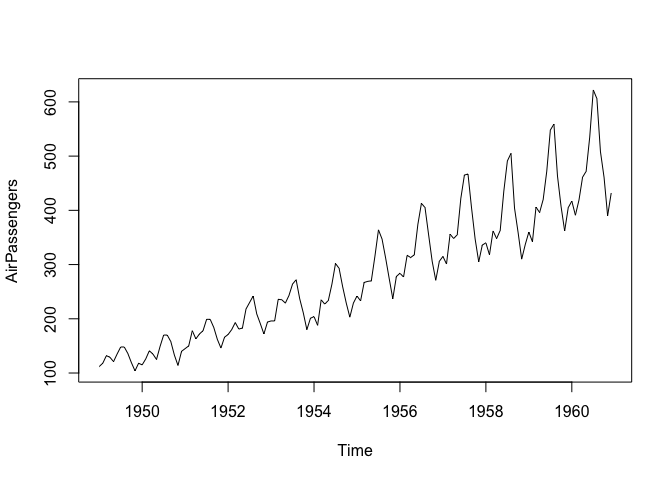
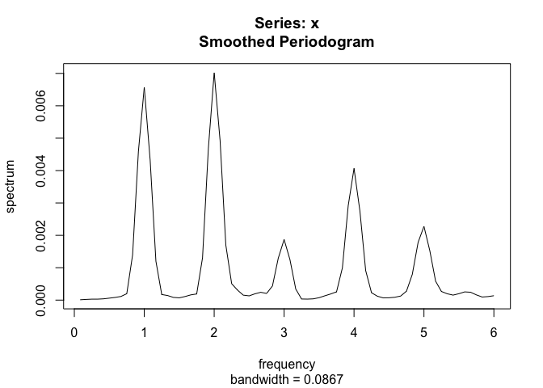

Estructural
================

Modelos Estructurales
---------------------

En la presente sección, vamos a introducir una metodología para el
análisis de series de tiempo vía modelos estructurales a través de los
modelos de Espacio-Estado. Por ésta razón, es necesario tener el
pre-requisito de los modelos de espacio-estado y el filtro de Kalman, el
libro base será el libro de Durbin y Koopman. Consideraremos el
siguiente modelo estructural para la serie de tiempo {*Y*<sub>*t*</sub>}

*Y*<sub>*t*</sub> = *μ*<sub>*t*</sub> + *γ*<sub>*t*</sub> + *c*<sub>*t*</sub> + ∑*β*<sub>*j*</sub>*x*<sub>*j*<sub>*t*</sub></sub> + *ε*<sub>*t*</sub>

donde *μ*<sub>*t*</sub> es una componente de variación lenta llamada
tendencia, *γ*<sub>*t*</sub> es una componente periódica de periodo fijo
llamada , *c*<sub>*t*</sub> es la componente cíclica de periodo mayor a
la componente estacional, *x*<sub>*j*<sub>*t*</sub></sub> es la
*j*−ésima variable regresora o explicativa, y *ε*<sub>*t*</sub> es la
componente irregular o de error.

Ejemplo Pasajeros
-----------------

``` r
library(KFKSDS)
library(rucm)
```

    ## Loading required package: KFAS

``` r
library(readr)
library(stsm)
data("AirPassengers")
estimationm1=stats::StructTS(log(AirPassengers), type = "BSM")
plot(log(AirPassengers))
```

<!-- -->

``` r
plot(cbind(fitted(estimationm1), resids=resid(estimationm1)), main = "Airpassengers")
```

<!-- -->

``` r
m1 <- StructTS(log(AirPassengers), type = "BSM")$coef[c(4,1:3)]
print(m1)
```

    ##      epsilon        level        slope         seas 
    ## 0.0000000000 0.0007718511 0.0000000000 0.0013969062

``` r
#### Con librería rucm

serie=log(AirPassengers)
model=ucm(serie~0, serie, irregular = TRUE, irregular.var = NA, level = TRUE,
    level.var = NA, slope = TRUE, slope.var = NA, season = TRUE,
    season.length = 12, season.var = NA, cycle = FALSE, cycle.period = NA,
    cycle.var = NA)
## Gráfica de las componentes de tendencia

plot(model$s.level, col = "blue")
```

<!-- -->

``` r
plot(model$s.slope, col = "blue")
```

<!-- -->

``` r
plot(model$s.season,col="blue")
```

<!-- -->

``` r
##Pronóstico
pron=predict(model, n.ahead = 12)
pron
```

    ##           Jan      Feb      Mar      Apr      May      Jun      Jul      Aug
    ## 1961 6.125262 6.083162 6.194623 6.215927 6.224790 6.342651 6.478326 6.475212
    ##           Sep      Oct      Nov      Dec
    ## 1961 6.305226 6.204958 6.068279 6.183164

Espectral
---------

La idea del análisis espectral es descubrir si hay ciclos ocultos, y
cuales los correspondientes armónicos asociadosa a estos ciclos.

``` r
data(AirPassengers)
AirPassengers
```

    ##      Jan Feb Mar Apr May Jun Jul Aug Sep Oct Nov Dec
    ## 1949 112 118 132 129 121 135 148 148 136 119 104 118
    ## 1950 115 126 141 135 125 149 170 170 158 133 114 140
    ## 1951 145 150 178 163 172 178 199 199 184 162 146 166
    ## 1952 171 180 193 181 183 218 230 242 209 191 172 194
    ## 1953 196 196 236 235 229 243 264 272 237 211 180 201
    ## 1954 204 188 235 227 234 264 302 293 259 229 203 229
    ## 1955 242 233 267 269 270 315 364 347 312 274 237 278
    ## 1956 284 277 317 313 318 374 413 405 355 306 271 306
    ## 1957 315 301 356 348 355 422 465 467 404 347 305 336
    ## 1958 340 318 362 348 363 435 491 505 404 359 310 337
    ## 1959 360 342 406 396 420 472 548 559 463 407 362 405
    ## 1960 417 391 419 461 472 535 622 606 508 461 390 432

``` r
plot(AirPassengers)
```

<!-- -->

``` r
logdiffAir=diff(log(AirPassengers))

Espectropasajeros=spectrum(logdiffAir, log="no", spans=c(2,2))
```

<!-- -->

Note que como el periodo de la serie es 12,entonces la frecuencia 1
indica, en verdad que la frecuencia es 1/12, es decir hay un ciclo de
periodo 1/(1/12) = 12. Por qué nos enfocamos en la frecuencia 1, por que
allí es donde aparece el primer pico alto. Los demás picos altos son
evidentes, porque el periodograma nos sólo muestra la frecuencia
asociada al ciclo estacional sino en múltiplos de la frecuencia también.
