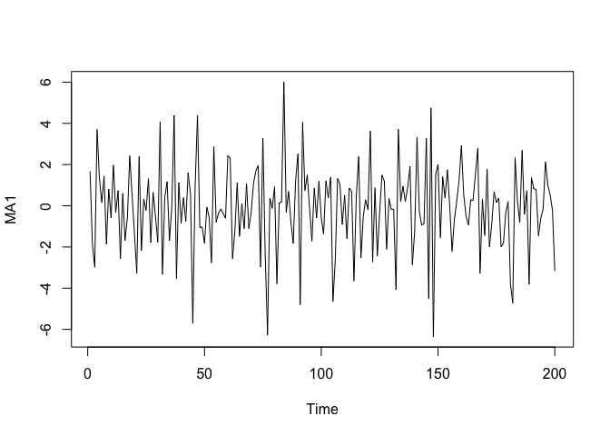

Simulación ARMA y ACF Teórica
================

Simulación y ACF
----------------

Vamos a simular un proceso {*X*<sub>*t*</sub>}∼ IID

``` r
n=200 #Tamaño de la serie
l=50 #condiciones iniciales
theta=-0.5 
phi=0.5
sigma=2
###Simulación IID####
serieIID=as.ts(rnorm(n,0,2))
plot(serieIID,main='IID')
```

<!-- -->

``` r
acf(serieIID)
```

<!-- -->

``` r
#####Simulación MA(1)#####
ruido=rnorm(n+l,0,sigma)
MA1aux=rep(0,n+l)
MA1aux
```

    ##   [1] 0 0 0 0 0 0 0 0 0 0 0 0 0 0 0 0 0 0 0 0 0 0 0 0 0 0 0 0 0 0 0 0 0 0 0 0 0
    ##  [38] 0 0 0 0 0 0 0 0 0 0 0 0 0 0 0 0 0 0 0 0 0 0 0 0 0 0 0 0 0 0 0 0 0 0 0 0 0
    ##  [75] 0 0 0 0 0 0 0 0 0 0 0 0 0 0 0 0 0 0 0 0 0 0 0 0 0 0 0 0 0 0 0 0 0 0 0 0 0
    ## [112] 0 0 0 0 0 0 0 0 0 0 0 0 0 0 0 0 0 0 0 0 0 0 0 0 0 0 0 0 0 0 0 0 0 0 0 0 0
    ## [149] 0 0 0 0 0 0 0 0 0 0 0 0 0 0 0 0 0 0 0 0 0 0 0 0 0 0 0 0 0 0 0 0 0 0 0 0 0
    ## [186] 0 0 0 0 0 0 0 0 0 0 0 0 0 0 0 0 0 0 0 0 0 0 0 0 0 0 0 0 0 0 0 0 0 0 0 0 0
    ## [223] 0 0 0 0 0 0 0 0 0 0 0 0 0 0 0 0 0 0 0 0 0 0 0 0 0 0 0 0

``` r
for(j in 2:(n+l))
{
  MA1aux[j]=theta*ruido[j-1]+ruido[j]
}
MA1=as.ts(MA1aux[l+1:n])
plot(MA1)
```

<!-- -->

``` r
acf(MA1)
```

<!-- -->

Simulación de procesos ARMA
---------------------------

<!-- --><!-- -->

``` r
acf_ARMA<- ARMAacf(ar=c(0.7),ma=c(0.6), lag.max = 10)
lags <- 0:10 
plot(lags,acf_ARMA,xlim=c(1,10),ylab = "ACF",type="h",main = "ACF para ARMA(1,1)")
abline(h=0) #Agrega un eje al gráfico
```

<!-- -->

``` r
library(UnitCircle)
UnitCircle::uc.check(c(2,0,2.2,-3))
```

    ##        real   complex outside
    ## 1 -0.232289  0.708919   FALSE
    ## 2 -0.232289 -0.708919   FALSE
    ## 3  1.197912  0.000000    TRUE
    ## *Results are rounded to 6 digits.

<!-- -->
