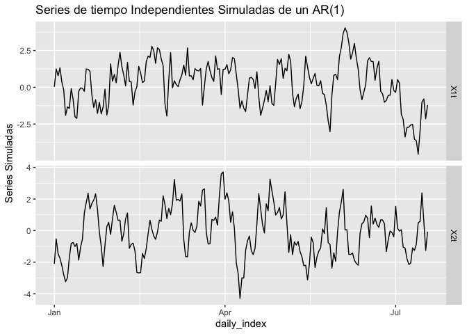
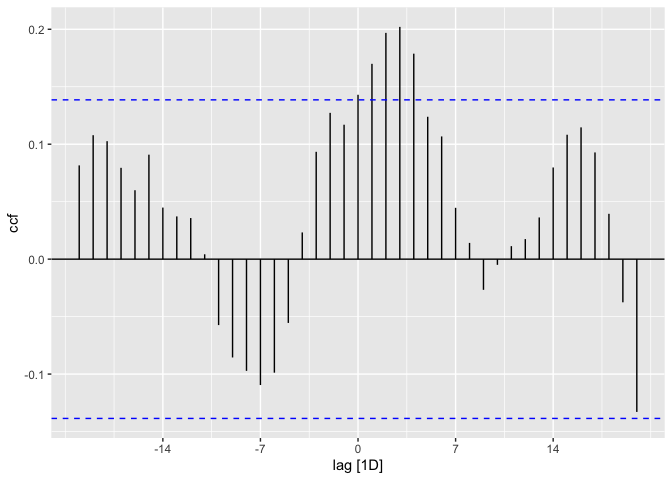
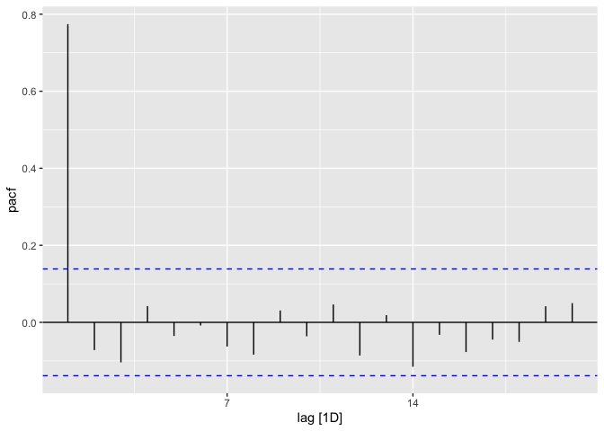

Correlacion cruzada
================

## Ejemplo Simulado Correlación Cruzada

Vamos a simular dos series independientes de tamaño *n* = 200 que
siguen:

*X*<sub>*i*, *t*</sub> = 0.8*X*<sub>*i*, *t* − 1</sub> + *Z*<sub>*i*, *t*</sub>
donde los procesos de ruido blanco
{*Z*<sub>*i*, *t*</sub>} ∼ *R**B*(0, 1) para *i* = 1, 2.

``` r
set.seed(1000)
X1t=arima.sim(n = 200, list(ar = 0.8),
          sd = sqrt(1))
set.seed(2000)
X2t=arima.sim(n = 200, list(ar = 0.8),
          sd = sqrt(1))
```

## Creación de objetos

Vamos a crear un objeto con un índice del tiempo ficticio y que tenga
estructura tstibble.

``` r
library(forecast)
```

    ## Registered S3 method overwritten by 'quantmod':
    ##   method            from
    ##   as.zoo.data.frame zoo

``` r
library(tidyverse)
```

    ## ── Attaching packages ─────────────────────────────────────── tidyverse 1.3.0 ──

    ## ✓ ggplot2 3.3.5     ✓ purrr   0.3.4
    ## ✓ tibble  3.1.6     ✓ dplyr   1.0.7
    ## ✓ tidyr   1.1.4     ✓ stringr 1.4.0
    ## ✓ readr   1.4.0     ✓ forcats 0.5.1

    ## ── Conflicts ────────────────────────────────────────── tidyverse_conflicts() ──
    ## x dplyr::filter() masks stats::filter()
    ## x dplyr::lag()    masks stats::lag()

``` r
library(tsibble)
```

    ## 
    ## Attaching package: 'tsibble'

    ## The following objects are masked from 'package:base':
    ## 
    ##     intersect, setdiff, union

``` r
library(feasts)
```

    ## Loading required package: fabletools

    ## 
    ## Attaching package: 'fabletools'

    ## The following objects are masked from 'package:forecast':
    ## 
    ##     accuracy, forecast

``` r
library(fable)
daily_index <- as.Date(seq.Date(from = as.Date("2008-01-01"), # Starting date
                           length.out=200,
                           by = "day") )# Defining the time intervals to =       as.Date("2012-12-16"), # Ending date
df=data.frame(X1t,X2t,daily_index)
tibble_df=tibble(df)
ts_simul_tibble=as_tsibble(df,index=daily_index)
```

# Gráfico de la Serie de tiempo

``` r
ts_simul_tibble %>%
  pivot_longer(c(X1t, X2t),
               names_to = "var", values_to = "value") %>%
  ggplot(aes(x = daily_index, y = value)) +
  geom_line() +
  facet_grid(vars(var), scales = "free_y") +
  labs(title = "Series de tiempo Independientes Simuladas de un AR(1)",
       y = "Series Simuladas")
```

<!-- -->
\#\# Otro Gráfico de las series de tiempo

``` r
ts_simul_tibble %>%
  pivot_longer(c(X1t, X2t), names_to="Series") %>%
  autoplot(value) +
  labs(y = "Series Simuladas")
```

<!-- -->

## Gráfico de Autocorrelación y Autocorrelación Cruzada

``` r
ts_simul_tibble %>% ACF(X1t,lag_max = 20) %>% 
  autoplot()
```

<!-- -->

``` r
ts_simul_tibble %>% ACF(X2t,lag_max = 20) %>% 
  autoplot()
```

<!-- -->

``` r
ts_simul_tibble %>% CCF(X1t,X2t,lag_max = 20) %>% 
  autoplot()
```

<!-- -->

``` r
ts_simul_tibble %>% PACF(X1t,lag_max = 20) %>% 
  autoplot()
```

<!-- -->

``` r
ts_simul_tibble %>% PACF(X2t,lag_max = 20) %>% 
  autoplot()
```

<!-- -->

## Otras forma de computar la fución de autocorrelación

``` r
library(MTS)
```

    ## 
    ## Attaching package: 'MTS'

    ## The following object is masked from 'package:fable':
    ## 
    ##     VAR

``` r
Matrix_series_simul=cbind(X1t,X2t)
MTS::MTSplot(Matrix_series_simul,caltime=daily_index)
```

<!-- -->

``` r
ccf(X1t,X2t,lag.max = 20)
```

<!-- -->

``` r
acf(Matrix_series_simul,lag=20)
```

<!-- -->

``` r
MTS::ccm(Matrix_series_simul,lags=20)
```

    ## [1] "Covariance matrix:"
    ##       X1t   X2t
    ## X1t 2.302 0.334
    ## X2t 0.334 2.369
    ## CCM at lag:  0 
    ##       [,1]  [,2]
    ## [1,] 1.000 0.143
    ## [2,] 0.143 1.000
    ## Simplified matrix: 
    ## CCM at lag:  1 
    ## + + 
    ## . + 
    ## CCM at lag:  2 
    ## + + 
    ## . + 
    ## CCM at lag:  3 
    ## + + 
    ## . + 
    ## CCM at lag:  4 
    ## + + 
    ## . + 
    ## CCM at lag:  5 
    ## + . 
    ## . + 
    ## CCM at lag:  6 
    ## + . 
    ## . . 
    ## CCM at lag:  7 
    ## . . 
    ## . . 
    ## CCM at lag:  8 
    ## . . 
    ## . . 
    ## CCM at lag:  9 
    ## . . 
    ## . . 
    ## CCM at lag:  10 
    ## . . 
    ## . . 
    ## CCM at lag:  11 
    ## . . 
    ## . . 
    ## CCM at lag:  12 
    ## . . 
    ## . . 
    ## CCM at lag:  13 
    ## . . 
    ## . . 
    ## CCM at lag:  14 
    ## . . 
    ## . - 
    ## CCM at lag:  15 
    ## + . 
    ## . - 
    ## CCM at lag:  16 
    ## + . 
    ## . - 
    ## CCM at lag:  17 
    ## + . 
    ## . - 
    ## CCM at lag:  18 
    ## . . 
    ## . - 
    ## CCM at lag:  19 
    ## . . 
    ## . - 
    ## CCM at lag:  20 
    ## . . 
    ## . -

<!-- -->

    ## Hit Enter for p-value plot of individual ccm:

<!-- -->
Es claro que la CCF muestral nos dice que hay dependencia de las series
en varios rezagos, sin embargo esto no tiene sentido porque las series
se simularon de forma independiente.

Ahora, vamos pre-blanquear las series. Es decir, ajustaremos algún
modelo ARMA a cada una de las series y obtendremos los residuales del
modelo. Note que de las ACF simple y PACF se puede destacar que un
modelo factible para los datos es un modelo AR(1), tal cual fue
simulado.

``` r
###Serie X1t
ajuste1=forecast::Arima(X1t,order=c(1,0,0),include.mean = FALSE)
res1=residuals(ajuste1)
###Serie X2t
ajuste2=forecast::Arima(X2t,order=c(1,0,0),include.mean = FALSE)
res2=residuals(ajuste2)

###Otra forma de obtener los residuales basandos en el tstibble
###Para serie X1t
ajuste_tibbleX1t <- ts_simul_tibble %>%
  model(arima100X1t = ARIMA(X1t ~ pdq(1,0,0)),
        searchX1t = ARIMA(X1t, stepwise=FALSE))
        

ajuste_tibbleX1t
```

    ## # A mable: 1 x 2
    ##      arima100X1t      searchX1t
    ##          <model>        <model>
    ## 1 <ARIMA(1,0,0)> <ARIMA(1,0,0)>

``` r
residuales1=ajuste_tibbleX1t %>%
  select(arima100X1t) %>%
 residuals()

residuales1_tstibble=residuales1$.resid

###Para serie X2t
ajuste_tibbleX2t <- ts_simul_tibble %>%
  model(arima100X2t = ARIMA(X2t ~ pdq(1,0,0)),
        searchX2t = ARIMA(X2t, stepwise=FALSE))
        

ajuste_tibbleX2t
```

    ## # A mable: 1 x 2
    ##      arima100X2t      searchX2t
    ##          <model>        <model>
    ## 1 <ARIMA(1,0,0)> <ARIMA(1,0,0)>

``` r
residuales2=ajuste_tibbleX2t %>%
  select(arima100X2t) %>%
 residuals()

residuales2_tstibble=residuales2$.resid
```

Después del Pre-blanqueamineto procedemos ahora si hay computar la CCF
basada en los residuales del modelo.

``` r
ccf(residuales1_tstibble,residuales2_tstibble)
```

<!-- -->

``` r
ccf(res1,res2)
```

<!-- -->

``` r
ccf(X1t,X2t,lag.max = 20)
```

<!-- -->

Note que ahora no vemos evidencia de que haya en verdad dependencia
entre las dos series.

Ahora procederemos a simular un dos series que estén correlacionadas y
veremos que sucede con el procedimiento.

``` r
set.seed(100)
Beta0=4
Beta1=0.7
X3t=Beta0+Beta1*X1t+rnorm(200)
df_1=data.frame(X1t,X3t,daily_index)
tibble_df_1=tibble(df_1)
ts_simul_tibble_1=as_tsibble(df_1,index=daily_index)

ts_simul_tibble_1 %>%
  pivot_longer(c(X1t, X3t), names_to="Series") %>%
  autoplot(value) +
  labs(y = "Series Simuladas Dependientes")
```

<!-- -->
Vamos a ajustar los modelos a ambas series, el modelo para la serie X1t
ya lo conocemos, ahora veamos el ajuste a la serie X3t.

``` r
acf(X3t)
```

<!-- -->

``` r
acf(X3t, ci.type='ma')
```

<!-- -->

``` r
pacf(X3t)
```

<!-- -->

``` r
ajuste3=forecast::Arima(X3t,order=c(2,0,0),include.mean = FALSE)
res3=residuals(ajuste3)
ccf(res1,res3)
```

<!-- -->

``` r
ccm(cbind(res1,res3))
```

    ## [1] "Covariance matrix:"
    ##       res1  res3
    ## res1 0.905 0.771
    ## res3 0.771 2.022
    ## CCM at lag:  0 
    ##      [,1] [,2]
    ## [1,] 1.00 0.57
    ## [2,] 0.57 1.00
    ## Simplified matrix: 
    ## CCM at lag:  1 
    ## . . 
    ## + . 
    ## CCM at lag:  2 
    ## . . 
    ## . - 
    ## CCM at lag:  3 
    ## . . 
    ## - . 
    ## CCM at lag:  4 
    ## . . 
    ## . . 
    ## CCM at lag:  5 
    ## . + 
    ## . . 
    ## CCM at lag:  6 
    ## . . 
    ## . . 
    ## CCM at lag:  7 
    ## . . 
    ## . . 
    ## CCM at lag:  8 
    ## . . 
    ## . . 
    ## CCM at lag:  9 
    ## . . 
    ## . . 
    ## CCM at lag:  10 
    ## . . 
    ## . . 
    ## CCM at lag:  11 
    ## . . 
    ## . . 
    ## CCM at lag:  12 
    ## . . 
    ## . .

<!-- -->

    ## Hit Enter for p-value plot of individual ccm:

<!-- -->
Claramente podemos ver que en efecto las dos series son dependientes.

## Escenario IID

Vamos ahora a ver como funciona si todas las series son IID

``` r
library(mvtnorm)
sig=diag(3)
x=rmvnorm(300,rep(0,3),sig)
MTSplot(x)
```

<!-- -->

``` r
ccm(x)
```

    ## [1] "Covariance matrix:"
    ##         [,1]    [,2]    [,3]
    ## [1,]  1.1125  0.0524 -0.1062
    ## [2,]  0.0524  1.0155 -0.0536
    ## [3,] -0.1062 -0.0536  1.1546
    ## CCM at lag:  0 
    ##         [,1]    [,2]    [,3]
    ## [1,]  1.0000  0.0493 -0.0937
    ## [2,]  0.0493  1.0000 -0.0495
    ## [3,] -0.0937 -0.0495  1.0000
    ## Simplified matrix: 
    ## CCM at lag:  1 
    ## . . . 
    ## . . . 
    ## . . . 
    ## CCM at lag:  2 
    ## . . . 
    ## . . . 
    ## . . . 
    ## CCM at lag:  3 
    ## . . . 
    ## . . . 
    ## . . . 
    ## CCM at lag:  4 
    ## . . . 
    ## . . . 
    ## . . . 
    ## CCM at lag:  5 
    ## . . . 
    ## . . . 
    ## . . . 
    ## CCM at lag:  6 
    ## . . . 
    ## . . . 
    ## . . . 
    ## CCM at lag:  7 
    ## . . . 
    ## . . . 
    ## . . . 
    ## CCM at lag:  8 
    ## . . . 
    ## . . . 
    ## . . . 
    ## CCM at lag:  9 
    ## . . . 
    ## . . . 
    ## . . . 
    ## CCM at lag:  10 
    ## . + . 
    ## . . . 
    ## . . . 
    ## CCM at lag:  11 
    ## . . . 
    ## . . . 
    ## . . . 
    ## CCM at lag:  12 
    ## . . . 
    ## . . . 
    ## . + .

<!-- -->

    ## Hit Enter for p-value plot of individual ccm:

<!-- -->

``` r
acf(x)
```

<!-- -->
