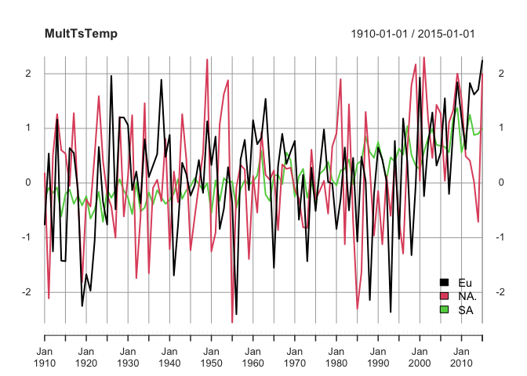
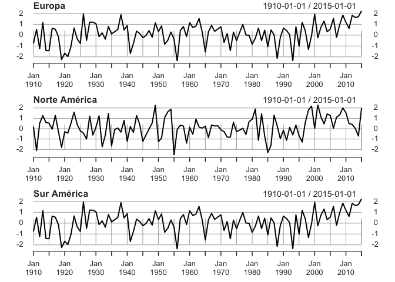
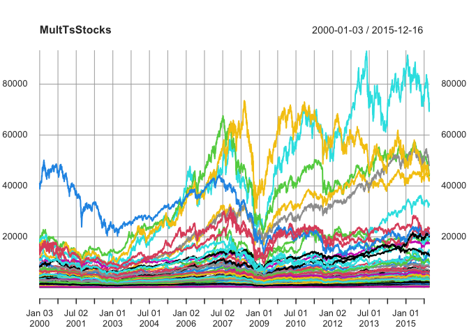
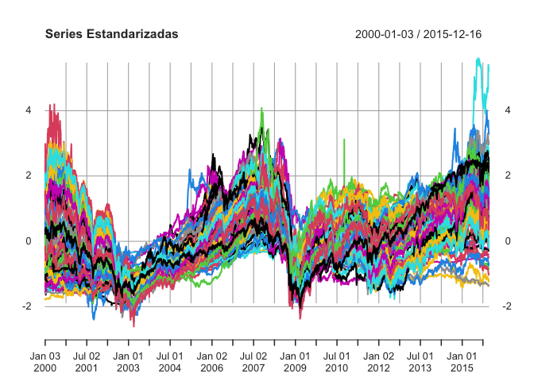
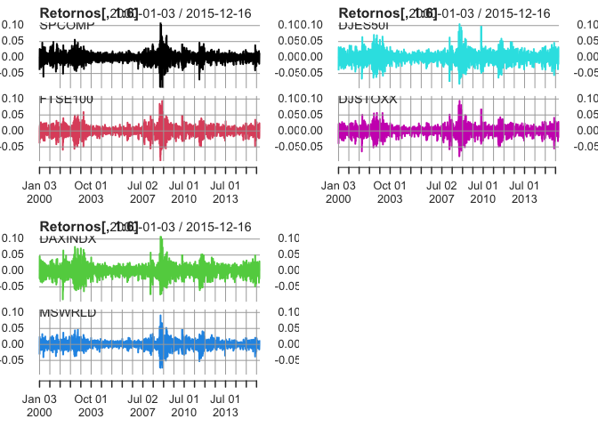
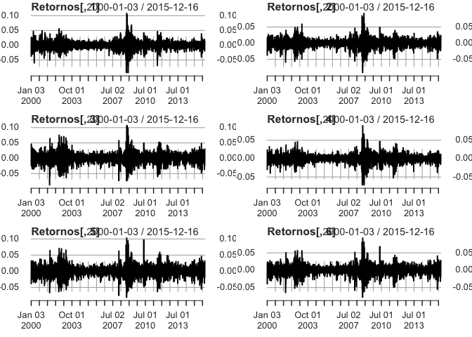

IntroSeriesMultivariadas
================

## R Ejemplos de Series Multivariadas

Vamos a ver algunos ejemplos de series de tiempo multivaridas. El primer
conjunto de datos tiene que ver con las temperaturas relativas promedio
de noviembre en Europa, Norte América y sur América entre 1910 y 2014 de
forma anual.

``` r
library(tidyverse)
```

    ## ── Attaching packages ─────────────────────────────────────── tidyverse 1.3.0 ──

    ## ✓ ggplot2 3.3.5     ✓ purrr   0.3.4
    ## ✓ tibble  3.1.6     ✓ dplyr   1.0.7
    ## ✓ tidyr   1.1.4     ✓ stringr 1.4.0
    ## ✓ readr   1.4.0     ✓ forcats 0.5.1

    ## ── Conflicts ────────────────────────────────────────── tidyverse_conflicts() ──
    ## x dplyr::filter() masks stats::filter()
    ## x dplyr::lag()    masks stats::lag()

``` r
library(tidyquant)
```

    ## Loading required package: lubridate

    ## 
    ## Attaching package: 'lubridate'

    ## The following objects are masked from 'package:base':
    ## 
    ##     date, intersect, setdiff, union

    ## Loading required package: PerformanceAnalytics

    ## Loading required package: xts

    ## Loading required package: zoo

    ## 
    ## Attaching package: 'zoo'

    ## The following objects are masked from 'package:base':
    ## 
    ##     as.Date, as.Date.numeric

    ## 
    ## Attaching package: 'xts'

    ## The following objects are masked from 'package:dplyr':
    ## 
    ##     first, last

    ## 
    ## Attaching package: 'PerformanceAnalytics'

    ## The following object is masked from 'package:graphics':
    ## 
    ##     legend

    ## Loading required package: quantmod

    ## Loading required package: TTR

    ## Registered S3 method overwritten by 'quantmod':
    ##   method            from
    ##   as.zoo.data.frame zoo

    ## ══ Need to Learn tidyquant? ════════════════════════════════════════════════════
    ## Business Science offers a 1-hour course - Learning Lab #9: Performance Analysis & Portfolio Optimization with tidyquant!
    ## </> Learn more at: https://university.business-science.io/p/learning-labs-pro </>

``` r
library(TSstudio)
library(SLBDD)
library(timetk)
```

    ## Registered S3 method overwritten by 'tune':
    ##   method                   from   
    ##   required_pkgs.model_spec parsnip

``` r
library(fable)
```

    ## Loading required package: fabletools

    ## 
    ## Attaching package: 'fable'

    ## The following object is masked from 'package:tidyquant':
    ## 
    ##     VAR

``` r
data("temperatures")
head(temperatures)
```

    ##   year    Eu   NA.    SA
    ## 1 1910 -0.77  0.19 -0.28
    ## 2 1911  0.54 -2.11 -0.09
    ## 3 1912 -1.25  0.52 -0.18
    ## 4 1913  1.16  1.26 -0.08
    ## 5 1914 -1.42  0.60 -0.61
    ## 6 1915 -1.43  0.54 -0.20

``` r
str(temperatures)
```

    ## 'data.frame':    106 obs. of  4 variables:
    ##  $ year: int  1910 1911 1912 1913 1914 1915 1916 1917 1918 1919 ...
    ##  $ Eu  : num  -0.77 0.54 -1.25 1.16 -1.42 -1.43 0.64 0.55 -0.14 -2.25 ...
    ##  $ NA. : num  0.19 -2.11 0.52 1.26 0.6 0.54 -0.05 1.28 -0.28 -1.81 ...
    ##  $ SA  : num  -0.28 -0.09 -0.18 -0.08 -0.61 -0.2 -0.12 -0.38 -0.23 -0.41 ...

``` r
MultTsTemp=xts(temperatures[2:4], order.by=as.Date(ISOdate(temperatures$year,1,1)))
plot(MultTsTemp,legend.loc='bottomright')
```

<!-- -->

``` r
par(mfrow = c(3 , 1))
plot(MultTsTemp[,1], main = "Europa")
plot(MultTsTemp[,2], main = "Norte América")
plot(MultTsTemp[,1], main = "Sur América")
```

<!-- -->

### Acciones

Aquí se muestran los índices diarios de los 99 mercados de acciones
alrededor del mundo.

    ## 'data.frame':    4163 obs. of  100 variables:
    ##  $ Date   : Date, format: "2000-01-03" "2000-01-04" ...
    ##  $ SPCOMP : num  1455 1399 1402 1403 1441 ...
    ##  $ FTSE100: num  6930 6666 6536 6447 6505 ...
    ##  $ DAXINDX: num  6751 6587 6502 6475 6781 ...
    ##  $ MSWRLD : num  1422 1378 1360 1344 1376 ...
    ##  $ DJES50I: num  4849 4658 4542 4501 4648 ...
    ##  $ DJSTOXX: num  378 363 354 352 360 ...
    ##  $ FRCAC40: num  5917 5672 5480 5450 5540 ...
    ##  $ FTALLSH: num  3242 3141 3085 3055 3084 ...
    ##  $ TOKYOSE: num  1722 1717 1652 1610 1599 ...
    ##  $ HNGKNGI: num  17370 17073 15847 15153 15406 ...
    ##  $ CHSASHR: num  1452 1494 1498 1556 1612 ...
    ##  $ FTSEMIB: num  41226 40314 39452 38835 40194 ...
    ##  $ IBEX35I: num  11610 11207 10863 10863 11102 ...
    ##  $ ASX200I: num  3118 3094 3019 2999 3023 ...
    ##  $ KORCOMP: num  1028 1059 986 961 949 ...
    ##  $ SWISSMI: num  7570 7268 7181 7281 7448 ...
    ##  $ TTOCOMP: num  8414 8203 8119 8114 8429 ...
    ##  $ AMSTEOE: num  675 642 632 624 645 ...
    ##  $ DJEURST: num  412 397 386 383 395 ...
    ##  $ BNGKSET: num  482 498 466 443 453 ...
    ##  $ JAKCOMP: num  677 700 678 689 689 ...
    ##  $ SWEDOMX: num  1212 1182 1131 1131 1153 ...
    ##  $ DJSTO50: num  4716 4504 4384 4343 4453 ...
    ##  $ BGBEL20: num  3311 3172 3058 3061 3139 ...
    ##  $ MDAXIDX: num  4127 4049 3995 4016 4096 ...
    ##  $ HEXINDX: num  15331 14185 13012 13012 13540 ...
    ##  $ SNGPORI: num  2608 2549 2426 2409 2450 ...
    ##  $ TAIWGHT: num  8449 8757 8850 8922 8845 ...
    ##  $ HKHCHIE: num  2000 2083 1957 1904 2005 ...
    ##  $ MSACWF : num  342 332 328 324 331 ...
    ##  $ MSEROP : num  1536 1498 1466 1461 1485 ...
    ##  $ DKKFXIN: num  259 253 247 249 252 ...
    ##  $ ATXINDX: num  1205 1194 1193 1193 1224 ...
    ##  $ BUXINDX: num  8819 8715 8464 8483 8694 ...
    ##  $ ASX300I: num  3107 3084 3011 2994 3020 ...
    ##  $ CHZBSHR: num  84.7 86.5 84.1 86.2 90.8 ...
    ##  $ FSBF120: num  4035 3873 3744 3728 3794 ...
    ##  $ NLALSHR: num  947 904 885 877 904 ...
    ##  $ EUNX100: num  997 956 930 922 944 ...
    ##  $ RMBETRL: num  449 449 461 484 526 ...
    ##  $ EUNX150: num  1020 992 968 973 993 ...
    ##  $ HKHCHAF: num  2000 2060 1877 1863 1933 ...
    ##  $ MSEAFE : num  1774 1735 1685 1661 1680 ...
    ##  $ MSPACF : num  2515 2476 2366 2282 2284 ...
    ##  $ JAPDOWA: num  18934 19003 18543 18168 18193 ...
    ##  $ DJINDUS: num  11358 10998 11123 11253 11523 ...
    ##  $ BRBOVES: num  16930 15851 16245 16106 16309 ...
    ##  $ JSEOVER: num  8357 8337 8250 8262 8472 ...
    ##  $ NASCOMP: num  4131 3902 3878 3727 3883 ...
    ##  $ NYSEALL: num  6762 6544 6567 6635 6793 ...
    ##  $ FRUSSL2: num  497 478 479 475 488 ...
    ##  $ FBMKLCI: num  834 833 816 818 818 ...
    ##  $ NASA100: num  3791 3546 3507 3341 3530 ...
    ##  $ RSMICEX: num  152 152 173 186 186 ...
    ##  $ MXIPC35: num  7078 6675 6764 6752 7047 ...
    ##  $ GRAGENL: num  5795 5762 5531 5531 5579 ...
    ##  $ PSECOMP: num  2142 2153 2075 2079 2094 ...
    ##  $ RSRTSIN: num  175 175 179 186 186 ...
    ##  $ POLWIGI: num  18982 18558 17694 18075 18954 ...
    ##  $ ARGMERV: num  551 523 533 528 522 ...
    ##  $ TRKISTB: num  17199 17512 16932 16200 15837 ...
    ##  $ ISEQUIT: num  5018 4940 4893 4894 4914 ...
    ##  $ KOR200I: num  130 134 124 121 119 ...
    ##  $ ICRI500: num  1292 1335 1304 1307 1276 ...
    ##  $ OSLOASH: num  184 177 172 174 178 ...
    ##  $ CZPXIDX: num  490 490 484 495 499 ...
    ##  $ IGPAGEN: num  5217 5179 5180 5187 5209 ...
    ##  $ DJCMP65: num  3170 3091 3134 3178 3242 ...
    ##  $ PKSE100: num  1457 1480 1480 1500 1500 ...
    ##  $ SWSEALI: num  328 320 307 307 313 ...
    ##  $ POPSI20: num  11852 11360 11023 11328 11564 ...
    ##  $ TTOSP60: num  496 484 478 476 497 ...
    ##  $ CTCROBE: num  715 751 795 795 769 ...
    ##  $ DJWRLD : num  245 238 234 232 237 ...
    ##  $ EGHFINC: num  137 139 135 136 136 ...
    ##  $ AWWRLD : num  213 207 204 203 207 ...
    ##  $ FTEU100: num  3633 3494 3421 3404 3474 ...
    ##  $ FTSEGL : num  1185 1147 1137 1133 1165 ...
    ##  $ FTASE20: num  3020 2912 2796 2796 2782 ...
    ##  $ ISTA100: num  487 488 477 473 473 ...
    ##  $ LNVILSE: num  100 101 101 101 102 ...
    ##  $ SPEUROP: num  1750 1682 1638 1633 1681 ...
    ##  $ PEGENRL: num  1829 1812 1810 1798 1805 ...
    ##  $ SXSAX16: num  77.1 77.1 77.1 77.1 77.5 ...
    ##  $ VENGENL: num  5.42 5.4 5.37 5.42 5.45 5.5 5.49 5.47 5.55 5.72 ...
    ##  $ AMMANFM: num  1632 1634 1636 1640 1640 ...
    ##  $ SRALLSH: num  574 571 562 557 557 ...
    ##  $ DJUTILS: num  277 279 289 293 298 ...
    ##  $ NSEINDX: num  2303 2301 2301 2310 2312 ...
    ##  $ LUXGENI: num  1404 1356 1348 1334 1357 ...
    ##  $ MADRIDI: num  1012 978 953 953 972 ...
    ##  $ OMANMSM: num  2519 2544 2523 2521 2505 ...
    ##  $ COSEASH: num  217 213 209 210 212 ...
    ##  $ ICEXALL: num  1512 1512 1496 1502 1495 ...
    ##  $ RIGSEIN: num  105 108 106 104 107 ...
    ##  $ ESTALSE: num  142 140 136 136 136 ...
    ##  $ TOK2NDM: num  2610 2659 2537 2491 2470 ...
    ##  $ TUTUNIN: num  1200 1199 1203 1213 1213 ...
    ##   [list output truncated]

<!-- --><!-- -->

    ## An 'xts' object on 2000-01-03/2015-12-16 containing:
    ##   Data: num [1:4163, 1:99] NA -0.039099 0.00192 0.000955 0.02673 ...
    ##  - attr(*, "dimnames")=List of 2
    ##   ..$ : NULL
    ##   ..$ : chr [1:99] "SPCOMP" "FTSE100" "DAXINDX" "MSWRLD" ...
    ##   Indexed by objects of class: [Date] TZ: UTC
    ##   xts Attributes:  
    ## List of 2
    ##  $ ret_type        : chr "log"
    ##  $ coredata_content: chr "logReturn"

<!-- --><!-- -->
Vamos ahora hacer gráficas con base en el objeto timeseries del paquete
timeSeries

``` r
library(timeSeries)
```

    ## Loading required package: timeDate

    ## 
    ## Attaching package: 'timeDate'

    ## The following objects are masked from 'package:PerformanceAnalytics':
    ## 
    ##     kurtosis, skewness

    ## 
    ## Attaching package: 'timeSeries'

    ## The following object is masked from 'package:zoo':
    ## 
    ##     time<-

``` r
ts_data_stocks=timeSeries(Stockindexes99world[2:100],Stockindexes99world$Date)
str(ts_data_stocks)
```

    ## Time Series:          
    ##  Name:               object
    ## Data Matrix:        
    ##  Dimension:          4163 99
    ##  Column Names:       SPCOMP FTSE100 DAXINDX MSWRLD DJES50I DJSTOXX FRCAC40 FTALLSH TOKYOSE HNGKNGI CHSASHR FTSEMIB IBEX35I ASX200I KORCOMP SWISSMI TTOCOMP AMSTEOE DJEURST BNGKSET JAKCOMP SWEDOMX DJSTO50 BGBEL20 MDAXIDX HEXINDX SNGPORI TAIWGHT HKHCHIE MSACWF MSEROP DKKFXIN ATXINDX BUXINDX ASX300I CHZBSHR FSBF120 NLALSHR EUNX100 RMBETRL EUNX150 HKHCHAF MSEAFE MSPACF JAPDOWA DJINDUS BRBOVES JSEOVER NASCOMP NYSEALL FRUSSL2 FBMKLCI NASA100 RSMICEX MXIPC35 GRAGENL PSECOMP RSRTSIN POLWIGI ARGMERV TRKISTB ISEQUIT KOR200I ICRI500 OSLOASH CZPXIDX IGPAGEN DJCMP65 PKSE100 SWSEALI POPSI20 TTOSP60 CTCROBE DJWRLD EGHFINC AWWRLD FTEU100 FTSEGL FTASE20 ISTA100 LNVILSE SPEUROP PEGENRL SXSAX16 VENGENL AMMANFM SRALLSH DJUTILS NSEINDX LUXGENI MADRIDI OMANMSM COSEASH ICEXALL RIGSEIN ESTALSE TOK2NDM TUTUNIN FTSELAT
    ##  Row Names:          2000-01-03  ...  2015-12-16
    ## Positions:          
    ##  Start:              2000-01-03
    ##  End:                2015-12-16
    ## With:               
    ##  Format:             %Y-%m-%d
    ##  FinCenter:          GMT
    ##  Units:              SPCOMP FTSE100 DAXINDX MSWRLD DJES50I DJSTOXX FRCAC40 FTALLSH TOKYOSE HNGKNGI CHSASHR FTSEMIB IBEX35I ASX200I KORCOMP SWISSMI TTOCOMP AMSTEOE DJEURST BNGKSET JAKCOMP SWEDOMX DJSTO50 BGBEL20 MDAXIDX HEXINDX SNGPORI TAIWGHT HKHCHIE MSACWF MSEROP DKKFXIN ATXINDX BUXINDX ASX300I CHZBSHR FSBF120 NLALSHR EUNX100 RMBETRL EUNX150 HKHCHAF MSEAFE MSPACF JAPDOWA DJINDUS BRBOVES JSEOVER NASCOMP NYSEALL FRUSSL2 FBMKLCI NASA100 RSMICEX MXIPC35 GRAGENL PSECOMP RSRTSIN POLWIGI ARGMERV TRKISTB ISEQUIT KOR200I ICRI500 OSLOASH CZPXIDX IGPAGEN DJCMP65 PKSE100 SWSEALI POPSI20 TTOSP60 CTCROBE DJWRLD EGHFINC AWWRLD FTEU100 FTSEGL FTASE20 ISTA100 LNVILSE SPEUROP PEGENRL SXSAX16 VENGENL AMMANFM SRALLSH DJUTILS NSEINDX LUXGENI MADRIDI OMANMSM COSEASH ICEXALL RIGSEIN ESTALSE TOK2NDM TUTUNIN FTSELAT
    ##  Title:              Time Series Object
    ##  Documentation:      Thu Feb 24 17:10:37 2022

``` r
plot(ts_data_stocks,plot.type="s")
```

<!-- -->

``` r
par(mfrow=c(1, 1))
plot(ts_data_stocks[,1:6], plot.type="m")
```

<!-- -->
Veamos ahora las ventas diarias de en logaritmo natural sw una marca de
ropa en 25 provincias en china del 1 de enero de 2008 hasta el 9 de
diciembre de 2012.

``` r
data("clothing")
head(clothing)
```

    ##   Province_1 Province_2 Province_3 Province_4 Province_5 Province_6 Province_7
    ## 1  10.255119  10.052381  10.001630  10.262148   9.537591  10.071068   9.577550
    ## 2   8.969436   8.838563   8.918045   9.474809   8.437312   9.367360   7.793133
    ## 3   8.683109   8.809122   8.737749   9.235408   8.289673   9.367140   7.983779
    ## 4   8.708623   8.736963   8.818683   9.180086   8.308807   9.157797   7.822138
    ## 5   9.146041   9.304354   9.079061   9.525036   8.537895   9.320204   8.393623
    ## 6   9.166917   9.309255   9.163254   9.642290   8.538069   9.395800   8.730635
    ##   Province_8 Province_9 Province_10 Province_11 Province_12 Province_13
    ## 1   9.495086   9.570476    9.570940    9.243588    9.892765    9.501067
    ## 2   7.956020   8.938954    8.498428    8.154267    8.677643    8.585868
    ## 3   8.203305   8.926334    8.301228    7.986951    8.374789    8.193456
    ## 4   7.799002   9.019168    8.379410    7.750561    8.290688    7.937521
    ## 5   8.365276   9.227805    8.701158    8.021543    8.675764    8.385972
    ## 6   8.710116   9.166760    8.716934    8.388990    8.693324    8.438595
    ##   Province_14 Province_15 Province_16 Province_17 Province_18 Province_19
    ## 1    9.597678    9.363006    9.180868    9.612627    9.520057    8.807575
    ## 2    8.548340    8.472212    7.627447    8.793756    8.471639    7.366877
    ## 3    8.419378    8.515617    7.460611    8.041831    8.213883    7.458667
    ## 4    8.222719    8.310974    7.784946    8.265213    8.229732    7.686767
    ## 5    8.633254    8.645279    7.968235    8.993347    8.515229    8.076976
    ## 6    8.755978    8.789780    8.168556    8.738699    8.644282    8.389345
    ##   Province_20 Province_21 Province_22 Province_23 Province_24 Province_25
    ## 1   10.655326   10.134677    9.163030    9.619211    9.687208    9.745646
    ## 2    9.547288    8.823192    8.930437    8.525871    8.393511    8.480964
    ## 3    9.332601    8.517700    8.521749    8.390199    8.139057    8.434541
    ## 4    9.301246    8.619024    8.355039    8.455735    8.180705    8.275815
    ## 5    9.865686    9.303698    8.689668    8.934850    8.340250    8.624155
    ## 6    9.794847    9.415771    8.758637    8.844662    8.410309    8.579312

``` r
daily_index <- seq.Date(from = as.Date("2008-01-01"), # Starting date
                           to = as.Date("2012-12-16"), # Ending date
                           by = "day") # Defining the time intervals
ts_data_sales=timeSeries(clothing,daily_index)
str(ts_data_sales)
```

    ## Time Series:          
    ##  Name:               object
    ## Data Matrix:        
    ##  Dimension:          1812 25
    ##  Column Names:       Province_1 Province_2 Province_3 Province_4 Province_5 Province_6 Province_7 Province_8 Province_9 Province_10 Province_11 Province_12 Province_13 Province_14 Province_15 Province_16 Province_17 Province_18 Province_19 Province_20 Province_21 Province_22 Province_23 Province_24 Province_25
    ##  Row Names:          2008-01-01  ...  2012-12-16
    ## Positions:          
    ##  Start:              2008-01-01
    ##  End:                2012-12-16
    ## With:               
    ##  Format:             %Y-%m-%d
    ##  FinCenter:          GMT
    ##  Units:              Province_1 Province_2 Province_3 Province_4 Province_5 Province_6 Province_7 Province_8 Province_9 Province_10 Province_11 Province_12 Province_13 Province_14 Province_15 Province_16 Province_17 Province_18 Province_19 Province_20 Province_21 Province_22 Province_23 Province_24 Province_25
    ##  Title:              Time Series Object
    ##  Documentation:      Thu Feb 24 17:10:39 2022

``` r
plot(ts_data_sales,plot.type="s")
```

<!-- -->

``` r
plot(ts_data_sales[,1:8],plot.type="s")
```

<!-- -->

``` r
par(mfrow=c(1, 1))
plot(ts_data_sales[,1:8],plot.type="m")
```

<!-- -->

``` r
xts_sales_china=xts(clothing, order.by=daily_index)
library(ggfortify)
```

    ## Warning: package 'ggfortify' was built under R version 4.0.5

    ## Registered S3 methods overwritten by 'ggfortify':
    ##   method                 from    
    ##   autoplot.Arima         forecast
    ##   autoplot.acf           forecast
    ##   autoplot.ar            forecast
    ##   autoplot.bats          forecast
    ##   autoplot.decomposed.ts forecast
    ##   autoplot.ets           forecast
    ##   autoplot.forecast      forecast
    ##   autoplot.stl           forecast
    ##   autoplot.ts            forecast
    ##   fitted.ar              forecast
    ##   fortify.ts             forecast
    ##   residuals.ar           forecast

``` r
autoplot(xts_sales_china[,1:8])
```

<!-- -->
