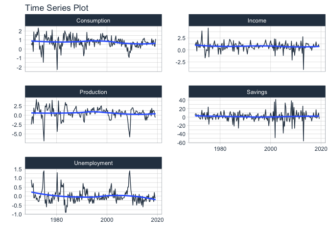

Regresion de Series de Tiempo
================

# Regresión Lineal Saimple Con errores no-autocorrelacionados.

Vamos a tratar de relacionar los cambios porcentuales trimestrales del
gasto real del consumo
personal")
y el ingreso disponible real persona. Primero visualizamos las series,
las cuales son al menos estables en media.

``` r
library(feasts)
```

    ## Loading required package: fabletools

``` r
library(fpp3)
```

    ## ── Attaching packages ──────────────────────────────────────────── fpp3 0.4.0 ──

    ## ✓ tibble      3.1.6     ✓ ggplot2     3.3.5
    ## ✓ dplyr       1.0.8     ✓ tsibble     1.1.1
    ## ✓ tidyr       1.2.0     ✓ tsibbledata 0.4.0
    ## ✓ lubridate   1.8.0     ✓ fable       0.3.1

    ## ── Conflicts ───────────────────────────────────────────────── fpp3_conflicts ──
    ## x lubridate::date()    masks base::date()
    ## x dplyr::filter()      masks stats::filter()
    ## x tsibble::intersect() masks base::intersect()
    ## x tsibble::interval()  masks lubridate::interval()
    ## x dplyr::lag()         masks stats::lag()
    ## x tsibble::setdiff()   masks base::setdiff()
    ## x tsibble::union()     masks base::union()

``` r
data(us_change) ##Del paquete fpp3
str(us_change)
```

    ## tbl_ts [198 × 6] (S3: tbl_ts/tbl_df/tbl/data.frame)
    ##  $ Quarter     : qtr [1:198] 1970 Q1, 1970 Q2, 1970 Q3, 1970 Q4, 1971 Q1, 1971 Q2, 1971...
    ##  $ Consumption : num [1:198] 0.619 0.452 0.873 -0.272 1.901 ...
    ##  $ Income      : num [1:198] 1.04 1.23 1.59 -0.24 1.98 ...
    ##  $ Production  : num [1:198] -2.452 -0.551 -0.359 -2.186 1.91 ...
    ##  $ Savings     : num [1:198] 5.3 7.79 7.4 1.17 3.54 ...
    ##  $ Unemployment: num [1:198] 0.9 0.5 0.5 0.7 -0.1 ...
    ##  - attr(*, "key")= tibble [1 × 1] (S3: tbl_df/tbl/data.frame)
    ##   ..$ .rows: list<int> [1:1] 
    ##   .. ..$ : int [1:198] 1 2 3 4 5 6 7 8 9 10 ...
    ##   .. ..@ ptype: int(0) 
    ##  - attr(*, "index")= chr "Quarter"
    ##   ..- attr(*, "ordered")= logi TRUE
    ##  - attr(*, "index2")= chr "Quarter"
    ##  - attr(*, "interval")= interval [1:1] 1Q
    ##   ..@ .regular: logi TRUE

``` r
us_change %>%
  pivot_longer(c(Consumption, Income), names_to="Series") %>%
  autoplot(value) +
  labs(y = "% change")
```

<!-- -->
También se puede usar el paquete timetk

``` r
library(timetk)
library(tidyquant)
```

    ## Loading required package: PerformanceAnalytics

    ## Loading required package: xts

    ## Loading required package: zoo

    ## 
    ## Attaching package: 'zoo'

    ## The following object is masked from 'package:tsibble':
    ## 
    ##     index

    ## The following objects are masked from 'package:base':
    ## 
    ##     as.Date, as.Date.numeric

    ## 
    ## Attaching package: 'xts'

    ## The following objects are masked from 'package:dplyr':
    ## 
    ##     first, last

    ## 
    ## Attaching package: 'PerformanceAnalytics'

    ## The following object is masked from 'package:fpp3':
    ## 
    ##     prices

    ## The following object is masked from 'package:graphics':
    ## 
    ##     legend

    ## Loading required package: quantmod

    ## Loading required package: TTR

    ## Registered S3 method overwritten by 'quantmod':
    ##   method            from
    ##   as.zoo.data.frame zoo

    ## ══ Need to Learn tidyquant? ════════════════════════════════════════════════════
    ## Business Science offers a 1-hour course - Learning Lab #9: Performance Analysis & Portfolio Optimization with tidyquant!
    ## </> Learn more at: https://university.business-science.io/p/learning-labs-pro </>

    ## 
    ## Attaching package: 'tidyquant'

    ## The following object is masked from 'package:fable':
    ## 
    ##     VAR

``` r
library(stringr)
?timetk::plot_time_series()
Ts_multiple=us_change%>%pivot_longer(c(Consumption,Income,Production,Savings,Unemployment))
Ts_multiple$Quarter=as.Date(Ts_multiple$Quarter)
Ts_multiple%>%group_by(name)%>%timetk::plot_time_series(Quarter ,value,.facet_ncol  = 2,.interactive  = FALSE)
```

<!-- -->

Llevemos a cabo ahora unas gráficas exploratorias.

``` r
us_change %>%
  ggplot(aes(x = Income, y = Consumption)) +
  labs(y = "Consumption (quarterly % change)",
       x = "Income (quarterly % change)") +
  geom_point() +
  geom_smooth(method = "lm", se = FALSE)
```

    ## `geom_smooth()` using formula 'y ~ x'

<!-- -->

El anterior diagrama de dispersión no permite ver una relación lineal
muy clara de forma instantánea. Exploremos las autocorrelaciones.

``` r
us_change %>% ACF(Income,lag_max = 20) %>% 
  autoplot()
```

<!-- -->

``` r
us_change %>% ACF(Consumption,lag_max = 20) %>% 
  autoplot()
```

<!-- -->

``` r
us_change %>% CCF(Consumption,Income,lag_max = 20) %>% 
  autoplot()
```

<!-- -->

Serán independientes las series??Usar el pre-blanqueamineto de las
series(Tarea)

También usemos timetk para explorar las autocorrelaciones simples y
parciales

``` r
Ts_multiple%>%group_by(name)%>%plot_acf_diagnostics(Quarter ,value,.lags=30,.interactive=FALSE)
```

<!-- -->

``` r
us_change%>%plot_acf_diagnostics(.date_var=Quater,.value=Consumption,.ccf_vars = c(Income,Production,Savings,Unemployment),.lags=15,.interactive=FALSE,.facet_ncol  = 2,.show_ccf_vars_only=TRUE)
```

<!-- -->

Parece tener sentido que hagamos una regresión lineal simple para mirar
la existencia de una relación contemporánea(es decir instantánea).

Ahora veamos el ajuste del modelo.

``` r
Ajustesreg1=us_change %>%
  model(TSLM(Consumption ~ Income)) %>%
  report()
```

    ## Series: Consumption 
    ## Model: TSLM 
    ## 
    ## Residuals:
    ##      Min       1Q   Median       3Q      Max 
    ## -2.58236 -0.27777  0.01862  0.32330  1.42229 
    ## 
    ## Coefficients:
    ##             Estimate Std. Error t value Pr(>|t|)    
    ## (Intercept)  0.54454    0.05403  10.079  < 2e-16 ***
    ## Income       0.27183    0.04673   5.817  2.4e-08 ***
    ## ---
    ## Signif. codes:  0 '***' 0.001 '**' 0.01 '*' 0.05 '.' 0.1 ' ' 1
    ## 
    ## Residual standard error: 0.5905 on 196 degrees of freedom
    ## Multiple R-squared: 0.1472,  Adjusted R-squared: 0.1429
    ## F-statistic: 33.84 on 1 and 196 DF, p-value: 2.4022e-08

Note que el poder explicativo del ingreso no es muy alto.

``` r
salida_sincorrelacion=nlme::gls(Consumption ~ Income,us_change)
corr = nlme::corARMA(value=c(0.2,0.4),p = 1, q = 1)
corr=nlme::Initialize(corr,us_change)
nlme::corMatrix(corr)
```

    ##                 [,1]          [,2]          [,3]          [,4]          [,5]
    ##   [1,]  1.000000e+00  4.909091e-01  9.818182e-02  1.963636e-02  3.927273e-03
    ##   [2,]  4.909091e-01  1.000000e+00  4.909091e-01  9.818182e-02  1.963636e-02
    ##   [3,]  9.818182e-02  4.909091e-01  1.000000e+00  4.909091e-01  9.818182e-02
    ##   [4,]  1.963636e-02  9.818182e-02  4.909091e-01  1.000000e+00  4.909091e-01
    ##   [5,]  3.927273e-03  1.963636e-02  9.818182e-02  4.909091e-01  1.000000e+00
    ##   [6,]  7.854545e-04  3.927273e-03  1.963636e-02  9.818182e-02  4.909091e-01
    ##   [7,]  1.570909e-04  7.854545e-04  3.927273e-03  1.963636e-02  9.818182e-02
    ##   [8,]  3.141818e-05  1.570909e-04  7.854545e-04  3.927273e-03  1.963636e-02
    ##   [9,]  6.283636e-06  3.141818e-05  1.570909e-04  7.854545e-04  3.927273e-03
    ##  [10,]  1.256727e-06  6.283636e-06  3.141818e-05  1.570909e-04  7.854545e-04
    ##  [11,]  2.513455e-07  1.256727e-06  6.283636e-06  3.141818e-05  1.570909e-04
    ##  [12,]  5.026909e-08  2.513455e-07  1.256727e-06  6.283636e-06  3.141818e-05
    ##  [13,]  1.005382e-08  5.026909e-08  2.513455e-07  1.256727e-06  6.283636e-06
    ##  [14,]  2.010764e-09  1.005382e-08  5.026909e-08  2.513455e-07  1.256727e-06
    ##  [15,]  4.021527e-10  2.010764e-09  1.005382e-08  5.026909e-08  2.513455e-07
    ##  [16,]  8.043055e-11  4.021527e-10  2.010764e-09  1.005382e-08  5.026909e-08
    ##  [17,]  1.608611e-11  8.043055e-11  4.021527e-10  2.010764e-09  1.005382e-08
    ##  [18,]  3.217222e-12  1.608611e-11  8.043055e-11  4.021527e-10  2.010764e-09
    ##  [19,]  6.434444e-13  3.217222e-12  1.608611e-11  8.043055e-11  4.021527e-10
    ##  [20,]  1.286889e-13  6.434444e-13  3.217222e-12  1.608611e-11  8.043055e-11
    ##  [21,]  2.573777e-14  1.286889e-13  6.434444e-13  3.217222e-12  1.608611e-11
    ##  [22,]  5.147555e-15  2.573777e-14  1.286889e-13  6.434444e-13  3.217222e-12
    ##  [23,]  1.029511e-15  5.147555e-15  2.573777e-14  1.286889e-13  6.434444e-13
    ##  [24,]  2.059022e-16  1.029511e-15  5.147555e-15  2.573777e-14  1.286889e-13
    ##  [25,]  4.118044e-17  2.059022e-16  1.029511e-15  5.147555e-15  2.573777e-14
    ##  [26,]  8.236088e-18  4.118044e-17  2.059022e-16  1.029511e-15  5.147555e-15
    ##  [27,]  1.647218e-18  8.236088e-18  4.118044e-17  2.059022e-16  1.029511e-15
    ##  [28,]  3.294435e-19  1.647218e-18  8.236088e-18  4.118044e-17  2.059022e-16
    ##  [29,]  6.588870e-20  3.294435e-19  1.647218e-18  8.236088e-18  4.118044e-17
    ##  [30,]  1.317774e-20  6.588870e-20  3.294435e-19  1.647218e-18  8.236088e-18
    ##  [31,]  2.635548e-21  1.317774e-20  6.588870e-20  3.294435e-19  1.647218e-18
    ##  [32,]  5.271096e-22  2.635548e-21  1.317774e-20  6.588870e-20  3.294435e-19
    ##  [33,]  1.054219e-22  5.271096e-22  2.635548e-21  1.317774e-20  6.588870e-20
    ##  [34,]  2.108438e-23  1.054219e-22  5.271096e-22  2.635548e-21  1.317774e-20
    ##  [35,]  4.216877e-24  2.108438e-23  1.054219e-22  5.271096e-22  2.635548e-21
    ##  [36,]  8.433754e-25  4.216877e-24  2.108438e-23  1.054219e-22  5.271096e-22
    ##  [37,]  1.686751e-25  8.433754e-25  4.216877e-24  2.108438e-23  1.054219e-22
    ##  [38,]  3.373502e-26  1.686751e-25  8.433754e-25  4.216877e-24  2.108438e-23
    ##  [39,]  6.747003e-27  3.373502e-26  1.686751e-25  8.433754e-25  4.216877e-24
    ##  [40,]  1.349401e-27  6.747003e-27  3.373502e-26  1.686751e-25  8.433754e-25
    ##  [41,]  2.698801e-28  1.349401e-27  6.747003e-27  3.373502e-26  1.686751e-25
    ##  [42,]  5.397603e-29  2.698801e-28  1.349401e-27  6.747003e-27  3.373502e-26
    ##  [43,]  1.079521e-29  5.397603e-29  2.698801e-28  1.349401e-27  6.747003e-27
    ##  [44,]  2.159041e-30  1.079521e-29  5.397603e-29  2.698801e-28  1.349401e-27
    ##  [45,]  4.318082e-31  2.159041e-30  1.079521e-29  5.397603e-29  2.698801e-28
    ##  [46,]  8.636164e-32  4.318082e-31  2.159041e-30  1.079521e-29  5.397603e-29
    ##  [47,]  1.727233e-32  8.636164e-32  4.318082e-31  2.159041e-30  1.079521e-29
    ##  [48,]  3.454466e-33  1.727233e-32  8.636164e-32  4.318082e-31  2.159041e-30
    ##  [49,]  6.908931e-34  3.454466e-33  1.727233e-32  8.636164e-32  4.318082e-31
    ##  [50,]  1.381786e-34  6.908931e-34  3.454466e-33  1.727233e-32  8.636164e-32
    ##  [51,]  2.763572e-35  1.381786e-34  6.908931e-34  3.454466e-33  1.727233e-32
    ##  [52,]  5.527145e-36  2.763572e-35  1.381786e-34  6.908931e-34  3.454466e-33
    ##  [53,]  1.105429e-36  5.527145e-36  2.763572e-35  1.381786e-34  6.908931e-34
    ##  [54,]  2.210858e-37  1.105429e-36  5.527145e-36  2.763572e-35  1.381786e-34
    ##  [55,]  4.421716e-38  2.210858e-37  1.105429e-36  5.527145e-36  2.763572e-35
    ##  [56,]  8.843432e-39  4.421716e-38  2.210858e-37  1.105429e-36  5.527145e-36
    ##  [57,]  1.768686e-39  8.843432e-39  4.421716e-38  2.210858e-37  1.105429e-36
    ##  [58,]  3.537373e-40  1.768686e-39  8.843432e-39  4.421716e-38  2.210858e-37
    ##  [59,]  7.074746e-41  3.537373e-40  1.768686e-39  8.843432e-39  4.421716e-38
    ##  [60,]  1.414949e-41  7.074746e-41  3.537373e-40  1.768686e-39  8.843432e-39
    ##  [61,]  2.829898e-42  1.414949e-41  7.074746e-41  3.537373e-40  1.768686e-39
    ##  [62,]  5.659796e-43  2.829898e-42  1.414949e-41  7.074746e-41  3.537373e-40
    ##  [63,]  1.131959e-43  5.659796e-43  2.829898e-42  1.414949e-41  7.074746e-41
    ##  [64,]  2.263919e-44  1.131959e-43  5.659796e-43  2.829898e-42  1.414949e-41
    ##  [65,]  4.527837e-45  2.263919e-44  1.131959e-43  5.659796e-43  2.829898e-42
    ##  [66,]  9.055674e-46  4.527837e-45  2.263919e-44  1.131959e-43  5.659796e-43
    ##  [67,]  1.811135e-46  9.055674e-46  4.527837e-45  2.263919e-44  1.131959e-43
    ##  [68,]  3.622270e-47  1.811135e-46  9.055674e-46  4.527837e-45  2.263919e-44
    ##  [69,]  7.244539e-48  3.622270e-47  1.811135e-46  9.055674e-46  4.527837e-45
    ##  [70,]  1.448908e-48  7.244539e-48  3.622270e-47  1.811135e-46  9.055674e-46
    ##  [71,]  2.897816e-49  1.448908e-48  7.244539e-48  3.622270e-47  1.811135e-46
    ##  [72,]  5.795632e-50  2.897816e-49  1.448908e-48  7.244539e-48  3.622270e-47
    ##  [73,]  1.159126e-50  5.795632e-50  2.897816e-49  1.448908e-48  7.244539e-48
    ##  [74,]  2.318253e-51  1.159126e-50  5.795632e-50  2.897816e-49  1.448908e-48
    ##  [75,]  4.636505e-52  2.318253e-51  1.159126e-50  5.795632e-50  2.897816e-49
    ##  [76,]  9.273011e-53  4.636505e-52  2.318253e-51  1.159126e-50  5.795632e-50
    ##  [77,]  1.854602e-53  9.273011e-53  4.636505e-52  2.318253e-51  1.159126e-50
    ##  [78,]  3.709204e-54  1.854602e-53  9.273011e-53  4.636505e-52  2.318253e-51
    ##  [79,]  7.418408e-55  3.709204e-54  1.854602e-53  9.273011e-53  4.636505e-52
    ##  [80,]  1.483682e-55  7.418408e-55  3.709204e-54  1.854602e-53  9.273011e-53
    ##  [81,]  2.967363e-56  1.483682e-55  7.418408e-55  3.709204e-54  1.854602e-53
    ##  [82,]  5.934727e-57  2.967363e-56  1.483682e-55  7.418408e-55  3.709204e-54
    ##  [83,]  1.186945e-57  5.934727e-57  2.967363e-56  1.483682e-55  7.418408e-55
    ##  [84,]  2.373891e-58  1.186945e-57  5.934727e-57  2.967363e-56  1.483682e-55
    ##  [85,]  4.747781e-59  2.373891e-58  1.186945e-57  5.934727e-57  2.967363e-56
    ##  [86,]  9.495563e-60  4.747781e-59  2.373891e-58  1.186945e-57  5.934727e-57
    ##  [87,]  1.899113e-60  9.495563e-60  4.747781e-59  2.373891e-58  1.186945e-57
    ##  [88,]  3.798225e-61  1.899113e-60  9.495563e-60  4.747781e-59  2.373891e-58
    ##  [89,]  7.596450e-62  3.798225e-61  1.899113e-60  9.495563e-60  4.747781e-59
    ##  [90,]  1.519290e-62  7.596450e-62  3.798225e-61  1.899113e-60  9.495563e-60
    ##  [91,]  3.038580e-63  1.519290e-62  7.596450e-62  3.798225e-61  1.899113e-60
    ##  [92,]  6.077160e-64  3.038580e-63  1.519290e-62  7.596450e-62  3.798225e-61
    ##  [93,]  1.215432e-64  6.077160e-64  3.038580e-63  1.519290e-62  7.596450e-62
    ##  [94,]  2.430864e-65  1.215432e-64  6.077160e-64  3.038580e-63  1.519290e-62
    ##  [95,]  4.861728e-66  2.430864e-65  1.215432e-64  6.077160e-64  3.038580e-63
    ##  [96,]  9.723456e-67  4.861728e-66  2.430864e-65  1.215432e-64  6.077160e-64
    ##  [97,]  1.944691e-67  9.723456e-67  4.861728e-66  2.430864e-65  1.215432e-64
    ##  [98,]  3.889383e-68  1.944691e-67  9.723456e-67  4.861728e-66  2.430864e-65
    ##  [99,]  7.778765e-69  3.889383e-68  1.944691e-67  9.723456e-67  4.861728e-66
    ## [100,]  1.555753e-69  7.778765e-69  3.889383e-68  1.944691e-67  9.723456e-67
    ## [101,]  3.111506e-70  1.555753e-69  7.778765e-69  3.889383e-68  1.944691e-67
    ## [102,]  6.223012e-71  3.111506e-70  1.555753e-69  7.778765e-69  3.889383e-68
    ## [103,]  1.244602e-71  6.223012e-71  3.111506e-70  1.555753e-69  7.778765e-69
    ## [104,]  2.489205e-72  1.244602e-71  6.223012e-71  3.111506e-70  1.555753e-69
    ## [105,]  4.978410e-73  2.489205e-72  1.244602e-71  6.223012e-71  3.111506e-70
    ## [106,]  9.956819e-74  4.978410e-73  2.489205e-72  1.244602e-71  6.223012e-71
    ## [107,]  1.991364e-74  9.956819e-74  4.978410e-73  2.489205e-72  1.244602e-71
    ## [108,]  3.982728e-75  1.991364e-74  9.956819e-74  4.978410e-73  2.489205e-72
    ## [109,]  7.965455e-76  3.982728e-75  1.991364e-74  9.956819e-74  4.978410e-73
    ## [110,]  1.593091e-76  7.965455e-76  3.982728e-75  1.991364e-74  9.956819e-74
    ## [111,]  3.186182e-77  1.593091e-76  7.965455e-76  3.982728e-75  1.991364e-74
    ## [112,]  6.372364e-78  3.186182e-77  1.593091e-76  7.965455e-76  3.982728e-75
    ## [113,]  1.274473e-78  6.372364e-78  3.186182e-77  1.593091e-76  7.965455e-76
    ## [114,]  2.548946e-79  1.274473e-78  6.372364e-78  3.186182e-77  1.593091e-76
    ## [115,]  5.097891e-80  2.548946e-79  1.274473e-78  6.372364e-78  3.186182e-77
    ## [116,]  1.019578e-80  5.097891e-80  2.548946e-79  1.274473e-78  6.372364e-78
    ## [117,]  2.039157e-81  1.019578e-80  5.097891e-80  2.548946e-79  1.274473e-78
    ## [118,]  4.078313e-82  2.039157e-81  1.019578e-80  5.097891e-80  2.548946e-79
    ## [119,]  8.156626e-83  4.078313e-82  2.039157e-81  1.019578e-80  5.097891e-80
    ## [120,]  1.631325e-83  8.156626e-83  4.078313e-82  2.039157e-81  1.019578e-80
    ## [121,]  3.262651e-84  1.631325e-83  8.156626e-83  4.078313e-82  2.039157e-81
    ## [122,]  6.525301e-85  3.262651e-84  1.631325e-83  8.156626e-83  4.078313e-82
    ## [123,]  1.305060e-85  6.525301e-85  3.262651e-84  1.631325e-83  8.156626e-83
    ## [124,]  2.610120e-86  1.305060e-85  6.525301e-85  3.262651e-84  1.631325e-83
    ## [125,]  5.220241e-87  2.610120e-86  1.305060e-85  6.525301e-85  3.262651e-84
    ## [126,]  1.044048e-87  5.220241e-87  2.610120e-86  1.305060e-85  6.525301e-85
    ## [127,]  2.088096e-88  1.044048e-87  5.220241e-87  2.610120e-86  1.305060e-85
    ## [128,]  4.176193e-89  2.088096e-88  1.044048e-87  5.220241e-87  2.610120e-86
    ## [129,]  8.352385e-90  4.176193e-89  2.088096e-88  1.044048e-87  5.220241e-87
    ## [130,]  1.670477e-90  8.352385e-90  4.176193e-89  2.088096e-88  1.044048e-87
    ## [131,]  3.340954e-91  1.670477e-90  8.352385e-90  4.176193e-89  2.088096e-88
    ## [132,]  6.681908e-92  3.340954e-91  1.670477e-90  8.352385e-90  4.176193e-89
    ## [133,]  1.336382e-92  6.681908e-92  3.340954e-91  1.670477e-90  8.352385e-90
    ## [134,]  2.672763e-93  1.336382e-92  6.681908e-92  3.340954e-91  1.670477e-90
    ## [135,]  5.345527e-94  2.672763e-93  1.336382e-92  6.681908e-92  3.340954e-91
    ## [136,]  1.069105e-94  5.345527e-94  2.672763e-93  1.336382e-92  6.681908e-92
    ## [137,]  2.138211e-95  1.069105e-94  5.345527e-94  2.672763e-93  1.336382e-92
    ## [138,]  4.276421e-96  2.138211e-95  1.069105e-94  5.345527e-94  2.672763e-93
    ## [139,]  8.552843e-97  4.276421e-96  2.138211e-95  1.069105e-94  5.345527e-94
    ## [140,]  1.710569e-97  8.552843e-97  4.276421e-96  2.138211e-95  1.069105e-94
    ## [141,]  3.421137e-98  1.710569e-97  8.552843e-97  4.276421e-96  2.138211e-95
    ## [142,]  6.842274e-99  3.421137e-98  1.710569e-97  8.552843e-97  4.276421e-96
    ## [143,]  1.368455e-99  6.842274e-99  3.421137e-98  1.710569e-97  8.552843e-97
    ## [144,] 2.736910e-100  1.368455e-99  6.842274e-99  3.421137e-98  1.710569e-97
    ## [145,] 5.473819e-101 2.736910e-100  1.368455e-99  6.842274e-99  3.421137e-98
    ## [146,] 1.094764e-101 5.473819e-101 2.736910e-100  1.368455e-99  6.842274e-99
    ## [147,] 2.189528e-102 1.094764e-101 5.473819e-101 2.736910e-100  1.368455e-99
    ## [148,] 4.379055e-103 2.189528e-102 1.094764e-101 5.473819e-101 2.736910e-100
    ## [149,] 8.758111e-104 4.379055e-103 2.189528e-102 1.094764e-101 5.473819e-101
    ## [150,] 1.751622e-104 8.758111e-104 4.379055e-103 2.189528e-102 1.094764e-101
    ## [151,] 3.503244e-105 1.751622e-104 8.758111e-104 4.379055e-103 2.189528e-102
    ## [152,] 7.006489e-106 3.503244e-105 1.751622e-104 8.758111e-104 4.379055e-103
    ## [153,] 1.401298e-106 7.006489e-106 3.503244e-105 1.751622e-104 8.758111e-104
    ## [154,] 2.802595e-107 1.401298e-106 7.006489e-106 3.503244e-105 1.751622e-104
    ## [155,] 5.605191e-108 2.802595e-107 1.401298e-106 7.006489e-106 3.503244e-105
    ## [156,] 1.121038e-108 5.605191e-108 2.802595e-107 1.401298e-106 7.006489e-106
    ## [157,] 2.242076e-109 1.121038e-108 5.605191e-108 2.802595e-107 1.401298e-106
    ## [158,] 4.484153e-110 2.242076e-109 1.121038e-108 5.605191e-108 2.802595e-107
    ## [159,] 8.968306e-111 4.484153e-110 2.242076e-109 1.121038e-108 5.605191e-108
    ## [160,] 1.793661e-111 8.968306e-111 4.484153e-110 2.242076e-109 1.121038e-108
    ## [161,] 3.587322e-112 1.793661e-111 8.968306e-111 4.484153e-110 2.242076e-109
    ## [162,] 7.174644e-113 3.587322e-112 1.793661e-111 8.968306e-111 4.484153e-110
    ## [163,] 1.434929e-113 7.174644e-113 3.587322e-112 1.793661e-111 8.968306e-111
    ## [164,] 2.869858e-114 1.434929e-113 7.174644e-113 3.587322e-112 1.793661e-111
    ## [165,] 5.739716e-115 2.869858e-114 1.434929e-113 7.174644e-113 3.587322e-112
    ## [166,] 1.147943e-115 5.739716e-115 2.869858e-114 1.434929e-113 7.174644e-113
    ## [167,] 2.295886e-116 1.147943e-115 5.739716e-115 2.869858e-114 1.434929e-113
    ## [168,] 4.591772e-117 2.295886e-116 1.147943e-115 5.739716e-115 2.869858e-114
    ## [169,] 9.183545e-118 4.591772e-117 2.295886e-116 1.147943e-115 5.739716e-115
    ## [170,] 1.836709e-118 9.183545e-118 4.591772e-117 2.295886e-116 1.147943e-115
    ## [171,] 3.673418e-119 1.836709e-118 9.183545e-118 4.591772e-117 2.295886e-116
    ## [172,] 7.346836e-120 3.673418e-119 1.836709e-118 9.183545e-118 4.591772e-117
    ## [173,] 1.469367e-120 7.346836e-120 3.673418e-119 1.836709e-118 9.183545e-118
    ## [174,] 2.938734e-121 1.469367e-120 7.346836e-120 3.673418e-119 1.836709e-118
    ## [175,] 5.877469e-122 2.938734e-121 1.469367e-120 7.346836e-120 3.673418e-119
    ## [176,] 1.175494e-122 5.877469e-122 2.938734e-121 1.469367e-120 7.346836e-120
    ## [177,] 2.350987e-123 1.175494e-122 5.877469e-122 2.938734e-121 1.469367e-120
    ## [178,] 4.701975e-124 2.350987e-123 1.175494e-122 5.877469e-122 2.938734e-121
    ## [179,] 9.403950e-125 4.701975e-124 2.350987e-123 1.175494e-122 5.877469e-122
    ## [180,] 1.880790e-125 9.403950e-125 4.701975e-124 2.350987e-123 1.175494e-122
    ## [181,] 3.761580e-126 1.880790e-125 9.403950e-125 4.701975e-124 2.350987e-123
    ## [182,] 7.523160e-127 3.761580e-126 1.880790e-125 9.403950e-125 4.701975e-124
    ## [183,] 1.504632e-127 7.523160e-127 3.761580e-126 1.880790e-125 9.403950e-125
    ## [184,] 3.009264e-128 1.504632e-127 7.523160e-127 3.761580e-126 1.880790e-125
    ## [185,] 6.018528e-129 3.009264e-128 1.504632e-127 7.523160e-127 3.761580e-126
    ## [186,] 1.203706e-129 6.018528e-129 3.009264e-128 1.504632e-127 7.523160e-127
    ## [187,] 2.407411e-130 1.203706e-129 6.018528e-129 3.009264e-128 1.504632e-127
    ## [188,] 4.814822e-131 2.407411e-130 1.203706e-129 6.018528e-129 3.009264e-128
    ## [189,] 9.629645e-132 4.814822e-131 2.407411e-130 1.203706e-129 6.018528e-129
    ## [190,] 1.925929e-132 9.629645e-132 4.814822e-131 2.407411e-130 1.203706e-129
    ## [191,] 3.851858e-133 1.925929e-132 9.629645e-132 4.814822e-131 2.407411e-130
    ## [192,] 7.703716e-134 3.851858e-133 1.925929e-132 9.629645e-132 4.814822e-131
    ## [193,] 1.540743e-134 7.703716e-134 3.851858e-133 1.925929e-132 9.629645e-132
    ## [194,] 3.081486e-135 1.540743e-134 7.703716e-134 3.851858e-133 1.925929e-132
    ## [195,] 6.162973e-136 3.081486e-135 1.540743e-134 7.703716e-134 3.851858e-133
    ## [196,] 1.232595e-136 6.162973e-136 3.081486e-135 1.540743e-134 7.703716e-134
    ## [197,] 2.465189e-137 1.232595e-136 6.162973e-136 3.081486e-135 1.540743e-134
    ## [198,] 4.930378e-138 2.465189e-137 1.232595e-136 6.162973e-136 3.081486e-135
    ##                 [,6]          [,7]          [,8]          [,9]         [,10]
    ##   [1,]  7.854545e-04  1.570909e-04  3.141818e-05  6.283636e-06  1.256727e-06
    ##   [2,]  3.927273e-03  7.854545e-04  1.570909e-04  3.141818e-05  6.283636e-06
    ##   [3,]  1.963636e-02  3.927273e-03  7.854545e-04  1.570909e-04  3.141818e-05
    ##   [4,]  9.818182e-02  1.963636e-02  3.927273e-03  7.854545e-04  1.570909e-04
    ##   [5,]  4.909091e-01  9.818182e-02  1.963636e-02  3.927273e-03  7.854545e-04
    ##   [6,]  1.000000e+00  4.909091e-01  9.818182e-02  1.963636e-02  3.927273e-03
    ##   [7,]  4.909091e-01  1.000000e+00  4.909091e-01  9.818182e-02  1.963636e-02
    ##   [8,]  9.818182e-02  4.909091e-01  1.000000e+00  4.909091e-01  9.818182e-02
    ##   [9,]  1.963636e-02  9.818182e-02  4.909091e-01  1.000000e+00  4.909091e-01
    ##  [10,]  3.927273e-03  1.963636e-02  9.818182e-02  4.909091e-01  1.000000e+00
    ##  [11,]  7.854545e-04  3.927273e-03  1.963636e-02  9.818182e-02  4.909091e-01
    ##  [12,]  1.570909e-04  7.854545e-04  3.927273e-03  1.963636e-02  9.818182e-02
    ##  [13,]  3.141818e-05  1.570909e-04  7.854545e-04  3.927273e-03  1.963636e-02
    ##  [14,]  6.283636e-06  3.141818e-05  1.570909e-04  7.854545e-04  3.927273e-03
    ##  [15,]  1.256727e-06  6.283636e-06  3.141818e-05  1.570909e-04  7.854545e-04
    ##  [16,]  2.513455e-07  1.256727e-06  6.283636e-06  3.141818e-05  1.570909e-04
    ##  [17,]  5.026909e-08  2.513455e-07  1.256727e-06  6.283636e-06  3.141818e-05
    ##  [18,]  1.005382e-08  5.026909e-08  2.513455e-07  1.256727e-06  6.283636e-06
    ##  [19,]  2.010764e-09  1.005382e-08  5.026909e-08  2.513455e-07  1.256727e-06
    ##  [20,]  4.021527e-10  2.010764e-09  1.005382e-08  5.026909e-08  2.513455e-07
    ##  [21,]  8.043055e-11  4.021527e-10  2.010764e-09  1.005382e-08  5.026909e-08
    ##  [22,]  1.608611e-11  8.043055e-11  4.021527e-10  2.010764e-09  1.005382e-08
    ##  [23,]  3.217222e-12  1.608611e-11  8.043055e-11  4.021527e-10  2.010764e-09
    ##  [24,]  6.434444e-13  3.217222e-12  1.608611e-11  8.043055e-11  4.021527e-10
    ##  [25,]  1.286889e-13  6.434444e-13  3.217222e-12  1.608611e-11  8.043055e-11
    ##  [26,]  2.573777e-14  1.286889e-13  6.434444e-13  3.217222e-12  1.608611e-11
    ##  [27,]  5.147555e-15  2.573777e-14  1.286889e-13  6.434444e-13  3.217222e-12
    ##  [28,]  1.029511e-15  5.147555e-15  2.573777e-14  1.286889e-13  6.434444e-13
    ##  [29,]  2.059022e-16  1.029511e-15  5.147555e-15  2.573777e-14  1.286889e-13
    ##  [30,]  4.118044e-17  2.059022e-16  1.029511e-15  5.147555e-15  2.573777e-14
    ##  [31,]  8.236088e-18  4.118044e-17  2.059022e-16  1.029511e-15  5.147555e-15
    ##  [32,]  1.647218e-18  8.236088e-18  4.118044e-17  2.059022e-16  1.029511e-15
    ##  [33,]  3.294435e-19  1.647218e-18  8.236088e-18  4.118044e-17  2.059022e-16
    ##  [34,]  6.588870e-20  3.294435e-19  1.647218e-18  8.236088e-18  4.118044e-17
    ##  [35,]  1.317774e-20  6.588870e-20  3.294435e-19  1.647218e-18  8.236088e-18
    ##  [36,]  2.635548e-21  1.317774e-20  6.588870e-20  3.294435e-19  1.647218e-18
    ##  [37,]  5.271096e-22  2.635548e-21  1.317774e-20  6.588870e-20  3.294435e-19
    ##  [38,]  1.054219e-22  5.271096e-22  2.635548e-21  1.317774e-20  6.588870e-20
    ##  [39,]  2.108438e-23  1.054219e-22  5.271096e-22  2.635548e-21  1.317774e-20
    ##  [40,]  4.216877e-24  2.108438e-23  1.054219e-22  5.271096e-22  2.635548e-21
    ##  [41,]  8.433754e-25  4.216877e-24  2.108438e-23  1.054219e-22  5.271096e-22
    ##  [42,]  1.686751e-25  8.433754e-25  4.216877e-24  2.108438e-23  1.054219e-22
    ##  [43,]  3.373502e-26  1.686751e-25  8.433754e-25  4.216877e-24  2.108438e-23
    ##  [44,]  6.747003e-27  3.373502e-26  1.686751e-25  8.433754e-25  4.216877e-24
    ##  [45,]  1.349401e-27  6.747003e-27  3.373502e-26  1.686751e-25  8.433754e-25
    ##  [46,]  2.698801e-28  1.349401e-27  6.747003e-27  3.373502e-26  1.686751e-25
    ##  [47,]  5.397603e-29  2.698801e-28  1.349401e-27  6.747003e-27  3.373502e-26
    ##  [48,]  1.079521e-29  5.397603e-29  2.698801e-28  1.349401e-27  6.747003e-27
    ##  [49,]  2.159041e-30  1.079521e-29  5.397603e-29  2.698801e-28  1.349401e-27
    ##  [50,]  4.318082e-31  2.159041e-30  1.079521e-29  5.397603e-29  2.698801e-28
    ##  [51,]  8.636164e-32  4.318082e-31  2.159041e-30  1.079521e-29  5.397603e-29
    ##  [52,]  1.727233e-32  8.636164e-32  4.318082e-31  2.159041e-30  1.079521e-29
    ##  [53,]  3.454466e-33  1.727233e-32  8.636164e-32  4.318082e-31  2.159041e-30
    ##  [54,]  6.908931e-34  3.454466e-33  1.727233e-32  8.636164e-32  4.318082e-31
    ##  [55,]  1.381786e-34  6.908931e-34  3.454466e-33  1.727233e-32  8.636164e-32
    ##  [56,]  2.763572e-35  1.381786e-34  6.908931e-34  3.454466e-33  1.727233e-32
    ##  [57,]  5.527145e-36  2.763572e-35  1.381786e-34  6.908931e-34  3.454466e-33
    ##  [58,]  1.105429e-36  5.527145e-36  2.763572e-35  1.381786e-34  6.908931e-34
    ##  [59,]  2.210858e-37  1.105429e-36  5.527145e-36  2.763572e-35  1.381786e-34
    ##  [60,]  4.421716e-38  2.210858e-37  1.105429e-36  5.527145e-36  2.763572e-35
    ##  [61,]  8.843432e-39  4.421716e-38  2.210858e-37  1.105429e-36  5.527145e-36
    ##  [62,]  1.768686e-39  8.843432e-39  4.421716e-38  2.210858e-37  1.105429e-36
    ##  [63,]  3.537373e-40  1.768686e-39  8.843432e-39  4.421716e-38  2.210858e-37
    ##  [64,]  7.074746e-41  3.537373e-40  1.768686e-39  8.843432e-39  4.421716e-38
    ##  [65,]  1.414949e-41  7.074746e-41  3.537373e-40  1.768686e-39  8.843432e-39
    ##  [66,]  2.829898e-42  1.414949e-41  7.074746e-41  3.537373e-40  1.768686e-39
    ##  [67,]  5.659796e-43  2.829898e-42  1.414949e-41  7.074746e-41  3.537373e-40
    ##  [68,]  1.131959e-43  5.659796e-43  2.829898e-42  1.414949e-41  7.074746e-41
    ##  [69,]  2.263919e-44  1.131959e-43  5.659796e-43  2.829898e-42  1.414949e-41
    ##  [70,]  4.527837e-45  2.263919e-44  1.131959e-43  5.659796e-43  2.829898e-42
    ##  [71,]  9.055674e-46  4.527837e-45  2.263919e-44  1.131959e-43  5.659796e-43
    ##  [72,]  1.811135e-46  9.055674e-46  4.527837e-45  2.263919e-44  1.131959e-43
    ##  [73,]  3.622270e-47  1.811135e-46  9.055674e-46  4.527837e-45  2.263919e-44
    ##  [74,]  7.244539e-48  3.622270e-47  1.811135e-46  9.055674e-46  4.527837e-45
    ##  [75,]  1.448908e-48  7.244539e-48  3.622270e-47  1.811135e-46  9.055674e-46
    ##  [76,]  2.897816e-49  1.448908e-48  7.244539e-48  3.622270e-47  1.811135e-46
    ##  [77,]  5.795632e-50  2.897816e-49  1.448908e-48  7.244539e-48  3.622270e-47
    ##  [78,]  1.159126e-50  5.795632e-50  2.897816e-49  1.448908e-48  7.244539e-48
    ##  [79,]  2.318253e-51  1.159126e-50  5.795632e-50  2.897816e-49  1.448908e-48
    ##  [80,]  4.636505e-52  2.318253e-51  1.159126e-50  5.795632e-50  2.897816e-49
    ##  [81,]  9.273011e-53  4.636505e-52  2.318253e-51  1.159126e-50  5.795632e-50
    ##  [82,]  1.854602e-53  9.273011e-53  4.636505e-52  2.318253e-51  1.159126e-50
    ##  [83,]  3.709204e-54  1.854602e-53  9.273011e-53  4.636505e-52  2.318253e-51
    ##  [84,]  7.418408e-55  3.709204e-54  1.854602e-53  9.273011e-53  4.636505e-52
    ##  [85,]  1.483682e-55  7.418408e-55  3.709204e-54  1.854602e-53  9.273011e-53
    ##  [86,]  2.967363e-56  1.483682e-55  7.418408e-55  3.709204e-54  1.854602e-53
    ##  [87,]  5.934727e-57  2.967363e-56  1.483682e-55  7.418408e-55  3.709204e-54
    ##  [88,]  1.186945e-57  5.934727e-57  2.967363e-56  1.483682e-55  7.418408e-55
    ##  [89,]  2.373891e-58  1.186945e-57  5.934727e-57  2.967363e-56  1.483682e-55
    ##  [90,]  4.747781e-59  2.373891e-58  1.186945e-57  5.934727e-57  2.967363e-56
    ##  [91,]  9.495563e-60  4.747781e-59  2.373891e-58  1.186945e-57  5.934727e-57
    ##  [92,]  1.899113e-60  9.495563e-60  4.747781e-59  2.373891e-58  1.186945e-57
    ##  [93,]  3.798225e-61  1.899113e-60  9.495563e-60  4.747781e-59  2.373891e-58
    ##  [94,]  7.596450e-62  3.798225e-61  1.899113e-60  9.495563e-60  4.747781e-59
    ##  [95,]  1.519290e-62  7.596450e-62  3.798225e-61  1.899113e-60  9.495563e-60
    ##  [96,]  3.038580e-63  1.519290e-62  7.596450e-62  3.798225e-61  1.899113e-60
    ##  [97,]  6.077160e-64  3.038580e-63  1.519290e-62  7.596450e-62  3.798225e-61
    ##  [98,]  1.215432e-64  6.077160e-64  3.038580e-63  1.519290e-62  7.596450e-62
    ##  [99,]  2.430864e-65  1.215432e-64  6.077160e-64  3.038580e-63  1.519290e-62
    ## [100,]  4.861728e-66  2.430864e-65  1.215432e-64  6.077160e-64  3.038580e-63
    ## [101,]  9.723456e-67  4.861728e-66  2.430864e-65  1.215432e-64  6.077160e-64
    ## [102,]  1.944691e-67  9.723456e-67  4.861728e-66  2.430864e-65  1.215432e-64
    ## [103,]  3.889383e-68  1.944691e-67  9.723456e-67  4.861728e-66  2.430864e-65
    ## [104,]  7.778765e-69  3.889383e-68  1.944691e-67  9.723456e-67  4.861728e-66
    ## [105,]  1.555753e-69  7.778765e-69  3.889383e-68  1.944691e-67  9.723456e-67
    ## [106,]  3.111506e-70  1.555753e-69  7.778765e-69  3.889383e-68  1.944691e-67
    ## [107,]  6.223012e-71  3.111506e-70  1.555753e-69  7.778765e-69  3.889383e-68
    ## [108,]  1.244602e-71  6.223012e-71  3.111506e-70  1.555753e-69  7.778765e-69
    ## [109,]  2.489205e-72  1.244602e-71  6.223012e-71  3.111506e-70  1.555753e-69
    ## [110,]  4.978410e-73  2.489205e-72  1.244602e-71  6.223012e-71  3.111506e-70
    ## [111,]  9.956819e-74  4.978410e-73  2.489205e-72  1.244602e-71  6.223012e-71
    ## [112,]  1.991364e-74  9.956819e-74  4.978410e-73  2.489205e-72  1.244602e-71
    ## [113,]  3.982728e-75  1.991364e-74  9.956819e-74  4.978410e-73  2.489205e-72
    ## [114,]  7.965455e-76  3.982728e-75  1.991364e-74  9.956819e-74  4.978410e-73
    ## [115,]  1.593091e-76  7.965455e-76  3.982728e-75  1.991364e-74  9.956819e-74
    ## [116,]  3.186182e-77  1.593091e-76  7.965455e-76  3.982728e-75  1.991364e-74
    ## [117,]  6.372364e-78  3.186182e-77  1.593091e-76  7.965455e-76  3.982728e-75
    ## [118,]  1.274473e-78  6.372364e-78  3.186182e-77  1.593091e-76  7.965455e-76
    ## [119,]  2.548946e-79  1.274473e-78  6.372364e-78  3.186182e-77  1.593091e-76
    ## [120,]  5.097891e-80  2.548946e-79  1.274473e-78  6.372364e-78  3.186182e-77
    ## [121,]  1.019578e-80  5.097891e-80  2.548946e-79  1.274473e-78  6.372364e-78
    ## [122,]  2.039157e-81  1.019578e-80  5.097891e-80  2.548946e-79  1.274473e-78
    ## [123,]  4.078313e-82  2.039157e-81  1.019578e-80  5.097891e-80  2.548946e-79
    ## [124,]  8.156626e-83  4.078313e-82  2.039157e-81  1.019578e-80  5.097891e-80
    ## [125,]  1.631325e-83  8.156626e-83  4.078313e-82  2.039157e-81  1.019578e-80
    ## [126,]  3.262651e-84  1.631325e-83  8.156626e-83  4.078313e-82  2.039157e-81
    ## [127,]  6.525301e-85  3.262651e-84  1.631325e-83  8.156626e-83  4.078313e-82
    ## [128,]  1.305060e-85  6.525301e-85  3.262651e-84  1.631325e-83  8.156626e-83
    ## [129,]  2.610120e-86  1.305060e-85  6.525301e-85  3.262651e-84  1.631325e-83
    ## [130,]  5.220241e-87  2.610120e-86  1.305060e-85  6.525301e-85  3.262651e-84
    ## [131,]  1.044048e-87  5.220241e-87  2.610120e-86  1.305060e-85  6.525301e-85
    ## [132,]  2.088096e-88  1.044048e-87  5.220241e-87  2.610120e-86  1.305060e-85
    ## [133,]  4.176193e-89  2.088096e-88  1.044048e-87  5.220241e-87  2.610120e-86
    ## [134,]  8.352385e-90  4.176193e-89  2.088096e-88  1.044048e-87  5.220241e-87
    ## [135,]  1.670477e-90  8.352385e-90  4.176193e-89  2.088096e-88  1.044048e-87
    ## [136,]  3.340954e-91  1.670477e-90  8.352385e-90  4.176193e-89  2.088096e-88
    ## [137,]  6.681908e-92  3.340954e-91  1.670477e-90  8.352385e-90  4.176193e-89
    ## [138,]  1.336382e-92  6.681908e-92  3.340954e-91  1.670477e-90  8.352385e-90
    ## [139,]  2.672763e-93  1.336382e-92  6.681908e-92  3.340954e-91  1.670477e-90
    ## [140,]  5.345527e-94  2.672763e-93  1.336382e-92  6.681908e-92  3.340954e-91
    ## [141,]  1.069105e-94  5.345527e-94  2.672763e-93  1.336382e-92  6.681908e-92
    ## [142,]  2.138211e-95  1.069105e-94  5.345527e-94  2.672763e-93  1.336382e-92
    ## [143,]  4.276421e-96  2.138211e-95  1.069105e-94  5.345527e-94  2.672763e-93
    ## [144,]  8.552843e-97  4.276421e-96  2.138211e-95  1.069105e-94  5.345527e-94
    ## [145,]  1.710569e-97  8.552843e-97  4.276421e-96  2.138211e-95  1.069105e-94
    ## [146,]  3.421137e-98  1.710569e-97  8.552843e-97  4.276421e-96  2.138211e-95
    ## [147,]  6.842274e-99  3.421137e-98  1.710569e-97  8.552843e-97  4.276421e-96
    ## [148,]  1.368455e-99  6.842274e-99  3.421137e-98  1.710569e-97  8.552843e-97
    ## [149,] 2.736910e-100  1.368455e-99  6.842274e-99  3.421137e-98  1.710569e-97
    ## [150,] 5.473819e-101 2.736910e-100  1.368455e-99  6.842274e-99  3.421137e-98
    ## [151,] 1.094764e-101 5.473819e-101 2.736910e-100  1.368455e-99  6.842274e-99
    ## [152,] 2.189528e-102 1.094764e-101 5.473819e-101 2.736910e-100  1.368455e-99
    ## [153,] 4.379055e-103 2.189528e-102 1.094764e-101 5.473819e-101 2.736910e-100
    ## [154,] 8.758111e-104 4.379055e-103 2.189528e-102 1.094764e-101 5.473819e-101
    ## [155,] 1.751622e-104 8.758111e-104 4.379055e-103 2.189528e-102 1.094764e-101
    ## [156,] 3.503244e-105 1.751622e-104 8.758111e-104 4.379055e-103 2.189528e-102
    ## [157,] 7.006489e-106 3.503244e-105 1.751622e-104 8.758111e-104 4.379055e-103
    ## [158,] 1.401298e-106 7.006489e-106 3.503244e-105 1.751622e-104 8.758111e-104
    ## [159,] 2.802595e-107 1.401298e-106 7.006489e-106 3.503244e-105 1.751622e-104
    ## [160,] 5.605191e-108 2.802595e-107 1.401298e-106 7.006489e-106 3.503244e-105
    ## [161,] 1.121038e-108 5.605191e-108 2.802595e-107 1.401298e-106 7.006489e-106
    ## [162,] 2.242076e-109 1.121038e-108 5.605191e-108 2.802595e-107 1.401298e-106
    ## [163,] 4.484153e-110 2.242076e-109 1.121038e-108 5.605191e-108 2.802595e-107
    ## [164,] 8.968306e-111 4.484153e-110 2.242076e-109 1.121038e-108 5.605191e-108
    ## [165,] 1.793661e-111 8.968306e-111 4.484153e-110 2.242076e-109 1.121038e-108
    ## [166,] 3.587322e-112 1.793661e-111 8.968306e-111 4.484153e-110 2.242076e-109
    ## [167,] 7.174644e-113 3.587322e-112 1.793661e-111 8.968306e-111 4.484153e-110
    ## [168,] 1.434929e-113 7.174644e-113 3.587322e-112 1.793661e-111 8.968306e-111
    ## [169,] 2.869858e-114 1.434929e-113 7.174644e-113 3.587322e-112 1.793661e-111
    ## [170,] 5.739716e-115 2.869858e-114 1.434929e-113 7.174644e-113 3.587322e-112
    ## [171,] 1.147943e-115 5.739716e-115 2.869858e-114 1.434929e-113 7.174644e-113
    ## [172,] 2.295886e-116 1.147943e-115 5.739716e-115 2.869858e-114 1.434929e-113
    ## [173,] 4.591772e-117 2.295886e-116 1.147943e-115 5.739716e-115 2.869858e-114
    ## [174,] 9.183545e-118 4.591772e-117 2.295886e-116 1.147943e-115 5.739716e-115
    ## [175,] 1.836709e-118 9.183545e-118 4.591772e-117 2.295886e-116 1.147943e-115
    ## [176,] 3.673418e-119 1.836709e-118 9.183545e-118 4.591772e-117 2.295886e-116
    ## [177,] 7.346836e-120 3.673418e-119 1.836709e-118 9.183545e-118 4.591772e-117
    ## [178,] 1.469367e-120 7.346836e-120 3.673418e-119 1.836709e-118 9.183545e-118
    ## [179,] 2.938734e-121 1.469367e-120 7.346836e-120 3.673418e-119 1.836709e-118
    ## [180,] 5.877469e-122 2.938734e-121 1.469367e-120 7.346836e-120 3.673418e-119
    ## [181,] 1.175494e-122 5.877469e-122 2.938734e-121 1.469367e-120 7.346836e-120
    ## [182,] 2.350987e-123 1.175494e-122 5.877469e-122 2.938734e-121 1.469367e-120
    ## [183,] 4.701975e-124 2.350987e-123 1.175494e-122 5.877469e-122 2.938734e-121
    ## [184,] 9.403950e-125 4.701975e-124 2.350987e-123 1.175494e-122 5.877469e-122
    ## [185,] 1.880790e-125 9.403950e-125 4.701975e-124 2.350987e-123 1.175494e-122
    ## [186,] 3.761580e-126 1.880790e-125 9.403950e-125 4.701975e-124 2.350987e-123
    ## [187,] 7.523160e-127 3.761580e-126 1.880790e-125 9.403950e-125 4.701975e-124
    ## [188,] 1.504632e-127 7.523160e-127 3.761580e-126 1.880790e-125 9.403950e-125
    ## [189,] 3.009264e-128 1.504632e-127 7.523160e-127 3.761580e-126 1.880790e-125
    ## [190,] 6.018528e-129 3.009264e-128 1.504632e-127 7.523160e-127 3.761580e-126
    ## [191,] 1.203706e-129 6.018528e-129 3.009264e-128 1.504632e-127 7.523160e-127
    ## [192,] 2.407411e-130 1.203706e-129 6.018528e-129 3.009264e-128 1.504632e-127
    ## [193,] 4.814822e-131 2.407411e-130 1.203706e-129 6.018528e-129 3.009264e-128
    ## [194,] 9.629645e-132 4.814822e-131 2.407411e-130 1.203706e-129 6.018528e-129
    ## [195,] 1.925929e-132 9.629645e-132 4.814822e-131 2.407411e-130 1.203706e-129
    ## [196,] 3.851858e-133 1.925929e-132 9.629645e-132 4.814822e-131 2.407411e-130
    ## [197,] 7.703716e-134 3.851858e-133 1.925929e-132 9.629645e-132 4.814822e-131
    ## [198,] 1.540743e-134 7.703716e-134 3.851858e-133 1.925929e-132 9.629645e-132
    ##                [,11]         [,12]         [,13]         [,14]         [,15]
    ##   [1,]  2.513455e-07  5.026909e-08  1.005382e-08  2.010764e-09  4.021527e-10
    ##   [2,]  1.256727e-06  2.513455e-07  5.026909e-08  1.005382e-08  2.010764e-09
    ##   [3,]  6.283636e-06  1.256727e-06  2.513455e-07  5.026909e-08  1.005382e-08
    ##   [4,]  3.141818e-05  6.283636e-06  1.256727e-06  2.513455e-07  5.026909e-08
    ##   [5,]  1.570909e-04  3.141818e-05  6.283636e-06  1.256727e-06  2.513455e-07
    ##   [6,]  7.854545e-04  1.570909e-04  3.141818e-05  6.283636e-06  1.256727e-06
    ##   [7,]  3.927273e-03  7.854545e-04  1.570909e-04  3.141818e-05  6.283636e-06
    ##   [8,]  1.963636e-02  3.927273e-03  7.854545e-04  1.570909e-04  3.141818e-05
    ##   [9,]  9.818182e-02  1.963636e-02  3.927273e-03  7.854545e-04  1.570909e-04
    ##  [10,]  4.909091e-01  9.818182e-02  1.963636e-02  3.927273e-03  7.854545e-04
    ##  [11,]  1.000000e+00  4.909091e-01  9.818182e-02  1.963636e-02  3.927273e-03
    ##  [12,]  4.909091e-01  1.000000e+00  4.909091e-01  9.818182e-02  1.963636e-02
    ##  [13,]  9.818182e-02  4.909091e-01  1.000000e+00  4.909091e-01  9.818182e-02
    ##  [14,]  1.963636e-02  9.818182e-02  4.909091e-01  1.000000e+00  4.909091e-01
    ##  [15,]  3.927273e-03  1.963636e-02  9.818182e-02  4.909091e-01  1.000000e+00
    ##  [16,]  7.854545e-04  3.927273e-03  1.963636e-02  9.818182e-02  4.909091e-01
    ##  [17,]  1.570909e-04  7.854545e-04  3.927273e-03  1.963636e-02  9.818182e-02
    ##  [18,]  3.141818e-05  1.570909e-04  7.854545e-04  3.927273e-03  1.963636e-02
    ##  [19,]  6.283636e-06  3.141818e-05  1.570909e-04  7.854545e-04  3.927273e-03
    ##  [20,]  1.256727e-06  6.283636e-06  3.141818e-05  1.570909e-04  7.854545e-04
    ##  [21,]  2.513455e-07  1.256727e-06  6.283636e-06  3.141818e-05  1.570909e-04
    ##  [22,]  5.026909e-08  2.513455e-07  1.256727e-06  6.283636e-06  3.141818e-05
    ##  [23,]  1.005382e-08  5.026909e-08  2.513455e-07  1.256727e-06  6.283636e-06
    ##  [24,]  2.010764e-09  1.005382e-08  5.026909e-08  2.513455e-07  1.256727e-06
    ##  [25,]  4.021527e-10  2.010764e-09  1.005382e-08  5.026909e-08  2.513455e-07
    ##  [26,]  8.043055e-11  4.021527e-10  2.010764e-09  1.005382e-08  5.026909e-08
    ##  [27,]  1.608611e-11  8.043055e-11  4.021527e-10  2.010764e-09  1.005382e-08
    ##  [28,]  3.217222e-12  1.608611e-11  8.043055e-11  4.021527e-10  2.010764e-09
    ##  [29,]  6.434444e-13  3.217222e-12  1.608611e-11  8.043055e-11  4.021527e-10
    ##  [30,]  1.286889e-13  6.434444e-13  3.217222e-12  1.608611e-11  8.043055e-11
    ##  [31,]  2.573777e-14  1.286889e-13  6.434444e-13  3.217222e-12  1.608611e-11
    ##  [32,]  5.147555e-15  2.573777e-14  1.286889e-13  6.434444e-13  3.217222e-12
    ##  [33,]  1.029511e-15  5.147555e-15  2.573777e-14  1.286889e-13  6.434444e-13
    ##  [34,]  2.059022e-16  1.029511e-15  5.147555e-15  2.573777e-14  1.286889e-13
    ##  [35,]  4.118044e-17  2.059022e-16  1.029511e-15  5.147555e-15  2.573777e-14
    ##  [36,]  8.236088e-18  4.118044e-17  2.059022e-16  1.029511e-15  5.147555e-15
    ##  [37,]  1.647218e-18  8.236088e-18  4.118044e-17  2.059022e-16  1.029511e-15
    ##  [38,]  3.294435e-19  1.647218e-18  8.236088e-18  4.118044e-17  2.059022e-16
    ##  [39,]  6.588870e-20  3.294435e-19  1.647218e-18  8.236088e-18  4.118044e-17
    ##  [40,]  1.317774e-20  6.588870e-20  3.294435e-19  1.647218e-18  8.236088e-18
    ##  [41,]  2.635548e-21  1.317774e-20  6.588870e-20  3.294435e-19  1.647218e-18
    ##  [42,]  5.271096e-22  2.635548e-21  1.317774e-20  6.588870e-20  3.294435e-19
    ##  [43,]  1.054219e-22  5.271096e-22  2.635548e-21  1.317774e-20  6.588870e-20
    ##  [44,]  2.108438e-23  1.054219e-22  5.271096e-22  2.635548e-21  1.317774e-20
    ##  [45,]  4.216877e-24  2.108438e-23  1.054219e-22  5.271096e-22  2.635548e-21
    ##  [46,]  8.433754e-25  4.216877e-24  2.108438e-23  1.054219e-22  5.271096e-22
    ##  [47,]  1.686751e-25  8.433754e-25  4.216877e-24  2.108438e-23  1.054219e-22
    ##  [48,]  3.373502e-26  1.686751e-25  8.433754e-25  4.216877e-24  2.108438e-23
    ##  [49,]  6.747003e-27  3.373502e-26  1.686751e-25  8.433754e-25  4.216877e-24
    ##  [50,]  1.349401e-27  6.747003e-27  3.373502e-26  1.686751e-25  8.433754e-25
    ##  [51,]  2.698801e-28  1.349401e-27  6.747003e-27  3.373502e-26  1.686751e-25
    ##  [52,]  5.397603e-29  2.698801e-28  1.349401e-27  6.747003e-27  3.373502e-26
    ##  [53,]  1.079521e-29  5.397603e-29  2.698801e-28  1.349401e-27  6.747003e-27
    ##  [54,]  2.159041e-30  1.079521e-29  5.397603e-29  2.698801e-28  1.349401e-27
    ##  [55,]  4.318082e-31  2.159041e-30  1.079521e-29  5.397603e-29  2.698801e-28
    ##  [56,]  8.636164e-32  4.318082e-31  2.159041e-30  1.079521e-29  5.397603e-29
    ##  [57,]  1.727233e-32  8.636164e-32  4.318082e-31  2.159041e-30  1.079521e-29
    ##  [58,]  3.454466e-33  1.727233e-32  8.636164e-32  4.318082e-31  2.159041e-30
    ##  [59,]  6.908931e-34  3.454466e-33  1.727233e-32  8.636164e-32  4.318082e-31
    ##  [60,]  1.381786e-34  6.908931e-34  3.454466e-33  1.727233e-32  8.636164e-32
    ##  [61,]  2.763572e-35  1.381786e-34  6.908931e-34  3.454466e-33  1.727233e-32
    ##  [62,]  5.527145e-36  2.763572e-35  1.381786e-34  6.908931e-34  3.454466e-33
    ##  [63,]  1.105429e-36  5.527145e-36  2.763572e-35  1.381786e-34  6.908931e-34
    ##  [64,]  2.210858e-37  1.105429e-36  5.527145e-36  2.763572e-35  1.381786e-34
    ##  [65,]  4.421716e-38  2.210858e-37  1.105429e-36  5.527145e-36  2.763572e-35
    ##  [66,]  8.843432e-39  4.421716e-38  2.210858e-37  1.105429e-36  5.527145e-36
    ##  [67,]  1.768686e-39  8.843432e-39  4.421716e-38  2.210858e-37  1.105429e-36
    ##  [68,]  3.537373e-40  1.768686e-39  8.843432e-39  4.421716e-38  2.210858e-37
    ##  [69,]  7.074746e-41  3.537373e-40  1.768686e-39  8.843432e-39  4.421716e-38
    ##  [70,]  1.414949e-41  7.074746e-41  3.537373e-40  1.768686e-39  8.843432e-39
    ##  [71,]  2.829898e-42  1.414949e-41  7.074746e-41  3.537373e-40  1.768686e-39
    ##  [72,]  5.659796e-43  2.829898e-42  1.414949e-41  7.074746e-41  3.537373e-40
    ##  [73,]  1.131959e-43  5.659796e-43  2.829898e-42  1.414949e-41  7.074746e-41
    ##  [74,]  2.263919e-44  1.131959e-43  5.659796e-43  2.829898e-42  1.414949e-41
    ##  [75,]  4.527837e-45  2.263919e-44  1.131959e-43  5.659796e-43  2.829898e-42
    ##  [76,]  9.055674e-46  4.527837e-45  2.263919e-44  1.131959e-43  5.659796e-43
    ##  [77,]  1.811135e-46  9.055674e-46  4.527837e-45  2.263919e-44  1.131959e-43
    ##  [78,]  3.622270e-47  1.811135e-46  9.055674e-46  4.527837e-45  2.263919e-44
    ##  [79,]  7.244539e-48  3.622270e-47  1.811135e-46  9.055674e-46  4.527837e-45
    ##  [80,]  1.448908e-48  7.244539e-48  3.622270e-47  1.811135e-46  9.055674e-46
    ##  [81,]  2.897816e-49  1.448908e-48  7.244539e-48  3.622270e-47  1.811135e-46
    ##  [82,]  5.795632e-50  2.897816e-49  1.448908e-48  7.244539e-48  3.622270e-47
    ##  [83,]  1.159126e-50  5.795632e-50  2.897816e-49  1.448908e-48  7.244539e-48
    ##  [84,]  2.318253e-51  1.159126e-50  5.795632e-50  2.897816e-49  1.448908e-48
    ##  [85,]  4.636505e-52  2.318253e-51  1.159126e-50  5.795632e-50  2.897816e-49
    ##  [86,]  9.273011e-53  4.636505e-52  2.318253e-51  1.159126e-50  5.795632e-50
    ##  [87,]  1.854602e-53  9.273011e-53  4.636505e-52  2.318253e-51  1.159126e-50
    ##  [88,]  3.709204e-54  1.854602e-53  9.273011e-53  4.636505e-52  2.318253e-51
    ##  [89,]  7.418408e-55  3.709204e-54  1.854602e-53  9.273011e-53  4.636505e-52
    ##  [90,]  1.483682e-55  7.418408e-55  3.709204e-54  1.854602e-53  9.273011e-53
    ##  [91,]  2.967363e-56  1.483682e-55  7.418408e-55  3.709204e-54  1.854602e-53
    ##  [92,]  5.934727e-57  2.967363e-56  1.483682e-55  7.418408e-55  3.709204e-54
    ##  [93,]  1.186945e-57  5.934727e-57  2.967363e-56  1.483682e-55  7.418408e-55
    ##  [94,]  2.373891e-58  1.186945e-57  5.934727e-57  2.967363e-56  1.483682e-55
    ##  [95,]  4.747781e-59  2.373891e-58  1.186945e-57  5.934727e-57  2.967363e-56
    ##  [96,]  9.495563e-60  4.747781e-59  2.373891e-58  1.186945e-57  5.934727e-57
    ##  [97,]  1.899113e-60  9.495563e-60  4.747781e-59  2.373891e-58  1.186945e-57
    ##  [98,]  3.798225e-61  1.899113e-60  9.495563e-60  4.747781e-59  2.373891e-58
    ##  [99,]  7.596450e-62  3.798225e-61  1.899113e-60  9.495563e-60  4.747781e-59
    ## [100,]  1.519290e-62  7.596450e-62  3.798225e-61  1.899113e-60  9.495563e-60
    ## [101,]  3.038580e-63  1.519290e-62  7.596450e-62  3.798225e-61  1.899113e-60
    ## [102,]  6.077160e-64  3.038580e-63  1.519290e-62  7.596450e-62  3.798225e-61
    ## [103,]  1.215432e-64  6.077160e-64  3.038580e-63  1.519290e-62  7.596450e-62
    ## [104,]  2.430864e-65  1.215432e-64  6.077160e-64  3.038580e-63  1.519290e-62
    ## [105,]  4.861728e-66  2.430864e-65  1.215432e-64  6.077160e-64  3.038580e-63
    ## [106,]  9.723456e-67  4.861728e-66  2.430864e-65  1.215432e-64  6.077160e-64
    ## [107,]  1.944691e-67  9.723456e-67  4.861728e-66  2.430864e-65  1.215432e-64
    ## [108,]  3.889383e-68  1.944691e-67  9.723456e-67  4.861728e-66  2.430864e-65
    ## [109,]  7.778765e-69  3.889383e-68  1.944691e-67  9.723456e-67  4.861728e-66
    ## [110,]  1.555753e-69  7.778765e-69  3.889383e-68  1.944691e-67  9.723456e-67
    ## [111,]  3.111506e-70  1.555753e-69  7.778765e-69  3.889383e-68  1.944691e-67
    ## [112,]  6.223012e-71  3.111506e-70  1.555753e-69  7.778765e-69  3.889383e-68
    ## [113,]  1.244602e-71  6.223012e-71  3.111506e-70  1.555753e-69  7.778765e-69
    ## [114,]  2.489205e-72  1.244602e-71  6.223012e-71  3.111506e-70  1.555753e-69
    ## [115,]  4.978410e-73  2.489205e-72  1.244602e-71  6.223012e-71  3.111506e-70
    ## [116,]  9.956819e-74  4.978410e-73  2.489205e-72  1.244602e-71  6.223012e-71
    ## [117,]  1.991364e-74  9.956819e-74  4.978410e-73  2.489205e-72  1.244602e-71
    ## [118,]  3.982728e-75  1.991364e-74  9.956819e-74  4.978410e-73  2.489205e-72
    ## [119,]  7.965455e-76  3.982728e-75  1.991364e-74  9.956819e-74  4.978410e-73
    ## [120,]  1.593091e-76  7.965455e-76  3.982728e-75  1.991364e-74  9.956819e-74
    ## [121,]  3.186182e-77  1.593091e-76  7.965455e-76  3.982728e-75  1.991364e-74
    ## [122,]  6.372364e-78  3.186182e-77  1.593091e-76  7.965455e-76  3.982728e-75
    ## [123,]  1.274473e-78  6.372364e-78  3.186182e-77  1.593091e-76  7.965455e-76
    ## [124,]  2.548946e-79  1.274473e-78  6.372364e-78  3.186182e-77  1.593091e-76
    ## [125,]  5.097891e-80  2.548946e-79  1.274473e-78  6.372364e-78  3.186182e-77
    ## [126,]  1.019578e-80  5.097891e-80  2.548946e-79  1.274473e-78  6.372364e-78
    ## [127,]  2.039157e-81  1.019578e-80  5.097891e-80  2.548946e-79  1.274473e-78
    ## [128,]  4.078313e-82  2.039157e-81  1.019578e-80  5.097891e-80  2.548946e-79
    ## [129,]  8.156626e-83  4.078313e-82  2.039157e-81  1.019578e-80  5.097891e-80
    ## [130,]  1.631325e-83  8.156626e-83  4.078313e-82  2.039157e-81  1.019578e-80
    ## [131,]  3.262651e-84  1.631325e-83  8.156626e-83  4.078313e-82  2.039157e-81
    ## [132,]  6.525301e-85  3.262651e-84  1.631325e-83  8.156626e-83  4.078313e-82
    ## [133,]  1.305060e-85  6.525301e-85  3.262651e-84  1.631325e-83  8.156626e-83
    ## [134,]  2.610120e-86  1.305060e-85  6.525301e-85  3.262651e-84  1.631325e-83
    ## [135,]  5.220241e-87  2.610120e-86  1.305060e-85  6.525301e-85  3.262651e-84
    ## [136,]  1.044048e-87  5.220241e-87  2.610120e-86  1.305060e-85  6.525301e-85
    ## [137,]  2.088096e-88  1.044048e-87  5.220241e-87  2.610120e-86  1.305060e-85
    ## [138,]  4.176193e-89  2.088096e-88  1.044048e-87  5.220241e-87  2.610120e-86
    ## [139,]  8.352385e-90  4.176193e-89  2.088096e-88  1.044048e-87  5.220241e-87
    ## [140,]  1.670477e-90  8.352385e-90  4.176193e-89  2.088096e-88  1.044048e-87
    ## [141,]  3.340954e-91  1.670477e-90  8.352385e-90  4.176193e-89  2.088096e-88
    ## [142,]  6.681908e-92  3.340954e-91  1.670477e-90  8.352385e-90  4.176193e-89
    ## [143,]  1.336382e-92  6.681908e-92  3.340954e-91  1.670477e-90  8.352385e-90
    ## [144,]  2.672763e-93  1.336382e-92  6.681908e-92  3.340954e-91  1.670477e-90
    ## [145,]  5.345527e-94  2.672763e-93  1.336382e-92  6.681908e-92  3.340954e-91
    ## [146,]  1.069105e-94  5.345527e-94  2.672763e-93  1.336382e-92  6.681908e-92
    ## [147,]  2.138211e-95  1.069105e-94  5.345527e-94  2.672763e-93  1.336382e-92
    ## [148,]  4.276421e-96  2.138211e-95  1.069105e-94  5.345527e-94  2.672763e-93
    ## [149,]  8.552843e-97  4.276421e-96  2.138211e-95  1.069105e-94  5.345527e-94
    ## [150,]  1.710569e-97  8.552843e-97  4.276421e-96  2.138211e-95  1.069105e-94
    ## [151,]  3.421137e-98  1.710569e-97  8.552843e-97  4.276421e-96  2.138211e-95
    ## [152,]  6.842274e-99  3.421137e-98  1.710569e-97  8.552843e-97  4.276421e-96
    ## [153,]  1.368455e-99  6.842274e-99  3.421137e-98  1.710569e-97  8.552843e-97
    ## [154,] 2.736910e-100  1.368455e-99  6.842274e-99  3.421137e-98  1.710569e-97
    ## [155,] 5.473819e-101 2.736910e-100  1.368455e-99  6.842274e-99  3.421137e-98
    ## [156,] 1.094764e-101 5.473819e-101 2.736910e-100  1.368455e-99  6.842274e-99
    ## [157,] 2.189528e-102 1.094764e-101 5.473819e-101 2.736910e-100  1.368455e-99
    ## [158,] 4.379055e-103 2.189528e-102 1.094764e-101 5.473819e-101 2.736910e-100
    ## [159,] 8.758111e-104 4.379055e-103 2.189528e-102 1.094764e-101 5.473819e-101
    ## [160,] 1.751622e-104 8.758111e-104 4.379055e-103 2.189528e-102 1.094764e-101
    ## [161,] 3.503244e-105 1.751622e-104 8.758111e-104 4.379055e-103 2.189528e-102
    ## [162,] 7.006489e-106 3.503244e-105 1.751622e-104 8.758111e-104 4.379055e-103
    ## [163,] 1.401298e-106 7.006489e-106 3.503244e-105 1.751622e-104 8.758111e-104
    ## [164,] 2.802595e-107 1.401298e-106 7.006489e-106 3.503244e-105 1.751622e-104
    ## [165,] 5.605191e-108 2.802595e-107 1.401298e-106 7.006489e-106 3.503244e-105
    ## [166,] 1.121038e-108 5.605191e-108 2.802595e-107 1.401298e-106 7.006489e-106
    ## [167,] 2.242076e-109 1.121038e-108 5.605191e-108 2.802595e-107 1.401298e-106
    ## [168,] 4.484153e-110 2.242076e-109 1.121038e-108 5.605191e-108 2.802595e-107
    ## [169,] 8.968306e-111 4.484153e-110 2.242076e-109 1.121038e-108 5.605191e-108
    ## [170,] 1.793661e-111 8.968306e-111 4.484153e-110 2.242076e-109 1.121038e-108
    ## [171,] 3.587322e-112 1.793661e-111 8.968306e-111 4.484153e-110 2.242076e-109
    ## [172,] 7.174644e-113 3.587322e-112 1.793661e-111 8.968306e-111 4.484153e-110
    ## [173,] 1.434929e-113 7.174644e-113 3.587322e-112 1.793661e-111 8.968306e-111
    ## [174,] 2.869858e-114 1.434929e-113 7.174644e-113 3.587322e-112 1.793661e-111
    ## [175,] 5.739716e-115 2.869858e-114 1.434929e-113 7.174644e-113 3.587322e-112
    ## [176,] 1.147943e-115 5.739716e-115 2.869858e-114 1.434929e-113 7.174644e-113
    ## [177,] 2.295886e-116 1.147943e-115 5.739716e-115 2.869858e-114 1.434929e-113
    ## [178,] 4.591772e-117 2.295886e-116 1.147943e-115 5.739716e-115 2.869858e-114
    ## [179,] 9.183545e-118 4.591772e-117 2.295886e-116 1.147943e-115 5.739716e-115
    ## [180,] 1.836709e-118 9.183545e-118 4.591772e-117 2.295886e-116 1.147943e-115
    ## [181,] 3.673418e-119 1.836709e-118 9.183545e-118 4.591772e-117 2.295886e-116
    ## [182,] 7.346836e-120 3.673418e-119 1.836709e-118 9.183545e-118 4.591772e-117
    ## [183,] 1.469367e-120 7.346836e-120 3.673418e-119 1.836709e-118 9.183545e-118
    ## [184,] 2.938734e-121 1.469367e-120 7.346836e-120 3.673418e-119 1.836709e-118
    ## [185,] 5.877469e-122 2.938734e-121 1.469367e-120 7.346836e-120 3.673418e-119
    ## [186,] 1.175494e-122 5.877469e-122 2.938734e-121 1.469367e-120 7.346836e-120
    ## [187,] 2.350987e-123 1.175494e-122 5.877469e-122 2.938734e-121 1.469367e-120
    ## [188,] 4.701975e-124 2.350987e-123 1.175494e-122 5.877469e-122 2.938734e-121
    ## [189,] 9.403950e-125 4.701975e-124 2.350987e-123 1.175494e-122 5.877469e-122
    ## [190,] 1.880790e-125 9.403950e-125 4.701975e-124 2.350987e-123 1.175494e-122
    ## [191,] 3.761580e-126 1.880790e-125 9.403950e-125 4.701975e-124 2.350987e-123
    ## [192,] 7.523160e-127 3.761580e-126 1.880790e-125 9.403950e-125 4.701975e-124
    ## [193,] 1.504632e-127 7.523160e-127 3.761580e-126 1.880790e-125 9.403950e-125
    ## [194,] 3.009264e-128 1.504632e-127 7.523160e-127 3.761580e-126 1.880790e-125
    ## [195,] 6.018528e-129 3.009264e-128 1.504632e-127 7.523160e-127 3.761580e-126
    ## [196,] 1.203706e-129 6.018528e-129 3.009264e-128 1.504632e-127 7.523160e-127
    ## [197,] 2.407411e-130 1.203706e-129 6.018528e-129 3.009264e-128 1.504632e-127
    ## [198,] 4.814822e-131 2.407411e-130 1.203706e-129 6.018528e-129 3.009264e-128
    ##                [,16]         [,17]         [,18]         [,19]         [,20]
    ##   [1,]  8.043055e-11  1.608611e-11  3.217222e-12  6.434444e-13  1.286889e-13
    ##   [2,]  4.021527e-10  8.043055e-11  1.608611e-11  3.217222e-12  6.434444e-13
    ##   [3,]  2.010764e-09  4.021527e-10  8.043055e-11  1.608611e-11  3.217222e-12
    ##   [4,]  1.005382e-08  2.010764e-09  4.021527e-10  8.043055e-11  1.608611e-11
    ##   [5,]  5.026909e-08  1.005382e-08  2.010764e-09  4.021527e-10  8.043055e-11
    ##   [6,]  2.513455e-07  5.026909e-08  1.005382e-08  2.010764e-09  4.021527e-10
    ##   [7,]  1.256727e-06  2.513455e-07  5.026909e-08  1.005382e-08  2.010764e-09
    ##   [8,]  6.283636e-06  1.256727e-06  2.513455e-07  5.026909e-08  1.005382e-08
    ##   [9,]  3.141818e-05  6.283636e-06  1.256727e-06  2.513455e-07  5.026909e-08
    ##  [10,]  1.570909e-04  3.141818e-05  6.283636e-06  1.256727e-06  2.513455e-07
    ##  [11,]  7.854545e-04  1.570909e-04  3.141818e-05  6.283636e-06  1.256727e-06
    ##  [12,]  3.927273e-03  7.854545e-04  1.570909e-04  3.141818e-05  6.283636e-06
    ##  [13,]  1.963636e-02  3.927273e-03  7.854545e-04  1.570909e-04  3.141818e-05
    ##  [14,]  9.818182e-02  1.963636e-02  3.927273e-03  7.854545e-04  1.570909e-04
    ##  [15,]  4.909091e-01  9.818182e-02  1.963636e-02  3.927273e-03  7.854545e-04
    ##  [16,]  1.000000e+00  4.909091e-01  9.818182e-02  1.963636e-02  3.927273e-03
    ##  [17,]  4.909091e-01  1.000000e+00  4.909091e-01  9.818182e-02  1.963636e-02
    ##  [18,]  9.818182e-02  4.909091e-01  1.000000e+00  4.909091e-01  9.818182e-02
    ##  [19,]  1.963636e-02  9.818182e-02  4.909091e-01  1.000000e+00  4.909091e-01
    ##  [20,]  3.927273e-03  1.963636e-02  9.818182e-02  4.909091e-01  1.000000e+00
    ##  [21,]  7.854545e-04  3.927273e-03  1.963636e-02  9.818182e-02  4.909091e-01
    ##  [22,]  1.570909e-04  7.854545e-04  3.927273e-03  1.963636e-02  9.818182e-02
    ##  [23,]  3.141818e-05  1.570909e-04  7.854545e-04  3.927273e-03  1.963636e-02
    ##  [24,]  6.283636e-06  3.141818e-05  1.570909e-04  7.854545e-04  3.927273e-03
    ##  [25,]  1.256727e-06  6.283636e-06  3.141818e-05  1.570909e-04  7.854545e-04
    ##  [26,]  2.513455e-07  1.256727e-06  6.283636e-06  3.141818e-05  1.570909e-04
    ##  [27,]  5.026909e-08  2.513455e-07  1.256727e-06  6.283636e-06  3.141818e-05
    ##  [28,]  1.005382e-08  5.026909e-08  2.513455e-07  1.256727e-06  6.283636e-06
    ##  [29,]  2.010764e-09  1.005382e-08  5.026909e-08  2.513455e-07  1.256727e-06
    ##  [30,]  4.021527e-10  2.010764e-09  1.005382e-08  5.026909e-08  2.513455e-07
    ##  [31,]  8.043055e-11  4.021527e-10  2.010764e-09  1.005382e-08  5.026909e-08
    ##  [32,]  1.608611e-11  8.043055e-11  4.021527e-10  2.010764e-09  1.005382e-08
    ##  [33,]  3.217222e-12  1.608611e-11  8.043055e-11  4.021527e-10  2.010764e-09
    ##  [34,]  6.434444e-13  3.217222e-12  1.608611e-11  8.043055e-11  4.021527e-10
    ##  [35,]  1.286889e-13  6.434444e-13  3.217222e-12  1.608611e-11  8.043055e-11
    ##  [36,]  2.573777e-14  1.286889e-13  6.434444e-13  3.217222e-12  1.608611e-11
    ##  [37,]  5.147555e-15  2.573777e-14  1.286889e-13  6.434444e-13  3.217222e-12
    ##  [38,]  1.029511e-15  5.147555e-15  2.573777e-14  1.286889e-13  6.434444e-13
    ##  [39,]  2.059022e-16  1.029511e-15  5.147555e-15  2.573777e-14  1.286889e-13
    ##  [40,]  4.118044e-17  2.059022e-16  1.029511e-15  5.147555e-15  2.573777e-14
    ##  [41,]  8.236088e-18  4.118044e-17  2.059022e-16  1.029511e-15  5.147555e-15
    ##  [42,]  1.647218e-18  8.236088e-18  4.118044e-17  2.059022e-16  1.029511e-15
    ##  [43,]  3.294435e-19  1.647218e-18  8.236088e-18  4.118044e-17  2.059022e-16
    ##  [44,]  6.588870e-20  3.294435e-19  1.647218e-18  8.236088e-18  4.118044e-17
    ##  [45,]  1.317774e-20  6.588870e-20  3.294435e-19  1.647218e-18  8.236088e-18
    ##  [46,]  2.635548e-21  1.317774e-20  6.588870e-20  3.294435e-19  1.647218e-18
    ##  [47,]  5.271096e-22  2.635548e-21  1.317774e-20  6.588870e-20  3.294435e-19
    ##  [48,]  1.054219e-22  5.271096e-22  2.635548e-21  1.317774e-20  6.588870e-20
    ##  [49,]  2.108438e-23  1.054219e-22  5.271096e-22  2.635548e-21  1.317774e-20
    ##  [50,]  4.216877e-24  2.108438e-23  1.054219e-22  5.271096e-22  2.635548e-21
    ##  [51,]  8.433754e-25  4.216877e-24  2.108438e-23  1.054219e-22  5.271096e-22
    ##  [52,]  1.686751e-25  8.433754e-25  4.216877e-24  2.108438e-23  1.054219e-22
    ##  [53,]  3.373502e-26  1.686751e-25  8.433754e-25  4.216877e-24  2.108438e-23
    ##  [54,]  6.747003e-27  3.373502e-26  1.686751e-25  8.433754e-25  4.216877e-24
    ##  [55,]  1.349401e-27  6.747003e-27  3.373502e-26  1.686751e-25  8.433754e-25
    ##  [56,]  2.698801e-28  1.349401e-27  6.747003e-27  3.373502e-26  1.686751e-25
    ##  [57,]  5.397603e-29  2.698801e-28  1.349401e-27  6.747003e-27  3.373502e-26
    ##  [58,]  1.079521e-29  5.397603e-29  2.698801e-28  1.349401e-27  6.747003e-27
    ##  [59,]  2.159041e-30  1.079521e-29  5.397603e-29  2.698801e-28  1.349401e-27
    ##  [60,]  4.318082e-31  2.159041e-30  1.079521e-29  5.397603e-29  2.698801e-28
    ##  [61,]  8.636164e-32  4.318082e-31  2.159041e-30  1.079521e-29  5.397603e-29
    ##  [62,]  1.727233e-32  8.636164e-32  4.318082e-31  2.159041e-30  1.079521e-29
    ##  [63,]  3.454466e-33  1.727233e-32  8.636164e-32  4.318082e-31  2.159041e-30
    ##  [64,]  6.908931e-34  3.454466e-33  1.727233e-32  8.636164e-32  4.318082e-31
    ##  [65,]  1.381786e-34  6.908931e-34  3.454466e-33  1.727233e-32  8.636164e-32
    ##  [66,]  2.763572e-35  1.381786e-34  6.908931e-34  3.454466e-33  1.727233e-32
    ##  [67,]  5.527145e-36  2.763572e-35  1.381786e-34  6.908931e-34  3.454466e-33
    ##  [68,]  1.105429e-36  5.527145e-36  2.763572e-35  1.381786e-34  6.908931e-34
    ##  [69,]  2.210858e-37  1.105429e-36  5.527145e-36  2.763572e-35  1.381786e-34
    ##  [70,]  4.421716e-38  2.210858e-37  1.105429e-36  5.527145e-36  2.763572e-35
    ##  [71,]  8.843432e-39  4.421716e-38  2.210858e-37  1.105429e-36  5.527145e-36
    ##  [72,]  1.768686e-39  8.843432e-39  4.421716e-38  2.210858e-37  1.105429e-36
    ##  [73,]  3.537373e-40  1.768686e-39  8.843432e-39  4.421716e-38  2.210858e-37
    ##  [74,]  7.074746e-41  3.537373e-40  1.768686e-39  8.843432e-39  4.421716e-38
    ##  [75,]  1.414949e-41  7.074746e-41  3.537373e-40  1.768686e-39  8.843432e-39
    ##  [76,]  2.829898e-42  1.414949e-41  7.074746e-41  3.537373e-40  1.768686e-39
    ##  [77,]  5.659796e-43  2.829898e-42  1.414949e-41  7.074746e-41  3.537373e-40
    ##  [78,]  1.131959e-43  5.659796e-43  2.829898e-42  1.414949e-41  7.074746e-41
    ##  [79,]  2.263919e-44  1.131959e-43  5.659796e-43  2.829898e-42  1.414949e-41
    ##  [80,]  4.527837e-45  2.263919e-44  1.131959e-43  5.659796e-43  2.829898e-42
    ##  [81,]  9.055674e-46  4.527837e-45  2.263919e-44  1.131959e-43  5.659796e-43
    ##  [82,]  1.811135e-46  9.055674e-46  4.527837e-45  2.263919e-44  1.131959e-43
    ##  [83,]  3.622270e-47  1.811135e-46  9.055674e-46  4.527837e-45  2.263919e-44
    ##  [84,]  7.244539e-48  3.622270e-47  1.811135e-46  9.055674e-46  4.527837e-45
    ##  [85,]  1.448908e-48  7.244539e-48  3.622270e-47  1.811135e-46  9.055674e-46
    ##  [86,]  2.897816e-49  1.448908e-48  7.244539e-48  3.622270e-47  1.811135e-46
    ##  [87,]  5.795632e-50  2.897816e-49  1.448908e-48  7.244539e-48  3.622270e-47
    ##  [88,]  1.159126e-50  5.795632e-50  2.897816e-49  1.448908e-48  7.244539e-48
    ##  [89,]  2.318253e-51  1.159126e-50  5.795632e-50  2.897816e-49  1.448908e-48
    ##  [90,]  4.636505e-52  2.318253e-51  1.159126e-50  5.795632e-50  2.897816e-49
    ##  [91,]  9.273011e-53  4.636505e-52  2.318253e-51  1.159126e-50  5.795632e-50
    ##  [92,]  1.854602e-53  9.273011e-53  4.636505e-52  2.318253e-51  1.159126e-50
    ##  [93,]  3.709204e-54  1.854602e-53  9.273011e-53  4.636505e-52  2.318253e-51
    ##  [94,]  7.418408e-55  3.709204e-54  1.854602e-53  9.273011e-53  4.636505e-52
    ##  [95,]  1.483682e-55  7.418408e-55  3.709204e-54  1.854602e-53  9.273011e-53
    ##  [96,]  2.967363e-56  1.483682e-55  7.418408e-55  3.709204e-54  1.854602e-53
    ##  [97,]  5.934727e-57  2.967363e-56  1.483682e-55  7.418408e-55  3.709204e-54
    ##  [98,]  1.186945e-57  5.934727e-57  2.967363e-56  1.483682e-55  7.418408e-55
    ##  [99,]  2.373891e-58  1.186945e-57  5.934727e-57  2.967363e-56  1.483682e-55
    ## [100,]  4.747781e-59  2.373891e-58  1.186945e-57  5.934727e-57  2.967363e-56
    ## [101,]  9.495563e-60  4.747781e-59  2.373891e-58  1.186945e-57  5.934727e-57
    ## [102,]  1.899113e-60  9.495563e-60  4.747781e-59  2.373891e-58  1.186945e-57
    ## [103,]  3.798225e-61  1.899113e-60  9.495563e-60  4.747781e-59  2.373891e-58
    ## [104,]  7.596450e-62  3.798225e-61  1.899113e-60  9.495563e-60  4.747781e-59
    ## [105,]  1.519290e-62  7.596450e-62  3.798225e-61  1.899113e-60  9.495563e-60
    ## [106,]  3.038580e-63  1.519290e-62  7.596450e-62  3.798225e-61  1.899113e-60
    ## [107,]  6.077160e-64  3.038580e-63  1.519290e-62  7.596450e-62  3.798225e-61
    ## [108,]  1.215432e-64  6.077160e-64  3.038580e-63  1.519290e-62  7.596450e-62
    ## [109,]  2.430864e-65  1.215432e-64  6.077160e-64  3.038580e-63  1.519290e-62
    ## [110,]  4.861728e-66  2.430864e-65  1.215432e-64  6.077160e-64  3.038580e-63
    ## [111,]  9.723456e-67  4.861728e-66  2.430864e-65  1.215432e-64  6.077160e-64
    ## [112,]  1.944691e-67  9.723456e-67  4.861728e-66  2.430864e-65  1.215432e-64
    ## [113,]  3.889383e-68  1.944691e-67  9.723456e-67  4.861728e-66  2.430864e-65
    ## [114,]  7.778765e-69  3.889383e-68  1.944691e-67  9.723456e-67  4.861728e-66
    ## [115,]  1.555753e-69  7.778765e-69  3.889383e-68  1.944691e-67  9.723456e-67
    ## [116,]  3.111506e-70  1.555753e-69  7.778765e-69  3.889383e-68  1.944691e-67
    ## [117,]  6.223012e-71  3.111506e-70  1.555753e-69  7.778765e-69  3.889383e-68
    ## [118,]  1.244602e-71  6.223012e-71  3.111506e-70  1.555753e-69  7.778765e-69
    ## [119,]  2.489205e-72  1.244602e-71  6.223012e-71  3.111506e-70  1.555753e-69
    ## [120,]  4.978410e-73  2.489205e-72  1.244602e-71  6.223012e-71  3.111506e-70
    ## [121,]  9.956819e-74  4.978410e-73  2.489205e-72  1.244602e-71  6.223012e-71
    ## [122,]  1.991364e-74  9.956819e-74  4.978410e-73  2.489205e-72  1.244602e-71
    ## [123,]  3.982728e-75  1.991364e-74  9.956819e-74  4.978410e-73  2.489205e-72
    ## [124,]  7.965455e-76  3.982728e-75  1.991364e-74  9.956819e-74  4.978410e-73
    ## [125,]  1.593091e-76  7.965455e-76  3.982728e-75  1.991364e-74  9.956819e-74
    ## [126,]  3.186182e-77  1.593091e-76  7.965455e-76  3.982728e-75  1.991364e-74
    ## [127,]  6.372364e-78  3.186182e-77  1.593091e-76  7.965455e-76  3.982728e-75
    ## [128,]  1.274473e-78  6.372364e-78  3.186182e-77  1.593091e-76  7.965455e-76
    ## [129,]  2.548946e-79  1.274473e-78  6.372364e-78  3.186182e-77  1.593091e-76
    ## [130,]  5.097891e-80  2.548946e-79  1.274473e-78  6.372364e-78  3.186182e-77
    ## [131,]  1.019578e-80  5.097891e-80  2.548946e-79  1.274473e-78  6.372364e-78
    ## [132,]  2.039157e-81  1.019578e-80  5.097891e-80  2.548946e-79  1.274473e-78
    ## [133,]  4.078313e-82  2.039157e-81  1.019578e-80  5.097891e-80  2.548946e-79
    ## [134,]  8.156626e-83  4.078313e-82  2.039157e-81  1.019578e-80  5.097891e-80
    ## [135,]  1.631325e-83  8.156626e-83  4.078313e-82  2.039157e-81  1.019578e-80
    ## [136,]  3.262651e-84  1.631325e-83  8.156626e-83  4.078313e-82  2.039157e-81
    ## [137,]  6.525301e-85  3.262651e-84  1.631325e-83  8.156626e-83  4.078313e-82
    ## [138,]  1.305060e-85  6.525301e-85  3.262651e-84  1.631325e-83  8.156626e-83
    ## [139,]  2.610120e-86  1.305060e-85  6.525301e-85  3.262651e-84  1.631325e-83
    ## [140,]  5.220241e-87  2.610120e-86  1.305060e-85  6.525301e-85  3.262651e-84
    ## [141,]  1.044048e-87  5.220241e-87  2.610120e-86  1.305060e-85  6.525301e-85
    ## [142,]  2.088096e-88  1.044048e-87  5.220241e-87  2.610120e-86  1.305060e-85
    ## [143,]  4.176193e-89  2.088096e-88  1.044048e-87  5.220241e-87  2.610120e-86
    ## [144,]  8.352385e-90  4.176193e-89  2.088096e-88  1.044048e-87  5.220241e-87
    ## [145,]  1.670477e-90  8.352385e-90  4.176193e-89  2.088096e-88  1.044048e-87
    ## [146,]  3.340954e-91  1.670477e-90  8.352385e-90  4.176193e-89  2.088096e-88
    ## [147,]  6.681908e-92  3.340954e-91  1.670477e-90  8.352385e-90  4.176193e-89
    ## [148,]  1.336382e-92  6.681908e-92  3.340954e-91  1.670477e-90  8.352385e-90
    ## [149,]  2.672763e-93  1.336382e-92  6.681908e-92  3.340954e-91  1.670477e-90
    ## [150,]  5.345527e-94  2.672763e-93  1.336382e-92  6.681908e-92  3.340954e-91
    ## [151,]  1.069105e-94  5.345527e-94  2.672763e-93  1.336382e-92  6.681908e-92
    ## [152,]  2.138211e-95  1.069105e-94  5.345527e-94  2.672763e-93  1.336382e-92
    ## [153,]  4.276421e-96  2.138211e-95  1.069105e-94  5.345527e-94  2.672763e-93
    ## [154,]  8.552843e-97  4.276421e-96  2.138211e-95  1.069105e-94  5.345527e-94
    ## [155,]  1.710569e-97  8.552843e-97  4.276421e-96  2.138211e-95  1.069105e-94
    ## [156,]  3.421137e-98  1.710569e-97  8.552843e-97  4.276421e-96  2.138211e-95
    ## [157,]  6.842274e-99  3.421137e-98  1.710569e-97  8.552843e-97  4.276421e-96
    ## [158,]  1.368455e-99  6.842274e-99  3.421137e-98  1.710569e-97  8.552843e-97
    ## [159,] 2.736910e-100  1.368455e-99  6.842274e-99  3.421137e-98  1.710569e-97
    ## [160,] 5.473819e-101 2.736910e-100  1.368455e-99  6.842274e-99  3.421137e-98
    ## [161,] 1.094764e-101 5.473819e-101 2.736910e-100  1.368455e-99  6.842274e-99
    ## [162,] 2.189528e-102 1.094764e-101 5.473819e-101 2.736910e-100  1.368455e-99
    ## [163,] 4.379055e-103 2.189528e-102 1.094764e-101 5.473819e-101 2.736910e-100
    ## [164,] 8.758111e-104 4.379055e-103 2.189528e-102 1.094764e-101 5.473819e-101
    ## [165,] 1.751622e-104 8.758111e-104 4.379055e-103 2.189528e-102 1.094764e-101
    ## [166,] 3.503244e-105 1.751622e-104 8.758111e-104 4.379055e-103 2.189528e-102
    ## [167,] 7.006489e-106 3.503244e-105 1.751622e-104 8.758111e-104 4.379055e-103
    ## [168,] 1.401298e-106 7.006489e-106 3.503244e-105 1.751622e-104 8.758111e-104
    ## [169,] 2.802595e-107 1.401298e-106 7.006489e-106 3.503244e-105 1.751622e-104
    ## [170,] 5.605191e-108 2.802595e-107 1.401298e-106 7.006489e-106 3.503244e-105
    ## [171,] 1.121038e-108 5.605191e-108 2.802595e-107 1.401298e-106 7.006489e-106
    ## [172,] 2.242076e-109 1.121038e-108 5.605191e-108 2.802595e-107 1.401298e-106
    ## [173,] 4.484153e-110 2.242076e-109 1.121038e-108 5.605191e-108 2.802595e-107
    ## [174,] 8.968306e-111 4.484153e-110 2.242076e-109 1.121038e-108 5.605191e-108
    ## [175,] 1.793661e-111 8.968306e-111 4.484153e-110 2.242076e-109 1.121038e-108
    ## [176,] 3.587322e-112 1.793661e-111 8.968306e-111 4.484153e-110 2.242076e-109
    ## [177,] 7.174644e-113 3.587322e-112 1.793661e-111 8.968306e-111 4.484153e-110
    ## [178,] 1.434929e-113 7.174644e-113 3.587322e-112 1.793661e-111 8.968306e-111
    ## [179,] 2.869858e-114 1.434929e-113 7.174644e-113 3.587322e-112 1.793661e-111
    ## [180,] 5.739716e-115 2.869858e-114 1.434929e-113 7.174644e-113 3.587322e-112
    ## [181,] 1.147943e-115 5.739716e-115 2.869858e-114 1.434929e-113 7.174644e-113
    ## [182,] 2.295886e-116 1.147943e-115 5.739716e-115 2.869858e-114 1.434929e-113
    ## [183,] 4.591772e-117 2.295886e-116 1.147943e-115 5.739716e-115 2.869858e-114
    ## [184,] 9.183545e-118 4.591772e-117 2.295886e-116 1.147943e-115 5.739716e-115
    ## [185,] 1.836709e-118 9.183545e-118 4.591772e-117 2.295886e-116 1.147943e-115
    ## [186,] 3.673418e-119 1.836709e-118 9.183545e-118 4.591772e-117 2.295886e-116
    ## [187,] 7.346836e-120 3.673418e-119 1.836709e-118 9.183545e-118 4.591772e-117
    ## [188,] 1.469367e-120 7.346836e-120 3.673418e-119 1.836709e-118 9.183545e-118
    ## [189,] 2.938734e-121 1.469367e-120 7.346836e-120 3.673418e-119 1.836709e-118
    ## [190,] 5.877469e-122 2.938734e-121 1.469367e-120 7.346836e-120 3.673418e-119
    ## [191,] 1.175494e-122 5.877469e-122 2.938734e-121 1.469367e-120 7.346836e-120
    ## [192,] 2.350987e-123 1.175494e-122 5.877469e-122 2.938734e-121 1.469367e-120
    ## [193,] 4.701975e-124 2.350987e-123 1.175494e-122 5.877469e-122 2.938734e-121
    ## [194,] 9.403950e-125 4.701975e-124 2.350987e-123 1.175494e-122 5.877469e-122
    ## [195,] 1.880790e-125 9.403950e-125 4.701975e-124 2.350987e-123 1.175494e-122
    ## [196,] 3.761580e-126 1.880790e-125 9.403950e-125 4.701975e-124 2.350987e-123
    ## [197,] 7.523160e-127 3.761580e-126 1.880790e-125 9.403950e-125 4.701975e-124
    ## [198,] 1.504632e-127 7.523160e-127 3.761580e-126 1.880790e-125 9.403950e-125
    ##                [,21]         [,22]         [,23]         [,24]         [,25]
    ##   [1,]  2.573777e-14  5.147555e-15  1.029511e-15  2.059022e-16  4.118044e-17
    ##   [2,]  1.286889e-13  2.573777e-14  5.147555e-15  1.029511e-15  2.059022e-16
    ##   [3,]  6.434444e-13  1.286889e-13  2.573777e-14  5.147555e-15  1.029511e-15
    ##   [4,]  3.217222e-12  6.434444e-13  1.286889e-13  2.573777e-14  5.147555e-15
    ##   [5,]  1.608611e-11  3.217222e-12  6.434444e-13  1.286889e-13  2.573777e-14
    ##   [6,]  8.043055e-11  1.608611e-11  3.217222e-12  6.434444e-13  1.286889e-13
    ##   [7,]  4.021527e-10  8.043055e-11  1.608611e-11  3.217222e-12  6.434444e-13
    ##   [8,]  2.010764e-09  4.021527e-10  8.043055e-11  1.608611e-11  3.217222e-12
    ##   [9,]  1.005382e-08  2.010764e-09  4.021527e-10  8.043055e-11  1.608611e-11
    ##  [10,]  5.026909e-08  1.005382e-08  2.010764e-09  4.021527e-10  8.043055e-11
    ##  [11,]  2.513455e-07  5.026909e-08  1.005382e-08  2.010764e-09  4.021527e-10
    ##  [12,]  1.256727e-06  2.513455e-07  5.026909e-08  1.005382e-08  2.010764e-09
    ##  [13,]  6.283636e-06  1.256727e-06  2.513455e-07  5.026909e-08  1.005382e-08
    ##  [14,]  3.141818e-05  6.283636e-06  1.256727e-06  2.513455e-07  5.026909e-08
    ##  [15,]  1.570909e-04  3.141818e-05  6.283636e-06  1.256727e-06  2.513455e-07
    ##  [16,]  7.854545e-04  1.570909e-04  3.141818e-05  6.283636e-06  1.256727e-06
    ##  [17,]  3.927273e-03  7.854545e-04  1.570909e-04  3.141818e-05  6.283636e-06
    ##  [18,]  1.963636e-02  3.927273e-03  7.854545e-04  1.570909e-04  3.141818e-05
    ##  [19,]  9.818182e-02  1.963636e-02  3.927273e-03  7.854545e-04  1.570909e-04
    ##  [20,]  4.909091e-01  9.818182e-02  1.963636e-02  3.927273e-03  7.854545e-04
    ##  [21,]  1.000000e+00  4.909091e-01  9.818182e-02  1.963636e-02  3.927273e-03
    ##  [22,]  4.909091e-01  1.000000e+00  4.909091e-01  9.818182e-02  1.963636e-02
    ##  [23,]  9.818182e-02  4.909091e-01  1.000000e+00  4.909091e-01  9.818182e-02
    ##  [24,]  1.963636e-02  9.818182e-02  4.909091e-01  1.000000e+00  4.909091e-01
    ##  [25,]  3.927273e-03  1.963636e-02  9.818182e-02  4.909091e-01  1.000000e+00
    ##  [26,]  7.854545e-04  3.927273e-03  1.963636e-02  9.818182e-02  4.909091e-01
    ##  [27,]  1.570909e-04  7.854545e-04  3.927273e-03  1.963636e-02  9.818182e-02
    ##  [28,]  3.141818e-05  1.570909e-04  7.854545e-04  3.927273e-03  1.963636e-02
    ##  [29,]  6.283636e-06  3.141818e-05  1.570909e-04  7.854545e-04  3.927273e-03
    ##  [30,]  1.256727e-06  6.283636e-06  3.141818e-05  1.570909e-04  7.854545e-04
    ##  [31,]  2.513455e-07  1.256727e-06  6.283636e-06  3.141818e-05  1.570909e-04
    ##  [32,]  5.026909e-08  2.513455e-07  1.256727e-06  6.283636e-06  3.141818e-05
    ##  [33,]  1.005382e-08  5.026909e-08  2.513455e-07  1.256727e-06  6.283636e-06
    ##  [34,]  2.010764e-09  1.005382e-08  5.026909e-08  2.513455e-07  1.256727e-06
    ##  [35,]  4.021527e-10  2.010764e-09  1.005382e-08  5.026909e-08  2.513455e-07
    ##  [36,]  8.043055e-11  4.021527e-10  2.010764e-09  1.005382e-08  5.026909e-08
    ##  [37,]  1.608611e-11  8.043055e-11  4.021527e-10  2.010764e-09  1.005382e-08
    ##  [38,]  3.217222e-12  1.608611e-11  8.043055e-11  4.021527e-10  2.010764e-09
    ##  [39,]  6.434444e-13  3.217222e-12  1.608611e-11  8.043055e-11  4.021527e-10
    ##  [40,]  1.286889e-13  6.434444e-13  3.217222e-12  1.608611e-11  8.043055e-11
    ##  [41,]  2.573777e-14  1.286889e-13  6.434444e-13  3.217222e-12  1.608611e-11
    ##  [42,]  5.147555e-15  2.573777e-14  1.286889e-13  6.434444e-13  3.217222e-12
    ##  [43,]  1.029511e-15  5.147555e-15  2.573777e-14  1.286889e-13  6.434444e-13
    ##  [44,]  2.059022e-16  1.029511e-15  5.147555e-15  2.573777e-14  1.286889e-13
    ##  [45,]  4.118044e-17  2.059022e-16  1.029511e-15  5.147555e-15  2.573777e-14
    ##  [46,]  8.236088e-18  4.118044e-17  2.059022e-16  1.029511e-15  5.147555e-15
    ##  [47,]  1.647218e-18  8.236088e-18  4.118044e-17  2.059022e-16  1.029511e-15
    ##  [48,]  3.294435e-19  1.647218e-18  8.236088e-18  4.118044e-17  2.059022e-16
    ##  [49,]  6.588870e-20  3.294435e-19  1.647218e-18  8.236088e-18  4.118044e-17
    ##  [50,]  1.317774e-20  6.588870e-20  3.294435e-19  1.647218e-18  8.236088e-18
    ##  [51,]  2.635548e-21  1.317774e-20  6.588870e-20  3.294435e-19  1.647218e-18
    ##  [52,]  5.271096e-22  2.635548e-21  1.317774e-20  6.588870e-20  3.294435e-19
    ##  [53,]  1.054219e-22  5.271096e-22  2.635548e-21  1.317774e-20  6.588870e-20
    ##  [54,]  2.108438e-23  1.054219e-22  5.271096e-22  2.635548e-21  1.317774e-20
    ##  [55,]  4.216877e-24  2.108438e-23  1.054219e-22  5.271096e-22  2.635548e-21
    ##  [56,]  8.433754e-25  4.216877e-24  2.108438e-23  1.054219e-22  5.271096e-22
    ##  [57,]  1.686751e-25  8.433754e-25  4.216877e-24  2.108438e-23  1.054219e-22
    ##  [58,]  3.373502e-26  1.686751e-25  8.433754e-25  4.216877e-24  2.108438e-23
    ##  [59,]  6.747003e-27  3.373502e-26  1.686751e-25  8.433754e-25  4.216877e-24
    ##  [60,]  1.349401e-27  6.747003e-27  3.373502e-26  1.686751e-25  8.433754e-25
    ##  [61,]  2.698801e-28  1.349401e-27  6.747003e-27  3.373502e-26  1.686751e-25
    ##  [62,]  5.397603e-29  2.698801e-28  1.349401e-27  6.747003e-27  3.373502e-26
    ##  [63,]  1.079521e-29  5.397603e-29  2.698801e-28  1.349401e-27  6.747003e-27
    ##  [64,]  2.159041e-30  1.079521e-29  5.397603e-29  2.698801e-28  1.349401e-27
    ##  [65,]  4.318082e-31  2.159041e-30  1.079521e-29  5.397603e-29  2.698801e-28
    ##  [66,]  8.636164e-32  4.318082e-31  2.159041e-30  1.079521e-29  5.397603e-29
    ##  [67,]  1.727233e-32  8.636164e-32  4.318082e-31  2.159041e-30  1.079521e-29
    ##  [68,]  3.454466e-33  1.727233e-32  8.636164e-32  4.318082e-31  2.159041e-30
    ##  [69,]  6.908931e-34  3.454466e-33  1.727233e-32  8.636164e-32  4.318082e-31
    ##  [70,]  1.381786e-34  6.908931e-34  3.454466e-33  1.727233e-32  8.636164e-32
    ##  [71,]  2.763572e-35  1.381786e-34  6.908931e-34  3.454466e-33  1.727233e-32
    ##  [72,]  5.527145e-36  2.763572e-35  1.381786e-34  6.908931e-34  3.454466e-33
    ##  [73,]  1.105429e-36  5.527145e-36  2.763572e-35  1.381786e-34  6.908931e-34
    ##  [74,]  2.210858e-37  1.105429e-36  5.527145e-36  2.763572e-35  1.381786e-34
    ##  [75,]  4.421716e-38  2.210858e-37  1.105429e-36  5.527145e-36  2.763572e-35
    ##  [76,]  8.843432e-39  4.421716e-38  2.210858e-37  1.105429e-36  5.527145e-36
    ##  [77,]  1.768686e-39  8.843432e-39  4.421716e-38  2.210858e-37  1.105429e-36
    ##  [78,]  3.537373e-40  1.768686e-39  8.843432e-39  4.421716e-38  2.210858e-37
    ##  [79,]  7.074746e-41  3.537373e-40  1.768686e-39  8.843432e-39  4.421716e-38
    ##  [80,]  1.414949e-41  7.074746e-41  3.537373e-40  1.768686e-39  8.843432e-39
    ##  [81,]  2.829898e-42  1.414949e-41  7.074746e-41  3.537373e-40  1.768686e-39
    ##  [82,]  5.659796e-43  2.829898e-42  1.414949e-41  7.074746e-41  3.537373e-40
    ##  [83,]  1.131959e-43  5.659796e-43  2.829898e-42  1.414949e-41  7.074746e-41
    ##  [84,]  2.263919e-44  1.131959e-43  5.659796e-43  2.829898e-42  1.414949e-41
    ##  [85,]  4.527837e-45  2.263919e-44  1.131959e-43  5.659796e-43  2.829898e-42
    ##  [86,]  9.055674e-46  4.527837e-45  2.263919e-44  1.131959e-43  5.659796e-43
    ##  [87,]  1.811135e-46  9.055674e-46  4.527837e-45  2.263919e-44  1.131959e-43
    ##  [88,]  3.622270e-47  1.811135e-46  9.055674e-46  4.527837e-45  2.263919e-44
    ##  [89,]  7.244539e-48  3.622270e-47  1.811135e-46  9.055674e-46  4.527837e-45
    ##  [90,]  1.448908e-48  7.244539e-48  3.622270e-47  1.811135e-46  9.055674e-46
    ##  [91,]  2.897816e-49  1.448908e-48  7.244539e-48  3.622270e-47  1.811135e-46
    ##  [92,]  5.795632e-50  2.897816e-49  1.448908e-48  7.244539e-48  3.622270e-47
    ##  [93,]  1.159126e-50  5.795632e-50  2.897816e-49  1.448908e-48  7.244539e-48
    ##  [94,]  2.318253e-51  1.159126e-50  5.795632e-50  2.897816e-49  1.448908e-48
    ##  [95,]  4.636505e-52  2.318253e-51  1.159126e-50  5.795632e-50  2.897816e-49
    ##  [96,]  9.273011e-53  4.636505e-52  2.318253e-51  1.159126e-50  5.795632e-50
    ##  [97,]  1.854602e-53  9.273011e-53  4.636505e-52  2.318253e-51  1.159126e-50
    ##  [98,]  3.709204e-54  1.854602e-53  9.273011e-53  4.636505e-52  2.318253e-51
    ##  [99,]  7.418408e-55  3.709204e-54  1.854602e-53  9.273011e-53  4.636505e-52
    ## [100,]  1.483682e-55  7.418408e-55  3.709204e-54  1.854602e-53  9.273011e-53
    ## [101,]  2.967363e-56  1.483682e-55  7.418408e-55  3.709204e-54  1.854602e-53
    ## [102,]  5.934727e-57  2.967363e-56  1.483682e-55  7.418408e-55  3.709204e-54
    ## [103,]  1.186945e-57  5.934727e-57  2.967363e-56  1.483682e-55  7.418408e-55
    ## [104,]  2.373891e-58  1.186945e-57  5.934727e-57  2.967363e-56  1.483682e-55
    ## [105,]  4.747781e-59  2.373891e-58  1.186945e-57  5.934727e-57  2.967363e-56
    ## [106,]  9.495563e-60  4.747781e-59  2.373891e-58  1.186945e-57  5.934727e-57
    ## [107,]  1.899113e-60  9.495563e-60  4.747781e-59  2.373891e-58  1.186945e-57
    ## [108,]  3.798225e-61  1.899113e-60  9.495563e-60  4.747781e-59  2.373891e-58
    ## [109,]  7.596450e-62  3.798225e-61  1.899113e-60  9.495563e-60  4.747781e-59
    ## [110,]  1.519290e-62  7.596450e-62  3.798225e-61  1.899113e-60  9.495563e-60
    ## [111,]  3.038580e-63  1.519290e-62  7.596450e-62  3.798225e-61  1.899113e-60
    ## [112,]  6.077160e-64  3.038580e-63  1.519290e-62  7.596450e-62  3.798225e-61
    ## [113,]  1.215432e-64  6.077160e-64  3.038580e-63  1.519290e-62  7.596450e-62
    ## [114,]  2.430864e-65  1.215432e-64  6.077160e-64  3.038580e-63  1.519290e-62
    ## [115,]  4.861728e-66  2.430864e-65  1.215432e-64  6.077160e-64  3.038580e-63
    ## [116,]  9.723456e-67  4.861728e-66  2.430864e-65  1.215432e-64  6.077160e-64
    ## [117,]  1.944691e-67  9.723456e-67  4.861728e-66  2.430864e-65  1.215432e-64
    ## [118,]  3.889383e-68  1.944691e-67  9.723456e-67  4.861728e-66  2.430864e-65
    ## [119,]  7.778765e-69  3.889383e-68  1.944691e-67  9.723456e-67  4.861728e-66
    ## [120,]  1.555753e-69  7.778765e-69  3.889383e-68  1.944691e-67  9.723456e-67
    ## [121,]  3.111506e-70  1.555753e-69  7.778765e-69  3.889383e-68  1.944691e-67
    ## [122,]  6.223012e-71  3.111506e-70  1.555753e-69  7.778765e-69  3.889383e-68
    ## [123,]  1.244602e-71  6.223012e-71  3.111506e-70  1.555753e-69  7.778765e-69
    ## [124,]  2.489205e-72  1.244602e-71  6.223012e-71  3.111506e-70  1.555753e-69
    ## [125,]  4.978410e-73  2.489205e-72  1.244602e-71  6.223012e-71  3.111506e-70
    ## [126,]  9.956819e-74  4.978410e-73  2.489205e-72  1.244602e-71  6.223012e-71
    ## [127,]  1.991364e-74  9.956819e-74  4.978410e-73  2.489205e-72  1.244602e-71
    ## [128,]  3.982728e-75  1.991364e-74  9.956819e-74  4.978410e-73  2.489205e-72
    ## [129,]  7.965455e-76  3.982728e-75  1.991364e-74  9.956819e-74  4.978410e-73
    ## [130,]  1.593091e-76  7.965455e-76  3.982728e-75  1.991364e-74  9.956819e-74
    ## [131,]  3.186182e-77  1.593091e-76  7.965455e-76  3.982728e-75  1.991364e-74
    ## [132,]  6.372364e-78  3.186182e-77  1.593091e-76  7.965455e-76  3.982728e-75
    ## [133,]  1.274473e-78  6.372364e-78  3.186182e-77  1.593091e-76  7.965455e-76
    ## [134,]  2.548946e-79  1.274473e-78  6.372364e-78  3.186182e-77  1.593091e-76
    ## [135,]  5.097891e-80  2.548946e-79  1.274473e-78  6.372364e-78  3.186182e-77
    ## [136,]  1.019578e-80  5.097891e-80  2.548946e-79  1.274473e-78  6.372364e-78
    ## [137,]  2.039157e-81  1.019578e-80  5.097891e-80  2.548946e-79  1.274473e-78
    ## [138,]  4.078313e-82  2.039157e-81  1.019578e-80  5.097891e-80  2.548946e-79
    ## [139,]  8.156626e-83  4.078313e-82  2.039157e-81  1.019578e-80  5.097891e-80
    ## [140,]  1.631325e-83  8.156626e-83  4.078313e-82  2.039157e-81  1.019578e-80
    ## [141,]  3.262651e-84  1.631325e-83  8.156626e-83  4.078313e-82  2.039157e-81
    ## [142,]  6.525301e-85  3.262651e-84  1.631325e-83  8.156626e-83  4.078313e-82
    ## [143,]  1.305060e-85  6.525301e-85  3.262651e-84  1.631325e-83  8.156626e-83
    ## [144,]  2.610120e-86  1.305060e-85  6.525301e-85  3.262651e-84  1.631325e-83
    ## [145,]  5.220241e-87  2.610120e-86  1.305060e-85  6.525301e-85  3.262651e-84
    ## [146,]  1.044048e-87  5.220241e-87  2.610120e-86  1.305060e-85  6.525301e-85
    ## [147,]  2.088096e-88  1.044048e-87  5.220241e-87  2.610120e-86  1.305060e-85
    ## [148,]  4.176193e-89  2.088096e-88  1.044048e-87  5.220241e-87  2.610120e-86
    ## [149,]  8.352385e-90  4.176193e-89  2.088096e-88  1.044048e-87  5.220241e-87
    ## [150,]  1.670477e-90  8.352385e-90  4.176193e-89  2.088096e-88  1.044048e-87
    ## [151,]  3.340954e-91  1.670477e-90  8.352385e-90  4.176193e-89  2.088096e-88
    ## [152,]  6.681908e-92  3.340954e-91  1.670477e-90  8.352385e-90  4.176193e-89
    ## [153,]  1.336382e-92  6.681908e-92  3.340954e-91  1.670477e-90  8.352385e-90
    ## [154,]  2.672763e-93  1.336382e-92  6.681908e-92  3.340954e-91  1.670477e-90
    ## [155,]  5.345527e-94  2.672763e-93  1.336382e-92  6.681908e-92  3.340954e-91
    ## [156,]  1.069105e-94  5.345527e-94  2.672763e-93  1.336382e-92  6.681908e-92
    ## [157,]  2.138211e-95  1.069105e-94  5.345527e-94  2.672763e-93  1.336382e-92
    ## [158,]  4.276421e-96  2.138211e-95  1.069105e-94  5.345527e-94  2.672763e-93
    ## [159,]  8.552843e-97  4.276421e-96  2.138211e-95  1.069105e-94  5.345527e-94
    ## [160,]  1.710569e-97  8.552843e-97  4.276421e-96  2.138211e-95  1.069105e-94
    ## [161,]  3.421137e-98  1.710569e-97  8.552843e-97  4.276421e-96  2.138211e-95
    ## [162,]  6.842274e-99  3.421137e-98  1.710569e-97  8.552843e-97  4.276421e-96
    ## [163,]  1.368455e-99  6.842274e-99  3.421137e-98  1.710569e-97  8.552843e-97
    ## [164,] 2.736910e-100  1.368455e-99  6.842274e-99  3.421137e-98  1.710569e-97
    ## [165,] 5.473819e-101 2.736910e-100  1.368455e-99  6.842274e-99  3.421137e-98
    ## [166,] 1.094764e-101 5.473819e-101 2.736910e-100  1.368455e-99  6.842274e-99
    ## [167,] 2.189528e-102 1.094764e-101 5.473819e-101 2.736910e-100  1.368455e-99
    ## [168,] 4.379055e-103 2.189528e-102 1.094764e-101 5.473819e-101 2.736910e-100
    ## [169,] 8.758111e-104 4.379055e-103 2.189528e-102 1.094764e-101 5.473819e-101
    ## [170,] 1.751622e-104 8.758111e-104 4.379055e-103 2.189528e-102 1.094764e-101
    ## [171,] 3.503244e-105 1.751622e-104 8.758111e-104 4.379055e-103 2.189528e-102
    ## [172,] 7.006489e-106 3.503244e-105 1.751622e-104 8.758111e-104 4.379055e-103
    ## [173,] 1.401298e-106 7.006489e-106 3.503244e-105 1.751622e-104 8.758111e-104
    ## [174,] 2.802595e-107 1.401298e-106 7.006489e-106 3.503244e-105 1.751622e-104
    ## [175,] 5.605191e-108 2.802595e-107 1.401298e-106 7.006489e-106 3.503244e-105
    ## [176,] 1.121038e-108 5.605191e-108 2.802595e-107 1.401298e-106 7.006489e-106
    ## [177,] 2.242076e-109 1.121038e-108 5.605191e-108 2.802595e-107 1.401298e-106
    ## [178,] 4.484153e-110 2.242076e-109 1.121038e-108 5.605191e-108 2.802595e-107
    ## [179,] 8.968306e-111 4.484153e-110 2.242076e-109 1.121038e-108 5.605191e-108
    ## [180,] 1.793661e-111 8.968306e-111 4.484153e-110 2.242076e-109 1.121038e-108
    ## [181,] 3.587322e-112 1.793661e-111 8.968306e-111 4.484153e-110 2.242076e-109
    ## [182,] 7.174644e-113 3.587322e-112 1.793661e-111 8.968306e-111 4.484153e-110
    ## [183,] 1.434929e-113 7.174644e-113 3.587322e-112 1.793661e-111 8.968306e-111
    ## [184,] 2.869858e-114 1.434929e-113 7.174644e-113 3.587322e-112 1.793661e-111
    ## [185,] 5.739716e-115 2.869858e-114 1.434929e-113 7.174644e-113 3.587322e-112
    ## [186,] 1.147943e-115 5.739716e-115 2.869858e-114 1.434929e-113 7.174644e-113
    ## [187,] 2.295886e-116 1.147943e-115 5.739716e-115 2.869858e-114 1.434929e-113
    ## [188,] 4.591772e-117 2.295886e-116 1.147943e-115 5.739716e-115 2.869858e-114
    ## [189,] 9.183545e-118 4.591772e-117 2.295886e-116 1.147943e-115 5.739716e-115
    ## [190,] 1.836709e-118 9.183545e-118 4.591772e-117 2.295886e-116 1.147943e-115
    ## [191,] 3.673418e-119 1.836709e-118 9.183545e-118 4.591772e-117 2.295886e-116
    ## [192,] 7.346836e-120 3.673418e-119 1.836709e-118 9.183545e-118 4.591772e-117
    ## [193,] 1.469367e-120 7.346836e-120 3.673418e-119 1.836709e-118 9.183545e-118
    ## [194,] 2.938734e-121 1.469367e-120 7.346836e-120 3.673418e-119 1.836709e-118
    ## [195,] 5.877469e-122 2.938734e-121 1.469367e-120 7.346836e-120 3.673418e-119
    ## [196,] 1.175494e-122 5.877469e-122 2.938734e-121 1.469367e-120 7.346836e-120
    ## [197,] 2.350987e-123 1.175494e-122 5.877469e-122 2.938734e-121 1.469367e-120
    ## [198,] 4.701975e-124 2.350987e-123 1.175494e-122 5.877469e-122 2.938734e-121
    ##                [,26]         [,27]         [,28]         [,29]         [,30]
    ##   [1,]  8.236088e-18  1.647218e-18  3.294435e-19  6.588870e-20  1.317774e-20
    ##   [2,]  4.118044e-17  8.236088e-18  1.647218e-18  3.294435e-19  6.588870e-20
    ##   [3,]  2.059022e-16  4.118044e-17  8.236088e-18  1.647218e-18  3.294435e-19
    ##   [4,]  1.029511e-15  2.059022e-16  4.118044e-17  8.236088e-18  1.647218e-18
    ##   [5,]  5.147555e-15  1.029511e-15  2.059022e-16  4.118044e-17  8.236088e-18
    ##   [6,]  2.573777e-14  5.147555e-15  1.029511e-15  2.059022e-16  4.118044e-17
    ##   [7,]  1.286889e-13  2.573777e-14  5.147555e-15  1.029511e-15  2.059022e-16
    ##   [8,]  6.434444e-13  1.286889e-13  2.573777e-14  5.147555e-15  1.029511e-15
    ##   [9,]  3.217222e-12  6.434444e-13  1.286889e-13  2.573777e-14  5.147555e-15
    ##  [10,]  1.608611e-11  3.217222e-12  6.434444e-13  1.286889e-13  2.573777e-14
    ##  [11,]  8.043055e-11  1.608611e-11  3.217222e-12  6.434444e-13  1.286889e-13
    ##  [12,]  4.021527e-10  8.043055e-11  1.608611e-11  3.217222e-12  6.434444e-13
    ##  [13,]  2.010764e-09  4.021527e-10  8.043055e-11  1.608611e-11  3.217222e-12
    ##  [14,]  1.005382e-08  2.010764e-09  4.021527e-10  8.043055e-11  1.608611e-11
    ##  [15,]  5.026909e-08  1.005382e-08  2.010764e-09  4.021527e-10  8.043055e-11
    ##  [16,]  2.513455e-07  5.026909e-08  1.005382e-08  2.010764e-09  4.021527e-10
    ##  [17,]  1.256727e-06  2.513455e-07  5.026909e-08  1.005382e-08  2.010764e-09
    ##  [18,]  6.283636e-06  1.256727e-06  2.513455e-07  5.026909e-08  1.005382e-08
    ##  [19,]  3.141818e-05  6.283636e-06  1.256727e-06  2.513455e-07  5.026909e-08
    ##  [20,]  1.570909e-04  3.141818e-05  6.283636e-06  1.256727e-06  2.513455e-07
    ##  [21,]  7.854545e-04  1.570909e-04  3.141818e-05  6.283636e-06  1.256727e-06
    ##  [22,]  3.927273e-03  7.854545e-04  1.570909e-04  3.141818e-05  6.283636e-06
    ##  [23,]  1.963636e-02  3.927273e-03  7.854545e-04  1.570909e-04  3.141818e-05
    ##  [24,]  9.818182e-02  1.963636e-02  3.927273e-03  7.854545e-04  1.570909e-04
    ##  [25,]  4.909091e-01  9.818182e-02  1.963636e-02  3.927273e-03  7.854545e-04
    ##  [26,]  1.000000e+00  4.909091e-01  9.818182e-02  1.963636e-02  3.927273e-03
    ##  [27,]  4.909091e-01  1.000000e+00  4.909091e-01  9.818182e-02  1.963636e-02
    ##  [28,]  9.818182e-02  4.909091e-01  1.000000e+00  4.909091e-01  9.818182e-02
    ##  [29,]  1.963636e-02  9.818182e-02  4.909091e-01  1.000000e+00  4.909091e-01
    ##  [30,]  3.927273e-03  1.963636e-02  9.818182e-02  4.909091e-01  1.000000e+00
    ##  [31,]  7.854545e-04  3.927273e-03  1.963636e-02  9.818182e-02  4.909091e-01
    ##  [32,]  1.570909e-04  7.854545e-04  3.927273e-03  1.963636e-02  9.818182e-02
    ##  [33,]  3.141818e-05  1.570909e-04  7.854545e-04  3.927273e-03  1.963636e-02
    ##  [34,]  6.283636e-06  3.141818e-05  1.570909e-04  7.854545e-04  3.927273e-03
    ##  [35,]  1.256727e-06  6.283636e-06  3.141818e-05  1.570909e-04  7.854545e-04
    ##  [36,]  2.513455e-07  1.256727e-06  6.283636e-06  3.141818e-05  1.570909e-04
    ##  [37,]  5.026909e-08  2.513455e-07  1.256727e-06  6.283636e-06  3.141818e-05
    ##  [38,]  1.005382e-08  5.026909e-08  2.513455e-07  1.256727e-06  6.283636e-06
    ##  [39,]  2.010764e-09  1.005382e-08  5.026909e-08  2.513455e-07  1.256727e-06
    ##  [40,]  4.021527e-10  2.010764e-09  1.005382e-08  5.026909e-08  2.513455e-07
    ##  [41,]  8.043055e-11  4.021527e-10  2.010764e-09  1.005382e-08  5.026909e-08
    ##  [42,]  1.608611e-11  8.043055e-11  4.021527e-10  2.010764e-09  1.005382e-08
    ##  [43,]  3.217222e-12  1.608611e-11  8.043055e-11  4.021527e-10  2.010764e-09
    ##  [44,]  6.434444e-13  3.217222e-12  1.608611e-11  8.043055e-11  4.021527e-10
    ##  [45,]  1.286889e-13  6.434444e-13  3.217222e-12  1.608611e-11  8.043055e-11
    ##  [46,]  2.573777e-14  1.286889e-13  6.434444e-13  3.217222e-12  1.608611e-11
    ##  [47,]  5.147555e-15  2.573777e-14  1.286889e-13  6.434444e-13  3.217222e-12
    ##  [48,]  1.029511e-15  5.147555e-15  2.573777e-14  1.286889e-13  6.434444e-13
    ##  [49,]  2.059022e-16  1.029511e-15  5.147555e-15  2.573777e-14  1.286889e-13
    ##  [50,]  4.118044e-17  2.059022e-16  1.029511e-15  5.147555e-15  2.573777e-14
    ##  [51,]  8.236088e-18  4.118044e-17  2.059022e-16  1.029511e-15  5.147555e-15
    ##  [52,]  1.647218e-18  8.236088e-18  4.118044e-17  2.059022e-16  1.029511e-15
    ##  [53,]  3.294435e-19  1.647218e-18  8.236088e-18  4.118044e-17  2.059022e-16
    ##  [54,]  6.588870e-20  3.294435e-19  1.647218e-18  8.236088e-18  4.118044e-17
    ##  [55,]  1.317774e-20  6.588870e-20  3.294435e-19  1.647218e-18  8.236088e-18
    ##  [56,]  2.635548e-21  1.317774e-20  6.588870e-20  3.294435e-19  1.647218e-18
    ##  [57,]  5.271096e-22  2.635548e-21  1.317774e-20  6.588870e-20  3.294435e-19
    ##  [58,]  1.054219e-22  5.271096e-22  2.635548e-21  1.317774e-20  6.588870e-20
    ##  [59,]  2.108438e-23  1.054219e-22  5.271096e-22  2.635548e-21  1.317774e-20
    ##  [60,]  4.216877e-24  2.108438e-23  1.054219e-22  5.271096e-22  2.635548e-21
    ##  [61,]  8.433754e-25  4.216877e-24  2.108438e-23  1.054219e-22  5.271096e-22
    ##  [62,]  1.686751e-25  8.433754e-25  4.216877e-24  2.108438e-23  1.054219e-22
    ##  [63,]  3.373502e-26  1.686751e-25  8.433754e-25  4.216877e-24  2.108438e-23
    ##  [64,]  6.747003e-27  3.373502e-26  1.686751e-25  8.433754e-25  4.216877e-24
    ##  [65,]  1.349401e-27  6.747003e-27  3.373502e-26  1.686751e-25  8.433754e-25
    ##  [66,]  2.698801e-28  1.349401e-27  6.747003e-27  3.373502e-26  1.686751e-25
    ##  [67,]  5.397603e-29  2.698801e-28  1.349401e-27  6.747003e-27  3.373502e-26
    ##  [68,]  1.079521e-29  5.397603e-29  2.698801e-28  1.349401e-27  6.747003e-27
    ##  [69,]  2.159041e-30  1.079521e-29  5.397603e-29  2.698801e-28  1.349401e-27
    ##  [70,]  4.318082e-31  2.159041e-30  1.079521e-29  5.397603e-29  2.698801e-28
    ##  [71,]  8.636164e-32  4.318082e-31  2.159041e-30  1.079521e-29  5.397603e-29
    ##  [72,]  1.727233e-32  8.636164e-32  4.318082e-31  2.159041e-30  1.079521e-29
    ##  [73,]  3.454466e-33  1.727233e-32  8.636164e-32  4.318082e-31  2.159041e-30
    ##  [74,]  6.908931e-34  3.454466e-33  1.727233e-32  8.636164e-32  4.318082e-31
    ##  [75,]  1.381786e-34  6.908931e-34  3.454466e-33  1.727233e-32  8.636164e-32
    ##  [76,]  2.763572e-35  1.381786e-34  6.908931e-34  3.454466e-33  1.727233e-32
    ##  [77,]  5.527145e-36  2.763572e-35  1.381786e-34  6.908931e-34  3.454466e-33
    ##  [78,]  1.105429e-36  5.527145e-36  2.763572e-35  1.381786e-34  6.908931e-34
    ##  [79,]  2.210858e-37  1.105429e-36  5.527145e-36  2.763572e-35  1.381786e-34
    ##  [80,]  4.421716e-38  2.210858e-37  1.105429e-36  5.527145e-36  2.763572e-35
    ##  [81,]  8.843432e-39  4.421716e-38  2.210858e-37  1.105429e-36  5.527145e-36
    ##  [82,]  1.768686e-39  8.843432e-39  4.421716e-38  2.210858e-37  1.105429e-36
    ##  [83,]  3.537373e-40  1.768686e-39  8.843432e-39  4.421716e-38  2.210858e-37
    ##  [84,]  7.074746e-41  3.537373e-40  1.768686e-39  8.843432e-39  4.421716e-38
    ##  [85,]  1.414949e-41  7.074746e-41  3.537373e-40  1.768686e-39  8.843432e-39
    ##  [86,]  2.829898e-42  1.414949e-41  7.074746e-41  3.537373e-40  1.768686e-39
    ##  [87,]  5.659796e-43  2.829898e-42  1.414949e-41  7.074746e-41  3.537373e-40
    ##  [88,]  1.131959e-43  5.659796e-43  2.829898e-42  1.414949e-41  7.074746e-41
    ##  [89,]  2.263919e-44  1.131959e-43  5.659796e-43  2.829898e-42  1.414949e-41
    ##  [90,]  4.527837e-45  2.263919e-44  1.131959e-43  5.659796e-43  2.829898e-42
    ##  [91,]  9.055674e-46  4.527837e-45  2.263919e-44  1.131959e-43  5.659796e-43
    ##  [92,]  1.811135e-46  9.055674e-46  4.527837e-45  2.263919e-44  1.131959e-43
    ##  [93,]  3.622270e-47  1.811135e-46  9.055674e-46  4.527837e-45  2.263919e-44
    ##  [94,]  7.244539e-48  3.622270e-47  1.811135e-46  9.055674e-46  4.527837e-45
    ##  [95,]  1.448908e-48  7.244539e-48  3.622270e-47  1.811135e-46  9.055674e-46
    ##  [96,]  2.897816e-49  1.448908e-48  7.244539e-48  3.622270e-47  1.811135e-46
    ##  [97,]  5.795632e-50  2.897816e-49  1.448908e-48  7.244539e-48  3.622270e-47
    ##  [98,]  1.159126e-50  5.795632e-50  2.897816e-49  1.448908e-48  7.244539e-48
    ##  [99,]  2.318253e-51  1.159126e-50  5.795632e-50  2.897816e-49  1.448908e-48
    ## [100,]  4.636505e-52  2.318253e-51  1.159126e-50  5.795632e-50  2.897816e-49
    ## [101,]  9.273011e-53  4.636505e-52  2.318253e-51  1.159126e-50  5.795632e-50
    ## [102,]  1.854602e-53  9.273011e-53  4.636505e-52  2.318253e-51  1.159126e-50
    ## [103,]  3.709204e-54  1.854602e-53  9.273011e-53  4.636505e-52  2.318253e-51
    ## [104,]  7.418408e-55  3.709204e-54  1.854602e-53  9.273011e-53  4.636505e-52
    ## [105,]  1.483682e-55  7.418408e-55  3.709204e-54  1.854602e-53  9.273011e-53
    ## [106,]  2.967363e-56  1.483682e-55  7.418408e-55  3.709204e-54  1.854602e-53
    ## [107,]  5.934727e-57  2.967363e-56  1.483682e-55  7.418408e-55  3.709204e-54
    ## [108,]  1.186945e-57  5.934727e-57  2.967363e-56  1.483682e-55  7.418408e-55
    ## [109,]  2.373891e-58  1.186945e-57  5.934727e-57  2.967363e-56  1.483682e-55
    ## [110,]  4.747781e-59  2.373891e-58  1.186945e-57  5.934727e-57  2.967363e-56
    ## [111,]  9.495563e-60  4.747781e-59  2.373891e-58  1.186945e-57  5.934727e-57
    ## [112,]  1.899113e-60  9.495563e-60  4.747781e-59  2.373891e-58  1.186945e-57
    ## [113,]  3.798225e-61  1.899113e-60  9.495563e-60  4.747781e-59  2.373891e-58
    ## [114,]  7.596450e-62  3.798225e-61  1.899113e-60  9.495563e-60  4.747781e-59
    ## [115,]  1.519290e-62  7.596450e-62  3.798225e-61  1.899113e-60  9.495563e-60
    ## [116,]  3.038580e-63  1.519290e-62  7.596450e-62  3.798225e-61  1.899113e-60
    ## [117,]  6.077160e-64  3.038580e-63  1.519290e-62  7.596450e-62  3.798225e-61
    ## [118,]  1.215432e-64  6.077160e-64  3.038580e-63  1.519290e-62  7.596450e-62
    ## [119,]  2.430864e-65  1.215432e-64  6.077160e-64  3.038580e-63  1.519290e-62
    ## [120,]  4.861728e-66  2.430864e-65  1.215432e-64  6.077160e-64  3.038580e-63
    ## [121,]  9.723456e-67  4.861728e-66  2.430864e-65  1.215432e-64  6.077160e-64
    ## [122,]  1.944691e-67  9.723456e-67  4.861728e-66  2.430864e-65  1.215432e-64
    ## [123,]  3.889383e-68  1.944691e-67  9.723456e-67  4.861728e-66  2.430864e-65
    ## [124,]  7.778765e-69  3.889383e-68  1.944691e-67  9.723456e-67  4.861728e-66
    ## [125,]  1.555753e-69  7.778765e-69  3.889383e-68  1.944691e-67  9.723456e-67
    ## [126,]  3.111506e-70  1.555753e-69  7.778765e-69  3.889383e-68  1.944691e-67
    ## [127,]  6.223012e-71  3.111506e-70  1.555753e-69  7.778765e-69  3.889383e-68
    ## [128,]  1.244602e-71  6.223012e-71  3.111506e-70  1.555753e-69  7.778765e-69
    ## [129,]  2.489205e-72  1.244602e-71  6.223012e-71  3.111506e-70  1.555753e-69
    ## [130,]  4.978410e-73  2.489205e-72  1.244602e-71  6.223012e-71  3.111506e-70
    ## [131,]  9.956819e-74  4.978410e-73  2.489205e-72  1.244602e-71  6.223012e-71
    ## [132,]  1.991364e-74  9.956819e-74  4.978410e-73  2.489205e-72  1.244602e-71
    ## [133,]  3.982728e-75  1.991364e-74  9.956819e-74  4.978410e-73  2.489205e-72
    ## [134,]  7.965455e-76  3.982728e-75  1.991364e-74  9.956819e-74  4.978410e-73
    ## [135,]  1.593091e-76  7.965455e-76  3.982728e-75  1.991364e-74  9.956819e-74
    ## [136,]  3.186182e-77  1.593091e-76  7.965455e-76  3.982728e-75  1.991364e-74
    ## [137,]  6.372364e-78  3.186182e-77  1.593091e-76  7.965455e-76  3.982728e-75
    ## [138,]  1.274473e-78  6.372364e-78  3.186182e-77  1.593091e-76  7.965455e-76
    ## [139,]  2.548946e-79  1.274473e-78  6.372364e-78  3.186182e-77  1.593091e-76
    ## [140,]  5.097891e-80  2.548946e-79  1.274473e-78  6.372364e-78  3.186182e-77
    ## [141,]  1.019578e-80  5.097891e-80  2.548946e-79  1.274473e-78  6.372364e-78
    ## [142,]  2.039157e-81  1.019578e-80  5.097891e-80  2.548946e-79  1.274473e-78
    ## [143,]  4.078313e-82  2.039157e-81  1.019578e-80  5.097891e-80  2.548946e-79
    ## [144,]  8.156626e-83  4.078313e-82  2.039157e-81  1.019578e-80  5.097891e-80
    ## [145,]  1.631325e-83  8.156626e-83  4.078313e-82  2.039157e-81  1.019578e-80
    ## [146,]  3.262651e-84  1.631325e-83  8.156626e-83  4.078313e-82  2.039157e-81
    ## [147,]  6.525301e-85  3.262651e-84  1.631325e-83  8.156626e-83  4.078313e-82
    ## [148,]  1.305060e-85  6.525301e-85  3.262651e-84  1.631325e-83  8.156626e-83
    ## [149,]  2.610120e-86  1.305060e-85  6.525301e-85  3.262651e-84  1.631325e-83
    ## [150,]  5.220241e-87  2.610120e-86  1.305060e-85  6.525301e-85  3.262651e-84
    ## [151,]  1.044048e-87  5.220241e-87  2.610120e-86  1.305060e-85  6.525301e-85
    ## [152,]  2.088096e-88  1.044048e-87  5.220241e-87  2.610120e-86  1.305060e-85
    ## [153,]  4.176193e-89  2.088096e-88  1.044048e-87  5.220241e-87  2.610120e-86
    ## [154,]  8.352385e-90  4.176193e-89  2.088096e-88  1.044048e-87  5.220241e-87
    ## [155,]  1.670477e-90  8.352385e-90  4.176193e-89  2.088096e-88  1.044048e-87
    ## [156,]  3.340954e-91  1.670477e-90  8.352385e-90  4.176193e-89  2.088096e-88
    ## [157,]  6.681908e-92  3.340954e-91  1.670477e-90  8.352385e-90  4.176193e-89
    ## [158,]  1.336382e-92  6.681908e-92  3.340954e-91  1.670477e-90  8.352385e-90
    ## [159,]  2.672763e-93  1.336382e-92  6.681908e-92  3.340954e-91  1.670477e-90
    ## [160,]  5.345527e-94  2.672763e-93  1.336382e-92  6.681908e-92  3.340954e-91
    ## [161,]  1.069105e-94  5.345527e-94  2.672763e-93  1.336382e-92  6.681908e-92
    ## [162,]  2.138211e-95  1.069105e-94  5.345527e-94  2.672763e-93  1.336382e-92
    ## [163,]  4.276421e-96  2.138211e-95  1.069105e-94  5.345527e-94  2.672763e-93
    ## [164,]  8.552843e-97  4.276421e-96  2.138211e-95  1.069105e-94  5.345527e-94
    ## [165,]  1.710569e-97  8.552843e-97  4.276421e-96  2.138211e-95  1.069105e-94
    ## [166,]  3.421137e-98  1.710569e-97  8.552843e-97  4.276421e-96  2.138211e-95
    ## [167,]  6.842274e-99  3.421137e-98  1.710569e-97  8.552843e-97  4.276421e-96
    ## [168,]  1.368455e-99  6.842274e-99  3.421137e-98  1.710569e-97  8.552843e-97
    ## [169,] 2.736910e-100  1.368455e-99  6.842274e-99  3.421137e-98  1.710569e-97
    ## [170,] 5.473819e-101 2.736910e-100  1.368455e-99  6.842274e-99  3.421137e-98
    ## [171,] 1.094764e-101 5.473819e-101 2.736910e-100  1.368455e-99  6.842274e-99
    ## [172,] 2.189528e-102 1.094764e-101 5.473819e-101 2.736910e-100  1.368455e-99
    ## [173,] 4.379055e-103 2.189528e-102 1.094764e-101 5.473819e-101 2.736910e-100
    ## [174,] 8.758111e-104 4.379055e-103 2.189528e-102 1.094764e-101 5.473819e-101
    ## [175,] 1.751622e-104 8.758111e-104 4.379055e-103 2.189528e-102 1.094764e-101
    ## [176,] 3.503244e-105 1.751622e-104 8.758111e-104 4.379055e-103 2.189528e-102
    ## [177,] 7.006489e-106 3.503244e-105 1.751622e-104 8.758111e-104 4.379055e-103
    ## [178,] 1.401298e-106 7.006489e-106 3.503244e-105 1.751622e-104 8.758111e-104
    ## [179,] 2.802595e-107 1.401298e-106 7.006489e-106 3.503244e-105 1.751622e-104
    ## [180,] 5.605191e-108 2.802595e-107 1.401298e-106 7.006489e-106 3.503244e-105
    ## [181,] 1.121038e-108 5.605191e-108 2.802595e-107 1.401298e-106 7.006489e-106
    ## [182,] 2.242076e-109 1.121038e-108 5.605191e-108 2.802595e-107 1.401298e-106
    ## [183,] 4.484153e-110 2.242076e-109 1.121038e-108 5.605191e-108 2.802595e-107
    ## [184,] 8.968306e-111 4.484153e-110 2.242076e-109 1.121038e-108 5.605191e-108
    ## [185,] 1.793661e-111 8.968306e-111 4.484153e-110 2.242076e-109 1.121038e-108
    ## [186,] 3.587322e-112 1.793661e-111 8.968306e-111 4.484153e-110 2.242076e-109
    ## [187,] 7.174644e-113 3.587322e-112 1.793661e-111 8.968306e-111 4.484153e-110
    ## [188,] 1.434929e-113 7.174644e-113 3.587322e-112 1.793661e-111 8.968306e-111
    ## [189,] 2.869858e-114 1.434929e-113 7.174644e-113 3.587322e-112 1.793661e-111
    ## [190,] 5.739716e-115 2.869858e-114 1.434929e-113 7.174644e-113 3.587322e-112
    ## [191,] 1.147943e-115 5.739716e-115 2.869858e-114 1.434929e-113 7.174644e-113
    ## [192,] 2.295886e-116 1.147943e-115 5.739716e-115 2.869858e-114 1.434929e-113
    ## [193,] 4.591772e-117 2.295886e-116 1.147943e-115 5.739716e-115 2.869858e-114
    ## [194,] 9.183545e-118 4.591772e-117 2.295886e-116 1.147943e-115 5.739716e-115
    ## [195,] 1.836709e-118 9.183545e-118 4.591772e-117 2.295886e-116 1.147943e-115
    ## [196,] 3.673418e-119 1.836709e-118 9.183545e-118 4.591772e-117 2.295886e-116
    ## [197,] 7.346836e-120 3.673418e-119 1.836709e-118 9.183545e-118 4.591772e-117
    ## [198,] 1.469367e-120 7.346836e-120 3.673418e-119 1.836709e-118 9.183545e-118
    ##                [,31]         [,32]         [,33]         [,34]         [,35]
    ##   [1,]  2.635548e-21  5.271096e-22  1.054219e-22  2.108438e-23  4.216877e-24
    ##   [2,]  1.317774e-20  2.635548e-21  5.271096e-22  1.054219e-22  2.108438e-23
    ##   [3,]  6.588870e-20  1.317774e-20  2.635548e-21  5.271096e-22  1.054219e-22
    ##   [4,]  3.294435e-19  6.588870e-20  1.317774e-20  2.635548e-21  5.271096e-22
    ##   [5,]  1.647218e-18  3.294435e-19  6.588870e-20  1.317774e-20  2.635548e-21
    ##   [6,]  8.236088e-18  1.647218e-18  3.294435e-19  6.588870e-20  1.317774e-20
    ##   [7,]  4.118044e-17  8.236088e-18  1.647218e-18  3.294435e-19  6.588870e-20
    ##   [8,]  2.059022e-16  4.118044e-17  8.236088e-18  1.647218e-18  3.294435e-19
    ##   [9,]  1.029511e-15  2.059022e-16  4.118044e-17  8.236088e-18  1.647218e-18
    ##  [10,]  5.147555e-15  1.029511e-15  2.059022e-16  4.118044e-17  8.236088e-18
    ##  [11,]  2.573777e-14  5.147555e-15  1.029511e-15  2.059022e-16  4.118044e-17
    ##  [12,]  1.286889e-13  2.573777e-14  5.147555e-15  1.029511e-15  2.059022e-16
    ##  [13,]  6.434444e-13  1.286889e-13  2.573777e-14  5.147555e-15  1.029511e-15
    ##  [14,]  3.217222e-12  6.434444e-13  1.286889e-13  2.573777e-14  5.147555e-15
    ##  [15,]  1.608611e-11  3.217222e-12  6.434444e-13  1.286889e-13  2.573777e-14
    ##  [16,]  8.043055e-11  1.608611e-11  3.217222e-12  6.434444e-13  1.286889e-13
    ##  [17,]  4.021527e-10  8.043055e-11  1.608611e-11  3.217222e-12  6.434444e-13
    ##  [18,]  2.010764e-09  4.021527e-10  8.043055e-11  1.608611e-11  3.217222e-12
    ##  [19,]  1.005382e-08  2.010764e-09  4.021527e-10  8.043055e-11  1.608611e-11
    ##  [20,]  5.026909e-08  1.005382e-08  2.010764e-09  4.021527e-10  8.043055e-11
    ##  [21,]  2.513455e-07  5.026909e-08  1.005382e-08  2.010764e-09  4.021527e-10
    ##  [22,]  1.256727e-06  2.513455e-07  5.026909e-08  1.005382e-08  2.010764e-09
    ##  [23,]  6.283636e-06  1.256727e-06  2.513455e-07  5.026909e-08  1.005382e-08
    ##  [24,]  3.141818e-05  6.283636e-06  1.256727e-06  2.513455e-07  5.026909e-08
    ##  [25,]  1.570909e-04  3.141818e-05  6.283636e-06  1.256727e-06  2.513455e-07
    ##  [26,]  7.854545e-04  1.570909e-04  3.141818e-05  6.283636e-06  1.256727e-06
    ##  [27,]  3.927273e-03  7.854545e-04  1.570909e-04  3.141818e-05  6.283636e-06
    ##  [28,]  1.963636e-02  3.927273e-03  7.854545e-04  1.570909e-04  3.141818e-05
    ##  [29,]  9.818182e-02  1.963636e-02  3.927273e-03  7.854545e-04  1.570909e-04
    ##  [30,]  4.909091e-01  9.818182e-02  1.963636e-02  3.927273e-03  7.854545e-04
    ##  [31,]  1.000000e+00  4.909091e-01  9.818182e-02  1.963636e-02  3.927273e-03
    ##  [32,]  4.909091e-01  1.000000e+00  4.909091e-01  9.818182e-02  1.963636e-02
    ##  [33,]  9.818182e-02  4.909091e-01  1.000000e+00  4.909091e-01  9.818182e-02
    ##  [34,]  1.963636e-02  9.818182e-02  4.909091e-01  1.000000e+00  4.909091e-01
    ##  [35,]  3.927273e-03  1.963636e-02  9.818182e-02  4.909091e-01  1.000000e+00
    ##  [36,]  7.854545e-04  3.927273e-03  1.963636e-02  9.818182e-02  4.909091e-01
    ##  [37,]  1.570909e-04  7.854545e-04  3.927273e-03  1.963636e-02  9.818182e-02
    ##  [38,]  3.141818e-05  1.570909e-04  7.854545e-04  3.927273e-03  1.963636e-02
    ##  [39,]  6.283636e-06  3.141818e-05  1.570909e-04  7.854545e-04  3.927273e-03
    ##  [40,]  1.256727e-06  6.283636e-06  3.141818e-05  1.570909e-04  7.854545e-04
    ##  [41,]  2.513455e-07  1.256727e-06  6.283636e-06  3.141818e-05  1.570909e-04
    ##  [42,]  5.026909e-08  2.513455e-07  1.256727e-06  6.283636e-06  3.141818e-05
    ##  [43,]  1.005382e-08  5.026909e-08  2.513455e-07  1.256727e-06  6.283636e-06
    ##  [44,]  2.010764e-09  1.005382e-08  5.026909e-08  2.513455e-07  1.256727e-06
    ##  [45,]  4.021527e-10  2.010764e-09  1.005382e-08  5.026909e-08  2.513455e-07
    ##  [46,]  8.043055e-11  4.021527e-10  2.010764e-09  1.005382e-08  5.026909e-08
    ##  [47,]  1.608611e-11  8.043055e-11  4.021527e-10  2.010764e-09  1.005382e-08
    ##  [48,]  3.217222e-12  1.608611e-11  8.043055e-11  4.021527e-10  2.010764e-09
    ##  [49,]  6.434444e-13  3.217222e-12  1.608611e-11  8.043055e-11  4.021527e-10
    ##  [50,]  1.286889e-13  6.434444e-13  3.217222e-12  1.608611e-11  8.043055e-11
    ##  [51,]  2.573777e-14  1.286889e-13  6.434444e-13  3.217222e-12  1.608611e-11
    ##  [52,]  5.147555e-15  2.573777e-14  1.286889e-13  6.434444e-13  3.217222e-12
    ##  [53,]  1.029511e-15  5.147555e-15  2.573777e-14  1.286889e-13  6.434444e-13
    ##  [54,]  2.059022e-16  1.029511e-15  5.147555e-15  2.573777e-14  1.286889e-13
    ##  [55,]  4.118044e-17  2.059022e-16  1.029511e-15  5.147555e-15  2.573777e-14
    ##  [56,]  8.236088e-18  4.118044e-17  2.059022e-16  1.029511e-15  5.147555e-15
    ##  [57,]  1.647218e-18  8.236088e-18  4.118044e-17  2.059022e-16  1.029511e-15
    ##  [58,]  3.294435e-19  1.647218e-18  8.236088e-18  4.118044e-17  2.059022e-16
    ##  [59,]  6.588870e-20  3.294435e-19  1.647218e-18  8.236088e-18  4.118044e-17
    ##  [60,]  1.317774e-20  6.588870e-20  3.294435e-19  1.647218e-18  8.236088e-18
    ##  [61,]  2.635548e-21  1.317774e-20  6.588870e-20  3.294435e-19  1.647218e-18
    ##  [62,]  5.271096e-22  2.635548e-21  1.317774e-20  6.588870e-20  3.294435e-19
    ##  [63,]  1.054219e-22  5.271096e-22  2.635548e-21  1.317774e-20  6.588870e-20
    ##  [64,]  2.108438e-23  1.054219e-22  5.271096e-22  2.635548e-21  1.317774e-20
    ##  [65,]  4.216877e-24  2.108438e-23  1.054219e-22  5.271096e-22  2.635548e-21
    ##  [66,]  8.433754e-25  4.216877e-24  2.108438e-23  1.054219e-22  5.271096e-22
    ##  [67,]  1.686751e-25  8.433754e-25  4.216877e-24  2.108438e-23  1.054219e-22
    ##  [68,]  3.373502e-26  1.686751e-25  8.433754e-25  4.216877e-24  2.108438e-23
    ##  [69,]  6.747003e-27  3.373502e-26  1.686751e-25  8.433754e-25  4.216877e-24
    ##  [70,]  1.349401e-27  6.747003e-27  3.373502e-26  1.686751e-25  8.433754e-25
    ##  [71,]  2.698801e-28  1.349401e-27  6.747003e-27  3.373502e-26  1.686751e-25
    ##  [72,]  5.397603e-29  2.698801e-28  1.349401e-27  6.747003e-27  3.373502e-26
    ##  [73,]  1.079521e-29  5.397603e-29  2.698801e-28  1.349401e-27  6.747003e-27
    ##  [74,]  2.159041e-30  1.079521e-29  5.397603e-29  2.698801e-28  1.349401e-27
    ##  [75,]  4.318082e-31  2.159041e-30  1.079521e-29  5.397603e-29  2.698801e-28
    ##  [76,]  8.636164e-32  4.318082e-31  2.159041e-30  1.079521e-29  5.397603e-29
    ##  [77,]  1.727233e-32  8.636164e-32  4.318082e-31  2.159041e-30  1.079521e-29
    ##  [78,]  3.454466e-33  1.727233e-32  8.636164e-32  4.318082e-31  2.159041e-30
    ##  [79,]  6.908931e-34  3.454466e-33  1.727233e-32  8.636164e-32  4.318082e-31
    ##  [80,]  1.381786e-34  6.908931e-34  3.454466e-33  1.727233e-32  8.636164e-32
    ##  [81,]  2.763572e-35  1.381786e-34  6.908931e-34  3.454466e-33  1.727233e-32
    ##  [82,]  5.527145e-36  2.763572e-35  1.381786e-34  6.908931e-34  3.454466e-33
    ##  [83,]  1.105429e-36  5.527145e-36  2.763572e-35  1.381786e-34  6.908931e-34
    ##  [84,]  2.210858e-37  1.105429e-36  5.527145e-36  2.763572e-35  1.381786e-34
    ##  [85,]  4.421716e-38  2.210858e-37  1.105429e-36  5.527145e-36  2.763572e-35
    ##  [86,]  8.843432e-39  4.421716e-38  2.210858e-37  1.105429e-36  5.527145e-36
    ##  [87,]  1.768686e-39  8.843432e-39  4.421716e-38  2.210858e-37  1.105429e-36
    ##  [88,]  3.537373e-40  1.768686e-39  8.843432e-39  4.421716e-38  2.210858e-37
    ##  [89,]  7.074746e-41  3.537373e-40  1.768686e-39  8.843432e-39  4.421716e-38
    ##  [90,]  1.414949e-41  7.074746e-41  3.537373e-40  1.768686e-39  8.843432e-39
    ##  [91,]  2.829898e-42  1.414949e-41  7.074746e-41  3.537373e-40  1.768686e-39
    ##  [92,]  5.659796e-43  2.829898e-42  1.414949e-41  7.074746e-41  3.537373e-40
    ##  [93,]  1.131959e-43  5.659796e-43  2.829898e-42  1.414949e-41  7.074746e-41
    ##  [94,]  2.263919e-44  1.131959e-43  5.659796e-43  2.829898e-42  1.414949e-41
    ##  [95,]  4.527837e-45  2.263919e-44  1.131959e-43  5.659796e-43  2.829898e-42
    ##  [96,]  9.055674e-46  4.527837e-45  2.263919e-44  1.131959e-43  5.659796e-43
    ##  [97,]  1.811135e-46  9.055674e-46  4.527837e-45  2.263919e-44  1.131959e-43
    ##  [98,]  3.622270e-47  1.811135e-46  9.055674e-46  4.527837e-45  2.263919e-44
    ##  [99,]  7.244539e-48  3.622270e-47  1.811135e-46  9.055674e-46  4.527837e-45
    ## [100,]  1.448908e-48  7.244539e-48  3.622270e-47  1.811135e-46  9.055674e-46
    ## [101,]  2.897816e-49  1.448908e-48  7.244539e-48  3.622270e-47  1.811135e-46
    ## [102,]  5.795632e-50  2.897816e-49  1.448908e-48  7.244539e-48  3.622270e-47
    ## [103,]  1.159126e-50  5.795632e-50  2.897816e-49  1.448908e-48  7.244539e-48
    ## [104,]  2.318253e-51  1.159126e-50  5.795632e-50  2.897816e-49  1.448908e-48
    ## [105,]  4.636505e-52  2.318253e-51  1.159126e-50  5.795632e-50  2.897816e-49
    ## [106,]  9.273011e-53  4.636505e-52  2.318253e-51  1.159126e-50  5.795632e-50
    ## [107,]  1.854602e-53  9.273011e-53  4.636505e-52  2.318253e-51  1.159126e-50
    ## [108,]  3.709204e-54  1.854602e-53  9.273011e-53  4.636505e-52  2.318253e-51
    ## [109,]  7.418408e-55  3.709204e-54  1.854602e-53  9.273011e-53  4.636505e-52
    ## [110,]  1.483682e-55  7.418408e-55  3.709204e-54  1.854602e-53  9.273011e-53
    ## [111,]  2.967363e-56  1.483682e-55  7.418408e-55  3.709204e-54  1.854602e-53
    ## [112,]  5.934727e-57  2.967363e-56  1.483682e-55  7.418408e-55  3.709204e-54
    ## [113,]  1.186945e-57  5.934727e-57  2.967363e-56  1.483682e-55  7.418408e-55
    ## [114,]  2.373891e-58  1.186945e-57  5.934727e-57  2.967363e-56  1.483682e-55
    ## [115,]  4.747781e-59  2.373891e-58  1.186945e-57  5.934727e-57  2.967363e-56
    ## [116,]  9.495563e-60  4.747781e-59  2.373891e-58  1.186945e-57  5.934727e-57
    ## [117,]  1.899113e-60  9.495563e-60  4.747781e-59  2.373891e-58  1.186945e-57
    ## [118,]  3.798225e-61  1.899113e-60  9.495563e-60  4.747781e-59  2.373891e-58
    ## [119,]  7.596450e-62  3.798225e-61  1.899113e-60  9.495563e-60  4.747781e-59
    ## [120,]  1.519290e-62  7.596450e-62  3.798225e-61  1.899113e-60  9.495563e-60
    ## [121,]  3.038580e-63  1.519290e-62  7.596450e-62  3.798225e-61  1.899113e-60
    ## [122,]  6.077160e-64  3.038580e-63  1.519290e-62  7.596450e-62  3.798225e-61
    ## [123,]  1.215432e-64  6.077160e-64  3.038580e-63  1.519290e-62  7.596450e-62
    ## [124,]  2.430864e-65  1.215432e-64  6.077160e-64  3.038580e-63  1.519290e-62
    ## [125,]  4.861728e-66  2.430864e-65  1.215432e-64  6.077160e-64  3.038580e-63
    ## [126,]  9.723456e-67  4.861728e-66  2.430864e-65  1.215432e-64  6.077160e-64
    ## [127,]  1.944691e-67  9.723456e-67  4.861728e-66  2.430864e-65  1.215432e-64
    ## [128,]  3.889383e-68  1.944691e-67  9.723456e-67  4.861728e-66  2.430864e-65
    ## [129,]  7.778765e-69  3.889383e-68  1.944691e-67  9.723456e-67  4.861728e-66
    ## [130,]  1.555753e-69  7.778765e-69  3.889383e-68  1.944691e-67  9.723456e-67
    ## [131,]  3.111506e-70  1.555753e-69  7.778765e-69  3.889383e-68  1.944691e-67
    ## [132,]  6.223012e-71  3.111506e-70  1.555753e-69  7.778765e-69  3.889383e-68
    ## [133,]  1.244602e-71  6.223012e-71  3.111506e-70  1.555753e-69  7.778765e-69
    ## [134,]  2.489205e-72  1.244602e-71  6.223012e-71  3.111506e-70  1.555753e-69
    ## [135,]  4.978410e-73  2.489205e-72  1.244602e-71  6.223012e-71  3.111506e-70
    ## [136,]  9.956819e-74  4.978410e-73  2.489205e-72  1.244602e-71  6.223012e-71
    ## [137,]  1.991364e-74  9.956819e-74  4.978410e-73  2.489205e-72  1.244602e-71
    ## [138,]  3.982728e-75  1.991364e-74  9.956819e-74  4.978410e-73  2.489205e-72
    ## [139,]  7.965455e-76  3.982728e-75  1.991364e-74  9.956819e-74  4.978410e-73
    ## [140,]  1.593091e-76  7.965455e-76  3.982728e-75  1.991364e-74  9.956819e-74
    ## [141,]  3.186182e-77  1.593091e-76  7.965455e-76  3.982728e-75  1.991364e-74
    ## [142,]  6.372364e-78  3.186182e-77  1.593091e-76  7.965455e-76  3.982728e-75
    ## [143,]  1.274473e-78  6.372364e-78  3.186182e-77  1.593091e-76  7.965455e-76
    ## [144,]  2.548946e-79  1.274473e-78  6.372364e-78  3.186182e-77  1.593091e-76
    ## [145,]  5.097891e-80  2.548946e-79  1.274473e-78  6.372364e-78  3.186182e-77
    ## [146,]  1.019578e-80  5.097891e-80  2.548946e-79  1.274473e-78  6.372364e-78
    ## [147,]  2.039157e-81  1.019578e-80  5.097891e-80  2.548946e-79  1.274473e-78
    ## [148,]  4.078313e-82  2.039157e-81  1.019578e-80  5.097891e-80  2.548946e-79
    ## [149,]  8.156626e-83  4.078313e-82  2.039157e-81  1.019578e-80  5.097891e-80
    ## [150,]  1.631325e-83  8.156626e-83  4.078313e-82  2.039157e-81  1.019578e-80
    ## [151,]  3.262651e-84  1.631325e-83  8.156626e-83  4.078313e-82  2.039157e-81
    ## [152,]  6.525301e-85  3.262651e-84  1.631325e-83  8.156626e-83  4.078313e-82
    ## [153,]  1.305060e-85  6.525301e-85  3.262651e-84  1.631325e-83  8.156626e-83
    ## [154,]  2.610120e-86  1.305060e-85  6.525301e-85  3.262651e-84  1.631325e-83
    ## [155,]  5.220241e-87  2.610120e-86  1.305060e-85  6.525301e-85  3.262651e-84
    ## [156,]  1.044048e-87  5.220241e-87  2.610120e-86  1.305060e-85  6.525301e-85
    ## [157,]  2.088096e-88  1.044048e-87  5.220241e-87  2.610120e-86  1.305060e-85
    ## [158,]  4.176193e-89  2.088096e-88  1.044048e-87  5.220241e-87  2.610120e-86
    ## [159,]  8.352385e-90  4.176193e-89  2.088096e-88  1.044048e-87  5.220241e-87
    ## [160,]  1.670477e-90  8.352385e-90  4.176193e-89  2.088096e-88  1.044048e-87
    ## [161,]  3.340954e-91  1.670477e-90  8.352385e-90  4.176193e-89  2.088096e-88
    ## [162,]  6.681908e-92  3.340954e-91  1.670477e-90  8.352385e-90  4.176193e-89
    ## [163,]  1.336382e-92  6.681908e-92  3.340954e-91  1.670477e-90  8.352385e-90
    ## [164,]  2.672763e-93  1.336382e-92  6.681908e-92  3.340954e-91  1.670477e-90
    ## [165,]  5.345527e-94  2.672763e-93  1.336382e-92  6.681908e-92  3.340954e-91
    ## [166,]  1.069105e-94  5.345527e-94  2.672763e-93  1.336382e-92  6.681908e-92
    ## [167,]  2.138211e-95  1.069105e-94  5.345527e-94  2.672763e-93  1.336382e-92
    ## [168,]  4.276421e-96  2.138211e-95  1.069105e-94  5.345527e-94  2.672763e-93
    ## [169,]  8.552843e-97  4.276421e-96  2.138211e-95  1.069105e-94  5.345527e-94
    ## [170,]  1.710569e-97  8.552843e-97  4.276421e-96  2.138211e-95  1.069105e-94
    ## [171,]  3.421137e-98  1.710569e-97  8.552843e-97  4.276421e-96  2.138211e-95
    ## [172,]  6.842274e-99  3.421137e-98  1.710569e-97  8.552843e-97  4.276421e-96
    ## [173,]  1.368455e-99  6.842274e-99  3.421137e-98  1.710569e-97  8.552843e-97
    ## [174,] 2.736910e-100  1.368455e-99  6.842274e-99  3.421137e-98  1.710569e-97
    ## [175,] 5.473819e-101 2.736910e-100  1.368455e-99  6.842274e-99  3.421137e-98
    ## [176,] 1.094764e-101 5.473819e-101 2.736910e-100  1.368455e-99  6.842274e-99
    ## [177,] 2.189528e-102 1.094764e-101 5.473819e-101 2.736910e-100  1.368455e-99
    ## [178,] 4.379055e-103 2.189528e-102 1.094764e-101 5.473819e-101 2.736910e-100
    ## [179,] 8.758111e-104 4.379055e-103 2.189528e-102 1.094764e-101 5.473819e-101
    ## [180,] 1.751622e-104 8.758111e-104 4.379055e-103 2.189528e-102 1.094764e-101
    ## [181,] 3.503244e-105 1.751622e-104 8.758111e-104 4.379055e-103 2.189528e-102
    ## [182,] 7.006489e-106 3.503244e-105 1.751622e-104 8.758111e-104 4.379055e-103
    ## [183,] 1.401298e-106 7.006489e-106 3.503244e-105 1.751622e-104 8.758111e-104
    ## [184,] 2.802595e-107 1.401298e-106 7.006489e-106 3.503244e-105 1.751622e-104
    ## [185,] 5.605191e-108 2.802595e-107 1.401298e-106 7.006489e-106 3.503244e-105
    ## [186,] 1.121038e-108 5.605191e-108 2.802595e-107 1.401298e-106 7.006489e-106
    ## [187,] 2.242076e-109 1.121038e-108 5.605191e-108 2.802595e-107 1.401298e-106
    ## [188,] 4.484153e-110 2.242076e-109 1.121038e-108 5.605191e-108 2.802595e-107
    ## [189,] 8.968306e-111 4.484153e-110 2.242076e-109 1.121038e-108 5.605191e-108
    ## [190,] 1.793661e-111 8.968306e-111 4.484153e-110 2.242076e-109 1.121038e-108
    ## [191,] 3.587322e-112 1.793661e-111 8.968306e-111 4.484153e-110 2.242076e-109
    ## [192,] 7.174644e-113 3.587322e-112 1.793661e-111 8.968306e-111 4.484153e-110
    ## [193,] 1.434929e-113 7.174644e-113 3.587322e-112 1.793661e-111 8.968306e-111
    ## [194,] 2.869858e-114 1.434929e-113 7.174644e-113 3.587322e-112 1.793661e-111
    ## [195,] 5.739716e-115 2.869858e-114 1.434929e-113 7.174644e-113 3.587322e-112
    ## [196,] 1.147943e-115 5.739716e-115 2.869858e-114 1.434929e-113 7.174644e-113
    ## [197,] 2.295886e-116 1.147943e-115 5.739716e-115 2.869858e-114 1.434929e-113
    ## [198,] 4.591772e-117 2.295886e-116 1.147943e-115 5.739716e-115 2.869858e-114
    ##                [,36]         [,37]         [,38]         [,39]         [,40]
    ##   [1,]  8.433754e-25  1.686751e-25  3.373502e-26  6.747003e-27  1.349401e-27
    ##   [2,]  4.216877e-24  8.433754e-25  1.686751e-25  3.373502e-26  6.747003e-27
    ##   [3,]  2.108438e-23  4.216877e-24  8.433754e-25  1.686751e-25  3.373502e-26
    ##   [4,]  1.054219e-22  2.108438e-23  4.216877e-24  8.433754e-25  1.686751e-25
    ##   [5,]  5.271096e-22  1.054219e-22  2.108438e-23  4.216877e-24  8.433754e-25
    ##   [6,]  2.635548e-21  5.271096e-22  1.054219e-22  2.108438e-23  4.216877e-24
    ##   [7,]  1.317774e-20  2.635548e-21  5.271096e-22  1.054219e-22  2.108438e-23
    ##   [8,]  6.588870e-20  1.317774e-20  2.635548e-21  5.271096e-22  1.054219e-22
    ##   [9,]  3.294435e-19  6.588870e-20  1.317774e-20  2.635548e-21  5.271096e-22
    ##  [10,]  1.647218e-18  3.294435e-19  6.588870e-20  1.317774e-20  2.635548e-21
    ##  [11,]  8.236088e-18  1.647218e-18  3.294435e-19  6.588870e-20  1.317774e-20
    ##  [12,]  4.118044e-17  8.236088e-18  1.647218e-18  3.294435e-19  6.588870e-20
    ##  [13,]  2.059022e-16  4.118044e-17  8.236088e-18  1.647218e-18  3.294435e-19
    ##  [14,]  1.029511e-15  2.059022e-16  4.118044e-17  8.236088e-18  1.647218e-18
    ##  [15,]  5.147555e-15  1.029511e-15  2.059022e-16  4.118044e-17  8.236088e-18
    ##  [16,]  2.573777e-14  5.147555e-15  1.029511e-15  2.059022e-16  4.118044e-17
    ##  [17,]  1.286889e-13  2.573777e-14  5.147555e-15  1.029511e-15  2.059022e-16
    ##  [18,]  6.434444e-13  1.286889e-13  2.573777e-14  5.147555e-15  1.029511e-15
    ##  [19,]  3.217222e-12  6.434444e-13  1.286889e-13  2.573777e-14  5.147555e-15
    ##  [20,]  1.608611e-11  3.217222e-12  6.434444e-13  1.286889e-13  2.573777e-14
    ##  [21,]  8.043055e-11  1.608611e-11  3.217222e-12  6.434444e-13  1.286889e-13
    ##  [22,]  4.021527e-10  8.043055e-11  1.608611e-11  3.217222e-12  6.434444e-13
    ##  [23,]  2.010764e-09  4.021527e-10  8.043055e-11  1.608611e-11  3.217222e-12
    ##  [24,]  1.005382e-08  2.010764e-09  4.021527e-10  8.043055e-11  1.608611e-11
    ##  [25,]  5.026909e-08  1.005382e-08  2.010764e-09  4.021527e-10  8.043055e-11
    ##  [26,]  2.513455e-07  5.026909e-08  1.005382e-08  2.010764e-09  4.021527e-10
    ##  [27,]  1.256727e-06  2.513455e-07  5.026909e-08  1.005382e-08  2.010764e-09
    ##  [28,]  6.283636e-06  1.256727e-06  2.513455e-07  5.026909e-08  1.005382e-08
    ##  [29,]  3.141818e-05  6.283636e-06  1.256727e-06  2.513455e-07  5.026909e-08
    ##  [30,]  1.570909e-04  3.141818e-05  6.283636e-06  1.256727e-06  2.513455e-07
    ##  [31,]  7.854545e-04  1.570909e-04  3.141818e-05  6.283636e-06  1.256727e-06
    ##  [32,]  3.927273e-03  7.854545e-04  1.570909e-04  3.141818e-05  6.283636e-06
    ##  [33,]  1.963636e-02  3.927273e-03  7.854545e-04  1.570909e-04  3.141818e-05
    ##  [34,]  9.818182e-02  1.963636e-02  3.927273e-03  7.854545e-04  1.570909e-04
    ##  [35,]  4.909091e-01  9.818182e-02  1.963636e-02  3.927273e-03  7.854545e-04
    ##  [36,]  1.000000e+00  4.909091e-01  9.818182e-02  1.963636e-02  3.927273e-03
    ##  [37,]  4.909091e-01  1.000000e+00  4.909091e-01  9.818182e-02  1.963636e-02
    ##  [38,]  9.818182e-02  4.909091e-01  1.000000e+00  4.909091e-01  9.818182e-02
    ##  [39,]  1.963636e-02  9.818182e-02  4.909091e-01  1.000000e+00  4.909091e-01
    ##  [40,]  3.927273e-03  1.963636e-02  9.818182e-02  4.909091e-01  1.000000e+00
    ##  [41,]  7.854545e-04  3.927273e-03  1.963636e-02  9.818182e-02  4.909091e-01
    ##  [42,]  1.570909e-04  7.854545e-04  3.927273e-03  1.963636e-02  9.818182e-02
    ##  [43,]  3.141818e-05  1.570909e-04  7.854545e-04  3.927273e-03  1.963636e-02
    ##  [44,]  6.283636e-06  3.141818e-05  1.570909e-04  7.854545e-04  3.927273e-03
    ##  [45,]  1.256727e-06  6.283636e-06  3.141818e-05  1.570909e-04  7.854545e-04
    ##  [46,]  2.513455e-07  1.256727e-06  6.283636e-06  3.141818e-05  1.570909e-04
    ##  [47,]  5.026909e-08  2.513455e-07  1.256727e-06  6.283636e-06  3.141818e-05
    ##  [48,]  1.005382e-08  5.026909e-08  2.513455e-07  1.256727e-06  6.283636e-06
    ##  [49,]  2.010764e-09  1.005382e-08  5.026909e-08  2.513455e-07  1.256727e-06
    ##  [50,]  4.021527e-10  2.010764e-09  1.005382e-08  5.026909e-08  2.513455e-07
    ##  [51,]  8.043055e-11  4.021527e-10  2.010764e-09  1.005382e-08  5.026909e-08
    ##  [52,]  1.608611e-11  8.043055e-11  4.021527e-10  2.010764e-09  1.005382e-08
    ##  [53,]  3.217222e-12  1.608611e-11  8.043055e-11  4.021527e-10  2.010764e-09
    ##  [54,]  6.434444e-13  3.217222e-12  1.608611e-11  8.043055e-11  4.021527e-10
    ##  [55,]  1.286889e-13  6.434444e-13  3.217222e-12  1.608611e-11  8.043055e-11
    ##  [56,]  2.573777e-14  1.286889e-13  6.434444e-13  3.217222e-12  1.608611e-11
    ##  [57,]  5.147555e-15  2.573777e-14  1.286889e-13  6.434444e-13  3.217222e-12
    ##  [58,]  1.029511e-15  5.147555e-15  2.573777e-14  1.286889e-13  6.434444e-13
    ##  [59,]  2.059022e-16  1.029511e-15  5.147555e-15  2.573777e-14  1.286889e-13
    ##  [60,]  4.118044e-17  2.059022e-16  1.029511e-15  5.147555e-15  2.573777e-14
    ##  [61,]  8.236088e-18  4.118044e-17  2.059022e-16  1.029511e-15  5.147555e-15
    ##  [62,]  1.647218e-18  8.236088e-18  4.118044e-17  2.059022e-16  1.029511e-15
    ##  [63,]  3.294435e-19  1.647218e-18  8.236088e-18  4.118044e-17  2.059022e-16
    ##  [64,]  6.588870e-20  3.294435e-19  1.647218e-18  8.236088e-18  4.118044e-17
    ##  [65,]  1.317774e-20  6.588870e-20  3.294435e-19  1.647218e-18  8.236088e-18
    ##  [66,]  2.635548e-21  1.317774e-20  6.588870e-20  3.294435e-19  1.647218e-18
    ##  [67,]  5.271096e-22  2.635548e-21  1.317774e-20  6.588870e-20  3.294435e-19
    ##  [68,]  1.054219e-22  5.271096e-22  2.635548e-21  1.317774e-20  6.588870e-20
    ##  [69,]  2.108438e-23  1.054219e-22  5.271096e-22  2.635548e-21  1.317774e-20
    ##  [70,]  4.216877e-24  2.108438e-23  1.054219e-22  5.271096e-22  2.635548e-21
    ##  [71,]  8.433754e-25  4.216877e-24  2.108438e-23  1.054219e-22  5.271096e-22
    ##  [72,]  1.686751e-25  8.433754e-25  4.216877e-24  2.108438e-23  1.054219e-22
    ##  [73,]  3.373502e-26  1.686751e-25  8.433754e-25  4.216877e-24  2.108438e-23
    ##  [74,]  6.747003e-27  3.373502e-26  1.686751e-25  8.433754e-25  4.216877e-24
    ##  [75,]  1.349401e-27  6.747003e-27  3.373502e-26  1.686751e-25  8.433754e-25
    ##  [76,]  2.698801e-28  1.349401e-27  6.747003e-27  3.373502e-26  1.686751e-25
    ##  [77,]  5.397603e-29  2.698801e-28  1.349401e-27  6.747003e-27  3.373502e-26
    ##  [78,]  1.079521e-29  5.397603e-29  2.698801e-28  1.349401e-27  6.747003e-27
    ##  [79,]  2.159041e-30  1.079521e-29  5.397603e-29  2.698801e-28  1.349401e-27
    ##  [80,]  4.318082e-31  2.159041e-30  1.079521e-29  5.397603e-29  2.698801e-28
    ##  [81,]  8.636164e-32  4.318082e-31  2.159041e-30  1.079521e-29  5.397603e-29
    ##  [82,]  1.727233e-32  8.636164e-32  4.318082e-31  2.159041e-30  1.079521e-29
    ##  [83,]  3.454466e-33  1.727233e-32  8.636164e-32  4.318082e-31  2.159041e-30
    ##  [84,]  6.908931e-34  3.454466e-33  1.727233e-32  8.636164e-32  4.318082e-31
    ##  [85,]  1.381786e-34  6.908931e-34  3.454466e-33  1.727233e-32  8.636164e-32
    ##  [86,]  2.763572e-35  1.381786e-34  6.908931e-34  3.454466e-33  1.727233e-32
    ##  [87,]  5.527145e-36  2.763572e-35  1.381786e-34  6.908931e-34  3.454466e-33
    ##  [88,]  1.105429e-36  5.527145e-36  2.763572e-35  1.381786e-34  6.908931e-34
    ##  [89,]  2.210858e-37  1.105429e-36  5.527145e-36  2.763572e-35  1.381786e-34
    ##  [90,]  4.421716e-38  2.210858e-37  1.105429e-36  5.527145e-36  2.763572e-35
    ##  [91,]  8.843432e-39  4.421716e-38  2.210858e-37  1.105429e-36  5.527145e-36
    ##  [92,]  1.768686e-39  8.843432e-39  4.421716e-38  2.210858e-37  1.105429e-36
    ##  [93,]  3.537373e-40  1.768686e-39  8.843432e-39  4.421716e-38  2.210858e-37
    ##  [94,]  7.074746e-41  3.537373e-40  1.768686e-39  8.843432e-39  4.421716e-38
    ##  [95,]  1.414949e-41  7.074746e-41  3.537373e-40  1.768686e-39  8.843432e-39
    ##  [96,]  2.829898e-42  1.414949e-41  7.074746e-41  3.537373e-40  1.768686e-39
    ##  [97,]  5.659796e-43  2.829898e-42  1.414949e-41  7.074746e-41  3.537373e-40
    ##  [98,]  1.131959e-43  5.659796e-43  2.829898e-42  1.414949e-41  7.074746e-41
    ##  [99,]  2.263919e-44  1.131959e-43  5.659796e-43  2.829898e-42  1.414949e-41
    ## [100,]  4.527837e-45  2.263919e-44  1.131959e-43  5.659796e-43  2.829898e-42
    ## [101,]  9.055674e-46  4.527837e-45  2.263919e-44  1.131959e-43  5.659796e-43
    ## [102,]  1.811135e-46  9.055674e-46  4.527837e-45  2.263919e-44  1.131959e-43
    ## [103,]  3.622270e-47  1.811135e-46  9.055674e-46  4.527837e-45  2.263919e-44
    ## [104,]  7.244539e-48  3.622270e-47  1.811135e-46  9.055674e-46  4.527837e-45
    ## [105,]  1.448908e-48  7.244539e-48  3.622270e-47  1.811135e-46  9.055674e-46
    ## [106,]  2.897816e-49  1.448908e-48  7.244539e-48  3.622270e-47  1.811135e-46
    ## [107,]  5.795632e-50  2.897816e-49  1.448908e-48  7.244539e-48  3.622270e-47
    ## [108,]  1.159126e-50  5.795632e-50  2.897816e-49  1.448908e-48  7.244539e-48
    ## [109,]  2.318253e-51  1.159126e-50  5.795632e-50  2.897816e-49  1.448908e-48
    ## [110,]  4.636505e-52  2.318253e-51  1.159126e-50  5.795632e-50  2.897816e-49
    ## [111,]  9.273011e-53  4.636505e-52  2.318253e-51  1.159126e-50  5.795632e-50
    ## [112,]  1.854602e-53  9.273011e-53  4.636505e-52  2.318253e-51  1.159126e-50
    ## [113,]  3.709204e-54  1.854602e-53  9.273011e-53  4.636505e-52  2.318253e-51
    ## [114,]  7.418408e-55  3.709204e-54  1.854602e-53  9.273011e-53  4.636505e-52
    ## [115,]  1.483682e-55  7.418408e-55  3.709204e-54  1.854602e-53  9.273011e-53
    ## [116,]  2.967363e-56  1.483682e-55  7.418408e-55  3.709204e-54  1.854602e-53
    ## [117,]  5.934727e-57  2.967363e-56  1.483682e-55  7.418408e-55  3.709204e-54
    ## [118,]  1.186945e-57  5.934727e-57  2.967363e-56  1.483682e-55  7.418408e-55
    ## [119,]  2.373891e-58  1.186945e-57  5.934727e-57  2.967363e-56  1.483682e-55
    ## [120,]  4.747781e-59  2.373891e-58  1.186945e-57  5.934727e-57  2.967363e-56
    ## [121,]  9.495563e-60  4.747781e-59  2.373891e-58  1.186945e-57  5.934727e-57
    ## [122,]  1.899113e-60  9.495563e-60  4.747781e-59  2.373891e-58  1.186945e-57
    ## [123,]  3.798225e-61  1.899113e-60  9.495563e-60  4.747781e-59  2.373891e-58
    ## [124,]  7.596450e-62  3.798225e-61  1.899113e-60  9.495563e-60  4.747781e-59
    ## [125,]  1.519290e-62  7.596450e-62  3.798225e-61  1.899113e-60  9.495563e-60
    ## [126,]  3.038580e-63  1.519290e-62  7.596450e-62  3.798225e-61  1.899113e-60
    ## [127,]  6.077160e-64  3.038580e-63  1.519290e-62  7.596450e-62  3.798225e-61
    ## [128,]  1.215432e-64  6.077160e-64  3.038580e-63  1.519290e-62  7.596450e-62
    ## [129,]  2.430864e-65  1.215432e-64  6.077160e-64  3.038580e-63  1.519290e-62
    ## [130,]  4.861728e-66  2.430864e-65  1.215432e-64  6.077160e-64  3.038580e-63
    ## [131,]  9.723456e-67  4.861728e-66  2.430864e-65  1.215432e-64  6.077160e-64
    ## [132,]  1.944691e-67  9.723456e-67  4.861728e-66  2.430864e-65  1.215432e-64
    ## [133,]  3.889383e-68  1.944691e-67  9.723456e-67  4.861728e-66  2.430864e-65
    ## [134,]  7.778765e-69  3.889383e-68  1.944691e-67  9.723456e-67  4.861728e-66
    ## [135,]  1.555753e-69  7.778765e-69  3.889383e-68  1.944691e-67  9.723456e-67
    ## [136,]  3.111506e-70  1.555753e-69  7.778765e-69  3.889383e-68  1.944691e-67
    ## [137,]  6.223012e-71  3.111506e-70  1.555753e-69  7.778765e-69  3.889383e-68
    ## [138,]  1.244602e-71  6.223012e-71  3.111506e-70  1.555753e-69  7.778765e-69
    ## [139,]  2.489205e-72  1.244602e-71  6.223012e-71  3.111506e-70  1.555753e-69
    ## [140,]  4.978410e-73  2.489205e-72  1.244602e-71  6.223012e-71  3.111506e-70
    ## [141,]  9.956819e-74  4.978410e-73  2.489205e-72  1.244602e-71  6.223012e-71
    ## [142,]  1.991364e-74  9.956819e-74  4.978410e-73  2.489205e-72  1.244602e-71
    ## [143,]  3.982728e-75  1.991364e-74  9.956819e-74  4.978410e-73  2.489205e-72
    ## [144,]  7.965455e-76  3.982728e-75  1.991364e-74  9.956819e-74  4.978410e-73
    ## [145,]  1.593091e-76  7.965455e-76  3.982728e-75  1.991364e-74  9.956819e-74
    ## [146,]  3.186182e-77  1.593091e-76  7.965455e-76  3.982728e-75  1.991364e-74
    ## [147,]  6.372364e-78  3.186182e-77  1.593091e-76  7.965455e-76  3.982728e-75
    ## [148,]  1.274473e-78  6.372364e-78  3.186182e-77  1.593091e-76  7.965455e-76
    ## [149,]  2.548946e-79  1.274473e-78  6.372364e-78  3.186182e-77  1.593091e-76
    ## [150,]  5.097891e-80  2.548946e-79  1.274473e-78  6.372364e-78  3.186182e-77
    ## [151,]  1.019578e-80  5.097891e-80  2.548946e-79  1.274473e-78  6.372364e-78
    ## [152,]  2.039157e-81  1.019578e-80  5.097891e-80  2.548946e-79  1.274473e-78
    ## [153,]  4.078313e-82  2.039157e-81  1.019578e-80  5.097891e-80  2.548946e-79
    ## [154,]  8.156626e-83  4.078313e-82  2.039157e-81  1.019578e-80  5.097891e-80
    ## [155,]  1.631325e-83  8.156626e-83  4.078313e-82  2.039157e-81  1.019578e-80
    ## [156,]  3.262651e-84  1.631325e-83  8.156626e-83  4.078313e-82  2.039157e-81
    ## [157,]  6.525301e-85  3.262651e-84  1.631325e-83  8.156626e-83  4.078313e-82
    ## [158,]  1.305060e-85  6.525301e-85  3.262651e-84  1.631325e-83  8.156626e-83
    ## [159,]  2.610120e-86  1.305060e-85  6.525301e-85  3.262651e-84  1.631325e-83
    ## [160,]  5.220241e-87  2.610120e-86  1.305060e-85  6.525301e-85  3.262651e-84
    ## [161,]  1.044048e-87  5.220241e-87  2.610120e-86  1.305060e-85  6.525301e-85
    ## [162,]  2.088096e-88  1.044048e-87  5.220241e-87  2.610120e-86  1.305060e-85
    ## [163,]  4.176193e-89  2.088096e-88  1.044048e-87  5.220241e-87  2.610120e-86
    ## [164,]  8.352385e-90  4.176193e-89  2.088096e-88  1.044048e-87  5.220241e-87
    ## [165,]  1.670477e-90  8.352385e-90  4.176193e-89  2.088096e-88  1.044048e-87
    ## [166,]  3.340954e-91  1.670477e-90  8.352385e-90  4.176193e-89  2.088096e-88
    ## [167,]  6.681908e-92  3.340954e-91  1.670477e-90  8.352385e-90  4.176193e-89
    ## [168,]  1.336382e-92  6.681908e-92  3.340954e-91  1.670477e-90  8.352385e-90
    ## [169,]  2.672763e-93  1.336382e-92  6.681908e-92  3.340954e-91  1.670477e-90
    ## [170,]  5.345527e-94  2.672763e-93  1.336382e-92  6.681908e-92  3.340954e-91
    ## [171,]  1.069105e-94  5.345527e-94  2.672763e-93  1.336382e-92  6.681908e-92
    ## [172,]  2.138211e-95  1.069105e-94  5.345527e-94  2.672763e-93  1.336382e-92
    ## [173,]  4.276421e-96  2.138211e-95  1.069105e-94  5.345527e-94  2.672763e-93
    ## [174,]  8.552843e-97  4.276421e-96  2.138211e-95  1.069105e-94  5.345527e-94
    ## [175,]  1.710569e-97  8.552843e-97  4.276421e-96  2.138211e-95  1.069105e-94
    ## [176,]  3.421137e-98  1.710569e-97  8.552843e-97  4.276421e-96  2.138211e-95
    ## [177,]  6.842274e-99  3.421137e-98  1.710569e-97  8.552843e-97  4.276421e-96
    ## [178,]  1.368455e-99  6.842274e-99  3.421137e-98  1.710569e-97  8.552843e-97
    ## [179,] 2.736910e-100  1.368455e-99  6.842274e-99  3.421137e-98  1.710569e-97
    ## [180,] 5.473819e-101 2.736910e-100  1.368455e-99  6.842274e-99  3.421137e-98
    ## [181,] 1.094764e-101 5.473819e-101 2.736910e-100  1.368455e-99  6.842274e-99
    ## [182,] 2.189528e-102 1.094764e-101 5.473819e-101 2.736910e-100  1.368455e-99
    ## [183,] 4.379055e-103 2.189528e-102 1.094764e-101 5.473819e-101 2.736910e-100
    ## [184,] 8.758111e-104 4.379055e-103 2.189528e-102 1.094764e-101 5.473819e-101
    ## [185,] 1.751622e-104 8.758111e-104 4.379055e-103 2.189528e-102 1.094764e-101
    ## [186,] 3.503244e-105 1.751622e-104 8.758111e-104 4.379055e-103 2.189528e-102
    ## [187,] 7.006489e-106 3.503244e-105 1.751622e-104 8.758111e-104 4.379055e-103
    ## [188,] 1.401298e-106 7.006489e-106 3.503244e-105 1.751622e-104 8.758111e-104
    ## [189,] 2.802595e-107 1.401298e-106 7.006489e-106 3.503244e-105 1.751622e-104
    ## [190,] 5.605191e-108 2.802595e-107 1.401298e-106 7.006489e-106 3.503244e-105
    ## [191,] 1.121038e-108 5.605191e-108 2.802595e-107 1.401298e-106 7.006489e-106
    ## [192,] 2.242076e-109 1.121038e-108 5.605191e-108 2.802595e-107 1.401298e-106
    ## [193,] 4.484153e-110 2.242076e-109 1.121038e-108 5.605191e-108 2.802595e-107
    ## [194,] 8.968306e-111 4.484153e-110 2.242076e-109 1.121038e-108 5.605191e-108
    ## [195,] 1.793661e-111 8.968306e-111 4.484153e-110 2.242076e-109 1.121038e-108
    ## [196,] 3.587322e-112 1.793661e-111 8.968306e-111 4.484153e-110 2.242076e-109
    ## [197,] 7.174644e-113 3.587322e-112 1.793661e-111 8.968306e-111 4.484153e-110
    ## [198,] 1.434929e-113 7.174644e-113 3.587322e-112 1.793661e-111 8.968306e-111
    ##                [,41]         [,42]         [,43]         [,44]         [,45]
    ##   [1,]  2.698801e-28  5.397603e-29  1.079521e-29  2.159041e-30  4.318082e-31
    ##   [2,]  1.349401e-27  2.698801e-28  5.397603e-29  1.079521e-29  2.159041e-30
    ##   [3,]  6.747003e-27  1.349401e-27  2.698801e-28  5.397603e-29  1.079521e-29
    ##   [4,]  3.373502e-26  6.747003e-27  1.349401e-27  2.698801e-28  5.397603e-29
    ##   [5,]  1.686751e-25  3.373502e-26  6.747003e-27  1.349401e-27  2.698801e-28
    ##   [6,]  8.433754e-25  1.686751e-25  3.373502e-26  6.747003e-27  1.349401e-27
    ##   [7,]  4.216877e-24  8.433754e-25  1.686751e-25  3.373502e-26  6.747003e-27
    ##   [8,]  2.108438e-23  4.216877e-24  8.433754e-25  1.686751e-25  3.373502e-26
    ##   [9,]  1.054219e-22  2.108438e-23  4.216877e-24  8.433754e-25  1.686751e-25
    ##  [10,]  5.271096e-22  1.054219e-22  2.108438e-23  4.216877e-24  8.433754e-25
    ##  [11,]  2.635548e-21  5.271096e-22  1.054219e-22  2.108438e-23  4.216877e-24
    ##  [12,]  1.317774e-20  2.635548e-21  5.271096e-22  1.054219e-22  2.108438e-23
    ##  [13,]  6.588870e-20  1.317774e-20  2.635548e-21  5.271096e-22  1.054219e-22
    ##  [14,]  3.294435e-19  6.588870e-20  1.317774e-20  2.635548e-21  5.271096e-22
    ##  [15,]  1.647218e-18  3.294435e-19  6.588870e-20  1.317774e-20  2.635548e-21
    ##  [16,]  8.236088e-18  1.647218e-18  3.294435e-19  6.588870e-20  1.317774e-20
    ##  [17,]  4.118044e-17  8.236088e-18  1.647218e-18  3.294435e-19  6.588870e-20
    ##  [18,]  2.059022e-16  4.118044e-17  8.236088e-18  1.647218e-18  3.294435e-19
    ##  [19,]  1.029511e-15  2.059022e-16  4.118044e-17  8.236088e-18  1.647218e-18
    ##  [20,]  5.147555e-15  1.029511e-15  2.059022e-16  4.118044e-17  8.236088e-18
    ##  [21,]  2.573777e-14  5.147555e-15  1.029511e-15  2.059022e-16  4.118044e-17
    ##  [22,]  1.286889e-13  2.573777e-14  5.147555e-15  1.029511e-15  2.059022e-16
    ##  [23,]  6.434444e-13  1.286889e-13  2.573777e-14  5.147555e-15  1.029511e-15
    ##  [24,]  3.217222e-12  6.434444e-13  1.286889e-13  2.573777e-14  5.147555e-15
    ##  [25,]  1.608611e-11  3.217222e-12  6.434444e-13  1.286889e-13  2.573777e-14
    ##  [26,]  8.043055e-11  1.608611e-11  3.217222e-12  6.434444e-13  1.286889e-13
    ##  [27,]  4.021527e-10  8.043055e-11  1.608611e-11  3.217222e-12  6.434444e-13
    ##  [28,]  2.010764e-09  4.021527e-10  8.043055e-11  1.608611e-11  3.217222e-12
    ##  [29,]  1.005382e-08  2.010764e-09  4.021527e-10  8.043055e-11  1.608611e-11
    ##  [30,]  5.026909e-08  1.005382e-08  2.010764e-09  4.021527e-10  8.043055e-11
    ##  [31,]  2.513455e-07  5.026909e-08  1.005382e-08  2.010764e-09  4.021527e-10
    ##  [32,]  1.256727e-06  2.513455e-07  5.026909e-08  1.005382e-08  2.010764e-09
    ##  [33,]  6.283636e-06  1.256727e-06  2.513455e-07  5.026909e-08  1.005382e-08
    ##  [34,]  3.141818e-05  6.283636e-06  1.256727e-06  2.513455e-07  5.026909e-08
    ##  [35,]  1.570909e-04  3.141818e-05  6.283636e-06  1.256727e-06  2.513455e-07
    ##  [36,]  7.854545e-04  1.570909e-04  3.141818e-05  6.283636e-06  1.256727e-06
    ##  [37,]  3.927273e-03  7.854545e-04  1.570909e-04  3.141818e-05  6.283636e-06
    ##  [38,]  1.963636e-02  3.927273e-03  7.854545e-04  1.570909e-04  3.141818e-05
    ##  [39,]  9.818182e-02  1.963636e-02  3.927273e-03  7.854545e-04  1.570909e-04
    ##  [40,]  4.909091e-01  9.818182e-02  1.963636e-02  3.927273e-03  7.854545e-04
    ##  [41,]  1.000000e+00  4.909091e-01  9.818182e-02  1.963636e-02  3.927273e-03
    ##  [42,]  4.909091e-01  1.000000e+00  4.909091e-01  9.818182e-02  1.963636e-02
    ##  [43,]  9.818182e-02  4.909091e-01  1.000000e+00  4.909091e-01  9.818182e-02
    ##  [44,]  1.963636e-02  9.818182e-02  4.909091e-01  1.000000e+00  4.909091e-01
    ##  [45,]  3.927273e-03  1.963636e-02  9.818182e-02  4.909091e-01  1.000000e+00
    ##  [46,]  7.854545e-04  3.927273e-03  1.963636e-02  9.818182e-02  4.909091e-01
    ##  [47,]  1.570909e-04  7.854545e-04  3.927273e-03  1.963636e-02  9.818182e-02
    ##  [48,]  3.141818e-05  1.570909e-04  7.854545e-04  3.927273e-03  1.963636e-02
    ##  [49,]  6.283636e-06  3.141818e-05  1.570909e-04  7.854545e-04  3.927273e-03
    ##  [50,]  1.256727e-06  6.283636e-06  3.141818e-05  1.570909e-04  7.854545e-04
    ##  [51,]  2.513455e-07  1.256727e-06  6.283636e-06  3.141818e-05  1.570909e-04
    ##  [52,]  5.026909e-08  2.513455e-07  1.256727e-06  6.283636e-06  3.141818e-05
    ##  [53,]  1.005382e-08  5.026909e-08  2.513455e-07  1.256727e-06  6.283636e-06
    ##  [54,]  2.010764e-09  1.005382e-08  5.026909e-08  2.513455e-07  1.256727e-06
    ##  [55,]  4.021527e-10  2.010764e-09  1.005382e-08  5.026909e-08  2.513455e-07
    ##  [56,]  8.043055e-11  4.021527e-10  2.010764e-09  1.005382e-08  5.026909e-08
    ##  [57,]  1.608611e-11  8.043055e-11  4.021527e-10  2.010764e-09  1.005382e-08
    ##  [58,]  3.217222e-12  1.608611e-11  8.043055e-11  4.021527e-10  2.010764e-09
    ##  [59,]  6.434444e-13  3.217222e-12  1.608611e-11  8.043055e-11  4.021527e-10
    ##  [60,]  1.286889e-13  6.434444e-13  3.217222e-12  1.608611e-11  8.043055e-11
    ##  [61,]  2.573777e-14  1.286889e-13  6.434444e-13  3.217222e-12  1.608611e-11
    ##  [62,]  5.147555e-15  2.573777e-14  1.286889e-13  6.434444e-13  3.217222e-12
    ##  [63,]  1.029511e-15  5.147555e-15  2.573777e-14  1.286889e-13  6.434444e-13
    ##  [64,]  2.059022e-16  1.029511e-15  5.147555e-15  2.573777e-14  1.286889e-13
    ##  [65,]  4.118044e-17  2.059022e-16  1.029511e-15  5.147555e-15  2.573777e-14
    ##  [66,]  8.236088e-18  4.118044e-17  2.059022e-16  1.029511e-15  5.147555e-15
    ##  [67,]  1.647218e-18  8.236088e-18  4.118044e-17  2.059022e-16  1.029511e-15
    ##  [68,]  3.294435e-19  1.647218e-18  8.236088e-18  4.118044e-17  2.059022e-16
    ##  [69,]  6.588870e-20  3.294435e-19  1.647218e-18  8.236088e-18  4.118044e-17
    ##  [70,]  1.317774e-20  6.588870e-20  3.294435e-19  1.647218e-18  8.236088e-18
    ##  [71,]  2.635548e-21  1.317774e-20  6.588870e-20  3.294435e-19  1.647218e-18
    ##  [72,]  5.271096e-22  2.635548e-21  1.317774e-20  6.588870e-20  3.294435e-19
    ##  [73,]  1.054219e-22  5.271096e-22  2.635548e-21  1.317774e-20  6.588870e-20
    ##  [74,]  2.108438e-23  1.054219e-22  5.271096e-22  2.635548e-21  1.317774e-20
    ##  [75,]  4.216877e-24  2.108438e-23  1.054219e-22  5.271096e-22  2.635548e-21
    ##  [76,]  8.433754e-25  4.216877e-24  2.108438e-23  1.054219e-22  5.271096e-22
    ##  [77,]  1.686751e-25  8.433754e-25  4.216877e-24  2.108438e-23  1.054219e-22
    ##  [78,]  3.373502e-26  1.686751e-25  8.433754e-25  4.216877e-24  2.108438e-23
    ##  [79,]  6.747003e-27  3.373502e-26  1.686751e-25  8.433754e-25  4.216877e-24
    ##  [80,]  1.349401e-27  6.747003e-27  3.373502e-26  1.686751e-25  8.433754e-25
    ##  [81,]  2.698801e-28  1.349401e-27  6.747003e-27  3.373502e-26  1.686751e-25
    ##  [82,]  5.397603e-29  2.698801e-28  1.349401e-27  6.747003e-27  3.373502e-26
    ##  [83,]  1.079521e-29  5.397603e-29  2.698801e-28  1.349401e-27  6.747003e-27
    ##  [84,]  2.159041e-30  1.079521e-29  5.397603e-29  2.698801e-28  1.349401e-27
    ##  [85,]  4.318082e-31  2.159041e-30  1.079521e-29  5.397603e-29  2.698801e-28
    ##  [86,]  8.636164e-32  4.318082e-31  2.159041e-30  1.079521e-29  5.397603e-29
    ##  [87,]  1.727233e-32  8.636164e-32  4.318082e-31  2.159041e-30  1.079521e-29
    ##  [88,]  3.454466e-33  1.727233e-32  8.636164e-32  4.318082e-31  2.159041e-30
    ##  [89,]  6.908931e-34  3.454466e-33  1.727233e-32  8.636164e-32  4.318082e-31
    ##  [90,]  1.381786e-34  6.908931e-34  3.454466e-33  1.727233e-32  8.636164e-32
    ##  [91,]  2.763572e-35  1.381786e-34  6.908931e-34  3.454466e-33  1.727233e-32
    ##  [92,]  5.527145e-36  2.763572e-35  1.381786e-34  6.908931e-34  3.454466e-33
    ##  [93,]  1.105429e-36  5.527145e-36  2.763572e-35  1.381786e-34  6.908931e-34
    ##  [94,]  2.210858e-37  1.105429e-36  5.527145e-36  2.763572e-35  1.381786e-34
    ##  [95,]  4.421716e-38  2.210858e-37  1.105429e-36  5.527145e-36  2.763572e-35
    ##  [96,]  8.843432e-39  4.421716e-38  2.210858e-37  1.105429e-36  5.527145e-36
    ##  [97,]  1.768686e-39  8.843432e-39  4.421716e-38  2.210858e-37  1.105429e-36
    ##  [98,]  3.537373e-40  1.768686e-39  8.843432e-39  4.421716e-38  2.210858e-37
    ##  [99,]  7.074746e-41  3.537373e-40  1.768686e-39  8.843432e-39  4.421716e-38
    ## [100,]  1.414949e-41  7.074746e-41  3.537373e-40  1.768686e-39  8.843432e-39
    ## [101,]  2.829898e-42  1.414949e-41  7.074746e-41  3.537373e-40  1.768686e-39
    ## [102,]  5.659796e-43  2.829898e-42  1.414949e-41  7.074746e-41  3.537373e-40
    ## [103,]  1.131959e-43  5.659796e-43  2.829898e-42  1.414949e-41  7.074746e-41
    ## [104,]  2.263919e-44  1.131959e-43  5.659796e-43  2.829898e-42  1.414949e-41
    ## [105,]  4.527837e-45  2.263919e-44  1.131959e-43  5.659796e-43  2.829898e-42
    ## [106,]  9.055674e-46  4.527837e-45  2.263919e-44  1.131959e-43  5.659796e-43
    ## [107,]  1.811135e-46  9.055674e-46  4.527837e-45  2.263919e-44  1.131959e-43
    ## [108,]  3.622270e-47  1.811135e-46  9.055674e-46  4.527837e-45  2.263919e-44
    ## [109,]  7.244539e-48  3.622270e-47  1.811135e-46  9.055674e-46  4.527837e-45
    ## [110,]  1.448908e-48  7.244539e-48  3.622270e-47  1.811135e-46  9.055674e-46
    ## [111,]  2.897816e-49  1.448908e-48  7.244539e-48  3.622270e-47  1.811135e-46
    ## [112,]  5.795632e-50  2.897816e-49  1.448908e-48  7.244539e-48  3.622270e-47
    ## [113,]  1.159126e-50  5.795632e-50  2.897816e-49  1.448908e-48  7.244539e-48
    ## [114,]  2.318253e-51  1.159126e-50  5.795632e-50  2.897816e-49  1.448908e-48
    ## [115,]  4.636505e-52  2.318253e-51  1.159126e-50  5.795632e-50  2.897816e-49
    ## [116,]  9.273011e-53  4.636505e-52  2.318253e-51  1.159126e-50  5.795632e-50
    ## [117,]  1.854602e-53  9.273011e-53  4.636505e-52  2.318253e-51  1.159126e-50
    ## [118,]  3.709204e-54  1.854602e-53  9.273011e-53  4.636505e-52  2.318253e-51
    ## [119,]  7.418408e-55  3.709204e-54  1.854602e-53  9.273011e-53  4.636505e-52
    ## [120,]  1.483682e-55  7.418408e-55  3.709204e-54  1.854602e-53  9.273011e-53
    ## [121,]  2.967363e-56  1.483682e-55  7.418408e-55  3.709204e-54  1.854602e-53
    ## [122,]  5.934727e-57  2.967363e-56  1.483682e-55  7.418408e-55  3.709204e-54
    ## [123,]  1.186945e-57  5.934727e-57  2.967363e-56  1.483682e-55  7.418408e-55
    ## [124,]  2.373891e-58  1.186945e-57  5.934727e-57  2.967363e-56  1.483682e-55
    ## [125,]  4.747781e-59  2.373891e-58  1.186945e-57  5.934727e-57  2.967363e-56
    ## [126,]  9.495563e-60  4.747781e-59  2.373891e-58  1.186945e-57  5.934727e-57
    ## [127,]  1.899113e-60  9.495563e-60  4.747781e-59  2.373891e-58  1.186945e-57
    ## [128,]  3.798225e-61  1.899113e-60  9.495563e-60  4.747781e-59  2.373891e-58
    ## [129,]  7.596450e-62  3.798225e-61  1.899113e-60  9.495563e-60  4.747781e-59
    ## [130,]  1.519290e-62  7.596450e-62  3.798225e-61  1.899113e-60  9.495563e-60
    ## [131,]  3.038580e-63  1.519290e-62  7.596450e-62  3.798225e-61  1.899113e-60
    ## [132,]  6.077160e-64  3.038580e-63  1.519290e-62  7.596450e-62  3.798225e-61
    ## [133,]  1.215432e-64  6.077160e-64  3.038580e-63  1.519290e-62  7.596450e-62
    ## [134,]  2.430864e-65  1.215432e-64  6.077160e-64  3.038580e-63  1.519290e-62
    ## [135,]  4.861728e-66  2.430864e-65  1.215432e-64  6.077160e-64  3.038580e-63
    ## [136,]  9.723456e-67  4.861728e-66  2.430864e-65  1.215432e-64  6.077160e-64
    ## [137,]  1.944691e-67  9.723456e-67  4.861728e-66  2.430864e-65  1.215432e-64
    ## [138,]  3.889383e-68  1.944691e-67  9.723456e-67  4.861728e-66  2.430864e-65
    ## [139,]  7.778765e-69  3.889383e-68  1.944691e-67  9.723456e-67  4.861728e-66
    ## [140,]  1.555753e-69  7.778765e-69  3.889383e-68  1.944691e-67  9.723456e-67
    ## [141,]  3.111506e-70  1.555753e-69  7.778765e-69  3.889383e-68  1.944691e-67
    ## [142,]  6.223012e-71  3.111506e-70  1.555753e-69  7.778765e-69  3.889383e-68
    ## [143,]  1.244602e-71  6.223012e-71  3.111506e-70  1.555753e-69  7.778765e-69
    ## [144,]  2.489205e-72  1.244602e-71  6.223012e-71  3.111506e-70  1.555753e-69
    ## [145,]  4.978410e-73  2.489205e-72  1.244602e-71  6.223012e-71  3.111506e-70
    ## [146,]  9.956819e-74  4.978410e-73  2.489205e-72  1.244602e-71  6.223012e-71
    ## [147,]  1.991364e-74  9.956819e-74  4.978410e-73  2.489205e-72  1.244602e-71
    ## [148,]  3.982728e-75  1.991364e-74  9.956819e-74  4.978410e-73  2.489205e-72
    ## [149,]  7.965455e-76  3.982728e-75  1.991364e-74  9.956819e-74  4.978410e-73
    ## [150,]  1.593091e-76  7.965455e-76  3.982728e-75  1.991364e-74  9.956819e-74
    ## [151,]  3.186182e-77  1.593091e-76  7.965455e-76  3.982728e-75  1.991364e-74
    ## [152,]  6.372364e-78  3.186182e-77  1.593091e-76  7.965455e-76  3.982728e-75
    ## [153,]  1.274473e-78  6.372364e-78  3.186182e-77  1.593091e-76  7.965455e-76
    ## [154,]  2.548946e-79  1.274473e-78  6.372364e-78  3.186182e-77  1.593091e-76
    ## [155,]  5.097891e-80  2.548946e-79  1.274473e-78  6.372364e-78  3.186182e-77
    ## [156,]  1.019578e-80  5.097891e-80  2.548946e-79  1.274473e-78  6.372364e-78
    ## [157,]  2.039157e-81  1.019578e-80  5.097891e-80  2.548946e-79  1.274473e-78
    ## [158,]  4.078313e-82  2.039157e-81  1.019578e-80  5.097891e-80  2.548946e-79
    ## [159,]  8.156626e-83  4.078313e-82  2.039157e-81  1.019578e-80  5.097891e-80
    ## [160,]  1.631325e-83  8.156626e-83  4.078313e-82  2.039157e-81  1.019578e-80
    ## [161,]  3.262651e-84  1.631325e-83  8.156626e-83  4.078313e-82  2.039157e-81
    ## [162,]  6.525301e-85  3.262651e-84  1.631325e-83  8.156626e-83  4.078313e-82
    ## [163,]  1.305060e-85  6.525301e-85  3.262651e-84  1.631325e-83  8.156626e-83
    ## [164,]  2.610120e-86  1.305060e-85  6.525301e-85  3.262651e-84  1.631325e-83
    ## [165,]  5.220241e-87  2.610120e-86  1.305060e-85  6.525301e-85  3.262651e-84
    ## [166,]  1.044048e-87  5.220241e-87  2.610120e-86  1.305060e-85  6.525301e-85
    ## [167,]  2.088096e-88  1.044048e-87  5.220241e-87  2.610120e-86  1.305060e-85
    ## [168,]  4.176193e-89  2.088096e-88  1.044048e-87  5.220241e-87  2.610120e-86
    ## [169,]  8.352385e-90  4.176193e-89  2.088096e-88  1.044048e-87  5.220241e-87
    ## [170,]  1.670477e-90  8.352385e-90  4.176193e-89  2.088096e-88  1.044048e-87
    ## [171,]  3.340954e-91  1.670477e-90  8.352385e-90  4.176193e-89  2.088096e-88
    ## [172,]  6.681908e-92  3.340954e-91  1.670477e-90  8.352385e-90  4.176193e-89
    ## [173,]  1.336382e-92  6.681908e-92  3.340954e-91  1.670477e-90  8.352385e-90
    ## [174,]  2.672763e-93  1.336382e-92  6.681908e-92  3.340954e-91  1.670477e-90
    ## [175,]  5.345527e-94  2.672763e-93  1.336382e-92  6.681908e-92  3.340954e-91
    ## [176,]  1.069105e-94  5.345527e-94  2.672763e-93  1.336382e-92  6.681908e-92
    ## [177,]  2.138211e-95  1.069105e-94  5.345527e-94  2.672763e-93  1.336382e-92
    ## [178,]  4.276421e-96  2.138211e-95  1.069105e-94  5.345527e-94  2.672763e-93
    ## [179,]  8.552843e-97  4.276421e-96  2.138211e-95  1.069105e-94  5.345527e-94
    ## [180,]  1.710569e-97  8.552843e-97  4.276421e-96  2.138211e-95  1.069105e-94
    ## [181,]  3.421137e-98  1.710569e-97  8.552843e-97  4.276421e-96  2.138211e-95
    ## [182,]  6.842274e-99  3.421137e-98  1.710569e-97  8.552843e-97  4.276421e-96
    ## [183,]  1.368455e-99  6.842274e-99  3.421137e-98  1.710569e-97  8.552843e-97
    ## [184,] 2.736910e-100  1.368455e-99  6.842274e-99  3.421137e-98  1.710569e-97
    ## [185,] 5.473819e-101 2.736910e-100  1.368455e-99  6.842274e-99  3.421137e-98
    ## [186,] 1.094764e-101 5.473819e-101 2.736910e-100  1.368455e-99  6.842274e-99
    ## [187,] 2.189528e-102 1.094764e-101 5.473819e-101 2.736910e-100  1.368455e-99
    ## [188,] 4.379055e-103 2.189528e-102 1.094764e-101 5.473819e-101 2.736910e-100
    ## [189,] 8.758111e-104 4.379055e-103 2.189528e-102 1.094764e-101 5.473819e-101
    ## [190,] 1.751622e-104 8.758111e-104 4.379055e-103 2.189528e-102 1.094764e-101
    ## [191,] 3.503244e-105 1.751622e-104 8.758111e-104 4.379055e-103 2.189528e-102
    ## [192,] 7.006489e-106 3.503244e-105 1.751622e-104 8.758111e-104 4.379055e-103
    ## [193,] 1.401298e-106 7.006489e-106 3.503244e-105 1.751622e-104 8.758111e-104
    ## [194,] 2.802595e-107 1.401298e-106 7.006489e-106 3.503244e-105 1.751622e-104
    ## [195,] 5.605191e-108 2.802595e-107 1.401298e-106 7.006489e-106 3.503244e-105
    ## [196,] 1.121038e-108 5.605191e-108 2.802595e-107 1.401298e-106 7.006489e-106
    ## [197,] 2.242076e-109 1.121038e-108 5.605191e-108 2.802595e-107 1.401298e-106
    ## [198,] 4.484153e-110 2.242076e-109 1.121038e-108 5.605191e-108 2.802595e-107
    ##                [,46]         [,47]         [,48]         [,49]         [,50]
    ##   [1,]  8.636164e-32  1.727233e-32  3.454466e-33  6.908931e-34  1.381786e-34
    ##   [2,]  4.318082e-31  8.636164e-32  1.727233e-32  3.454466e-33  6.908931e-34
    ##   [3,]  2.159041e-30  4.318082e-31  8.636164e-32  1.727233e-32  3.454466e-33
    ##   [4,]  1.079521e-29  2.159041e-30  4.318082e-31  8.636164e-32  1.727233e-32
    ##   [5,]  5.397603e-29  1.079521e-29  2.159041e-30  4.318082e-31  8.636164e-32
    ##   [6,]  2.698801e-28  5.397603e-29  1.079521e-29  2.159041e-30  4.318082e-31
    ##   [7,]  1.349401e-27  2.698801e-28  5.397603e-29  1.079521e-29  2.159041e-30
    ##   [8,]  6.747003e-27  1.349401e-27  2.698801e-28  5.397603e-29  1.079521e-29
    ##   [9,]  3.373502e-26  6.747003e-27  1.349401e-27  2.698801e-28  5.397603e-29
    ##  [10,]  1.686751e-25  3.373502e-26  6.747003e-27  1.349401e-27  2.698801e-28
    ##  [11,]  8.433754e-25  1.686751e-25  3.373502e-26  6.747003e-27  1.349401e-27
    ##  [12,]  4.216877e-24  8.433754e-25  1.686751e-25  3.373502e-26  6.747003e-27
    ##  [13,]  2.108438e-23  4.216877e-24  8.433754e-25  1.686751e-25  3.373502e-26
    ##  [14,]  1.054219e-22  2.108438e-23  4.216877e-24  8.433754e-25  1.686751e-25
    ##  [15,]  5.271096e-22  1.054219e-22  2.108438e-23  4.216877e-24  8.433754e-25
    ##  [16,]  2.635548e-21  5.271096e-22  1.054219e-22  2.108438e-23  4.216877e-24
    ##  [17,]  1.317774e-20  2.635548e-21  5.271096e-22  1.054219e-22  2.108438e-23
    ##  [18,]  6.588870e-20  1.317774e-20  2.635548e-21  5.271096e-22  1.054219e-22
    ##  [19,]  3.294435e-19  6.588870e-20  1.317774e-20  2.635548e-21  5.271096e-22
    ##  [20,]  1.647218e-18  3.294435e-19  6.588870e-20  1.317774e-20  2.635548e-21
    ##  [21,]  8.236088e-18  1.647218e-18  3.294435e-19  6.588870e-20  1.317774e-20
    ##  [22,]  4.118044e-17  8.236088e-18  1.647218e-18  3.294435e-19  6.588870e-20
    ##  [23,]  2.059022e-16  4.118044e-17  8.236088e-18  1.647218e-18  3.294435e-19
    ##  [24,]  1.029511e-15  2.059022e-16  4.118044e-17  8.236088e-18  1.647218e-18
    ##  [25,]  5.147555e-15  1.029511e-15  2.059022e-16  4.118044e-17  8.236088e-18
    ##  [26,]  2.573777e-14  5.147555e-15  1.029511e-15  2.059022e-16  4.118044e-17
    ##  [27,]  1.286889e-13  2.573777e-14  5.147555e-15  1.029511e-15  2.059022e-16
    ##  [28,]  6.434444e-13  1.286889e-13  2.573777e-14  5.147555e-15  1.029511e-15
    ##  [29,]  3.217222e-12  6.434444e-13  1.286889e-13  2.573777e-14  5.147555e-15
    ##  [30,]  1.608611e-11  3.217222e-12  6.434444e-13  1.286889e-13  2.573777e-14
    ##  [31,]  8.043055e-11  1.608611e-11  3.217222e-12  6.434444e-13  1.286889e-13
    ##  [32,]  4.021527e-10  8.043055e-11  1.608611e-11  3.217222e-12  6.434444e-13
    ##  [33,]  2.010764e-09  4.021527e-10  8.043055e-11  1.608611e-11  3.217222e-12
    ##  [34,]  1.005382e-08  2.010764e-09  4.021527e-10  8.043055e-11  1.608611e-11
    ##  [35,]  5.026909e-08  1.005382e-08  2.010764e-09  4.021527e-10  8.043055e-11
    ##  [36,]  2.513455e-07  5.026909e-08  1.005382e-08  2.010764e-09  4.021527e-10
    ##  [37,]  1.256727e-06  2.513455e-07  5.026909e-08  1.005382e-08  2.010764e-09
    ##  [38,]  6.283636e-06  1.256727e-06  2.513455e-07  5.026909e-08  1.005382e-08
    ##  [39,]  3.141818e-05  6.283636e-06  1.256727e-06  2.513455e-07  5.026909e-08
    ##  [40,]  1.570909e-04  3.141818e-05  6.283636e-06  1.256727e-06  2.513455e-07
    ##  [41,]  7.854545e-04  1.570909e-04  3.141818e-05  6.283636e-06  1.256727e-06
    ##  [42,]  3.927273e-03  7.854545e-04  1.570909e-04  3.141818e-05  6.283636e-06
    ##  [43,]  1.963636e-02  3.927273e-03  7.854545e-04  1.570909e-04  3.141818e-05
    ##  [44,]  9.818182e-02  1.963636e-02  3.927273e-03  7.854545e-04  1.570909e-04
    ##  [45,]  4.909091e-01  9.818182e-02  1.963636e-02  3.927273e-03  7.854545e-04
    ##  [46,]  1.000000e+00  4.909091e-01  9.818182e-02  1.963636e-02  3.927273e-03
    ##  [47,]  4.909091e-01  1.000000e+00  4.909091e-01  9.818182e-02  1.963636e-02
    ##  [48,]  9.818182e-02  4.909091e-01  1.000000e+00  4.909091e-01  9.818182e-02
    ##  [49,]  1.963636e-02  9.818182e-02  4.909091e-01  1.000000e+00  4.909091e-01
    ##  [50,]  3.927273e-03  1.963636e-02  9.818182e-02  4.909091e-01  1.000000e+00
    ##  [51,]  7.854545e-04  3.927273e-03  1.963636e-02  9.818182e-02  4.909091e-01
    ##  [52,]  1.570909e-04  7.854545e-04  3.927273e-03  1.963636e-02  9.818182e-02
    ##  [53,]  3.141818e-05  1.570909e-04  7.854545e-04  3.927273e-03  1.963636e-02
    ##  [54,]  6.283636e-06  3.141818e-05  1.570909e-04  7.854545e-04  3.927273e-03
    ##  [55,]  1.256727e-06  6.283636e-06  3.141818e-05  1.570909e-04  7.854545e-04
    ##  [56,]  2.513455e-07  1.256727e-06  6.283636e-06  3.141818e-05  1.570909e-04
    ##  [57,]  5.026909e-08  2.513455e-07  1.256727e-06  6.283636e-06  3.141818e-05
    ##  [58,]  1.005382e-08  5.026909e-08  2.513455e-07  1.256727e-06  6.283636e-06
    ##  [59,]  2.010764e-09  1.005382e-08  5.026909e-08  2.513455e-07  1.256727e-06
    ##  [60,]  4.021527e-10  2.010764e-09  1.005382e-08  5.026909e-08  2.513455e-07
    ##  [61,]  8.043055e-11  4.021527e-10  2.010764e-09  1.005382e-08  5.026909e-08
    ##  [62,]  1.608611e-11  8.043055e-11  4.021527e-10  2.010764e-09  1.005382e-08
    ##  [63,]  3.217222e-12  1.608611e-11  8.043055e-11  4.021527e-10  2.010764e-09
    ##  [64,]  6.434444e-13  3.217222e-12  1.608611e-11  8.043055e-11  4.021527e-10
    ##  [65,]  1.286889e-13  6.434444e-13  3.217222e-12  1.608611e-11  8.043055e-11
    ##  [66,]  2.573777e-14  1.286889e-13  6.434444e-13  3.217222e-12  1.608611e-11
    ##  [67,]  5.147555e-15  2.573777e-14  1.286889e-13  6.434444e-13  3.217222e-12
    ##  [68,]  1.029511e-15  5.147555e-15  2.573777e-14  1.286889e-13  6.434444e-13
    ##  [69,]  2.059022e-16  1.029511e-15  5.147555e-15  2.573777e-14  1.286889e-13
    ##  [70,]  4.118044e-17  2.059022e-16  1.029511e-15  5.147555e-15  2.573777e-14
    ##  [71,]  8.236088e-18  4.118044e-17  2.059022e-16  1.029511e-15  5.147555e-15
    ##  [72,]  1.647218e-18  8.236088e-18  4.118044e-17  2.059022e-16  1.029511e-15
    ##  [73,]  3.294435e-19  1.647218e-18  8.236088e-18  4.118044e-17  2.059022e-16
    ##  [74,]  6.588870e-20  3.294435e-19  1.647218e-18  8.236088e-18  4.118044e-17
    ##  [75,]  1.317774e-20  6.588870e-20  3.294435e-19  1.647218e-18  8.236088e-18
    ##  [76,]  2.635548e-21  1.317774e-20  6.588870e-20  3.294435e-19  1.647218e-18
    ##  [77,]  5.271096e-22  2.635548e-21  1.317774e-20  6.588870e-20  3.294435e-19
    ##  [78,]  1.054219e-22  5.271096e-22  2.635548e-21  1.317774e-20  6.588870e-20
    ##  [79,]  2.108438e-23  1.054219e-22  5.271096e-22  2.635548e-21  1.317774e-20
    ##  [80,]  4.216877e-24  2.108438e-23  1.054219e-22  5.271096e-22  2.635548e-21
    ##  [81,]  8.433754e-25  4.216877e-24  2.108438e-23  1.054219e-22  5.271096e-22
    ##  [82,]  1.686751e-25  8.433754e-25  4.216877e-24  2.108438e-23  1.054219e-22
    ##  [83,]  3.373502e-26  1.686751e-25  8.433754e-25  4.216877e-24  2.108438e-23
    ##  [84,]  6.747003e-27  3.373502e-26  1.686751e-25  8.433754e-25  4.216877e-24
    ##  [85,]  1.349401e-27  6.747003e-27  3.373502e-26  1.686751e-25  8.433754e-25
    ##  [86,]  2.698801e-28  1.349401e-27  6.747003e-27  3.373502e-26  1.686751e-25
    ##  [87,]  5.397603e-29  2.698801e-28  1.349401e-27  6.747003e-27  3.373502e-26
    ##  [88,]  1.079521e-29  5.397603e-29  2.698801e-28  1.349401e-27  6.747003e-27
    ##  [89,]  2.159041e-30  1.079521e-29  5.397603e-29  2.698801e-28  1.349401e-27
    ##  [90,]  4.318082e-31  2.159041e-30  1.079521e-29  5.397603e-29  2.698801e-28
    ##  [91,]  8.636164e-32  4.318082e-31  2.159041e-30  1.079521e-29  5.397603e-29
    ##  [92,]  1.727233e-32  8.636164e-32  4.318082e-31  2.159041e-30  1.079521e-29
    ##  [93,]  3.454466e-33  1.727233e-32  8.636164e-32  4.318082e-31  2.159041e-30
    ##  [94,]  6.908931e-34  3.454466e-33  1.727233e-32  8.636164e-32  4.318082e-31
    ##  [95,]  1.381786e-34  6.908931e-34  3.454466e-33  1.727233e-32  8.636164e-32
    ##  [96,]  2.763572e-35  1.381786e-34  6.908931e-34  3.454466e-33  1.727233e-32
    ##  [97,]  5.527145e-36  2.763572e-35  1.381786e-34  6.908931e-34  3.454466e-33
    ##  [98,]  1.105429e-36  5.527145e-36  2.763572e-35  1.381786e-34  6.908931e-34
    ##  [99,]  2.210858e-37  1.105429e-36  5.527145e-36  2.763572e-35  1.381786e-34
    ## [100,]  4.421716e-38  2.210858e-37  1.105429e-36  5.527145e-36  2.763572e-35
    ## [101,]  8.843432e-39  4.421716e-38  2.210858e-37  1.105429e-36  5.527145e-36
    ## [102,]  1.768686e-39  8.843432e-39  4.421716e-38  2.210858e-37  1.105429e-36
    ## [103,]  3.537373e-40  1.768686e-39  8.843432e-39  4.421716e-38  2.210858e-37
    ## [104,]  7.074746e-41  3.537373e-40  1.768686e-39  8.843432e-39  4.421716e-38
    ## [105,]  1.414949e-41  7.074746e-41  3.537373e-40  1.768686e-39  8.843432e-39
    ## [106,]  2.829898e-42  1.414949e-41  7.074746e-41  3.537373e-40  1.768686e-39
    ## [107,]  5.659796e-43  2.829898e-42  1.414949e-41  7.074746e-41  3.537373e-40
    ## [108,]  1.131959e-43  5.659796e-43  2.829898e-42  1.414949e-41  7.074746e-41
    ## [109,]  2.263919e-44  1.131959e-43  5.659796e-43  2.829898e-42  1.414949e-41
    ## [110,]  4.527837e-45  2.263919e-44  1.131959e-43  5.659796e-43  2.829898e-42
    ## [111,]  9.055674e-46  4.527837e-45  2.263919e-44  1.131959e-43  5.659796e-43
    ## [112,]  1.811135e-46  9.055674e-46  4.527837e-45  2.263919e-44  1.131959e-43
    ## [113,]  3.622270e-47  1.811135e-46  9.055674e-46  4.527837e-45  2.263919e-44
    ## [114,]  7.244539e-48  3.622270e-47  1.811135e-46  9.055674e-46  4.527837e-45
    ## [115,]  1.448908e-48  7.244539e-48  3.622270e-47  1.811135e-46  9.055674e-46
    ## [116,]  2.897816e-49  1.448908e-48  7.244539e-48  3.622270e-47  1.811135e-46
    ## [117,]  5.795632e-50  2.897816e-49  1.448908e-48  7.244539e-48  3.622270e-47
    ## [118,]  1.159126e-50  5.795632e-50  2.897816e-49  1.448908e-48  7.244539e-48
    ## [119,]  2.318253e-51  1.159126e-50  5.795632e-50  2.897816e-49  1.448908e-48
    ## [120,]  4.636505e-52  2.318253e-51  1.159126e-50  5.795632e-50  2.897816e-49
    ## [121,]  9.273011e-53  4.636505e-52  2.318253e-51  1.159126e-50  5.795632e-50
    ## [122,]  1.854602e-53  9.273011e-53  4.636505e-52  2.318253e-51  1.159126e-50
    ## [123,]  3.709204e-54  1.854602e-53  9.273011e-53  4.636505e-52  2.318253e-51
    ## [124,]  7.418408e-55  3.709204e-54  1.854602e-53  9.273011e-53  4.636505e-52
    ## [125,]  1.483682e-55  7.418408e-55  3.709204e-54  1.854602e-53  9.273011e-53
    ## [126,]  2.967363e-56  1.483682e-55  7.418408e-55  3.709204e-54  1.854602e-53
    ## [127,]  5.934727e-57  2.967363e-56  1.483682e-55  7.418408e-55  3.709204e-54
    ## [128,]  1.186945e-57  5.934727e-57  2.967363e-56  1.483682e-55  7.418408e-55
    ## [129,]  2.373891e-58  1.186945e-57  5.934727e-57  2.967363e-56  1.483682e-55
    ## [130,]  4.747781e-59  2.373891e-58  1.186945e-57  5.934727e-57  2.967363e-56
    ## [131,]  9.495563e-60  4.747781e-59  2.373891e-58  1.186945e-57  5.934727e-57
    ## [132,]  1.899113e-60  9.495563e-60  4.747781e-59  2.373891e-58  1.186945e-57
    ## [133,]  3.798225e-61  1.899113e-60  9.495563e-60  4.747781e-59  2.373891e-58
    ## [134,]  7.596450e-62  3.798225e-61  1.899113e-60  9.495563e-60  4.747781e-59
    ## [135,]  1.519290e-62  7.596450e-62  3.798225e-61  1.899113e-60  9.495563e-60
    ## [136,]  3.038580e-63  1.519290e-62  7.596450e-62  3.798225e-61  1.899113e-60
    ## [137,]  6.077160e-64  3.038580e-63  1.519290e-62  7.596450e-62  3.798225e-61
    ## [138,]  1.215432e-64  6.077160e-64  3.038580e-63  1.519290e-62  7.596450e-62
    ## [139,]  2.430864e-65  1.215432e-64  6.077160e-64  3.038580e-63  1.519290e-62
    ## [140,]  4.861728e-66  2.430864e-65  1.215432e-64  6.077160e-64  3.038580e-63
    ## [141,]  9.723456e-67  4.861728e-66  2.430864e-65  1.215432e-64  6.077160e-64
    ## [142,]  1.944691e-67  9.723456e-67  4.861728e-66  2.430864e-65  1.215432e-64
    ## [143,]  3.889383e-68  1.944691e-67  9.723456e-67  4.861728e-66  2.430864e-65
    ## [144,]  7.778765e-69  3.889383e-68  1.944691e-67  9.723456e-67  4.861728e-66
    ## [145,]  1.555753e-69  7.778765e-69  3.889383e-68  1.944691e-67  9.723456e-67
    ## [146,]  3.111506e-70  1.555753e-69  7.778765e-69  3.889383e-68  1.944691e-67
    ## [147,]  6.223012e-71  3.111506e-70  1.555753e-69  7.778765e-69  3.889383e-68
    ## [148,]  1.244602e-71  6.223012e-71  3.111506e-70  1.555753e-69  7.778765e-69
    ## [149,]  2.489205e-72  1.244602e-71  6.223012e-71  3.111506e-70  1.555753e-69
    ## [150,]  4.978410e-73  2.489205e-72  1.244602e-71  6.223012e-71  3.111506e-70
    ## [151,]  9.956819e-74  4.978410e-73  2.489205e-72  1.244602e-71  6.223012e-71
    ## [152,]  1.991364e-74  9.956819e-74  4.978410e-73  2.489205e-72  1.244602e-71
    ## [153,]  3.982728e-75  1.991364e-74  9.956819e-74  4.978410e-73  2.489205e-72
    ## [154,]  7.965455e-76  3.982728e-75  1.991364e-74  9.956819e-74  4.978410e-73
    ## [155,]  1.593091e-76  7.965455e-76  3.982728e-75  1.991364e-74  9.956819e-74
    ## [156,]  3.186182e-77  1.593091e-76  7.965455e-76  3.982728e-75  1.991364e-74
    ## [157,]  6.372364e-78  3.186182e-77  1.593091e-76  7.965455e-76  3.982728e-75
    ## [158,]  1.274473e-78  6.372364e-78  3.186182e-77  1.593091e-76  7.965455e-76
    ## [159,]  2.548946e-79  1.274473e-78  6.372364e-78  3.186182e-77  1.593091e-76
    ## [160,]  5.097891e-80  2.548946e-79  1.274473e-78  6.372364e-78  3.186182e-77
    ## [161,]  1.019578e-80  5.097891e-80  2.548946e-79  1.274473e-78  6.372364e-78
    ## [162,]  2.039157e-81  1.019578e-80  5.097891e-80  2.548946e-79  1.274473e-78
    ## [163,]  4.078313e-82  2.039157e-81  1.019578e-80  5.097891e-80  2.548946e-79
    ## [164,]  8.156626e-83  4.078313e-82  2.039157e-81  1.019578e-80  5.097891e-80
    ## [165,]  1.631325e-83  8.156626e-83  4.078313e-82  2.039157e-81  1.019578e-80
    ## [166,]  3.262651e-84  1.631325e-83  8.156626e-83  4.078313e-82  2.039157e-81
    ## [167,]  6.525301e-85  3.262651e-84  1.631325e-83  8.156626e-83  4.078313e-82
    ## [168,]  1.305060e-85  6.525301e-85  3.262651e-84  1.631325e-83  8.156626e-83
    ## [169,]  2.610120e-86  1.305060e-85  6.525301e-85  3.262651e-84  1.631325e-83
    ## [170,]  5.220241e-87  2.610120e-86  1.305060e-85  6.525301e-85  3.262651e-84
    ## [171,]  1.044048e-87  5.220241e-87  2.610120e-86  1.305060e-85  6.525301e-85
    ## [172,]  2.088096e-88  1.044048e-87  5.220241e-87  2.610120e-86  1.305060e-85
    ## [173,]  4.176193e-89  2.088096e-88  1.044048e-87  5.220241e-87  2.610120e-86
    ## [174,]  8.352385e-90  4.176193e-89  2.088096e-88  1.044048e-87  5.220241e-87
    ## [175,]  1.670477e-90  8.352385e-90  4.176193e-89  2.088096e-88  1.044048e-87
    ## [176,]  3.340954e-91  1.670477e-90  8.352385e-90  4.176193e-89  2.088096e-88
    ## [177,]  6.681908e-92  3.340954e-91  1.670477e-90  8.352385e-90  4.176193e-89
    ## [178,]  1.336382e-92  6.681908e-92  3.340954e-91  1.670477e-90  8.352385e-90
    ## [179,]  2.672763e-93  1.336382e-92  6.681908e-92  3.340954e-91  1.670477e-90
    ## [180,]  5.345527e-94  2.672763e-93  1.336382e-92  6.681908e-92  3.340954e-91
    ## [181,]  1.069105e-94  5.345527e-94  2.672763e-93  1.336382e-92  6.681908e-92
    ## [182,]  2.138211e-95  1.069105e-94  5.345527e-94  2.672763e-93  1.336382e-92
    ## [183,]  4.276421e-96  2.138211e-95  1.069105e-94  5.345527e-94  2.672763e-93
    ## [184,]  8.552843e-97  4.276421e-96  2.138211e-95  1.069105e-94  5.345527e-94
    ## [185,]  1.710569e-97  8.552843e-97  4.276421e-96  2.138211e-95  1.069105e-94
    ## [186,]  3.421137e-98  1.710569e-97  8.552843e-97  4.276421e-96  2.138211e-95
    ## [187,]  6.842274e-99  3.421137e-98  1.710569e-97  8.552843e-97  4.276421e-96
    ## [188,]  1.368455e-99  6.842274e-99  3.421137e-98  1.710569e-97  8.552843e-97
    ## [189,] 2.736910e-100  1.368455e-99  6.842274e-99  3.421137e-98  1.710569e-97
    ## [190,] 5.473819e-101 2.736910e-100  1.368455e-99  6.842274e-99  3.421137e-98
    ## [191,] 1.094764e-101 5.473819e-101 2.736910e-100  1.368455e-99  6.842274e-99
    ## [192,] 2.189528e-102 1.094764e-101 5.473819e-101 2.736910e-100  1.368455e-99
    ## [193,] 4.379055e-103 2.189528e-102 1.094764e-101 5.473819e-101 2.736910e-100
    ## [194,] 8.758111e-104 4.379055e-103 2.189528e-102 1.094764e-101 5.473819e-101
    ## [195,] 1.751622e-104 8.758111e-104 4.379055e-103 2.189528e-102 1.094764e-101
    ## [196,] 3.503244e-105 1.751622e-104 8.758111e-104 4.379055e-103 2.189528e-102
    ## [197,] 7.006489e-106 3.503244e-105 1.751622e-104 8.758111e-104 4.379055e-103
    ## [198,] 1.401298e-106 7.006489e-106 3.503244e-105 1.751622e-104 8.758111e-104
    ##                [,51]         [,52]         [,53]         [,54]         [,55]
    ##   [1,]  2.763572e-35  5.527145e-36  1.105429e-36  2.210858e-37  4.421716e-38
    ##   [2,]  1.381786e-34  2.763572e-35  5.527145e-36  1.105429e-36  2.210858e-37
    ##   [3,]  6.908931e-34  1.381786e-34  2.763572e-35  5.527145e-36  1.105429e-36
    ##   [4,]  3.454466e-33  6.908931e-34  1.381786e-34  2.763572e-35  5.527145e-36
    ##   [5,]  1.727233e-32  3.454466e-33  6.908931e-34  1.381786e-34  2.763572e-35
    ##   [6,]  8.636164e-32  1.727233e-32  3.454466e-33  6.908931e-34  1.381786e-34
    ##   [7,]  4.318082e-31  8.636164e-32  1.727233e-32  3.454466e-33  6.908931e-34
    ##   [8,]  2.159041e-30  4.318082e-31  8.636164e-32  1.727233e-32  3.454466e-33
    ##   [9,]  1.079521e-29  2.159041e-30  4.318082e-31  8.636164e-32  1.727233e-32
    ##  [10,]  5.397603e-29  1.079521e-29  2.159041e-30  4.318082e-31  8.636164e-32
    ##  [11,]  2.698801e-28  5.397603e-29  1.079521e-29  2.159041e-30  4.318082e-31
    ##  [12,]  1.349401e-27  2.698801e-28  5.397603e-29  1.079521e-29  2.159041e-30
    ##  [13,]  6.747003e-27  1.349401e-27  2.698801e-28  5.397603e-29  1.079521e-29
    ##  [14,]  3.373502e-26  6.747003e-27  1.349401e-27  2.698801e-28  5.397603e-29
    ##  [15,]  1.686751e-25  3.373502e-26  6.747003e-27  1.349401e-27  2.698801e-28
    ##  [16,]  8.433754e-25  1.686751e-25  3.373502e-26  6.747003e-27  1.349401e-27
    ##  [17,]  4.216877e-24  8.433754e-25  1.686751e-25  3.373502e-26  6.747003e-27
    ##  [18,]  2.108438e-23  4.216877e-24  8.433754e-25  1.686751e-25  3.373502e-26
    ##  [19,]  1.054219e-22  2.108438e-23  4.216877e-24  8.433754e-25  1.686751e-25
    ##  [20,]  5.271096e-22  1.054219e-22  2.108438e-23  4.216877e-24  8.433754e-25
    ##  [21,]  2.635548e-21  5.271096e-22  1.054219e-22  2.108438e-23  4.216877e-24
    ##  [22,]  1.317774e-20  2.635548e-21  5.271096e-22  1.054219e-22  2.108438e-23
    ##  [23,]  6.588870e-20  1.317774e-20  2.635548e-21  5.271096e-22  1.054219e-22
    ##  [24,]  3.294435e-19  6.588870e-20  1.317774e-20  2.635548e-21  5.271096e-22
    ##  [25,]  1.647218e-18  3.294435e-19  6.588870e-20  1.317774e-20  2.635548e-21
    ##  [26,]  8.236088e-18  1.647218e-18  3.294435e-19  6.588870e-20  1.317774e-20
    ##  [27,]  4.118044e-17  8.236088e-18  1.647218e-18  3.294435e-19  6.588870e-20
    ##  [28,]  2.059022e-16  4.118044e-17  8.236088e-18  1.647218e-18  3.294435e-19
    ##  [29,]  1.029511e-15  2.059022e-16  4.118044e-17  8.236088e-18  1.647218e-18
    ##  [30,]  5.147555e-15  1.029511e-15  2.059022e-16  4.118044e-17  8.236088e-18
    ##  [31,]  2.573777e-14  5.147555e-15  1.029511e-15  2.059022e-16  4.118044e-17
    ##  [32,]  1.286889e-13  2.573777e-14  5.147555e-15  1.029511e-15  2.059022e-16
    ##  [33,]  6.434444e-13  1.286889e-13  2.573777e-14  5.147555e-15  1.029511e-15
    ##  [34,]  3.217222e-12  6.434444e-13  1.286889e-13  2.573777e-14  5.147555e-15
    ##  [35,]  1.608611e-11  3.217222e-12  6.434444e-13  1.286889e-13  2.573777e-14
    ##  [36,]  8.043055e-11  1.608611e-11  3.217222e-12  6.434444e-13  1.286889e-13
    ##  [37,]  4.021527e-10  8.043055e-11  1.608611e-11  3.217222e-12  6.434444e-13
    ##  [38,]  2.010764e-09  4.021527e-10  8.043055e-11  1.608611e-11  3.217222e-12
    ##  [39,]  1.005382e-08  2.010764e-09  4.021527e-10  8.043055e-11  1.608611e-11
    ##  [40,]  5.026909e-08  1.005382e-08  2.010764e-09  4.021527e-10  8.043055e-11
    ##  [41,]  2.513455e-07  5.026909e-08  1.005382e-08  2.010764e-09  4.021527e-10
    ##  [42,]  1.256727e-06  2.513455e-07  5.026909e-08  1.005382e-08  2.010764e-09
    ##  [43,]  6.283636e-06  1.256727e-06  2.513455e-07  5.026909e-08  1.005382e-08
    ##  [44,]  3.141818e-05  6.283636e-06  1.256727e-06  2.513455e-07  5.026909e-08
    ##  [45,]  1.570909e-04  3.141818e-05  6.283636e-06  1.256727e-06  2.513455e-07
    ##  [46,]  7.854545e-04  1.570909e-04  3.141818e-05  6.283636e-06  1.256727e-06
    ##  [47,]  3.927273e-03  7.854545e-04  1.570909e-04  3.141818e-05  6.283636e-06
    ##  [48,]  1.963636e-02  3.927273e-03  7.854545e-04  1.570909e-04  3.141818e-05
    ##  [49,]  9.818182e-02  1.963636e-02  3.927273e-03  7.854545e-04  1.570909e-04
    ##  [50,]  4.909091e-01  9.818182e-02  1.963636e-02  3.927273e-03  7.854545e-04
    ##  [51,]  1.000000e+00  4.909091e-01  9.818182e-02  1.963636e-02  3.927273e-03
    ##  [52,]  4.909091e-01  1.000000e+00  4.909091e-01  9.818182e-02  1.963636e-02
    ##  [53,]  9.818182e-02  4.909091e-01  1.000000e+00  4.909091e-01  9.818182e-02
    ##  [54,]  1.963636e-02  9.818182e-02  4.909091e-01  1.000000e+00  4.909091e-01
    ##  [55,]  3.927273e-03  1.963636e-02  9.818182e-02  4.909091e-01  1.000000e+00
    ##  [56,]  7.854545e-04  3.927273e-03  1.963636e-02  9.818182e-02  4.909091e-01
    ##  [57,]  1.570909e-04  7.854545e-04  3.927273e-03  1.963636e-02  9.818182e-02
    ##  [58,]  3.141818e-05  1.570909e-04  7.854545e-04  3.927273e-03  1.963636e-02
    ##  [59,]  6.283636e-06  3.141818e-05  1.570909e-04  7.854545e-04  3.927273e-03
    ##  [60,]  1.256727e-06  6.283636e-06  3.141818e-05  1.570909e-04  7.854545e-04
    ##  [61,]  2.513455e-07  1.256727e-06  6.283636e-06  3.141818e-05  1.570909e-04
    ##  [62,]  5.026909e-08  2.513455e-07  1.256727e-06  6.283636e-06  3.141818e-05
    ##  [63,]  1.005382e-08  5.026909e-08  2.513455e-07  1.256727e-06  6.283636e-06
    ##  [64,]  2.010764e-09  1.005382e-08  5.026909e-08  2.513455e-07  1.256727e-06
    ##  [65,]  4.021527e-10  2.010764e-09  1.005382e-08  5.026909e-08  2.513455e-07
    ##  [66,]  8.043055e-11  4.021527e-10  2.010764e-09  1.005382e-08  5.026909e-08
    ##  [67,]  1.608611e-11  8.043055e-11  4.021527e-10  2.010764e-09  1.005382e-08
    ##  [68,]  3.217222e-12  1.608611e-11  8.043055e-11  4.021527e-10  2.010764e-09
    ##  [69,]  6.434444e-13  3.217222e-12  1.608611e-11  8.043055e-11  4.021527e-10
    ##  [70,]  1.286889e-13  6.434444e-13  3.217222e-12  1.608611e-11  8.043055e-11
    ##  [71,]  2.573777e-14  1.286889e-13  6.434444e-13  3.217222e-12  1.608611e-11
    ##  [72,]  5.147555e-15  2.573777e-14  1.286889e-13  6.434444e-13  3.217222e-12
    ##  [73,]  1.029511e-15  5.147555e-15  2.573777e-14  1.286889e-13  6.434444e-13
    ##  [74,]  2.059022e-16  1.029511e-15  5.147555e-15  2.573777e-14  1.286889e-13
    ##  [75,]  4.118044e-17  2.059022e-16  1.029511e-15  5.147555e-15  2.573777e-14
    ##  [76,]  8.236088e-18  4.118044e-17  2.059022e-16  1.029511e-15  5.147555e-15
    ##  [77,]  1.647218e-18  8.236088e-18  4.118044e-17  2.059022e-16  1.029511e-15
    ##  [78,]  3.294435e-19  1.647218e-18  8.236088e-18  4.118044e-17  2.059022e-16
    ##  [79,]  6.588870e-20  3.294435e-19  1.647218e-18  8.236088e-18  4.118044e-17
    ##  [80,]  1.317774e-20  6.588870e-20  3.294435e-19  1.647218e-18  8.236088e-18
    ##  [81,]  2.635548e-21  1.317774e-20  6.588870e-20  3.294435e-19  1.647218e-18
    ##  [82,]  5.271096e-22  2.635548e-21  1.317774e-20  6.588870e-20  3.294435e-19
    ##  [83,]  1.054219e-22  5.271096e-22  2.635548e-21  1.317774e-20  6.588870e-20
    ##  [84,]  2.108438e-23  1.054219e-22  5.271096e-22  2.635548e-21  1.317774e-20
    ##  [85,]  4.216877e-24  2.108438e-23  1.054219e-22  5.271096e-22  2.635548e-21
    ##  [86,]  8.433754e-25  4.216877e-24  2.108438e-23  1.054219e-22  5.271096e-22
    ##  [87,]  1.686751e-25  8.433754e-25  4.216877e-24  2.108438e-23  1.054219e-22
    ##  [88,]  3.373502e-26  1.686751e-25  8.433754e-25  4.216877e-24  2.108438e-23
    ##  [89,]  6.747003e-27  3.373502e-26  1.686751e-25  8.433754e-25  4.216877e-24
    ##  [90,]  1.349401e-27  6.747003e-27  3.373502e-26  1.686751e-25  8.433754e-25
    ##  [91,]  2.698801e-28  1.349401e-27  6.747003e-27  3.373502e-26  1.686751e-25
    ##  [92,]  5.397603e-29  2.698801e-28  1.349401e-27  6.747003e-27  3.373502e-26
    ##  [93,]  1.079521e-29  5.397603e-29  2.698801e-28  1.349401e-27  6.747003e-27
    ##  [94,]  2.159041e-30  1.079521e-29  5.397603e-29  2.698801e-28  1.349401e-27
    ##  [95,]  4.318082e-31  2.159041e-30  1.079521e-29  5.397603e-29  2.698801e-28
    ##  [96,]  8.636164e-32  4.318082e-31  2.159041e-30  1.079521e-29  5.397603e-29
    ##  [97,]  1.727233e-32  8.636164e-32  4.318082e-31  2.159041e-30  1.079521e-29
    ##  [98,]  3.454466e-33  1.727233e-32  8.636164e-32  4.318082e-31  2.159041e-30
    ##  [99,]  6.908931e-34  3.454466e-33  1.727233e-32  8.636164e-32  4.318082e-31
    ## [100,]  1.381786e-34  6.908931e-34  3.454466e-33  1.727233e-32  8.636164e-32
    ## [101,]  2.763572e-35  1.381786e-34  6.908931e-34  3.454466e-33  1.727233e-32
    ## [102,]  5.527145e-36  2.763572e-35  1.381786e-34  6.908931e-34  3.454466e-33
    ## [103,]  1.105429e-36  5.527145e-36  2.763572e-35  1.381786e-34  6.908931e-34
    ## [104,]  2.210858e-37  1.105429e-36  5.527145e-36  2.763572e-35  1.381786e-34
    ## [105,]  4.421716e-38  2.210858e-37  1.105429e-36  5.527145e-36  2.763572e-35
    ## [106,]  8.843432e-39  4.421716e-38  2.210858e-37  1.105429e-36  5.527145e-36
    ## [107,]  1.768686e-39  8.843432e-39  4.421716e-38  2.210858e-37  1.105429e-36
    ## [108,]  3.537373e-40  1.768686e-39  8.843432e-39  4.421716e-38  2.210858e-37
    ## [109,]  7.074746e-41  3.537373e-40  1.768686e-39  8.843432e-39  4.421716e-38
    ## [110,]  1.414949e-41  7.074746e-41  3.537373e-40  1.768686e-39  8.843432e-39
    ## [111,]  2.829898e-42  1.414949e-41  7.074746e-41  3.537373e-40  1.768686e-39
    ## [112,]  5.659796e-43  2.829898e-42  1.414949e-41  7.074746e-41  3.537373e-40
    ## [113,]  1.131959e-43  5.659796e-43  2.829898e-42  1.414949e-41  7.074746e-41
    ## [114,]  2.263919e-44  1.131959e-43  5.659796e-43  2.829898e-42  1.414949e-41
    ## [115,]  4.527837e-45  2.263919e-44  1.131959e-43  5.659796e-43  2.829898e-42
    ## [116,]  9.055674e-46  4.527837e-45  2.263919e-44  1.131959e-43  5.659796e-43
    ## [117,]  1.811135e-46  9.055674e-46  4.527837e-45  2.263919e-44  1.131959e-43
    ## [118,]  3.622270e-47  1.811135e-46  9.055674e-46  4.527837e-45  2.263919e-44
    ## [119,]  7.244539e-48  3.622270e-47  1.811135e-46  9.055674e-46  4.527837e-45
    ## [120,]  1.448908e-48  7.244539e-48  3.622270e-47  1.811135e-46  9.055674e-46
    ## [121,]  2.897816e-49  1.448908e-48  7.244539e-48  3.622270e-47  1.811135e-46
    ## [122,]  5.795632e-50  2.897816e-49  1.448908e-48  7.244539e-48  3.622270e-47
    ## [123,]  1.159126e-50  5.795632e-50  2.897816e-49  1.448908e-48  7.244539e-48
    ## [124,]  2.318253e-51  1.159126e-50  5.795632e-50  2.897816e-49  1.448908e-48
    ## [125,]  4.636505e-52  2.318253e-51  1.159126e-50  5.795632e-50  2.897816e-49
    ## [126,]  9.273011e-53  4.636505e-52  2.318253e-51  1.159126e-50  5.795632e-50
    ## [127,]  1.854602e-53  9.273011e-53  4.636505e-52  2.318253e-51  1.159126e-50
    ## [128,]  3.709204e-54  1.854602e-53  9.273011e-53  4.636505e-52  2.318253e-51
    ## [129,]  7.418408e-55  3.709204e-54  1.854602e-53  9.273011e-53  4.636505e-52
    ## [130,]  1.483682e-55  7.418408e-55  3.709204e-54  1.854602e-53  9.273011e-53
    ## [131,]  2.967363e-56  1.483682e-55  7.418408e-55  3.709204e-54  1.854602e-53
    ## [132,]  5.934727e-57  2.967363e-56  1.483682e-55  7.418408e-55  3.709204e-54
    ## [133,]  1.186945e-57  5.934727e-57  2.967363e-56  1.483682e-55  7.418408e-55
    ## [134,]  2.373891e-58  1.186945e-57  5.934727e-57  2.967363e-56  1.483682e-55
    ## [135,]  4.747781e-59  2.373891e-58  1.186945e-57  5.934727e-57  2.967363e-56
    ## [136,]  9.495563e-60  4.747781e-59  2.373891e-58  1.186945e-57  5.934727e-57
    ## [137,]  1.899113e-60  9.495563e-60  4.747781e-59  2.373891e-58  1.186945e-57
    ## [138,]  3.798225e-61  1.899113e-60  9.495563e-60  4.747781e-59  2.373891e-58
    ## [139,]  7.596450e-62  3.798225e-61  1.899113e-60  9.495563e-60  4.747781e-59
    ## [140,]  1.519290e-62  7.596450e-62  3.798225e-61  1.899113e-60  9.495563e-60
    ## [141,]  3.038580e-63  1.519290e-62  7.596450e-62  3.798225e-61  1.899113e-60
    ## [142,]  6.077160e-64  3.038580e-63  1.519290e-62  7.596450e-62  3.798225e-61
    ## [143,]  1.215432e-64  6.077160e-64  3.038580e-63  1.519290e-62  7.596450e-62
    ## [144,]  2.430864e-65  1.215432e-64  6.077160e-64  3.038580e-63  1.519290e-62
    ## [145,]  4.861728e-66  2.430864e-65  1.215432e-64  6.077160e-64  3.038580e-63
    ## [146,]  9.723456e-67  4.861728e-66  2.430864e-65  1.215432e-64  6.077160e-64
    ## [147,]  1.944691e-67  9.723456e-67  4.861728e-66  2.430864e-65  1.215432e-64
    ## [148,]  3.889383e-68  1.944691e-67  9.723456e-67  4.861728e-66  2.430864e-65
    ## [149,]  7.778765e-69  3.889383e-68  1.944691e-67  9.723456e-67  4.861728e-66
    ## [150,]  1.555753e-69  7.778765e-69  3.889383e-68  1.944691e-67  9.723456e-67
    ## [151,]  3.111506e-70  1.555753e-69  7.778765e-69  3.889383e-68  1.944691e-67
    ## [152,]  6.223012e-71  3.111506e-70  1.555753e-69  7.778765e-69  3.889383e-68
    ## [153,]  1.244602e-71  6.223012e-71  3.111506e-70  1.555753e-69  7.778765e-69
    ## [154,]  2.489205e-72  1.244602e-71  6.223012e-71  3.111506e-70  1.555753e-69
    ## [155,]  4.978410e-73  2.489205e-72  1.244602e-71  6.223012e-71  3.111506e-70
    ## [156,]  9.956819e-74  4.978410e-73  2.489205e-72  1.244602e-71  6.223012e-71
    ## [157,]  1.991364e-74  9.956819e-74  4.978410e-73  2.489205e-72  1.244602e-71
    ## [158,]  3.982728e-75  1.991364e-74  9.956819e-74  4.978410e-73  2.489205e-72
    ## [159,]  7.965455e-76  3.982728e-75  1.991364e-74  9.956819e-74  4.978410e-73
    ## [160,]  1.593091e-76  7.965455e-76  3.982728e-75  1.991364e-74  9.956819e-74
    ## [161,]  3.186182e-77  1.593091e-76  7.965455e-76  3.982728e-75  1.991364e-74
    ## [162,]  6.372364e-78  3.186182e-77  1.593091e-76  7.965455e-76  3.982728e-75
    ## [163,]  1.274473e-78  6.372364e-78  3.186182e-77  1.593091e-76  7.965455e-76
    ## [164,]  2.548946e-79  1.274473e-78  6.372364e-78  3.186182e-77  1.593091e-76
    ## [165,]  5.097891e-80  2.548946e-79  1.274473e-78  6.372364e-78  3.186182e-77
    ## [166,]  1.019578e-80  5.097891e-80  2.548946e-79  1.274473e-78  6.372364e-78
    ## [167,]  2.039157e-81  1.019578e-80  5.097891e-80  2.548946e-79  1.274473e-78
    ## [168,]  4.078313e-82  2.039157e-81  1.019578e-80  5.097891e-80  2.548946e-79
    ## [169,]  8.156626e-83  4.078313e-82  2.039157e-81  1.019578e-80  5.097891e-80
    ## [170,]  1.631325e-83  8.156626e-83  4.078313e-82  2.039157e-81  1.019578e-80
    ## [171,]  3.262651e-84  1.631325e-83  8.156626e-83  4.078313e-82  2.039157e-81
    ## [172,]  6.525301e-85  3.262651e-84  1.631325e-83  8.156626e-83  4.078313e-82
    ## [173,]  1.305060e-85  6.525301e-85  3.262651e-84  1.631325e-83  8.156626e-83
    ## [174,]  2.610120e-86  1.305060e-85  6.525301e-85  3.262651e-84  1.631325e-83
    ## [175,]  5.220241e-87  2.610120e-86  1.305060e-85  6.525301e-85  3.262651e-84
    ## [176,]  1.044048e-87  5.220241e-87  2.610120e-86  1.305060e-85  6.525301e-85
    ## [177,]  2.088096e-88  1.044048e-87  5.220241e-87  2.610120e-86  1.305060e-85
    ## [178,]  4.176193e-89  2.088096e-88  1.044048e-87  5.220241e-87  2.610120e-86
    ## [179,]  8.352385e-90  4.176193e-89  2.088096e-88  1.044048e-87  5.220241e-87
    ## [180,]  1.670477e-90  8.352385e-90  4.176193e-89  2.088096e-88  1.044048e-87
    ## [181,]  3.340954e-91  1.670477e-90  8.352385e-90  4.176193e-89  2.088096e-88
    ## [182,]  6.681908e-92  3.340954e-91  1.670477e-90  8.352385e-90  4.176193e-89
    ## [183,]  1.336382e-92  6.681908e-92  3.340954e-91  1.670477e-90  8.352385e-90
    ## [184,]  2.672763e-93  1.336382e-92  6.681908e-92  3.340954e-91  1.670477e-90
    ## [185,]  5.345527e-94  2.672763e-93  1.336382e-92  6.681908e-92  3.340954e-91
    ## [186,]  1.069105e-94  5.345527e-94  2.672763e-93  1.336382e-92  6.681908e-92
    ## [187,]  2.138211e-95  1.069105e-94  5.345527e-94  2.672763e-93  1.336382e-92
    ## [188,]  4.276421e-96  2.138211e-95  1.069105e-94  5.345527e-94  2.672763e-93
    ## [189,]  8.552843e-97  4.276421e-96  2.138211e-95  1.069105e-94  5.345527e-94
    ## [190,]  1.710569e-97  8.552843e-97  4.276421e-96  2.138211e-95  1.069105e-94
    ## [191,]  3.421137e-98  1.710569e-97  8.552843e-97  4.276421e-96  2.138211e-95
    ## [192,]  6.842274e-99  3.421137e-98  1.710569e-97  8.552843e-97  4.276421e-96
    ## [193,]  1.368455e-99  6.842274e-99  3.421137e-98  1.710569e-97  8.552843e-97
    ## [194,] 2.736910e-100  1.368455e-99  6.842274e-99  3.421137e-98  1.710569e-97
    ## [195,] 5.473819e-101 2.736910e-100  1.368455e-99  6.842274e-99  3.421137e-98
    ## [196,] 1.094764e-101 5.473819e-101 2.736910e-100  1.368455e-99  6.842274e-99
    ## [197,] 2.189528e-102 1.094764e-101 5.473819e-101 2.736910e-100  1.368455e-99
    ## [198,] 4.379055e-103 2.189528e-102 1.094764e-101 5.473819e-101 2.736910e-100
    ##               [,56]        [,57]        [,58]        [,59]        [,60]
    ##   [1,] 8.843432e-39 1.768686e-39 3.537373e-40 7.074746e-41 1.414949e-41
    ##   [2,] 4.421716e-38 8.843432e-39 1.768686e-39 3.537373e-40 7.074746e-41
    ##   [3,] 2.210858e-37 4.421716e-38 8.843432e-39 1.768686e-39 3.537373e-40
    ##   [4,] 1.105429e-36 2.210858e-37 4.421716e-38 8.843432e-39 1.768686e-39
    ##   [5,] 5.527145e-36 1.105429e-36 2.210858e-37 4.421716e-38 8.843432e-39
    ##   [6,] 2.763572e-35 5.527145e-36 1.105429e-36 2.210858e-37 4.421716e-38
    ##   [7,] 1.381786e-34 2.763572e-35 5.527145e-36 1.105429e-36 2.210858e-37
    ##   [8,] 6.908931e-34 1.381786e-34 2.763572e-35 5.527145e-36 1.105429e-36
    ##   [9,] 3.454466e-33 6.908931e-34 1.381786e-34 2.763572e-35 5.527145e-36
    ##  [10,] 1.727233e-32 3.454466e-33 6.908931e-34 1.381786e-34 2.763572e-35
    ##  [11,] 8.636164e-32 1.727233e-32 3.454466e-33 6.908931e-34 1.381786e-34
    ##  [12,] 4.318082e-31 8.636164e-32 1.727233e-32 3.454466e-33 6.908931e-34
    ##  [13,] 2.159041e-30 4.318082e-31 8.636164e-32 1.727233e-32 3.454466e-33
    ##  [14,] 1.079521e-29 2.159041e-30 4.318082e-31 8.636164e-32 1.727233e-32
    ##  [15,] 5.397603e-29 1.079521e-29 2.159041e-30 4.318082e-31 8.636164e-32
    ##  [16,] 2.698801e-28 5.397603e-29 1.079521e-29 2.159041e-30 4.318082e-31
    ##  [17,] 1.349401e-27 2.698801e-28 5.397603e-29 1.079521e-29 2.159041e-30
    ##  [18,] 6.747003e-27 1.349401e-27 2.698801e-28 5.397603e-29 1.079521e-29
    ##  [19,] 3.373502e-26 6.747003e-27 1.349401e-27 2.698801e-28 5.397603e-29
    ##  [20,] 1.686751e-25 3.373502e-26 6.747003e-27 1.349401e-27 2.698801e-28
    ##  [21,] 8.433754e-25 1.686751e-25 3.373502e-26 6.747003e-27 1.349401e-27
    ##  [22,] 4.216877e-24 8.433754e-25 1.686751e-25 3.373502e-26 6.747003e-27
    ##  [23,] 2.108438e-23 4.216877e-24 8.433754e-25 1.686751e-25 3.373502e-26
    ##  [24,] 1.054219e-22 2.108438e-23 4.216877e-24 8.433754e-25 1.686751e-25
    ##  [25,] 5.271096e-22 1.054219e-22 2.108438e-23 4.216877e-24 8.433754e-25
    ##  [26,] 2.635548e-21 5.271096e-22 1.054219e-22 2.108438e-23 4.216877e-24
    ##  [27,] 1.317774e-20 2.635548e-21 5.271096e-22 1.054219e-22 2.108438e-23
    ##  [28,] 6.588870e-20 1.317774e-20 2.635548e-21 5.271096e-22 1.054219e-22
    ##  [29,] 3.294435e-19 6.588870e-20 1.317774e-20 2.635548e-21 5.271096e-22
    ##  [30,] 1.647218e-18 3.294435e-19 6.588870e-20 1.317774e-20 2.635548e-21
    ##  [31,] 8.236088e-18 1.647218e-18 3.294435e-19 6.588870e-20 1.317774e-20
    ##  [32,] 4.118044e-17 8.236088e-18 1.647218e-18 3.294435e-19 6.588870e-20
    ##  [33,] 2.059022e-16 4.118044e-17 8.236088e-18 1.647218e-18 3.294435e-19
    ##  [34,] 1.029511e-15 2.059022e-16 4.118044e-17 8.236088e-18 1.647218e-18
    ##  [35,] 5.147555e-15 1.029511e-15 2.059022e-16 4.118044e-17 8.236088e-18
    ##  [36,] 2.573777e-14 5.147555e-15 1.029511e-15 2.059022e-16 4.118044e-17
    ##  [37,] 1.286889e-13 2.573777e-14 5.147555e-15 1.029511e-15 2.059022e-16
    ##  [38,] 6.434444e-13 1.286889e-13 2.573777e-14 5.147555e-15 1.029511e-15
    ##  [39,] 3.217222e-12 6.434444e-13 1.286889e-13 2.573777e-14 5.147555e-15
    ##  [40,] 1.608611e-11 3.217222e-12 6.434444e-13 1.286889e-13 2.573777e-14
    ##  [41,] 8.043055e-11 1.608611e-11 3.217222e-12 6.434444e-13 1.286889e-13
    ##  [42,] 4.021527e-10 8.043055e-11 1.608611e-11 3.217222e-12 6.434444e-13
    ##  [43,] 2.010764e-09 4.021527e-10 8.043055e-11 1.608611e-11 3.217222e-12
    ##  [44,] 1.005382e-08 2.010764e-09 4.021527e-10 8.043055e-11 1.608611e-11
    ##  [45,] 5.026909e-08 1.005382e-08 2.010764e-09 4.021527e-10 8.043055e-11
    ##  [46,] 2.513455e-07 5.026909e-08 1.005382e-08 2.010764e-09 4.021527e-10
    ##  [47,] 1.256727e-06 2.513455e-07 5.026909e-08 1.005382e-08 2.010764e-09
    ##  [48,] 6.283636e-06 1.256727e-06 2.513455e-07 5.026909e-08 1.005382e-08
    ##  [49,] 3.141818e-05 6.283636e-06 1.256727e-06 2.513455e-07 5.026909e-08
    ##  [50,] 1.570909e-04 3.141818e-05 6.283636e-06 1.256727e-06 2.513455e-07
    ##  [51,] 7.854545e-04 1.570909e-04 3.141818e-05 6.283636e-06 1.256727e-06
    ##  [52,] 3.927273e-03 7.854545e-04 1.570909e-04 3.141818e-05 6.283636e-06
    ##  [53,] 1.963636e-02 3.927273e-03 7.854545e-04 1.570909e-04 3.141818e-05
    ##  [54,] 9.818182e-02 1.963636e-02 3.927273e-03 7.854545e-04 1.570909e-04
    ##  [55,] 4.909091e-01 9.818182e-02 1.963636e-02 3.927273e-03 7.854545e-04
    ##  [56,] 1.000000e+00 4.909091e-01 9.818182e-02 1.963636e-02 3.927273e-03
    ##  [57,] 4.909091e-01 1.000000e+00 4.909091e-01 9.818182e-02 1.963636e-02
    ##  [58,] 9.818182e-02 4.909091e-01 1.000000e+00 4.909091e-01 9.818182e-02
    ##  [59,] 1.963636e-02 9.818182e-02 4.909091e-01 1.000000e+00 4.909091e-01
    ##  [60,] 3.927273e-03 1.963636e-02 9.818182e-02 4.909091e-01 1.000000e+00
    ##  [61,] 7.854545e-04 3.927273e-03 1.963636e-02 9.818182e-02 4.909091e-01
    ##  [62,] 1.570909e-04 7.854545e-04 3.927273e-03 1.963636e-02 9.818182e-02
    ##  [63,] 3.141818e-05 1.570909e-04 7.854545e-04 3.927273e-03 1.963636e-02
    ##  [64,] 6.283636e-06 3.141818e-05 1.570909e-04 7.854545e-04 3.927273e-03
    ##  [65,] 1.256727e-06 6.283636e-06 3.141818e-05 1.570909e-04 7.854545e-04
    ##  [66,] 2.513455e-07 1.256727e-06 6.283636e-06 3.141818e-05 1.570909e-04
    ##  [67,] 5.026909e-08 2.513455e-07 1.256727e-06 6.283636e-06 3.141818e-05
    ##  [68,] 1.005382e-08 5.026909e-08 2.513455e-07 1.256727e-06 6.283636e-06
    ##  [69,] 2.010764e-09 1.005382e-08 5.026909e-08 2.513455e-07 1.256727e-06
    ##  [70,] 4.021527e-10 2.010764e-09 1.005382e-08 5.026909e-08 2.513455e-07
    ##  [71,] 8.043055e-11 4.021527e-10 2.010764e-09 1.005382e-08 5.026909e-08
    ##  [72,] 1.608611e-11 8.043055e-11 4.021527e-10 2.010764e-09 1.005382e-08
    ##  [73,] 3.217222e-12 1.608611e-11 8.043055e-11 4.021527e-10 2.010764e-09
    ##  [74,] 6.434444e-13 3.217222e-12 1.608611e-11 8.043055e-11 4.021527e-10
    ##  [75,] 1.286889e-13 6.434444e-13 3.217222e-12 1.608611e-11 8.043055e-11
    ##  [76,] 2.573777e-14 1.286889e-13 6.434444e-13 3.217222e-12 1.608611e-11
    ##  [77,] 5.147555e-15 2.573777e-14 1.286889e-13 6.434444e-13 3.217222e-12
    ##  [78,] 1.029511e-15 5.147555e-15 2.573777e-14 1.286889e-13 6.434444e-13
    ##  [79,] 2.059022e-16 1.029511e-15 5.147555e-15 2.573777e-14 1.286889e-13
    ##  [80,] 4.118044e-17 2.059022e-16 1.029511e-15 5.147555e-15 2.573777e-14
    ##  [81,] 8.236088e-18 4.118044e-17 2.059022e-16 1.029511e-15 5.147555e-15
    ##  [82,] 1.647218e-18 8.236088e-18 4.118044e-17 2.059022e-16 1.029511e-15
    ##  [83,] 3.294435e-19 1.647218e-18 8.236088e-18 4.118044e-17 2.059022e-16
    ##  [84,] 6.588870e-20 3.294435e-19 1.647218e-18 8.236088e-18 4.118044e-17
    ##  [85,] 1.317774e-20 6.588870e-20 3.294435e-19 1.647218e-18 8.236088e-18
    ##  [86,] 2.635548e-21 1.317774e-20 6.588870e-20 3.294435e-19 1.647218e-18
    ##  [87,] 5.271096e-22 2.635548e-21 1.317774e-20 6.588870e-20 3.294435e-19
    ##  [88,] 1.054219e-22 5.271096e-22 2.635548e-21 1.317774e-20 6.588870e-20
    ##  [89,] 2.108438e-23 1.054219e-22 5.271096e-22 2.635548e-21 1.317774e-20
    ##  [90,] 4.216877e-24 2.108438e-23 1.054219e-22 5.271096e-22 2.635548e-21
    ##  [91,] 8.433754e-25 4.216877e-24 2.108438e-23 1.054219e-22 5.271096e-22
    ##  [92,] 1.686751e-25 8.433754e-25 4.216877e-24 2.108438e-23 1.054219e-22
    ##  [93,] 3.373502e-26 1.686751e-25 8.433754e-25 4.216877e-24 2.108438e-23
    ##  [94,] 6.747003e-27 3.373502e-26 1.686751e-25 8.433754e-25 4.216877e-24
    ##  [95,] 1.349401e-27 6.747003e-27 3.373502e-26 1.686751e-25 8.433754e-25
    ##  [96,] 2.698801e-28 1.349401e-27 6.747003e-27 3.373502e-26 1.686751e-25
    ##  [97,] 5.397603e-29 2.698801e-28 1.349401e-27 6.747003e-27 3.373502e-26
    ##  [98,] 1.079521e-29 5.397603e-29 2.698801e-28 1.349401e-27 6.747003e-27
    ##  [99,] 2.159041e-30 1.079521e-29 5.397603e-29 2.698801e-28 1.349401e-27
    ## [100,] 4.318082e-31 2.159041e-30 1.079521e-29 5.397603e-29 2.698801e-28
    ## [101,] 8.636164e-32 4.318082e-31 2.159041e-30 1.079521e-29 5.397603e-29
    ## [102,] 1.727233e-32 8.636164e-32 4.318082e-31 2.159041e-30 1.079521e-29
    ## [103,] 3.454466e-33 1.727233e-32 8.636164e-32 4.318082e-31 2.159041e-30
    ## [104,] 6.908931e-34 3.454466e-33 1.727233e-32 8.636164e-32 4.318082e-31
    ## [105,] 1.381786e-34 6.908931e-34 3.454466e-33 1.727233e-32 8.636164e-32
    ## [106,] 2.763572e-35 1.381786e-34 6.908931e-34 3.454466e-33 1.727233e-32
    ## [107,] 5.527145e-36 2.763572e-35 1.381786e-34 6.908931e-34 3.454466e-33
    ## [108,] 1.105429e-36 5.527145e-36 2.763572e-35 1.381786e-34 6.908931e-34
    ## [109,] 2.210858e-37 1.105429e-36 5.527145e-36 2.763572e-35 1.381786e-34
    ## [110,] 4.421716e-38 2.210858e-37 1.105429e-36 5.527145e-36 2.763572e-35
    ## [111,] 8.843432e-39 4.421716e-38 2.210858e-37 1.105429e-36 5.527145e-36
    ## [112,] 1.768686e-39 8.843432e-39 4.421716e-38 2.210858e-37 1.105429e-36
    ## [113,] 3.537373e-40 1.768686e-39 8.843432e-39 4.421716e-38 2.210858e-37
    ## [114,] 7.074746e-41 3.537373e-40 1.768686e-39 8.843432e-39 4.421716e-38
    ## [115,] 1.414949e-41 7.074746e-41 3.537373e-40 1.768686e-39 8.843432e-39
    ## [116,] 2.829898e-42 1.414949e-41 7.074746e-41 3.537373e-40 1.768686e-39
    ## [117,] 5.659796e-43 2.829898e-42 1.414949e-41 7.074746e-41 3.537373e-40
    ## [118,] 1.131959e-43 5.659796e-43 2.829898e-42 1.414949e-41 7.074746e-41
    ## [119,] 2.263919e-44 1.131959e-43 5.659796e-43 2.829898e-42 1.414949e-41
    ## [120,] 4.527837e-45 2.263919e-44 1.131959e-43 5.659796e-43 2.829898e-42
    ## [121,] 9.055674e-46 4.527837e-45 2.263919e-44 1.131959e-43 5.659796e-43
    ## [122,] 1.811135e-46 9.055674e-46 4.527837e-45 2.263919e-44 1.131959e-43
    ## [123,] 3.622270e-47 1.811135e-46 9.055674e-46 4.527837e-45 2.263919e-44
    ## [124,] 7.244539e-48 3.622270e-47 1.811135e-46 9.055674e-46 4.527837e-45
    ## [125,] 1.448908e-48 7.244539e-48 3.622270e-47 1.811135e-46 9.055674e-46
    ## [126,] 2.897816e-49 1.448908e-48 7.244539e-48 3.622270e-47 1.811135e-46
    ## [127,] 5.795632e-50 2.897816e-49 1.448908e-48 7.244539e-48 3.622270e-47
    ## [128,] 1.159126e-50 5.795632e-50 2.897816e-49 1.448908e-48 7.244539e-48
    ## [129,] 2.318253e-51 1.159126e-50 5.795632e-50 2.897816e-49 1.448908e-48
    ## [130,] 4.636505e-52 2.318253e-51 1.159126e-50 5.795632e-50 2.897816e-49
    ## [131,] 9.273011e-53 4.636505e-52 2.318253e-51 1.159126e-50 5.795632e-50
    ## [132,] 1.854602e-53 9.273011e-53 4.636505e-52 2.318253e-51 1.159126e-50
    ## [133,] 3.709204e-54 1.854602e-53 9.273011e-53 4.636505e-52 2.318253e-51
    ## [134,] 7.418408e-55 3.709204e-54 1.854602e-53 9.273011e-53 4.636505e-52
    ## [135,] 1.483682e-55 7.418408e-55 3.709204e-54 1.854602e-53 9.273011e-53
    ## [136,] 2.967363e-56 1.483682e-55 7.418408e-55 3.709204e-54 1.854602e-53
    ## [137,] 5.934727e-57 2.967363e-56 1.483682e-55 7.418408e-55 3.709204e-54
    ## [138,] 1.186945e-57 5.934727e-57 2.967363e-56 1.483682e-55 7.418408e-55
    ## [139,] 2.373891e-58 1.186945e-57 5.934727e-57 2.967363e-56 1.483682e-55
    ## [140,] 4.747781e-59 2.373891e-58 1.186945e-57 5.934727e-57 2.967363e-56
    ## [141,] 9.495563e-60 4.747781e-59 2.373891e-58 1.186945e-57 5.934727e-57
    ## [142,] 1.899113e-60 9.495563e-60 4.747781e-59 2.373891e-58 1.186945e-57
    ## [143,] 3.798225e-61 1.899113e-60 9.495563e-60 4.747781e-59 2.373891e-58
    ## [144,] 7.596450e-62 3.798225e-61 1.899113e-60 9.495563e-60 4.747781e-59
    ## [145,] 1.519290e-62 7.596450e-62 3.798225e-61 1.899113e-60 9.495563e-60
    ## [146,] 3.038580e-63 1.519290e-62 7.596450e-62 3.798225e-61 1.899113e-60
    ## [147,] 6.077160e-64 3.038580e-63 1.519290e-62 7.596450e-62 3.798225e-61
    ## [148,] 1.215432e-64 6.077160e-64 3.038580e-63 1.519290e-62 7.596450e-62
    ## [149,] 2.430864e-65 1.215432e-64 6.077160e-64 3.038580e-63 1.519290e-62
    ## [150,] 4.861728e-66 2.430864e-65 1.215432e-64 6.077160e-64 3.038580e-63
    ## [151,] 9.723456e-67 4.861728e-66 2.430864e-65 1.215432e-64 6.077160e-64
    ## [152,] 1.944691e-67 9.723456e-67 4.861728e-66 2.430864e-65 1.215432e-64
    ## [153,] 3.889383e-68 1.944691e-67 9.723456e-67 4.861728e-66 2.430864e-65
    ## [154,] 7.778765e-69 3.889383e-68 1.944691e-67 9.723456e-67 4.861728e-66
    ## [155,] 1.555753e-69 7.778765e-69 3.889383e-68 1.944691e-67 9.723456e-67
    ## [156,] 3.111506e-70 1.555753e-69 7.778765e-69 3.889383e-68 1.944691e-67
    ## [157,] 6.223012e-71 3.111506e-70 1.555753e-69 7.778765e-69 3.889383e-68
    ## [158,] 1.244602e-71 6.223012e-71 3.111506e-70 1.555753e-69 7.778765e-69
    ## [159,] 2.489205e-72 1.244602e-71 6.223012e-71 3.111506e-70 1.555753e-69
    ## [160,] 4.978410e-73 2.489205e-72 1.244602e-71 6.223012e-71 3.111506e-70
    ## [161,] 9.956819e-74 4.978410e-73 2.489205e-72 1.244602e-71 6.223012e-71
    ## [162,] 1.991364e-74 9.956819e-74 4.978410e-73 2.489205e-72 1.244602e-71
    ## [163,] 3.982728e-75 1.991364e-74 9.956819e-74 4.978410e-73 2.489205e-72
    ## [164,] 7.965455e-76 3.982728e-75 1.991364e-74 9.956819e-74 4.978410e-73
    ## [165,] 1.593091e-76 7.965455e-76 3.982728e-75 1.991364e-74 9.956819e-74
    ## [166,] 3.186182e-77 1.593091e-76 7.965455e-76 3.982728e-75 1.991364e-74
    ## [167,] 6.372364e-78 3.186182e-77 1.593091e-76 7.965455e-76 3.982728e-75
    ## [168,] 1.274473e-78 6.372364e-78 3.186182e-77 1.593091e-76 7.965455e-76
    ## [169,] 2.548946e-79 1.274473e-78 6.372364e-78 3.186182e-77 1.593091e-76
    ## [170,] 5.097891e-80 2.548946e-79 1.274473e-78 6.372364e-78 3.186182e-77
    ## [171,] 1.019578e-80 5.097891e-80 2.548946e-79 1.274473e-78 6.372364e-78
    ## [172,] 2.039157e-81 1.019578e-80 5.097891e-80 2.548946e-79 1.274473e-78
    ## [173,] 4.078313e-82 2.039157e-81 1.019578e-80 5.097891e-80 2.548946e-79
    ## [174,] 8.156626e-83 4.078313e-82 2.039157e-81 1.019578e-80 5.097891e-80
    ## [175,] 1.631325e-83 8.156626e-83 4.078313e-82 2.039157e-81 1.019578e-80
    ## [176,] 3.262651e-84 1.631325e-83 8.156626e-83 4.078313e-82 2.039157e-81
    ## [177,] 6.525301e-85 3.262651e-84 1.631325e-83 8.156626e-83 4.078313e-82
    ## [178,] 1.305060e-85 6.525301e-85 3.262651e-84 1.631325e-83 8.156626e-83
    ## [179,] 2.610120e-86 1.305060e-85 6.525301e-85 3.262651e-84 1.631325e-83
    ## [180,] 5.220241e-87 2.610120e-86 1.305060e-85 6.525301e-85 3.262651e-84
    ## [181,] 1.044048e-87 5.220241e-87 2.610120e-86 1.305060e-85 6.525301e-85
    ## [182,] 2.088096e-88 1.044048e-87 5.220241e-87 2.610120e-86 1.305060e-85
    ## [183,] 4.176193e-89 2.088096e-88 1.044048e-87 5.220241e-87 2.610120e-86
    ## [184,] 8.352385e-90 4.176193e-89 2.088096e-88 1.044048e-87 5.220241e-87
    ## [185,] 1.670477e-90 8.352385e-90 4.176193e-89 2.088096e-88 1.044048e-87
    ## [186,] 3.340954e-91 1.670477e-90 8.352385e-90 4.176193e-89 2.088096e-88
    ## [187,] 6.681908e-92 3.340954e-91 1.670477e-90 8.352385e-90 4.176193e-89
    ## [188,] 1.336382e-92 6.681908e-92 3.340954e-91 1.670477e-90 8.352385e-90
    ## [189,] 2.672763e-93 1.336382e-92 6.681908e-92 3.340954e-91 1.670477e-90
    ## [190,] 5.345527e-94 2.672763e-93 1.336382e-92 6.681908e-92 3.340954e-91
    ## [191,] 1.069105e-94 5.345527e-94 2.672763e-93 1.336382e-92 6.681908e-92
    ## [192,] 2.138211e-95 1.069105e-94 5.345527e-94 2.672763e-93 1.336382e-92
    ## [193,] 4.276421e-96 2.138211e-95 1.069105e-94 5.345527e-94 2.672763e-93
    ## [194,] 8.552843e-97 4.276421e-96 2.138211e-95 1.069105e-94 5.345527e-94
    ## [195,] 1.710569e-97 8.552843e-97 4.276421e-96 2.138211e-95 1.069105e-94
    ## [196,] 3.421137e-98 1.710569e-97 8.552843e-97 4.276421e-96 2.138211e-95
    ## [197,] 6.842274e-99 3.421137e-98 1.710569e-97 8.552843e-97 4.276421e-96
    ## [198,] 1.368455e-99 6.842274e-99 3.421137e-98 1.710569e-97 8.552843e-97
    ##               [,61]        [,62]        [,63]        [,64]        [,65]
    ##   [1,] 2.829898e-42 5.659796e-43 1.131959e-43 2.263919e-44 4.527837e-45
    ##   [2,] 1.414949e-41 2.829898e-42 5.659796e-43 1.131959e-43 2.263919e-44
    ##   [3,] 7.074746e-41 1.414949e-41 2.829898e-42 5.659796e-43 1.131959e-43
    ##   [4,] 3.537373e-40 7.074746e-41 1.414949e-41 2.829898e-42 5.659796e-43
    ##   [5,] 1.768686e-39 3.537373e-40 7.074746e-41 1.414949e-41 2.829898e-42
    ##   [6,] 8.843432e-39 1.768686e-39 3.537373e-40 7.074746e-41 1.414949e-41
    ##   [7,] 4.421716e-38 8.843432e-39 1.768686e-39 3.537373e-40 7.074746e-41
    ##   [8,] 2.210858e-37 4.421716e-38 8.843432e-39 1.768686e-39 3.537373e-40
    ##   [9,] 1.105429e-36 2.210858e-37 4.421716e-38 8.843432e-39 1.768686e-39
    ##  [10,] 5.527145e-36 1.105429e-36 2.210858e-37 4.421716e-38 8.843432e-39
    ##  [11,] 2.763572e-35 5.527145e-36 1.105429e-36 2.210858e-37 4.421716e-38
    ##  [12,] 1.381786e-34 2.763572e-35 5.527145e-36 1.105429e-36 2.210858e-37
    ##  [13,] 6.908931e-34 1.381786e-34 2.763572e-35 5.527145e-36 1.105429e-36
    ##  [14,] 3.454466e-33 6.908931e-34 1.381786e-34 2.763572e-35 5.527145e-36
    ##  [15,] 1.727233e-32 3.454466e-33 6.908931e-34 1.381786e-34 2.763572e-35
    ##  [16,] 8.636164e-32 1.727233e-32 3.454466e-33 6.908931e-34 1.381786e-34
    ##  [17,] 4.318082e-31 8.636164e-32 1.727233e-32 3.454466e-33 6.908931e-34
    ##  [18,] 2.159041e-30 4.318082e-31 8.636164e-32 1.727233e-32 3.454466e-33
    ##  [19,] 1.079521e-29 2.159041e-30 4.318082e-31 8.636164e-32 1.727233e-32
    ##  [20,] 5.397603e-29 1.079521e-29 2.159041e-30 4.318082e-31 8.636164e-32
    ##  [21,] 2.698801e-28 5.397603e-29 1.079521e-29 2.159041e-30 4.318082e-31
    ##  [22,] 1.349401e-27 2.698801e-28 5.397603e-29 1.079521e-29 2.159041e-30
    ##  [23,] 6.747003e-27 1.349401e-27 2.698801e-28 5.397603e-29 1.079521e-29
    ##  [24,] 3.373502e-26 6.747003e-27 1.349401e-27 2.698801e-28 5.397603e-29
    ##  [25,] 1.686751e-25 3.373502e-26 6.747003e-27 1.349401e-27 2.698801e-28
    ##  [26,] 8.433754e-25 1.686751e-25 3.373502e-26 6.747003e-27 1.349401e-27
    ##  [27,] 4.216877e-24 8.433754e-25 1.686751e-25 3.373502e-26 6.747003e-27
    ##  [28,] 2.108438e-23 4.216877e-24 8.433754e-25 1.686751e-25 3.373502e-26
    ##  [29,] 1.054219e-22 2.108438e-23 4.216877e-24 8.433754e-25 1.686751e-25
    ##  [30,] 5.271096e-22 1.054219e-22 2.108438e-23 4.216877e-24 8.433754e-25
    ##  [31,] 2.635548e-21 5.271096e-22 1.054219e-22 2.108438e-23 4.216877e-24
    ##  [32,] 1.317774e-20 2.635548e-21 5.271096e-22 1.054219e-22 2.108438e-23
    ##  [33,] 6.588870e-20 1.317774e-20 2.635548e-21 5.271096e-22 1.054219e-22
    ##  [34,] 3.294435e-19 6.588870e-20 1.317774e-20 2.635548e-21 5.271096e-22
    ##  [35,] 1.647218e-18 3.294435e-19 6.588870e-20 1.317774e-20 2.635548e-21
    ##  [36,] 8.236088e-18 1.647218e-18 3.294435e-19 6.588870e-20 1.317774e-20
    ##  [37,] 4.118044e-17 8.236088e-18 1.647218e-18 3.294435e-19 6.588870e-20
    ##  [38,] 2.059022e-16 4.118044e-17 8.236088e-18 1.647218e-18 3.294435e-19
    ##  [39,] 1.029511e-15 2.059022e-16 4.118044e-17 8.236088e-18 1.647218e-18
    ##  [40,] 5.147555e-15 1.029511e-15 2.059022e-16 4.118044e-17 8.236088e-18
    ##  [41,] 2.573777e-14 5.147555e-15 1.029511e-15 2.059022e-16 4.118044e-17
    ##  [42,] 1.286889e-13 2.573777e-14 5.147555e-15 1.029511e-15 2.059022e-16
    ##  [43,] 6.434444e-13 1.286889e-13 2.573777e-14 5.147555e-15 1.029511e-15
    ##  [44,] 3.217222e-12 6.434444e-13 1.286889e-13 2.573777e-14 5.147555e-15
    ##  [45,] 1.608611e-11 3.217222e-12 6.434444e-13 1.286889e-13 2.573777e-14
    ##  [46,] 8.043055e-11 1.608611e-11 3.217222e-12 6.434444e-13 1.286889e-13
    ##  [47,] 4.021527e-10 8.043055e-11 1.608611e-11 3.217222e-12 6.434444e-13
    ##  [48,] 2.010764e-09 4.021527e-10 8.043055e-11 1.608611e-11 3.217222e-12
    ##  [49,] 1.005382e-08 2.010764e-09 4.021527e-10 8.043055e-11 1.608611e-11
    ##  [50,] 5.026909e-08 1.005382e-08 2.010764e-09 4.021527e-10 8.043055e-11
    ##  [51,] 2.513455e-07 5.026909e-08 1.005382e-08 2.010764e-09 4.021527e-10
    ##  [52,] 1.256727e-06 2.513455e-07 5.026909e-08 1.005382e-08 2.010764e-09
    ##  [53,] 6.283636e-06 1.256727e-06 2.513455e-07 5.026909e-08 1.005382e-08
    ##  [54,] 3.141818e-05 6.283636e-06 1.256727e-06 2.513455e-07 5.026909e-08
    ##  [55,] 1.570909e-04 3.141818e-05 6.283636e-06 1.256727e-06 2.513455e-07
    ##  [56,] 7.854545e-04 1.570909e-04 3.141818e-05 6.283636e-06 1.256727e-06
    ##  [57,] 3.927273e-03 7.854545e-04 1.570909e-04 3.141818e-05 6.283636e-06
    ##  [58,] 1.963636e-02 3.927273e-03 7.854545e-04 1.570909e-04 3.141818e-05
    ##  [59,] 9.818182e-02 1.963636e-02 3.927273e-03 7.854545e-04 1.570909e-04
    ##  [60,] 4.909091e-01 9.818182e-02 1.963636e-02 3.927273e-03 7.854545e-04
    ##  [61,] 1.000000e+00 4.909091e-01 9.818182e-02 1.963636e-02 3.927273e-03
    ##  [62,] 4.909091e-01 1.000000e+00 4.909091e-01 9.818182e-02 1.963636e-02
    ##  [63,] 9.818182e-02 4.909091e-01 1.000000e+00 4.909091e-01 9.818182e-02
    ##  [64,] 1.963636e-02 9.818182e-02 4.909091e-01 1.000000e+00 4.909091e-01
    ##  [65,] 3.927273e-03 1.963636e-02 9.818182e-02 4.909091e-01 1.000000e+00
    ##  [66,] 7.854545e-04 3.927273e-03 1.963636e-02 9.818182e-02 4.909091e-01
    ##  [67,] 1.570909e-04 7.854545e-04 3.927273e-03 1.963636e-02 9.818182e-02
    ##  [68,] 3.141818e-05 1.570909e-04 7.854545e-04 3.927273e-03 1.963636e-02
    ##  [69,] 6.283636e-06 3.141818e-05 1.570909e-04 7.854545e-04 3.927273e-03
    ##  [70,] 1.256727e-06 6.283636e-06 3.141818e-05 1.570909e-04 7.854545e-04
    ##  [71,] 2.513455e-07 1.256727e-06 6.283636e-06 3.141818e-05 1.570909e-04
    ##  [72,] 5.026909e-08 2.513455e-07 1.256727e-06 6.283636e-06 3.141818e-05
    ##  [73,] 1.005382e-08 5.026909e-08 2.513455e-07 1.256727e-06 6.283636e-06
    ##  [74,] 2.010764e-09 1.005382e-08 5.026909e-08 2.513455e-07 1.256727e-06
    ##  [75,] 4.021527e-10 2.010764e-09 1.005382e-08 5.026909e-08 2.513455e-07
    ##  [76,] 8.043055e-11 4.021527e-10 2.010764e-09 1.005382e-08 5.026909e-08
    ##  [77,] 1.608611e-11 8.043055e-11 4.021527e-10 2.010764e-09 1.005382e-08
    ##  [78,] 3.217222e-12 1.608611e-11 8.043055e-11 4.021527e-10 2.010764e-09
    ##  [79,] 6.434444e-13 3.217222e-12 1.608611e-11 8.043055e-11 4.021527e-10
    ##  [80,] 1.286889e-13 6.434444e-13 3.217222e-12 1.608611e-11 8.043055e-11
    ##  [81,] 2.573777e-14 1.286889e-13 6.434444e-13 3.217222e-12 1.608611e-11
    ##  [82,] 5.147555e-15 2.573777e-14 1.286889e-13 6.434444e-13 3.217222e-12
    ##  [83,] 1.029511e-15 5.147555e-15 2.573777e-14 1.286889e-13 6.434444e-13
    ##  [84,] 2.059022e-16 1.029511e-15 5.147555e-15 2.573777e-14 1.286889e-13
    ##  [85,] 4.118044e-17 2.059022e-16 1.029511e-15 5.147555e-15 2.573777e-14
    ##  [86,] 8.236088e-18 4.118044e-17 2.059022e-16 1.029511e-15 5.147555e-15
    ##  [87,] 1.647218e-18 8.236088e-18 4.118044e-17 2.059022e-16 1.029511e-15
    ##  [88,] 3.294435e-19 1.647218e-18 8.236088e-18 4.118044e-17 2.059022e-16
    ##  [89,] 6.588870e-20 3.294435e-19 1.647218e-18 8.236088e-18 4.118044e-17
    ##  [90,] 1.317774e-20 6.588870e-20 3.294435e-19 1.647218e-18 8.236088e-18
    ##  [91,] 2.635548e-21 1.317774e-20 6.588870e-20 3.294435e-19 1.647218e-18
    ##  [92,] 5.271096e-22 2.635548e-21 1.317774e-20 6.588870e-20 3.294435e-19
    ##  [93,] 1.054219e-22 5.271096e-22 2.635548e-21 1.317774e-20 6.588870e-20
    ##  [94,] 2.108438e-23 1.054219e-22 5.271096e-22 2.635548e-21 1.317774e-20
    ##  [95,] 4.216877e-24 2.108438e-23 1.054219e-22 5.271096e-22 2.635548e-21
    ##  [96,] 8.433754e-25 4.216877e-24 2.108438e-23 1.054219e-22 5.271096e-22
    ##  [97,] 1.686751e-25 8.433754e-25 4.216877e-24 2.108438e-23 1.054219e-22
    ##  [98,] 3.373502e-26 1.686751e-25 8.433754e-25 4.216877e-24 2.108438e-23
    ##  [99,] 6.747003e-27 3.373502e-26 1.686751e-25 8.433754e-25 4.216877e-24
    ## [100,] 1.349401e-27 6.747003e-27 3.373502e-26 1.686751e-25 8.433754e-25
    ## [101,] 2.698801e-28 1.349401e-27 6.747003e-27 3.373502e-26 1.686751e-25
    ## [102,] 5.397603e-29 2.698801e-28 1.349401e-27 6.747003e-27 3.373502e-26
    ## [103,] 1.079521e-29 5.397603e-29 2.698801e-28 1.349401e-27 6.747003e-27
    ## [104,] 2.159041e-30 1.079521e-29 5.397603e-29 2.698801e-28 1.349401e-27
    ## [105,] 4.318082e-31 2.159041e-30 1.079521e-29 5.397603e-29 2.698801e-28
    ## [106,] 8.636164e-32 4.318082e-31 2.159041e-30 1.079521e-29 5.397603e-29
    ## [107,] 1.727233e-32 8.636164e-32 4.318082e-31 2.159041e-30 1.079521e-29
    ## [108,] 3.454466e-33 1.727233e-32 8.636164e-32 4.318082e-31 2.159041e-30
    ## [109,] 6.908931e-34 3.454466e-33 1.727233e-32 8.636164e-32 4.318082e-31
    ## [110,] 1.381786e-34 6.908931e-34 3.454466e-33 1.727233e-32 8.636164e-32
    ## [111,] 2.763572e-35 1.381786e-34 6.908931e-34 3.454466e-33 1.727233e-32
    ## [112,] 5.527145e-36 2.763572e-35 1.381786e-34 6.908931e-34 3.454466e-33
    ## [113,] 1.105429e-36 5.527145e-36 2.763572e-35 1.381786e-34 6.908931e-34
    ## [114,] 2.210858e-37 1.105429e-36 5.527145e-36 2.763572e-35 1.381786e-34
    ## [115,] 4.421716e-38 2.210858e-37 1.105429e-36 5.527145e-36 2.763572e-35
    ## [116,] 8.843432e-39 4.421716e-38 2.210858e-37 1.105429e-36 5.527145e-36
    ## [117,] 1.768686e-39 8.843432e-39 4.421716e-38 2.210858e-37 1.105429e-36
    ## [118,] 3.537373e-40 1.768686e-39 8.843432e-39 4.421716e-38 2.210858e-37
    ## [119,] 7.074746e-41 3.537373e-40 1.768686e-39 8.843432e-39 4.421716e-38
    ## [120,] 1.414949e-41 7.074746e-41 3.537373e-40 1.768686e-39 8.843432e-39
    ## [121,] 2.829898e-42 1.414949e-41 7.074746e-41 3.537373e-40 1.768686e-39
    ## [122,] 5.659796e-43 2.829898e-42 1.414949e-41 7.074746e-41 3.537373e-40
    ## [123,] 1.131959e-43 5.659796e-43 2.829898e-42 1.414949e-41 7.074746e-41
    ## [124,] 2.263919e-44 1.131959e-43 5.659796e-43 2.829898e-42 1.414949e-41
    ## [125,] 4.527837e-45 2.263919e-44 1.131959e-43 5.659796e-43 2.829898e-42
    ## [126,] 9.055674e-46 4.527837e-45 2.263919e-44 1.131959e-43 5.659796e-43
    ## [127,] 1.811135e-46 9.055674e-46 4.527837e-45 2.263919e-44 1.131959e-43
    ## [128,] 3.622270e-47 1.811135e-46 9.055674e-46 4.527837e-45 2.263919e-44
    ## [129,] 7.244539e-48 3.622270e-47 1.811135e-46 9.055674e-46 4.527837e-45
    ## [130,] 1.448908e-48 7.244539e-48 3.622270e-47 1.811135e-46 9.055674e-46
    ## [131,] 2.897816e-49 1.448908e-48 7.244539e-48 3.622270e-47 1.811135e-46
    ## [132,] 5.795632e-50 2.897816e-49 1.448908e-48 7.244539e-48 3.622270e-47
    ## [133,] 1.159126e-50 5.795632e-50 2.897816e-49 1.448908e-48 7.244539e-48
    ## [134,] 2.318253e-51 1.159126e-50 5.795632e-50 2.897816e-49 1.448908e-48
    ## [135,] 4.636505e-52 2.318253e-51 1.159126e-50 5.795632e-50 2.897816e-49
    ## [136,] 9.273011e-53 4.636505e-52 2.318253e-51 1.159126e-50 5.795632e-50
    ## [137,] 1.854602e-53 9.273011e-53 4.636505e-52 2.318253e-51 1.159126e-50
    ## [138,] 3.709204e-54 1.854602e-53 9.273011e-53 4.636505e-52 2.318253e-51
    ## [139,] 7.418408e-55 3.709204e-54 1.854602e-53 9.273011e-53 4.636505e-52
    ## [140,] 1.483682e-55 7.418408e-55 3.709204e-54 1.854602e-53 9.273011e-53
    ## [141,] 2.967363e-56 1.483682e-55 7.418408e-55 3.709204e-54 1.854602e-53
    ## [142,] 5.934727e-57 2.967363e-56 1.483682e-55 7.418408e-55 3.709204e-54
    ## [143,] 1.186945e-57 5.934727e-57 2.967363e-56 1.483682e-55 7.418408e-55
    ## [144,] 2.373891e-58 1.186945e-57 5.934727e-57 2.967363e-56 1.483682e-55
    ## [145,] 4.747781e-59 2.373891e-58 1.186945e-57 5.934727e-57 2.967363e-56
    ## [146,] 9.495563e-60 4.747781e-59 2.373891e-58 1.186945e-57 5.934727e-57
    ## [147,] 1.899113e-60 9.495563e-60 4.747781e-59 2.373891e-58 1.186945e-57
    ## [148,] 3.798225e-61 1.899113e-60 9.495563e-60 4.747781e-59 2.373891e-58
    ## [149,] 7.596450e-62 3.798225e-61 1.899113e-60 9.495563e-60 4.747781e-59
    ## [150,] 1.519290e-62 7.596450e-62 3.798225e-61 1.899113e-60 9.495563e-60
    ## [151,] 3.038580e-63 1.519290e-62 7.596450e-62 3.798225e-61 1.899113e-60
    ## [152,] 6.077160e-64 3.038580e-63 1.519290e-62 7.596450e-62 3.798225e-61
    ## [153,] 1.215432e-64 6.077160e-64 3.038580e-63 1.519290e-62 7.596450e-62
    ## [154,] 2.430864e-65 1.215432e-64 6.077160e-64 3.038580e-63 1.519290e-62
    ## [155,] 4.861728e-66 2.430864e-65 1.215432e-64 6.077160e-64 3.038580e-63
    ## [156,] 9.723456e-67 4.861728e-66 2.430864e-65 1.215432e-64 6.077160e-64
    ## [157,] 1.944691e-67 9.723456e-67 4.861728e-66 2.430864e-65 1.215432e-64
    ## [158,] 3.889383e-68 1.944691e-67 9.723456e-67 4.861728e-66 2.430864e-65
    ## [159,] 7.778765e-69 3.889383e-68 1.944691e-67 9.723456e-67 4.861728e-66
    ## [160,] 1.555753e-69 7.778765e-69 3.889383e-68 1.944691e-67 9.723456e-67
    ## [161,] 3.111506e-70 1.555753e-69 7.778765e-69 3.889383e-68 1.944691e-67
    ## [162,] 6.223012e-71 3.111506e-70 1.555753e-69 7.778765e-69 3.889383e-68
    ## [163,] 1.244602e-71 6.223012e-71 3.111506e-70 1.555753e-69 7.778765e-69
    ## [164,] 2.489205e-72 1.244602e-71 6.223012e-71 3.111506e-70 1.555753e-69
    ## [165,] 4.978410e-73 2.489205e-72 1.244602e-71 6.223012e-71 3.111506e-70
    ## [166,] 9.956819e-74 4.978410e-73 2.489205e-72 1.244602e-71 6.223012e-71
    ## [167,] 1.991364e-74 9.956819e-74 4.978410e-73 2.489205e-72 1.244602e-71
    ## [168,] 3.982728e-75 1.991364e-74 9.956819e-74 4.978410e-73 2.489205e-72
    ## [169,] 7.965455e-76 3.982728e-75 1.991364e-74 9.956819e-74 4.978410e-73
    ## [170,] 1.593091e-76 7.965455e-76 3.982728e-75 1.991364e-74 9.956819e-74
    ## [171,] 3.186182e-77 1.593091e-76 7.965455e-76 3.982728e-75 1.991364e-74
    ## [172,] 6.372364e-78 3.186182e-77 1.593091e-76 7.965455e-76 3.982728e-75
    ## [173,] 1.274473e-78 6.372364e-78 3.186182e-77 1.593091e-76 7.965455e-76
    ## [174,] 2.548946e-79 1.274473e-78 6.372364e-78 3.186182e-77 1.593091e-76
    ## [175,] 5.097891e-80 2.548946e-79 1.274473e-78 6.372364e-78 3.186182e-77
    ## [176,] 1.019578e-80 5.097891e-80 2.548946e-79 1.274473e-78 6.372364e-78
    ## [177,] 2.039157e-81 1.019578e-80 5.097891e-80 2.548946e-79 1.274473e-78
    ## [178,] 4.078313e-82 2.039157e-81 1.019578e-80 5.097891e-80 2.548946e-79
    ## [179,] 8.156626e-83 4.078313e-82 2.039157e-81 1.019578e-80 5.097891e-80
    ## [180,] 1.631325e-83 8.156626e-83 4.078313e-82 2.039157e-81 1.019578e-80
    ## [181,] 3.262651e-84 1.631325e-83 8.156626e-83 4.078313e-82 2.039157e-81
    ## [182,] 6.525301e-85 3.262651e-84 1.631325e-83 8.156626e-83 4.078313e-82
    ## [183,] 1.305060e-85 6.525301e-85 3.262651e-84 1.631325e-83 8.156626e-83
    ## [184,] 2.610120e-86 1.305060e-85 6.525301e-85 3.262651e-84 1.631325e-83
    ## [185,] 5.220241e-87 2.610120e-86 1.305060e-85 6.525301e-85 3.262651e-84
    ## [186,] 1.044048e-87 5.220241e-87 2.610120e-86 1.305060e-85 6.525301e-85
    ## [187,] 2.088096e-88 1.044048e-87 5.220241e-87 2.610120e-86 1.305060e-85
    ## [188,] 4.176193e-89 2.088096e-88 1.044048e-87 5.220241e-87 2.610120e-86
    ## [189,] 8.352385e-90 4.176193e-89 2.088096e-88 1.044048e-87 5.220241e-87
    ## [190,] 1.670477e-90 8.352385e-90 4.176193e-89 2.088096e-88 1.044048e-87
    ## [191,] 3.340954e-91 1.670477e-90 8.352385e-90 4.176193e-89 2.088096e-88
    ## [192,] 6.681908e-92 3.340954e-91 1.670477e-90 8.352385e-90 4.176193e-89
    ## [193,] 1.336382e-92 6.681908e-92 3.340954e-91 1.670477e-90 8.352385e-90
    ## [194,] 2.672763e-93 1.336382e-92 6.681908e-92 3.340954e-91 1.670477e-90
    ## [195,] 5.345527e-94 2.672763e-93 1.336382e-92 6.681908e-92 3.340954e-91
    ## [196,] 1.069105e-94 5.345527e-94 2.672763e-93 1.336382e-92 6.681908e-92
    ## [197,] 2.138211e-95 1.069105e-94 5.345527e-94 2.672763e-93 1.336382e-92
    ## [198,] 4.276421e-96 2.138211e-95 1.069105e-94 5.345527e-94 2.672763e-93
    ##               [,66]        [,67]        [,68]        [,69]        [,70]
    ##   [1,] 9.055674e-46 1.811135e-46 3.622270e-47 7.244539e-48 1.448908e-48
    ##   [2,] 4.527837e-45 9.055674e-46 1.811135e-46 3.622270e-47 7.244539e-48
    ##   [3,] 2.263919e-44 4.527837e-45 9.055674e-46 1.811135e-46 3.622270e-47
    ##   [4,] 1.131959e-43 2.263919e-44 4.527837e-45 9.055674e-46 1.811135e-46
    ##   [5,] 5.659796e-43 1.131959e-43 2.263919e-44 4.527837e-45 9.055674e-46
    ##   [6,] 2.829898e-42 5.659796e-43 1.131959e-43 2.263919e-44 4.527837e-45
    ##   [7,] 1.414949e-41 2.829898e-42 5.659796e-43 1.131959e-43 2.263919e-44
    ##   [8,] 7.074746e-41 1.414949e-41 2.829898e-42 5.659796e-43 1.131959e-43
    ##   [9,] 3.537373e-40 7.074746e-41 1.414949e-41 2.829898e-42 5.659796e-43
    ##  [10,] 1.768686e-39 3.537373e-40 7.074746e-41 1.414949e-41 2.829898e-42
    ##  [11,] 8.843432e-39 1.768686e-39 3.537373e-40 7.074746e-41 1.414949e-41
    ##  [12,] 4.421716e-38 8.843432e-39 1.768686e-39 3.537373e-40 7.074746e-41
    ##  [13,] 2.210858e-37 4.421716e-38 8.843432e-39 1.768686e-39 3.537373e-40
    ##  [14,] 1.105429e-36 2.210858e-37 4.421716e-38 8.843432e-39 1.768686e-39
    ##  [15,] 5.527145e-36 1.105429e-36 2.210858e-37 4.421716e-38 8.843432e-39
    ##  [16,] 2.763572e-35 5.527145e-36 1.105429e-36 2.210858e-37 4.421716e-38
    ##  [17,] 1.381786e-34 2.763572e-35 5.527145e-36 1.105429e-36 2.210858e-37
    ##  [18,] 6.908931e-34 1.381786e-34 2.763572e-35 5.527145e-36 1.105429e-36
    ##  [19,] 3.454466e-33 6.908931e-34 1.381786e-34 2.763572e-35 5.527145e-36
    ##  [20,] 1.727233e-32 3.454466e-33 6.908931e-34 1.381786e-34 2.763572e-35
    ##  [21,] 8.636164e-32 1.727233e-32 3.454466e-33 6.908931e-34 1.381786e-34
    ##  [22,] 4.318082e-31 8.636164e-32 1.727233e-32 3.454466e-33 6.908931e-34
    ##  [23,] 2.159041e-30 4.318082e-31 8.636164e-32 1.727233e-32 3.454466e-33
    ##  [24,] 1.079521e-29 2.159041e-30 4.318082e-31 8.636164e-32 1.727233e-32
    ##  [25,] 5.397603e-29 1.079521e-29 2.159041e-30 4.318082e-31 8.636164e-32
    ##  [26,] 2.698801e-28 5.397603e-29 1.079521e-29 2.159041e-30 4.318082e-31
    ##  [27,] 1.349401e-27 2.698801e-28 5.397603e-29 1.079521e-29 2.159041e-30
    ##  [28,] 6.747003e-27 1.349401e-27 2.698801e-28 5.397603e-29 1.079521e-29
    ##  [29,] 3.373502e-26 6.747003e-27 1.349401e-27 2.698801e-28 5.397603e-29
    ##  [30,] 1.686751e-25 3.373502e-26 6.747003e-27 1.349401e-27 2.698801e-28
    ##  [31,] 8.433754e-25 1.686751e-25 3.373502e-26 6.747003e-27 1.349401e-27
    ##  [32,] 4.216877e-24 8.433754e-25 1.686751e-25 3.373502e-26 6.747003e-27
    ##  [33,] 2.108438e-23 4.216877e-24 8.433754e-25 1.686751e-25 3.373502e-26
    ##  [34,] 1.054219e-22 2.108438e-23 4.216877e-24 8.433754e-25 1.686751e-25
    ##  [35,] 5.271096e-22 1.054219e-22 2.108438e-23 4.216877e-24 8.433754e-25
    ##  [36,] 2.635548e-21 5.271096e-22 1.054219e-22 2.108438e-23 4.216877e-24
    ##  [37,] 1.317774e-20 2.635548e-21 5.271096e-22 1.054219e-22 2.108438e-23
    ##  [38,] 6.588870e-20 1.317774e-20 2.635548e-21 5.271096e-22 1.054219e-22
    ##  [39,] 3.294435e-19 6.588870e-20 1.317774e-20 2.635548e-21 5.271096e-22
    ##  [40,] 1.647218e-18 3.294435e-19 6.588870e-20 1.317774e-20 2.635548e-21
    ##  [41,] 8.236088e-18 1.647218e-18 3.294435e-19 6.588870e-20 1.317774e-20
    ##  [42,] 4.118044e-17 8.236088e-18 1.647218e-18 3.294435e-19 6.588870e-20
    ##  [43,] 2.059022e-16 4.118044e-17 8.236088e-18 1.647218e-18 3.294435e-19
    ##  [44,] 1.029511e-15 2.059022e-16 4.118044e-17 8.236088e-18 1.647218e-18
    ##  [45,] 5.147555e-15 1.029511e-15 2.059022e-16 4.118044e-17 8.236088e-18
    ##  [46,] 2.573777e-14 5.147555e-15 1.029511e-15 2.059022e-16 4.118044e-17
    ##  [47,] 1.286889e-13 2.573777e-14 5.147555e-15 1.029511e-15 2.059022e-16
    ##  [48,] 6.434444e-13 1.286889e-13 2.573777e-14 5.147555e-15 1.029511e-15
    ##  [49,] 3.217222e-12 6.434444e-13 1.286889e-13 2.573777e-14 5.147555e-15
    ##  [50,] 1.608611e-11 3.217222e-12 6.434444e-13 1.286889e-13 2.573777e-14
    ##  [51,] 8.043055e-11 1.608611e-11 3.217222e-12 6.434444e-13 1.286889e-13
    ##  [52,] 4.021527e-10 8.043055e-11 1.608611e-11 3.217222e-12 6.434444e-13
    ##  [53,] 2.010764e-09 4.021527e-10 8.043055e-11 1.608611e-11 3.217222e-12
    ##  [54,] 1.005382e-08 2.010764e-09 4.021527e-10 8.043055e-11 1.608611e-11
    ##  [55,] 5.026909e-08 1.005382e-08 2.010764e-09 4.021527e-10 8.043055e-11
    ##  [56,] 2.513455e-07 5.026909e-08 1.005382e-08 2.010764e-09 4.021527e-10
    ##  [57,] 1.256727e-06 2.513455e-07 5.026909e-08 1.005382e-08 2.010764e-09
    ##  [58,] 6.283636e-06 1.256727e-06 2.513455e-07 5.026909e-08 1.005382e-08
    ##  [59,] 3.141818e-05 6.283636e-06 1.256727e-06 2.513455e-07 5.026909e-08
    ##  [60,] 1.570909e-04 3.141818e-05 6.283636e-06 1.256727e-06 2.513455e-07
    ##  [61,] 7.854545e-04 1.570909e-04 3.141818e-05 6.283636e-06 1.256727e-06
    ##  [62,] 3.927273e-03 7.854545e-04 1.570909e-04 3.141818e-05 6.283636e-06
    ##  [63,] 1.963636e-02 3.927273e-03 7.854545e-04 1.570909e-04 3.141818e-05
    ##  [64,] 9.818182e-02 1.963636e-02 3.927273e-03 7.854545e-04 1.570909e-04
    ##  [65,] 4.909091e-01 9.818182e-02 1.963636e-02 3.927273e-03 7.854545e-04
    ##  [66,] 1.000000e+00 4.909091e-01 9.818182e-02 1.963636e-02 3.927273e-03
    ##  [67,] 4.909091e-01 1.000000e+00 4.909091e-01 9.818182e-02 1.963636e-02
    ##  [68,] 9.818182e-02 4.909091e-01 1.000000e+00 4.909091e-01 9.818182e-02
    ##  [69,] 1.963636e-02 9.818182e-02 4.909091e-01 1.000000e+00 4.909091e-01
    ##  [70,] 3.927273e-03 1.963636e-02 9.818182e-02 4.909091e-01 1.000000e+00
    ##  [71,] 7.854545e-04 3.927273e-03 1.963636e-02 9.818182e-02 4.909091e-01
    ##  [72,] 1.570909e-04 7.854545e-04 3.927273e-03 1.963636e-02 9.818182e-02
    ##  [73,] 3.141818e-05 1.570909e-04 7.854545e-04 3.927273e-03 1.963636e-02
    ##  [74,] 6.283636e-06 3.141818e-05 1.570909e-04 7.854545e-04 3.927273e-03
    ##  [75,] 1.256727e-06 6.283636e-06 3.141818e-05 1.570909e-04 7.854545e-04
    ##  [76,] 2.513455e-07 1.256727e-06 6.283636e-06 3.141818e-05 1.570909e-04
    ##  [77,] 5.026909e-08 2.513455e-07 1.256727e-06 6.283636e-06 3.141818e-05
    ##  [78,] 1.005382e-08 5.026909e-08 2.513455e-07 1.256727e-06 6.283636e-06
    ##  [79,] 2.010764e-09 1.005382e-08 5.026909e-08 2.513455e-07 1.256727e-06
    ##  [80,] 4.021527e-10 2.010764e-09 1.005382e-08 5.026909e-08 2.513455e-07
    ##  [81,] 8.043055e-11 4.021527e-10 2.010764e-09 1.005382e-08 5.026909e-08
    ##  [82,] 1.608611e-11 8.043055e-11 4.021527e-10 2.010764e-09 1.005382e-08
    ##  [83,] 3.217222e-12 1.608611e-11 8.043055e-11 4.021527e-10 2.010764e-09
    ##  [84,] 6.434444e-13 3.217222e-12 1.608611e-11 8.043055e-11 4.021527e-10
    ##  [85,] 1.286889e-13 6.434444e-13 3.217222e-12 1.608611e-11 8.043055e-11
    ##  [86,] 2.573777e-14 1.286889e-13 6.434444e-13 3.217222e-12 1.608611e-11
    ##  [87,] 5.147555e-15 2.573777e-14 1.286889e-13 6.434444e-13 3.217222e-12
    ##  [88,] 1.029511e-15 5.147555e-15 2.573777e-14 1.286889e-13 6.434444e-13
    ##  [89,] 2.059022e-16 1.029511e-15 5.147555e-15 2.573777e-14 1.286889e-13
    ##  [90,] 4.118044e-17 2.059022e-16 1.029511e-15 5.147555e-15 2.573777e-14
    ##  [91,] 8.236088e-18 4.118044e-17 2.059022e-16 1.029511e-15 5.147555e-15
    ##  [92,] 1.647218e-18 8.236088e-18 4.118044e-17 2.059022e-16 1.029511e-15
    ##  [93,] 3.294435e-19 1.647218e-18 8.236088e-18 4.118044e-17 2.059022e-16
    ##  [94,] 6.588870e-20 3.294435e-19 1.647218e-18 8.236088e-18 4.118044e-17
    ##  [95,] 1.317774e-20 6.588870e-20 3.294435e-19 1.647218e-18 8.236088e-18
    ##  [96,] 2.635548e-21 1.317774e-20 6.588870e-20 3.294435e-19 1.647218e-18
    ##  [97,] 5.271096e-22 2.635548e-21 1.317774e-20 6.588870e-20 3.294435e-19
    ##  [98,] 1.054219e-22 5.271096e-22 2.635548e-21 1.317774e-20 6.588870e-20
    ##  [99,] 2.108438e-23 1.054219e-22 5.271096e-22 2.635548e-21 1.317774e-20
    ## [100,] 4.216877e-24 2.108438e-23 1.054219e-22 5.271096e-22 2.635548e-21
    ## [101,] 8.433754e-25 4.216877e-24 2.108438e-23 1.054219e-22 5.271096e-22
    ## [102,] 1.686751e-25 8.433754e-25 4.216877e-24 2.108438e-23 1.054219e-22
    ## [103,] 3.373502e-26 1.686751e-25 8.433754e-25 4.216877e-24 2.108438e-23
    ## [104,] 6.747003e-27 3.373502e-26 1.686751e-25 8.433754e-25 4.216877e-24
    ## [105,] 1.349401e-27 6.747003e-27 3.373502e-26 1.686751e-25 8.433754e-25
    ## [106,] 2.698801e-28 1.349401e-27 6.747003e-27 3.373502e-26 1.686751e-25
    ## [107,] 5.397603e-29 2.698801e-28 1.349401e-27 6.747003e-27 3.373502e-26
    ## [108,] 1.079521e-29 5.397603e-29 2.698801e-28 1.349401e-27 6.747003e-27
    ## [109,] 2.159041e-30 1.079521e-29 5.397603e-29 2.698801e-28 1.349401e-27
    ## [110,] 4.318082e-31 2.159041e-30 1.079521e-29 5.397603e-29 2.698801e-28
    ## [111,] 8.636164e-32 4.318082e-31 2.159041e-30 1.079521e-29 5.397603e-29
    ## [112,] 1.727233e-32 8.636164e-32 4.318082e-31 2.159041e-30 1.079521e-29
    ## [113,] 3.454466e-33 1.727233e-32 8.636164e-32 4.318082e-31 2.159041e-30
    ## [114,] 6.908931e-34 3.454466e-33 1.727233e-32 8.636164e-32 4.318082e-31
    ## [115,] 1.381786e-34 6.908931e-34 3.454466e-33 1.727233e-32 8.636164e-32
    ## [116,] 2.763572e-35 1.381786e-34 6.908931e-34 3.454466e-33 1.727233e-32
    ## [117,] 5.527145e-36 2.763572e-35 1.381786e-34 6.908931e-34 3.454466e-33
    ## [118,] 1.105429e-36 5.527145e-36 2.763572e-35 1.381786e-34 6.908931e-34
    ## [119,] 2.210858e-37 1.105429e-36 5.527145e-36 2.763572e-35 1.381786e-34
    ## [120,] 4.421716e-38 2.210858e-37 1.105429e-36 5.527145e-36 2.763572e-35
    ## [121,] 8.843432e-39 4.421716e-38 2.210858e-37 1.105429e-36 5.527145e-36
    ## [122,] 1.768686e-39 8.843432e-39 4.421716e-38 2.210858e-37 1.105429e-36
    ## [123,] 3.537373e-40 1.768686e-39 8.843432e-39 4.421716e-38 2.210858e-37
    ## [124,] 7.074746e-41 3.537373e-40 1.768686e-39 8.843432e-39 4.421716e-38
    ## [125,] 1.414949e-41 7.074746e-41 3.537373e-40 1.768686e-39 8.843432e-39
    ## [126,] 2.829898e-42 1.414949e-41 7.074746e-41 3.537373e-40 1.768686e-39
    ## [127,] 5.659796e-43 2.829898e-42 1.414949e-41 7.074746e-41 3.537373e-40
    ## [128,] 1.131959e-43 5.659796e-43 2.829898e-42 1.414949e-41 7.074746e-41
    ## [129,] 2.263919e-44 1.131959e-43 5.659796e-43 2.829898e-42 1.414949e-41
    ## [130,] 4.527837e-45 2.263919e-44 1.131959e-43 5.659796e-43 2.829898e-42
    ## [131,] 9.055674e-46 4.527837e-45 2.263919e-44 1.131959e-43 5.659796e-43
    ## [132,] 1.811135e-46 9.055674e-46 4.527837e-45 2.263919e-44 1.131959e-43
    ## [133,] 3.622270e-47 1.811135e-46 9.055674e-46 4.527837e-45 2.263919e-44
    ## [134,] 7.244539e-48 3.622270e-47 1.811135e-46 9.055674e-46 4.527837e-45
    ## [135,] 1.448908e-48 7.244539e-48 3.622270e-47 1.811135e-46 9.055674e-46
    ## [136,] 2.897816e-49 1.448908e-48 7.244539e-48 3.622270e-47 1.811135e-46
    ## [137,] 5.795632e-50 2.897816e-49 1.448908e-48 7.244539e-48 3.622270e-47
    ## [138,] 1.159126e-50 5.795632e-50 2.897816e-49 1.448908e-48 7.244539e-48
    ## [139,] 2.318253e-51 1.159126e-50 5.795632e-50 2.897816e-49 1.448908e-48
    ## [140,] 4.636505e-52 2.318253e-51 1.159126e-50 5.795632e-50 2.897816e-49
    ## [141,] 9.273011e-53 4.636505e-52 2.318253e-51 1.159126e-50 5.795632e-50
    ## [142,] 1.854602e-53 9.273011e-53 4.636505e-52 2.318253e-51 1.159126e-50
    ## [143,] 3.709204e-54 1.854602e-53 9.273011e-53 4.636505e-52 2.318253e-51
    ## [144,] 7.418408e-55 3.709204e-54 1.854602e-53 9.273011e-53 4.636505e-52
    ## [145,] 1.483682e-55 7.418408e-55 3.709204e-54 1.854602e-53 9.273011e-53
    ## [146,] 2.967363e-56 1.483682e-55 7.418408e-55 3.709204e-54 1.854602e-53
    ## [147,] 5.934727e-57 2.967363e-56 1.483682e-55 7.418408e-55 3.709204e-54
    ## [148,] 1.186945e-57 5.934727e-57 2.967363e-56 1.483682e-55 7.418408e-55
    ## [149,] 2.373891e-58 1.186945e-57 5.934727e-57 2.967363e-56 1.483682e-55
    ## [150,] 4.747781e-59 2.373891e-58 1.186945e-57 5.934727e-57 2.967363e-56
    ## [151,] 9.495563e-60 4.747781e-59 2.373891e-58 1.186945e-57 5.934727e-57
    ## [152,] 1.899113e-60 9.495563e-60 4.747781e-59 2.373891e-58 1.186945e-57
    ## [153,] 3.798225e-61 1.899113e-60 9.495563e-60 4.747781e-59 2.373891e-58
    ## [154,] 7.596450e-62 3.798225e-61 1.899113e-60 9.495563e-60 4.747781e-59
    ## [155,] 1.519290e-62 7.596450e-62 3.798225e-61 1.899113e-60 9.495563e-60
    ## [156,] 3.038580e-63 1.519290e-62 7.596450e-62 3.798225e-61 1.899113e-60
    ## [157,] 6.077160e-64 3.038580e-63 1.519290e-62 7.596450e-62 3.798225e-61
    ## [158,] 1.215432e-64 6.077160e-64 3.038580e-63 1.519290e-62 7.596450e-62
    ## [159,] 2.430864e-65 1.215432e-64 6.077160e-64 3.038580e-63 1.519290e-62
    ## [160,] 4.861728e-66 2.430864e-65 1.215432e-64 6.077160e-64 3.038580e-63
    ## [161,] 9.723456e-67 4.861728e-66 2.430864e-65 1.215432e-64 6.077160e-64
    ## [162,] 1.944691e-67 9.723456e-67 4.861728e-66 2.430864e-65 1.215432e-64
    ## [163,] 3.889383e-68 1.944691e-67 9.723456e-67 4.861728e-66 2.430864e-65
    ## [164,] 7.778765e-69 3.889383e-68 1.944691e-67 9.723456e-67 4.861728e-66
    ## [165,] 1.555753e-69 7.778765e-69 3.889383e-68 1.944691e-67 9.723456e-67
    ## [166,] 3.111506e-70 1.555753e-69 7.778765e-69 3.889383e-68 1.944691e-67
    ## [167,] 6.223012e-71 3.111506e-70 1.555753e-69 7.778765e-69 3.889383e-68
    ## [168,] 1.244602e-71 6.223012e-71 3.111506e-70 1.555753e-69 7.778765e-69
    ## [169,] 2.489205e-72 1.244602e-71 6.223012e-71 3.111506e-70 1.555753e-69
    ## [170,] 4.978410e-73 2.489205e-72 1.244602e-71 6.223012e-71 3.111506e-70
    ## [171,] 9.956819e-74 4.978410e-73 2.489205e-72 1.244602e-71 6.223012e-71
    ## [172,] 1.991364e-74 9.956819e-74 4.978410e-73 2.489205e-72 1.244602e-71
    ## [173,] 3.982728e-75 1.991364e-74 9.956819e-74 4.978410e-73 2.489205e-72
    ## [174,] 7.965455e-76 3.982728e-75 1.991364e-74 9.956819e-74 4.978410e-73
    ## [175,] 1.593091e-76 7.965455e-76 3.982728e-75 1.991364e-74 9.956819e-74
    ## [176,] 3.186182e-77 1.593091e-76 7.965455e-76 3.982728e-75 1.991364e-74
    ## [177,] 6.372364e-78 3.186182e-77 1.593091e-76 7.965455e-76 3.982728e-75
    ## [178,] 1.274473e-78 6.372364e-78 3.186182e-77 1.593091e-76 7.965455e-76
    ## [179,] 2.548946e-79 1.274473e-78 6.372364e-78 3.186182e-77 1.593091e-76
    ## [180,] 5.097891e-80 2.548946e-79 1.274473e-78 6.372364e-78 3.186182e-77
    ## [181,] 1.019578e-80 5.097891e-80 2.548946e-79 1.274473e-78 6.372364e-78
    ## [182,] 2.039157e-81 1.019578e-80 5.097891e-80 2.548946e-79 1.274473e-78
    ## [183,] 4.078313e-82 2.039157e-81 1.019578e-80 5.097891e-80 2.548946e-79
    ## [184,] 8.156626e-83 4.078313e-82 2.039157e-81 1.019578e-80 5.097891e-80
    ## [185,] 1.631325e-83 8.156626e-83 4.078313e-82 2.039157e-81 1.019578e-80
    ## [186,] 3.262651e-84 1.631325e-83 8.156626e-83 4.078313e-82 2.039157e-81
    ## [187,] 6.525301e-85 3.262651e-84 1.631325e-83 8.156626e-83 4.078313e-82
    ## [188,] 1.305060e-85 6.525301e-85 3.262651e-84 1.631325e-83 8.156626e-83
    ## [189,] 2.610120e-86 1.305060e-85 6.525301e-85 3.262651e-84 1.631325e-83
    ## [190,] 5.220241e-87 2.610120e-86 1.305060e-85 6.525301e-85 3.262651e-84
    ## [191,] 1.044048e-87 5.220241e-87 2.610120e-86 1.305060e-85 6.525301e-85
    ## [192,] 2.088096e-88 1.044048e-87 5.220241e-87 2.610120e-86 1.305060e-85
    ## [193,] 4.176193e-89 2.088096e-88 1.044048e-87 5.220241e-87 2.610120e-86
    ## [194,] 8.352385e-90 4.176193e-89 2.088096e-88 1.044048e-87 5.220241e-87
    ## [195,] 1.670477e-90 8.352385e-90 4.176193e-89 2.088096e-88 1.044048e-87
    ## [196,] 3.340954e-91 1.670477e-90 8.352385e-90 4.176193e-89 2.088096e-88
    ## [197,] 6.681908e-92 3.340954e-91 1.670477e-90 8.352385e-90 4.176193e-89
    ## [198,] 1.336382e-92 6.681908e-92 3.340954e-91 1.670477e-90 8.352385e-90
    ##               [,71]        [,72]        [,73]        [,74]        [,75]
    ##   [1,] 2.897816e-49 5.795632e-50 1.159126e-50 2.318253e-51 4.636505e-52
    ##   [2,] 1.448908e-48 2.897816e-49 5.795632e-50 1.159126e-50 2.318253e-51
    ##   [3,] 7.244539e-48 1.448908e-48 2.897816e-49 5.795632e-50 1.159126e-50
    ##   [4,] 3.622270e-47 7.244539e-48 1.448908e-48 2.897816e-49 5.795632e-50
    ##   [5,] 1.811135e-46 3.622270e-47 7.244539e-48 1.448908e-48 2.897816e-49
    ##   [6,] 9.055674e-46 1.811135e-46 3.622270e-47 7.244539e-48 1.448908e-48
    ##   [7,] 4.527837e-45 9.055674e-46 1.811135e-46 3.622270e-47 7.244539e-48
    ##   [8,] 2.263919e-44 4.527837e-45 9.055674e-46 1.811135e-46 3.622270e-47
    ##   [9,] 1.131959e-43 2.263919e-44 4.527837e-45 9.055674e-46 1.811135e-46
    ##  [10,] 5.659796e-43 1.131959e-43 2.263919e-44 4.527837e-45 9.055674e-46
    ##  [11,] 2.829898e-42 5.659796e-43 1.131959e-43 2.263919e-44 4.527837e-45
    ##  [12,] 1.414949e-41 2.829898e-42 5.659796e-43 1.131959e-43 2.263919e-44
    ##  [13,] 7.074746e-41 1.414949e-41 2.829898e-42 5.659796e-43 1.131959e-43
    ##  [14,] 3.537373e-40 7.074746e-41 1.414949e-41 2.829898e-42 5.659796e-43
    ##  [15,] 1.768686e-39 3.537373e-40 7.074746e-41 1.414949e-41 2.829898e-42
    ##  [16,] 8.843432e-39 1.768686e-39 3.537373e-40 7.074746e-41 1.414949e-41
    ##  [17,] 4.421716e-38 8.843432e-39 1.768686e-39 3.537373e-40 7.074746e-41
    ##  [18,] 2.210858e-37 4.421716e-38 8.843432e-39 1.768686e-39 3.537373e-40
    ##  [19,] 1.105429e-36 2.210858e-37 4.421716e-38 8.843432e-39 1.768686e-39
    ##  [20,] 5.527145e-36 1.105429e-36 2.210858e-37 4.421716e-38 8.843432e-39
    ##  [21,] 2.763572e-35 5.527145e-36 1.105429e-36 2.210858e-37 4.421716e-38
    ##  [22,] 1.381786e-34 2.763572e-35 5.527145e-36 1.105429e-36 2.210858e-37
    ##  [23,] 6.908931e-34 1.381786e-34 2.763572e-35 5.527145e-36 1.105429e-36
    ##  [24,] 3.454466e-33 6.908931e-34 1.381786e-34 2.763572e-35 5.527145e-36
    ##  [25,] 1.727233e-32 3.454466e-33 6.908931e-34 1.381786e-34 2.763572e-35
    ##  [26,] 8.636164e-32 1.727233e-32 3.454466e-33 6.908931e-34 1.381786e-34
    ##  [27,] 4.318082e-31 8.636164e-32 1.727233e-32 3.454466e-33 6.908931e-34
    ##  [28,] 2.159041e-30 4.318082e-31 8.636164e-32 1.727233e-32 3.454466e-33
    ##  [29,] 1.079521e-29 2.159041e-30 4.318082e-31 8.636164e-32 1.727233e-32
    ##  [30,] 5.397603e-29 1.079521e-29 2.159041e-30 4.318082e-31 8.636164e-32
    ##  [31,] 2.698801e-28 5.397603e-29 1.079521e-29 2.159041e-30 4.318082e-31
    ##  [32,] 1.349401e-27 2.698801e-28 5.397603e-29 1.079521e-29 2.159041e-30
    ##  [33,] 6.747003e-27 1.349401e-27 2.698801e-28 5.397603e-29 1.079521e-29
    ##  [34,] 3.373502e-26 6.747003e-27 1.349401e-27 2.698801e-28 5.397603e-29
    ##  [35,] 1.686751e-25 3.373502e-26 6.747003e-27 1.349401e-27 2.698801e-28
    ##  [36,] 8.433754e-25 1.686751e-25 3.373502e-26 6.747003e-27 1.349401e-27
    ##  [37,] 4.216877e-24 8.433754e-25 1.686751e-25 3.373502e-26 6.747003e-27
    ##  [38,] 2.108438e-23 4.216877e-24 8.433754e-25 1.686751e-25 3.373502e-26
    ##  [39,] 1.054219e-22 2.108438e-23 4.216877e-24 8.433754e-25 1.686751e-25
    ##  [40,] 5.271096e-22 1.054219e-22 2.108438e-23 4.216877e-24 8.433754e-25
    ##  [41,] 2.635548e-21 5.271096e-22 1.054219e-22 2.108438e-23 4.216877e-24
    ##  [42,] 1.317774e-20 2.635548e-21 5.271096e-22 1.054219e-22 2.108438e-23
    ##  [43,] 6.588870e-20 1.317774e-20 2.635548e-21 5.271096e-22 1.054219e-22
    ##  [44,] 3.294435e-19 6.588870e-20 1.317774e-20 2.635548e-21 5.271096e-22
    ##  [45,] 1.647218e-18 3.294435e-19 6.588870e-20 1.317774e-20 2.635548e-21
    ##  [46,] 8.236088e-18 1.647218e-18 3.294435e-19 6.588870e-20 1.317774e-20
    ##  [47,] 4.118044e-17 8.236088e-18 1.647218e-18 3.294435e-19 6.588870e-20
    ##  [48,] 2.059022e-16 4.118044e-17 8.236088e-18 1.647218e-18 3.294435e-19
    ##  [49,] 1.029511e-15 2.059022e-16 4.118044e-17 8.236088e-18 1.647218e-18
    ##  [50,] 5.147555e-15 1.029511e-15 2.059022e-16 4.118044e-17 8.236088e-18
    ##  [51,] 2.573777e-14 5.147555e-15 1.029511e-15 2.059022e-16 4.118044e-17
    ##  [52,] 1.286889e-13 2.573777e-14 5.147555e-15 1.029511e-15 2.059022e-16
    ##  [53,] 6.434444e-13 1.286889e-13 2.573777e-14 5.147555e-15 1.029511e-15
    ##  [54,] 3.217222e-12 6.434444e-13 1.286889e-13 2.573777e-14 5.147555e-15
    ##  [55,] 1.608611e-11 3.217222e-12 6.434444e-13 1.286889e-13 2.573777e-14
    ##  [56,] 8.043055e-11 1.608611e-11 3.217222e-12 6.434444e-13 1.286889e-13
    ##  [57,] 4.021527e-10 8.043055e-11 1.608611e-11 3.217222e-12 6.434444e-13
    ##  [58,] 2.010764e-09 4.021527e-10 8.043055e-11 1.608611e-11 3.217222e-12
    ##  [59,] 1.005382e-08 2.010764e-09 4.021527e-10 8.043055e-11 1.608611e-11
    ##  [60,] 5.026909e-08 1.005382e-08 2.010764e-09 4.021527e-10 8.043055e-11
    ##  [61,] 2.513455e-07 5.026909e-08 1.005382e-08 2.010764e-09 4.021527e-10
    ##  [62,] 1.256727e-06 2.513455e-07 5.026909e-08 1.005382e-08 2.010764e-09
    ##  [63,] 6.283636e-06 1.256727e-06 2.513455e-07 5.026909e-08 1.005382e-08
    ##  [64,] 3.141818e-05 6.283636e-06 1.256727e-06 2.513455e-07 5.026909e-08
    ##  [65,] 1.570909e-04 3.141818e-05 6.283636e-06 1.256727e-06 2.513455e-07
    ##  [66,] 7.854545e-04 1.570909e-04 3.141818e-05 6.283636e-06 1.256727e-06
    ##  [67,] 3.927273e-03 7.854545e-04 1.570909e-04 3.141818e-05 6.283636e-06
    ##  [68,] 1.963636e-02 3.927273e-03 7.854545e-04 1.570909e-04 3.141818e-05
    ##  [69,] 9.818182e-02 1.963636e-02 3.927273e-03 7.854545e-04 1.570909e-04
    ##  [70,] 4.909091e-01 9.818182e-02 1.963636e-02 3.927273e-03 7.854545e-04
    ##  [71,] 1.000000e+00 4.909091e-01 9.818182e-02 1.963636e-02 3.927273e-03
    ##  [72,] 4.909091e-01 1.000000e+00 4.909091e-01 9.818182e-02 1.963636e-02
    ##  [73,] 9.818182e-02 4.909091e-01 1.000000e+00 4.909091e-01 9.818182e-02
    ##  [74,] 1.963636e-02 9.818182e-02 4.909091e-01 1.000000e+00 4.909091e-01
    ##  [75,] 3.927273e-03 1.963636e-02 9.818182e-02 4.909091e-01 1.000000e+00
    ##  [76,] 7.854545e-04 3.927273e-03 1.963636e-02 9.818182e-02 4.909091e-01
    ##  [77,] 1.570909e-04 7.854545e-04 3.927273e-03 1.963636e-02 9.818182e-02
    ##  [78,] 3.141818e-05 1.570909e-04 7.854545e-04 3.927273e-03 1.963636e-02
    ##  [79,] 6.283636e-06 3.141818e-05 1.570909e-04 7.854545e-04 3.927273e-03
    ##  [80,] 1.256727e-06 6.283636e-06 3.141818e-05 1.570909e-04 7.854545e-04
    ##  [81,] 2.513455e-07 1.256727e-06 6.283636e-06 3.141818e-05 1.570909e-04
    ##  [82,] 5.026909e-08 2.513455e-07 1.256727e-06 6.283636e-06 3.141818e-05
    ##  [83,] 1.005382e-08 5.026909e-08 2.513455e-07 1.256727e-06 6.283636e-06
    ##  [84,] 2.010764e-09 1.005382e-08 5.026909e-08 2.513455e-07 1.256727e-06
    ##  [85,] 4.021527e-10 2.010764e-09 1.005382e-08 5.026909e-08 2.513455e-07
    ##  [86,] 8.043055e-11 4.021527e-10 2.010764e-09 1.005382e-08 5.026909e-08
    ##  [87,] 1.608611e-11 8.043055e-11 4.021527e-10 2.010764e-09 1.005382e-08
    ##  [88,] 3.217222e-12 1.608611e-11 8.043055e-11 4.021527e-10 2.010764e-09
    ##  [89,] 6.434444e-13 3.217222e-12 1.608611e-11 8.043055e-11 4.021527e-10
    ##  [90,] 1.286889e-13 6.434444e-13 3.217222e-12 1.608611e-11 8.043055e-11
    ##  [91,] 2.573777e-14 1.286889e-13 6.434444e-13 3.217222e-12 1.608611e-11
    ##  [92,] 5.147555e-15 2.573777e-14 1.286889e-13 6.434444e-13 3.217222e-12
    ##  [93,] 1.029511e-15 5.147555e-15 2.573777e-14 1.286889e-13 6.434444e-13
    ##  [94,] 2.059022e-16 1.029511e-15 5.147555e-15 2.573777e-14 1.286889e-13
    ##  [95,] 4.118044e-17 2.059022e-16 1.029511e-15 5.147555e-15 2.573777e-14
    ##  [96,] 8.236088e-18 4.118044e-17 2.059022e-16 1.029511e-15 5.147555e-15
    ##  [97,] 1.647218e-18 8.236088e-18 4.118044e-17 2.059022e-16 1.029511e-15
    ##  [98,] 3.294435e-19 1.647218e-18 8.236088e-18 4.118044e-17 2.059022e-16
    ##  [99,] 6.588870e-20 3.294435e-19 1.647218e-18 8.236088e-18 4.118044e-17
    ## [100,] 1.317774e-20 6.588870e-20 3.294435e-19 1.647218e-18 8.236088e-18
    ## [101,] 2.635548e-21 1.317774e-20 6.588870e-20 3.294435e-19 1.647218e-18
    ## [102,] 5.271096e-22 2.635548e-21 1.317774e-20 6.588870e-20 3.294435e-19
    ## [103,] 1.054219e-22 5.271096e-22 2.635548e-21 1.317774e-20 6.588870e-20
    ## [104,] 2.108438e-23 1.054219e-22 5.271096e-22 2.635548e-21 1.317774e-20
    ## [105,] 4.216877e-24 2.108438e-23 1.054219e-22 5.271096e-22 2.635548e-21
    ## [106,] 8.433754e-25 4.216877e-24 2.108438e-23 1.054219e-22 5.271096e-22
    ## [107,] 1.686751e-25 8.433754e-25 4.216877e-24 2.108438e-23 1.054219e-22
    ## [108,] 3.373502e-26 1.686751e-25 8.433754e-25 4.216877e-24 2.108438e-23
    ## [109,] 6.747003e-27 3.373502e-26 1.686751e-25 8.433754e-25 4.216877e-24
    ## [110,] 1.349401e-27 6.747003e-27 3.373502e-26 1.686751e-25 8.433754e-25
    ## [111,] 2.698801e-28 1.349401e-27 6.747003e-27 3.373502e-26 1.686751e-25
    ## [112,] 5.397603e-29 2.698801e-28 1.349401e-27 6.747003e-27 3.373502e-26
    ## [113,] 1.079521e-29 5.397603e-29 2.698801e-28 1.349401e-27 6.747003e-27
    ## [114,] 2.159041e-30 1.079521e-29 5.397603e-29 2.698801e-28 1.349401e-27
    ## [115,] 4.318082e-31 2.159041e-30 1.079521e-29 5.397603e-29 2.698801e-28
    ## [116,] 8.636164e-32 4.318082e-31 2.159041e-30 1.079521e-29 5.397603e-29
    ## [117,] 1.727233e-32 8.636164e-32 4.318082e-31 2.159041e-30 1.079521e-29
    ## [118,] 3.454466e-33 1.727233e-32 8.636164e-32 4.318082e-31 2.159041e-30
    ## [119,] 6.908931e-34 3.454466e-33 1.727233e-32 8.636164e-32 4.318082e-31
    ## [120,] 1.381786e-34 6.908931e-34 3.454466e-33 1.727233e-32 8.636164e-32
    ## [121,] 2.763572e-35 1.381786e-34 6.908931e-34 3.454466e-33 1.727233e-32
    ## [122,] 5.527145e-36 2.763572e-35 1.381786e-34 6.908931e-34 3.454466e-33
    ## [123,] 1.105429e-36 5.527145e-36 2.763572e-35 1.381786e-34 6.908931e-34
    ## [124,] 2.210858e-37 1.105429e-36 5.527145e-36 2.763572e-35 1.381786e-34
    ## [125,] 4.421716e-38 2.210858e-37 1.105429e-36 5.527145e-36 2.763572e-35
    ## [126,] 8.843432e-39 4.421716e-38 2.210858e-37 1.105429e-36 5.527145e-36
    ## [127,] 1.768686e-39 8.843432e-39 4.421716e-38 2.210858e-37 1.105429e-36
    ## [128,] 3.537373e-40 1.768686e-39 8.843432e-39 4.421716e-38 2.210858e-37
    ## [129,] 7.074746e-41 3.537373e-40 1.768686e-39 8.843432e-39 4.421716e-38
    ## [130,] 1.414949e-41 7.074746e-41 3.537373e-40 1.768686e-39 8.843432e-39
    ## [131,] 2.829898e-42 1.414949e-41 7.074746e-41 3.537373e-40 1.768686e-39
    ## [132,] 5.659796e-43 2.829898e-42 1.414949e-41 7.074746e-41 3.537373e-40
    ## [133,] 1.131959e-43 5.659796e-43 2.829898e-42 1.414949e-41 7.074746e-41
    ## [134,] 2.263919e-44 1.131959e-43 5.659796e-43 2.829898e-42 1.414949e-41
    ## [135,] 4.527837e-45 2.263919e-44 1.131959e-43 5.659796e-43 2.829898e-42
    ## [136,] 9.055674e-46 4.527837e-45 2.263919e-44 1.131959e-43 5.659796e-43
    ## [137,] 1.811135e-46 9.055674e-46 4.527837e-45 2.263919e-44 1.131959e-43
    ## [138,] 3.622270e-47 1.811135e-46 9.055674e-46 4.527837e-45 2.263919e-44
    ## [139,] 7.244539e-48 3.622270e-47 1.811135e-46 9.055674e-46 4.527837e-45
    ## [140,] 1.448908e-48 7.244539e-48 3.622270e-47 1.811135e-46 9.055674e-46
    ## [141,] 2.897816e-49 1.448908e-48 7.244539e-48 3.622270e-47 1.811135e-46
    ## [142,] 5.795632e-50 2.897816e-49 1.448908e-48 7.244539e-48 3.622270e-47
    ## [143,] 1.159126e-50 5.795632e-50 2.897816e-49 1.448908e-48 7.244539e-48
    ## [144,] 2.318253e-51 1.159126e-50 5.795632e-50 2.897816e-49 1.448908e-48
    ## [145,] 4.636505e-52 2.318253e-51 1.159126e-50 5.795632e-50 2.897816e-49
    ## [146,] 9.273011e-53 4.636505e-52 2.318253e-51 1.159126e-50 5.795632e-50
    ## [147,] 1.854602e-53 9.273011e-53 4.636505e-52 2.318253e-51 1.159126e-50
    ## [148,] 3.709204e-54 1.854602e-53 9.273011e-53 4.636505e-52 2.318253e-51
    ## [149,] 7.418408e-55 3.709204e-54 1.854602e-53 9.273011e-53 4.636505e-52
    ## [150,] 1.483682e-55 7.418408e-55 3.709204e-54 1.854602e-53 9.273011e-53
    ## [151,] 2.967363e-56 1.483682e-55 7.418408e-55 3.709204e-54 1.854602e-53
    ## [152,] 5.934727e-57 2.967363e-56 1.483682e-55 7.418408e-55 3.709204e-54
    ## [153,] 1.186945e-57 5.934727e-57 2.967363e-56 1.483682e-55 7.418408e-55
    ## [154,] 2.373891e-58 1.186945e-57 5.934727e-57 2.967363e-56 1.483682e-55
    ## [155,] 4.747781e-59 2.373891e-58 1.186945e-57 5.934727e-57 2.967363e-56
    ## [156,] 9.495563e-60 4.747781e-59 2.373891e-58 1.186945e-57 5.934727e-57
    ## [157,] 1.899113e-60 9.495563e-60 4.747781e-59 2.373891e-58 1.186945e-57
    ## [158,] 3.798225e-61 1.899113e-60 9.495563e-60 4.747781e-59 2.373891e-58
    ## [159,] 7.596450e-62 3.798225e-61 1.899113e-60 9.495563e-60 4.747781e-59
    ## [160,] 1.519290e-62 7.596450e-62 3.798225e-61 1.899113e-60 9.495563e-60
    ## [161,] 3.038580e-63 1.519290e-62 7.596450e-62 3.798225e-61 1.899113e-60
    ## [162,] 6.077160e-64 3.038580e-63 1.519290e-62 7.596450e-62 3.798225e-61
    ## [163,] 1.215432e-64 6.077160e-64 3.038580e-63 1.519290e-62 7.596450e-62
    ## [164,] 2.430864e-65 1.215432e-64 6.077160e-64 3.038580e-63 1.519290e-62
    ## [165,] 4.861728e-66 2.430864e-65 1.215432e-64 6.077160e-64 3.038580e-63
    ## [166,] 9.723456e-67 4.861728e-66 2.430864e-65 1.215432e-64 6.077160e-64
    ## [167,] 1.944691e-67 9.723456e-67 4.861728e-66 2.430864e-65 1.215432e-64
    ## [168,] 3.889383e-68 1.944691e-67 9.723456e-67 4.861728e-66 2.430864e-65
    ## [169,] 7.778765e-69 3.889383e-68 1.944691e-67 9.723456e-67 4.861728e-66
    ## [170,] 1.555753e-69 7.778765e-69 3.889383e-68 1.944691e-67 9.723456e-67
    ## [171,] 3.111506e-70 1.555753e-69 7.778765e-69 3.889383e-68 1.944691e-67
    ## [172,] 6.223012e-71 3.111506e-70 1.555753e-69 7.778765e-69 3.889383e-68
    ## [173,] 1.244602e-71 6.223012e-71 3.111506e-70 1.555753e-69 7.778765e-69
    ## [174,] 2.489205e-72 1.244602e-71 6.223012e-71 3.111506e-70 1.555753e-69
    ## [175,] 4.978410e-73 2.489205e-72 1.244602e-71 6.223012e-71 3.111506e-70
    ## [176,] 9.956819e-74 4.978410e-73 2.489205e-72 1.244602e-71 6.223012e-71
    ## [177,] 1.991364e-74 9.956819e-74 4.978410e-73 2.489205e-72 1.244602e-71
    ## [178,] 3.982728e-75 1.991364e-74 9.956819e-74 4.978410e-73 2.489205e-72
    ## [179,] 7.965455e-76 3.982728e-75 1.991364e-74 9.956819e-74 4.978410e-73
    ## [180,] 1.593091e-76 7.965455e-76 3.982728e-75 1.991364e-74 9.956819e-74
    ## [181,] 3.186182e-77 1.593091e-76 7.965455e-76 3.982728e-75 1.991364e-74
    ## [182,] 6.372364e-78 3.186182e-77 1.593091e-76 7.965455e-76 3.982728e-75
    ## [183,] 1.274473e-78 6.372364e-78 3.186182e-77 1.593091e-76 7.965455e-76
    ## [184,] 2.548946e-79 1.274473e-78 6.372364e-78 3.186182e-77 1.593091e-76
    ## [185,] 5.097891e-80 2.548946e-79 1.274473e-78 6.372364e-78 3.186182e-77
    ## [186,] 1.019578e-80 5.097891e-80 2.548946e-79 1.274473e-78 6.372364e-78
    ## [187,] 2.039157e-81 1.019578e-80 5.097891e-80 2.548946e-79 1.274473e-78
    ## [188,] 4.078313e-82 2.039157e-81 1.019578e-80 5.097891e-80 2.548946e-79
    ## [189,] 8.156626e-83 4.078313e-82 2.039157e-81 1.019578e-80 5.097891e-80
    ## [190,] 1.631325e-83 8.156626e-83 4.078313e-82 2.039157e-81 1.019578e-80
    ## [191,] 3.262651e-84 1.631325e-83 8.156626e-83 4.078313e-82 2.039157e-81
    ## [192,] 6.525301e-85 3.262651e-84 1.631325e-83 8.156626e-83 4.078313e-82
    ## [193,] 1.305060e-85 6.525301e-85 3.262651e-84 1.631325e-83 8.156626e-83
    ## [194,] 2.610120e-86 1.305060e-85 6.525301e-85 3.262651e-84 1.631325e-83
    ## [195,] 5.220241e-87 2.610120e-86 1.305060e-85 6.525301e-85 3.262651e-84
    ## [196,] 1.044048e-87 5.220241e-87 2.610120e-86 1.305060e-85 6.525301e-85
    ## [197,] 2.088096e-88 1.044048e-87 5.220241e-87 2.610120e-86 1.305060e-85
    ## [198,] 4.176193e-89 2.088096e-88 1.044048e-87 5.220241e-87 2.610120e-86
    ##               [,76]        [,77]        [,78]        [,79]        [,80]
    ##   [1,] 9.273011e-53 1.854602e-53 3.709204e-54 7.418408e-55 1.483682e-55
    ##   [2,] 4.636505e-52 9.273011e-53 1.854602e-53 3.709204e-54 7.418408e-55
    ##   [3,] 2.318253e-51 4.636505e-52 9.273011e-53 1.854602e-53 3.709204e-54
    ##   [4,] 1.159126e-50 2.318253e-51 4.636505e-52 9.273011e-53 1.854602e-53
    ##   [5,] 5.795632e-50 1.159126e-50 2.318253e-51 4.636505e-52 9.273011e-53
    ##   [6,] 2.897816e-49 5.795632e-50 1.159126e-50 2.318253e-51 4.636505e-52
    ##   [7,] 1.448908e-48 2.897816e-49 5.795632e-50 1.159126e-50 2.318253e-51
    ##   [8,] 7.244539e-48 1.448908e-48 2.897816e-49 5.795632e-50 1.159126e-50
    ##   [9,] 3.622270e-47 7.244539e-48 1.448908e-48 2.897816e-49 5.795632e-50
    ##  [10,] 1.811135e-46 3.622270e-47 7.244539e-48 1.448908e-48 2.897816e-49
    ##  [11,] 9.055674e-46 1.811135e-46 3.622270e-47 7.244539e-48 1.448908e-48
    ##  [12,] 4.527837e-45 9.055674e-46 1.811135e-46 3.622270e-47 7.244539e-48
    ##  [13,] 2.263919e-44 4.527837e-45 9.055674e-46 1.811135e-46 3.622270e-47
    ##  [14,] 1.131959e-43 2.263919e-44 4.527837e-45 9.055674e-46 1.811135e-46
    ##  [15,] 5.659796e-43 1.131959e-43 2.263919e-44 4.527837e-45 9.055674e-46
    ##  [16,] 2.829898e-42 5.659796e-43 1.131959e-43 2.263919e-44 4.527837e-45
    ##  [17,] 1.414949e-41 2.829898e-42 5.659796e-43 1.131959e-43 2.263919e-44
    ##  [18,] 7.074746e-41 1.414949e-41 2.829898e-42 5.659796e-43 1.131959e-43
    ##  [19,] 3.537373e-40 7.074746e-41 1.414949e-41 2.829898e-42 5.659796e-43
    ##  [20,] 1.768686e-39 3.537373e-40 7.074746e-41 1.414949e-41 2.829898e-42
    ##  [21,] 8.843432e-39 1.768686e-39 3.537373e-40 7.074746e-41 1.414949e-41
    ##  [22,] 4.421716e-38 8.843432e-39 1.768686e-39 3.537373e-40 7.074746e-41
    ##  [23,] 2.210858e-37 4.421716e-38 8.843432e-39 1.768686e-39 3.537373e-40
    ##  [24,] 1.105429e-36 2.210858e-37 4.421716e-38 8.843432e-39 1.768686e-39
    ##  [25,] 5.527145e-36 1.105429e-36 2.210858e-37 4.421716e-38 8.843432e-39
    ##  [26,] 2.763572e-35 5.527145e-36 1.105429e-36 2.210858e-37 4.421716e-38
    ##  [27,] 1.381786e-34 2.763572e-35 5.527145e-36 1.105429e-36 2.210858e-37
    ##  [28,] 6.908931e-34 1.381786e-34 2.763572e-35 5.527145e-36 1.105429e-36
    ##  [29,] 3.454466e-33 6.908931e-34 1.381786e-34 2.763572e-35 5.527145e-36
    ##  [30,] 1.727233e-32 3.454466e-33 6.908931e-34 1.381786e-34 2.763572e-35
    ##  [31,] 8.636164e-32 1.727233e-32 3.454466e-33 6.908931e-34 1.381786e-34
    ##  [32,] 4.318082e-31 8.636164e-32 1.727233e-32 3.454466e-33 6.908931e-34
    ##  [33,] 2.159041e-30 4.318082e-31 8.636164e-32 1.727233e-32 3.454466e-33
    ##  [34,] 1.079521e-29 2.159041e-30 4.318082e-31 8.636164e-32 1.727233e-32
    ##  [35,] 5.397603e-29 1.079521e-29 2.159041e-30 4.318082e-31 8.636164e-32
    ##  [36,] 2.698801e-28 5.397603e-29 1.079521e-29 2.159041e-30 4.318082e-31
    ##  [37,] 1.349401e-27 2.698801e-28 5.397603e-29 1.079521e-29 2.159041e-30
    ##  [38,] 6.747003e-27 1.349401e-27 2.698801e-28 5.397603e-29 1.079521e-29
    ##  [39,] 3.373502e-26 6.747003e-27 1.349401e-27 2.698801e-28 5.397603e-29
    ##  [40,] 1.686751e-25 3.373502e-26 6.747003e-27 1.349401e-27 2.698801e-28
    ##  [41,] 8.433754e-25 1.686751e-25 3.373502e-26 6.747003e-27 1.349401e-27
    ##  [42,] 4.216877e-24 8.433754e-25 1.686751e-25 3.373502e-26 6.747003e-27
    ##  [43,] 2.108438e-23 4.216877e-24 8.433754e-25 1.686751e-25 3.373502e-26
    ##  [44,] 1.054219e-22 2.108438e-23 4.216877e-24 8.433754e-25 1.686751e-25
    ##  [45,] 5.271096e-22 1.054219e-22 2.108438e-23 4.216877e-24 8.433754e-25
    ##  [46,] 2.635548e-21 5.271096e-22 1.054219e-22 2.108438e-23 4.216877e-24
    ##  [47,] 1.317774e-20 2.635548e-21 5.271096e-22 1.054219e-22 2.108438e-23
    ##  [48,] 6.588870e-20 1.317774e-20 2.635548e-21 5.271096e-22 1.054219e-22
    ##  [49,] 3.294435e-19 6.588870e-20 1.317774e-20 2.635548e-21 5.271096e-22
    ##  [50,] 1.647218e-18 3.294435e-19 6.588870e-20 1.317774e-20 2.635548e-21
    ##  [51,] 8.236088e-18 1.647218e-18 3.294435e-19 6.588870e-20 1.317774e-20
    ##  [52,] 4.118044e-17 8.236088e-18 1.647218e-18 3.294435e-19 6.588870e-20
    ##  [53,] 2.059022e-16 4.118044e-17 8.236088e-18 1.647218e-18 3.294435e-19
    ##  [54,] 1.029511e-15 2.059022e-16 4.118044e-17 8.236088e-18 1.647218e-18
    ##  [55,] 5.147555e-15 1.029511e-15 2.059022e-16 4.118044e-17 8.236088e-18
    ##  [56,] 2.573777e-14 5.147555e-15 1.029511e-15 2.059022e-16 4.118044e-17
    ##  [57,] 1.286889e-13 2.573777e-14 5.147555e-15 1.029511e-15 2.059022e-16
    ##  [58,] 6.434444e-13 1.286889e-13 2.573777e-14 5.147555e-15 1.029511e-15
    ##  [59,] 3.217222e-12 6.434444e-13 1.286889e-13 2.573777e-14 5.147555e-15
    ##  [60,] 1.608611e-11 3.217222e-12 6.434444e-13 1.286889e-13 2.573777e-14
    ##  [61,] 8.043055e-11 1.608611e-11 3.217222e-12 6.434444e-13 1.286889e-13
    ##  [62,] 4.021527e-10 8.043055e-11 1.608611e-11 3.217222e-12 6.434444e-13
    ##  [63,] 2.010764e-09 4.021527e-10 8.043055e-11 1.608611e-11 3.217222e-12
    ##  [64,] 1.005382e-08 2.010764e-09 4.021527e-10 8.043055e-11 1.608611e-11
    ##  [65,] 5.026909e-08 1.005382e-08 2.010764e-09 4.021527e-10 8.043055e-11
    ##  [66,] 2.513455e-07 5.026909e-08 1.005382e-08 2.010764e-09 4.021527e-10
    ##  [67,] 1.256727e-06 2.513455e-07 5.026909e-08 1.005382e-08 2.010764e-09
    ##  [68,] 6.283636e-06 1.256727e-06 2.513455e-07 5.026909e-08 1.005382e-08
    ##  [69,] 3.141818e-05 6.283636e-06 1.256727e-06 2.513455e-07 5.026909e-08
    ##  [70,] 1.570909e-04 3.141818e-05 6.283636e-06 1.256727e-06 2.513455e-07
    ##  [71,] 7.854545e-04 1.570909e-04 3.141818e-05 6.283636e-06 1.256727e-06
    ##  [72,] 3.927273e-03 7.854545e-04 1.570909e-04 3.141818e-05 6.283636e-06
    ##  [73,] 1.963636e-02 3.927273e-03 7.854545e-04 1.570909e-04 3.141818e-05
    ##  [74,] 9.818182e-02 1.963636e-02 3.927273e-03 7.854545e-04 1.570909e-04
    ##  [75,] 4.909091e-01 9.818182e-02 1.963636e-02 3.927273e-03 7.854545e-04
    ##  [76,] 1.000000e+00 4.909091e-01 9.818182e-02 1.963636e-02 3.927273e-03
    ##  [77,] 4.909091e-01 1.000000e+00 4.909091e-01 9.818182e-02 1.963636e-02
    ##  [78,] 9.818182e-02 4.909091e-01 1.000000e+00 4.909091e-01 9.818182e-02
    ##  [79,] 1.963636e-02 9.818182e-02 4.909091e-01 1.000000e+00 4.909091e-01
    ##  [80,] 3.927273e-03 1.963636e-02 9.818182e-02 4.909091e-01 1.000000e+00
    ##  [81,] 7.854545e-04 3.927273e-03 1.963636e-02 9.818182e-02 4.909091e-01
    ##  [82,] 1.570909e-04 7.854545e-04 3.927273e-03 1.963636e-02 9.818182e-02
    ##  [83,] 3.141818e-05 1.570909e-04 7.854545e-04 3.927273e-03 1.963636e-02
    ##  [84,] 6.283636e-06 3.141818e-05 1.570909e-04 7.854545e-04 3.927273e-03
    ##  [85,] 1.256727e-06 6.283636e-06 3.141818e-05 1.570909e-04 7.854545e-04
    ##  [86,] 2.513455e-07 1.256727e-06 6.283636e-06 3.141818e-05 1.570909e-04
    ##  [87,] 5.026909e-08 2.513455e-07 1.256727e-06 6.283636e-06 3.141818e-05
    ##  [88,] 1.005382e-08 5.026909e-08 2.513455e-07 1.256727e-06 6.283636e-06
    ##  [89,] 2.010764e-09 1.005382e-08 5.026909e-08 2.513455e-07 1.256727e-06
    ##  [90,] 4.021527e-10 2.010764e-09 1.005382e-08 5.026909e-08 2.513455e-07
    ##  [91,] 8.043055e-11 4.021527e-10 2.010764e-09 1.005382e-08 5.026909e-08
    ##  [92,] 1.608611e-11 8.043055e-11 4.021527e-10 2.010764e-09 1.005382e-08
    ##  [93,] 3.217222e-12 1.608611e-11 8.043055e-11 4.021527e-10 2.010764e-09
    ##  [94,] 6.434444e-13 3.217222e-12 1.608611e-11 8.043055e-11 4.021527e-10
    ##  [95,] 1.286889e-13 6.434444e-13 3.217222e-12 1.608611e-11 8.043055e-11
    ##  [96,] 2.573777e-14 1.286889e-13 6.434444e-13 3.217222e-12 1.608611e-11
    ##  [97,] 5.147555e-15 2.573777e-14 1.286889e-13 6.434444e-13 3.217222e-12
    ##  [98,] 1.029511e-15 5.147555e-15 2.573777e-14 1.286889e-13 6.434444e-13
    ##  [99,] 2.059022e-16 1.029511e-15 5.147555e-15 2.573777e-14 1.286889e-13
    ## [100,] 4.118044e-17 2.059022e-16 1.029511e-15 5.147555e-15 2.573777e-14
    ## [101,] 8.236088e-18 4.118044e-17 2.059022e-16 1.029511e-15 5.147555e-15
    ## [102,] 1.647218e-18 8.236088e-18 4.118044e-17 2.059022e-16 1.029511e-15
    ## [103,] 3.294435e-19 1.647218e-18 8.236088e-18 4.118044e-17 2.059022e-16
    ## [104,] 6.588870e-20 3.294435e-19 1.647218e-18 8.236088e-18 4.118044e-17
    ## [105,] 1.317774e-20 6.588870e-20 3.294435e-19 1.647218e-18 8.236088e-18
    ## [106,] 2.635548e-21 1.317774e-20 6.588870e-20 3.294435e-19 1.647218e-18
    ## [107,] 5.271096e-22 2.635548e-21 1.317774e-20 6.588870e-20 3.294435e-19
    ## [108,] 1.054219e-22 5.271096e-22 2.635548e-21 1.317774e-20 6.588870e-20
    ## [109,] 2.108438e-23 1.054219e-22 5.271096e-22 2.635548e-21 1.317774e-20
    ## [110,] 4.216877e-24 2.108438e-23 1.054219e-22 5.271096e-22 2.635548e-21
    ## [111,] 8.433754e-25 4.216877e-24 2.108438e-23 1.054219e-22 5.271096e-22
    ## [112,] 1.686751e-25 8.433754e-25 4.216877e-24 2.108438e-23 1.054219e-22
    ## [113,] 3.373502e-26 1.686751e-25 8.433754e-25 4.216877e-24 2.108438e-23
    ## [114,] 6.747003e-27 3.373502e-26 1.686751e-25 8.433754e-25 4.216877e-24
    ## [115,] 1.349401e-27 6.747003e-27 3.373502e-26 1.686751e-25 8.433754e-25
    ## [116,] 2.698801e-28 1.349401e-27 6.747003e-27 3.373502e-26 1.686751e-25
    ## [117,] 5.397603e-29 2.698801e-28 1.349401e-27 6.747003e-27 3.373502e-26
    ## [118,] 1.079521e-29 5.397603e-29 2.698801e-28 1.349401e-27 6.747003e-27
    ## [119,] 2.159041e-30 1.079521e-29 5.397603e-29 2.698801e-28 1.349401e-27
    ## [120,] 4.318082e-31 2.159041e-30 1.079521e-29 5.397603e-29 2.698801e-28
    ## [121,] 8.636164e-32 4.318082e-31 2.159041e-30 1.079521e-29 5.397603e-29
    ## [122,] 1.727233e-32 8.636164e-32 4.318082e-31 2.159041e-30 1.079521e-29
    ## [123,] 3.454466e-33 1.727233e-32 8.636164e-32 4.318082e-31 2.159041e-30
    ## [124,] 6.908931e-34 3.454466e-33 1.727233e-32 8.636164e-32 4.318082e-31
    ## [125,] 1.381786e-34 6.908931e-34 3.454466e-33 1.727233e-32 8.636164e-32
    ## [126,] 2.763572e-35 1.381786e-34 6.908931e-34 3.454466e-33 1.727233e-32
    ## [127,] 5.527145e-36 2.763572e-35 1.381786e-34 6.908931e-34 3.454466e-33
    ## [128,] 1.105429e-36 5.527145e-36 2.763572e-35 1.381786e-34 6.908931e-34
    ## [129,] 2.210858e-37 1.105429e-36 5.527145e-36 2.763572e-35 1.381786e-34
    ## [130,] 4.421716e-38 2.210858e-37 1.105429e-36 5.527145e-36 2.763572e-35
    ## [131,] 8.843432e-39 4.421716e-38 2.210858e-37 1.105429e-36 5.527145e-36
    ## [132,] 1.768686e-39 8.843432e-39 4.421716e-38 2.210858e-37 1.105429e-36
    ## [133,] 3.537373e-40 1.768686e-39 8.843432e-39 4.421716e-38 2.210858e-37
    ## [134,] 7.074746e-41 3.537373e-40 1.768686e-39 8.843432e-39 4.421716e-38
    ## [135,] 1.414949e-41 7.074746e-41 3.537373e-40 1.768686e-39 8.843432e-39
    ## [136,] 2.829898e-42 1.414949e-41 7.074746e-41 3.537373e-40 1.768686e-39
    ## [137,] 5.659796e-43 2.829898e-42 1.414949e-41 7.074746e-41 3.537373e-40
    ## [138,] 1.131959e-43 5.659796e-43 2.829898e-42 1.414949e-41 7.074746e-41
    ## [139,] 2.263919e-44 1.131959e-43 5.659796e-43 2.829898e-42 1.414949e-41
    ## [140,] 4.527837e-45 2.263919e-44 1.131959e-43 5.659796e-43 2.829898e-42
    ## [141,] 9.055674e-46 4.527837e-45 2.263919e-44 1.131959e-43 5.659796e-43
    ## [142,] 1.811135e-46 9.055674e-46 4.527837e-45 2.263919e-44 1.131959e-43
    ## [143,] 3.622270e-47 1.811135e-46 9.055674e-46 4.527837e-45 2.263919e-44
    ## [144,] 7.244539e-48 3.622270e-47 1.811135e-46 9.055674e-46 4.527837e-45
    ## [145,] 1.448908e-48 7.244539e-48 3.622270e-47 1.811135e-46 9.055674e-46
    ## [146,] 2.897816e-49 1.448908e-48 7.244539e-48 3.622270e-47 1.811135e-46
    ## [147,] 5.795632e-50 2.897816e-49 1.448908e-48 7.244539e-48 3.622270e-47
    ## [148,] 1.159126e-50 5.795632e-50 2.897816e-49 1.448908e-48 7.244539e-48
    ## [149,] 2.318253e-51 1.159126e-50 5.795632e-50 2.897816e-49 1.448908e-48
    ## [150,] 4.636505e-52 2.318253e-51 1.159126e-50 5.795632e-50 2.897816e-49
    ## [151,] 9.273011e-53 4.636505e-52 2.318253e-51 1.159126e-50 5.795632e-50
    ## [152,] 1.854602e-53 9.273011e-53 4.636505e-52 2.318253e-51 1.159126e-50
    ## [153,] 3.709204e-54 1.854602e-53 9.273011e-53 4.636505e-52 2.318253e-51
    ## [154,] 7.418408e-55 3.709204e-54 1.854602e-53 9.273011e-53 4.636505e-52
    ## [155,] 1.483682e-55 7.418408e-55 3.709204e-54 1.854602e-53 9.273011e-53
    ## [156,] 2.967363e-56 1.483682e-55 7.418408e-55 3.709204e-54 1.854602e-53
    ## [157,] 5.934727e-57 2.967363e-56 1.483682e-55 7.418408e-55 3.709204e-54
    ## [158,] 1.186945e-57 5.934727e-57 2.967363e-56 1.483682e-55 7.418408e-55
    ## [159,] 2.373891e-58 1.186945e-57 5.934727e-57 2.967363e-56 1.483682e-55
    ## [160,] 4.747781e-59 2.373891e-58 1.186945e-57 5.934727e-57 2.967363e-56
    ## [161,] 9.495563e-60 4.747781e-59 2.373891e-58 1.186945e-57 5.934727e-57
    ## [162,] 1.899113e-60 9.495563e-60 4.747781e-59 2.373891e-58 1.186945e-57
    ## [163,] 3.798225e-61 1.899113e-60 9.495563e-60 4.747781e-59 2.373891e-58
    ## [164,] 7.596450e-62 3.798225e-61 1.899113e-60 9.495563e-60 4.747781e-59
    ## [165,] 1.519290e-62 7.596450e-62 3.798225e-61 1.899113e-60 9.495563e-60
    ## [166,] 3.038580e-63 1.519290e-62 7.596450e-62 3.798225e-61 1.899113e-60
    ## [167,] 6.077160e-64 3.038580e-63 1.519290e-62 7.596450e-62 3.798225e-61
    ## [168,] 1.215432e-64 6.077160e-64 3.038580e-63 1.519290e-62 7.596450e-62
    ## [169,] 2.430864e-65 1.215432e-64 6.077160e-64 3.038580e-63 1.519290e-62
    ## [170,] 4.861728e-66 2.430864e-65 1.215432e-64 6.077160e-64 3.038580e-63
    ## [171,] 9.723456e-67 4.861728e-66 2.430864e-65 1.215432e-64 6.077160e-64
    ## [172,] 1.944691e-67 9.723456e-67 4.861728e-66 2.430864e-65 1.215432e-64
    ## [173,] 3.889383e-68 1.944691e-67 9.723456e-67 4.861728e-66 2.430864e-65
    ## [174,] 7.778765e-69 3.889383e-68 1.944691e-67 9.723456e-67 4.861728e-66
    ## [175,] 1.555753e-69 7.778765e-69 3.889383e-68 1.944691e-67 9.723456e-67
    ## [176,] 3.111506e-70 1.555753e-69 7.778765e-69 3.889383e-68 1.944691e-67
    ## [177,] 6.223012e-71 3.111506e-70 1.555753e-69 7.778765e-69 3.889383e-68
    ## [178,] 1.244602e-71 6.223012e-71 3.111506e-70 1.555753e-69 7.778765e-69
    ## [179,] 2.489205e-72 1.244602e-71 6.223012e-71 3.111506e-70 1.555753e-69
    ## [180,] 4.978410e-73 2.489205e-72 1.244602e-71 6.223012e-71 3.111506e-70
    ## [181,] 9.956819e-74 4.978410e-73 2.489205e-72 1.244602e-71 6.223012e-71
    ## [182,] 1.991364e-74 9.956819e-74 4.978410e-73 2.489205e-72 1.244602e-71
    ## [183,] 3.982728e-75 1.991364e-74 9.956819e-74 4.978410e-73 2.489205e-72
    ## [184,] 7.965455e-76 3.982728e-75 1.991364e-74 9.956819e-74 4.978410e-73
    ## [185,] 1.593091e-76 7.965455e-76 3.982728e-75 1.991364e-74 9.956819e-74
    ## [186,] 3.186182e-77 1.593091e-76 7.965455e-76 3.982728e-75 1.991364e-74
    ## [187,] 6.372364e-78 3.186182e-77 1.593091e-76 7.965455e-76 3.982728e-75
    ## [188,] 1.274473e-78 6.372364e-78 3.186182e-77 1.593091e-76 7.965455e-76
    ## [189,] 2.548946e-79 1.274473e-78 6.372364e-78 3.186182e-77 1.593091e-76
    ## [190,] 5.097891e-80 2.548946e-79 1.274473e-78 6.372364e-78 3.186182e-77
    ## [191,] 1.019578e-80 5.097891e-80 2.548946e-79 1.274473e-78 6.372364e-78
    ## [192,] 2.039157e-81 1.019578e-80 5.097891e-80 2.548946e-79 1.274473e-78
    ## [193,] 4.078313e-82 2.039157e-81 1.019578e-80 5.097891e-80 2.548946e-79
    ## [194,] 8.156626e-83 4.078313e-82 2.039157e-81 1.019578e-80 5.097891e-80
    ## [195,] 1.631325e-83 8.156626e-83 4.078313e-82 2.039157e-81 1.019578e-80
    ## [196,] 3.262651e-84 1.631325e-83 8.156626e-83 4.078313e-82 2.039157e-81
    ## [197,] 6.525301e-85 3.262651e-84 1.631325e-83 8.156626e-83 4.078313e-82
    ## [198,] 1.305060e-85 6.525301e-85 3.262651e-84 1.631325e-83 8.156626e-83
    ##               [,81]        [,82]        [,83]        [,84]        [,85]
    ##   [1,] 2.967363e-56 5.934727e-57 1.186945e-57 2.373891e-58 4.747781e-59
    ##   [2,] 1.483682e-55 2.967363e-56 5.934727e-57 1.186945e-57 2.373891e-58
    ##   [3,] 7.418408e-55 1.483682e-55 2.967363e-56 5.934727e-57 1.186945e-57
    ##   [4,] 3.709204e-54 7.418408e-55 1.483682e-55 2.967363e-56 5.934727e-57
    ##   [5,] 1.854602e-53 3.709204e-54 7.418408e-55 1.483682e-55 2.967363e-56
    ##   [6,] 9.273011e-53 1.854602e-53 3.709204e-54 7.418408e-55 1.483682e-55
    ##   [7,] 4.636505e-52 9.273011e-53 1.854602e-53 3.709204e-54 7.418408e-55
    ##   [8,] 2.318253e-51 4.636505e-52 9.273011e-53 1.854602e-53 3.709204e-54
    ##   [9,] 1.159126e-50 2.318253e-51 4.636505e-52 9.273011e-53 1.854602e-53
    ##  [10,] 5.795632e-50 1.159126e-50 2.318253e-51 4.636505e-52 9.273011e-53
    ##  [11,] 2.897816e-49 5.795632e-50 1.159126e-50 2.318253e-51 4.636505e-52
    ##  [12,] 1.448908e-48 2.897816e-49 5.795632e-50 1.159126e-50 2.318253e-51
    ##  [13,] 7.244539e-48 1.448908e-48 2.897816e-49 5.795632e-50 1.159126e-50
    ##  [14,] 3.622270e-47 7.244539e-48 1.448908e-48 2.897816e-49 5.795632e-50
    ##  [15,] 1.811135e-46 3.622270e-47 7.244539e-48 1.448908e-48 2.897816e-49
    ##  [16,] 9.055674e-46 1.811135e-46 3.622270e-47 7.244539e-48 1.448908e-48
    ##  [17,] 4.527837e-45 9.055674e-46 1.811135e-46 3.622270e-47 7.244539e-48
    ##  [18,] 2.263919e-44 4.527837e-45 9.055674e-46 1.811135e-46 3.622270e-47
    ##  [19,] 1.131959e-43 2.263919e-44 4.527837e-45 9.055674e-46 1.811135e-46
    ##  [20,] 5.659796e-43 1.131959e-43 2.263919e-44 4.527837e-45 9.055674e-46
    ##  [21,] 2.829898e-42 5.659796e-43 1.131959e-43 2.263919e-44 4.527837e-45
    ##  [22,] 1.414949e-41 2.829898e-42 5.659796e-43 1.131959e-43 2.263919e-44
    ##  [23,] 7.074746e-41 1.414949e-41 2.829898e-42 5.659796e-43 1.131959e-43
    ##  [24,] 3.537373e-40 7.074746e-41 1.414949e-41 2.829898e-42 5.659796e-43
    ##  [25,] 1.768686e-39 3.537373e-40 7.074746e-41 1.414949e-41 2.829898e-42
    ##  [26,] 8.843432e-39 1.768686e-39 3.537373e-40 7.074746e-41 1.414949e-41
    ##  [27,] 4.421716e-38 8.843432e-39 1.768686e-39 3.537373e-40 7.074746e-41
    ##  [28,] 2.210858e-37 4.421716e-38 8.843432e-39 1.768686e-39 3.537373e-40
    ##  [29,] 1.105429e-36 2.210858e-37 4.421716e-38 8.843432e-39 1.768686e-39
    ##  [30,] 5.527145e-36 1.105429e-36 2.210858e-37 4.421716e-38 8.843432e-39
    ##  [31,] 2.763572e-35 5.527145e-36 1.105429e-36 2.210858e-37 4.421716e-38
    ##  [32,] 1.381786e-34 2.763572e-35 5.527145e-36 1.105429e-36 2.210858e-37
    ##  [33,] 6.908931e-34 1.381786e-34 2.763572e-35 5.527145e-36 1.105429e-36
    ##  [34,] 3.454466e-33 6.908931e-34 1.381786e-34 2.763572e-35 5.527145e-36
    ##  [35,] 1.727233e-32 3.454466e-33 6.908931e-34 1.381786e-34 2.763572e-35
    ##  [36,] 8.636164e-32 1.727233e-32 3.454466e-33 6.908931e-34 1.381786e-34
    ##  [37,] 4.318082e-31 8.636164e-32 1.727233e-32 3.454466e-33 6.908931e-34
    ##  [38,] 2.159041e-30 4.318082e-31 8.636164e-32 1.727233e-32 3.454466e-33
    ##  [39,] 1.079521e-29 2.159041e-30 4.318082e-31 8.636164e-32 1.727233e-32
    ##  [40,] 5.397603e-29 1.079521e-29 2.159041e-30 4.318082e-31 8.636164e-32
    ##  [41,] 2.698801e-28 5.397603e-29 1.079521e-29 2.159041e-30 4.318082e-31
    ##  [42,] 1.349401e-27 2.698801e-28 5.397603e-29 1.079521e-29 2.159041e-30
    ##  [43,] 6.747003e-27 1.349401e-27 2.698801e-28 5.397603e-29 1.079521e-29
    ##  [44,] 3.373502e-26 6.747003e-27 1.349401e-27 2.698801e-28 5.397603e-29
    ##  [45,] 1.686751e-25 3.373502e-26 6.747003e-27 1.349401e-27 2.698801e-28
    ##  [46,] 8.433754e-25 1.686751e-25 3.373502e-26 6.747003e-27 1.349401e-27
    ##  [47,] 4.216877e-24 8.433754e-25 1.686751e-25 3.373502e-26 6.747003e-27
    ##  [48,] 2.108438e-23 4.216877e-24 8.433754e-25 1.686751e-25 3.373502e-26
    ##  [49,] 1.054219e-22 2.108438e-23 4.216877e-24 8.433754e-25 1.686751e-25
    ##  [50,] 5.271096e-22 1.054219e-22 2.108438e-23 4.216877e-24 8.433754e-25
    ##  [51,] 2.635548e-21 5.271096e-22 1.054219e-22 2.108438e-23 4.216877e-24
    ##  [52,] 1.317774e-20 2.635548e-21 5.271096e-22 1.054219e-22 2.108438e-23
    ##  [53,] 6.588870e-20 1.317774e-20 2.635548e-21 5.271096e-22 1.054219e-22
    ##  [54,] 3.294435e-19 6.588870e-20 1.317774e-20 2.635548e-21 5.271096e-22
    ##  [55,] 1.647218e-18 3.294435e-19 6.588870e-20 1.317774e-20 2.635548e-21
    ##  [56,] 8.236088e-18 1.647218e-18 3.294435e-19 6.588870e-20 1.317774e-20
    ##  [57,] 4.118044e-17 8.236088e-18 1.647218e-18 3.294435e-19 6.588870e-20
    ##  [58,] 2.059022e-16 4.118044e-17 8.236088e-18 1.647218e-18 3.294435e-19
    ##  [59,] 1.029511e-15 2.059022e-16 4.118044e-17 8.236088e-18 1.647218e-18
    ##  [60,] 5.147555e-15 1.029511e-15 2.059022e-16 4.118044e-17 8.236088e-18
    ##  [61,] 2.573777e-14 5.147555e-15 1.029511e-15 2.059022e-16 4.118044e-17
    ##  [62,] 1.286889e-13 2.573777e-14 5.147555e-15 1.029511e-15 2.059022e-16
    ##  [63,] 6.434444e-13 1.286889e-13 2.573777e-14 5.147555e-15 1.029511e-15
    ##  [64,] 3.217222e-12 6.434444e-13 1.286889e-13 2.573777e-14 5.147555e-15
    ##  [65,] 1.608611e-11 3.217222e-12 6.434444e-13 1.286889e-13 2.573777e-14
    ##  [66,] 8.043055e-11 1.608611e-11 3.217222e-12 6.434444e-13 1.286889e-13
    ##  [67,] 4.021527e-10 8.043055e-11 1.608611e-11 3.217222e-12 6.434444e-13
    ##  [68,] 2.010764e-09 4.021527e-10 8.043055e-11 1.608611e-11 3.217222e-12
    ##  [69,] 1.005382e-08 2.010764e-09 4.021527e-10 8.043055e-11 1.608611e-11
    ##  [70,] 5.026909e-08 1.005382e-08 2.010764e-09 4.021527e-10 8.043055e-11
    ##  [71,] 2.513455e-07 5.026909e-08 1.005382e-08 2.010764e-09 4.021527e-10
    ##  [72,] 1.256727e-06 2.513455e-07 5.026909e-08 1.005382e-08 2.010764e-09
    ##  [73,] 6.283636e-06 1.256727e-06 2.513455e-07 5.026909e-08 1.005382e-08
    ##  [74,] 3.141818e-05 6.283636e-06 1.256727e-06 2.513455e-07 5.026909e-08
    ##  [75,] 1.570909e-04 3.141818e-05 6.283636e-06 1.256727e-06 2.513455e-07
    ##  [76,] 7.854545e-04 1.570909e-04 3.141818e-05 6.283636e-06 1.256727e-06
    ##  [77,] 3.927273e-03 7.854545e-04 1.570909e-04 3.141818e-05 6.283636e-06
    ##  [78,] 1.963636e-02 3.927273e-03 7.854545e-04 1.570909e-04 3.141818e-05
    ##  [79,] 9.818182e-02 1.963636e-02 3.927273e-03 7.854545e-04 1.570909e-04
    ##  [80,] 4.909091e-01 9.818182e-02 1.963636e-02 3.927273e-03 7.854545e-04
    ##  [81,] 1.000000e+00 4.909091e-01 9.818182e-02 1.963636e-02 3.927273e-03
    ##  [82,] 4.909091e-01 1.000000e+00 4.909091e-01 9.818182e-02 1.963636e-02
    ##  [83,] 9.818182e-02 4.909091e-01 1.000000e+00 4.909091e-01 9.818182e-02
    ##  [84,] 1.963636e-02 9.818182e-02 4.909091e-01 1.000000e+00 4.909091e-01
    ##  [85,] 3.927273e-03 1.963636e-02 9.818182e-02 4.909091e-01 1.000000e+00
    ##  [86,] 7.854545e-04 3.927273e-03 1.963636e-02 9.818182e-02 4.909091e-01
    ##  [87,] 1.570909e-04 7.854545e-04 3.927273e-03 1.963636e-02 9.818182e-02
    ##  [88,] 3.141818e-05 1.570909e-04 7.854545e-04 3.927273e-03 1.963636e-02
    ##  [89,] 6.283636e-06 3.141818e-05 1.570909e-04 7.854545e-04 3.927273e-03
    ##  [90,] 1.256727e-06 6.283636e-06 3.141818e-05 1.570909e-04 7.854545e-04
    ##  [91,] 2.513455e-07 1.256727e-06 6.283636e-06 3.141818e-05 1.570909e-04
    ##  [92,] 5.026909e-08 2.513455e-07 1.256727e-06 6.283636e-06 3.141818e-05
    ##  [93,] 1.005382e-08 5.026909e-08 2.513455e-07 1.256727e-06 6.283636e-06
    ##  [94,] 2.010764e-09 1.005382e-08 5.026909e-08 2.513455e-07 1.256727e-06
    ##  [95,] 4.021527e-10 2.010764e-09 1.005382e-08 5.026909e-08 2.513455e-07
    ##  [96,] 8.043055e-11 4.021527e-10 2.010764e-09 1.005382e-08 5.026909e-08
    ##  [97,] 1.608611e-11 8.043055e-11 4.021527e-10 2.010764e-09 1.005382e-08
    ##  [98,] 3.217222e-12 1.608611e-11 8.043055e-11 4.021527e-10 2.010764e-09
    ##  [99,] 6.434444e-13 3.217222e-12 1.608611e-11 8.043055e-11 4.021527e-10
    ## [100,] 1.286889e-13 6.434444e-13 3.217222e-12 1.608611e-11 8.043055e-11
    ## [101,] 2.573777e-14 1.286889e-13 6.434444e-13 3.217222e-12 1.608611e-11
    ## [102,] 5.147555e-15 2.573777e-14 1.286889e-13 6.434444e-13 3.217222e-12
    ## [103,] 1.029511e-15 5.147555e-15 2.573777e-14 1.286889e-13 6.434444e-13
    ## [104,] 2.059022e-16 1.029511e-15 5.147555e-15 2.573777e-14 1.286889e-13
    ## [105,] 4.118044e-17 2.059022e-16 1.029511e-15 5.147555e-15 2.573777e-14
    ## [106,] 8.236088e-18 4.118044e-17 2.059022e-16 1.029511e-15 5.147555e-15
    ## [107,] 1.647218e-18 8.236088e-18 4.118044e-17 2.059022e-16 1.029511e-15
    ## [108,] 3.294435e-19 1.647218e-18 8.236088e-18 4.118044e-17 2.059022e-16
    ## [109,] 6.588870e-20 3.294435e-19 1.647218e-18 8.236088e-18 4.118044e-17
    ## [110,] 1.317774e-20 6.588870e-20 3.294435e-19 1.647218e-18 8.236088e-18
    ## [111,] 2.635548e-21 1.317774e-20 6.588870e-20 3.294435e-19 1.647218e-18
    ## [112,] 5.271096e-22 2.635548e-21 1.317774e-20 6.588870e-20 3.294435e-19
    ## [113,] 1.054219e-22 5.271096e-22 2.635548e-21 1.317774e-20 6.588870e-20
    ## [114,] 2.108438e-23 1.054219e-22 5.271096e-22 2.635548e-21 1.317774e-20
    ## [115,] 4.216877e-24 2.108438e-23 1.054219e-22 5.271096e-22 2.635548e-21
    ## [116,] 8.433754e-25 4.216877e-24 2.108438e-23 1.054219e-22 5.271096e-22
    ## [117,] 1.686751e-25 8.433754e-25 4.216877e-24 2.108438e-23 1.054219e-22
    ## [118,] 3.373502e-26 1.686751e-25 8.433754e-25 4.216877e-24 2.108438e-23
    ## [119,] 6.747003e-27 3.373502e-26 1.686751e-25 8.433754e-25 4.216877e-24
    ## [120,] 1.349401e-27 6.747003e-27 3.373502e-26 1.686751e-25 8.433754e-25
    ## [121,] 2.698801e-28 1.349401e-27 6.747003e-27 3.373502e-26 1.686751e-25
    ## [122,] 5.397603e-29 2.698801e-28 1.349401e-27 6.747003e-27 3.373502e-26
    ## [123,] 1.079521e-29 5.397603e-29 2.698801e-28 1.349401e-27 6.747003e-27
    ## [124,] 2.159041e-30 1.079521e-29 5.397603e-29 2.698801e-28 1.349401e-27
    ## [125,] 4.318082e-31 2.159041e-30 1.079521e-29 5.397603e-29 2.698801e-28
    ## [126,] 8.636164e-32 4.318082e-31 2.159041e-30 1.079521e-29 5.397603e-29
    ## [127,] 1.727233e-32 8.636164e-32 4.318082e-31 2.159041e-30 1.079521e-29
    ## [128,] 3.454466e-33 1.727233e-32 8.636164e-32 4.318082e-31 2.159041e-30
    ## [129,] 6.908931e-34 3.454466e-33 1.727233e-32 8.636164e-32 4.318082e-31
    ## [130,] 1.381786e-34 6.908931e-34 3.454466e-33 1.727233e-32 8.636164e-32
    ## [131,] 2.763572e-35 1.381786e-34 6.908931e-34 3.454466e-33 1.727233e-32
    ## [132,] 5.527145e-36 2.763572e-35 1.381786e-34 6.908931e-34 3.454466e-33
    ## [133,] 1.105429e-36 5.527145e-36 2.763572e-35 1.381786e-34 6.908931e-34
    ## [134,] 2.210858e-37 1.105429e-36 5.527145e-36 2.763572e-35 1.381786e-34
    ## [135,] 4.421716e-38 2.210858e-37 1.105429e-36 5.527145e-36 2.763572e-35
    ## [136,] 8.843432e-39 4.421716e-38 2.210858e-37 1.105429e-36 5.527145e-36
    ## [137,] 1.768686e-39 8.843432e-39 4.421716e-38 2.210858e-37 1.105429e-36
    ## [138,] 3.537373e-40 1.768686e-39 8.843432e-39 4.421716e-38 2.210858e-37
    ## [139,] 7.074746e-41 3.537373e-40 1.768686e-39 8.843432e-39 4.421716e-38
    ## [140,] 1.414949e-41 7.074746e-41 3.537373e-40 1.768686e-39 8.843432e-39
    ## [141,] 2.829898e-42 1.414949e-41 7.074746e-41 3.537373e-40 1.768686e-39
    ## [142,] 5.659796e-43 2.829898e-42 1.414949e-41 7.074746e-41 3.537373e-40
    ## [143,] 1.131959e-43 5.659796e-43 2.829898e-42 1.414949e-41 7.074746e-41
    ## [144,] 2.263919e-44 1.131959e-43 5.659796e-43 2.829898e-42 1.414949e-41
    ## [145,] 4.527837e-45 2.263919e-44 1.131959e-43 5.659796e-43 2.829898e-42
    ## [146,] 9.055674e-46 4.527837e-45 2.263919e-44 1.131959e-43 5.659796e-43
    ## [147,] 1.811135e-46 9.055674e-46 4.527837e-45 2.263919e-44 1.131959e-43
    ## [148,] 3.622270e-47 1.811135e-46 9.055674e-46 4.527837e-45 2.263919e-44
    ## [149,] 7.244539e-48 3.622270e-47 1.811135e-46 9.055674e-46 4.527837e-45
    ## [150,] 1.448908e-48 7.244539e-48 3.622270e-47 1.811135e-46 9.055674e-46
    ## [151,] 2.897816e-49 1.448908e-48 7.244539e-48 3.622270e-47 1.811135e-46
    ## [152,] 5.795632e-50 2.897816e-49 1.448908e-48 7.244539e-48 3.622270e-47
    ## [153,] 1.159126e-50 5.795632e-50 2.897816e-49 1.448908e-48 7.244539e-48
    ## [154,] 2.318253e-51 1.159126e-50 5.795632e-50 2.897816e-49 1.448908e-48
    ## [155,] 4.636505e-52 2.318253e-51 1.159126e-50 5.795632e-50 2.897816e-49
    ## [156,] 9.273011e-53 4.636505e-52 2.318253e-51 1.159126e-50 5.795632e-50
    ## [157,] 1.854602e-53 9.273011e-53 4.636505e-52 2.318253e-51 1.159126e-50
    ## [158,] 3.709204e-54 1.854602e-53 9.273011e-53 4.636505e-52 2.318253e-51
    ## [159,] 7.418408e-55 3.709204e-54 1.854602e-53 9.273011e-53 4.636505e-52
    ## [160,] 1.483682e-55 7.418408e-55 3.709204e-54 1.854602e-53 9.273011e-53
    ## [161,] 2.967363e-56 1.483682e-55 7.418408e-55 3.709204e-54 1.854602e-53
    ## [162,] 5.934727e-57 2.967363e-56 1.483682e-55 7.418408e-55 3.709204e-54
    ## [163,] 1.186945e-57 5.934727e-57 2.967363e-56 1.483682e-55 7.418408e-55
    ## [164,] 2.373891e-58 1.186945e-57 5.934727e-57 2.967363e-56 1.483682e-55
    ## [165,] 4.747781e-59 2.373891e-58 1.186945e-57 5.934727e-57 2.967363e-56
    ## [166,] 9.495563e-60 4.747781e-59 2.373891e-58 1.186945e-57 5.934727e-57
    ## [167,] 1.899113e-60 9.495563e-60 4.747781e-59 2.373891e-58 1.186945e-57
    ## [168,] 3.798225e-61 1.899113e-60 9.495563e-60 4.747781e-59 2.373891e-58
    ## [169,] 7.596450e-62 3.798225e-61 1.899113e-60 9.495563e-60 4.747781e-59
    ## [170,] 1.519290e-62 7.596450e-62 3.798225e-61 1.899113e-60 9.495563e-60
    ## [171,] 3.038580e-63 1.519290e-62 7.596450e-62 3.798225e-61 1.899113e-60
    ## [172,] 6.077160e-64 3.038580e-63 1.519290e-62 7.596450e-62 3.798225e-61
    ## [173,] 1.215432e-64 6.077160e-64 3.038580e-63 1.519290e-62 7.596450e-62
    ## [174,] 2.430864e-65 1.215432e-64 6.077160e-64 3.038580e-63 1.519290e-62
    ## [175,] 4.861728e-66 2.430864e-65 1.215432e-64 6.077160e-64 3.038580e-63
    ## [176,] 9.723456e-67 4.861728e-66 2.430864e-65 1.215432e-64 6.077160e-64
    ## [177,] 1.944691e-67 9.723456e-67 4.861728e-66 2.430864e-65 1.215432e-64
    ## [178,] 3.889383e-68 1.944691e-67 9.723456e-67 4.861728e-66 2.430864e-65
    ## [179,] 7.778765e-69 3.889383e-68 1.944691e-67 9.723456e-67 4.861728e-66
    ## [180,] 1.555753e-69 7.778765e-69 3.889383e-68 1.944691e-67 9.723456e-67
    ## [181,] 3.111506e-70 1.555753e-69 7.778765e-69 3.889383e-68 1.944691e-67
    ## [182,] 6.223012e-71 3.111506e-70 1.555753e-69 7.778765e-69 3.889383e-68
    ## [183,] 1.244602e-71 6.223012e-71 3.111506e-70 1.555753e-69 7.778765e-69
    ## [184,] 2.489205e-72 1.244602e-71 6.223012e-71 3.111506e-70 1.555753e-69
    ## [185,] 4.978410e-73 2.489205e-72 1.244602e-71 6.223012e-71 3.111506e-70
    ## [186,] 9.956819e-74 4.978410e-73 2.489205e-72 1.244602e-71 6.223012e-71
    ## [187,] 1.991364e-74 9.956819e-74 4.978410e-73 2.489205e-72 1.244602e-71
    ## [188,] 3.982728e-75 1.991364e-74 9.956819e-74 4.978410e-73 2.489205e-72
    ## [189,] 7.965455e-76 3.982728e-75 1.991364e-74 9.956819e-74 4.978410e-73
    ## [190,] 1.593091e-76 7.965455e-76 3.982728e-75 1.991364e-74 9.956819e-74
    ## [191,] 3.186182e-77 1.593091e-76 7.965455e-76 3.982728e-75 1.991364e-74
    ## [192,] 6.372364e-78 3.186182e-77 1.593091e-76 7.965455e-76 3.982728e-75
    ## [193,] 1.274473e-78 6.372364e-78 3.186182e-77 1.593091e-76 7.965455e-76
    ## [194,] 2.548946e-79 1.274473e-78 6.372364e-78 3.186182e-77 1.593091e-76
    ## [195,] 5.097891e-80 2.548946e-79 1.274473e-78 6.372364e-78 3.186182e-77
    ## [196,] 1.019578e-80 5.097891e-80 2.548946e-79 1.274473e-78 6.372364e-78
    ## [197,] 2.039157e-81 1.019578e-80 5.097891e-80 2.548946e-79 1.274473e-78
    ## [198,] 4.078313e-82 2.039157e-81 1.019578e-80 5.097891e-80 2.548946e-79
    ##               [,86]        [,87]        [,88]        [,89]        [,90]
    ##   [1,] 9.495563e-60 1.899113e-60 3.798225e-61 7.596450e-62 1.519290e-62
    ##   [2,] 4.747781e-59 9.495563e-60 1.899113e-60 3.798225e-61 7.596450e-62
    ##   [3,] 2.373891e-58 4.747781e-59 9.495563e-60 1.899113e-60 3.798225e-61
    ##   [4,] 1.186945e-57 2.373891e-58 4.747781e-59 9.495563e-60 1.899113e-60
    ##   [5,] 5.934727e-57 1.186945e-57 2.373891e-58 4.747781e-59 9.495563e-60
    ##   [6,] 2.967363e-56 5.934727e-57 1.186945e-57 2.373891e-58 4.747781e-59
    ##   [7,] 1.483682e-55 2.967363e-56 5.934727e-57 1.186945e-57 2.373891e-58
    ##   [8,] 7.418408e-55 1.483682e-55 2.967363e-56 5.934727e-57 1.186945e-57
    ##   [9,] 3.709204e-54 7.418408e-55 1.483682e-55 2.967363e-56 5.934727e-57
    ##  [10,] 1.854602e-53 3.709204e-54 7.418408e-55 1.483682e-55 2.967363e-56
    ##  [11,] 9.273011e-53 1.854602e-53 3.709204e-54 7.418408e-55 1.483682e-55
    ##  [12,] 4.636505e-52 9.273011e-53 1.854602e-53 3.709204e-54 7.418408e-55
    ##  [13,] 2.318253e-51 4.636505e-52 9.273011e-53 1.854602e-53 3.709204e-54
    ##  [14,] 1.159126e-50 2.318253e-51 4.636505e-52 9.273011e-53 1.854602e-53
    ##  [15,] 5.795632e-50 1.159126e-50 2.318253e-51 4.636505e-52 9.273011e-53
    ##  [16,] 2.897816e-49 5.795632e-50 1.159126e-50 2.318253e-51 4.636505e-52
    ##  [17,] 1.448908e-48 2.897816e-49 5.795632e-50 1.159126e-50 2.318253e-51
    ##  [18,] 7.244539e-48 1.448908e-48 2.897816e-49 5.795632e-50 1.159126e-50
    ##  [19,] 3.622270e-47 7.244539e-48 1.448908e-48 2.897816e-49 5.795632e-50
    ##  [20,] 1.811135e-46 3.622270e-47 7.244539e-48 1.448908e-48 2.897816e-49
    ##  [21,] 9.055674e-46 1.811135e-46 3.622270e-47 7.244539e-48 1.448908e-48
    ##  [22,] 4.527837e-45 9.055674e-46 1.811135e-46 3.622270e-47 7.244539e-48
    ##  [23,] 2.263919e-44 4.527837e-45 9.055674e-46 1.811135e-46 3.622270e-47
    ##  [24,] 1.131959e-43 2.263919e-44 4.527837e-45 9.055674e-46 1.811135e-46
    ##  [25,] 5.659796e-43 1.131959e-43 2.263919e-44 4.527837e-45 9.055674e-46
    ##  [26,] 2.829898e-42 5.659796e-43 1.131959e-43 2.263919e-44 4.527837e-45
    ##  [27,] 1.414949e-41 2.829898e-42 5.659796e-43 1.131959e-43 2.263919e-44
    ##  [28,] 7.074746e-41 1.414949e-41 2.829898e-42 5.659796e-43 1.131959e-43
    ##  [29,] 3.537373e-40 7.074746e-41 1.414949e-41 2.829898e-42 5.659796e-43
    ##  [30,] 1.768686e-39 3.537373e-40 7.074746e-41 1.414949e-41 2.829898e-42
    ##  [31,] 8.843432e-39 1.768686e-39 3.537373e-40 7.074746e-41 1.414949e-41
    ##  [32,] 4.421716e-38 8.843432e-39 1.768686e-39 3.537373e-40 7.074746e-41
    ##  [33,] 2.210858e-37 4.421716e-38 8.843432e-39 1.768686e-39 3.537373e-40
    ##  [34,] 1.105429e-36 2.210858e-37 4.421716e-38 8.843432e-39 1.768686e-39
    ##  [35,] 5.527145e-36 1.105429e-36 2.210858e-37 4.421716e-38 8.843432e-39
    ##  [36,] 2.763572e-35 5.527145e-36 1.105429e-36 2.210858e-37 4.421716e-38
    ##  [37,] 1.381786e-34 2.763572e-35 5.527145e-36 1.105429e-36 2.210858e-37
    ##  [38,] 6.908931e-34 1.381786e-34 2.763572e-35 5.527145e-36 1.105429e-36
    ##  [39,] 3.454466e-33 6.908931e-34 1.381786e-34 2.763572e-35 5.527145e-36
    ##  [40,] 1.727233e-32 3.454466e-33 6.908931e-34 1.381786e-34 2.763572e-35
    ##  [41,] 8.636164e-32 1.727233e-32 3.454466e-33 6.908931e-34 1.381786e-34
    ##  [42,] 4.318082e-31 8.636164e-32 1.727233e-32 3.454466e-33 6.908931e-34
    ##  [43,] 2.159041e-30 4.318082e-31 8.636164e-32 1.727233e-32 3.454466e-33
    ##  [44,] 1.079521e-29 2.159041e-30 4.318082e-31 8.636164e-32 1.727233e-32
    ##  [45,] 5.397603e-29 1.079521e-29 2.159041e-30 4.318082e-31 8.636164e-32
    ##  [46,] 2.698801e-28 5.397603e-29 1.079521e-29 2.159041e-30 4.318082e-31
    ##  [47,] 1.349401e-27 2.698801e-28 5.397603e-29 1.079521e-29 2.159041e-30
    ##  [48,] 6.747003e-27 1.349401e-27 2.698801e-28 5.397603e-29 1.079521e-29
    ##  [49,] 3.373502e-26 6.747003e-27 1.349401e-27 2.698801e-28 5.397603e-29
    ##  [50,] 1.686751e-25 3.373502e-26 6.747003e-27 1.349401e-27 2.698801e-28
    ##  [51,] 8.433754e-25 1.686751e-25 3.373502e-26 6.747003e-27 1.349401e-27
    ##  [52,] 4.216877e-24 8.433754e-25 1.686751e-25 3.373502e-26 6.747003e-27
    ##  [53,] 2.108438e-23 4.216877e-24 8.433754e-25 1.686751e-25 3.373502e-26
    ##  [54,] 1.054219e-22 2.108438e-23 4.216877e-24 8.433754e-25 1.686751e-25
    ##  [55,] 5.271096e-22 1.054219e-22 2.108438e-23 4.216877e-24 8.433754e-25
    ##  [56,] 2.635548e-21 5.271096e-22 1.054219e-22 2.108438e-23 4.216877e-24
    ##  [57,] 1.317774e-20 2.635548e-21 5.271096e-22 1.054219e-22 2.108438e-23
    ##  [58,] 6.588870e-20 1.317774e-20 2.635548e-21 5.271096e-22 1.054219e-22
    ##  [59,] 3.294435e-19 6.588870e-20 1.317774e-20 2.635548e-21 5.271096e-22
    ##  [60,] 1.647218e-18 3.294435e-19 6.588870e-20 1.317774e-20 2.635548e-21
    ##  [61,] 8.236088e-18 1.647218e-18 3.294435e-19 6.588870e-20 1.317774e-20
    ##  [62,] 4.118044e-17 8.236088e-18 1.647218e-18 3.294435e-19 6.588870e-20
    ##  [63,] 2.059022e-16 4.118044e-17 8.236088e-18 1.647218e-18 3.294435e-19
    ##  [64,] 1.029511e-15 2.059022e-16 4.118044e-17 8.236088e-18 1.647218e-18
    ##  [65,] 5.147555e-15 1.029511e-15 2.059022e-16 4.118044e-17 8.236088e-18
    ##  [66,] 2.573777e-14 5.147555e-15 1.029511e-15 2.059022e-16 4.118044e-17
    ##  [67,] 1.286889e-13 2.573777e-14 5.147555e-15 1.029511e-15 2.059022e-16
    ##  [68,] 6.434444e-13 1.286889e-13 2.573777e-14 5.147555e-15 1.029511e-15
    ##  [69,] 3.217222e-12 6.434444e-13 1.286889e-13 2.573777e-14 5.147555e-15
    ##  [70,] 1.608611e-11 3.217222e-12 6.434444e-13 1.286889e-13 2.573777e-14
    ##  [71,] 8.043055e-11 1.608611e-11 3.217222e-12 6.434444e-13 1.286889e-13
    ##  [72,] 4.021527e-10 8.043055e-11 1.608611e-11 3.217222e-12 6.434444e-13
    ##  [73,] 2.010764e-09 4.021527e-10 8.043055e-11 1.608611e-11 3.217222e-12
    ##  [74,] 1.005382e-08 2.010764e-09 4.021527e-10 8.043055e-11 1.608611e-11
    ##  [75,] 5.026909e-08 1.005382e-08 2.010764e-09 4.021527e-10 8.043055e-11
    ##  [76,] 2.513455e-07 5.026909e-08 1.005382e-08 2.010764e-09 4.021527e-10
    ##  [77,] 1.256727e-06 2.513455e-07 5.026909e-08 1.005382e-08 2.010764e-09
    ##  [78,] 6.283636e-06 1.256727e-06 2.513455e-07 5.026909e-08 1.005382e-08
    ##  [79,] 3.141818e-05 6.283636e-06 1.256727e-06 2.513455e-07 5.026909e-08
    ##  [80,] 1.570909e-04 3.141818e-05 6.283636e-06 1.256727e-06 2.513455e-07
    ##  [81,] 7.854545e-04 1.570909e-04 3.141818e-05 6.283636e-06 1.256727e-06
    ##  [82,] 3.927273e-03 7.854545e-04 1.570909e-04 3.141818e-05 6.283636e-06
    ##  [83,] 1.963636e-02 3.927273e-03 7.854545e-04 1.570909e-04 3.141818e-05
    ##  [84,] 9.818182e-02 1.963636e-02 3.927273e-03 7.854545e-04 1.570909e-04
    ##  [85,] 4.909091e-01 9.818182e-02 1.963636e-02 3.927273e-03 7.854545e-04
    ##  [86,] 1.000000e+00 4.909091e-01 9.818182e-02 1.963636e-02 3.927273e-03
    ##  [87,] 4.909091e-01 1.000000e+00 4.909091e-01 9.818182e-02 1.963636e-02
    ##  [88,] 9.818182e-02 4.909091e-01 1.000000e+00 4.909091e-01 9.818182e-02
    ##  [89,] 1.963636e-02 9.818182e-02 4.909091e-01 1.000000e+00 4.909091e-01
    ##  [90,] 3.927273e-03 1.963636e-02 9.818182e-02 4.909091e-01 1.000000e+00
    ##  [91,] 7.854545e-04 3.927273e-03 1.963636e-02 9.818182e-02 4.909091e-01
    ##  [92,] 1.570909e-04 7.854545e-04 3.927273e-03 1.963636e-02 9.818182e-02
    ##  [93,] 3.141818e-05 1.570909e-04 7.854545e-04 3.927273e-03 1.963636e-02
    ##  [94,] 6.283636e-06 3.141818e-05 1.570909e-04 7.854545e-04 3.927273e-03
    ##  [95,] 1.256727e-06 6.283636e-06 3.141818e-05 1.570909e-04 7.854545e-04
    ##  [96,] 2.513455e-07 1.256727e-06 6.283636e-06 3.141818e-05 1.570909e-04
    ##  [97,] 5.026909e-08 2.513455e-07 1.256727e-06 6.283636e-06 3.141818e-05
    ##  [98,] 1.005382e-08 5.026909e-08 2.513455e-07 1.256727e-06 6.283636e-06
    ##  [99,] 2.010764e-09 1.005382e-08 5.026909e-08 2.513455e-07 1.256727e-06
    ## [100,] 4.021527e-10 2.010764e-09 1.005382e-08 5.026909e-08 2.513455e-07
    ## [101,] 8.043055e-11 4.021527e-10 2.010764e-09 1.005382e-08 5.026909e-08
    ## [102,] 1.608611e-11 8.043055e-11 4.021527e-10 2.010764e-09 1.005382e-08
    ## [103,] 3.217222e-12 1.608611e-11 8.043055e-11 4.021527e-10 2.010764e-09
    ## [104,] 6.434444e-13 3.217222e-12 1.608611e-11 8.043055e-11 4.021527e-10
    ## [105,] 1.286889e-13 6.434444e-13 3.217222e-12 1.608611e-11 8.043055e-11
    ## [106,] 2.573777e-14 1.286889e-13 6.434444e-13 3.217222e-12 1.608611e-11
    ## [107,] 5.147555e-15 2.573777e-14 1.286889e-13 6.434444e-13 3.217222e-12
    ## [108,] 1.029511e-15 5.147555e-15 2.573777e-14 1.286889e-13 6.434444e-13
    ## [109,] 2.059022e-16 1.029511e-15 5.147555e-15 2.573777e-14 1.286889e-13
    ## [110,] 4.118044e-17 2.059022e-16 1.029511e-15 5.147555e-15 2.573777e-14
    ## [111,] 8.236088e-18 4.118044e-17 2.059022e-16 1.029511e-15 5.147555e-15
    ## [112,] 1.647218e-18 8.236088e-18 4.118044e-17 2.059022e-16 1.029511e-15
    ## [113,] 3.294435e-19 1.647218e-18 8.236088e-18 4.118044e-17 2.059022e-16
    ## [114,] 6.588870e-20 3.294435e-19 1.647218e-18 8.236088e-18 4.118044e-17
    ## [115,] 1.317774e-20 6.588870e-20 3.294435e-19 1.647218e-18 8.236088e-18
    ## [116,] 2.635548e-21 1.317774e-20 6.588870e-20 3.294435e-19 1.647218e-18
    ## [117,] 5.271096e-22 2.635548e-21 1.317774e-20 6.588870e-20 3.294435e-19
    ## [118,] 1.054219e-22 5.271096e-22 2.635548e-21 1.317774e-20 6.588870e-20
    ## [119,] 2.108438e-23 1.054219e-22 5.271096e-22 2.635548e-21 1.317774e-20
    ## [120,] 4.216877e-24 2.108438e-23 1.054219e-22 5.271096e-22 2.635548e-21
    ## [121,] 8.433754e-25 4.216877e-24 2.108438e-23 1.054219e-22 5.271096e-22
    ## [122,] 1.686751e-25 8.433754e-25 4.216877e-24 2.108438e-23 1.054219e-22
    ## [123,] 3.373502e-26 1.686751e-25 8.433754e-25 4.216877e-24 2.108438e-23
    ## [124,] 6.747003e-27 3.373502e-26 1.686751e-25 8.433754e-25 4.216877e-24
    ## [125,] 1.349401e-27 6.747003e-27 3.373502e-26 1.686751e-25 8.433754e-25
    ## [126,] 2.698801e-28 1.349401e-27 6.747003e-27 3.373502e-26 1.686751e-25
    ## [127,] 5.397603e-29 2.698801e-28 1.349401e-27 6.747003e-27 3.373502e-26
    ## [128,] 1.079521e-29 5.397603e-29 2.698801e-28 1.349401e-27 6.747003e-27
    ## [129,] 2.159041e-30 1.079521e-29 5.397603e-29 2.698801e-28 1.349401e-27
    ## [130,] 4.318082e-31 2.159041e-30 1.079521e-29 5.397603e-29 2.698801e-28
    ## [131,] 8.636164e-32 4.318082e-31 2.159041e-30 1.079521e-29 5.397603e-29
    ## [132,] 1.727233e-32 8.636164e-32 4.318082e-31 2.159041e-30 1.079521e-29
    ## [133,] 3.454466e-33 1.727233e-32 8.636164e-32 4.318082e-31 2.159041e-30
    ## [134,] 6.908931e-34 3.454466e-33 1.727233e-32 8.636164e-32 4.318082e-31
    ## [135,] 1.381786e-34 6.908931e-34 3.454466e-33 1.727233e-32 8.636164e-32
    ## [136,] 2.763572e-35 1.381786e-34 6.908931e-34 3.454466e-33 1.727233e-32
    ## [137,] 5.527145e-36 2.763572e-35 1.381786e-34 6.908931e-34 3.454466e-33
    ## [138,] 1.105429e-36 5.527145e-36 2.763572e-35 1.381786e-34 6.908931e-34
    ## [139,] 2.210858e-37 1.105429e-36 5.527145e-36 2.763572e-35 1.381786e-34
    ## [140,] 4.421716e-38 2.210858e-37 1.105429e-36 5.527145e-36 2.763572e-35
    ## [141,] 8.843432e-39 4.421716e-38 2.210858e-37 1.105429e-36 5.527145e-36
    ## [142,] 1.768686e-39 8.843432e-39 4.421716e-38 2.210858e-37 1.105429e-36
    ## [143,] 3.537373e-40 1.768686e-39 8.843432e-39 4.421716e-38 2.210858e-37
    ## [144,] 7.074746e-41 3.537373e-40 1.768686e-39 8.843432e-39 4.421716e-38
    ## [145,] 1.414949e-41 7.074746e-41 3.537373e-40 1.768686e-39 8.843432e-39
    ## [146,] 2.829898e-42 1.414949e-41 7.074746e-41 3.537373e-40 1.768686e-39
    ## [147,] 5.659796e-43 2.829898e-42 1.414949e-41 7.074746e-41 3.537373e-40
    ## [148,] 1.131959e-43 5.659796e-43 2.829898e-42 1.414949e-41 7.074746e-41
    ## [149,] 2.263919e-44 1.131959e-43 5.659796e-43 2.829898e-42 1.414949e-41
    ## [150,] 4.527837e-45 2.263919e-44 1.131959e-43 5.659796e-43 2.829898e-42
    ## [151,] 9.055674e-46 4.527837e-45 2.263919e-44 1.131959e-43 5.659796e-43
    ## [152,] 1.811135e-46 9.055674e-46 4.527837e-45 2.263919e-44 1.131959e-43
    ## [153,] 3.622270e-47 1.811135e-46 9.055674e-46 4.527837e-45 2.263919e-44
    ## [154,] 7.244539e-48 3.622270e-47 1.811135e-46 9.055674e-46 4.527837e-45
    ## [155,] 1.448908e-48 7.244539e-48 3.622270e-47 1.811135e-46 9.055674e-46
    ## [156,] 2.897816e-49 1.448908e-48 7.244539e-48 3.622270e-47 1.811135e-46
    ## [157,] 5.795632e-50 2.897816e-49 1.448908e-48 7.244539e-48 3.622270e-47
    ## [158,] 1.159126e-50 5.795632e-50 2.897816e-49 1.448908e-48 7.244539e-48
    ## [159,] 2.318253e-51 1.159126e-50 5.795632e-50 2.897816e-49 1.448908e-48
    ## [160,] 4.636505e-52 2.318253e-51 1.159126e-50 5.795632e-50 2.897816e-49
    ## [161,] 9.273011e-53 4.636505e-52 2.318253e-51 1.159126e-50 5.795632e-50
    ## [162,] 1.854602e-53 9.273011e-53 4.636505e-52 2.318253e-51 1.159126e-50
    ## [163,] 3.709204e-54 1.854602e-53 9.273011e-53 4.636505e-52 2.318253e-51
    ## [164,] 7.418408e-55 3.709204e-54 1.854602e-53 9.273011e-53 4.636505e-52
    ## [165,] 1.483682e-55 7.418408e-55 3.709204e-54 1.854602e-53 9.273011e-53
    ## [166,] 2.967363e-56 1.483682e-55 7.418408e-55 3.709204e-54 1.854602e-53
    ## [167,] 5.934727e-57 2.967363e-56 1.483682e-55 7.418408e-55 3.709204e-54
    ## [168,] 1.186945e-57 5.934727e-57 2.967363e-56 1.483682e-55 7.418408e-55
    ## [169,] 2.373891e-58 1.186945e-57 5.934727e-57 2.967363e-56 1.483682e-55
    ## [170,] 4.747781e-59 2.373891e-58 1.186945e-57 5.934727e-57 2.967363e-56
    ## [171,] 9.495563e-60 4.747781e-59 2.373891e-58 1.186945e-57 5.934727e-57
    ## [172,] 1.899113e-60 9.495563e-60 4.747781e-59 2.373891e-58 1.186945e-57
    ## [173,] 3.798225e-61 1.899113e-60 9.495563e-60 4.747781e-59 2.373891e-58
    ## [174,] 7.596450e-62 3.798225e-61 1.899113e-60 9.495563e-60 4.747781e-59
    ## [175,] 1.519290e-62 7.596450e-62 3.798225e-61 1.899113e-60 9.495563e-60
    ## [176,] 3.038580e-63 1.519290e-62 7.596450e-62 3.798225e-61 1.899113e-60
    ## [177,] 6.077160e-64 3.038580e-63 1.519290e-62 7.596450e-62 3.798225e-61
    ## [178,] 1.215432e-64 6.077160e-64 3.038580e-63 1.519290e-62 7.596450e-62
    ## [179,] 2.430864e-65 1.215432e-64 6.077160e-64 3.038580e-63 1.519290e-62
    ## [180,] 4.861728e-66 2.430864e-65 1.215432e-64 6.077160e-64 3.038580e-63
    ## [181,] 9.723456e-67 4.861728e-66 2.430864e-65 1.215432e-64 6.077160e-64
    ## [182,] 1.944691e-67 9.723456e-67 4.861728e-66 2.430864e-65 1.215432e-64
    ## [183,] 3.889383e-68 1.944691e-67 9.723456e-67 4.861728e-66 2.430864e-65
    ## [184,] 7.778765e-69 3.889383e-68 1.944691e-67 9.723456e-67 4.861728e-66
    ## [185,] 1.555753e-69 7.778765e-69 3.889383e-68 1.944691e-67 9.723456e-67
    ## [186,] 3.111506e-70 1.555753e-69 7.778765e-69 3.889383e-68 1.944691e-67
    ## [187,] 6.223012e-71 3.111506e-70 1.555753e-69 7.778765e-69 3.889383e-68
    ## [188,] 1.244602e-71 6.223012e-71 3.111506e-70 1.555753e-69 7.778765e-69
    ## [189,] 2.489205e-72 1.244602e-71 6.223012e-71 3.111506e-70 1.555753e-69
    ## [190,] 4.978410e-73 2.489205e-72 1.244602e-71 6.223012e-71 3.111506e-70
    ## [191,] 9.956819e-74 4.978410e-73 2.489205e-72 1.244602e-71 6.223012e-71
    ## [192,] 1.991364e-74 9.956819e-74 4.978410e-73 2.489205e-72 1.244602e-71
    ## [193,] 3.982728e-75 1.991364e-74 9.956819e-74 4.978410e-73 2.489205e-72
    ## [194,] 7.965455e-76 3.982728e-75 1.991364e-74 9.956819e-74 4.978410e-73
    ## [195,] 1.593091e-76 7.965455e-76 3.982728e-75 1.991364e-74 9.956819e-74
    ## [196,] 3.186182e-77 1.593091e-76 7.965455e-76 3.982728e-75 1.991364e-74
    ## [197,] 6.372364e-78 3.186182e-77 1.593091e-76 7.965455e-76 3.982728e-75
    ## [198,] 1.274473e-78 6.372364e-78 3.186182e-77 1.593091e-76 7.965455e-76
    ##               [,91]        [,92]        [,93]        [,94]        [,95]
    ##   [1,] 3.038580e-63 6.077160e-64 1.215432e-64 2.430864e-65 4.861728e-66
    ##   [2,] 1.519290e-62 3.038580e-63 6.077160e-64 1.215432e-64 2.430864e-65
    ##   [3,] 7.596450e-62 1.519290e-62 3.038580e-63 6.077160e-64 1.215432e-64
    ##   [4,] 3.798225e-61 7.596450e-62 1.519290e-62 3.038580e-63 6.077160e-64
    ##   [5,] 1.899113e-60 3.798225e-61 7.596450e-62 1.519290e-62 3.038580e-63
    ##   [6,] 9.495563e-60 1.899113e-60 3.798225e-61 7.596450e-62 1.519290e-62
    ##   [7,] 4.747781e-59 9.495563e-60 1.899113e-60 3.798225e-61 7.596450e-62
    ##   [8,] 2.373891e-58 4.747781e-59 9.495563e-60 1.899113e-60 3.798225e-61
    ##   [9,] 1.186945e-57 2.373891e-58 4.747781e-59 9.495563e-60 1.899113e-60
    ##  [10,] 5.934727e-57 1.186945e-57 2.373891e-58 4.747781e-59 9.495563e-60
    ##  [11,] 2.967363e-56 5.934727e-57 1.186945e-57 2.373891e-58 4.747781e-59
    ##  [12,] 1.483682e-55 2.967363e-56 5.934727e-57 1.186945e-57 2.373891e-58
    ##  [13,] 7.418408e-55 1.483682e-55 2.967363e-56 5.934727e-57 1.186945e-57
    ##  [14,] 3.709204e-54 7.418408e-55 1.483682e-55 2.967363e-56 5.934727e-57
    ##  [15,] 1.854602e-53 3.709204e-54 7.418408e-55 1.483682e-55 2.967363e-56
    ##  [16,] 9.273011e-53 1.854602e-53 3.709204e-54 7.418408e-55 1.483682e-55
    ##  [17,] 4.636505e-52 9.273011e-53 1.854602e-53 3.709204e-54 7.418408e-55
    ##  [18,] 2.318253e-51 4.636505e-52 9.273011e-53 1.854602e-53 3.709204e-54
    ##  [19,] 1.159126e-50 2.318253e-51 4.636505e-52 9.273011e-53 1.854602e-53
    ##  [20,] 5.795632e-50 1.159126e-50 2.318253e-51 4.636505e-52 9.273011e-53
    ##  [21,] 2.897816e-49 5.795632e-50 1.159126e-50 2.318253e-51 4.636505e-52
    ##  [22,] 1.448908e-48 2.897816e-49 5.795632e-50 1.159126e-50 2.318253e-51
    ##  [23,] 7.244539e-48 1.448908e-48 2.897816e-49 5.795632e-50 1.159126e-50
    ##  [24,] 3.622270e-47 7.244539e-48 1.448908e-48 2.897816e-49 5.795632e-50
    ##  [25,] 1.811135e-46 3.622270e-47 7.244539e-48 1.448908e-48 2.897816e-49
    ##  [26,] 9.055674e-46 1.811135e-46 3.622270e-47 7.244539e-48 1.448908e-48
    ##  [27,] 4.527837e-45 9.055674e-46 1.811135e-46 3.622270e-47 7.244539e-48
    ##  [28,] 2.263919e-44 4.527837e-45 9.055674e-46 1.811135e-46 3.622270e-47
    ##  [29,] 1.131959e-43 2.263919e-44 4.527837e-45 9.055674e-46 1.811135e-46
    ##  [30,] 5.659796e-43 1.131959e-43 2.263919e-44 4.527837e-45 9.055674e-46
    ##  [31,] 2.829898e-42 5.659796e-43 1.131959e-43 2.263919e-44 4.527837e-45
    ##  [32,] 1.414949e-41 2.829898e-42 5.659796e-43 1.131959e-43 2.263919e-44
    ##  [33,] 7.074746e-41 1.414949e-41 2.829898e-42 5.659796e-43 1.131959e-43
    ##  [34,] 3.537373e-40 7.074746e-41 1.414949e-41 2.829898e-42 5.659796e-43
    ##  [35,] 1.768686e-39 3.537373e-40 7.074746e-41 1.414949e-41 2.829898e-42
    ##  [36,] 8.843432e-39 1.768686e-39 3.537373e-40 7.074746e-41 1.414949e-41
    ##  [37,] 4.421716e-38 8.843432e-39 1.768686e-39 3.537373e-40 7.074746e-41
    ##  [38,] 2.210858e-37 4.421716e-38 8.843432e-39 1.768686e-39 3.537373e-40
    ##  [39,] 1.105429e-36 2.210858e-37 4.421716e-38 8.843432e-39 1.768686e-39
    ##  [40,] 5.527145e-36 1.105429e-36 2.210858e-37 4.421716e-38 8.843432e-39
    ##  [41,] 2.763572e-35 5.527145e-36 1.105429e-36 2.210858e-37 4.421716e-38
    ##  [42,] 1.381786e-34 2.763572e-35 5.527145e-36 1.105429e-36 2.210858e-37
    ##  [43,] 6.908931e-34 1.381786e-34 2.763572e-35 5.527145e-36 1.105429e-36
    ##  [44,] 3.454466e-33 6.908931e-34 1.381786e-34 2.763572e-35 5.527145e-36
    ##  [45,] 1.727233e-32 3.454466e-33 6.908931e-34 1.381786e-34 2.763572e-35
    ##  [46,] 8.636164e-32 1.727233e-32 3.454466e-33 6.908931e-34 1.381786e-34
    ##  [47,] 4.318082e-31 8.636164e-32 1.727233e-32 3.454466e-33 6.908931e-34
    ##  [48,] 2.159041e-30 4.318082e-31 8.636164e-32 1.727233e-32 3.454466e-33
    ##  [49,] 1.079521e-29 2.159041e-30 4.318082e-31 8.636164e-32 1.727233e-32
    ##  [50,] 5.397603e-29 1.079521e-29 2.159041e-30 4.318082e-31 8.636164e-32
    ##  [51,] 2.698801e-28 5.397603e-29 1.079521e-29 2.159041e-30 4.318082e-31
    ##  [52,] 1.349401e-27 2.698801e-28 5.397603e-29 1.079521e-29 2.159041e-30
    ##  [53,] 6.747003e-27 1.349401e-27 2.698801e-28 5.397603e-29 1.079521e-29
    ##  [54,] 3.373502e-26 6.747003e-27 1.349401e-27 2.698801e-28 5.397603e-29
    ##  [55,] 1.686751e-25 3.373502e-26 6.747003e-27 1.349401e-27 2.698801e-28
    ##  [56,] 8.433754e-25 1.686751e-25 3.373502e-26 6.747003e-27 1.349401e-27
    ##  [57,] 4.216877e-24 8.433754e-25 1.686751e-25 3.373502e-26 6.747003e-27
    ##  [58,] 2.108438e-23 4.216877e-24 8.433754e-25 1.686751e-25 3.373502e-26
    ##  [59,] 1.054219e-22 2.108438e-23 4.216877e-24 8.433754e-25 1.686751e-25
    ##  [60,] 5.271096e-22 1.054219e-22 2.108438e-23 4.216877e-24 8.433754e-25
    ##  [61,] 2.635548e-21 5.271096e-22 1.054219e-22 2.108438e-23 4.216877e-24
    ##  [62,] 1.317774e-20 2.635548e-21 5.271096e-22 1.054219e-22 2.108438e-23
    ##  [63,] 6.588870e-20 1.317774e-20 2.635548e-21 5.271096e-22 1.054219e-22
    ##  [64,] 3.294435e-19 6.588870e-20 1.317774e-20 2.635548e-21 5.271096e-22
    ##  [65,] 1.647218e-18 3.294435e-19 6.588870e-20 1.317774e-20 2.635548e-21
    ##  [66,] 8.236088e-18 1.647218e-18 3.294435e-19 6.588870e-20 1.317774e-20
    ##  [67,] 4.118044e-17 8.236088e-18 1.647218e-18 3.294435e-19 6.588870e-20
    ##  [68,] 2.059022e-16 4.118044e-17 8.236088e-18 1.647218e-18 3.294435e-19
    ##  [69,] 1.029511e-15 2.059022e-16 4.118044e-17 8.236088e-18 1.647218e-18
    ##  [70,] 5.147555e-15 1.029511e-15 2.059022e-16 4.118044e-17 8.236088e-18
    ##  [71,] 2.573777e-14 5.147555e-15 1.029511e-15 2.059022e-16 4.118044e-17
    ##  [72,] 1.286889e-13 2.573777e-14 5.147555e-15 1.029511e-15 2.059022e-16
    ##  [73,] 6.434444e-13 1.286889e-13 2.573777e-14 5.147555e-15 1.029511e-15
    ##  [74,] 3.217222e-12 6.434444e-13 1.286889e-13 2.573777e-14 5.147555e-15
    ##  [75,] 1.608611e-11 3.217222e-12 6.434444e-13 1.286889e-13 2.573777e-14
    ##  [76,] 8.043055e-11 1.608611e-11 3.217222e-12 6.434444e-13 1.286889e-13
    ##  [77,] 4.021527e-10 8.043055e-11 1.608611e-11 3.217222e-12 6.434444e-13
    ##  [78,] 2.010764e-09 4.021527e-10 8.043055e-11 1.608611e-11 3.217222e-12
    ##  [79,] 1.005382e-08 2.010764e-09 4.021527e-10 8.043055e-11 1.608611e-11
    ##  [80,] 5.026909e-08 1.005382e-08 2.010764e-09 4.021527e-10 8.043055e-11
    ##  [81,] 2.513455e-07 5.026909e-08 1.005382e-08 2.010764e-09 4.021527e-10
    ##  [82,] 1.256727e-06 2.513455e-07 5.026909e-08 1.005382e-08 2.010764e-09
    ##  [83,] 6.283636e-06 1.256727e-06 2.513455e-07 5.026909e-08 1.005382e-08
    ##  [84,] 3.141818e-05 6.283636e-06 1.256727e-06 2.513455e-07 5.026909e-08
    ##  [85,] 1.570909e-04 3.141818e-05 6.283636e-06 1.256727e-06 2.513455e-07
    ##  [86,] 7.854545e-04 1.570909e-04 3.141818e-05 6.283636e-06 1.256727e-06
    ##  [87,] 3.927273e-03 7.854545e-04 1.570909e-04 3.141818e-05 6.283636e-06
    ##  [88,] 1.963636e-02 3.927273e-03 7.854545e-04 1.570909e-04 3.141818e-05
    ##  [89,] 9.818182e-02 1.963636e-02 3.927273e-03 7.854545e-04 1.570909e-04
    ##  [90,] 4.909091e-01 9.818182e-02 1.963636e-02 3.927273e-03 7.854545e-04
    ##  [91,] 1.000000e+00 4.909091e-01 9.818182e-02 1.963636e-02 3.927273e-03
    ##  [92,] 4.909091e-01 1.000000e+00 4.909091e-01 9.818182e-02 1.963636e-02
    ##  [93,] 9.818182e-02 4.909091e-01 1.000000e+00 4.909091e-01 9.818182e-02
    ##  [94,] 1.963636e-02 9.818182e-02 4.909091e-01 1.000000e+00 4.909091e-01
    ##  [95,] 3.927273e-03 1.963636e-02 9.818182e-02 4.909091e-01 1.000000e+00
    ##  [96,] 7.854545e-04 3.927273e-03 1.963636e-02 9.818182e-02 4.909091e-01
    ##  [97,] 1.570909e-04 7.854545e-04 3.927273e-03 1.963636e-02 9.818182e-02
    ##  [98,] 3.141818e-05 1.570909e-04 7.854545e-04 3.927273e-03 1.963636e-02
    ##  [99,] 6.283636e-06 3.141818e-05 1.570909e-04 7.854545e-04 3.927273e-03
    ## [100,] 1.256727e-06 6.283636e-06 3.141818e-05 1.570909e-04 7.854545e-04
    ## [101,] 2.513455e-07 1.256727e-06 6.283636e-06 3.141818e-05 1.570909e-04
    ## [102,] 5.026909e-08 2.513455e-07 1.256727e-06 6.283636e-06 3.141818e-05
    ## [103,] 1.005382e-08 5.026909e-08 2.513455e-07 1.256727e-06 6.283636e-06
    ## [104,] 2.010764e-09 1.005382e-08 5.026909e-08 2.513455e-07 1.256727e-06
    ## [105,] 4.021527e-10 2.010764e-09 1.005382e-08 5.026909e-08 2.513455e-07
    ## [106,] 8.043055e-11 4.021527e-10 2.010764e-09 1.005382e-08 5.026909e-08
    ## [107,] 1.608611e-11 8.043055e-11 4.021527e-10 2.010764e-09 1.005382e-08
    ## [108,] 3.217222e-12 1.608611e-11 8.043055e-11 4.021527e-10 2.010764e-09
    ## [109,] 6.434444e-13 3.217222e-12 1.608611e-11 8.043055e-11 4.021527e-10
    ## [110,] 1.286889e-13 6.434444e-13 3.217222e-12 1.608611e-11 8.043055e-11
    ## [111,] 2.573777e-14 1.286889e-13 6.434444e-13 3.217222e-12 1.608611e-11
    ## [112,] 5.147555e-15 2.573777e-14 1.286889e-13 6.434444e-13 3.217222e-12
    ## [113,] 1.029511e-15 5.147555e-15 2.573777e-14 1.286889e-13 6.434444e-13
    ## [114,] 2.059022e-16 1.029511e-15 5.147555e-15 2.573777e-14 1.286889e-13
    ## [115,] 4.118044e-17 2.059022e-16 1.029511e-15 5.147555e-15 2.573777e-14
    ## [116,] 8.236088e-18 4.118044e-17 2.059022e-16 1.029511e-15 5.147555e-15
    ## [117,] 1.647218e-18 8.236088e-18 4.118044e-17 2.059022e-16 1.029511e-15
    ## [118,] 3.294435e-19 1.647218e-18 8.236088e-18 4.118044e-17 2.059022e-16
    ## [119,] 6.588870e-20 3.294435e-19 1.647218e-18 8.236088e-18 4.118044e-17
    ## [120,] 1.317774e-20 6.588870e-20 3.294435e-19 1.647218e-18 8.236088e-18
    ## [121,] 2.635548e-21 1.317774e-20 6.588870e-20 3.294435e-19 1.647218e-18
    ## [122,] 5.271096e-22 2.635548e-21 1.317774e-20 6.588870e-20 3.294435e-19
    ## [123,] 1.054219e-22 5.271096e-22 2.635548e-21 1.317774e-20 6.588870e-20
    ## [124,] 2.108438e-23 1.054219e-22 5.271096e-22 2.635548e-21 1.317774e-20
    ## [125,] 4.216877e-24 2.108438e-23 1.054219e-22 5.271096e-22 2.635548e-21
    ## [126,] 8.433754e-25 4.216877e-24 2.108438e-23 1.054219e-22 5.271096e-22
    ## [127,] 1.686751e-25 8.433754e-25 4.216877e-24 2.108438e-23 1.054219e-22
    ## [128,] 3.373502e-26 1.686751e-25 8.433754e-25 4.216877e-24 2.108438e-23
    ## [129,] 6.747003e-27 3.373502e-26 1.686751e-25 8.433754e-25 4.216877e-24
    ## [130,] 1.349401e-27 6.747003e-27 3.373502e-26 1.686751e-25 8.433754e-25
    ## [131,] 2.698801e-28 1.349401e-27 6.747003e-27 3.373502e-26 1.686751e-25
    ## [132,] 5.397603e-29 2.698801e-28 1.349401e-27 6.747003e-27 3.373502e-26
    ## [133,] 1.079521e-29 5.397603e-29 2.698801e-28 1.349401e-27 6.747003e-27
    ## [134,] 2.159041e-30 1.079521e-29 5.397603e-29 2.698801e-28 1.349401e-27
    ## [135,] 4.318082e-31 2.159041e-30 1.079521e-29 5.397603e-29 2.698801e-28
    ## [136,] 8.636164e-32 4.318082e-31 2.159041e-30 1.079521e-29 5.397603e-29
    ## [137,] 1.727233e-32 8.636164e-32 4.318082e-31 2.159041e-30 1.079521e-29
    ## [138,] 3.454466e-33 1.727233e-32 8.636164e-32 4.318082e-31 2.159041e-30
    ## [139,] 6.908931e-34 3.454466e-33 1.727233e-32 8.636164e-32 4.318082e-31
    ## [140,] 1.381786e-34 6.908931e-34 3.454466e-33 1.727233e-32 8.636164e-32
    ## [141,] 2.763572e-35 1.381786e-34 6.908931e-34 3.454466e-33 1.727233e-32
    ## [142,] 5.527145e-36 2.763572e-35 1.381786e-34 6.908931e-34 3.454466e-33
    ## [143,] 1.105429e-36 5.527145e-36 2.763572e-35 1.381786e-34 6.908931e-34
    ## [144,] 2.210858e-37 1.105429e-36 5.527145e-36 2.763572e-35 1.381786e-34
    ## [145,] 4.421716e-38 2.210858e-37 1.105429e-36 5.527145e-36 2.763572e-35
    ## [146,] 8.843432e-39 4.421716e-38 2.210858e-37 1.105429e-36 5.527145e-36
    ## [147,] 1.768686e-39 8.843432e-39 4.421716e-38 2.210858e-37 1.105429e-36
    ## [148,] 3.537373e-40 1.768686e-39 8.843432e-39 4.421716e-38 2.210858e-37
    ## [149,] 7.074746e-41 3.537373e-40 1.768686e-39 8.843432e-39 4.421716e-38
    ## [150,] 1.414949e-41 7.074746e-41 3.537373e-40 1.768686e-39 8.843432e-39
    ## [151,] 2.829898e-42 1.414949e-41 7.074746e-41 3.537373e-40 1.768686e-39
    ## [152,] 5.659796e-43 2.829898e-42 1.414949e-41 7.074746e-41 3.537373e-40
    ## [153,] 1.131959e-43 5.659796e-43 2.829898e-42 1.414949e-41 7.074746e-41
    ## [154,] 2.263919e-44 1.131959e-43 5.659796e-43 2.829898e-42 1.414949e-41
    ## [155,] 4.527837e-45 2.263919e-44 1.131959e-43 5.659796e-43 2.829898e-42
    ## [156,] 9.055674e-46 4.527837e-45 2.263919e-44 1.131959e-43 5.659796e-43
    ## [157,] 1.811135e-46 9.055674e-46 4.527837e-45 2.263919e-44 1.131959e-43
    ## [158,] 3.622270e-47 1.811135e-46 9.055674e-46 4.527837e-45 2.263919e-44
    ## [159,] 7.244539e-48 3.622270e-47 1.811135e-46 9.055674e-46 4.527837e-45
    ## [160,] 1.448908e-48 7.244539e-48 3.622270e-47 1.811135e-46 9.055674e-46
    ## [161,] 2.897816e-49 1.448908e-48 7.244539e-48 3.622270e-47 1.811135e-46
    ## [162,] 5.795632e-50 2.897816e-49 1.448908e-48 7.244539e-48 3.622270e-47
    ## [163,] 1.159126e-50 5.795632e-50 2.897816e-49 1.448908e-48 7.244539e-48
    ## [164,] 2.318253e-51 1.159126e-50 5.795632e-50 2.897816e-49 1.448908e-48
    ## [165,] 4.636505e-52 2.318253e-51 1.159126e-50 5.795632e-50 2.897816e-49
    ## [166,] 9.273011e-53 4.636505e-52 2.318253e-51 1.159126e-50 5.795632e-50
    ## [167,] 1.854602e-53 9.273011e-53 4.636505e-52 2.318253e-51 1.159126e-50
    ## [168,] 3.709204e-54 1.854602e-53 9.273011e-53 4.636505e-52 2.318253e-51
    ## [169,] 7.418408e-55 3.709204e-54 1.854602e-53 9.273011e-53 4.636505e-52
    ## [170,] 1.483682e-55 7.418408e-55 3.709204e-54 1.854602e-53 9.273011e-53
    ## [171,] 2.967363e-56 1.483682e-55 7.418408e-55 3.709204e-54 1.854602e-53
    ## [172,] 5.934727e-57 2.967363e-56 1.483682e-55 7.418408e-55 3.709204e-54
    ## [173,] 1.186945e-57 5.934727e-57 2.967363e-56 1.483682e-55 7.418408e-55
    ## [174,] 2.373891e-58 1.186945e-57 5.934727e-57 2.967363e-56 1.483682e-55
    ## [175,] 4.747781e-59 2.373891e-58 1.186945e-57 5.934727e-57 2.967363e-56
    ## [176,] 9.495563e-60 4.747781e-59 2.373891e-58 1.186945e-57 5.934727e-57
    ## [177,] 1.899113e-60 9.495563e-60 4.747781e-59 2.373891e-58 1.186945e-57
    ## [178,] 3.798225e-61 1.899113e-60 9.495563e-60 4.747781e-59 2.373891e-58
    ## [179,] 7.596450e-62 3.798225e-61 1.899113e-60 9.495563e-60 4.747781e-59
    ## [180,] 1.519290e-62 7.596450e-62 3.798225e-61 1.899113e-60 9.495563e-60
    ## [181,] 3.038580e-63 1.519290e-62 7.596450e-62 3.798225e-61 1.899113e-60
    ## [182,] 6.077160e-64 3.038580e-63 1.519290e-62 7.596450e-62 3.798225e-61
    ## [183,] 1.215432e-64 6.077160e-64 3.038580e-63 1.519290e-62 7.596450e-62
    ## [184,] 2.430864e-65 1.215432e-64 6.077160e-64 3.038580e-63 1.519290e-62
    ## [185,] 4.861728e-66 2.430864e-65 1.215432e-64 6.077160e-64 3.038580e-63
    ## [186,] 9.723456e-67 4.861728e-66 2.430864e-65 1.215432e-64 6.077160e-64
    ## [187,] 1.944691e-67 9.723456e-67 4.861728e-66 2.430864e-65 1.215432e-64
    ## [188,] 3.889383e-68 1.944691e-67 9.723456e-67 4.861728e-66 2.430864e-65
    ## [189,] 7.778765e-69 3.889383e-68 1.944691e-67 9.723456e-67 4.861728e-66
    ## [190,] 1.555753e-69 7.778765e-69 3.889383e-68 1.944691e-67 9.723456e-67
    ## [191,] 3.111506e-70 1.555753e-69 7.778765e-69 3.889383e-68 1.944691e-67
    ## [192,] 6.223012e-71 3.111506e-70 1.555753e-69 7.778765e-69 3.889383e-68
    ## [193,] 1.244602e-71 6.223012e-71 3.111506e-70 1.555753e-69 7.778765e-69
    ## [194,] 2.489205e-72 1.244602e-71 6.223012e-71 3.111506e-70 1.555753e-69
    ## [195,] 4.978410e-73 2.489205e-72 1.244602e-71 6.223012e-71 3.111506e-70
    ## [196,] 9.956819e-74 4.978410e-73 2.489205e-72 1.244602e-71 6.223012e-71
    ## [197,] 1.991364e-74 9.956819e-74 4.978410e-73 2.489205e-72 1.244602e-71
    ## [198,] 3.982728e-75 1.991364e-74 9.956819e-74 4.978410e-73 2.489205e-72
    ##               [,96]        [,97]        [,98]        [,99]       [,100]
    ##   [1,] 9.723456e-67 1.944691e-67 3.889383e-68 7.778765e-69 1.555753e-69
    ##   [2,] 4.861728e-66 9.723456e-67 1.944691e-67 3.889383e-68 7.778765e-69
    ##   [3,] 2.430864e-65 4.861728e-66 9.723456e-67 1.944691e-67 3.889383e-68
    ##   [4,] 1.215432e-64 2.430864e-65 4.861728e-66 9.723456e-67 1.944691e-67
    ##   [5,] 6.077160e-64 1.215432e-64 2.430864e-65 4.861728e-66 9.723456e-67
    ##   [6,] 3.038580e-63 6.077160e-64 1.215432e-64 2.430864e-65 4.861728e-66
    ##   [7,] 1.519290e-62 3.038580e-63 6.077160e-64 1.215432e-64 2.430864e-65
    ##   [8,] 7.596450e-62 1.519290e-62 3.038580e-63 6.077160e-64 1.215432e-64
    ##   [9,] 3.798225e-61 7.596450e-62 1.519290e-62 3.038580e-63 6.077160e-64
    ##  [10,] 1.899113e-60 3.798225e-61 7.596450e-62 1.519290e-62 3.038580e-63
    ##  [11,] 9.495563e-60 1.899113e-60 3.798225e-61 7.596450e-62 1.519290e-62
    ##  [12,] 4.747781e-59 9.495563e-60 1.899113e-60 3.798225e-61 7.596450e-62
    ##  [13,] 2.373891e-58 4.747781e-59 9.495563e-60 1.899113e-60 3.798225e-61
    ##  [14,] 1.186945e-57 2.373891e-58 4.747781e-59 9.495563e-60 1.899113e-60
    ##  [15,] 5.934727e-57 1.186945e-57 2.373891e-58 4.747781e-59 9.495563e-60
    ##  [16,] 2.967363e-56 5.934727e-57 1.186945e-57 2.373891e-58 4.747781e-59
    ##  [17,] 1.483682e-55 2.967363e-56 5.934727e-57 1.186945e-57 2.373891e-58
    ##  [18,] 7.418408e-55 1.483682e-55 2.967363e-56 5.934727e-57 1.186945e-57
    ##  [19,] 3.709204e-54 7.418408e-55 1.483682e-55 2.967363e-56 5.934727e-57
    ##  [20,] 1.854602e-53 3.709204e-54 7.418408e-55 1.483682e-55 2.967363e-56
    ##  [21,] 9.273011e-53 1.854602e-53 3.709204e-54 7.418408e-55 1.483682e-55
    ##  [22,] 4.636505e-52 9.273011e-53 1.854602e-53 3.709204e-54 7.418408e-55
    ##  [23,] 2.318253e-51 4.636505e-52 9.273011e-53 1.854602e-53 3.709204e-54
    ##  [24,] 1.159126e-50 2.318253e-51 4.636505e-52 9.273011e-53 1.854602e-53
    ##  [25,] 5.795632e-50 1.159126e-50 2.318253e-51 4.636505e-52 9.273011e-53
    ##  [26,] 2.897816e-49 5.795632e-50 1.159126e-50 2.318253e-51 4.636505e-52
    ##  [27,] 1.448908e-48 2.897816e-49 5.795632e-50 1.159126e-50 2.318253e-51
    ##  [28,] 7.244539e-48 1.448908e-48 2.897816e-49 5.795632e-50 1.159126e-50
    ##  [29,] 3.622270e-47 7.244539e-48 1.448908e-48 2.897816e-49 5.795632e-50
    ##  [30,] 1.811135e-46 3.622270e-47 7.244539e-48 1.448908e-48 2.897816e-49
    ##  [31,] 9.055674e-46 1.811135e-46 3.622270e-47 7.244539e-48 1.448908e-48
    ##  [32,] 4.527837e-45 9.055674e-46 1.811135e-46 3.622270e-47 7.244539e-48
    ##  [33,] 2.263919e-44 4.527837e-45 9.055674e-46 1.811135e-46 3.622270e-47
    ##  [34,] 1.131959e-43 2.263919e-44 4.527837e-45 9.055674e-46 1.811135e-46
    ##  [35,] 5.659796e-43 1.131959e-43 2.263919e-44 4.527837e-45 9.055674e-46
    ##  [36,] 2.829898e-42 5.659796e-43 1.131959e-43 2.263919e-44 4.527837e-45
    ##  [37,] 1.414949e-41 2.829898e-42 5.659796e-43 1.131959e-43 2.263919e-44
    ##  [38,] 7.074746e-41 1.414949e-41 2.829898e-42 5.659796e-43 1.131959e-43
    ##  [39,] 3.537373e-40 7.074746e-41 1.414949e-41 2.829898e-42 5.659796e-43
    ##  [40,] 1.768686e-39 3.537373e-40 7.074746e-41 1.414949e-41 2.829898e-42
    ##  [41,] 8.843432e-39 1.768686e-39 3.537373e-40 7.074746e-41 1.414949e-41
    ##  [42,] 4.421716e-38 8.843432e-39 1.768686e-39 3.537373e-40 7.074746e-41
    ##  [43,] 2.210858e-37 4.421716e-38 8.843432e-39 1.768686e-39 3.537373e-40
    ##  [44,] 1.105429e-36 2.210858e-37 4.421716e-38 8.843432e-39 1.768686e-39
    ##  [45,] 5.527145e-36 1.105429e-36 2.210858e-37 4.421716e-38 8.843432e-39
    ##  [46,] 2.763572e-35 5.527145e-36 1.105429e-36 2.210858e-37 4.421716e-38
    ##  [47,] 1.381786e-34 2.763572e-35 5.527145e-36 1.105429e-36 2.210858e-37
    ##  [48,] 6.908931e-34 1.381786e-34 2.763572e-35 5.527145e-36 1.105429e-36
    ##  [49,] 3.454466e-33 6.908931e-34 1.381786e-34 2.763572e-35 5.527145e-36
    ##  [50,] 1.727233e-32 3.454466e-33 6.908931e-34 1.381786e-34 2.763572e-35
    ##  [51,] 8.636164e-32 1.727233e-32 3.454466e-33 6.908931e-34 1.381786e-34
    ##  [52,] 4.318082e-31 8.636164e-32 1.727233e-32 3.454466e-33 6.908931e-34
    ##  [53,] 2.159041e-30 4.318082e-31 8.636164e-32 1.727233e-32 3.454466e-33
    ##  [54,] 1.079521e-29 2.159041e-30 4.318082e-31 8.636164e-32 1.727233e-32
    ##  [55,] 5.397603e-29 1.079521e-29 2.159041e-30 4.318082e-31 8.636164e-32
    ##  [56,] 2.698801e-28 5.397603e-29 1.079521e-29 2.159041e-30 4.318082e-31
    ##  [57,] 1.349401e-27 2.698801e-28 5.397603e-29 1.079521e-29 2.159041e-30
    ##  [58,] 6.747003e-27 1.349401e-27 2.698801e-28 5.397603e-29 1.079521e-29
    ##  [59,] 3.373502e-26 6.747003e-27 1.349401e-27 2.698801e-28 5.397603e-29
    ##  [60,] 1.686751e-25 3.373502e-26 6.747003e-27 1.349401e-27 2.698801e-28
    ##  [61,] 8.433754e-25 1.686751e-25 3.373502e-26 6.747003e-27 1.349401e-27
    ##  [62,] 4.216877e-24 8.433754e-25 1.686751e-25 3.373502e-26 6.747003e-27
    ##  [63,] 2.108438e-23 4.216877e-24 8.433754e-25 1.686751e-25 3.373502e-26
    ##  [64,] 1.054219e-22 2.108438e-23 4.216877e-24 8.433754e-25 1.686751e-25
    ##  [65,] 5.271096e-22 1.054219e-22 2.108438e-23 4.216877e-24 8.433754e-25
    ##  [66,] 2.635548e-21 5.271096e-22 1.054219e-22 2.108438e-23 4.216877e-24
    ##  [67,] 1.317774e-20 2.635548e-21 5.271096e-22 1.054219e-22 2.108438e-23
    ##  [68,] 6.588870e-20 1.317774e-20 2.635548e-21 5.271096e-22 1.054219e-22
    ##  [69,] 3.294435e-19 6.588870e-20 1.317774e-20 2.635548e-21 5.271096e-22
    ##  [70,] 1.647218e-18 3.294435e-19 6.588870e-20 1.317774e-20 2.635548e-21
    ##  [71,] 8.236088e-18 1.647218e-18 3.294435e-19 6.588870e-20 1.317774e-20
    ##  [72,] 4.118044e-17 8.236088e-18 1.647218e-18 3.294435e-19 6.588870e-20
    ##  [73,] 2.059022e-16 4.118044e-17 8.236088e-18 1.647218e-18 3.294435e-19
    ##  [74,] 1.029511e-15 2.059022e-16 4.118044e-17 8.236088e-18 1.647218e-18
    ##  [75,] 5.147555e-15 1.029511e-15 2.059022e-16 4.118044e-17 8.236088e-18
    ##  [76,] 2.573777e-14 5.147555e-15 1.029511e-15 2.059022e-16 4.118044e-17
    ##  [77,] 1.286889e-13 2.573777e-14 5.147555e-15 1.029511e-15 2.059022e-16
    ##  [78,] 6.434444e-13 1.286889e-13 2.573777e-14 5.147555e-15 1.029511e-15
    ##  [79,] 3.217222e-12 6.434444e-13 1.286889e-13 2.573777e-14 5.147555e-15
    ##  [80,] 1.608611e-11 3.217222e-12 6.434444e-13 1.286889e-13 2.573777e-14
    ##  [81,] 8.043055e-11 1.608611e-11 3.217222e-12 6.434444e-13 1.286889e-13
    ##  [82,] 4.021527e-10 8.043055e-11 1.608611e-11 3.217222e-12 6.434444e-13
    ##  [83,] 2.010764e-09 4.021527e-10 8.043055e-11 1.608611e-11 3.217222e-12
    ##  [84,] 1.005382e-08 2.010764e-09 4.021527e-10 8.043055e-11 1.608611e-11
    ##  [85,] 5.026909e-08 1.005382e-08 2.010764e-09 4.021527e-10 8.043055e-11
    ##  [86,] 2.513455e-07 5.026909e-08 1.005382e-08 2.010764e-09 4.021527e-10
    ##  [87,] 1.256727e-06 2.513455e-07 5.026909e-08 1.005382e-08 2.010764e-09
    ##  [88,] 6.283636e-06 1.256727e-06 2.513455e-07 5.026909e-08 1.005382e-08
    ##  [89,] 3.141818e-05 6.283636e-06 1.256727e-06 2.513455e-07 5.026909e-08
    ##  [90,] 1.570909e-04 3.141818e-05 6.283636e-06 1.256727e-06 2.513455e-07
    ##  [91,] 7.854545e-04 1.570909e-04 3.141818e-05 6.283636e-06 1.256727e-06
    ##  [92,] 3.927273e-03 7.854545e-04 1.570909e-04 3.141818e-05 6.283636e-06
    ##  [93,] 1.963636e-02 3.927273e-03 7.854545e-04 1.570909e-04 3.141818e-05
    ##  [94,] 9.818182e-02 1.963636e-02 3.927273e-03 7.854545e-04 1.570909e-04
    ##  [95,] 4.909091e-01 9.818182e-02 1.963636e-02 3.927273e-03 7.854545e-04
    ##  [96,] 1.000000e+00 4.909091e-01 9.818182e-02 1.963636e-02 3.927273e-03
    ##  [97,] 4.909091e-01 1.000000e+00 4.909091e-01 9.818182e-02 1.963636e-02
    ##  [98,] 9.818182e-02 4.909091e-01 1.000000e+00 4.909091e-01 9.818182e-02
    ##  [99,] 1.963636e-02 9.818182e-02 4.909091e-01 1.000000e+00 4.909091e-01
    ## [100,] 3.927273e-03 1.963636e-02 9.818182e-02 4.909091e-01 1.000000e+00
    ## [101,] 7.854545e-04 3.927273e-03 1.963636e-02 9.818182e-02 4.909091e-01
    ## [102,] 1.570909e-04 7.854545e-04 3.927273e-03 1.963636e-02 9.818182e-02
    ## [103,] 3.141818e-05 1.570909e-04 7.854545e-04 3.927273e-03 1.963636e-02
    ## [104,] 6.283636e-06 3.141818e-05 1.570909e-04 7.854545e-04 3.927273e-03
    ## [105,] 1.256727e-06 6.283636e-06 3.141818e-05 1.570909e-04 7.854545e-04
    ## [106,] 2.513455e-07 1.256727e-06 6.283636e-06 3.141818e-05 1.570909e-04
    ## [107,] 5.026909e-08 2.513455e-07 1.256727e-06 6.283636e-06 3.141818e-05
    ## [108,] 1.005382e-08 5.026909e-08 2.513455e-07 1.256727e-06 6.283636e-06
    ## [109,] 2.010764e-09 1.005382e-08 5.026909e-08 2.513455e-07 1.256727e-06
    ## [110,] 4.021527e-10 2.010764e-09 1.005382e-08 5.026909e-08 2.513455e-07
    ## [111,] 8.043055e-11 4.021527e-10 2.010764e-09 1.005382e-08 5.026909e-08
    ## [112,] 1.608611e-11 8.043055e-11 4.021527e-10 2.010764e-09 1.005382e-08
    ## [113,] 3.217222e-12 1.608611e-11 8.043055e-11 4.021527e-10 2.010764e-09
    ## [114,] 6.434444e-13 3.217222e-12 1.608611e-11 8.043055e-11 4.021527e-10
    ## [115,] 1.286889e-13 6.434444e-13 3.217222e-12 1.608611e-11 8.043055e-11
    ## [116,] 2.573777e-14 1.286889e-13 6.434444e-13 3.217222e-12 1.608611e-11
    ## [117,] 5.147555e-15 2.573777e-14 1.286889e-13 6.434444e-13 3.217222e-12
    ## [118,] 1.029511e-15 5.147555e-15 2.573777e-14 1.286889e-13 6.434444e-13
    ## [119,] 2.059022e-16 1.029511e-15 5.147555e-15 2.573777e-14 1.286889e-13
    ## [120,] 4.118044e-17 2.059022e-16 1.029511e-15 5.147555e-15 2.573777e-14
    ## [121,] 8.236088e-18 4.118044e-17 2.059022e-16 1.029511e-15 5.147555e-15
    ## [122,] 1.647218e-18 8.236088e-18 4.118044e-17 2.059022e-16 1.029511e-15
    ## [123,] 3.294435e-19 1.647218e-18 8.236088e-18 4.118044e-17 2.059022e-16
    ## [124,] 6.588870e-20 3.294435e-19 1.647218e-18 8.236088e-18 4.118044e-17
    ## [125,] 1.317774e-20 6.588870e-20 3.294435e-19 1.647218e-18 8.236088e-18
    ## [126,] 2.635548e-21 1.317774e-20 6.588870e-20 3.294435e-19 1.647218e-18
    ## [127,] 5.271096e-22 2.635548e-21 1.317774e-20 6.588870e-20 3.294435e-19
    ## [128,] 1.054219e-22 5.271096e-22 2.635548e-21 1.317774e-20 6.588870e-20
    ## [129,] 2.108438e-23 1.054219e-22 5.271096e-22 2.635548e-21 1.317774e-20
    ## [130,] 4.216877e-24 2.108438e-23 1.054219e-22 5.271096e-22 2.635548e-21
    ## [131,] 8.433754e-25 4.216877e-24 2.108438e-23 1.054219e-22 5.271096e-22
    ## [132,] 1.686751e-25 8.433754e-25 4.216877e-24 2.108438e-23 1.054219e-22
    ## [133,] 3.373502e-26 1.686751e-25 8.433754e-25 4.216877e-24 2.108438e-23
    ## [134,] 6.747003e-27 3.373502e-26 1.686751e-25 8.433754e-25 4.216877e-24
    ## [135,] 1.349401e-27 6.747003e-27 3.373502e-26 1.686751e-25 8.433754e-25
    ## [136,] 2.698801e-28 1.349401e-27 6.747003e-27 3.373502e-26 1.686751e-25
    ## [137,] 5.397603e-29 2.698801e-28 1.349401e-27 6.747003e-27 3.373502e-26
    ## [138,] 1.079521e-29 5.397603e-29 2.698801e-28 1.349401e-27 6.747003e-27
    ## [139,] 2.159041e-30 1.079521e-29 5.397603e-29 2.698801e-28 1.349401e-27
    ## [140,] 4.318082e-31 2.159041e-30 1.079521e-29 5.397603e-29 2.698801e-28
    ## [141,] 8.636164e-32 4.318082e-31 2.159041e-30 1.079521e-29 5.397603e-29
    ## [142,] 1.727233e-32 8.636164e-32 4.318082e-31 2.159041e-30 1.079521e-29
    ## [143,] 3.454466e-33 1.727233e-32 8.636164e-32 4.318082e-31 2.159041e-30
    ## [144,] 6.908931e-34 3.454466e-33 1.727233e-32 8.636164e-32 4.318082e-31
    ## [145,] 1.381786e-34 6.908931e-34 3.454466e-33 1.727233e-32 8.636164e-32
    ## [146,] 2.763572e-35 1.381786e-34 6.908931e-34 3.454466e-33 1.727233e-32
    ## [147,] 5.527145e-36 2.763572e-35 1.381786e-34 6.908931e-34 3.454466e-33
    ## [148,] 1.105429e-36 5.527145e-36 2.763572e-35 1.381786e-34 6.908931e-34
    ## [149,] 2.210858e-37 1.105429e-36 5.527145e-36 2.763572e-35 1.381786e-34
    ## [150,] 4.421716e-38 2.210858e-37 1.105429e-36 5.527145e-36 2.763572e-35
    ## [151,] 8.843432e-39 4.421716e-38 2.210858e-37 1.105429e-36 5.527145e-36
    ## [152,] 1.768686e-39 8.843432e-39 4.421716e-38 2.210858e-37 1.105429e-36
    ## [153,] 3.537373e-40 1.768686e-39 8.843432e-39 4.421716e-38 2.210858e-37
    ## [154,] 7.074746e-41 3.537373e-40 1.768686e-39 8.843432e-39 4.421716e-38
    ## [155,] 1.414949e-41 7.074746e-41 3.537373e-40 1.768686e-39 8.843432e-39
    ## [156,] 2.829898e-42 1.414949e-41 7.074746e-41 3.537373e-40 1.768686e-39
    ## [157,] 5.659796e-43 2.829898e-42 1.414949e-41 7.074746e-41 3.537373e-40
    ## [158,] 1.131959e-43 5.659796e-43 2.829898e-42 1.414949e-41 7.074746e-41
    ## [159,] 2.263919e-44 1.131959e-43 5.659796e-43 2.829898e-42 1.414949e-41
    ## [160,] 4.527837e-45 2.263919e-44 1.131959e-43 5.659796e-43 2.829898e-42
    ## [161,] 9.055674e-46 4.527837e-45 2.263919e-44 1.131959e-43 5.659796e-43
    ## [162,] 1.811135e-46 9.055674e-46 4.527837e-45 2.263919e-44 1.131959e-43
    ## [163,] 3.622270e-47 1.811135e-46 9.055674e-46 4.527837e-45 2.263919e-44
    ## [164,] 7.244539e-48 3.622270e-47 1.811135e-46 9.055674e-46 4.527837e-45
    ## [165,] 1.448908e-48 7.244539e-48 3.622270e-47 1.811135e-46 9.055674e-46
    ## [166,] 2.897816e-49 1.448908e-48 7.244539e-48 3.622270e-47 1.811135e-46
    ## [167,] 5.795632e-50 2.897816e-49 1.448908e-48 7.244539e-48 3.622270e-47
    ## [168,] 1.159126e-50 5.795632e-50 2.897816e-49 1.448908e-48 7.244539e-48
    ## [169,] 2.318253e-51 1.159126e-50 5.795632e-50 2.897816e-49 1.448908e-48
    ## [170,] 4.636505e-52 2.318253e-51 1.159126e-50 5.795632e-50 2.897816e-49
    ## [171,] 9.273011e-53 4.636505e-52 2.318253e-51 1.159126e-50 5.795632e-50
    ## [172,] 1.854602e-53 9.273011e-53 4.636505e-52 2.318253e-51 1.159126e-50
    ## [173,] 3.709204e-54 1.854602e-53 9.273011e-53 4.636505e-52 2.318253e-51
    ## [174,] 7.418408e-55 3.709204e-54 1.854602e-53 9.273011e-53 4.636505e-52
    ## [175,] 1.483682e-55 7.418408e-55 3.709204e-54 1.854602e-53 9.273011e-53
    ## [176,] 2.967363e-56 1.483682e-55 7.418408e-55 3.709204e-54 1.854602e-53
    ## [177,] 5.934727e-57 2.967363e-56 1.483682e-55 7.418408e-55 3.709204e-54
    ## [178,] 1.186945e-57 5.934727e-57 2.967363e-56 1.483682e-55 7.418408e-55
    ## [179,] 2.373891e-58 1.186945e-57 5.934727e-57 2.967363e-56 1.483682e-55
    ## [180,] 4.747781e-59 2.373891e-58 1.186945e-57 5.934727e-57 2.967363e-56
    ## [181,] 9.495563e-60 4.747781e-59 2.373891e-58 1.186945e-57 5.934727e-57
    ## [182,] 1.899113e-60 9.495563e-60 4.747781e-59 2.373891e-58 1.186945e-57
    ## [183,] 3.798225e-61 1.899113e-60 9.495563e-60 4.747781e-59 2.373891e-58
    ## [184,] 7.596450e-62 3.798225e-61 1.899113e-60 9.495563e-60 4.747781e-59
    ## [185,] 1.519290e-62 7.596450e-62 3.798225e-61 1.899113e-60 9.495563e-60
    ## [186,] 3.038580e-63 1.519290e-62 7.596450e-62 3.798225e-61 1.899113e-60
    ## [187,] 6.077160e-64 3.038580e-63 1.519290e-62 7.596450e-62 3.798225e-61
    ## [188,] 1.215432e-64 6.077160e-64 3.038580e-63 1.519290e-62 7.596450e-62
    ## [189,] 2.430864e-65 1.215432e-64 6.077160e-64 3.038580e-63 1.519290e-62
    ## [190,] 4.861728e-66 2.430864e-65 1.215432e-64 6.077160e-64 3.038580e-63
    ## [191,] 9.723456e-67 4.861728e-66 2.430864e-65 1.215432e-64 6.077160e-64
    ## [192,] 1.944691e-67 9.723456e-67 4.861728e-66 2.430864e-65 1.215432e-64
    ## [193,] 3.889383e-68 1.944691e-67 9.723456e-67 4.861728e-66 2.430864e-65
    ## [194,] 7.778765e-69 3.889383e-68 1.944691e-67 9.723456e-67 4.861728e-66
    ## [195,] 1.555753e-69 7.778765e-69 3.889383e-68 1.944691e-67 9.723456e-67
    ## [196,] 3.111506e-70 1.555753e-69 7.778765e-69 3.889383e-68 1.944691e-67
    ## [197,] 6.223012e-71 3.111506e-70 1.555753e-69 7.778765e-69 3.889383e-68
    ## [198,] 1.244602e-71 6.223012e-71 3.111506e-70 1.555753e-69 7.778765e-69
    ##              [,101]       [,102]       [,103]       [,104]       [,105]
    ##   [1,] 3.111506e-70 6.223012e-71 1.244602e-71 2.489205e-72 4.978410e-73
    ##   [2,] 1.555753e-69 3.111506e-70 6.223012e-71 1.244602e-71 2.489205e-72
    ##   [3,] 7.778765e-69 1.555753e-69 3.111506e-70 6.223012e-71 1.244602e-71
    ##   [4,] 3.889383e-68 7.778765e-69 1.555753e-69 3.111506e-70 6.223012e-71
    ##   [5,] 1.944691e-67 3.889383e-68 7.778765e-69 1.555753e-69 3.111506e-70
    ##   [6,] 9.723456e-67 1.944691e-67 3.889383e-68 7.778765e-69 1.555753e-69
    ##   [7,] 4.861728e-66 9.723456e-67 1.944691e-67 3.889383e-68 7.778765e-69
    ##   [8,] 2.430864e-65 4.861728e-66 9.723456e-67 1.944691e-67 3.889383e-68
    ##   [9,] 1.215432e-64 2.430864e-65 4.861728e-66 9.723456e-67 1.944691e-67
    ##  [10,] 6.077160e-64 1.215432e-64 2.430864e-65 4.861728e-66 9.723456e-67
    ##  [11,] 3.038580e-63 6.077160e-64 1.215432e-64 2.430864e-65 4.861728e-66
    ##  [12,] 1.519290e-62 3.038580e-63 6.077160e-64 1.215432e-64 2.430864e-65
    ##  [13,] 7.596450e-62 1.519290e-62 3.038580e-63 6.077160e-64 1.215432e-64
    ##  [14,] 3.798225e-61 7.596450e-62 1.519290e-62 3.038580e-63 6.077160e-64
    ##  [15,] 1.899113e-60 3.798225e-61 7.596450e-62 1.519290e-62 3.038580e-63
    ##  [16,] 9.495563e-60 1.899113e-60 3.798225e-61 7.596450e-62 1.519290e-62
    ##  [17,] 4.747781e-59 9.495563e-60 1.899113e-60 3.798225e-61 7.596450e-62
    ##  [18,] 2.373891e-58 4.747781e-59 9.495563e-60 1.899113e-60 3.798225e-61
    ##  [19,] 1.186945e-57 2.373891e-58 4.747781e-59 9.495563e-60 1.899113e-60
    ##  [20,] 5.934727e-57 1.186945e-57 2.373891e-58 4.747781e-59 9.495563e-60
    ##  [21,] 2.967363e-56 5.934727e-57 1.186945e-57 2.373891e-58 4.747781e-59
    ##  [22,] 1.483682e-55 2.967363e-56 5.934727e-57 1.186945e-57 2.373891e-58
    ##  [23,] 7.418408e-55 1.483682e-55 2.967363e-56 5.934727e-57 1.186945e-57
    ##  [24,] 3.709204e-54 7.418408e-55 1.483682e-55 2.967363e-56 5.934727e-57
    ##  [25,] 1.854602e-53 3.709204e-54 7.418408e-55 1.483682e-55 2.967363e-56
    ##  [26,] 9.273011e-53 1.854602e-53 3.709204e-54 7.418408e-55 1.483682e-55
    ##  [27,] 4.636505e-52 9.273011e-53 1.854602e-53 3.709204e-54 7.418408e-55
    ##  [28,] 2.318253e-51 4.636505e-52 9.273011e-53 1.854602e-53 3.709204e-54
    ##  [29,] 1.159126e-50 2.318253e-51 4.636505e-52 9.273011e-53 1.854602e-53
    ##  [30,] 5.795632e-50 1.159126e-50 2.318253e-51 4.636505e-52 9.273011e-53
    ##  [31,] 2.897816e-49 5.795632e-50 1.159126e-50 2.318253e-51 4.636505e-52
    ##  [32,] 1.448908e-48 2.897816e-49 5.795632e-50 1.159126e-50 2.318253e-51
    ##  [33,] 7.244539e-48 1.448908e-48 2.897816e-49 5.795632e-50 1.159126e-50
    ##  [34,] 3.622270e-47 7.244539e-48 1.448908e-48 2.897816e-49 5.795632e-50
    ##  [35,] 1.811135e-46 3.622270e-47 7.244539e-48 1.448908e-48 2.897816e-49
    ##  [36,] 9.055674e-46 1.811135e-46 3.622270e-47 7.244539e-48 1.448908e-48
    ##  [37,] 4.527837e-45 9.055674e-46 1.811135e-46 3.622270e-47 7.244539e-48
    ##  [38,] 2.263919e-44 4.527837e-45 9.055674e-46 1.811135e-46 3.622270e-47
    ##  [39,] 1.131959e-43 2.263919e-44 4.527837e-45 9.055674e-46 1.811135e-46
    ##  [40,] 5.659796e-43 1.131959e-43 2.263919e-44 4.527837e-45 9.055674e-46
    ##  [41,] 2.829898e-42 5.659796e-43 1.131959e-43 2.263919e-44 4.527837e-45
    ##  [42,] 1.414949e-41 2.829898e-42 5.659796e-43 1.131959e-43 2.263919e-44
    ##  [43,] 7.074746e-41 1.414949e-41 2.829898e-42 5.659796e-43 1.131959e-43
    ##  [44,] 3.537373e-40 7.074746e-41 1.414949e-41 2.829898e-42 5.659796e-43
    ##  [45,] 1.768686e-39 3.537373e-40 7.074746e-41 1.414949e-41 2.829898e-42
    ##  [46,] 8.843432e-39 1.768686e-39 3.537373e-40 7.074746e-41 1.414949e-41
    ##  [47,] 4.421716e-38 8.843432e-39 1.768686e-39 3.537373e-40 7.074746e-41
    ##  [48,] 2.210858e-37 4.421716e-38 8.843432e-39 1.768686e-39 3.537373e-40
    ##  [49,] 1.105429e-36 2.210858e-37 4.421716e-38 8.843432e-39 1.768686e-39
    ##  [50,] 5.527145e-36 1.105429e-36 2.210858e-37 4.421716e-38 8.843432e-39
    ##  [51,] 2.763572e-35 5.527145e-36 1.105429e-36 2.210858e-37 4.421716e-38
    ##  [52,] 1.381786e-34 2.763572e-35 5.527145e-36 1.105429e-36 2.210858e-37
    ##  [53,] 6.908931e-34 1.381786e-34 2.763572e-35 5.527145e-36 1.105429e-36
    ##  [54,] 3.454466e-33 6.908931e-34 1.381786e-34 2.763572e-35 5.527145e-36
    ##  [55,] 1.727233e-32 3.454466e-33 6.908931e-34 1.381786e-34 2.763572e-35
    ##  [56,] 8.636164e-32 1.727233e-32 3.454466e-33 6.908931e-34 1.381786e-34
    ##  [57,] 4.318082e-31 8.636164e-32 1.727233e-32 3.454466e-33 6.908931e-34
    ##  [58,] 2.159041e-30 4.318082e-31 8.636164e-32 1.727233e-32 3.454466e-33
    ##  [59,] 1.079521e-29 2.159041e-30 4.318082e-31 8.636164e-32 1.727233e-32
    ##  [60,] 5.397603e-29 1.079521e-29 2.159041e-30 4.318082e-31 8.636164e-32
    ##  [61,] 2.698801e-28 5.397603e-29 1.079521e-29 2.159041e-30 4.318082e-31
    ##  [62,] 1.349401e-27 2.698801e-28 5.397603e-29 1.079521e-29 2.159041e-30
    ##  [63,] 6.747003e-27 1.349401e-27 2.698801e-28 5.397603e-29 1.079521e-29
    ##  [64,] 3.373502e-26 6.747003e-27 1.349401e-27 2.698801e-28 5.397603e-29
    ##  [65,] 1.686751e-25 3.373502e-26 6.747003e-27 1.349401e-27 2.698801e-28
    ##  [66,] 8.433754e-25 1.686751e-25 3.373502e-26 6.747003e-27 1.349401e-27
    ##  [67,] 4.216877e-24 8.433754e-25 1.686751e-25 3.373502e-26 6.747003e-27
    ##  [68,] 2.108438e-23 4.216877e-24 8.433754e-25 1.686751e-25 3.373502e-26
    ##  [69,] 1.054219e-22 2.108438e-23 4.216877e-24 8.433754e-25 1.686751e-25
    ##  [70,] 5.271096e-22 1.054219e-22 2.108438e-23 4.216877e-24 8.433754e-25
    ##  [71,] 2.635548e-21 5.271096e-22 1.054219e-22 2.108438e-23 4.216877e-24
    ##  [72,] 1.317774e-20 2.635548e-21 5.271096e-22 1.054219e-22 2.108438e-23
    ##  [73,] 6.588870e-20 1.317774e-20 2.635548e-21 5.271096e-22 1.054219e-22
    ##  [74,] 3.294435e-19 6.588870e-20 1.317774e-20 2.635548e-21 5.271096e-22
    ##  [75,] 1.647218e-18 3.294435e-19 6.588870e-20 1.317774e-20 2.635548e-21
    ##  [76,] 8.236088e-18 1.647218e-18 3.294435e-19 6.588870e-20 1.317774e-20
    ##  [77,] 4.118044e-17 8.236088e-18 1.647218e-18 3.294435e-19 6.588870e-20
    ##  [78,] 2.059022e-16 4.118044e-17 8.236088e-18 1.647218e-18 3.294435e-19
    ##  [79,] 1.029511e-15 2.059022e-16 4.118044e-17 8.236088e-18 1.647218e-18
    ##  [80,] 5.147555e-15 1.029511e-15 2.059022e-16 4.118044e-17 8.236088e-18
    ##  [81,] 2.573777e-14 5.147555e-15 1.029511e-15 2.059022e-16 4.118044e-17
    ##  [82,] 1.286889e-13 2.573777e-14 5.147555e-15 1.029511e-15 2.059022e-16
    ##  [83,] 6.434444e-13 1.286889e-13 2.573777e-14 5.147555e-15 1.029511e-15
    ##  [84,] 3.217222e-12 6.434444e-13 1.286889e-13 2.573777e-14 5.147555e-15
    ##  [85,] 1.608611e-11 3.217222e-12 6.434444e-13 1.286889e-13 2.573777e-14
    ##  [86,] 8.043055e-11 1.608611e-11 3.217222e-12 6.434444e-13 1.286889e-13
    ##  [87,] 4.021527e-10 8.043055e-11 1.608611e-11 3.217222e-12 6.434444e-13
    ##  [88,] 2.010764e-09 4.021527e-10 8.043055e-11 1.608611e-11 3.217222e-12
    ##  [89,] 1.005382e-08 2.010764e-09 4.021527e-10 8.043055e-11 1.608611e-11
    ##  [90,] 5.026909e-08 1.005382e-08 2.010764e-09 4.021527e-10 8.043055e-11
    ##  [91,] 2.513455e-07 5.026909e-08 1.005382e-08 2.010764e-09 4.021527e-10
    ##  [92,] 1.256727e-06 2.513455e-07 5.026909e-08 1.005382e-08 2.010764e-09
    ##  [93,] 6.283636e-06 1.256727e-06 2.513455e-07 5.026909e-08 1.005382e-08
    ##  [94,] 3.141818e-05 6.283636e-06 1.256727e-06 2.513455e-07 5.026909e-08
    ##  [95,] 1.570909e-04 3.141818e-05 6.283636e-06 1.256727e-06 2.513455e-07
    ##  [96,] 7.854545e-04 1.570909e-04 3.141818e-05 6.283636e-06 1.256727e-06
    ##  [97,] 3.927273e-03 7.854545e-04 1.570909e-04 3.141818e-05 6.283636e-06
    ##  [98,] 1.963636e-02 3.927273e-03 7.854545e-04 1.570909e-04 3.141818e-05
    ##  [99,] 9.818182e-02 1.963636e-02 3.927273e-03 7.854545e-04 1.570909e-04
    ## [100,] 4.909091e-01 9.818182e-02 1.963636e-02 3.927273e-03 7.854545e-04
    ## [101,] 1.000000e+00 4.909091e-01 9.818182e-02 1.963636e-02 3.927273e-03
    ## [102,] 4.909091e-01 1.000000e+00 4.909091e-01 9.818182e-02 1.963636e-02
    ## [103,] 9.818182e-02 4.909091e-01 1.000000e+00 4.909091e-01 9.818182e-02
    ## [104,] 1.963636e-02 9.818182e-02 4.909091e-01 1.000000e+00 4.909091e-01
    ## [105,] 3.927273e-03 1.963636e-02 9.818182e-02 4.909091e-01 1.000000e+00
    ## [106,] 7.854545e-04 3.927273e-03 1.963636e-02 9.818182e-02 4.909091e-01
    ## [107,] 1.570909e-04 7.854545e-04 3.927273e-03 1.963636e-02 9.818182e-02
    ## [108,] 3.141818e-05 1.570909e-04 7.854545e-04 3.927273e-03 1.963636e-02
    ## [109,] 6.283636e-06 3.141818e-05 1.570909e-04 7.854545e-04 3.927273e-03
    ## [110,] 1.256727e-06 6.283636e-06 3.141818e-05 1.570909e-04 7.854545e-04
    ## [111,] 2.513455e-07 1.256727e-06 6.283636e-06 3.141818e-05 1.570909e-04
    ## [112,] 5.026909e-08 2.513455e-07 1.256727e-06 6.283636e-06 3.141818e-05
    ## [113,] 1.005382e-08 5.026909e-08 2.513455e-07 1.256727e-06 6.283636e-06
    ## [114,] 2.010764e-09 1.005382e-08 5.026909e-08 2.513455e-07 1.256727e-06
    ## [115,] 4.021527e-10 2.010764e-09 1.005382e-08 5.026909e-08 2.513455e-07
    ## [116,] 8.043055e-11 4.021527e-10 2.010764e-09 1.005382e-08 5.026909e-08
    ## [117,] 1.608611e-11 8.043055e-11 4.021527e-10 2.010764e-09 1.005382e-08
    ## [118,] 3.217222e-12 1.608611e-11 8.043055e-11 4.021527e-10 2.010764e-09
    ## [119,] 6.434444e-13 3.217222e-12 1.608611e-11 8.043055e-11 4.021527e-10
    ## [120,] 1.286889e-13 6.434444e-13 3.217222e-12 1.608611e-11 8.043055e-11
    ## [121,] 2.573777e-14 1.286889e-13 6.434444e-13 3.217222e-12 1.608611e-11
    ## [122,] 5.147555e-15 2.573777e-14 1.286889e-13 6.434444e-13 3.217222e-12
    ## [123,] 1.029511e-15 5.147555e-15 2.573777e-14 1.286889e-13 6.434444e-13
    ## [124,] 2.059022e-16 1.029511e-15 5.147555e-15 2.573777e-14 1.286889e-13
    ## [125,] 4.118044e-17 2.059022e-16 1.029511e-15 5.147555e-15 2.573777e-14
    ## [126,] 8.236088e-18 4.118044e-17 2.059022e-16 1.029511e-15 5.147555e-15
    ## [127,] 1.647218e-18 8.236088e-18 4.118044e-17 2.059022e-16 1.029511e-15
    ## [128,] 3.294435e-19 1.647218e-18 8.236088e-18 4.118044e-17 2.059022e-16
    ## [129,] 6.588870e-20 3.294435e-19 1.647218e-18 8.236088e-18 4.118044e-17
    ## [130,] 1.317774e-20 6.588870e-20 3.294435e-19 1.647218e-18 8.236088e-18
    ## [131,] 2.635548e-21 1.317774e-20 6.588870e-20 3.294435e-19 1.647218e-18
    ## [132,] 5.271096e-22 2.635548e-21 1.317774e-20 6.588870e-20 3.294435e-19
    ## [133,] 1.054219e-22 5.271096e-22 2.635548e-21 1.317774e-20 6.588870e-20
    ## [134,] 2.108438e-23 1.054219e-22 5.271096e-22 2.635548e-21 1.317774e-20
    ## [135,] 4.216877e-24 2.108438e-23 1.054219e-22 5.271096e-22 2.635548e-21
    ## [136,] 8.433754e-25 4.216877e-24 2.108438e-23 1.054219e-22 5.271096e-22
    ## [137,] 1.686751e-25 8.433754e-25 4.216877e-24 2.108438e-23 1.054219e-22
    ## [138,] 3.373502e-26 1.686751e-25 8.433754e-25 4.216877e-24 2.108438e-23
    ## [139,] 6.747003e-27 3.373502e-26 1.686751e-25 8.433754e-25 4.216877e-24
    ## [140,] 1.349401e-27 6.747003e-27 3.373502e-26 1.686751e-25 8.433754e-25
    ## [141,] 2.698801e-28 1.349401e-27 6.747003e-27 3.373502e-26 1.686751e-25
    ## [142,] 5.397603e-29 2.698801e-28 1.349401e-27 6.747003e-27 3.373502e-26
    ## [143,] 1.079521e-29 5.397603e-29 2.698801e-28 1.349401e-27 6.747003e-27
    ## [144,] 2.159041e-30 1.079521e-29 5.397603e-29 2.698801e-28 1.349401e-27
    ## [145,] 4.318082e-31 2.159041e-30 1.079521e-29 5.397603e-29 2.698801e-28
    ## [146,] 8.636164e-32 4.318082e-31 2.159041e-30 1.079521e-29 5.397603e-29
    ## [147,] 1.727233e-32 8.636164e-32 4.318082e-31 2.159041e-30 1.079521e-29
    ## [148,] 3.454466e-33 1.727233e-32 8.636164e-32 4.318082e-31 2.159041e-30
    ## [149,] 6.908931e-34 3.454466e-33 1.727233e-32 8.636164e-32 4.318082e-31
    ## [150,] 1.381786e-34 6.908931e-34 3.454466e-33 1.727233e-32 8.636164e-32
    ## [151,] 2.763572e-35 1.381786e-34 6.908931e-34 3.454466e-33 1.727233e-32
    ## [152,] 5.527145e-36 2.763572e-35 1.381786e-34 6.908931e-34 3.454466e-33
    ## [153,] 1.105429e-36 5.527145e-36 2.763572e-35 1.381786e-34 6.908931e-34
    ## [154,] 2.210858e-37 1.105429e-36 5.527145e-36 2.763572e-35 1.381786e-34
    ## [155,] 4.421716e-38 2.210858e-37 1.105429e-36 5.527145e-36 2.763572e-35
    ## [156,] 8.843432e-39 4.421716e-38 2.210858e-37 1.105429e-36 5.527145e-36
    ## [157,] 1.768686e-39 8.843432e-39 4.421716e-38 2.210858e-37 1.105429e-36
    ## [158,] 3.537373e-40 1.768686e-39 8.843432e-39 4.421716e-38 2.210858e-37
    ## [159,] 7.074746e-41 3.537373e-40 1.768686e-39 8.843432e-39 4.421716e-38
    ## [160,] 1.414949e-41 7.074746e-41 3.537373e-40 1.768686e-39 8.843432e-39
    ## [161,] 2.829898e-42 1.414949e-41 7.074746e-41 3.537373e-40 1.768686e-39
    ## [162,] 5.659796e-43 2.829898e-42 1.414949e-41 7.074746e-41 3.537373e-40
    ## [163,] 1.131959e-43 5.659796e-43 2.829898e-42 1.414949e-41 7.074746e-41
    ## [164,] 2.263919e-44 1.131959e-43 5.659796e-43 2.829898e-42 1.414949e-41
    ## [165,] 4.527837e-45 2.263919e-44 1.131959e-43 5.659796e-43 2.829898e-42
    ## [166,] 9.055674e-46 4.527837e-45 2.263919e-44 1.131959e-43 5.659796e-43
    ## [167,] 1.811135e-46 9.055674e-46 4.527837e-45 2.263919e-44 1.131959e-43
    ## [168,] 3.622270e-47 1.811135e-46 9.055674e-46 4.527837e-45 2.263919e-44
    ## [169,] 7.244539e-48 3.622270e-47 1.811135e-46 9.055674e-46 4.527837e-45
    ## [170,] 1.448908e-48 7.244539e-48 3.622270e-47 1.811135e-46 9.055674e-46
    ## [171,] 2.897816e-49 1.448908e-48 7.244539e-48 3.622270e-47 1.811135e-46
    ## [172,] 5.795632e-50 2.897816e-49 1.448908e-48 7.244539e-48 3.622270e-47
    ## [173,] 1.159126e-50 5.795632e-50 2.897816e-49 1.448908e-48 7.244539e-48
    ## [174,] 2.318253e-51 1.159126e-50 5.795632e-50 2.897816e-49 1.448908e-48
    ## [175,] 4.636505e-52 2.318253e-51 1.159126e-50 5.795632e-50 2.897816e-49
    ## [176,] 9.273011e-53 4.636505e-52 2.318253e-51 1.159126e-50 5.795632e-50
    ## [177,] 1.854602e-53 9.273011e-53 4.636505e-52 2.318253e-51 1.159126e-50
    ## [178,] 3.709204e-54 1.854602e-53 9.273011e-53 4.636505e-52 2.318253e-51
    ## [179,] 7.418408e-55 3.709204e-54 1.854602e-53 9.273011e-53 4.636505e-52
    ## [180,] 1.483682e-55 7.418408e-55 3.709204e-54 1.854602e-53 9.273011e-53
    ## [181,] 2.967363e-56 1.483682e-55 7.418408e-55 3.709204e-54 1.854602e-53
    ## [182,] 5.934727e-57 2.967363e-56 1.483682e-55 7.418408e-55 3.709204e-54
    ## [183,] 1.186945e-57 5.934727e-57 2.967363e-56 1.483682e-55 7.418408e-55
    ## [184,] 2.373891e-58 1.186945e-57 5.934727e-57 2.967363e-56 1.483682e-55
    ## [185,] 4.747781e-59 2.373891e-58 1.186945e-57 5.934727e-57 2.967363e-56
    ## [186,] 9.495563e-60 4.747781e-59 2.373891e-58 1.186945e-57 5.934727e-57
    ## [187,] 1.899113e-60 9.495563e-60 4.747781e-59 2.373891e-58 1.186945e-57
    ## [188,] 3.798225e-61 1.899113e-60 9.495563e-60 4.747781e-59 2.373891e-58
    ## [189,] 7.596450e-62 3.798225e-61 1.899113e-60 9.495563e-60 4.747781e-59
    ## [190,] 1.519290e-62 7.596450e-62 3.798225e-61 1.899113e-60 9.495563e-60
    ## [191,] 3.038580e-63 1.519290e-62 7.596450e-62 3.798225e-61 1.899113e-60
    ## [192,] 6.077160e-64 3.038580e-63 1.519290e-62 7.596450e-62 3.798225e-61
    ## [193,] 1.215432e-64 6.077160e-64 3.038580e-63 1.519290e-62 7.596450e-62
    ## [194,] 2.430864e-65 1.215432e-64 6.077160e-64 3.038580e-63 1.519290e-62
    ## [195,] 4.861728e-66 2.430864e-65 1.215432e-64 6.077160e-64 3.038580e-63
    ## [196,] 9.723456e-67 4.861728e-66 2.430864e-65 1.215432e-64 6.077160e-64
    ## [197,] 1.944691e-67 9.723456e-67 4.861728e-66 2.430864e-65 1.215432e-64
    ## [198,] 3.889383e-68 1.944691e-67 9.723456e-67 4.861728e-66 2.430864e-65
    ##              [,106]       [,107]       [,108]       [,109]       [,110]
    ##   [1,] 9.956819e-74 1.991364e-74 3.982728e-75 7.965455e-76 1.593091e-76
    ##   [2,] 4.978410e-73 9.956819e-74 1.991364e-74 3.982728e-75 7.965455e-76
    ##   [3,] 2.489205e-72 4.978410e-73 9.956819e-74 1.991364e-74 3.982728e-75
    ##   [4,] 1.244602e-71 2.489205e-72 4.978410e-73 9.956819e-74 1.991364e-74
    ##   [5,] 6.223012e-71 1.244602e-71 2.489205e-72 4.978410e-73 9.956819e-74
    ##   [6,] 3.111506e-70 6.223012e-71 1.244602e-71 2.489205e-72 4.978410e-73
    ##   [7,] 1.555753e-69 3.111506e-70 6.223012e-71 1.244602e-71 2.489205e-72
    ##   [8,] 7.778765e-69 1.555753e-69 3.111506e-70 6.223012e-71 1.244602e-71
    ##   [9,] 3.889383e-68 7.778765e-69 1.555753e-69 3.111506e-70 6.223012e-71
    ##  [10,] 1.944691e-67 3.889383e-68 7.778765e-69 1.555753e-69 3.111506e-70
    ##  [11,] 9.723456e-67 1.944691e-67 3.889383e-68 7.778765e-69 1.555753e-69
    ##  [12,] 4.861728e-66 9.723456e-67 1.944691e-67 3.889383e-68 7.778765e-69
    ##  [13,] 2.430864e-65 4.861728e-66 9.723456e-67 1.944691e-67 3.889383e-68
    ##  [14,] 1.215432e-64 2.430864e-65 4.861728e-66 9.723456e-67 1.944691e-67
    ##  [15,] 6.077160e-64 1.215432e-64 2.430864e-65 4.861728e-66 9.723456e-67
    ##  [16,] 3.038580e-63 6.077160e-64 1.215432e-64 2.430864e-65 4.861728e-66
    ##  [17,] 1.519290e-62 3.038580e-63 6.077160e-64 1.215432e-64 2.430864e-65
    ##  [18,] 7.596450e-62 1.519290e-62 3.038580e-63 6.077160e-64 1.215432e-64
    ##  [19,] 3.798225e-61 7.596450e-62 1.519290e-62 3.038580e-63 6.077160e-64
    ##  [20,] 1.899113e-60 3.798225e-61 7.596450e-62 1.519290e-62 3.038580e-63
    ##  [21,] 9.495563e-60 1.899113e-60 3.798225e-61 7.596450e-62 1.519290e-62
    ##  [22,] 4.747781e-59 9.495563e-60 1.899113e-60 3.798225e-61 7.596450e-62
    ##  [23,] 2.373891e-58 4.747781e-59 9.495563e-60 1.899113e-60 3.798225e-61
    ##  [24,] 1.186945e-57 2.373891e-58 4.747781e-59 9.495563e-60 1.899113e-60
    ##  [25,] 5.934727e-57 1.186945e-57 2.373891e-58 4.747781e-59 9.495563e-60
    ##  [26,] 2.967363e-56 5.934727e-57 1.186945e-57 2.373891e-58 4.747781e-59
    ##  [27,] 1.483682e-55 2.967363e-56 5.934727e-57 1.186945e-57 2.373891e-58
    ##  [28,] 7.418408e-55 1.483682e-55 2.967363e-56 5.934727e-57 1.186945e-57
    ##  [29,] 3.709204e-54 7.418408e-55 1.483682e-55 2.967363e-56 5.934727e-57
    ##  [30,] 1.854602e-53 3.709204e-54 7.418408e-55 1.483682e-55 2.967363e-56
    ##  [31,] 9.273011e-53 1.854602e-53 3.709204e-54 7.418408e-55 1.483682e-55
    ##  [32,] 4.636505e-52 9.273011e-53 1.854602e-53 3.709204e-54 7.418408e-55
    ##  [33,] 2.318253e-51 4.636505e-52 9.273011e-53 1.854602e-53 3.709204e-54
    ##  [34,] 1.159126e-50 2.318253e-51 4.636505e-52 9.273011e-53 1.854602e-53
    ##  [35,] 5.795632e-50 1.159126e-50 2.318253e-51 4.636505e-52 9.273011e-53
    ##  [36,] 2.897816e-49 5.795632e-50 1.159126e-50 2.318253e-51 4.636505e-52
    ##  [37,] 1.448908e-48 2.897816e-49 5.795632e-50 1.159126e-50 2.318253e-51
    ##  [38,] 7.244539e-48 1.448908e-48 2.897816e-49 5.795632e-50 1.159126e-50
    ##  [39,] 3.622270e-47 7.244539e-48 1.448908e-48 2.897816e-49 5.795632e-50
    ##  [40,] 1.811135e-46 3.622270e-47 7.244539e-48 1.448908e-48 2.897816e-49
    ##  [41,] 9.055674e-46 1.811135e-46 3.622270e-47 7.244539e-48 1.448908e-48
    ##  [42,] 4.527837e-45 9.055674e-46 1.811135e-46 3.622270e-47 7.244539e-48
    ##  [43,] 2.263919e-44 4.527837e-45 9.055674e-46 1.811135e-46 3.622270e-47
    ##  [44,] 1.131959e-43 2.263919e-44 4.527837e-45 9.055674e-46 1.811135e-46
    ##  [45,] 5.659796e-43 1.131959e-43 2.263919e-44 4.527837e-45 9.055674e-46
    ##  [46,] 2.829898e-42 5.659796e-43 1.131959e-43 2.263919e-44 4.527837e-45
    ##  [47,] 1.414949e-41 2.829898e-42 5.659796e-43 1.131959e-43 2.263919e-44
    ##  [48,] 7.074746e-41 1.414949e-41 2.829898e-42 5.659796e-43 1.131959e-43
    ##  [49,] 3.537373e-40 7.074746e-41 1.414949e-41 2.829898e-42 5.659796e-43
    ##  [50,] 1.768686e-39 3.537373e-40 7.074746e-41 1.414949e-41 2.829898e-42
    ##  [51,] 8.843432e-39 1.768686e-39 3.537373e-40 7.074746e-41 1.414949e-41
    ##  [52,] 4.421716e-38 8.843432e-39 1.768686e-39 3.537373e-40 7.074746e-41
    ##  [53,] 2.210858e-37 4.421716e-38 8.843432e-39 1.768686e-39 3.537373e-40
    ##  [54,] 1.105429e-36 2.210858e-37 4.421716e-38 8.843432e-39 1.768686e-39
    ##  [55,] 5.527145e-36 1.105429e-36 2.210858e-37 4.421716e-38 8.843432e-39
    ##  [56,] 2.763572e-35 5.527145e-36 1.105429e-36 2.210858e-37 4.421716e-38
    ##  [57,] 1.381786e-34 2.763572e-35 5.527145e-36 1.105429e-36 2.210858e-37
    ##  [58,] 6.908931e-34 1.381786e-34 2.763572e-35 5.527145e-36 1.105429e-36
    ##  [59,] 3.454466e-33 6.908931e-34 1.381786e-34 2.763572e-35 5.527145e-36
    ##  [60,] 1.727233e-32 3.454466e-33 6.908931e-34 1.381786e-34 2.763572e-35
    ##  [61,] 8.636164e-32 1.727233e-32 3.454466e-33 6.908931e-34 1.381786e-34
    ##  [62,] 4.318082e-31 8.636164e-32 1.727233e-32 3.454466e-33 6.908931e-34
    ##  [63,] 2.159041e-30 4.318082e-31 8.636164e-32 1.727233e-32 3.454466e-33
    ##  [64,] 1.079521e-29 2.159041e-30 4.318082e-31 8.636164e-32 1.727233e-32
    ##  [65,] 5.397603e-29 1.079521e-29 2.159041e-30 4.318082e-31 8.636164e-32
    ##  [66,] 2.698801e-28 5.397603e-29 1.079521e-29 2.159041e-30 4.318082e-31
    ##  [67,] 1.349401e-27 2.698801e-28 5.397603e-29 1.079521e-29 2.159041e-30
    ##  [68,] 6.747003e-27 1.349401e-27 2.698801e-28 5.397603e-29 1.079521e-29
    ##  [69,] 3.373502e-26 6.747003e-27 1.349401e-27 2.698801e-28 5.397603e-29
    ##  [70,] 1.686751e-25 3.373502e-26 6.747003e-27 1.349401e-27 2.698801e-28
    ##  [71,] 8.433754e-25 1.686751e-25 3.373502e-26 6.747003e-27 1.349401e-27
    ##  [72,] 4.216877e-24 8.433754e-25 1.686751e-25 3.373502e-26 6.747003e-27
    ##  [73,] 2.108438e-23 4.216877e-24 8.433754e-25 1.686751e-25 3.373502e-26
    ##  [74,] 1.054219e-22 2.108438e-23 4.216877e-24 8.433754e-25 1.686751e-25
    ##  [75,] 5.271096e-22 1.054219e-22 2.108438e-23 4.216877e-24 8.433754e-25
    ##  [76,] 2.635548e-21 5.271096e-22 1.054219e-22 2.108438e-23 4.216877e-24
    ##  [77,] 1.317774e-20 2.635548e-21 5.271096e-22 1.054219e-22 2.108438e-23
    ##  [78,] 6.588870e-20 1.317774e-20 2.635548e-21 5.271096e-22 1.054219e-22
    ##  [79,] 3.294435e-19 6.588870e-20 1.317774e-20 2.635548e-21 5.271096e-22
    ##  [80,] 1.647218e-18 3.294435e-19 6.588870e-20 1.317774e-20 2.635548e-21
    ##  [81,] 8.236088e-18 1.647218e-18 3.294435e-19 6.588870e-20 1.317774e-20
    ##  [82,] 4.118044e-17 8.236088e-18 1.647218e-18 3.294435e-19 6.588870e-20
    ##  [83,] 2.059022e-16 4.118044e-17 8.236088e-18 1.647218e-18 3.294435e-19
    ##  [84,] 1.029511e-15 2.059022e-16 4.118044e-17 8.236088e-18 1.647218e-18
    ##  [85,] 5.147555e-15 1.029511e-15 2.059022e-16 4.118044e-17 8.236088e-18
    ##  [86,] 2.573777e-14 5.147555e-15 1.029511e-15 2.059022e-16 4.118044e-17
    ##  [87,] 1.286889e-13 2.573777e-14 5.147555e-15 1.029511e-15 2.059022e-16
    ##  [88,] 6.434444e-13 1.286889e-13 2.573777e-14 5.147555e-15 1.029511e-15
    ##  [89,] 3.217222e-12 6.434444e-13 1.286889e-13 2.573777e-14 5.147555e-15
    ##  [90,] 1.608611e-11 3.217222e-12 6.434444e-13 1.286889e-13 2.573777e-14
    ##  [91,] 8.043055e-11 1.608611e-11 3.217222e-12 6.434444e-13 1.286889e-13
    ##  [92,] 4.021527e-10 8.043055e-11 1.608611e-11 3.217222e-12 6.434444e-13
    ##  [93,] 2.010764e-09 4.021527e-10 8.043055e-11 1.608611e-11 3.217222e-12
    ##  [94,] 1.005382e-08 2.010764e-09 4.021527e-10 8.043055e-11 1.608611e-11
    ##  [95,] 5.026909e-08 1.005382e-08 2.010764e-09 4.021527e-10 8.043055e-11
    ##  [96,] 2.513455e-07 5.026909e-08 1.005382e-08 2.010764e-09 4.021527e-10
    ##  [97,] 1.256727e-06 2.513455e-07 5.026909e-08 1.005382e-08 2.010764e-09
    ##  [98,] 6.283636e-06 1.256727e-06 2.513455e-07 5.026909e-08 1.005382e-08
    ##  [99,] 3.141818e-05 6.283636e-06 1.256727e-06 2.513455e-07 5.026909e-08
    ## [100,] 1.570909e-04 3.141818e-05 6.283636e-06 1.256727e-06 2.513455e-07
    ## [101,] 7.854545e-04 1.570909e-04 3.141818e-05 6.283636e-06 1.256727e-06
    ## [102,] 3.927273e-03 7.854545e-04 1.570909e-04 3.141818e-05 6.283636e-06
    ## [103,] 1.963636e-02 3.927273e-03 7.854545e-04 1.570909e-04 3.141818e-05
    ## [104,] 9.818182e-02 1.963636e-02 3.927273e-03 7.854545e-04 1.570909e-04
    ## [105,] 4.909091e-01 9.818182e-02 1.963636e-02 3.927273e-03 7.854545e-04
    ## [106,] 1.000000e+00 4.909091e-01 9.818182e-02 1.963636e-02 3.927273e-03
    ## [107,] 4.909091e-01 1.000000e+00 4.909091e-01 9.818182e-02 1.963636e-02
    ## [108,] 9.818182e-02 4.909091e-01 1.000000e+00 4.909091e-01 9.818182e-02
    ## [109,] 1.963636e-02 9.818182e-02 4.909091e-01 1.000000e+00 4.909091e-01
    ## [110,] 3.927273e-03 1.963636e-02 9.818182e-02 4.909091e-01 1.000000e+00
    ## [111,] 7.854545e-04 3.927273e-03 1.963636e-02 9.818182e-02 4.909091e-01
    ## [112,] 1.570909e-04 7.854545e-04 3.927273e-03 1.963636e-02 9.818182e-02
    ## [113,] 3.141818e-05 1.570909e-04 7.854545e-04 3.927273e-03 1.963636e-02
    ## [114,] 6.283636e-06 3.141818e-05 1.570909e-04 7.854545e-04 3.927273e-03
    ## [115,] 1.256727e-06 6.283636e-06 3.141818e-05 1.570909e-04 7.854545e-04
    ## [116,] 2.513455e-07 1.256727e-06 6.283636e-06 3.141818e-05 1.570909e-04
    ## [117,] 5.026909e-08 2.513455e-07 1.256727e-06 6.283636e-06 3.141818e-05
    ## [118,] 1.005382e-08 5.026909e-08 2.513455e-07 1.256727e-06 6.283636e-06
    ## [119,] 2.010764e-09 1.005382e-08 5.026909e-08 2.513455e-07 1.256727e-06
    ## [120,] 4.021527e-10 2.010764e-09 1.005382e-08 5.026909e-08 2.513455e-07
    ## [121,] 8.043055e-11 4.021527e-10 2.010764e-09 1.005382e-08 5.026909e-08
    ## [122,] 1.608611e-11 8.043055e-11 4.021527e-10 2.010764e-09 1.005382e-08
    ## [123,] 3.217222e-12 1.608611e-11 8.043055e-11 4.021527e-10 2.010764e-09
    ## [124,] 6.434444e-13 3.217222e-12 1.608611e-11 8.043055e-11 4.021527e-10
    ## [125,] 1.286889e-13 6.434444e-13 3.217222e-12 1.608611e-11 8.043055e-11
    ## [126,] 2.573777e-14 1.286889e-13 6.434444e-13 3.217222e-12 1.608611e-11
    ## [127,] 5.147555e-15 2.573777e-14 1.286889e-13 6.434444e-13 3.217222e-12
    ## [128,] 1.029511e-15 5.147555e-15 2.573777e-14 1.286889e-13 6.434444e-13
    ## [129,] 2.059022e-16 1.029511e-15 5.147555e-15 2.573777e-14 1.286889e-13
    ## [130,] 4.118044e-17 2.059022e-16 1.029511e-15 5.147555e-15 2.573777e-14
    ## [131,] 8.236088e-18 4.118044e-17 2.059022e-16 1.029511e-15 5.147555e-15
    ## [132,] 1.647218e-18 8.236088e-18 4.118044e-17 2.059022e-16 1.029511e-15
    ## [133,] 3.294435e-19 1.647218e-18 8.236088e-18 4.118044e-17 2.059022e-16
    ## [134,] 6.588870e-20 3.294435e-19 1.647218e-18 8.236088e-18 4.118044e-17
    ## [135,] 1.317774e-20 6.588870e-20 3.294435e-19 1.647218e-18 8.236088e-18
    ## [136,] 2.635548e-21 1.317774e-20 6.588870e-20 3.294435e-19 1.647218e-18
    ## [137,] 5.271096e-22 2.635548e-21 1.317774e-20 6.588870e-20 3.294435e-19
    ## [138,] 1.054219e-22 5.271096e-22 2.635548e-21 1.317774e-20 6.588870e-20
    ## [139,] 2.108438e-23 1.054219e-22 5.271096e-22 2.635548e-21 1.317774e-20
    ## [140,] 4.216877e-24 2.108438e-23 1.054219e-22 5.271096e-22 2.635548e-21
    ## [141,] 8.433754e-25 4.216877e-24 2.108438e-23 1.054219e-22 5.271096e-22
    ## [142,] 1.686751e-25 8.433754e-25 4.216877e-24 2.108438e-23 1.054219e-22
    ## [143,] 3.373502e-26 1.686751e-25 8.433754e-25 4.216877e-24 2.108438e-23
    ## [144,] 6.747003e-27 3.373502e-26 1.686751e-25 8.433754e-25 4.216877e-24
    ## [145,] 1.349401e-27 6.747003e-27 3.373502e-26 1.686751e-25 8.433754e-25
    ## [146,] 2.698801e-28 1.349401e-27 6.747003e-27 3.373502e-26 1.686751e-25
    ## [147,] 5.397603e-29 2.698801e-28 1.349401e-27 6.747003e-27 3.373502e-26
    ## [148,] 1.079521e-29 5.397603e-29 2.698801e-28 1.349401e-27 6.747003e-27
    ## [149,] 2.159041e-30 1.079521e-29 5.397603e-29 2.698801e-28 1.349401e-27
    ## [150,] 4.318082e-31 2.159041e-30 1.079521e-29 5.397603e-29 2.698801e-28
    ## [151,] 8.636164e-32 4.318082e-31 2.159041e-30 1.079521e-29 5.397603e-29
    ## [152,] 1.727233e-32 8.636164e-32 4.318082e-31 2.159041e-30 1.079521e-29
    ## [153,] 3.454466e-33 1.727233e-32 8.636164e-32 4.318082e-31 2.159041e-30
    ## [154,] 6.908931e-34 3.454466e-33 1.727233e-32 8.636164e-32 4.318082e-31
    ## [155,] 1.381786e-34 6.908931e-34 3.454466e-33 1.727233e-32 8.636164e-32
    ## [156,] 2.763572e-35 1.381786e-34 6.908931e-34 3.454466e-33 1.727233e-32
    ## [157,] 5.527145e-36 2.763572e-35 1.381786e-34 6.908931e-34 3.454466e-33
    ## [158,] 1.105429e-36 5.527145e-36 2.763572e-35 1.381786e-34 6.908931e-34
    ## [159,] 2.210858e-37 1.105429e-36 5.527145e-36 2.763572e-35 1.381786e-34
    ## [160,] 4.421716e-38 2.210858e-37 1.105429e-36 5.527145e-36 2.763572e-35
    ## [161,] 8.843432e-39 4.421716e-38 2.210858e-37 1.105429e-36 5.527145e-36
    ## [162,] 1.768686e-39 8.843432e-39 4.421716e-38 2.210858e-37 1.105429e-36
    ## [163,] 3.537373e-40 1.768686e-39 8.843432e-39 4.421716e-38 2.210858e-37
    ## [164,] 7.074746e-41 3.537373e-40 1.768686e-39 8.843432e-39 4.421716e-38
    ## [165,] 1.414949e-41 7.074746e-41 3.537373e-40 1.768686e-39 8.843432e-39
    ## [166,] 2.829898e-42 1.414949e-41 7.074746e-41 3.537373e-40 1.768686e-39
    ## [167,] 5.659796e-43 2.829898e-42 1.414949e-41 7.074746e-41 3.537373e-40
    ## [168,] 1.131959e-43 5.659796e-43 2.829898e-42 1.414949e-41 7.074746e-41
    ## [169,] 2.263919e-44 1.131959e-43 5.659796e-43 2.829898e-42 1.414949e-41
    ## [170,] 4.527837e-45 2.263919e-44 1.131959e-43 5.659796e-43 2.829898e-42
    ## [171,] 9.055674e-46 4.527837e-45 2.263919e-44 1.131959e-43 5.659796e-43
    ## [172,] 1.811135e-46 9.055674e-46 4.527837e-45 2.263919e-44 1.131959e-43
    ## [173,] 3.622270e-47 1.811135e-46 9.055674e-46 4.527837e-45 2.263919e-44
    ## [174,] 7.244539e-48 3.622270e-47 1.811135e-46 9.055674e-46 4.527837e-45
    ## [175,] 1.448908e-48 7.244539e-48 3.622270e-47 1.811135e-46 9.055674e-46
    ## [176,] 2.897816e-49 1.448908e-48 7.244539e-48 3.622270e-47 1.811135e-46
    ## [177,] 5.795632e-50 2.897816e-49 1.448908e-48 7.244539e-48 3.622270e-47
    ## [178,] 1.159126e-50 5.795632e-50 2.897816e-49 1.448908e-48 7.244539e-48
    ## [179,] 2.318253e-51 1.159126e-50 5.795632e-50 2.897816e-49 1.448908e-48
    ## [180,] 4.636505e-52 2.318253e-51 1.159126e-50 5.795632e-50 2.897816e-49
    ## [181,] 9.273011e-53 4.636505e-52 2.318253e-51 1.159126e-50 5.795632e-50
    ## [182,] 1.854602e-53 9.273011e-53 4.636505e-52 2.318253e-51 1.159126e-50
    ## [183,] 3.709204e-54 1.854602e-53 9.273011e-53 4.636505e-52 2.318253e-51
    ## [184,] 7.418408e-55 3.709204e-54 1.854602e-53 9.273011e-53 4.636505e-52
    ## [185,] 1.483682e-55 7.418408e-55 3.709204e-54 1.854602e-53 9.273011e-53
    ## [186,] 2.967363e-56 1.483682e-55 7.418408e-55 3.709204e-54 1.854602e-53
    ## [187,] 5.934727e-57 2.967363e-56 1.483682e-55 7.418408e-55 3.709204e-54
    ## [188,] 1.186945e-57 5.934727e-57 2.967363e-56 1.483682e-55 7.418408e-55
    ## [189,] 2.373891e-58 1.186945e-57 5.934727e-57 2.967363e-56 1.483682e-55
    ## [190,] 4.747781e-59 2.373891e-58 1.186945e-57 5.934727e-57 2.967363e-56
    ## [191,] 9.495563e-60 4.747781e-59 2.373891e-58 1.186945e-57 5.934727e-57
    ## [192,] 1.899113e-60 9.495563e-60 4.747781e-59 2.373891e-58 1.186945e-57
    ## [193,] 3.798225e-61 1.899113e-60 9.495563e-60 4.747781e-59 2.373891e-58
    ## [194,] 7.596450e-62 3.798225e-61 1.899113e-60 9.495563e-60 4.747781e-59
    ## [195,] 1.519290e-62 7.596450e-62 3.798225e-61 1.899113e-60 9.495563e-60
    ## [196,] 3.038580e-63 1.519290e-62 7.596450e-62 3.798225e-61 1.899113e-60
    ## [197,] 6.077160e-64 3.038580e-63 1.519290e-62 7.596450e-62 3.798225e-61
    ## [198,] 1.215432e-64 6.077160e-64 3.038580e-63 1.519290e-62 7.596450e-62
    ##              [,111]       [,112]       [,113]       [,114]       [,115]
    ##   [1,] 3.186182e-77 6.372364e-78 1.274473e-78 2.548946e-79 5.097891e-80
    ##   [2,] 1.593091e-76 3.186182e-77 6.372364e-78 1.274473e-78 2.548946e-79
    ##   [3,] 7.965455e-76 1.593091e-76 3.186182e-77 6.372364e-78 1.274473e-78
    ##   [4,] 3.982728e-75 7.965455e-76 1.593091e-76 3.186182e-77 6.372364e-78
    ##   [5,] 1.991364e-74 3.982728e-75 7.965455e-76 1.593091e-76 3.186182e-77
    ##   [6,] 9.956819e-74 1.991364e-74 3.982728e-75 7.965455e-76 1.593091e-76
    ##   [7,] 4.978410e-73 9.956819e-74 1.991364e-74 3.982728e-75 7.965455e-76
    ##   [8,] 2.489205e-72 4.978410e-73 9.956819e-74 1.991364e-74 3.982728e-75
    ##   [9,] 1.244602e-71 2.489205e-72 4.978410e-73 9.956819e-74 1.991364e-74
    ##  [10,] 6.223012e-71 1.244602e-71 2.489205e-72 4.978410e-73 9.956819e-74
    ##  [11,] 3.111506e-70 6.223012e-71 1.244602e-71 2.489205e-72 4.978410e-73
    ##  [12,] 1.555753e-69 3.111506e-70 6.223012e-71 1.244602e-71 2.489205e-72
    ##  [13,] 7.778765e-69 1.555753e-69 3.111506e-70 6.223012e-71 1.244602e-71
    ##  [14,] 3.889383e-68 7.778765e-69 1.555753e-69 3.111506e-70 6.223012e-71
    ##  [15,] 1.944691e-67 3.889383e-68 7.778765e-69 1.555753e-69 3.111506e-70
    ##  [16,] 9.723456e-67 1.944691e-67 3.889383e-68 7.778765e-69 1.555753e-69
    ##  [17,] 4.861728e-66 9.723456e-67 1.944691e-67 3.889383e-68 7.778765e-69
    ##  [18,] 2.430864e-65 4.861728e-66 9.723456e-67 1.944691e-67 3.889383e-68
    ##  [19,] 1.215432e-64 2.430864e-65 4.861728e-66 9.723456e-67 1.944691e-67
    ##  [20,] 6.077160e-64 1.215432e-64 2.430864e-65 4.861728e-66 9.723456e-67
    ##  [21,] 3.038580e-63 6.077160e-64 1.215432e-64 2.430864e-65 4.861728e-66
    ##  [22,] 1.519290e-62 3.038580e-63 6.077160e-64 1.215432e-64 2.430864e-65
    ##  [23,] 7.596450e-62 1.519290e-62 3.038580e-63 6.077160e-64 1.215432e-64
    ##  [24,] 3.798225e-61 7.596450e-62 1.519290e-62 3.038580e-63 6.077160e-64
    ##  [25,] 1.899113e-60 3.798225e-61 7.596450e-62 1.519290e-62 3.038580e-63
    ##  [26,] 9.495563e-60 1.899113e-60 3.798225e-61 7.596450e-62 1.519290e-62
    ##  [27,] 4.747781e-59 9.495563e-60 1.899113e-60 3.798225e-61 7.596450e-62
    ##  [28,] 2.373891e-58 4.747781e-59 9.495563e-60 1.899113e-60 3.798225e-61
    ##  [29,] 1.186945e-57 2.373891e-58 4.747781e-59 9.495563e-60 1.899113e-60
    ##  [30,] 5.934727e-57 1.186945e-57 2.373891e-58 4.747781e-59 9.495563e-60
    ##  [31,] 2.967363e-56 5.934727e-57 1.186945e-57 2.373891e-58 4.747781e-59
    ##  [32,] 1.483682e-55 2.967363e-56 5.934727e-57 1.186945e-57 2.373891e-58
    ##  [33,] 7.418408e-55 1.483682e-55 2.967363e-56 5.934727e-57 1.186945e-57
    ##  [34,] 3.709204e-54 7.418408e-55 1.483682e-55 2.967363e-56 5.934727e-57
    ##  [35,] 1.854602e-53 3.709204e-54 7.418408e-55 1.483682e-55 2.967363e-56
    ##  [36,] 9.273011e-53 1.854602e-53 3.709204e-54 7.418408e-55 1.483682e-55
    ##  [37,] 4.636505e-52 9.273011e-53 1.854602e-53 3.709204e-54 7.418408e-55
    ##  [38,] 2.318253e-51 4.636505e-52 9.273011e-53 1.854602e-53 3.709204e-54
    ##  [39,] 1.159126e-50 2.318253e-51 4.636505e-52 9.273011e-53 1.854602e-53
    ##  [40,] 5.795632e-50 1.159126e-50 2.318253e-51 4.636505e-52 9.273011e-53
    ##  [41,] 2.897816e-49 5.795632e-50 1.159126e-50 2.318253e-51 4.636505e-52
    ##  [42,] 1.448908e-48 2.897816e-49 5.795632e-50 1.159126e-50 2.318253e-51
    ##  [43,] 7.244539e-48 1.448908e-48 2.897816e-49 5.795632e-50 1.159126e-50
    ##  [44,] 3.622270e-47 7.244539e-48 1.448908e-48 2.897816e-49 5.795632e-50
    ##  [45,] 1.811135e-46 3.622270e-47 7.244539e-48 1.448908e-48 2.897816e-49
    ##  [46,] 9.055674e-46 1.811135e-46 3.622270e-47 7.244539e-48 1.448908e-48
    ##  [47,] 4.527837e-45 9.055674e-46 1.811135e-46 3.622270e-47 7.244539e-48
    ##  [48,] 2.263919e-44 4.527837e-45 9.055674e-46 1.811135e-46 3.622270e-47
    ##  [49,] 1.131959e-43 2.263919e-44 4.527837e-45 9.055674e-46 1.811135e-46
    ##  [50,] 5.659796e-43 1.131959e-43 2.263919e-44 4.527837e-45 9.055674e-46
    ##  [51,] 2.829898e-42 5.659796e-43 1.131959e-43 2.263919e-44 4.527837e-45
    ##  [52,] 1.414949e-41 2.829898e-42 5.659796e-43 1.131959e-43 2.263919e-44
    ##  [53,] 7.074746e-41 1.414949e-41 2.829898e-42 5.659796e-43 1.131959e-43
    ##  [54,] 3.537373e-40 7.074746e-41 1.414949e-41 2.829898e-42 5.659796e-43
    ##  [55,] 1.768686e-39 3.537373e-40 7.074746e-41 1.414949e-41 2.829898e-42
    ##  [56,] 8.843432e-39 1.768686e-39 3.537373e-40 7.074746e-41 1.414949e-41
    ##  [57,] 4.421716e-38 8.843432e-39 1.768686e-39 3.537373e-40 7.074746e-41
    ##  [58,] 2.210858e-37 4.421716e-38 8.843432e-39 1.768686e-39 3.537373e-40
    ##  [59,] 1.105429e-36 2.210858e-37 4.421716e-38 8.843432e-39 1.768686e-39
    ##  [60,] 5.527145e-36 1.105429e-36 2.210858e-37 4.421716e-38 8.843432e-39
    ##  [61,] 2.763572e-35 5.527145e-36 1.105429e-36 2.210858e-37 4.421716e-38
    ##  [62,] 1.381786e-34 2.763572e-35 5.527145e-36 1.105429e-36 2.210858e-37
    ##  [63,] 6.908931e-34 1.381786e-34 2.763572e-35 5.527145e-36 1.105429e-36
    ##  [64,] 3.454466e-33 6.908931e-34 1.381786e-34 2.763572e-35 5.527145e-36
    ##  [65,] 1.727233e-32 3.454466e-33 6.908931e-34 1.381786e-34 2.763572e-35
    ##  [66,] 8.636164e-32 1.727233e-32 3.454466e-33 6.908931e-34 1.381786e-34
    ##  [67,] 4.318082e-31 8.636164e-32 1.727233e-32 3.454466e-33 6.908931e-34
    ##  [68,] 2.159041e-30 4.318082e-31 8.636164e-32 1.727233e-32 3.454466e-33
    ##  [69,] 1.079521e-29 2.159041e-30 4.318082e-31 8.636164e-32 1.727233e-32
    ##  [70,] 5.397603e-29 1.079521e-29 2.159041e-30 4.318082e-31 8.636164e-32
    ##  [71,] 2.698801e-28 5.397603e-29 1.079521e-29 2.159041e-30 4.318082e-31
    ##  [72,] 1.349401e-27 2.698801e-28 5.397603e-29 1.079521e-29 2.159041e-30
    ##  [73,] 6.747003e-27 1.349401e-27 2.698801e-28 5.397603e-29 1.079521e-29
    ##  [74,] 3.373502e-26 6.747003e-27 1.349401e-27 2.698801e-28 5.397603e-29
    ##  [75,] 1.686751e-25 3.373502e-26 6.747003e-27 1.349401e-27 2.698801e-28
    ##  [76,] 8.433754e-25 1.686751e-25 3.373502e-26 6.747003e-27 1.349401e-27
    ##  [77,] 4.216877e-24 8.433754e-25 1.686751e-25 3.373502e-26 6.747003e-27
    ##  [78,] 2.108438e-23 4.216877e-24 8.433754e-25 1.686751e-25 3.373502e-26
    ##  [79,] 1.054219e-22 2.108438e-23 4.216877e-24 8.433754e-25 1.686751e-25
    ##  [80,] 5.271096e-22 1.054219e-22 2.108438e-23 4.216877e-24 8.433754e-25
    ##  [81,] 2.635548e-21 5.271096e-22 1.054219e-22 2.108438e-23 4.216877e-24
    ##  [82,] 1.317774e-20 2.635548e-21 5.271096e-22 1.054219e-22 2.108438e-23
    ##  [83,] 6.588870e-20 1.317774e-20 2.635548e-21 5.271096e-22 1.054219e-22
    ##  [84,] 3.294435e-19 6.588870e-20 1.317774e-20 2.635548e-21 5.271096e-22
    ##  [85,] 1.647218e-18 3.294435e-19 6.588870e-20 1.317774e-20 2.635548e-21
    ##  [86,] 8.236088e-18 1.647218e-18 3.294435e-19 6.588870e-20 1.317774e-20
    ##  [87,] 4.118044e-17 8.236088e-18 1.647218e-18 3.294435e-19 6.588870e-20
    ##  [88,] 2.059022e-16 4.118044e-17 8.236088e-18 1.647218e-18 3.294435e-19
    ##  [89,] 1.029511e-15 2.059022e-16 4.118044e-17 8.236088e-18 1.647218e-18
    ##  [90,] 5.147555e-15 1.029511e-15 2.059022e-16 4.118044e-17 8.236088e-18
    ##  [91,] 2.573777e-14 5.147555e-15 1.029511e-15 2.059022e-16 4.118044e-17
    ##  [92,] 1.286889e-13 2.573777e-14 5.147555e-15 1.029511e-15 2.059022e-16
    ##  [93,] 6.434444e-13 1.286889e-13 2.573777e-14 5.147555e-15 1.029511e-15
    ##  [94,] 3.217222e-12 6.434444e-13 1.286889e-13 2.573777e-14 5.147555e-15
    ##  [95,] 1.608611e-11 3.217222e-12 6.434444e-13 1.286889e-13 2.573777e-14
    ##  [96,] 8.043055e-11 1.608611e-11 3.217222e-12 6.434444e-13 1.286889e-13
    ##  [97,] 4.021527e-10 8.043055e-11 1.608611e-11 3.217222e-12 6.434444e-13
    ##  [98,] 2.010764e-09 4.021527e-10 8.043055e-11 1.608611e-11 3.217222e-12
    ##  [99,] 1.005382e-08 2.010764e-09 4.021527e-10 8.043055e-11 1.608611e-11
    ## [100,] 5.026909e-08 1.005382e-08 2.010764e-09 4.021527e-10 8.043055e-11
    ## [101,] 2.513455e-07 5.026909e-08 1.005382e-08 2.010764e-09 4.021527e-10
    ## [102,] 1.256727e-06 2.513455e-07 5.026909e-08 1.005382e-08 2.010764e-09
    ## [103,] 6.283636e-06 1.256727e-06 2.513455e-07 5.026909e-08 1.005382e-08
    ## [104,] 3.141818e-05 6.283636e-06 1.256727e-06 2.513455e-07 5.026909e-08
    ## [105,] 1.570909e-04 3.141818e-05 6.283636e-06 1.256727e-06 2.513455e-07
    ## [106,] 7.854545e-04 1.570909e-04 3.141818e-05 6.283636e-06 1.256727e-06
    ## [107,] 3.927273e-03 7.854545e-04 1.570909e-04 3.141818e-05 6.283636e-06
    ## [108,] 1.963636e-02 3.927273e-03 7.854545e-04 1.570909e-04 3.141818e-05
    ## [109,] 9.818182e-02 1.963636e-02 3.927273e-03 7.854545e-04 1.570909e-04
    ## [110,] 4.909091e-01 9.818182e-02 1.963636e-02 3.927273e-03 7.854545e-04
    ## [111,] 1.000000e+00 4.909091e-01 9.818182e-02 1.963636e-02 3.927273e-03
    ## [112,] 4.909091e-01 1.000000e+00 4.909091e-01 9.818182e-02 1.963636e-02
    ## [113,] 9.818182e-02 4.909091e-01 1.000000e+00 4.909091e-01 9.818182e-02
    ## [114,] 1.963636e-02 9.818182e-02 4.909091e-01 1.000000e+00 4.909091e-01
    ## [115,] 3.927273e-03 1.963636e-02 9.818182e-02 4.909091e-01 1.000000e+00
    ## [116,] 7.854545e-04 3.927273e-03 1.963636e-02 9.818182e-02 4.909091e-01
    ## [117,] 1.570909e-04 7.854545e-04 3.927273e-03 1.963636e-02 9.818182e-02
    ## [118,] 3.141818e-05 1.570909e-04 7.854545e-04 3.927273e-03 1.963636e-02
    ## [119,] 6.283636e-06 3.141818e-05 1.570909e-04 7.854545e-04 3.927273e-03
    ## [120,] 1.256727e-06 6.283636e-06 3.141818e-05 1.570909e-04 7.854545e-04
    ## [121,] 2.513455e-07 1.256727e-06 6.283636e-06 3.141818e-05 1.570909e-04
    ## [122,] 5.026909e-08 2.513455e-07 1.256727e-06 6.283636e-06 3.141818e-05
    ## [123,] 1.005382e-08 5.026909e-08 2.513455e-07 1.256727e-06 6.283636e-06
    ## [124,] 2.010764e-09 1.005382e-08 5.026909e-08 2.513455e-07 1.256727e-06
    ## [125,] 4.021527e-10 2.010764e-09 1.005382e-08 5.026909e-08 2.513455e-07
    ## [126,] 8.043055e-11 4.021527e-10 2.010764e-09 1.005382e-08 5.026909e-08
    ## [127,] 1.608611e-11 8.043055e-11 4.021527e-10 2.010764e-09 1.005382e-08
    ## [128,] 3.217222e-12 1.608611e-11 8.043055e-11 4.021527e-10 2.010764e-09
    ## [129,] 6.434444e-13 3.217222e-12 1.608611e-11 8.043055e-11 4.021527e-10
    ## [130,] 1.286889e-13 6.434444e-13 3.217222e-12 1.608611e-11 8.043055e-11
    ## [131,] 2.573777e-14 1.286889e-13 6.434444e-13 3.217222e-12 1.608611e-11
    ## [132,] 5.147555e-15 2.573777e-14 1.286889e-13 6.434444e-13 3.217222e-12
    ## [133,] 1.029511e-15 5.147555e-15 2.573777e-14 1.286889e-13 6.434444e-13
    ## [134,] 2.059022e-16 1.029511e-15 5.147555e-15 2.573777e-14 1.286889e-13
    ## [135,] 4.118044e-17 2.059022e-16 1.029511e-15 5.147555e-15 2.573777e-14
    ## [136,] 8.236088e-18 4.118044e-17 2.059022e-16 1.029511e-15 5.147555e-15
    ## [137,] 1.647218e-18 8.236088e-18 4.118044e-17 2.059022e-16 1.029511e-15
    ## [138,] 3.294435e-19 1.647218e-18 8.236088e-18 4.118044e-17 2.059022e-16
    ## [139,] 6.588870e-20 3.294435e-19 1.647218e-18 8.236088e-18 4.118044e-17
    ## [140,] 1.317774e-20 6.588870e-20 3.294435e-19 1.647218e-18 8.236088e-18
    ## [141,] 2.635548e-21 1.317774e-20 6.588870e-20 3.294435e-19 1.647218e-18
    ## [142,] 5.271096e-22 2.635548e-21 1.317774e-20 6.588870e-20 3.294435e-19
    ## [143,] 1.054219e-22 5.271096e-22 2.635548e-21 1.317774e-20 6.588870e-20
    ## [144,] 2.108438e-23 1.054219e-22 5.271096e-22 2.635548e-21 1.317774e-20
    ## [145,] 4.216877e-24 2.108438e-23 1.054219e-22 5.271096e-22 2.635548e-21
    ## [146,] 8.433754e-25 4.216877e-24 2.108438e-23 1.054219e-22 5.271096e-22
    ## [147,] 1.686751e-25 8.433754e-25 4.216877e-24 2.108438e-23 1.054219e-22
    ## [148,] 3.373502e-26 1.686751e-25 8.433754e-25 4.216877e-24 2.108438e-23
    ## [149,] 6.747003e-27 3.373502e-26 1.686751e-25 8.433754e-25 4.216877e-24
    ## [150,] 1.349401e-27 6.747003e-27 3.373502e-26 1.686751e-25 8.433754e-25
    ## [151,] 2.698801e-28 1.349401e-27 6.747003e-27 3.373502e-26 1.686751e-25
    ## [152,] 5.397603e-29 2.698801e-28 1.349401e-27 6.747003e-27 3.373502e-26
    ## [153,] 1.079521e-29 5.397603e-29 2.698801e-28 1.349401e-27 6.747003e-27
    ## [154,] 2.159041e-30 1.079521e-29 5.397603e-29 2.698801e-28 1.349401e-27
    ## [155,] 4.318082e-31 2.159041e-30 1.079521e-29 5.397603e-29 2.698801e-28
    ## [156,] 8.636164e-32 4.318082e-31 2.159041e-30 1.079521e-29 5.397603e-29
    ## [157,] 1.727233e-32 8.636164e-32 4.318082e-31 2.159041e-30 1.079521e-29
    ## [158,] 3.454466e-33 1.727233e-32 8.636164e-32 4.318082e-31 2.159041e-30
    ## [159,] 6.908931e-34 3.454466e-33 1.727233e-32 8.636164e-32 4.318082e-31
    ## [160,] 1.381786e-34 6.908931e-34 3.454466e-33 1.727233e-32 8.636164e-32
    ## [161,] 2.763572e-35 1.381786e-34 6.908931e-34 3.454466e-33 1.727233e-32
    ## [162,] 5.527145e-36 2.763572e-35 1.381786e-34 6.908931e-34 3.454466e-33
    ## [163,] 1.105429e-36 5.527145e-36 2.763572e-35 1.381786e-34 6.908931e-34
    ## [164,] 2.210858e-37 1.105429e-36 5.527145e-36 2.763572e-35 1.381786e-34
    ## [165,] 4.421716e-38 2.210858e-37 1.105429e-36 5.527145e-36 2.763572e-35
    ## [166,] 8.843432e-39 4.421716e-38 2.210858e-37 1.105429e-36 5.527145e-36
    ## [167,] 1.768686e-39 8.843432e-39 4.421716e-38 2.210858e-37 1.105429e-36
    ## [168,] 3.537373e-40 1.768686e-39 8.843432e-39 4.421716e-38 2.210858e-37
    ## [169,] 7.074746e-41 3.537373e-40 1.768686e-39 8.843432e-39 4.421716e-38
    ## [170,] 1.414949e-41 7.074746e-41 3.537373e-40 1.768686e-39 8.843432e-39
    ## [171,] 2.829898e-42 1.414949e-41 7.074746e-41 3.537373e-40 1.768686e-39
    ## [172,] 5.659796e-43 2.829898e-42 1.414949e-41 7.074746e-41 3.537373e-40
    ## [173,] 1.131959e-43 5.659796e-43 2.829898e-42 1.414949e-41 7.074746e-41
    ## [174,] 2.263919e-44 1.131959e-43 5.659796e-43 2.829898e-42 1.414949e-41
    ## [175,] 4.527837e-45 2.263919e-44 1.131959e-43 5.659796e-43 2.829898e-42
    ## [176,] 9.055674e-46 4.527837e-45 2.263919e-44 1.131959e-43 5.659796e-43
    ## [177,] 1.811135e-46 9.055674e-46 4.527837e-45 2.263919e-44 1.131959e-43
    ## [178,] 3.622270e-47 1.811135e-46 9.055674e-46 4.527837e-45 2.263919e-44
    ## [179,] 7.244539e-48 3.622270e-47 1.811135e-46 9.055674e-46 4.527837e-45
    ## [180,] 1.448908e-48 7.244539e-48 3.622270e-47 1.811135e-46 9.055674e-46
    ## [181,] 2.897816e-49 1.448908e-48 7.244539e-48 3.622270e-47 1.811135e-46
    ## [182,] 5.795632e-50 2.897816e-49 1.448908e-48 7.244539e-48 3.622270e-47
    ## [183,] 1.159126e-50 5.795632e-50 2.897816e-49 1.448908e-48 7.244539e-48
    ## [184,] 2.318253e-51 1.159126e-50 5.795632e-50 2.897816e-49 1.448908e-48
    ## [185,] 4.636505e-52 2.318253e-51 1.159126e-50 5.795632e-50 2.897816e-49
    ## [186,] 9.273011e-53 4.636505e-52 2.318253e-51 1.159126e-50 5.795632e-50
    ## [187,] 1.854602e-53 9.273011e-53 4.636505e-52 2.318253e-51 1.159126e-50
    ## [188,] 3.709204e-54 1.854602e-53 9.273011e-53 4.636505e-52 2.318253e-51
    ## [189,] 7.418408e-55 3.709204e-54 1.854602e-53 9.273011e-53 4.636505e-52
    ## [190,] 1.483682e-55 7.418408e-55 3.709204e-54 1.854602e-53 9.273011e-53
    ## [191,] 2.967363e-56 1.483682e-55 7.418408e-55 3.709204e-54 1.854602e-53
    ## [192,] 5.934727e-57 2.967363e-56 1.483682e-55 7.418408e-55 3.709204e-54
    ## [193,] 1.186945e-57 5.934727e-57 2.967363e-56 1.483682e-55 7.418408e-55
    ## [194,] 2.373891e-58 1.186945e-57 5.934727e-57 2.967363e-56 1.483682e-55
    ## [195,] 4.747781e-59 2.373891e-58 1.186945e-57 5.934727e-57 2.967363e-56
    ## [196,] 9.495563e-60 4.747781e-59 2.373891e-58 1.186945e-57 5.934727e-57
    ## [197,] 1.899113e-60 9.495563e-60 4.747781e-59 2.373891e-58 1.186945e-57
    ## [198,] 3.798225e-61 1.899113e-60 9.495563e-60 4.747781e-59 2.373891e-58
    ##              [,116]       [,117]       [,118]       [,119]       [,120]
    ##   [1,] 1.019578e-80 2.039157e-81 4.078313e-82 8.156626e-83 1.631325e-83
    ##   [2,] 5.097891e-80 1.019578e-80 2.039157e-81 4.078313e-82 8.156626e-83
    ##   [3,] 2.548946e-79 5.097891e-80 1.019578e-80 2.039157e-81 4.078313e-82
    ##   [4,] 1.274473e-78 2.548946e-79 5.097891e-80 1.019578e-80 2.039157e-81
    ##   [5,] 6.372364e-78 1.274473e-78 2.548946e-79 5.097891e-80 1.019578e-80
    ##   [6,] 3.186182e-77 6.372364e-78 1.274473e-78 2.548946e-79 5.097891e-80
    ##   [7,] 1.593091e-76 3.186182e-77 6.372364e-78 1.274473e-78 2.548946e-79
    ##   [8,] 7.965455e-76 1.593091e-76 3.186182e-77 6.372364e-78 1.274473e-78
    ##   [9,] 3.982728e-75 7.965455e-76 1.593091e-76 3.186182e-77 6.372364e-78
    ##  [10,] 1.991364e-74 3.982728e-75 7.965455e-76 1.593091e-76 3.186182e-77
    ##  [11,] 9.956819e-74 1.991364e-74 3.982728e-75 7.965455e-76 1.593091e-76
    ##  [12,] 4.978410e-73 9.956819e-74 1.991364e-74 3.982728e-75 7.965455e-76
    ##  [13,] 2.489205e-72 4.978410e-73 9.956819e-74 1.991364e-74 3.982728e-75
    ##  [14,] 1.244602e-71 2.489205e-72 4.978410e-73 9.956819e-74 1.991364e-74
    ##  [15,] 6.223012e-71 1.244602e-71 2.489205e-72 4.978410e-73 9.956819e-74
    ##  [16,] 3.111506e-70 6.223012e-71 1.244602e-71 2.489205e-72 4.978410e-73
    ##  [17,] 1.555753e-69 3.111506e-70 6.223012e-71 1.244602e-71 2.489205e-72
    ##  [18,] 7.778765e-69 1.555753e-69 3.111506e-70 6.223012e-71 1.244602e-71
    ##  [19,] 3.889383e-68 7.778765e-69 1.555753e-69 3.111506e-70 6.223012e-71
    ##  [20,] 1.944691e-67 3.889383e-68 7.778765e-69 1.555753e-69 3.111506e-70
    ##  [21,] 9.723456e-67 1.944691e-67 3.889383e-68 7.778765e-69 1.555753e-69
    ##  [22,] 4.861728e-66 9.723456e-67 1.944691e-67 3.889383e-68 7.778765e-69
    ##  [23,] 2.430864e-65 4.861728e-66 9.723456e-67 1.944691e-67 3.889383e-68
    ##  [24,] 1.215432e-64 2.430864e-65 4.861728e-66 9.723456e-67 1.944691e-67
    ##  [25,] 6.077160e-64 1.215432e-64 2.430864e-65 4.861728e-66 9.723456e-67
    ##  [26,] 3.038580e-63 6.077160e-64 1.215432e-64 2.430864e-65 4.861728e-66
    ##  [27,] 1.519290e-62 3.038580e-63 6.077160e-64 1.215432e-64 2.430864e-65
    ##  [28,] 7.596450e-62 1.519290e-62 3.038580e-63 6.077160e-64 1.215432e-64
    ##  [29,] 3.798225e-61 7.596450e-62 1.519290e-62 3.038580e-63 6.077160e-64
    ##  [30,] 1.899113e-60 3.798225e-61 7.596450e-62 1.519290e-62 3.038580e-63
    ##  [31,] 9.495563e-60 1.899113e-60 3.798225e-61 7.596450e-62 1.519290e-62
    ##  [32,] 4.747781e-59 9.495563e-60 1.899113e-60 3.798225e-61 7.596450e-62
    ##  [33,] 2.373891e-58 4.747781e-59 9.495563e-60 1.899113e-60 3.798225e-61
    ##  [34,] 1.186945e-57 2.373891e-58 4.747781e-59 9.495563e-60 1.899113e-60
    ##  [35,] 5.934727e-57 1.186945e-57 2.373891e-58 4.747781e-59 9.495563e-60
    ##  [36,] 2.967363e-56 5.934727e-57 1.186945e-57 2.373891e-58 4.747781e-59
    ##  [37,] 1.483682e-55 2.967363e-56 5.934727e-57 1.186945e-57 2.373891e-58
    ##  [38,] 7.418408e-55 1.483682e-55 2.967363e-56 5.934727e-57 1.186945e-57
    ##  [39,] 3.709204e-54 7.418408e-55 1.483682e-55 2.967363e-56 5.934727e-57
    ##  [40,] 1.854602e-53 3.709204e-54 7.418408e-55 1.483682e-55 2.967363e-56
    ##  [41,] 9.273011e-53 1.854602e-53 3.709204e-54 7.418408e-55 1.483682e-55
    ##  [42,] 4.636505e-52 9.273011e-53 1.854602e-53 3.709204e-54 7.418408e-55
    ##  [43,] 2.318253e-51 4.636505e-52 9.273011e-53 1.854602e-53 3.709204e-54
    ##  [44,] 1.159126e-50 2.318253e-51 4.636505e-52 9.273011e-53 1.854602e-53
    ##  [45,] 5.795632e-50 1.159126e-50 2.318253e-51 4.636505e-52 9.273011e-53
    ##  [46,] 2.897816e-49 5.795632e-50 1.159126e-50 2.318253e-51 4.636505e-52
    ##  [47,] 1.448908e-48 2.897816e-49 5.795632e-50 1.159126e-50 2.318253e-51
    ##  [48,] 7.244539e-48 1.448908e-48 2.897816e-49 5.795632e-50 1.159126e-50
    ##  [49,] 3.622270e-47 7.244539e-48 1.448908e-48 2.897816e-49 5.795632e-50
    ##  [50,] 1.811135e-46 3.622270e-47 7.244539e-48 1.448908e-48 2.897816e-49
    ##  [51,] 9.055674e-46 1.811135e-46 3.622270e-47 7.244539e-48 1.448908e-48
    ##  [52,] 4.527837e-45 9.055674e-46 1.811135e-46 3.622270e-47 7.244539e-48
    ##  [53,] 2.263919e-44 4.527837e-45 9.055674e-46 1.811135e-46 3.622270e-47
    ##  [54,] 1.131959e-43 2.263919e-44 4.527837e-45 9.055674e-46 1.811135e-46
    ##  [55,] 5.659796e-43 1.131959e-43 2.263919e-44 4.527837e-45 9.055674e-46
    ##  [56,] 2.829898e-42 5.659796e-43 1.131959e-43 2.263919e-44 4.527837e-45
    ##  [57,] 1.414949e-41 2.829898e-42 5.659796e-43 1.131959e-43 2.263919e-44
    ##  [58,] 7.074746e-41 1.414949e-41 2.829898e-42 5.659796e-43 1.131959e-43
    ##  [59,] 3.537373e-40 7.074746e-41 1.414949e-41 2.829898e-42 5.659796e-43
    ##  [60,] 1.768686e-39 3.537373e-40 7.074746e-41 1.414949e-41 2.829898e-42
    ##  [61,] 8.843432e-39 1.768686e-39 3.537373e-40 7.074746e-41 1.414949e-41
    ##  [62,] 4.421716e-38 8.843432e-39 1.768686e-39 3.537373e-40 7.074746e-41
    ##  [63,] 2.210858e-37 4.421716e-38 8.843432e-39 1.768686e-39 3.537373e-40
    ##  [64,] 1.105429e-36 2.210858e-37 4.421716e-38 8.843432e-39 1.768686e-39
    ##  [65,] 5.527145e-36 1.105429e-36 2.210858e-37 4.421716e-38 8.843432e-39
    ##  [66,] 2.763572e-35 5.527145e-36 1.105429e-36 2.210858e-37 4.421716e-38
    ##  [67,] 1.381786e-34 2.763572e-35 5.527145e-36 1.105429e-36 2.210858e-37
    ##  [68,] 6.908931e-34 1.381786e-34 2.763572e-35 5.527145e-36 1.105429e-36
    ##  [69,] 3.454466e-33 6.908931e-34 1.381786e-34 2.763572e-35 5.527145e-36
    ##  [70,] 1.727233e-32 3.454466e-33 6.908931e-34 1.381786e-34 2.763572e-35
    ##  [71,] 8.636164e-32 1.727233e-32 3.454466e-33 6.908931e-34 1.381786e-34
    ##  [72,] 4.318082e-31 8.636164e-32 1.727233e-32 3.454466e-33 6.908931e-34
    ##  [73,] 2.159041e-30 4.318082e-31 8.636164e-32 1.727233e-32 3.454466e-33
    ##  [74,] 1.079521e-29 2.159041e-30 4.318082e-31 8.636164e-32 1.727233e-32
    ##  [75,] 5.397603e-29 1.079521e-29 2.159041e-30 4.318082e-31 8.636164e-32
    ##  [76,] 2.698801e-28 5.397603e-29 1.079521e-29 2.159041e-30 4.318082e-31
    ##  [77,] 1.349401e-27 2.698801e-28 5.397603e-29 1.079521e-29 2.159041e-30
    ##  [78,] 6.747003e-27 1.349401e-27 2.698801e-28 5.397603e-29 1.079521e-29
    ##  [79,] 3.373502e-26 6.747003e-27 1.349401e-27 2.698801e-28 5.397603e-29
    ##  [80,] 1.686751e-25 3.373502e-26 6.747003e-27 1.349401e-27 2.698801e-28
    ##  [81,] 8.433754e-25 1.686751e-25 3.373502e-26 6.747003e-27 1.349401e-27
    ##  [82,] 4.216877e-24 8.433754e-25 1.686751e-25 3.373502e-26 6.747003e-27
    ##  [83,] 2.108438e-23 4.216877e-24 8.433754e-25 1.686751e-25 3.373502e-26
    ##  [84,] 1.054219e-22 2.108438e-23 4.216877e-24 8.433754e-25 1.686751e-25
    ##  [85,] 5.271096e-22 1.054219e-22 2.108438e-23 4.216877e-24 8.433754e-25
    ##  [86,] 2.635548e-21 5.271096e-22 1.054219e-22 2.108438e-23 4.216877e-24
    ##  [87,] 1.317774e-20 2.635548e-21 5.271096e-22 1.054219e-22 2.108438e-23
    ##  [88,] 6.588870e-20 1.317774e-20 2.635548e-21 5.271096e-22 1.054219e-22
    ##  [89,] 3.294435e-19 6.588870e-20 1.317774e-20 2.635548e-21 5.271096e-22
    ##  [90,] 1.647218e-18 3.294435e-19 6.588870e-20 1.317774e-20 2.635548e-21
    ##  [91,] 8.236088e-18 1.647218e-18 3.294435e-19 6.588870e-20 1.317774e-20
    ##  [92,] 4.118044e-17 8.236088e-18 1.647218e-18 3.294435e-19 6.588870e-20
    ##  [93,] 2.059022e-16 4.118044e-17 8.236088e-18 1.647218e-18 3.294435e-19
    ##  [94,] 1.029511e-15 2.059022e-16 4.118044e-17 8.236088e-18 1.647218e-18
    ##  [95,] 5.147555e-15 1.029511e-15 2.059022e-16 4.118044e-17 8.236088e-18
    ##  [96,] 2.573777e-14 5.147555e-15 1.029511e-15 2.059022e-16 4.118044e-17
    ##  [97,] 1.286889e-13 2.573777e-14 5.147555e-15 1.029511e-15 2.059022e-16
    ##  [98,] 6.434444e-13 1.286889e-13 2.573777e-14 5.147555e-15 1.029511e-15
    ##  [99,] 3.217222e-12 6.434444e-13 1.286889e-13 2.573777e-14 5.147555e-15
    ## [100,] 1.608611e-11 3.217222e-12 6.434444e-13 1.286889e-13 2.573777e-14
    ## [101,] 8.043055e-11 1.608611e-11 3.217222e-12 6.434444e-13 1.286889e-13
    ## [102,] 4.021527e-10 8.043055e-11 1.608611e-11 3.217222e-12 6.434444e-13
    ## [103,] 2.010764e-09 4.021527e-10 8.043055e-11 1.608611e-11 3.217222e-12
    ## [104,] 1.005382e-08 2.010764e-09 4.021527e-10 8.043055e-11 1.608611e-11
    ## [105,] 5.026909e-08 1.005382e-08 2.010764e-09 4.021527e-10 8.043055e-11
    ## [106,] 2.513455e-07 5.026909e-08 1.005382e-08 2.010764e-09 4.021527e-10
    ## [107,] 1.256727e-06 2.513455e-07 5.026909e-08 1.005382e-08 2.010764e-09
    ## [108,] 6.283636e-06 1.256727e-06 2.513455e-07 5.026909e-08 1.005382e-08
    ## [109,] 3.141818e-05 6.283636e-06 1.256727e-06 2.513455e-07 5.026909e-08
    ## [110,] 1.570909e-04 3.141818e-05 6.283636e-06 1.256727e-06 2.513455e-07
    ## [111,] 7.854545e-04 1.570909e-04 3.141818e-05 6.283636e-06 1.256727e-06
    ## [112,] 3.927273e-03 7.854545e-04 1.570909e-04 3.141818e-05 6.283636e-06
    ## [113,] 1.963636e-02 3.927273e-03 7.854545e-04 1.570909e-04 3.141818e-05
    ## [114,] 9.818182e-02 1.963636e-02 3.927273e-03 7.854545e-04 1.570909e-04
    ## [115,] 4.909091e-01 9.818182e-02 1.963636e-02 3.927273e-03 7.854545e-04
    ## [116,] 1.000000e+00 4.909091e-01 9.818182e-02 1.963636e-02 3.927273e-03
    ## [117,] 4.909091e-01 1.000000e+00 4.909091e-01 9.818182e-02 1.963636e-02
    ## [118,] 9.818182e-02 4.909091e-01 1.000000e+00 4.909091e-01 9.818182e-02
    ## [119,] 1.963636e-02 9.818182e-02 4.909091e-01 1.000000e+00 4.909091e-01
    ## [120,] 3.927273e-03 1.963636e-02 9.818182e-02 4.909091e-01 1.000000e+00
    ## [121,] 7.854545e-04 3.927273e-03 1.963636e-02 9.818182e-02 4.909091e-01
    ## [122,] 1.570909e-04 7.854545e-04 3.927273e-03 1.963636e-02 9.818182e-02
    ## [123,] 3.141818e-05 1.570909e-04 7.854545e-04 3.927273e-03 1.963636e-02
    ## [124,] 6.283636e-06 3.141818e-05 1.570909e-04 7.854545e-04 3.927273e-03
    ## [125,] 1.256727e-06 6.283636e-06 3.141818e-05 1.570909e-04 7.854545e-04
    ## [126,] 2.513455e-07 1.256727e-06 6.283636e-06 3.141818e-05 1.570909e-04
    ## [127,] 5.026909e-08 2.513455e-07 1.256727e-06 6.283636e-06 3.141818e-05
    ## [128,] 1.005382e-08 5.026909e-08 2.513455e-07 1.256727e-06 6.283636e-06
    ## [129,] 2.010764e-09 1.005382e-08 5.026909e-08 2.513455e-07 1.256727e-06
    ## [130,] 4.021527e-10 2.010764e-09 1.005382e-08 5.026909e-08 2.513455e-07
    ## [131,] 8.043055e-11 4.021527e-10 2.010764e-09 1.005382e-08 5.026909e-08
    ## [132,] 1.608611e-11 8.043055e-11 4.021527e-10 2.010764e-09 1.005382e-08
    ## [133,] 3.217222e-12 1.608611e-11 8.043055e-11 4.021527e-10 2.010764e-09
    ## [134,] 6.434444e-13 3.217222e-12 1.608611e-11 8.043055e-11 4.021527e-10
    ## [135,] 1.286889e-13 6.434444e-13 3.217222e-12 1.608611e-11 8.043055e-11
    ## [136,] 2.573777e-14 1.286889e-13 6.434444e-13 3.217222e-12 1.608611e-11
    ## [137,] 5.147555e-15 2.573777e-14 1.286889e-13 6.434444e-13 3.217222e-12
    ## [138,] 1.029511e-15 5.147555e-15 2.573777e-14 1.286889e-13 6.434444e-13
    ## [139,] 2.059022e-16 1.029511e-15 5.147555e-15 2.573777e-14 1.286889e-13
    ## [140,] 4.118044e-17 2.059022e-16 1.029511e-15 5.147555e-15 2.573777e-14
    ## [141,] 8.236088e-18 4.118044e-17 2.059022e-16 1.029511e-15 5.147555e-15
    ## [142,] 1.647218e-18 8.236088e-18 4.118044e-17 2.059022e-16 1.029511e-15
    ## [143,] 3.294435e-19 1.647218e-18 8.236088e-18 4.118044e-17 2.059022e-16
    ## [144,] 6.588870e-20 3.294435e-19 1.647218e-18 8.236088e-18 4.118044e-17
    ## [145,] 1.317774e-20 6.588870e-20 3.294435e-19 1.647218e-18 8.236088e-18
    ## [146,] 2.635548e-21 1.317774e-20 6.588870e-20 3.294435e-19 1.647218e-18
    ## [147,] 5.271096e-22 2.635548e-21 1.317774e-20 6.588870e-20 3.294435e-19
    ## [148,] 1.054219e-22 5.271096e-22 2.635548e-21 1.317774e-20 6.588870e-20
    ## [149,] 2.108438e-23 1.054219e-22 5.271096e-22 2.635548e-21 1.317774e-20
    ## [150,] 4.216877e-24 2.108438e-23 1.054219e-22 5.271096e-22 2.635548e-21
    ## [151,] 8.433754e-25 4.216877e-24 2.108438e-23 1.054219e-22 5.271096e-22
    ## [152,] 1.686751e-25 8.433754e-25 4.216877e-24 2.108438e-23 1.054219e-22
    ## [153,] 3.373502e-26 1.686751e-25 8.433754e-25 4.216877e-24 2.108438e-23
    ## [154,] 6.747003e-27 3.373502e-26 1.686751e-25 8.433754e-25 4.216877e-24
    ## [155,] 1.349401e-27 6.747003e-27 3.373502e-26 1.686751e-25 8.433754e-25
    ## [156,] 2.698801e-28 1.349401e-27 6.747003e-27 3.373502e-26 1.686751e-25
    ## [157,] 5.397603e-29 2.698801e-28 1.349401e-27 6.747003e-27 3.373502e-26
    ## [158,] 1.079521e-29 5.397603e-29 2.698801e-28 1.349401e-27 6.747003e-27
    ## [159,] 2.159041e-30 1.079521e-29 5.397603e-29 2.698801e-28 1.349401e-27
    ## [160,] 4.318082e-31 2.159041e-30 1.079521e-29 5.397603e-29 2.698801e-28
    ## [161,] 8.636164e-32 4.318082e-31 2.159041e-30 1.079521e-29 5.397603e-29
    ## [162,] 1.727233e-32 8.636164e-32 4.318082e-31 2.159041e-30 1.079521e-29
    ## [163,] 3.454466e-33 1.727233e-32 8.636164e-32 4.318082e-31 2.159041e-30
    ## [164,] 6.908931e-34 3.454466e-33 1.727233e-32 8.636164e-32 4.318082e-31
    ## [165,] 1.381786e-34 6.908931e-34 3.454466e-33 1.727233e-32 8.636164e-32
    ## [166,] 2.763572e-35 1.381786e-34 6.908931e-34 3.454466e-33 1.727233e-32
    ## [167,] 5.527145e-36 2.763572e-35 1.381786e-34 6.908931e-34 3.454466e-33
    ## [168,] 1.105429e-36 5.527145e-36 2.763572e-35 1.381786e-34 6.908931e-34
    ## [169,] 2.210858e-37 1.105429e-36 5.527145e-36 2.763572e-35 1.381786e-34
    ## [170,] 4.421716e-38 2.210858e-37 1.105429e-36 5.527145e-36 2.763572e-35
    ## [171,] 8.843432e-39 4.421716e-38 2.210858e-37 1.105429e-36 5.527145e-36
    ## [172,] 1.768686e-39 8.843432e-39 4.421716e-38 2.210858e-37 1.105429e-36
    ## [173,] 3.537373e-40 1.768686e-39 8.843432e-39 4.421716e-38 2.210858e-37
    ## [174,] 7.074746e-41 3.537373e-40 1.768686e-39 8.843432e-39 4.421716e-38
    ## [175,] 1.414949e-41 7.074746e-41 3.537373e-40 1.768686e-39 8.843432e-39
    ## [176,] 2.829898e-42 1.414949e-41 7.074746e-41 3.537373e-40 1.768686e-39
    ## [177,] 5.659796e-43 2.829898e-42 1.414949e-41 7.074746e-41 3.537373e-40
    ## [178,] 1.131959e-43 5.659796e-43 2.829898e-42 1.414949e-41 7.074746e-41
    ## [179,] 2.263919e-44 1.131959e-43 5.659796e-43 2.829898e-42 1.414949e-41
    ## [180,] 4.527837e-45 2.263919e-44 1.131959e-43 5.659796e-43 2.829898e-42
    ## [181,] 9.055674e-46 4.527837e-45 2.263919e-44 1.131959e-43 5.659796e-43
    ## [182,] 1.811135e-46 9.055674e-46 4.527837e-45 2.263919e-44 1.131959e-43
    ## [183,] 3.622270e-47 1.811135e-46 9.055674e-46 4.527837e-45 2.263919e-44
    ## [184,] 7.244539e-48 3.622270e-47 1.811135e-46 9.055674e-46 4.527837e-45
    ## [185,] 1.448908e-48 7.244539e-48 3.622270e-47 1.811135e-46 9.055674e-46
    ## [186,] 2.897816e-49 1.448908e-48 7.244539e-48 3.622270e-47 1.811135e-46
    ## [187,] 5.795632e-50 2.897816e-49 1.448908e-48 7.244539e-48 3.622270e-47
    ## [188,] 1.159126e-50 5.795632e-50 2.897816e-49 1.448908e-48 7.244539e-48
    ## [189,] 2.318253e-51 1.159126e-50 5.795632e-50 2.897816e-49 1.448908e-48
    ## [190,] 4.636505e-52 2.318253e-51 1.159126e-50 5.795632e-50 2.897816e-49
    ## [191,] 9.273011e-53 4.636505e-52 2.318253e-51 1.159126e-50 5.795632e-50
    ## [192,] 1.854602e-53 9.273011e-53 4.636505e-52 2.318253e-51 1.159126e-50
    ## [193,] 3.709204e-54 1.854602e-53 9.273011e-53 4.636505e-52 2.318253e-51
    ## [194,] 7.418408e-55 3.709204e-54 1.854602e-53 9.273011e-53 4.636505e-52
    ## [195,] 1.483682e-55 7.418408e-55 3.709204e-54 1.854602e-53 9.273011e-53
    ## [196,] 2.967363e-56 1.483682e-55 7.418408e-55 3.709204e-54 1.854602e-53
    ## [197,] 5.934727e-57 2.967363e-56 1.483682e-55 7.418408e-55 3.709204e-54
    ## [198,] 1.186945e-57 5.934727e-57 2.967363e-56 1.483682e-55 7.418408e-55
    ##              [,121]       [,122]       [,123]       [,124]       [,125]
    ##   [1,] 3.262651e-84 6.525301e-85 1.305060e-85 2.610120e-86 5.220241e-87
    ##   [2,] 1.631325e-83 3.262651e-84 6.525301e-85 1.305060e-85 2.610120e-86
    ##   [3,] 8.156626e-83 1.631325e-83 3.262651e-84 6.525301e-85 1.305060e-85
    ##   [4,] 4.078313e-82 8.156626e-83 1.631325e-83 3.262651e-84 6.525301e-85
    ##   [5,] 2.039157e-81 4.078313e-82 8.156626e-83 1.631325e-83 3.262651e-84
    ##   [6,] 1.019578e-80 2.039157e-81 4.078313e-82 8.156626e-83 1.631325e-83
    ##   [7,] 5.097891e-80 1.019578e-80 2.039157e-81 4.078313e-82 8.156626e-83
    ##   [8,] 2.548946e-79 5.097891e-80 1.019578e-80 2.039157e-81 4.078313e-82
    ##   [9,] 1.274473e-78 2.548946e-79 5.097891e-80 1.019578e-80 2.039157e-81
    ##  [10,] 6.372364e-78 1.274473e-78 2.548946e-79 5.097891e-80 1.019578e-80
    ##  [11,] 3.186182e-77 6.372364e-78 1.274473e-78 2.548946e-79 5.097891e-80
    ##  [12,] 1.593091e-76 3.186182e-77 6.372364e-78 1.274473e-78 2.548946e-79
    ##  [13,] 7.965455e-76 1.593091e-76 3.186182e-77 6.372364e-78 1.274473e-78
    ##  [14,] 3.982728e-75 7.965455e-76 1.593091e-76 3.186182e-77 6.372364e-78
    ##  [15,] 1.991364e-74 3.982728e-75 7.965455e-76 1.593091e-76 3.186182e-77
    ##  [16,] 9.956819e-74 1.991364e-74 3.982728e-75 7.965455e-76 1.593091e-76
    ##  [17,] 4.978410e-73 9.956819e-74 1.991364e-74 3.982728e-75 7.965455e-76
    ##  [18,] 2.489205e-72 4.978410e-73 9.956819e-74 1.991364e-74 3.982728e-75
    ##  [19,] 1.244602e-71 2.489205e-72 4.978410e-73 9.956819e-74 1.991364e-74
    ##  [20,] 6.223012e-71 1.244602e-71 2.489205e-72 4.978410e-73 9.956819e-74
    ##  [21,] 3.111506e-70 6.223012e-71 1.244602e-71 2.489205e-72 4.978410e-73
    ##  [22,] 1.555753e-69 3.111506e-70 6.223012e-71 1.244602e-71 2.489205e-72
    ##  [23,] 7.778765e-69 1.555753e-69 3.111506e-70 6.223012e-71 1.244602e-71
    ##  [24,] 3.889383e-68 7.778765e-69 1.555753e-69 3.111506e-70 6.223012e-71
    ##  [25,] 1.944691e-67 3.889383e-68 7.778765e-69 1.555753e-69 3.111506e-70
    ##  [26,] 9.723456e-67 1.944691e-67 3.889383e-68 7.778765e-69 1.555753e-69
    ##  [27,] 4.861728e-66 9.723456e-67 1.944691e-67 3.889383e-68 7.778765e-69
    ##  [28,] 2.430864e-65 4.861728e-66 9.723456e-67 1.944691e-67 3.889383e-68
    ##  [29,] 1.215432e-64 2.430864e-65 4.861728e-66 9.723456e-67 1.944691e-67
    ##  [30,] 6.077160e-64 1.215432e-64 2.430864e-65 4.861728e-66 9.723456e-67
    ##  [31,] 3.038580e-63 6.077160e-64 1.215432e-64 2.430864e-65 4.861728e-66
    ##  [32,] 1.519290e-62 3.038580e-63 6.077160e-64 1.215432e-64 2.430864e-65
    ##  [33,] 7.596450e-62 1.519290e-62 3.038580e-63 6.077160e-64 1.215432e-64
    ##  [34,] 3.798225e-61 7.596450e-62 1.519290e-62 3.038580e-63 6.077160e-64
    ##  [35,] 1.899113e-60 3.798225e-61 7.596450e-62 1.519290e-62 3.038580e-63
    ##  [36,] 9.495563e-60 1.899113e-60 3.798225e-61 7.596450e-62 1.519290e-62
    ##  [37,] 4.747781e-59 9.495563e-60 1.899113e-60 3.798225e-61 7.596450e-62
    ##  [38,] 2.373891e-58 4.747781e-59 9.495563e-60 1.899113e-60 3.798225e-61
    ##  [39,] 1.186945e-57 2.373891e-58 4.747781e-59 9.495563e-60 1.899113e-60
    ##  [40,] 5.934727e-57 1.186945e-57 2.373891e-58 4.747781e-59 9.495563e-60
    ##  [41,] 2.967363e-56 5.934727e-57 1.186945e-57 2.373891e-58 4.747781e-59
    ##  [42,] 1.483682e-55 2.967363e-56 5.934727e-57 1.186945e-57 2.373891e-58
    ##  [43,] 7.418408e-55 1.483682e-55 2.967363e-56 5.934727e-57 1.186945e-57
    ##  [44,] 3.709204e-54 7.418408e-55 1.483682e-55 2.967363e-56 5.934727e-57
    ##  [45,] 1.854602e-53 3.709204e-54 7.418408e-55 1.483682e-55 2.967363e-56
    ##  [46,] 9.273011e-53 1.854602e-53 3.709204e-54 7.418408e-55 1.483682e-55
    ##  [47,] 4.636505e-52 9.273011e-53 1.854602e-53 3.709204e-54 7.418408e-55
    ##  [48,] 2.318253e-51 4.636505e-52 9.273011e-53 1.854602e-53 3.709204e-54
    ##  [49,] 1.159126e-50 2.318253e-51 4.636505e-52 9.273011e-53 1.854602e-53
    ##  [50,] 5.795632e-50 1.159126e-50 2.318253e-51 4.636505e-52 9.273011e-53
    ##  [51,] 2.897816e-49 5.795632e-50 1.159126e-50 2.318253e-51 4.636505e-52
    ##  [52,] 1.448908e-48 2.897816e-49 5.795632e-50 1.159126e-50 2.318253e-51
    ##  [53,] 7.244539e-48 1.448908e-48 2.897816e-49 5.795632e-50 1.159126e-50
    ##  [54,] 3.622270e-47 7.244539e-48 1.448908e-48 2.897816e-49 5.795632e-50
    ##  [55,] 1.811135e-46 3.622270e-47 7.244539e-48 1.448908e-48 2.897816e-49
    ##  [56,] 9.055674e-46 1.811135e-46 3.622270e-47 7.244539e-48 1.448908e-48
    ##  [57,] 4.527837e-45 9.055674e-46 1.811135e-46 3.622270e-47 7.244539e-48
    ##  [58,] 2.263919e-44 4.527837e-45 9.055674e-46 1.811135e-46 3.622270e-47
    ##  [59,] 1.131959e-43 2.263919e-44 4.527837e-45 9.055674e-46 1.811135e-46
    ##  [60,] 5.659796e-43 1.131959e-43 2.263919e-44 4.527837e-45 9.055674e-46
    ##  [61,] 2.829898e-42 5.659796e-43 1.131959e-43 2.263919e-44 4.527837e-45
    ##  [62,] 1.414949e-41 2.829898e-42 5.659796e-43 1.131959e-43 2.263919e-44
    ##  [63,] 7.074746e-41 1.414949e-41 2.829898e-42 5.659796e-43 1.131959e-43
    ##  [64,] 3.537373e-40 7.074746e-41 1.414949e-41 2.829898e-42 5.659796e-43
    ##  [65,] 1.768686e-39 3.537373e-40 7.074746e-41 1.414949e-41 2.829898e-42
    ##  [66,] 8.843432e-39 1.768686e-39 3.537373e-40 7.074746e-41 1.414949e-41
    ##  [67,] 4.421716e-38 8.843432e-39 1.768686e-39 3.537373e-40 7.074746e-41
    ##  [68,] 2.210858e-37 4.421716e-38 8.843432e-39 1.768686e-39 3.537373e-40
    ##  [69,] 1.105429e-36 2.210858e-37 4.421716e-38 8.843432e-39 1.768686e-39
    ##  [70,] 5.527145e-36 1.105429e-36 2.210858e-37 4.421716e-38 8.843432e-39
    ##  [71,] 2.763572e-35 5.527145e-36 1.105429e-36 2.210858e-37 4.421716e-38
    ##  [72,] 1.381786e-34 2.763572e-35 5.527145e-36 1.105429e-36 2.210858e-37
    ##  [73,] 6.908931e-34 1.381786e-34 2.763572e-35 5.527145e-36 1.105429e-36
    ##  [74,] 3.454466e-33 6.908931e-34 1.381786e-34 2.763572e-35 5.527145e-36
    ##  [75,] 1.727233e-32 3.454466e-33 6.908931e-34 1.381786e-34 2.763572e-35
    ##  [76,] 8.636164e-32 1.727233e-32 3.454466e-33 6.908931e-34 1.381786e-34
    ##  [77,] 4.318082e-31 8.636164e-32 1.727233e-32 3.454466e-33 6.908931e-34
    ##  [78,] 2.159041e-30 4.318082e-31 8.636164e-32 1.727233e-32 3.454466e-33
    ##  [79,] 1.079521e-29 2.159041e-30 4.318082e-31 8.636164e-32 1.727233e-32
    ##  [80,] 5.397603e-29 1.079521e-29 2.159041e-30 4.318082e-31 8.636164e-32
    ##  [81,] 2.698801e-28 5.397603e-29 1.079521e-29 2.159041e-30 4.318082e-31
    ##  [82,] 1.349401e-27 2.698801e-28 5.397603e-29 1.079521e-29 2.159041e-30
    ##  [83,] 6.747003e-27 1.349401e-27 2.698801e-28 5.397603e-29 1.079521e-29
    ##  [84,] 3.373502e-26 6.747003e-27 1.349401e-27 2.698801e-28 5.397603e-29
    ##  [85,] 1.686751e-25 3.373502e-26 6.747003e-27 1.349401e-27 2.698801e-28
    ##  [86,] 8.433754e-25 1.686751e-25 3.373502e-26 6.747003e-27 1.349401e-27
    ##  [87,] 4.216877e-24 8.433754e-25 1.686751e-25 3.373502e-26 6.747003e-27
    ##  [88,] 2.108438e-23 4.216877e-24 8.433754e-25 1.686751e-25 3.373502e-26
    ##  [89,] 1.054219e-22 2.108438e-23 4.216877e-24 8.433754e-25 1.686751e-25
    ##  [90,] 5.271096e-22 1.054219e-22 2.108438e-23 4.216877e-24 8.433754e-25
    ##  [91,] 2.635548e-21 5.271096e-22 1.054219e-22 2.108438e-23 4.216877e-24
    ##  [92,] 1.317774e-20 2.635548e-21 5.271096e-22 1.054219e-22 2.108438e-23
    ##  [93,] 6.588870e-20 1.317774e-20 2.635548e-21 5.271096e-22 1.054219e-22
    ##  [94,] 3.294435e-19 6.588870e-20 1.317774e-20 2.635548e-21 5.271096e-22
    ##  [95,] 1.647218e-18 3.294435e-19 6.588870e-20 1.317774e-20 2.635548e-21
    ##  [96,] 8.236088e-18 1.647218e-18 3.294435e-19 6.588870e-20 1.317774e-20
    ##  [97,] 4.118044e-17 8.236088e-18 1.647218e-18 3.294435e-19 6.588870e-20
    ##  [98,] 2.059022e-16 4.118044e-17 8.236088e-18 1.647218e-18 3.294435e-19
    ##  [99,] 1.029511e-15 2.059022e-16 4.118044e-17 8.236088e-18 1.647218e-18
    ## [100,] 5.147555e-15 1.029511e-15 2.059022e-16 4.118044e-17 8.236088e-18
    ## [101,] 2.573777e-14 5.147555e-15 1.029511e-15 2.059022e-16 4.118044e-17
    ## [102,] 1.286889e-13 2.573777e-14 5.147555e-15 1.029511e-15 2.059022e-16
    ## [103,] 6.434444e-13 1.286889e-13 2.573777e-14 5.147555e-15 1.029511e-15
    ## [104,] 3.217222e-12 6.434444e-13 1.286889e-13 2.573777e-14 5.147555e-15
    ## [105,] 1.608611e-11 3.217222e-12 6.434444e-13 1.286889e-13 2.573777e-14
    ## [106,] 8.043055e-11 1.608611e-11 3.217222e-12 6.434444e-13 1.286889e-13
    ## [107,] 4.021527e-10 8.043055e-11 1.608611e-11 3.217222e-12 6.434444e-13
    ## [108,] 2.010764e-09 4.021527e-10 8.043055e-11 1.608611e-11 3.217222e-12
    ## [109,] 1.005382e-08 2.010764e-09 4.021527e-10 8.043055e-11 1.608611e-11
    ## [110,] 5.026909e-08 1.005382e-08 2.010764e-09 4.021527e-10 8.043055e-11
    ## [111,] 2.513455e-07 5.026909e-08 1.005382e-08 2.010764e-09 4.021527e-10
    ## [112,] 1.256727e-06 2.513455e-07 5.026909e-08 1.005382e-08 2.010764e-09
    ## [113,] 6.283636e-06 1.256727e-06 2.513455e-07 5.026909e-08 1.005382e-08
    ## [114,] 3.141818e-05 6.283636e-06 1.256727e-06 2.513455e-07 5.026909e-08
    ## [115,] 1.570909e-04 3.141818e-05 6.283636e-06 1.256727e-06 2.513455e-07
    ## [116,] 7.854545e-04 1.570909e-04 3.141818e-05 6.283636e-06 1.256727e-06
    ## [117,] 3.927273e-03 7.854545e-04 1.570909e-04 3.141818e-05 6.283636e-06
    ## [118,] 1.963636e-02 3.927273e-03 7.854545e-04 1.570909e-04 3.141818e-05
    ## [119,] 9.818182e-02 1.963636e-02 3.927273e-03 7.854545e-04 1.570909e-04
    ## [120,] 4.909091e-01 9.818182e-02 1.963636e-02 3.927273e-03 7.854545e-04
    ## [121,] 1.000000e+00 4.909091e-01 9.818182e-02 1.963636e-02 3.927273e-03
    ## [122,] 4.909091e-01 1.000000e+00 4.909091e-01 9.818182e-02 1.963636e-02
    ## [123,] 9.818182e-02 4.909091e-01 1.000000e+00 4.909091e-01 9.818182e-02
    ## [124,] 1.963636e-02 9.818182e-02 4.909091e-01 1.000000e+00 4.909091e-01
    ## [125,] 3.927273e-03 1.963636e-02 9.818182e-02 4.909091e-01 1.000000e+00
    ## [126,] 7.854545e-04 3.927273e-03 1.963636e-02 9.818182e-02 4.909091e-01
    ## [127,] 1.570909e-04 7.854545e-04 3.927273e-03 1.963636e-02 9.818182e-02
    ## [128,] 3.141818e-05 1.570909e-04 7.854545e-04 3.927273e-03 1.963636e-02
    ## [129,] 6.283636e-06 3.141818e-05 1.570909e-04 7.854545e-04 3.927273e-03
    ## [130,] 1.256727e-06 6.283636e-06 3.141818e-05 1.570909e-04 7.854545e-04
    ## [131,] 2.513455e-07 1.256727e-06 6.283636e-06 3.141818e-05 1.570909e-04
    ## [132,] 5.026909e-08 2.513455e-07 1.256727e-06 6.283636e-06 3.141818e-05
    ## [133,] 1.005382e-08 5.026909e-08 2.513455e-07 1.256727e-06 6.283636e-06
    ## [134,] 2.010764e-09 1.005382e-08 5.026909e-08 2.513455e-07 1.256727e-06
    ## [135,] 4.021527e-10 2.010764e-09 1.005382e-08 5.026909e-08 2.513455e-07
    ## [136,] 8.043055e-11 4.021527e-10 2.010764e-09 1.005382e-08 5.026909e-08
    ## [137,] 1.608611e-11 8.043055e-11 4.021527e-10 2.010764e-09 1.005382e-08
    ## [138,] 3.217222e-12 1.608611e-11 8.043055e-11 4.021527e-10 2.010764e-09
    ## [139,] 6.434444e-13 3.217222e-12 1.608611e-11 8.043055e-11 4.021527e-10
    ## [140,] 1.286889e-13 6.434444e-13 3.217222e-12 1.608611e-11 8.043055e-11
    ## [141,] 2.573777e-14 1.286889e-13 6.434444e-13 3.217222e-12 1.608611e-11
    ## [142,] 5.147555e-15 2.573777e-14 1.286889e-13 6.434444e-13 3.217222e-12
    ## [143,] 1.029511e-15 5.147555e-15 2.573777e-14 1.286889e-13 6.434444e-13
    ## [144,] 2.059022e-16 1.029511e-15 5.147555e-15 2.573777e-14 1.286889e-13
    ## [145,] 4.118044e-17 2.059022e-16 1.029511e-15 5.147555e-15 2.573777e-14
    ## [146,] 8.236088e-18 4.118044e-17 2.059022e-16 1.029511e-15 5.147555e-15
    ## [147,] 1.647218e-18 8.236088e-18 4.118044e-17 2.059022e-16 1.029511e-15
    ## [148,] 3.294435e-19 1.647218e-18 8.236088e-18 4.118044e-17 2.059022e-16
    ## [149,] 6.588870e-20 3.294435e-19 1.647218e-18 8.236088e-18 4.118044e-17
    ## [150,] 1.317774e-20 6.588870e-20 3.294435e-19 1.647218e-18 8.236088e-18
    ## [151,] 2.635548e-21 1.317774e-20 6.588870e-20 3.294435e-19 1.647218e-18
    ## [152,] 5.271096e-22 2.635548e-21 1.317774e-20 6.588870e-20 3.294435e-19
    ## [153,] 1.054219e-22 5.271096e-22 2.635548e-21 1.317774e-20 6.588870e-20
    ## [154,] 2.108438e-23 1.054219e-22 5.271096e-22 2.635548e-21 1.317774e-20
    ## [155,] 4.216877e-24 2.108438e-23 1.054219e-22 5.271096e-22 2.635548e-21
    ## [156,] 8.433754e-25 4.216877e-24 2.108438e-23 1.054219e-22 5.271096e-22
    ## [157,] 1.686751e-25 8.433754e-25 4.216877e-24 2.108438e-23 1.054219e-22
    ## [158,] 3.373502e-26 1.686751e-25 8.433754e-25 4.216877e-24 2.108438e-23
    ## [159,] 6.747003e-27 3.373502e-26 1.686751e-25 8.433754e-25 4.216877e-24
    ## [160,] 1.349401e-27 6.747003e-27 3.373502e-26 1.686751e-25 8.433754e-25
    ## [161,] 2.698801e-28 1.349401e-27 6.747003e-27 3.373502e-26 1.686751e-25
    ## [162,] 5.397603e-29 2.698801e-28 1.349401e-27 6.747003e-27 3.373502e-26
    ## [163,] 1.079521e-29 5.397603e-29 2.698801e-28 1.349401e-27 6.747003e-27
    ## [164,] 2.159041e-30 1.079521e-29 5.397603e-29 2.698801e-28 1.349401e-27
    ## [165,] 4.318082e-31 2.159041e-30 1.079521e-29 5.397603e-29 2.698801e-28
    ## [166,] 8.636164e-32 4.318082e-31 2.159041e-30 1.079521e-29 5.397603e-29
    ## [167,] 1.727233e-32 8.636164e-32 4.318082e-31 2.159041e-30 1.079521e-29
    ## [168,] 3.454466e-33 1.727233e-32 8.636164e-32 4.318082e-31 2.159041e-30
    ## [169,] 6.908931e-34 3.454466e-33 1.727233e-32 8.636164e-32 4.318082e-31
    ## [170,] 1.381786e-34 6.908931e-34 3.454466e-33 1.727233e-32 8.636164e-32
    ## [171,] 2.763572e-35 1.381786e-34 6.908931e-34 3.454466e-33 1.727233e-32
    ## [172,] 5.527145e-36 2.763572e-35 1.381786e-34 6.908931e-34 3.454466e-33
    ## [173,] 1.105429e-36 5.527145e-36 2.763572e-35 1.381786e-34 6.908931e-34
    ## [174,] 2.210858e-37 1.105429e-36 5.527145e-36 2.763572e-35 1.381786e-34
    ## [175,] 4.421716e-38 2.210858e-37 1.105429e-36 5.527145e-36 2.763572e-35
    ## [176,] 8.843432e-39 4.421716e-38 2.210858e-37 1.105429e-36 5.527145e-36
    ## [177,] 1.768686e-39 8.843432e-39 4.421716e-38 2.210858e-37 1.105429e-36
    ## [178,] 3.537373e-40 1.768686e-39 8.843432e-39 4.421716e-38 2.210858e-37
    ## [179,] 7.074746e-41 3.537373e-40 1.768686e-39 8.843432e-39 4.421716e-38
    ## [180,] 1.414949e-41 7.074746e-41 3.537373e-40 1.768686e-39 8.843432e-39
    ## [181,] 2.829898e-42 1.414949e-41 7.074746e-41 3.537373e-40 1.768686e-39
    ## [182,] 5.659796e-43 2.829898e-42 1.414949e-41 7.074746e-41 3.537373e-40
    ## [183,] 1.131959e-43 5.659796e-43 2.829898e-42 1.414949e-41 7.074746e-41
    ## [184,] 2.263919e-44 1.131959e-43 5.659796e-43 2.829898e-42 1.414949e-41
    ## [185,] 4.527837e-45 2.263919e-44 1.131959e-43 5.659796e-43 2.829898e-42
    ## [186,] 9.055674e-46 4.527837e-45 2.263919e-44 1.131959e-43 5.659796e-43
    ## [187,] 1.811135e-46 9.055674e-46 4.527837e-45 2.263919e-44 1.131959e-43
    ## [188,] 3.622270e-47 1.811135e-46 9.055674e-46 4.527837e-45 2.263919e-44
    ## [189,] 7.244539e-48 3.622270e-47 1.811135e-46 9.055674e-46 4.527837e-45
    ## [190,] 1.448908e-48 7.244539e-48 3.622270e-47 1.811135e-46 9.055674e-46
    ## [191,] 2.897816e-49 1.448908e-48 7.244539e-48 3.622270e-47 1.811135e-46
    ## [192,] 5.795632e-50 2.897816e-49 1.448908e-48 7.244539e-48 3.622270e-47
    ## [193,] 1.159126e-50 5.795632e-50 2.897816e-49 1.448908e-48 7.244539e-48
    ## [194,] 2.318253e-51 1.159126e-50 5.795632e-50 2.897816e-49 1.448908e-48
    ## [195,] 4.636505e-52 2.318253e-51 1.159126e-50 5.795632e-50 2.897816e-49
    ## [196,] 9.273011e-53 4.636505e-52 2.318253e-51 1.159126e-50 5.795632e-50
    ## [197,] 1.854602e-53 9.273011e-53 4.636505e-52 2.318253e-51 1.159126e-50
    ## [198,] 3.709204e-54 1.854602e-53 9.273011e-53 4.636505e-52 2.318253e-51
    ##              [,126]       [,127]       [,128]       [,129]       [,130]
    ##   [1,] 1.044048e-87 2.088096e-88 4.176193e-89 8.352385e-90 1.670477e-90
    ##   [2,] 5.220241e-87 1.044048e-87 2.088096e-88 4.176193e-89 8.352385e-90
    ##   [3,] 2.610120e-86 5.220241e-87 1.044048e-87 2.088096e-88 4.176193e-89
    ##   [4,] 1.305060e-85 2.610120e-86 5.220241e-87 1.044048e-87 2.088096e-88
    ##   [5,] 6.525301e-85 1.305060e-85 2.610120e-86 5.220241e-87 1.044048e-87
    ##   [6,] 3.262651e-84 6.525301e-85 1.305060e-85 2.610120e-86 5.220241e-87
    ##   [7,] 1.631325e-83 3.262651e-84 6.525301e-85 1.305060e-85 2.610120e-86
    ##   [8,] 8.156626e-83 1.631325e-83 3.262651e-84 6.525301e-85 1.305060e-85
    ##   [9,] 4.078313e-82 8.156626e-83 1.631325e-83 3.262651e-84 6.525301e-85
    ##  [10,] 2.039157e-81 4.078313e-82 8.156626e-83 1.631325e-83 3.262651e-84
    ##  [11,] 1.019578e-80 2.039157e-81 4.078313e-82 8.156626e-83 1.631325e-83
    ##  [12,] 5.097891e-80 1.019578e-80 2.039157e-81 4.078313e-82 8.156626e-83
    ##  [13,] 2.548946e-79 5.097891e-80 1.019578e-80 2.039157e-81 4.078313e-82
    ##  [14,] 1.274473e-78 2.548946e-79 5.097891e-80 1.019578e-80 2.039157e-81
    ##  [15,] 6.372364e-78 1.274473e-78 2.548946e-79 5.097891e-80 1.019578e-80
    ##  [16,] 3.186182e-77 6.372364e-78 1.274473e-78 2.548946e-79 5.097891e-80
    ##  [17,] 1.593091e-76 3.186182e-77 6.372364e-78 1.274473e-78 2.548946e-79
    ##  [18,] 7.965455e-76 1.593091e-76 3.186182e-77 6.372364e-78 1.274473e-78
    ##  [19,] 3.982728e-75 7.965455e-76 1.593091e-76 3.186182e-77 6.372364e-78
    ##  [20,] 1.991364e-74 3.982728e-75 7.965455e-76 1.593091e-76 3.186182e-77
    ##  [21,] 9.956819e-74 1.991364e-74 3.982728e-75 7.965455e-76 1.593091e-76
    ##  [22,] 4.978410e-73 9.956819e-74 1.991364e-74 3.982728e-75 7.965455e-76
    ##  [23,] 2.489205e-72 4.978410e-73 9.956819e-74 1.991364e-74 3.982728e-75
    ##  [24,] 1.244602e-71 2.489205e-72 4.978410e-73 9.956819e-74 1.991364e-74
    ##  [25,] 6.223012e-71 1.244602e-71 2.489205e-72 4.978410e-73 9.956819e-74
    ##  [26,] 3.111506e-70 6.223012e-71 1.244602e-71 2.489205e-72 4.978410e-73
    ##  [27,] 1.555753e-69 3.111506e-70 6.223012e-71 1.244602e-71 2.489205e-72
    ##  [28,] 7.778765e-69 1.555753e-69 3.111506e-70 6.223012e-71 1.244602e-71
    ##  [29,] 3.889383e-68 7.778765e-69 1.555753e-69 3.111506e-70 6.223012e-71
    ##  [30,] 1.944691e-67 3.889383e-68 7.778765e-69 1.555753e-69 3.111506e-70
    ##  [31,] 9.723456e-67 1.944691e-67 3.889383e-68 7.778765e-69 1.555753e-69
    ##  [32,] 4.861728e-66 9.723456e-67 1.944691e-67 3.889383e-68 7.778765e-69
    ##  [33,] 2.430864e-65 4.861728e-66 9.723456e-67 1.944691e-67 3.889383e-68
    ##  [34,] 1.215432e-64 2.430864e-65 4.861728e-66 9.723456e-67 1.944691e-67
    ##  [35,] 6.077160e-64 1.215432e-64 2.430864e-65 4.861728e-66 9.723456e-67
    ##  [36,] 3.038580e-63 6.077160e-64 1.215432e-64 2.430864e-65 4.861728e-66
    ##  [37,] 1.519290e-62 3.038580e-63 6.077160e-64 1.215432e-64 2.430864e-65
    ##  [38,] 7.596450e-62 1.519290e-62 3.038580e-63 6.077160e-64 1.215432e-64
    ##  [39,] 3.798225e-61 7.596450e-62 1.519290e-62 3.038580e-63 6.077160e-64
    ##  [40,] 1.899113e-60 3.798225e-61 7.596450e-62 1.519290e-62 3.038580e-63
    ##  [41,] 9.495563e-60 1.899113e-60 3.798225e-61 7.596450e-62 1.519290e-62
    ##  [42,] 4.747781e-59 9.495563e-60 1.899113e-60 3.798225e-61 7.596450e-62
    ##  [43,] 2.373891e-58 4.747781e-59 9.495563e-60 1.899113e-60 3.798225e-61
    ##  [44,] 1.186945e-57 2.373891e-58 4.747781e-59 9.495563e-60 1.899113e-60
    ##  [45,] 5.934727e-57 1.186945e-57 2.373891e-58 4.747781e-59 9.495563e-60
    ##  [46,] 2.967363e-56 5.934727e-57 1.186945e-57 2.373891e-58 4.747781e-59
    ##  [47,] 1.483682e-55 2.967363e-56 5.934727e-57 1.186945e-57 2.373891e-58
    ##  [48,] 7.418408e-55 1.483682e-55 2.967363e-56 5.934727e-57 1.186945e-57
    ##  [49,] 3.709204e-54 7.418408e-55 1.483682e-55 2.967363e-56 5.934727e-57
    ##  [50,] 1.854602e-53 3.709204e-54 7.418408e-55 1.483682e-55 2.967363e-56
    ##  [51,] 9.273011e-53 1.854602e-53 3.709204e-54 7.418408e-55 1.483682e-55
    ##  [52,] 4.636505e-52 9.273011e-53 1.854602e-53 3.709204e-54 7.418408e-55
    ##  [53,] 2.318253e-51 4.636505e-52 9.273011e-53 1.854602e-53 3.709204e-54
    ##  [54,] 1.159126e-50 2.318253e-51 4.636505e-52 9.273011e-53 1.854602e-53
    ##  [55,] 5.795632e-50 1.159126e-50 2.318253e-51 4.636505e-52 9.273011e-53
    ##  [56,] 2.897816e-49 5.795632e-50 1.159126e-50 2.318253e-51 4.636505e-52
    ##  [57,] 1.448908e-48 2.897816e-49 5.795632e-50 1.159126e-50 2.318253e-51
    ##  [58,] 7.244539e-48 1.448908e-48 2.897816e-49 5.795632e-50 1.159126e-50
    ##  [59,] 3.622270e-47 7.244539e-48 1.448908e-48 2.897816e-49 5.795632e-50
    ##  [60,] 1.811135e-46 3.622270e-47 7.244539e-48 1.448908e-48 2.897816e-49
    ##  [61,] 9.055674e-46 1.811135e-46 3.622270e-47 7.244539e-48 1.448908e-48
    ##  [62,] 4.527837e-45 9.055674e-46 1.811135e-46 3.622270e-47 7.244539e-48
    ##  [63,] 2.263919e-44 4.527837e-45 9.055674e-46 1.811135e-46 3.622270e-47
    ##  [64,] 1.131959e-43 2.263919e-44 4.527837e-45 9.055674e-46 1.811135e-46
    ##  [65,] 5.659796e-43 1.131959e-43 2.263919e-44 4.527837e-45 9.055674e-46
    ##  [66,] 2.829898e-42 5.659796e-43 1.131959e-43 2.263919e-44 4.527837e-45
    ##  [67,] 1.414949e-41 2.829898e-42 5.659796e-43 1.131959e-43 2.263919e-44
    ##  [68,] 7.074746e-41 1.414949e-41 2.829898e-42 5.659796e-43 1.131959e-43
    ##  [69,] 3.537373e-40 7.074746e-41 1.414949e-41 2.829898e-42 5.659796e-43
    ##  [70,] 1.768686e-39 3.537373e-40 7.074746e-41 1.414949e-41 2.829898e-42
    ##  [71,] 8.843432e-39 1.768686e-39 3.537373e-40 7.074746e-41 1.414949e-41
    ##  [72,] 4.421716e-38 8.843432e-39 1.768686e-39 3.537373e-40 7.074746e-41
    ##  [73,] 2.210858e-37 4.421716e-38 8.843432e-39 1.768686e-39 3.537373e-40
    ##  [74,] 1.105429e-36 2.210858e-37 4.421716e-38 8.843432e-39 1.768686e-39
    ##  [75,] 5.527145e-36 1.105429e-36 2.210858e-37 4.421716e-38 8.843432e-39
    ##  [76,] 2.763572e-35 5.527145e-36 1.105429e-36 2.210858e-37 4.421716e-38
    ##  [77,] 1.381786e-34 2.763572e-35 5.527145e-36 1.105429e-36 2.210858e-37
    ##  [78,] 6.908931e-34 1.381786e-34 2.763572e-35 5.527145e-36 1.105429e-36
    ##  [79,] 3.454466e-33 6.908931e-34 1.381786e-34 2.763572e-35 5.527145e-36
    ##  [80,] 1.727233e-32 3.454466e-33 6.908931e-34 1.381786e-34 2.763572e-35
    ##  [81,] 8.636164e-32 1.727233e-32 3.454466e-33 6.908931e-34 1.381786e-34
    ##  [82,] 4.318082e-31 8.636164e-32 1.727233e-32 3.454466e-33 6.908931e-34
    ##  [83,] 2.159041e-30 4.318082e-31 8.636164e-32 1.727233e-32 3.454466e-33
    ##  [84,] 1.079521e-29 2.159041e-30 4.318082e-31 8.636164e-32 1.727233e-32
    ##  [85,] 5.397603e-29 1.079521e-29 2.159041e-30 4.318082e-31 8.636164e-32
    ##  [86,] 2.698801e-28 5.397603e-29 1.079521e-29 2.159041e-30 4.318082e-31
    ##  [87,] 1.349401e-27 2.698801e-28 5.397603e-29 1.079521e-29 2.159041e-30
    ##  [88,] 6.747003e-27 1.349401e-27 2.698801e-28 5.397603e-29 1.079521e-29
    ##  [89,] 3.373502e-26 6.747003e-27 1.349401e-27 2.698801e-28 5.397603e-29
    ##  [90,] 1.686751e-25 3.373502e-26 6.747003e-27 1.349401e-27 2.698801e-28
    ##  [91,] 8.433754e-25 1.686751e-25 3.373502e-26 6.747003e-27 1.349401e-27
    ##  [92,] 4.216877e-24 8.433754e-25 1.686751e-25 3.373502e-26 6.747003e-27
    ##  [93,] 2.108438e-23 4.216877e-24 8.433754e-25 1.686751e-25 3.373502e-26
    ##  [94,] 1.054219e-22 2.108438e-23 4.216877e-24 8.433754e-25 1.686751e-25
    ##  [95,] 5.271096e-22 1.054219e-22 2.108438e-23 4.216877e-24 8.433754e-25
    ##  [96,] 2.635548e-21 5.271096e-22 1.054219e-22 2.108438e-23 4.216877e-24
    ##  [97,] 1.317774e-20 2.635548e-21 5.271096e-22 1.054219e-22 2.108438e-23
    ##  [98,] 6.588870e-20 1.317774e-20 2.635548e-21 5.271096e-22 1.054219e-22
    ##  [99,] 3.294435e-19 6.588870e-20 1.317774e-20 2.635548e-21 5.271096e-22
    ## [100,] 1.647218e-18 3.294435e-19 6.588870e-20 1.317774e-20 2.635548e-21
    ## [101,] 8.236088e-18 1.647218e-18 3.294435e-19 6.588870e-20 1.317774e-20
    ## [102,] 4.118044e-17 8.236088e-18 1.647218e-18 3.294435e-19 6.588870e-20
    ## [103,] 2.059022e-16 4.118044e-17 8.236088e-18 1.647218e-18 3.294435e-19
    ## [104,] 1.029511e-15 2.059022e-16 4.118044e-17 8.236088e-18 1.647218e-18
    ## [105,] 5.147555e-15 1.029511e-15 2.059022e-16 4.118044e-17 8.236088e-18
    ## [106,] 2.573777e-14 5.147555e-15 1.029511e-15 2.059022e-16 4.118044e-17
    ## [107,] 1.286889e-13 2.573777e-14 5.147555e-15 1.029511e-15 2.059022e-16
    ## [108,] 6.434444e-13 1.286889e-13 2.573777e-14 5.147555e-15 1.029511e-15
    ## [109,] 3.217222e-12 6.434444e-13 1.286889e-13 2.573777e-14 5.147555e-15
    ## [110,] 1.608611e-11 3.217222e-12 6.434444e-13 1.286889e-13 2.573777e-14
    ## [111,] 8.043055e-11 1.608611e-11 3.217222e-12 6.434444e-13 1.286889e-13
    ## [112,] 4.021527e-10 8.043055e-11 1.608611e-11 3.217222e-12 6.434444e-13
    ## [113,] 2.010764e-09 4.021527e-10 8.043055e-11 1.608611e-11 3.217222e-12
    ## [114,] 1.005382e-08 2.010764e-09 4.021527e-10 8.043055e-11 1.608611e-11
    ## [115,] 5.026909e-08 1.005382e-08 2.010764e-09 4.021527e-10 8.043055e-11
    ## [116,] 2.513455e-07 5.026909e-08 1.005382e-08 2.010764e-09 4.021527e-10
    ## [117,] 1.256727e-06 2.513455e-07 5.026909e-08 1.005382e-08 2.010764e-09
    ## [118,] 6.283636e-06 1.256727e-06 2.513455e-07 5.026909e-08 1.005382e-08
    ## [119,] 3.141818e-05 6.283636e-06 1.256727e-06 2.513455e-07 5.026909e-08
    ## [120,] 1.570909e-04 3.141818e-05 6.283636e-06 1.256727e-06 2.513455e-07
    ## [121,] 7.854545e-04 1.570909e-04 3.141818e-05 6.283636e-06 1.256727e-06
    ## [122,] 3.927273e-03 7.854545e-04 1.570909e-04 3.141818e-05 6.283636e-06
    ## [123,] 1.963636e-02 3.927273e-03 7.854545e-04 1.570909e-04 3.141818e-05
    ## [124,] 9.818182e-02 1.963636e-02 3.927273e-03 7.854545e-04 1.570909e-04
    ## [125,] 4.909091e-01 9.818182e-02 1.963636e-02 3.927273e-03 7.854545e-04
    ## [126,] 1.000000e+00 4.909091e-01 9.818182e-02 1.963636e-02 3.927273e-03
    ## [127,] 4.909091e-01 1.000000e+00 4.909091e-01 9.818182e-02 1.963636e-02
    ## [128,] 9.818182e-02 4.909091e-01 1.000000e+00 4.909091e-01 9.818182e-02
    ## [129,] 1.963636e-02 9.818182e-02 4.909091e-01 1.000000e+00 4.909091e-01
    ## [130,] 3.927273e-03 1.963636e-02 9.818182e-02 4.909091e-01 1.000000e+00
    ## [131,] 7.854545e-04 3.927273e-03 1.963636e-02 9.818182e-02 4.909091e-01
    ## [132,] 1.570909e-04 7.854545e-04 3.927273e-03 1.963636e-02 9.818182e-02
    ## [133,] 3.141818e-05 1.570909e-04 7.854545e-04 3.927273e-03 1.963636e-02
    ## [134,] 6.283636e-06 3.141818e-05 1.570909e-04 7.854545e-04 3.927273e-03
    ## [135,] 1.256727e-06 6.283636e-06 3.141818e-05 1.570909e-04 7.854545e-04
    ## [136,] 2.513455e-07 1.256727e-06 6.283636e-06 3.141818e-05 1.570909e-04
    ## [137,] 5.026909e-08 2.513455e-07 1.256727e-06 6.283636e-06 3.141818e-05
    ## [138,] 1.005382e-08 5.026909e-08 2.513455e-07 1.256727e-06 6.283636e-06
    ## [139,] 2.010764e-09 1.005382e-08 5.026909e-08 2.513455e-07 1.256727e-06
    ## [140,] 4.021527e-10 2.010764e-09 1.005382e-08 5.026909e-08 2.513455e-07
    ## [141,] 8.043055e-11 4.021527e-10 2.010764e-09 1.005382e-08 5.026909e-08
    ## [142,] 1.608611e-11 8.043055e-11 4.021527e-10 2.010764e-09 1.005382e-08
    ## [143,] 3.217222e-12 1.608611e-11 8.043055e-11 4.021527e-10 2.010764e-09
    ## [144,] 6.434444e-13 3.217222e-12 1.608611e-11 8.043055e-11 4.021527e-10
    ## [145,] 1.286889e-13 6.434444e-13 3.217222e-12 1.608611e-11 8.043055e-11
    ## [146,] 2.573777e-14 1.286889e-13 6.434444e-13 3.217222e-12 1.608611e-11
    ## [147,] 5.147555e-15 2.573777e-14 1.286889e-13 6.434444e-13 3.217222e-12
    ## [148,] 1.029511e-15 5.147555e-15 2.573777e-14 1.286889e-13 6.434444e-13
    ## [149,] 2.059022e-16 1.029511e-15 5.147555e-15 2.573777e-14 1.286889e-13
    ## [150,] 4.118044e-17 2.059022e-16 1.029511e-15 5.147555e-15 2.573777e-14
    ## [151,] 8.236088e-18 4.118044e-17 2.059022e-16 1.029511e-15 5.147555e-15
    ## [152,] 1.647218e-18 8.236088e-18 4.118044e-17 2.059022e-16 1.029511e-15
    ## [153,] 3.294435e-19 1.647218e-18 8.236088e-18 4.118044e-17 2.059022e-16
    ## [154,] 6.588870e-20 3.294435e-19 1.647218e-18 8.236088e-18 4.118044e-17
    ## [155,] 1.317774e-20 6.588870e-20 3.294435e-19 1.647218e-18 8.236088e-18
    ## [156,] 2.635548e-21 1.317774e-20 6.588870e-20 3.294435e-19 1.647218e-18
    ## [157,] 5.271096e-22 2.635548e-21 1.317774e-20 6.588870e-20 3.294435e-19
    ## [158,] 1.054219e-22 5.271096e-22 2.635548e-21 1.317774e-20 6.588870e-20
    ## [159,] 2.108438e-23 1.054219e-22 5.271096e-22 2.635548e-21 1.317774e-20
    ## [160,] 4.216877e-24 2.108438e-23 1.054219e-22 5.271096e-22 2.635548e-21
    ## [161,] 8.433754e-25 4.216877e-24 2.108438e-23 1.054219e-22 5.271096e-22
    ## [162,] 1.686751e-25 8.433754e-25 4.216877e-24 2.108438e-23 1.054219e-22
    ## [163,] 3.373502e-26 1.686751e-25 8.433754e-25 4.216877e-24 2.108438e-23
    ## [164,] 6.747003e-27 3.373502e-26 1.686751e-25 8.433754e-25 4.216877e-24
    ## [165,] 1.349401e-27 6.747003e-27 3.373502e-26 1.686751e-25 8.433754e-25
    ## [166,] 2.698801e-28 1.349401e-27 6.747003e-27 3.373502e-26 1.686751e-25
    ## [167,] 5.397603e-29 2.698801e-28 1.349401e-27 6.747003e-27 3.373502e-26
    ## [168,] 1.079521e-29 5.397603e-29 2.698801e-28 1.349401e-27 6.747003e-27
    ## [169,] 2.159041e-30 1.079521e-29 5.397603e-29 2.698801e-28 1.349401e-27
    ## [170,] 4.318082e-31 2.159041e-30 1.079521e-29 5.397603e-29 2.698801e-28
    ## [171,] 8.636164e-32 4.318082e-31 2.159041e-30 1.079521e-29 5.397603e-29
    ## [172,] 1.727233e-32 8.636164e-32 4.318082e-31 2.159041e-30 1.079521e-29
    ## [173,] 3.454466e-33 1.727233e-32 8.636164e-32 4.318082e-31 2.159041e-30
    ## [174,] 6.908931e-34 3.454466e-33 1.727233e-32 8.636164e-32 4.318082e-31
    ## [175,] 1.381786e-34 6.908931e-34 3.454466e-33 1.727233e-32 8.636164e-32
    ## [176,] 2.763572e-35 1.381786e-34 6.908931e-34 3.454466e-33 1.727233e-32
    ## [177,] 5.527145e-36 2.763572e-35 1.381786e-34 6.908931e-34 3.454466e-33
    ## [178,] 1.105429e-36 5.527145e-36 2.763572e-35 1.381786e-34 6.908931e-34
    ## [179,] 2.210858e-37 1.105429e-36 5.527145e-36 2.763572e-35 1.381786e-34
    ## [180,] 4.421716e-38 2.210858e-37 1.105429e-36 5.527145e-36 2.763572e-35
    ## [181,] 8.843432e-39 4.421716e-38 2.210858e-37 1.105429e-36 5.527145e-36
    ## [182,] 1.768686e-39 8.843432e-39 4.421716e-38 2.210858e-37 1.105429e-36
    ## [183,] 3.537373e-40 1.768686e-39 8.843432e-39 4.421716e-38 2.210858e-37
    ## [184,] 7.074746e-41 3.537373e-40 1.768686e-39 8.843432e-39 4.421716e-38
    ## [185,] 1.414949e-41 7.074746e-41 3.537373e-40 1.768686e-39 8.843432e-39
    ## [186,] 2.829898e-42 1.414949e-41 7.074746e-41 3.537373e-40 1.768686e-39
    ## [187,] 5.659796e-43 2.829898e-42 1.414949e-41 7.074746e-41 3.537373e-40
    ## [188,] 1.131959e-43 5.659796e-43 2.829898e-42 1.414949e-41 7.074746e-41
    ## [189,] 2.263919e-44 1.131959e-43 5.659796e-43 2.829898e-42 1.414949e-41
    ## [190,] 4.527837e-45 2.263919e-44 1.131959e-43 5.659796e-43 2.829898e-42
    ## [191,] 9.055674e-46 4.527837e-45 2.263919e-44 1.131959e-43 5.659796e-43
    ## [192,] 1.811135e-46 9.055674e-46 4.527837e-45 2.263919e-44 1.131959e-43
    ## [193,] 3.622270e-47 1.811135e-46 9.055674e-46 4.527837e-45 2.263919e-44
    ## [194,] 7.244539e-48 3.622270e-47 1.811135e-46 9.055674e-46 4.527837e-45
    ## [195,] 1.448908e-48 7.244539e-48 3.622270e-47 1.811135e-46 9.055674e-46
    ## [196,] 2.897816e-49 1.448908e-48 7.244539e-48 3.622270e-47 1.811135e-46
    ## [197,] 5.795632e-50 2.897816e-49 1.448908e-48 7.244539e-48 3.622270e-47
    ## [198,] 1.159126e-50 5.795632e-50 2.897816e-49 1.448908e-48 7.244539e-48
    ##              [,131]       [,132]       [,133]       [,134]       [,135]
    ##   [1,] 3.340954e-91 6.681908e-92 1.336382e-92 2.672763e-93 5.345527e-94
    ##   [2,] 1.670477e-90 3.340954e-91 6.681908e-92 1.336382e-92 2.672763e-93
    ##   [3,] 8.352385e-90 1.670477e-90 3.340954e-91 6.681908e-92 1.336382e-92
    ##   [4,] 4.176193e-89 8.352385e-90 1.670477e-90 3.340954e-91 6.681908e-92
    ##   [5,] 2.088096e-88 4.176193e-89 8.352385e-90 1.670477e-90 3.340954e-91
    ##   [6,] 1.044048e-87 2.088096e-88 4.176193e-89 8.352385e-90 1.670477e-90
    ##   [7,] 5.220241e-87 1.044048e-87 2.088096e-88 4.176193e-89 8.352385e-90
    ##   [8,] 2.610120e-86 5.220241e-87 1.044048e-87 2.088096e-88 4.176193e-89
    ##   [9,] 1.305060e-85 2.610120e-86 5.220241e-87 1.044048e-87 2.088096e-88
    ##  [10,] 6.525301e-85 1.305060e-85 2.610120e-86 5.220241e-87 1.044048e-87
    ##  [11,] 3.262651e-84 6.525301e-85 1.305060e-85 2.610120e-86 5.220241e-87
    ##  [12,] 1.631325e-83 3.262651e-84 6.525301e-85 1.305060e-85 2.610120e-86
    ##  [13,] 8.156626e-83 1.631325e-83 3.262651e-84 6.525301e-85 1.305060e-85
    ##  [14,] 4.078313e-82 8.156626e-83 1.631325e-83 3.262651e-84 6.525301e-85
    ##  [15,] 2.039157e-81 4.078313e-82 8.156626e-83 1.631325e-83 3.262651e-84
    ##  [16,] 1.019578e-80 2.039157e-81 4.078313e-82 8.156626e-83 1.631325e-83
    ##  [17,] 5.097891e-80 1.019578e-80 2.039157e-81 4.078313e-82 8.156626e-83
    ##  [18,] 2.548946e-79 5.097891e-80 1.019578e-80 2.039157e-81 4.078313e-82
    ##  [19,] 1.274473e-78 2.548946e-79 5.097891e-80 1.019578e-80 2.039157e-81
    ##  [20,] 6.372364e-78 1.274473e-78 2.548946e-79 5.097891e-80 1.019578e-80
    ##  [21,] 3.186182e-77 6.372364e-78 1.274473e-78 2.548946e-79 5.097891e-80
    ##  [22,] 1.593091e-76 3.186182e-77 6.372364e-78 1.274473e-78 2.548946e-79
    ##  [23,] 7.965455e-76 1.593091e-76 3.186182e-77 6.372364e-78 1.274473e-78
    ##  [24,] 3.982728e-75 7.965455e-76 1.593091e-76 3.186182e-77 6.372364e-78
    ##  [25,] 1.991364e-74 3.982728e-75 7.965455e-76 1.593091e-76 3.186182e-77
    ##  [26,] 9.956819e-74 1.991364e-74 3.982728e-75 7.965455e-76 1.593091e-76
    ##  [27,] 4.978410e-73 9.956819e-74 1.991364e-74 3.982728e-75 7.965455e-76
    ##  [28,] 2.489205e-72 4.978410e-73 9.956819e-74 1.991364e-74 3.982728e-75
    ##  [29,] 1.244602e-71 2.489205e-72 4.978410e-73 9.956819e-74 1.991364e-74
    ##  [30,] 6.223012e-71 1.244602e-71 2.489205e-72 4.978410e-73 9.956819e-74
    ##  [31,] 3.111506e-70 6.223012e-71 1.244602e-71 2.489205e-72 4.978410e-73
    ##  [32,] 1.555753e-69 3.111506e-70 6.223012e-71 1.244602e-71 2.489205e-72
    ##  [33,] 7.778765e-69 1.555753e-69 3.111506e-70 6.223012e-71 1.244602e-71
    ##  [34,] 3.889383e-68 7.778765e-69 1.555753e-69 3.111506e-70 6.223012e-71
    ##  [35,] 1.944691e-67 3.889383e-68 7.778765e-69 1.555753e-69 3.111506e-70
    ##  [36,] 9.723456e-67 1.944691e-67 3.889383e-68 7.778765e-69 1.555753e-69
    ##  [37,] 4.861728e-66 9.723456e-67 1.944691e-67 3.889383e-68 7.778765e-69
    ##  [38,] 2.430864e-65 4.861728e-66 9.723456e-67 1.944691e-67 3.889383e-68
    ##  [39,] 1.215432e-64 2.430864e-65 4.861728e-66 9.723456e-67 1.944691e-67
    ##  [40,] 6.077160e-64 1.215432e-64 2.430864e-65 4.861728e-66 9.723456e-67
    ##  [41,] 3.038580e-63 6.077160e-64 1.215432e-64 2.430864e-65 4.861728e-66
    ##  [42,] 1.519290e-62 3.038580e-63 6.077160e-64 1.215432e-64 2.430864e-65
    ##  [43,] 7.596450e-62 1.519290e-62 3.038580e-63 6.077160e-64 1.215432e-64
    ##  [44,] 3.798225e-61 7.596450e-62 1.519290e-62 3.038580e-63 6.077160e-64
    ##  [45,] 1.899113e-60 3.798225e-61 7.596450e-62 1.519290e-62 3.038580e-63
    ##  [46,] 9.495563e-60 1.899113e-60 3.798225e-61 7.596450e-62 1.519290e-62
    ##  [47,] 4.747781e-59 9.495563e-60 1.899113e-60 3.798225e-61 7.596450e-62
    ##  [48,] 2.373891e-58 4.747781e-59 9.495563e-60 1.899113e-60 3.798225e-61
    ##  [49,] 1.186945e-57 2.373891e-58 4.747781e-59 9.495563e-60 1.899113e-60
    ##  [50,] 5.934727e-57 1.186945e-57 2.373891e-58 4.747781e-59 9.495563e-60
    ##  [51,] 2.967363e-56 5.934727e-57 1.186945e-57 2.373891e-58 4.747781e-59
    ##  [52,] 1.483682e-55 2.967363e-56 5.934727e-57 1.186945e-57 2.373891e-58
    ##  [53,] 7.418408e-55 1.483682e-55 2.967363e-56 5.934727e-57 1.186945e-57
    ##  [54,] 3.709204e-54 7.418408e-55 1.483682e-55 2.967363e-56 5.934727e-57
    ##  [55,] 1.854602e-53 3.709204e-54 7.418408e-55 1.483682e-55 2.967363e-56
    ##  [56,] 9.273011e-53 1.854602e-53 3.709204e-54 7.418408e-55 1.483682e-55
    ##  [57,] 4.636505e-52 9.273011e-53 1.854602e-53 3.709204e-54 7.418408e-55
    ##  [58,] 2.318253e-51 4.636505e-52 9.273011e-53 1.854602e-53 3.709204e-54
    ##  [59,] 1.159126e-50 2.318253e-51 4.636505e-52 9.273011e-53 1.854602e-53
    ##  [60,] 5.795632e-50 1.159126e-50 2.318253e-51 4.636505e-52 9.273011e-53
    ##  [61,] 2.897816e-49 5.795632e-50 1.159126e-50 2.318253e-51 4.636505e-52
    ##  [62,] 1.448908e-48 2.897816e-49 5.795632e-50 1.159126e-50 2.318253e-51
    ##  [63,] 7.244539e-48 1.448908e-48 2.897816e-49 5.795632e-50 1.159126e-50
    ##  [64,] 3.622270e-47 7.244539e-48 1.448908e-48 2.897816e-49 5.795632e-50
    ##  [65,] 1.811135e-46 3.622270e-47 7.244539e-48 1.448908e-48 2.897816e-49
    ##  [66,] 9.055674e-46 1.811135e-46 3.622270e-47 7.244539e-48 1.448908e-48
    ##  [67,] 4.527837e-45 9.055674e-46 1.811135e-46 3.622270e-47 7.244539e-48
    ##  [68,] 2.263919e-44 4.527837e-45 9.055674e-46 1.811135e-46 3.622270e-47
    ##  [69,] 1.131959e-43 2.263919e-44 4.527837e-45 9.055674e-46 1.811135e-46
    ##  [70,] 5.659796e-43 1.131959e-43 2.263919e-44 4.527837e-45 9.055674e-46
    ##  [71,] 2.829898e-42 5.659796e-43 1.131959e-43 2.263919e-44 4.527837e-45
    ##  [72,] 1.414949e-41 2.829898e-42 5.659796e-43 1.131959e-43 2.263919e-44
    ##  [73,] 7.074746e-41 1.414949e-41 2.829898e-42 5.659796e-43 1.131959e-43
    ##  [74,] 3.537373e-40 7.074746e-41 1.414949e-41 2.829898e-42 5.659796e-43
    ##  [75,] 1.768686e-39 3.537373e-40 7.074746e-41 1.414949e-41 2.829898e-42
    ##  [76,] 8.843432e-39 1.768686e-39 3.537373e-40 7.074746e-41 1.414949e-41
    ##  [77,] 4.421716e-38 8.843432e-39 1.768686e-39 3.537373e-40 7.074746e-41
    ##  [78,] 2.210858e-37 4.421716e-38 8.843432e-39 1.768686e-39 3.537373e-40
    ##  [79,] 1.105429e-36 2.210858e-37 4.421716e-38 8.843432e-39 1.768686e-39
    ##  [80,] 5.527145e-36 1.105429e-36 2.210858e-37 4.421716e-38 8.843432e-39
    ##  [81,] 2.763572e-35 5.527145e-36 1.105429e-36 2.210858e-37 4.421716e-38
    ##  [82,] 1.381786e-34 2.763572e-35 5.527145e-36 1.105429e-36 2.210858e-37
    ##  [83,] 6.908931e-34 1.381786e-34 2.763572e-35 5.527145e-36 1.105429e-36
    ##  [84,] 3.454466e-33 6.908931e-34 1.381786e-34 2.763572e-35 5.527145e-36
    ##  [85,] 1.727233e-32 3.454466e-33 6.908931e-34 1.381786e-34 2.763572e-35
    ##  [86,] 8.636164e-32 1.727233e-32 3.454466e-33 6.908931e-34 1.381786e-34
    ##  [87,] 4.318082e-31 8.636164e-32 1.727233e-32 3.454466e-33 6.908931e-34
    ##  [88,] 2.159041e-30 4.318082e-31 8.636164e-32 1.727233e-32 3.454466e-33
    ##  [89,] 1.079521e-29 2.159041e-30 4.318082e-31 8.636164e-32 1.727233e-32
    ##  [90,] 5.397603e-29 1.079521e-29 2.159041e-30 4.318082e-31 8.636164e-32
    ##  [91,] 2.698801e-28 5.397603e-29 1.079521e-29 2.159041e-30 4.318082e-31
    ##  [92,] 1.349401e-27 2.698801e-28 5.397603e-29 1.079521e-29 2.159041e-30
    ##  [93,] 6.747003e-27 1.349401e-27 2.698801e-28 5.397603e-29 1.079521e-29
    ##  [94,] 3.373502e-26 6.747003e-27 1.349401e-27 2.698801e-28 5.397603e-29
    ##  [95,] 1.686751e-25 3.373502e-26 6.747003e-27 1.349401e-27 2.698801e-28
    ##  [96,] 8.433754e-25 1.686751e-25 3.373502e-26 6.747003e-27 1.349401e-27
    ##  [97,] 4.216877e-24 8.433754e-25 1.686751e-25 3.373502e-26 6.747003e-27
    ##  [98,] 2.108438e-23 4.216877e-24 8.433754e-25 1.686751e-25 3.373502e-26
    ##  [99,] 1.054219e-22 2.108438e-23 4.216877e-24 8.433754e-25 1.686751e-25
    ## [100,] 5.271096e-22 1.054219e-22 2.108438e-23 4.216877e-24 8.433754e-25
    ## [101,] 2.635548e-21 5.271096e-22 1.054219e-22 2.108438e-23 4.216877e-24
    ## [102,] 1.317774e-20 2.635548e-21 5.271096e-22 1.054219e-22 2.108438e-23
    ## [103,] 6.588870e-20 1.317774e-20 2.635548e-21 5.271096e-22 1.054219e-22
    ## [104,] 3.294435e-19 6.588870e-20 1.317774e-20 2.635548e-21 5.271096e-22
    ## [105,] 1.647218e-18 3.294435e-19 6.588870e-20 1.317774e-20 2.635548e-21
    ## [106,] 8.236088e-18 1.647218e-18 3.294435e-19 6.588870e-20 1.317774e-20
    ## [107,] 4.118044e-17 8.236088e-18 1.647218e-18 3.294435e-19 6.588870e-20
    ## [108,] 2.059022e-16 4.118044e-17 8.236088e-18 1.647218e-18 3.294435e-19
    ## [109,] 1.029511e-15 2.059022e-16 4.118044e-17 8.236088e-18 1.647218e-18
    ## [110,] 5.147555e-15 1.029511e-15 2.059022e-16 4.118044e-17 8.236088e-18
    ## [111,] 2.573777e-14 5.147555e-15 1.029511e-15 2.059022e-16 4.118044e-17
    ## [112,] 1.286889e-13 2.573777e-14 5.147555e-15 1.029511e-15 2.059022e-16
    ## [113,] 6.434444e-13 1.286889e-13 2.573777e-14 5.147555e-15 1.029511e-15
    ## [114,] 3.217222e-12 6.434444e-13 1.286889e-13 2.573777e-14 5.147555e-15
    ## [115,] 1.608611e-11 3.217222e-12 6.434444e-13 1.286889e-13 2.573777e-14
    ## [116,] 8.043055e-11 1.608611e-11 3.217222e-12 6.434444e-13 1.286889e-13
    ## [117,] 4.021527e-10 8.043055e-11 1.608611e-11 3.217222e-12 6.434444e-13
    ## [118,] 2.010764e-09 4.021527e-10 8.043055e-11 1.608611e-11 3.217222e-12
    ## [119,] 1.005382e-08 2.010764e-09 4.021527e-10 8.043055e-11 1.608611e-11
    ## [120,] 5.026909e-08 1.005382e-08 2.010764e-09 4.021527e-10 8.043055e-11
    ## [121,] 2.513455e-07 5.026909e-08 1.005382e-08 2.010764e-09 4.021527e-10
    ## [122,] 1.256727e-06 2.513455e-07 5.026909e-08 1.005382e-08 2.010764e-09
    ## [123,] 6.283636e-06 1.256727e-06 2.513455e-07 5.026909e-08 1.005382e-08
    ## [124,] 3.141818e-05 6.283636e-06 1.256727e-06 2.513455e-07 5.026909e-08
    ## [125,] 1.570909e-04 3.141818e-05 6.283636e-06 1.256727e-06 2.513455e-07
    ## [126,] 7.854545e-04 1.570909e-04 3.141818e-05 6.283636e-06 1.256727e-06
    ## [127,] 3.927273e-03 7.854545e-04 1.570909e-04 3.141818e-05 6.283636e-06
    ## [128,] 1.963636e-02 3.927273e-03 7.854545e-04 1.570909e-04 3.141818e-05
    ## [129,] 9.818182e-02 1.963636e-02 3.927273e-03 7.854545e-04 1.570909e-04
    ## [130,] 4.909091e-01 9.818182e-02 1.963636e-02 3.927273e-03 7.854545e-04
    ## [131,] 1.000000e+00 4.909091e-01 9.818182e-02 1.963636e-02 3.927273e-03
    ## [132,] 4.909091e-01 1.000000e+00 4.909091e-01 9.818182e-02 1.963636e-02
    ## [133,] 9.818182e-02 4.909091e-01 1.000000e+00 4.909091e-01 9.818182e-02
    ## [134,] 1.963636e-02 9.818182e-02 4.909091e-01 1.000000e+00 4.909091e-01
    ## [135,] 3.927273e-03 1.963636e-02 9.818182e-02 4.909091e-01 1.000000e+00
    ## [136,] 7.854545e-04 3.927273e-03 1.963636e-02 9.818182e-02 4.909091e-01
    ## [137,] 1.570909e-04 7.854545e-04 3.927273e-03 1.963636e-02 9.818182e-02
    ## [138,] 3.141818e-05 1.570909e-04 7.854545e-04 3.927273e-03 1.963636e-02
    ## [139,] 6.283636e-06 3.141818e-05 1.570909e-04 7.854545e-04 3.927273e-03
    ## [140,] 1.256727e-06 6.283636e-06 3.141818e-05 1.570909e-04 7.854545e-04
    ## [141,] 2.513455e-07 1.256727e-06 6.283636e-06 3.141818e-05 1.570909e-04
    ## [142,] 5.026909e-08 2.513455e-07 1.256727e-06 6.283636e-06 3.141818e-05
    ## [143,] 1.005382e-08 5.026909e-08 2.513455e-07 1.256727e-06 6.283636e-06
    ## [144,] 2.010764e-09 1.005382e-08 5.026909e-08 2.513455e-07 1.256727e-06
    ## [145,] 4.021527e-10 2.010764e-09 1.005382e-08 5.026909e-08 2.513455e-07
    ## [146,] 8.043055e-11 4.021527e-10 2.010764e-09 1.005382e-08 5.026909e-08
    ## [147,] 1.608611e-11 8.043055e-11 4.021527e-10 2.010764e-09 1.005382e-08
    ## [148,] 3.217222e-12 1.608611e-11 8.043055e-11 4.021527e-10 2.010764e-09
    ## [149,] 6.434444e-13 3.217222e-12 1.608611e-11 8.043055e-11 4.021527e-10
    ## [150,] 1.286889e-13 6.434444e-13 3.217222e-12 1.608611e-11 8.043055e-11
    ## [151,] 2.573777e-14 1.286889e-13 6.434444e-13 3.217222e-12 1.608611e-11
    ## [152,] 5.147555e-15 2.573777e-14 1.286889e-13 6.434444e-13 3.217222e-12
    ## [153,] 1.029511e-15 5.147555e-15 2.573777e-14 1.286889e-13 6.434444e-13
    ## [154,] 2.059022e-16 1.029511e-15 5.147555e-15 2.573777e-14 1.286889e-13
    ## [155,] 4.118044e-17 2.059022e-16 1.029511e-15 5.147555e-15 2.573777e-14
    ## [156,] 8.236088e-18 4.118044e-17 2.059022e-16 1.029511e-15 5.147555e-15
    ## [157,] 1.647218e-18 8.236088e-18 4.118044e-17 2.059022e-16 1.029511e-15
    ## [158,] 3.294435e-19 1.647218e-18 8.236088e-18 4.118044e-17 2.059022e-16
    ## [159,] 6.588870e-20 3.294435e-19 1.647218e-18 8.236088e-18 4.118044e-17
    ## [160,] 1.317774e-20 6.588870e-20 3.294435e-19 1.647218e-18 8.236088e-18
    ## [161,] 2.635548e-21 1.317774e-20 6.588870e-20 3.294435e-19 1.647218e-18
    ## [162,] 5.271096e-22 2.635548e-21 1.317774e-20 6.588870e-20 3.294435e-19
    ## [163,] 1.054219e-22 5.271096e-22 2.635548e-21 1.317774e-20 6.588870e-20
    ## [164,] 2.108438e-23 1.054219e-22 5.271096e-22 2.635548e-21 1.317774e-20
    ## [165,] 4.216877e-24 2.108438e-23 1.054219e-22 5.271096e-22 2.635548e-21
    ## [166,] 8.433754e-25 4.216877e-24 2.108438e-23 1.054219e-22 5.271096e-22
    ## [167,] 1.686751e-25 8.433754e-25 4.216877e-24 2.108438e-23 1.054219e-22
    ## [168,] 3.373502e-26 1.686751e-25 8.433754e-25 4.216877e-24 2.108438e-23
    ## [169,] 6.747003e-27 3.373502e-26 1.686751e-25 8.433754e-25 4.216877e-24
    ## [170,] 1.349401e-27 6.747003e-27 3.373502e-26 1.686751e-25 8.433754e-25
    ## [171,] 2.698801e-28 1.349401e-27 6.747003e-27 3.373502e-26 1.686751e-25
    ## [172,] 5.397603e-29 2.698801e-28 1.349401e-27 6.747003e-27 3.373502e-26
    ## [173,] 1.079521e-29 5.397603e-29 2.698801e-28 1.349401e-27 6.747003e-27
    ## [174,] 2.159041e-30 1.079521e-29 5.397603e-29 2.698801e-28 1.349401e-27
    ## [175,] 4.318082e-31 2.159041e-30 1.079521e-29 5.397603e-29 2.698801e-28
    ## [176,] 8.636164e-32 4.318082e-31 2.159041e-30 1.079521e-29 5.397603e-29
    ## [177,] 1.727233e-32 8.636164e-32 4.318082e-31 2.159041e-30 1.079521e-29
    ## [178,] 3.454466e-33 1.727233e-32 8.636164e-32 4.318082e-31 2.159041e-30
    ## [179,] 6.908931e-34 3.454466e-33 1.727233e-32 8.636164e-32 4.318082e-31
    ## [180,] 1.381786e-34 6.908931e-34 3.454466e-33 1.727233e-32 8.636164e-32
    ## [181,] 2.763572e-35 1.381786e-34 6.908931e-34 3.454466e-33 1.727233e-32
    ## [182,] 5.527145e-36 2.763572e-35 1.381786e-34 6.908931e-34 3.454466e-33
    ## [183,] 1.105429e-36 5.527145e-36 2.763572e-35 1.381786e-34 6.908931e-34
    ## [184,] 2.210858e-37 1.105429e-36 5.527145e-36 2.763572e-35 1.381786e-34
    ## [185,] 4.421716e-38 2.210858e-37 1.105429e-36 5.527145e-36 2.763572e-35
    ## [186,] 8.843432e-39 4.421716e-38 2.210858e-37 1.105429e-36 5.527145e-36
    ## [187,] 1.768686e-39 8.843432e-39 4.421716e-38 2.210858e-37 1.105429e-36
    ## [188,] 3.537373e-40 1.768686e-39 8.843432e-39 4.421716e-38 2.210858e-37
    ## [189,] 7.074746e-41 3.537373e-40 1.768686e-39 8.843432e-39 4.421716e-38
    ## [190,] 1.414949e-41 7.074746e-41 3.537373e-40 1.768686e-39 8.843432e-39
    ## [191,] 2.829898e-42 1.414949e-41 7.074746e-41 3.537373e-40 1.768686e-39
    ## [192,] 5.659796e-43 2.829898e-42 1.414949e-41 7.074746e-41 3.537373e-40
    ## [193,] 1.131959e-43 5.659796e-43 2.829898e-42 1.414949e-41 7.074746e-41
    ## [194,] 2.263919e-44 1.131959e-43 5.659796e-43 2.829898e-42 1.414949e-41
    ## [195,] 4.527837e-45 2.263919e-44 1.131959e-43 5.659796e-43 2.829898e-42
    ## [196,] 9.055674e-46 4.527837e-45 2.263919e-44 1.131959e-43 5.659796e-43
    ## [197,] 1.811135e-46 9.055674e-46 4.527837e-45 2.263919e-44 1.131959e-43
    ## [198,] 3.622270e-47 1.811135e-46 9.055674e-46 4.527837e-45 2.263919e-44
    ##              [,136]       [,137]       [,138]       [,139]       [,140]
    ##   [1,] 1.069105e-94 2.138211e-95 4.276421e-96 8.552843e-97 1.710569e-97
    ##   [2,] 5.345527e-94 1.069105e-94 2.138211e-95 4.276421e-96 8.552843e-97
    ##   [3,] 2.672763e-93 5.345527e-94 1.069105e-94 2.138211e-95 4.276421e-96
    ##   [4,] 1.336382e-92 2.672763e-93 5.345527e-94 1.069105e-94 2.138211e-95
    ##   [5,] 6.681908e-92 1.336382e-92 2.672763e-93 5.345527e-94 1.069105e-94
    ##   [6,] 3.340954e-91 6.681908e-92 1.336382e-92 2.672763e-93 5.345527e-94
    ##   [7,] 1.670477e-90 3.340954e-91 6.681908e-92 1.336382e-92 2.672763e-93
    ##   [8,] 8.352385e-90 1.670477e-90 3.340954e-91 6.681908e-92 1.336382e-92
    ##   [9,] 4.176193e-89 8.352385e-90 1.670477e-90 3.340954e-91 6.681908e-92
    ##  [10,] 2.088096e-88 4.176193e-89 8.352385e-90 1.670477e-90 3.340954e-91
    ##  [11,] 1.044048e-87 2.088096e-88 4.176193e-89 8.352385e-90 1.670477e-90
    ##  [12,] 5.220241e-87 1.044048e-87 2.088096e-88 4.176193e-89 8.352385e-90
    ##  [13,] 2.610120e-86 5.220241e-87 1.044048e-87 2.088096e-88 4.176193e-89
    ##  [14,] 1.305060e-85 2.610120e-86 5.220241e-87 1.044048e-87 2.088096e-88
    ##  [15,] 6.525301e-85 1.305060e-85 2.610120e-86 5.220241e-87 1.044048e-87
    ##  [16,] 3.262651e-84 6.525301e-85 1.305060e-85 2.610120e-86 5.220241e-87
    ##  [17,] 1.631325e-83 3.262651e-84 6.525301e-85 1.305060e-85 2.610120e-86
    ##  [18,] 8.156626e-83 1.631325e-83 3.262651e-84 6.525301e-85 1.305060e-85
    ##  [19,] 4.078313e-82 8.156626e-83 1.631325e-83 3.262651e-84 6.525301e-85
    ##  [20,] 2.039157e-81 4.078313e-82 8.156626e-83 1.631325e-83 3.262651e-84
    ##  [21,] 1.019578e-80 2.039157e-81 4.078313e-82 8.156626e-83 1.631325e-83
    ##  [22,] 5.097891e-80 1.019578e-80 2.039157e-81 4.078313e-82 8.156626e-83
    ##  [23,] 2.548946e-79 5.097891e-80 1.019578e-80 2.039157e-81 4.078313e-82
    ##  [24,] 1.274473e-78 2.548946e-79 5.097891e-80 1.019578e-80 2.039157e-81
    ##  [25,] 6.372364e-78 1.274473e-78 2.548946e-79 5.097891e-80 1.019578e-80
    ##  [26,] 3.186182e-77 6.372364e-78 1.274473e-78 2.548946e-79 5.097891e-80
    ##  [27,] 1.593091e-76 3.186182e-77 6.372364e-78 1.274473e-78 2.548946e-79
    ##  [28,] 7.965455e-76 1.593091e-76 3.186182e-77 6.372364e-78 1.274473e-78
    ##  [29,] 3.982728e-75 7.965455e-76 1.593091e-76 3.186182e-77 6.372364e-78
    ##  [30,] 1.991364e-74 3.982728e-75 7.965455e-76 1.593091e-76 3.186182e-77
    ##  [31,] 9.956819e-74 1.991364e-74 3.982728e-75 7.965455e-76 1.593091e-76
    ##  [32,] 4.978410e-73 9.956819e-74 1.991364e-74 3.982728e-75 7.965455e-76
    ##  [33,] 2.489205e-72 4.978410e-73 9.956819e-74 1.991364e-74 3.982728e-75
    ##  [34,] 1.244602e-71 2.489205e-72 4.978410e-73 9.956819e-74 1.991364e-74
    ##  [35,] 6.223012e-71 1.244602e-71 2.489205e-72 4.978410e-73 9.956819e-74
    ##  [36,] 3.111506e-70 6.223012e-71 1.244602e-71 2.489205e-72 4.978410e-73
    ##  [37,] 1.555753e-69 3.111506e-70 6.223012e-71 1.244602e-71 2.489205e-72
    ##  [38,] 7.778765e-69 1.555753e-69 3.111506e-70 6.223012e-71 1.244602e-71
    ##  [39,] 3.889383e-68 7.778765e-69 1.555753e-69 3.111506e-70 6.223012e-71
    ##  [40,] 1.944691e-67 3.889383e-68 7.778765e-69 1.555753e-69 3.111506e-70
    ##  [41,] 9.723456e-67 1.944691e-67 3.889383e-68 7.778765e-69 1.555753e-69
    ##  [42,] 4.861728e-66 9.723456e-67 1.944691e-67 3.889383e-68 7.778765e-69
    ##  [43,] 2.430864e-65 4.861728e-66 9.723456e-67 1.944691e-67 3.889383e-68
    ##  [44,] 1.215432e-64 2.430864e-65 4.861728e-66 9.723456e-67 1.944691e-67
    ##  [45,] 6.077160e-64 1.215432e-64 2.430864e-65 4.861728e-66 9.723456e-67
    ##  [46,] 3.038580e-63 6.077160e-64 1.215432e-64 2.430864e-65 4.861728e-66
    ##  [47,] 1.519290e-62 3.038580e-63 6.077160e-64 1.215432e-64 2.430864e-65
    ##  [48,] 7.596450e-62 1.519290e-62 3.038580e-63 6.077160e-64 1.215432e-64
    ##  [49,] 3.798225e-61 7.596450e-62 1.519290e-62 3.038580e-63 6.077160e-64
    ##  [50,] 1.899113e-60 3.798225e-61 7.596450e-62 1.519290e-62 3.038580e-63
    ##  [51,] 9.495563e-60 1.899113e-60 3.798225e-61 7.596450e-62 1.519290e-62
    ##  [52,] 4.747781e-59 9.495563e-60 1.899113e-60 3.798225e-61 7.596450e-62
    ##  [53,] 2.373891e-58 4.747781e-59 9.495563e-60 1.899113e-60 3.798225e-61
    ##  [54,] 1.186945e-57 2.373891e-58 4.747781e-59 9.495563e-60 1.899113e-60
    ##  [55,] 5.934727e-57 1.186945e-57 2.373891e-58 4.747781e-59 9.495563e-60
    ##  [56,] 2.967363e-56 5.934727e-57 1.186945e-57 2.373891e-58 4.747781e-59
    ##  [57,] 1.483682e-55 2.967363e-56 5.934727e-57 1.186945e-57 2.373891e-58
    ##  [58,] 7.418408e-55 1.483682e-55 2.967363e-56 5.934727e-57 1.186945e-57
    ##  [59,] 3.709204e-54 7.418408e-55 1.483682e-55 2.967363e-56 5.934727e-57
    ##  [60,] 1.854602e-53 3.709204e-54 7.418408e-55 1.483682e-55 2.967363e-56
    ##  [61,] 9.273011e-53 1.854602e-53 3.709204e-54 7.418408e-55 1.483682e-55
    ##  [62,] 4.636505e-52 9.273011e-53 1.854602e-53 3.709204e-54 7.418408e-55
    ##  [63,] 2.318253e-51 4.636505e-52 9.273011e-53 1.854602e-53 3.709204e-54
    ##  [64,] 1.159126e-50 2.318253e-51 4.636505e-52 9.273011e-53 1.854602e-53
    ##  [65,] 5.795632e-50 1.159126e-50 2.318253e-51 4.636505e-52 9.273011e-53
    ##  [66,] 2.897816e-49 5.795632e-50 1.159126e-50 2.318253e-51 4.636505e-52
    ##  [67,] 1.448908e-48 2.897816e-49 5.795632e-50 1.159126e-50 2.318253e-51
    ##  [68,] 7.244539e-48 1.448908e-48 2.897816e-49 5.795632e-50 1.159126e-50
    ##  [69,] 3.622270e-47 7.244539e-48 1.448908e-48 2.897816e-49 5.795632e-50
    ##  [70,] 1.811135e-46 3.622270e-47 7.244539e-48 1.448908e-48 2.897816e-49
    ##  [71,] 9.055674e-46 1.811135e-46 3.622270e-47 7.244539e-48 1.448908e-48
    ##  [72,] 4.527837e-45 9.055674e-46 1.811135e-46 3.622270e-47 7.244539e-48
    ##  [73,] 2.263919e-44 4.527837e-45 9.055674e-46 1.811135e-46 3.622270e-47
    ##  [74,] 1.131959e-43 2.263919e-44 4.527837e-45 9.055674e-46 1.811135e-46
    ##  [75,] 5.659796e-43 1.131959e-43 2.263919e-44 4.527837e-45 9.055674e-46
    ##  [76,] 2.829898e-42 5.659796e-43 1.131959e-43 2.263919e-44 4.527837e-45
    ##  [77,] 1.414949e-41 2.829898e-42 5.659796e-43 1.131959e-43 2.263919e-44
    ##  [78,] 7.074746e-41 1.414949e-41 2.829898e-42 5.659796e-43 1.131959e-43
    ##  [79,] 3.537373e-40 7.074746e-41 1.414949e-41 2.829898e-42 5.659796e-43
    ##  [80,] 1.768686e-39 3.537373e-40 7.074746e-41 1.414949e-41 2.829898e-42
    ##  [81,] 8.843432e-39 1.768686e-39 3.537373e-40 7.074746e-41 1.414949e-41
    ##  [82,] 4.421716e-38 8.843432e-39 1.768686e-39 3.537373e-40 7.074746e-41
    ##  [83,] 2.210858e-37 4.421716e-38 8.843432e-39 1.768686e-39 3.537373e-40
    ##  [84,] 1.105429e-36 2.210858e-37 4.421716e-38 8.843432e-39 1.768686e-39
    ##  [85,] 5.527145e-36 1.105429e-36 2.210858e-37 4.421716e-38 8.843432e-39
    ##  [86,] 2.763572e-35 5.527145e-36 1.105429e-36 2.210858e-37 4.421716e-38
    ##  [87,] 1.381786e-34 2.763572e-35 5.527145e-36 1.105429e-36 2.210858e-37
    ##  [88,] 6.908931e-34 1.381786e-34 2.763572e-35 5.527145e-36 1.105429e-36
    ##  [89,] 3.454466e-33 6.908931e-34 1.381786e-34 2.763572e-35 5.527145e-36
    ##  [90,] 1.727233e-32 3.454466e-33 6.908931e-34 1.381786e-34 2.763572e-35
    ##  [91,] 8.636164e-32 1.727233e-32 3.454466e-33 6.908931e-34 1.381786e-34
    ##  [92,] 4.318082e-31 8.636164e-32 1.727233e-32 3.454466e-33 6.908931e-34
    ##  [93,] 2.159041e-30 4.318082e-31 8.636164e-32 1.727233e-32 3.454466e-33
    ##  [94,] 1.079521e-29 2.159041e-30 4.318082e-31 8.636164e-32 1.727233e-32
    ##  [95,] 5.397603e-29 1.079521e-29 2.159041e-30 4.318082e-31 8.636164e-32
    ##  [96,] 2.698801e-28 5.397603e-29 1.079521e-29 2.159041e-30 4.318082e-31
    ##  [97,] 1.349401e-27 2.698801e-28 5.397603e-29 1.079521e-29 2.159041e-30
    ##  [98,] 6.747003e-27 1.349401e-27 2.698801e-28 5.397603e-29 1.079521e-29
    ##  [99,] 3.373502e-26 6.747003e-27 1.349401e-27 2.698801e-28 5.397603e-29
    ## [100,] 1.686751e-25 3.373502e-26 6.747003e-27 1.349401e-27 2.698801e-28
    ## [101,] 8.433754e-25 1.686751e-25 3.373502e-26 6.747003e-27 1.349401e-27
    ## [102,] 4.216877e-24 8.433754e-25 1.686751e-25 3.373502e-26 6.747003e-27
    ## [103,] 2.108438e-23 4.216877e-24 8.433754e-25 1.686751e-25 3.373502e-26
    ## [104,] 1.054219e-22 2.108438e-23 4.216877e-24 8.433754e-25 1.686751e-25
    ## [105,] 5.271096e-22 1.054219e-22 2.108438e-23 4.216877e-24 8.433754e-25
    ## [106,] 2.635548e-21 5.271096e-22 1.054219e-22 2.108438e-23 4.216877e-24
    ## [107,] 1.317774e-20 2.635548e-21 5.271096e-22 1.054219e-22 2.108438e-23
    ## [108,] 6.588870e-20 1.317774e-20 2.635548e-21 5.271096e-22 1.054219e-22
    ## [109,] 3.294435e-19 6.588870e-20 1.317774e-20 2.635548e-21 5.271096e-22
    ## [110,] 1.647218e-18 3.294435e-19 6.588870e-20 1.317774e-20 2.635548e-21
    ## [111,] 8.236088e-18 1.647218e-18 3.294435e-19 6.588870e-20 1.317774e-20
    ## [112,] 4.118044e-17 8.236088e-18 1.647218e-18 3.294435e-19 6.588870e-20
    ## [113,] 2.059022e-16 4.118044e-17 8.236088e-18 1.647218e-18 3.294435e-19
    ## [114,] 1.029511e-15 2.059022e-16 4.118044e-17 8.236088e-18 1.647218e-18
    ## [115,] 5.147555e-15 1.029511e-15 2.059022e-16 4.118044e-17 8.236088e-18
    ## [116,] 2.573777e-14 5.147555e-15 1.029511e-15 2.059022e-16 4.118044e-17
    ## [117,] 1.286889e-13 2.573777e-14 5.147555e-15 1.029511e-15 2.059022e-16
    ## [118,] 6.434444e-13 1.286889e-13 2.573777e-14 5.147555e-15 1.029511e-15
    ## [119,] 3.217222e-12 6.434444e-13 1.286889e-13 2.573777e-14 5.147555e-15
    ## [120,] 1.608611e-11 3.217222e-12 6.434444e-13 1.286889e-13 2.573777e-14
    ## [121,] 8.043055e-11 1.608611e-11 3.217222e-12 6.434444e-13 1.286889e-13
    ## [122,] 4.021527e-10 8.043055e-11 1.608611e-11 3.217222e-12 6.434444e-13
    ## [123,] 2.010764e-09 4.021527e-10 8.043055e-11 1.608611e-11 3.217222e-12
    ## [124,] 1.005382e-08 2.010764e-09 4.021527e-10 8.043055e-11 1.608611e-11
    ## [125,] 5.026909e-08 1.005382e-08 2.010764e-09 4.021527e-10 8.043055e-11
    ## [126,] 2.513455e-07 5.026909e-08 1.005382e-08 2.010764e-09 4.021527e-10
    ## [127,] 1.256727e-06 2.513455e-07 5.026909e-08 1.005382e-08 2.010764e-09
    ## [128,] 6.283636e-06 1.256727e-06 2.513455e-07 5.026909e-08 1.005382e-08
    ## [129,] 3.141818e-05 6.283636e-06 1.256727e-06 2.513455e-07 5.026909e-08
    ## [130,] 1.570909e-04 3.141818e-05 6.283636e-06 1.256727e-06 2.513455e-07
    ## [131,] 7.854545e-04 1.570909e-04 3.141818e-05 6.283636e-06 1.256727e-06
    ## [132,] 3.927273e-03 7.854545e-04 1.570909e-04 3.141818e-05 6.283636e-06
    ## [133,] 1.963636e-02 3.927273e-03 7.854545e-04 1.570909e-04 3.141818e-05
    ## [134,] 9.818182e-02 1.963636e-02 3.927273e-03 7.854545e-04 1.570909e-04
    ## [135,] 4.909091e-01 9.818182e-02 1.963636e-02 3.927273e-03 7.854545e-04
    ## [136,] 1.000000e+00 4.909091e-01 9.818182e-02 1.963636e-02 3.927273e-03
    ## [137,] 4.909091e-01 1.000000e+00 4.909091e-01 9.818182e-02 1.963636e-02
    ## [138,] 9.818182e-02 4.909091e-01 1.000000e+00 4.909091e-01 9.818182e-02
    ## [139,] 1.963636e-02 9.818182e-02 4.909091e-01 1.000000e+00 4.909091e-01
    ## [140,] 3.927273e-03 1.963636e-02 9.818182e-02 4.909091e-01 1.000000e+00
    ## [141,] 7.854545e-04 3.927273e-03 1.963636e-02 9.818182e-02 4.909091e-01
    ## [142,] 1.570909e-04 7.854545e-04 3.927273e-03 1.963636e-02 9.818182e-02
    ## [143,] 3.141818e-05 1.570909e-04 7.854545e-04 3.927273e-03 1.963636e-02
    ## [144,] 6.283636e-06 3.141818e-05 1.570909e-04 7.854545e-04 3.927273e-03
    ## [145,] 1.256727e-06 6.283636e-06 3.141818e-05 1.570909e-04 7.854545e-04
    ## [146,] 2.513455e-07 1.256727e-06 6.283636e-06 3.141818e-05 1.570909e-04
    ## [147,] 5.026909e-08 2.513455e-07 1.256727e-06 6.283636e-06 3.141818e-05
    ## [148,] 1.005382e-08 5.026909e-08 2.513455e-07 1.256727e-06 6.283636e-06
    ## [149,] 2.010764e-09 1.005382e-08 5.026909e-08 2.513455e-07 1.256727e-06
    ## [150,] 4.021527e-10 2.010764e-09 1.005382e-08 5.026909e-08 2.513455e-07
    ## [151,] 8.043055e-11 4.021527e-10 2.010764e-09 1.005382e-08 5.026909e-08
    ## [152,] 1.608611e-11 8.043055e-11 4.021527e-10 2.010764e-09 1.005382e-08
    ## [153,] 3.217222e-12 1.608611e-11 8.043055e-11 4.021527e-10 2.010764e-09
    ## [154,] 6.434444e-13 3.217222e-12 1.608611e-11 8.043055e-11 4.021527e-10
    ## [155,] 1.286889e-13 6.434444e-13 3.217222e-12 1.608611e-11 8.043055e-11
    ## [156,] 2.573777e-14 1.286889e-13 6.434444e-13 3.217222e-12 1.608611e-11
    ## [157,] 5.147555e-15 2.573777e-14 1.286889e-13 6.434444e-13 3.217222e-12
    ## [158,] 1.029511e-15 5.147555e-15 2.573777e-14 1.286889e-13 6.434444e-13
    ## [159,] 2.059022e-16 1.029511e-15 5.147555e-15 2.573777e-14 1.286889e-13
    ## [160,] 4.118044e-17 2.059022e-16 1.029511e-15 5.147555e-15 2.573777e-14
    ## [161,] 8.236088e-18 4.118044e-17 2.059022e-16 1.029511e-15 5.147555e-15
    ## [162,] 1.647218e-18 8.236088e-18 4.118044e-17 2.059022e-16 1.029511e-15
    ## [163,] 3.294435e-19 1.647218e-18 8.236088e-18 4.118044e-17 2.059022e-16
    ## [164,] 6.588870e-20 3.294435e-19 1.647218e-18 8.236088e-18 4.118044e-17
    ## [165,] 1.317774e-20 6.588870e-20 3.294435e-19 1.647218e-18 8.236088e-18
    ## [166,] 2.635548e-21 1.317774e-20 6.588870e-20 3.294435e-19 1.647218e-18
    ## [167,] 5.271096e-22 2.635548e-21 1.317774e-20 6.588870e-20 3.294435e-19
    ## [168,] 1.054219e-22 5.271096e-22 2.635548e-21 1.317774e-20 6.588870e-20
    ## [169,] 2.108438e-23 1.054219e-22 5.271096e-22 2.635548e-21 1.317774e-20
    ## [170,] 4.216877e-24 2.108438e-23 1.054219e-22 5.271096e-22 2.635548e-21
    ## [171,] 8.433754e-25 4.216877e-24 2.108438e-23 1.054219e-22 5.271096e-22
    ## [172,] 1.686751e-25 8.433754e-25 4.216877e-24 2.108438e-23 1.054219e-22
    ## [173,] 3.373502e-26 1.686751e-25 8.433754e-25 4.216877e-24 2.108438e-23
    ## [174,] 6.747003e-27 3.373502e-26 1.686751e-25 8.433754e-25 4.216877e-24
    ## [175,] 1.349401e-27 6.747003e-27 3.373502e-26 1.686751e-25 8.433754e-25
    ## [176,] 2.698801e-28 1.349401e-27 6.747003e-27 3.373502e-26 1.686751e-25
    ## [177,] 5.397603e-29 2.698801e-28 1.349401e-27 6.747003e-27 3.373502e-26
    ## [178,] 1.079521e-29 5.397603e-29 2.698801e-28 1.349401e-27 6.747003e-27
    ## [179,] 2.159041e-30 1.079521e-29 5.397603e-29 2.698801e-28 1.349401e-27
    ## [180,] 4.318082e-31 2.159041e-30 1.079521e-29 5.397603e-29 2.698801e-28
    ## [181,] 8.636164e-32 4.318082e-31 2.159041e-30 1.079521e-29 5.397603e-29
    ## [182,] 1.727233e-32 8.636164e-32 4.318082e-31 2.159041e-30 1.079521e-29
    ## [183,] 3.454466e-33 1.727233e-32 8.636164e-32 4.318082e-31 2.159041e-30
    ## [184,] 6.908931e-34 3.454466e-33 1.727233e-32 8.636164e-32 4.318082e-31
    ## [185,] 1.381786e-34 6.908931e-34 3.454466e-33 1.727233e-32 8.636164e-32
    ## [186,] 2.763572e-35 1.381786e-34 6.908931e-34 3.454466e-33 1.727233e-32
    ## [187,] 5.527145e-36 2.763572e-35 1.381786e-34 6.908931e-34 3.454466e-33
    ## [188,] 1.105429e-36 5.527145e-36 2.763572e-35 1.381786e-34 6.908931e-34
    ## [189,] 2.210858e-37 1.105429e-36 5.527145e-36 2.763572e-35 1.381786e-34
    ## [190,] 4.421716e-38 2.210858e-37 1.105429e-36 5.527145e-36 2.763572e-35
    ## [191,] 8.843432e-39 4.421716e-38 2.210858e-37 1.105429e-36 5.527145e-36
    ## [192,] 1.768686e-39 8.843432e-39 4.421716e-38 2.210858e-37 1.105429e-36
    ## [193,] 3.537373e-40 1.768686e-39 8.843432e-39 4.421716e-38 2.210858e-37
    ## [194,] 7.074746e-41 3.537373e-40 1.768686e-39 8.843432e-39 4.421716e-38
    ## [195,] 1.414949e-41 7.074746e-41 3.537373e-40 1.768686e-39 8.843432e-39
    ## [196,] 2.829898e-42 1.414949e-41 7.074746e-41 3.537373e-40 1.768686e-39
    ## [197,] 5.659796e-43 2.829898e-42 1.414949e-41 7.074746e-41 3.537373e-40
    ## [198,] 1.131959e-43 5.659796e-43 2.829898e-42 1.414949e-41 7.074746e-41
    ##              [,141]       [,142]       [,143]        [,144]        [,145]
    ##   [1,] 3.421137e-98 6.842274e-99 1.368455e-99 2.736910e-100 5.473819e-101
    ##   [2,] 1.710569e-97 3.421137e-98 6.842274e-99  1.368455e-99 2.736910e-100
    ##   [3,] 8.552843e-97 1.710569e-97 3.421137e-98  6.842274e-99  1.368455e-99
    ##   [4,] 4.276421e-96 8.552843e-97 1.710569e-97  3.421137e-98  6.842274e-99
    ##   [5,] 2.138211e-95 4.276421e-96 8.552843e-97  1.710569e-97  3.421137e-98
    ##   [6,] 1.069105e-94 2.138211e-95 4.276421e-96  8.552843e-97  1.710569e-97
    ##   [7,] 5.345527e-94 1.069105e-94 2.138211e-95  4.276421e-96  8.552843e-97
    ##   [8,] 2.672763e-93 5.345527e-94 1.069105e-94  2.138211e-95  4.276421e-96
    ##   [9,] 1.336382e-92 2.672763e-93 5.345527e-94  1.069105e-94  2.138211e-95
    ##  [10,] 6.681908e-92 1.336382e-92 2.672763e-93  5.345527e-94  1.069105e-94
    ##  [11,] 3.340954e-91 6.681908e-92 1.336382e-92  2.672763e-93  5.345527e-94
    ##  [12,] 1.670477e-90 3.340954e-91 6.681908e-92  1.336382e-92  2.672763e-93
    ##  [13,] 8.352385e-90 1.670477e-90 3.340954e-91  6.681908e-92  1.336382e-92
    ##  [14,] 4.176193e-89 8.352385e-90 1.670477e-90  3.340954e-91  6.681908e-92
    ##  [15,] 2.088096e-88 4.176193e-89 8.352385e-90  1.670477e-90  3.340954e-91
    ##  [16,] 1.044048e-87 2.088096e-88 4.176193e-89  8.352385e-90  1.670477e-90
    ##  [17,] 5.220241e-87 1.044048e-87 2.088096e-88  4.176193e-89  8.352385e-90
    ##  [18,] 2.610120e-86 5.220241e-87 1.044048e-87  2.088096e-88  4.176193e-89
    ##  [19,] 1.305060e-85 2.610120e-86 5.220241e-87  1.044048e-87  2.088096e-88
    ##  [20,] 6.525301e-85 1.305060e-85 2.610120e-86  5.220241e-87  1.044048e-87
    ##  [21,] 3.262651e-84 6.525301e-85 1.305060e-85  2.610120e-86  5.220241e-87
    ##  [22,] 1.631325e-83 3.262651e-84 6.525301e-85  1.305060e-85  2.610120e-86
    ##  [23,] 8.156626e-83 1.631325e-83 3.262651e-84  6.525301e-85  1.305060e-85
    ##  [24,] 4.078313e-82 8.156626e-83 1.631325e-83  3.262651e-84  6.525301e-85
    ##  [25,] 2.039157e-81 4.078313e-82 8.156626e-83  1.631325e-83  3.262651e-84
    ##  [26,] 1.019578e-80 2.039157e-81 4.078313e-82  8.156626e-83  1.631325e-83
    ##  [27,] 5.097891e-80 1.019578e-80 2.039157e-81  4.078313e-82  8.156626e-83
    ##  [28,] 2.548946e-79 5.097891e-80 1.019578e-80  2.039157e-81  4.078313e-82
    ##  [29,] 1.274473e-78 2.548946e-79 5.097891e-80  1.019578e-80  2.039157e-81
    ##  [30,] 6.372364e-78 1.274473e-78 2.548946e-79  5.097891e-80  1.019578e-80
    ##  [31,] 3.186182e-77 6.372364e-78 1.274473e-78  2.548946e-79  5.097891e-80
    ##  [32,] 1.593091e-76 3.186182e-77 6.372364e-78  1.274473e-78  2.548946e-79
    ##  [33,] 7.965455e-76 1.593091e-76 3.186182e-77  6.372364e-78  1.274473e-78
    ##  [34,] 3.982728e-75 7.965455e-76 1.593091e-76  3.186182e-77  6.372364e-78
    ##  [35,] 1.991364e-74 3.982728e-75 7.965455e-76  1.593091e-76  3.186182e-77
    ##  [36,] 9.956819e-74 1.991364e-74 3.982728e-75  7.965455e-76  1.593091e-76
    ##  [37,] 4.978410e-73 9.956819e-74 1.991364e-74  3.982728e-75  7.965455e-76
    ##  [38,] 2.489205e-72 4.978410e-73 9.956819e-74  1.991364e-74  3.982728e-75
    ##  [39,] 1.244602e-71 2.489205e-72 4.978410e-73  9.956819e-74  1.991364e-74
    ##  [40,] 6.223012e-71 1.244602e-71 2.489205e-72  4.978410e-73  9.956819e-74
    ##  [41,] 3.111506e-70 6.223012e-71 1.244602e-71  2.489205e-72  4.978410e-73
    ##  [42,] 1.555753e-69 3.111506e-70 6.223012e-71  1.244602e-71  2.489205e-72
    ##  [43,] 7.778765e-69 1.555753e-69 3.111506e-70  6.223012e-71  1.244602e-71
    ##  [44,] 3.889383e-68 7.778765e-69 1.555753e-69  3.111506e-70  6.223012e-71
    ##  [45,] 1.944691e-67 3.889383e-68 7.778765e-69  1.555753e-69  3.111506e-70
    ##  [46,] 9.723456e-67 1.944691e-67 3.889383e-68  7.778765e-69  1.555753e-69
    ##  [47,] 4.861728e-66 9.723456e-67 1.944691e-67  3.889383e-68  7.778765e-69
    ##  [48,] 2.430864e-65 4.861728e-66 9.723456e-67  1.944691e-67  3.889383e-68
    ##  [49,] 1.215432e-64 2.430864e-65 4.861728e-66  9.723456e-67  1.944691e-67
    ##  [50,] 6.077160e-64 1.215432e-64 2.430864e-65  4.861728e-66  9.723456e-67
    ##  [51,] 3.038580e-63 6.077160e-64 1.215432e-64  2.430864e-65  4.861728e-66
    ##  [52,] 1.519290e-62 3.038580e-63 6.077160e-64  1.215432e-64  2.430864e-65
    ##  [53,] 7.596450e-62 1.519290e-62 3.038580e-63  6.077160e-64  1.215432e-64
    ##  [54,] 3.798225e-61 7.596450e-62 1.519290e-62  3.038580e-63  6.077160e-64
    ##  [55,] 1.899113e-60 3.798225e-61 7.596450e-62  1.519290e-62  3.038580e-63
    ##  [56,] 9.495563e-60 1.899113e-60 3.798225e-61  7.596450e-62  1.519290e-62
    ##  [57,] 4.747781e-59 9.495563e-60 1.899113e-60  3.798225e-61  7.596450e-62
    ##  [58,] 2.373891e-58 4.747781e-59 9.495563e-60  1.899113e-60  3.798225e-61
    ##  [59,] 1.186945e-57 2.373891e-58 4.747781e-59  9.495563e-60  1.899113e-60
    ##  [60,] 5.934727e-57 1.186945e-57 2.373891e-58  4.747781e-59  9.495563e-60
    ##  [61,] 2.967363e-56 5.934727e-57 1.186945e-57  2.373891e-58  4.747781e-59
    ##  [62,] 1.483682e-55 2.967363e-56 5.934727e-57  1.186945e-57  2.373891e-58
    ##  [63,] 7.418408e-55 1.483682e-55 2.967363e-56  5.934727e-57  1.186945e-57
    ##  [64,] 3.709204e-54 7.418408e-55 1.483682e-55  2.967363e-56  5.934727e-57
    ##  [65,] 1.854602e-53 3.709204e-54 7.418408e-55  1.483682e-55  2.967363e-56
    ##  [66,] 9.273011e-53 1.854602e-53 3.709204e-54  7.418408e-55  1.483682e-55
    ##  [67,] 4.636505e-52 9.273011e-53 1.854602e-53  3.709204e-54  7.418408e-55
    ##  [68,] 2.318253e-51 4.636505e-52 9.273011e-53  1.854602e-53  3.709204e-54
    ##  [69,] 1.159126e-50 2.318253e-51 4.636505e-52  9.273011e-53  1.854602e-53
    ##  [70,] 5.795632e-50 1.159126e-50 2.318253e-51  4.636505e-52  9.273011e-53
    ##  [71,] 2.897816e-49 5.795632e-50 1.159126e-50  2.318253e-51  4.636505e-52
    ##  [72,] 1.448908e-48 2.897816e-49 5.795632e-50  1.159126e-50  2.318253e-51
    ##  [73,] 7.244539e-48 1.448908e-48 2.897816e-49  5.795632e-50  1.159126e-50
    ##  [74,] 3.622270e-47 7.244539e-48 1.448908e-48  2.897816e-49  5.795632e-50
    ##  [75,] 1.811135e-46 3.622270e-47 7.244539e-48  1.448908e-48  2.897816e-49
    ##  [76,] 9.055674e-46 1.811135e-46 3.622270e-47  7.244539e-48  1.448908e-48
    ##  [77,] 4.527837e-45 9.055674e-46 1.811135e-46  3.622270e-47  7.244539e-48
    ##  [78,] 2.263919e-44 4.527837e-45 9.055674e-46  1.811135e-46  3.622270e-47
    ##  [79,] 1.131959e-43 2.263919e-44 4.527837e-45  9.055674e-46  1.811135e-46
    ##  [80,] 5.659796e-43 1.131959e-43 2.263919e-44  4.527837e-45  9.055674e-46
    ##  [81,] 2.829898e-42 5.659796e-43 1.131959e-43  2.263919e-44  4.527837e-45
    ##  [82,] 1.414949e-41 2.829898e-42 5.659796e-43  1.131959e-43  2.263919e-44
    ##  [83,] 7.074746e-41 1.414949e-41 2.829898e-42  5.659796e-43  1.131959e-43
    ##  [84,] 3.537373e-40 7.074746e-41 1.414949e-41  2.829898e-42  5.659796e-43
    ##  [85,] 1.768686e-39 3.537373e-40 7.074746e-41  1.414949e-41  2.829898e-42
    ##  [86,] 8.843432e-39 1.768686e-39 3.537373e-40  7.074746e-41  1.414949e-41
    ##  [87,] 4.421716e-38 8.843432e-39 1.768686e-39  3.537373e-40  7.074746e-41
    ##  [88,] 2.210858e-37 4.421716e-38 8.843432e-39  1.768686e-39  3.537373e-40
    ##  [89,] 1.105429e-36 2.210858e-37 4.421716e-38  8.843432e-39  1.768686e-39
    ##  [90,] 5.527145e-36 1.105429e-36 2.210858e-37  4.421716e-38  8.843432e-39
    ##  [91,] 2.763572e-35 5.527145e-36 1.105429e-36  2.210858e-37  4.421716e-38
    ##  [92,] 1.381786e-34 2.763572e-35 5.527145e-36  1.105429e-36  2.210858e-37
    ##  [93,] 6.908931e-34 1.381786e-34 2.763572e-35  5.527145e-36  1.105429e-36
    ##  [94,] 3.454466e-33 6.908931e-34 1.381786e-34  2.763572e-35  5.527145e-36
    ##  [95,] 1.727233e-32 3.454466e-33 6.908931e-34  1.381786e-34  2.763572e-35
    ##  [96,] 8.636164e-32 1.727233e-32 3.454466e-33  6.908931e-34  1.381786e-34
    ##  [97,] 4.318082e-31 8.636164e-32 1.727233e-32  3.454466e-33  6.908931e-34
    ##  [98,] 2.159041e-30 4.318082e-31 8.636164e-32  1.727233e-32  3.454466e-33
    ##  [99,] 1.079521e-29 2.159041e-30 4.318082e-31  8.636164e-32  1.727233e-32
    ## [100,] 5.397603e-29 1.079521e-29 2.159041e-30  4.318082e-31  8.636164e-32
    ## [101,] 2.698801e-28 5.397603e-29 1.079521e-29  2.159041e-30  4.318082e-31
    ## [102,] 1.349401e-27 2.698801e-28 5.397603e-29  1.079521e-29  2.159041e-30
    ## [103,] 6.747003e-27 1.349401e-27 2.698801e-28  5.397603e-29  1.079521e-29
    ## [104,] 3.373502e-26 6.747003e-27 1.349401e-27  2.698801e-28  5.397603e-29
    ## [105,] 1.686751e-25 3.373502e-26 6.747003e-27  1.349401e-27  2.698801e-28
    ## [106,] 8.433754e-25 1.686751e-25 3.373502e-26  6.747003e-27  1.349401e-27
    ## [107,] 4.216877e-24 8.433754e-25 1.686751e-25  3.373502e-26  6.747003e-27
    ## [108,] 2.108438e-23 4.216877e-24 8.433754e-25  1.686751e-25  3.373502e-26
    ## [109,] 1.054219e-22 2.108438e-23 4.216877e-24  8.433754e-25  1.686751e-25
    ## [110,] 5.271096e-22 1.054219e-22 2.108438e-23  4.216877e-24  8.433754e-25
    ## [111,] 2.635548e-21 5.271096e-22 1.054219e-22  2.108438e-23  4.216877e-24
    ## [112,] 1.317774e-20 2.635548e-21 5.271096e-22  1.054219e-22  2.108438e-23
    ## [113,] 6.588870e-20 1.317774e-20 2.635548e-21  5.271096e-22  1.054219e-22
    ## [114,] 3.294435e-19 6.588870e-20 1.317774e-20  2.635548e-21  5.271096e-22
    ## [115,] 1.647218e-18 3.294435e-19 6.588870e-20  1.317774e-20  2.635548e-21
    ## [116,] 8.236088e-18 1.647218e-18 3.294435e-19  6.588870e-20  1.317774e-20
    ## [117,] 4.118044e-17 8.236088e-18 1.647218e-18  3.294435e-19  6.588870e-20
    ## [118,] 2.059022e-16 4.118044e-17 8.236088e-18  1.647218e-18  3.294435e-19
    ## [119,] 1.029511e-15 2.059022e-16 4.118044e-17  8.236088e-18  1.647218e-18
    ## [120,] 5.147555e-15 1.029511e-15 2.059022e-16  4.118044e-17  8.236088e-18
    ## [121,] 2.573777e-14 5.147555e-15 1.029511e-15  2.059022e-16  4.118044e-17
    ## [122,] 1.286889e-13 2.573777e-14 5.147555e-15  1.029511e-15  2.059022e-16
    ## [123,] 6.434444e-13 1.286889e-13 2.573777e-14  5.147555e-15  1.029511e-15
    ## [124,] 3.217222e-12 6.434444e-13 1.286889e-13  2.573777e-14  5.147555e-15
    ## [125,] 1.608611e-11 3.217222e-12 6.434444e-13  1.286889e-13  2.573777e-14
    ## [126,] 8.043055e-11 1.608611e-11 3.217222e-12  6.434444e-13  1.286889e-13
    ## [127,] 4.021527e-10 8.043055e-11 1.608611e-11  3.217222e-12  6.434444e-13
    ## [128,] 2.010764e-09 4.021527e-10 8.043055e-11  1.608611e-11  3.217222e-12
    ## [129,] 1.005382e-08 2.010764e-09 4.021527e-10  8.043055e-11  1.608611e-11
    ## [130,] 5.026909e-08 1.005382e-08 2.010764e-09  4.021527e-10  8.043055e-11
    ## [131,] 2.513455e-07 5.026909e-08 1.005382e-08  2.010764e-09  4.021527e-10
    ## [132,] 1.256727e-06 2.513455e-07 5.026909e-08  1.005382e-08  2.010764e-09
    ## [133,] 6.283636e-06 1.256727e-06 2.513455e-07  5.026909e-08  1.005382e-08
    ## [134,] 3.141818e-05 6.283636e-06 1.256727e-06  2.513455e-07  5.026909e-08
    ## [135,] 1.570909e-04 3.141818e-05 6.283636e-06  1.256727e-06  2.513455e-07
    ## [136,] 7.854545e-04 1.570909e-04 3.141818e-05  6.283636e-06  1.256727e-06
    ## [137,] 3.927273e-03 7.854545e-04 1.570909e-04  3.141818e-05  6.283636e-06
    ## [138,] 1.963636e-02 3.927273e-03 7.854545e-04  1.570909e-04  3.141818e-05
    ## [139,] 9.818182e-02 1.963636e-02 3.927273e-03  7.854545e-04  1.570909e-04
    ## [140,] 4.909091e-01 9.818182e-02 1.963636e-02  3.927273e-03  7.854545e-04
    ## [141,] 1.000000e+00 4.909091e-01 9.818182e-02  1.963636e-02  3.927273e-03
    ## [142,] 4.909091e-01 1.000000e+00 4.909091e-01  9.818182e-02  1.963636e-02
    ## [143,] 9.818182e-02 4.909091e-01 1.000000e+00  4.909091e-01  9.818182e-02
    ## [144,] 1.963636e-02 9.818182e-02 4.909091e-01  1.000000e+00  4.909091e-01
    ## [145,] 3.927273e-03 1.963636e-02 9.818182e-02  4.909091e-01  1.000000e+00
    ## [146,] 7.854545e-04 3.927273e-03 1.963636e-02  9.818182e-02  4.909091e-01
    ## [147,] 1.570909e-04 7.854545e-04 3.927273e-03  1.963636e-02  9.818182e-02
    ## [148,] 3.141818e-05 1.570909e-04 7.854545e-04  3.927273e-03  1.963636e-02
    ## [149,] 6.283636e-06 3.141818e-05 1.570909e-04  7.854545e-04  3.927273e-03
    ## [150,] 1.256727e-06 6.283636e-06 3.141818e-05  1.570909e-04  7.854545e-04
    ## [151,] 2.513455e-07 1.256727e-06 6.283636e-06  3.141818e-05  1.570909e-04
    ## [152,] 5.026909e-08 2.513455e-07 1.256727e-06  6.283636e-06  3.141818e-05
    ## [153,] 1.005382e-08 5.026909e-08 2.513455e-07  1.256727e-06  6.283636e-06
    ## [154,] 2.010764e-09 1.005382e-08 5.026909e-08  2.513455e-07  1.256727e-06
    ## [155,] 4.021527e-10 2.010764e-09 1.005382e-08  5.026909e-08  2.513455e-07
    ## [156,] 8.043055e-11 4.021527e-10 2.010764e-09  1.005382e-08  5.026909e-08
    ## [157,] 1.608611e-11 8.043055e-11 4.021527e-10  2.010764e-09  1.005382e-08
    ## [158,] 3.217222e-12 1.608611e-11 8.043055e-11  4.021527e-10  2.010764e-09
    ## [159,] 6.434444e-13 3.217222e-12 1.608611e-11  8.043055e-11  4.021527e-10
    ## [160,] 1.286889e-13 6.434444e-13 3.217222e-12  1.608611e-11  8.043055e-11
    ## [161,] 2.573777e-14 1.286889e-13 6.434444e-13  3.217222e-12  1.608611e-11
    ## [162,] 5.147555e-15 2.573777e-14 1.286889e-13  6.434444e-13  3.217222e-12
    ## [163,] 1.029511e-15 5.147555e-15 2.573777e-14  1.286889e-13  6.434444e-13
    ## [164,] 2.059022e-16 1.029511e-15 5.147555e-15  2.573777e-14  1.286889e-13
    ## [165,] 4.118044e-17 2.059022e-16 1.029511e-15  5.147555e-15  2.573777e-14
    ## [166,] 8.236088e-18 4.118044e-17 2.059022e-16  1.029511e-15  5.147555e-15
    ## [167,] 1.647218e-18 8.236088e-18 4.118044e-17  2.059022e-16  1.029511e-15
    ## [168,] 3.294435e-19 1.647218e-18 8.236088e-18  4.118044e-17  2.059022e-16
    ## [169,] 6.588870e-20 3.294435e-19 1.647218e-18  8.236088e-18  4.118044e-17
    ## [170,] 1.317774e-20 6.588870e-20 3.294435e-19  1.647218e-18  8.236088e-18
    ## [171,] 2.635548e-21 1.317774e-20 6.588870e-20  3.294435e-19  1.647218e-18
    ## [172,] 5.271096e-22 2.635548e-21 1.317774e-20  6.588870e-20  3.294435e-19
    ## [173,] 1.054219e-22 5.271096e-22 2.635548e-21  1.317774e-20  6.588870e-20
    ## [174,] 2.108438e-23 1.054219e-22 5.271096e-22  2.635548e-21  1.317774e-20
    ## [175,] 4.216877e-24 2.108438e-23 1.054219e-22  5.271096e-22  2.635548e-21
    ## [176,] 8.433754e-25 4.216877e-24 2.108438e-23  1.054219e-22  5.271096e-22
    ## [177,] 1.686751e-25 8.433754e-25 4.216877e-24  2.108438e-23  1.054219e-22
    ## [178,] 3.373502e-26 1.686751e-25 8.433754e-25  4.216877e-24  2.108438e-23
    ## [179,] 6.747003e-27 3.373502e-26 1.686751e-25  8.433754e-25  4.216877e-24
    ## [180,] 1.349401e-27 6.747003e-27 3.373502e-26  1.686751e-25  8.433754e-25
    ## [181,] 2.698801e-28 1.349401e-27 6.747003e-27  3.373502e-26  1.686751e-25
    ## [182,] 5.397603e-29 2.698801e-28 1.349401e-27  6.747003e-27  3.373502e-26
    ## [183,] 1.079521e-29 5.397603e-29 2.698801e-28  1.349401e-27  6.747003e-27
    ## [184,] 2.159041e-30 1.079521e-29 5.397603e-29  2.698801e-28  1.349401e-27
    ## [185,] 4.318082e-31 2.159041e-30 1.079521e-29  5.397603e-29  2.698801e-28
    ## [186,] 8.636164e-32 4.318082e-31 2.159041e-30  1.079521e-29  5.397603e-29
    ## [187,] 1.727233e-32 8.636164e-32 4.318082e-31  2.159041e-30  1.079521e-29
    ## [188,] 3.454466e-33 1.727233e-32 8.636164e-32  4.318082e-31  2.159041e-30
    ## [189,] 6.908931e-34 3.454466e-33 1.727233e-32  8.636164e-32  4.318082e-31
    ## [190,] 1.381786e-34 6.908931e-34 3.454466e-33  1.727233e-32  8.636164e-32
    ## [191,] 2.763572e-35 1.381786e-34 6.908931e-34  3.454466e-33  1.727233e-32
    ## [192,] 5.527145e-36 2.763572e-35 1.381786e-34  6.908931e-34  3.454466e-33
    ## [193,] 1.105429e-36 5.527145e-36 2.763572e-35  1.381786e-34  6.908931e-34
    ## [194,] 2.210858e-37 1.105429e-36 5.527145e-36  2.763572e-35  1.381786e-34
    ## [195,] 4.421716e-38 2.210858e-37 1.105429e-36  5.527145e-36  2.763572e-35
    ## [196,] 8.843432e-39 4.421716e-38 2.210858e-37  1.105429e-36  5.527145e-36
    ## [197,] 1.768686e-39 8.843432e-39 4.421716e-38  2.210858e-37  1.105429e-36
    ## [198,] 3.537373e-40 1.768686e-39 8.843432e-39  4.421716e-38  2.210858e-37
    ##               [,146]        [,147]        [,148]        [,149]        [,150]
    ##   [1,] 1.094764e-101 2.189528e-102 4.379055e-103 8.758111e-104 1.751622e-104
    ##   [2,] 5.473819e-101 1.094764e-101 2.189528e-102 4.379055e-103 8.758111e-104
    ##   [3,] 2.736910e-100 5.473819e-101 1.094764e-101 2.189528e-102 4.379055e-103
    ##   [4,]  1.368455e-99 2.736910e-100 5.473819e-101 1.094764e-101 2.189528e-102
    ##   [5,]  6.842274e-99  1.368455e-99 2.736910e-100 5.473819e-101 1.094764e-101
    ##   [6,]  3.421137e-98  6.842274e-99  1.368455e-99 2.736910e-100 5.473819e-101
    ##   [7,]  1.710569e-97  3.421137e-98  6.842274e-99  1.368455e-99 2.736910e-100
    ##   [8,]  8.552843e-97  1.710569e-97  3.421137e-98  6.842274e-99  1.368455e-99
    ##   [9,]  4.276421e-96  8.552843e-97  1.710569e-97  3.421137e-98  6.842274e-99
    ##  [10,]  2.138211e-95  4.276421e-96  8.552843e-97  1.710569e-97  3.421137e-98
    ##  [11,]  1.069105e-94  2.138211e-95  4.276421e-96  8.552843e-97  1.710569e-97
    ##  [12,]  5.345527e-94  1.069105e-94  2.138211e-95  4.276421e-96  8.552843e-97
    ##  [13,]  2.672763e-93  5.345527e-94  1.069105e-94  2.138211e-95  4.276421e-96
    ##  [14,]  1.336382e-92  2.672763e-93  5.345527e-94  1.069105e-94  2.138211e-95
    ##  [15,]  6.681908e-92  1.336382e-92  2.672763e-93  5.345527e-94  1.069105e-94
    ##  [16,]  3.340954e-91  6.681908e-92  1.336382e-92  2.672763e-93  5.345527e-94
    ##  [17,]  1.670477e-90  3.340954e-91  6.681908e-92  1.336382e-92  2.672763e-93
    ##  [18,]  8.352385e-90  1.670477e-90  3.340954e-91  6.681908e-92  1.336382e-92
    ##  [19,]  4.176193e-89  8.352385e-90  1.670477e-90  3.340954e-91  6.681908e-92
    ##  [20,]  2.088096e-88  4.176193e-89  8.352385e-90  1.670477e-90  3.340954e-91
    ##  [21,]  1.044048e-87  2.088096e-88  4.176193e-89  8.352385e-90  1.670477e-90
    ##  [22,]  5.220241e-87  1.044048e-87  2.088096e-88  4.176193e-89  8.352385e-90
    ##  [23,]  2.610120e-86  5.220241e-87  1.044048e-87  2.088096e-88  4.176193e-89
    ##  [24,]  1.305060e-85  2.610120e-86  5.220241e-87  1.044048e-87  2.088096e-88
    ##  [25,]  6.525301e-85  1.305060e-85  2.610120e-86  5.220241e-87  1.044048e-87
    ##  [26,]  3.262651e-84  6.525301e-85  1.305060e-85  2.610120e-86  5.220241e-87
    ##  [27,]  1.631325e-83  3.262651e-84  6.525301e-85  1.305060e-85  2.610120e-86
    ##  [28,]  8.156626e-83  1.631325e-83  3.262651e-84  6.525301e-85  1.305060e-85
    ##  [29,]  4.078313e-82  8.156626e-83  1.631325e-83  3.262651e-84  6.525301e-85
    ##  [30,]  2.039157e-81  4.078313e-82  8.156626e-83  1.631325e-83  3.262651e-84
    ##  [31,]  1.019578e-80  2.039157e-81  4.078313e-82  8.156626e-83  1.631325e-83
    ##  [32,]  5.097891e-80  1.019578e-80  2.039157e-81  4.078313e-82  8.156626e-83
    ##  [33,]  2.548946e-79  5.097891e-80  1.019578e-80  2.039157e-81  4.078313e-82
    ##  [34,]  1.274473e-78  2.548946e-79  5.097891e-80  1.019578e-80  2.039157e-81
    ##  [35,]  6.372364e-78  1.274473e-78  2.548946e-79  5.097891e-80  1.019578e-80
    ##  [36,]  3.186182e-77  6.372364e-78  1.274473e-78  2.548946e-79  5.097891e-80
    ##  [37,]  1.593091e-76  3.186182e-77  6.372364e-78  1.274473e-78  2.548946e-79
    ##  [38,]  7.965455e-76  1.593091e-76  3.186182e-77  6.372364e-78  1.274473e-78
    ##  [39,]  3.982728e-75  7.965455e-76  1.593091e-76  3.186182e-77  6.372364e-78
    ##  [40,]  1.991364e-74  3.982728e-75  7.965455e-76  1.593091e-76  3.186182e-77
    ##  [41,]  9.956819e-74  1.991364e-74  3.982728e-75  7.965455e-76  1.593091e-76
    ##  [42,]  4.978410e-73  9.956819e-74  1.991364e-74  3.982728e-75  7.965455e-76
    ##  [43,]  2.489205e-72  4.978410e-73  9.956819e-74  1.991364e-74  3.982728e-75
    ##  [44,]  1.244602e-71  2.489205e-72  4.978410e-73  9.956819e-74  1.991364e-74
    ##  [45,]  6.223012e-71  1.244602e-71  2.489205e-72  4.978410e-73  9.956819e-74
    ##  [46,]  3.111506e-70  6.223012e-71  1.244602e-71  2.489205e-72  4.978410e-73
    ##  [47,]  1.555753e-69  3.111506e-70  6.223012e-71  1.244602e-71  2.489205e-72
    ##  [48,]  7.778765e-69  1.555753e-69  3.111506e-70  6.223012e-71  1.244602e-71
    ##  [49,]  3.889383e-68  7.778765e-69  1.555753e-69  3.111506e-70  6.223012e-71
    ##  [50,]  1.944691e-67  3.889383e-68  7.778765e-69  1.555753e-69  3.111506e-70
    ##  [51,]  9.723456e-67  1.944691e-67  3.889383e-68  7.778765e-69  1.555753e-69
    ##  [52,]  4.861728e-66  9.723456e-67  1.944691e-67  3.889383e-68  7.778765e-69
    ##  [53,]  2.430864e-65  4.861728e-66  9.723456e-67  1.944691e-67  3.889383e-68
    ##  [54,]  1.215432e-64  2.430864e-65  4.861728e-66  9.723456e-67  1.944691e-67
    ##  [55,]  6.077160e-64  1.215432e-64  2.430864e-65  4.861728e-66  9.723456e-67
    ##  [56,]  3.038580e-63  6.077160e-64  1.215432e-64  2.430864e-65  4.861728e-66
    ##  [57,]  1.519290e-62  3.038580e-63  6.077160e-64  1.215432e-64  2.430864e-65
    ##  [58,]  7.596450e-62  1.519290e-62  3.038580e-63  6.077160e-64  1.215432e-64
    ##  [59,]  3.798225e-61  7.596450e-62  1.519290e-62  3.038580e-63  6.077160e-64
    ##  [60,]  1.899113e-60  3.798225e-61  7.596450e-62  1.519290e-62  3.038580e-63
    ##  [61,]  9.495563e-60  1.899113e-60  3.798225e-61  7.596450e-62  1.519290e-62
    ##  [62,]  4.747781e-59  9.495563e-60  1.899113e-60  3.798225e-61  7.596450e-62
    ##  [63,]  2.373891e-58  4.747781e-59  9.495563e-60  1.899113e-60  3.798225e-61
    ##  [64,]  1.186945e-57  2.373891e-58  4.747781e-59  9.495563e-60  1.899113e-60
    ##  [65,]  5.934727e-57  1.186945e-57  2.373891e-58  4.747781e-59  9.495563e-60
    ##  [66,]  2.967363e-56  5.934727e-57  1.186945e-57  2.373891e-58  4.747781e-59
    ##  [67,]  1.483682e-55  2.967363e-56  5.934727e-57  1.186945e-57  2.373891e-58
    ##  [68,]  7.418408e-55  1.483682e-55  2.967363e-56  5.934727e-57  1.186945e-57
    ##  [69,]  3.709204e-54  7.418408e-55  1.483682e-55  2.967363e-56  5.934727e-57
    ##  [70,]  1.854602e-53  3.709204e-54  7.418408e-55  1.483682e-55  2.967363e-56
    ##  [71,]  9.273011e-53  1.854602e-53  3.709204e-54  7.418408e-55  1.483682e-55
    ##  [72,]  4.636505e-52  9.273011e-53  1.854602e-53  3.709204e-54  7.418408e-55
    ##  [73,]  2.318253e-51  4.636505e-52  9.273011e-53  1.854602e-53  3.709204e-54
    ##  [74,]  1.159126e-50  2.318253e-51  4.636505e-52  9.273011e-53  1.854602e-53
    ##  [75,]  5.795632e-50  1.159126e-50  2.318253e-51  4.636505e-52  9.273011e-53
    ##  [76,]  2.897816e-49  5.795632e-50  1.159126e-50  2.318253e-51  4.636505e-52
    ##  [77,]  1.448908e-48  2.897816e-49  5.795632e-50  1.159126e-50  2.318253e-51
    ##  [78,]  7.244539e-48  1.448908e-48  2.897816e-49  5.795632e-50  1.159126e-50
    ##  [79,]  3.622270e-47  7.244539e-48  1.448908e-48  2.897816e-49  5.795632e-50
    ##  [80,]  1.811135e-46  3.622270e-47  7.244539e-48  1.448908e-48  2.897816e-49
    ##  [81,]  9.055674e-46  1.811135e-46  3.622270e-47  7.244539e-48  1.448908e-48
    ##  [82,]  4.527837e-45  9.055674e-46  1.811135e-46  3.622270e-47  7.244539e-48
    ##  [83,]  2.263919e-44  4.527837e-45  9.055674e-46  1.811135e-46  3.622270e-47
    ##  [84,]  1.131959e-43  2.263919e-44  4.527837e-45  9.055674e-46  1.811135e-46
    ##  [85,]  5.659796e-43  1.131959e-43  2.263919e-44  4.527837e-45  9.055674e-46
    ##  [86,]  2.829898e-42  5.659796e-43  1.131959e-43  2.263919e-44  4.527837e-45
    ##  [87,]  1.414949e-41  2.829898e-42  5.659796e-43  1.131959e-43  2.263919e-44
    ##  [88,]  7.074746e-41  1.414949e-41  2.829898e-42  5.659796e-43  1.131959e-43
    ##  [89,]  3.537373e-40  7.074746e-41  1.414949e-41  2.829898e-42  5.659796e-43
    ##  [90,]  1.768686e-39  3.537373e-40  7.074746e-41  1.414949e-41  2.829898e-42
    ##  [91,]  8.843432e-39  1.768686e-39  3.537373e-40  7.074746e-41  1.414949e-41
    ##  [92,]  4.421716e-38  8.843432e-39  1.768686e-39  3.537373e-40  7.074746e-41
    ##  [93,]  2.210858e-37  4.421716e-38  8.843432e-39  1.768686e-39  3.537373e-40
    ##  [94,]  1.105429e-36  2.210858e-37  4.421716e-38  8.843432e-39  1.768686e-39
    ##  [95,]  5.527145e-36  1.105429e-36  2.210858e-37  4.421716e-38  8.843432e-39
    ##  [96,]  2.763572e-35  5.527145e-36  1.105429e-36  2.210858e-37  4.421716e-38
    ##  [97,]  1.381786e-34  2.763572e-35  5.527145e-36  1.105429e-36  2.210858e-37
    ##  [98,]  6.908931e-34  1.381786e-34  2.763572e-35  5.527145e-36  1.105429e-36
    ##  [99,]  3.454466e-33  6.908931e-34  1.381786e-34  2.763572e-35  5.527145e-36
    ## [100,]  1.727233e-32  3.454466e-33  6.908931e-34  1.381786e-34  2.763572e-35
    ## [101,]  8.636164e-32  1.727233e-32  3.454466e-33  6.908931e-34  1.381786e-34
    ## [102,]  4.318082e-31  8.636164e-32  1.727233e-32  3.454466e-33  6.908931e-34
    ## [103,]  2.159041e-30  4.318082e-31  8.636164e-32  1.727233e-32  3.454466e-33
    ## [104,]  1.079521e-29  2.159041e-30  4.318082e-31  8.636164e-32  1.727233e-32
    ## [105,]  5.397603e-29  1.079521e-29  2.159041e-30  4.318082e-31  8.636164e-32
    ## [106,]  2.698801e-28  5.397603e-29  1.079521e-29  2.159041e-30  4.318082e-31
    ## [107,]  1.349401e-27  2.698801e-28  5.397603e-29  1.079521e-29  2.159041e-30
    ## [108,]  6.747003e-27  1.349401e-27  2.698801e-28  5.397603e-29  1.079521e-29
    ## [109,]  3.373502e-26  6.747003e-27  1.349401e-27  2.698801e-28  5.397603e-29
    ## [110,]  1.686751e-25  3.373502e-26  6.747003e-27  1.349401e-27  2.698801e-28
    ## [111,]  8.433754e-25  1.686751e-25  3.373502e-26  6.747003e-27  1.349401e-27
    ## [112,]  4.216877e-24  8.433754e-25  1.686751e-25  3.373502e-26  6.747003e-27
    ## [113,]  2.108438e-23  4.216877e-24  8.433754e-25  1.686751e-25  3.373502e-26
    ## [114,]  1.054219e-22  2.108438e-23  4.216877e-24  8.433754e-25  1.686751e-25
    ## [115,]  5.271096e-22  1.054219e-22  2.108438e-23  4.216877e-24  8.433754e-25
    ## [116,]  2.635548e-21  5.271096e-22  1.054219e-22  2.108438e-23  4.216877e-24
    ## [117,]  1.317774e-20  2.635548e-21  5.271096e-22  1.054219e-22  2.108438e-23
    ## [118,]  6.588870e-20  1.317774e-20  2.635548e-21  5.271096e-22  1.054219e-22
    ## [119,]  3.294435e-19  6.588870e-20  1.317774e-20  2.635548e-21  5.271096e-22
    ## [120,]  1.647218e-18  3.294435e-19  6.588870e-20  1.317774e-20  2.635548e-21
    ## [121,]  8.236088e-18  1.647218e-18  3.294435e-19  6.588870e-20  1.317774e-20
    ## [122,]  4.118044e-17  8.236088e-18  1.647218e-18  3.294435e-19  6.588870e-20
    ## [123,]  2.059022e-16  4.118044e-17  8.236088e-18  1.647218e-18  3.294435e-19
    ## [124,]  1.029511e-15  2.059022e-16  4.118044e-17  8.236088e-18  1.647218e-18
    ## [125,]  5.147555e-15  1.029511e-15  2.059022e-16  4.118044e-17  8.236088e-18
    ## [126,]  2.573777e-14  5.147555e-15  1.029511e-15  2.059022e-16  4.118044e-17
    ## [127,]  1.286889e-13  2.573777e-14  5.147555e-15  1.029511e-15  2.059022e-16
    ## [128,]  6.434444e-13  1.286889e-13  2.573777e-14  5.147555e-15  1.029511e-15
    ## [129,]  3.217222e-12  6.434444e-13  1.286889e-13  2.573777e-14  5.147555e-15
    ## [130,]  1.608611e-11  3.217222e-12  6.434444e-13  1.286889e-13  2.573777e-14
    ## [131,]  8.043055e-11  1.608611e-11  3.217222e-12  6.434444e-13  1.286889e-13
    ## [132,]  4.021527e-10  8.043055e-11  1.608611e-11  3.217222e-12  6.434444e-13
    ## [133,]  2.010764e-09  4.021527e-10  8.043055e-11  1.608611e-11  3.217222e-12
    ## [134,]  1.005382e-08  2.010764e-09  4.021527e-10  8.043055e-11  1.608611e-11
    ## [135,]  5.026909e-08  1.005382e-08  2.010764e-09  4.021527e-10  8.043055e-11
    ## [136,]  2.513455e-07  5.026909e-08  1.005382e-08  2.010764e-09  4.021527e-10
    ## [137,]  1.256727e-06  2.513455e-07  5.026909e-08  1.005382e-08  2.010764e-09
    ## [138,]  6.283636e-06  1.256727e-06  2.513455e-07  5.026909e-08  1.005382e-08
    ## [139,]  3.141818e-05  6.283636e-06  1.256727e-06  2.513455e-07  5.026909e-08
    ## [140,]  1.570909e-04  3.141818e-05  6.283636e-06  1.256727e-06  2.513455e-07
    ## [141,]  7.854545e-04  1.570909e-04  3.141818e-05  6.283636e-06  1.256727e-06
    ## [142,]  3.927273e-03  7.854545e-04  1.570909e-04  3.141818e-05  6.283636e-06
    ## [143,]  1.963636e-02  3.927273e-03  7.854545e-04  1.570909e-04  3.141818e-05
    ## [144,]  9.818182e-02  1.963636e-02  3.927273e-03  7.854545e-04  1.570909e-04
    ## [145,]  4.909091e-01  9.818182e-02  1.963636e-02  3.927273e-03  7.854545e-04
    ## [146,]  1.000000e+00  4.909091e-01  9.818182e-02  1.963636e-02  3.927273e-03
    ## [147,]  4.909091e-01  1.000000e+00  4.909091e-01  9.818182e-02  1.963636e-02
    ## [148,]  9.818182e-02  4.909091e-01  1.000000e+00  4.909091e-01  9.818182e-02
    ## [149,]  1.963636e-02  9.818182e-02  4.909091e-01  1.000000e+00  4.909091e-01
    ## [150,]  3.927273e-03  1.963636e-02  9.818182e-02  4.909091e-01  1.000000e+00
    ## [151,]  7.854545e-04  3.927273e-03  1.963636e-02  9.818182e-02  4.909091e-01
    ## [152,]  1.570909e-04  7.854545e-04  3.927273e-03  1.963636e-02  9.818182e-02
    ## [153,]  3.141818e-05  1.570909e-04  7.854545e-04  3.927273e-03  1.963636e-02
    ## [154,]  6.283636e-06  3.141818e-05  1.570909e-04  7.854545e-04  3.927273e-03
    ## [155,]  1.256727e-06  6.283636e-06  3.141818e-05  1.570909e-04  7.854545e-04
    ## [156,]  2.513455e-07  1.256727e-06  6.283636e-06  3.141818e-05  1.570909e-04
    ## [157,]  5.026909e-08  2.513455e-07  1.256727e-06  6.283636e-06  3.141818e-05
    ## [158,]  1.005382e-08  5.026909e-08  2.513455e-07  1.256727e-06  6.283636e-06
    ## [159,]  2.010764e-09  1.005382e-08  5.026909e-08  2.513455e-07  1.256727e-06
    ## [160,]  4.021527e-10  2.010764e-09  1.005382e-08  5.026909e-08  2.513455e-07
    ## [161,]  8.043055e-11  4.021527e-10  2.010764e-09  1.005382e-08  5.026909e-08
    ## [162,]  1.608611e-11  8.043055e-11  4.021527e-10  2.010764e-09  1.005382e-08
    ## [163,]  3.217222e-12  1.608611e-11  8.043055e-11  4.021527e-10  2.010764e-09
    ## [164,]  6.434444e-13  3.217222e-12  1.608611e-11  8.043055e-11  4.021527e-10
    ## [165,]  1.286889e-13  6.434444e-13  3.217222e-12  1.608611e-11  8.043055e-11
    ## [166,]  2.573777e-14  1.286889e-13  6.434444e-13  3.217222e-12  1.608611e-11
    ## [167,]  5.147555e-15  2.573777e-14  1.286889e-13  6.434444e-13  3.217222e-12
    ## [168,]  1.029511e-15  5.147555e-15  2.573777e-14  1.286889e-13  6.434444e-13
    ## [169,]  2.059022e-16  1.029511e-15  5.147555e-15  2.573777e-14  1.286889e-13
    ## [170,]  4.118044e-17  2.059022e-16  1.029511e-15  5.147555e-15  2.573777e-14
    ## [171,]  8.236088e-18  4.118044e-17  2.059022e-16  1.029511e-15  5.147555e-15
    ## [172,]  1.647218e-18  8.236088e-18  4.118044e-17  2.059022e-16  1.029511e-15
    ## [173,]  3.294435e-19  1.647218e-18  8.236088e-18  4.118044e-17  2.059022e-16
    ## [174,]  6.588870e-20  3.294435e-19  1.647218e-18  8.236088e-18  4.118044e-17
    ## [175,]  1.317774e-20  6.588870e-20  3.294435e-19  1.647218e-18  8.236088e-18
    ## [176,]  2.635548e-21  1.317774e-20  6.588870e-20  3.294435e-19  1.647218e-18
    ## [177,]  5.271096e-22  2.635548e-21  1.317774e-20  6.588870e-20  3.294435e-19
    ## [178,]  1.054219e-22  5.271096e-22  2.635548e-21  1.317774e-20  6.588870e-20
    ## [179,]  2.108438e-23  1.054219e-22  5.271096e-22  2.635548e-21  1.317774e-20
    ## [180,]  4.216877e-24  2.108438e-23  1.054219e-22  5.271096e-22  2.635548e-21
    ## [181,]  8.433754e-25  4.216877e-24  2.108438e-23  1.054219e-22  5.271096e-22
    ## [182,]  1.686751e-25  8.433754e-25  4.216877e-24  2.108438e-23  1.054219e-22
    ## [183,]  3.373502e-26  1.686751e-25  8.433754e-25  4.216877e-24  2.108438e-23
    ## [184,]  6.747003e-27  3.373502e-26  1.686751e-25  8.433754e-25  4.216877e-24
    ## [185,]  1.349401e-27  6.747003e-27  3.373502e-26  1.686751e-25  8.433754e-25
    ## [186,]  2.698801e-28  1.349401e-27  6.747003e-27  3.373502e-26  1.686751e-25
    ## [187,]  5.397603e-29  2.698801e-28  1.349401e-27  6.747003e-27  3.373502e-26
    ## [188,]  1.079521e-29  5.397603e-29  2.698801e-28  1.349401e-27  6.747003e-27
    ## [189,]  2.159041e-30  1.079521e-29  5.397603e-29  2.698801e-28  1.349401e-27
    ## [190,]  4.318082e-31  2.159041e-30  1.079521e-29  5.397603e-29  2.698801e-28
    ## [191,]  8.636164e-32  4.318082e-31  2.159041e-30  1.079521e-29  5.397603e-29
    ## [192,]  1.727233e-32  8.636164e-32  4.318082e-31  2.159041e-30  1.079521e-29
    ## [193,]  3.454466e-33  1.727233e-32  8.636164e-32  4.318082e-31  2.159041e-30
    ## [194,]  6.908931e-34  3.454466e-33  1.727233e-32  8.636164e-32  4.318082e-31
    ## [195,]  1.381786e-34  6.908931e-34  3.454466e-33  1.727233e-32  8.636164e-32
    ## [196,]  2.763572e-35  1.381786e-34  6.908931e-34  3.454466e-33  1.727233e-32
    ## [197,]  5.527145e-36  2.763572e-35  1.381786e-34  6.908931e-34  3.454466e-33
    ## [198,]  1.105429e-36  5.527145e-36  2.763572e-35  1.381786e-34  6.908931e-34
    ##               [,151]        [,152]        [,153]        [,154]        [,155]
    ##   [1,] 3.503244e-105 7.006489e-106 1.401298e-106 2.802595e-107 5.605191e-108
    ##   [2,] 1.751622e-104 3.503244e-105 7.006489e-106 1.401298e-106 2.802595e-107
    ##   [3,] 8.758111e-104 1.751622e-104 3.503244e-105 7.006489e-106 1.401298e-106
    ##   [4,] 4.379055e-103 8.758111e-104 1.751622e-104 3.503244e-105 7.006489e-106
    ##   [5,] 2.189528e-102 4.379055e-103 8.758111e-104 1.751622e-104 3.503244e-105
    ##   [6,] 1.094764e-101 2.189528e-102 4.379055e-103 8.758111e-104 1.751622e-104
    ##   [7,] 5.473819e-101 1.094764e-101 2.189528e-102 4.379055e-103 8.758111e-104
    ##   [8,] 2.736910e-100 5.473819e-101 1.094764e-101 2.189528e-102 4.379055e-103
    ##   [9,]  1.368455e-99 2.736910e-100 5.473819e-101 1.094764e-101 2.189528e-102
    ##  [10,]  6.842274e-99  1.368455e-99 2.736910e-100 5.473819e-101 1.094764e-101
    ##  [11,]  3.421137e-98  6.842274e-99  1.368455e-99 2.736910e-100 5.473819e-101
    ##  [12,]  1.710569e-97  3.421137e-98  6.842274e-99  1.368455e-99 2.736910e-100
    ##  [13,]  8.552843e-97  1.710569e-97  3.421137e-98  6.842274e-99  1.368455e-99
    ##  [14,]  4.276421e-96  8.552843e-97  1.710569e-97  3.421137e-98  6.842274e-99
    ##  [15,]  2.138211e-95  4.276421e-96  8.552843e-97  1.710569e-97  3.421137e-98
    ##  [16,]  1.069105e-94  2.138211e-95  4.276421e-96  8.552843e-97  1.710569e-97
    ##  [17,]  5.345527e-94  1.069105e-94  2.138211e-95  4.276421e-96  8.552843e-97
    ##  [18,]  2.672763e-93  5.345527e-94  1.069105e-94  2.138211e-95  4.276421e-96
    ##  [19,]  1.336382e-92  2.672763e-93  5.345527e-94  1.069105e-94  2.138211e-95
    ##  [20,]  6.681908e-92  1.336382e-92  2.672763e-93  5.345527e-94  1.069105e-94
    ##  [21,]  3.340954e-91  6.681908e-92  1.336382e-92  2.672763e-93  5.345527e-94
    ##  [22,]  1.670477e-90  3.340954e-91  6.681908e-92  1.336382e-92  2.672763e-93
    ##  [23,]  8.352385e-90  1.670477e-90  3.340954e-91  6.681908e-92  1.336382e-92
    ##  [24,]  4.176193e-89  8.352385e-90  1.670477e-90  3.340954e-91  6.681908e-92
    ##  [25,]  2.088096e-88  4.176193e-89  8.352385e-90  1.670477e-90  3.340954e-91
    ##  [26,]  1.044048e-87  2.088096e-88  4.176193e-89  8.352385e-90  1.670477e-90
    ##  [27,]  5.220241e-87  1.044048e-87  2.088096e-88  4.176193e-89  8.352385e-90
    ##  [28,]  2.610120e-86  5.220241e-87  1.044048e-87  2.088096e-88  4.176193e-89
    ##  [29,]  1.305060e-85  2.610120e-86  5.220241e-87  1.044048e-87  2.088096e-88
    ##  [30,]  6.525301e-85  1.305060e-85  2.610120e-86  5.220241e-87  1.044048e-87
    ##  [31,]  3.262651e-84  6.525301e-85  1.305060e-85  2.610120e-86  5.220241e-87
    ##  [32,]  1.631325e-83  3.262651e-84  6.525301e-85  1.305060e-85  2.610120e-86
    ##  [33,]  8.156626e-83  1.631325e-83  3.262651e-84  6.525301e-85  1.305060e-85
    ##  [34,]  4.078313e-82  8.156626e-83  1.631325e-83  3.262651e-84  6.525301e-85
    ##  [35,]  2.039157e-81  4.078313e-82  8.156626e-83  1.631325e-83  3.262651e-84
    ##  [36,]  1.019578e-80  2.039157e-81  4.078313e-82  8.156626e-83  1.631325e-83
    ##  [37,]  5.097891e-80  1.019578e-80  2.039157e-81  4.078313e-82  8.156626e-83
    ##  [38,]  2.548946e-79  5.097891e-80  1.019578e-80  2.039157e-81  4.078313e-82
    ##  [39,]  1.274473e-78  2.548946e-79  5.097891e-80  1.019578e-80  2.039157e-81
    ##  [40,]  6.372364e-78  1.274473e-78  2.548946e-79  5.097891e-80  1.019578e-80
    ##  [41,]  3.186182e-77  6.372364e-78  1.274473e-78  2.548946e-79  5.097891e-80
    ##  [42,]  1.593091e-76  3.186182e-77  6.372364e-78  1.274473e-78  2.548946e-79
    ##  [43,]  7.965455e-76  1.593091e-76  3.186182e-77  6.372364e-78  1.274473e-78
    ##  [44,]  3.982728e-75  7.965455e-76  1.593091e-76  3.186182e-77  6.372364e-78
    ##  [45,]  1.991364e-74  3.982728e-75  7.965455e-76  1.593091e-76  3.186182e-77
    ##  [46,]  9.956819e-74  1.991364e-74  3.982728e-75  7.965455e-76  1.593091e-76
    ##  [47,]  4.978410e-73  9.956819e-74  1.991364e-74  3.982728e-75  7.965455e-76
    ##  [48,]  2.489205e-72  4.978410e-73  9.956819e-74  1.991364e-74  3.982728e-75
    ##  [49,]  1.244602e-71  2.489205e-72  4.978410e-73  9.956819e-74  1.991364e-74
    ##  [50,]  6.223012e-71  1.244602e-71  2.489205e-72  4.978410e-73  9.956819e-74
    ##  [51,]  3.111506e-70  6.223012e-71  1.244602e-71  2.489205e-72  4.978410e-73
    ##  [52,]  1.555753e-69  3.111506e-70  6.223012e-71  1.244602e-71  2.489205e-72
    ##  [53,]  7.778765e-69  1.555753e-69  3.111506e-70  6.223012e-71  1.244602e-71
    ##  [54,]  3.889383e-68  7.778765e-69  1.555753e-69  3.111506e-70  6.223012e-71
    ##  [55,]  1.944691e-67  3.889383e-68  7.778765e-69  1.555753e-69  3.111506e-70
    ##  [56,]  9.723456e-67  1.944691e-67  3.889383e-68  7.778765e-69  1.555753e-69
    ##  [57,]  4.861728e-66  9.723456e-67  1.944691e-67  3.889383e-68  7.778765e-69
    ##  [58,]  2.430864e-65  4.861728e-66  9.723456e-67  1.944691e-67  3.889383e-68
    ##  [59,]  1.215432e-64  2.430864e-65  4.861728e-66  9.723456e-67  1.944691e-67
    ##  [60,]  6.077160e-64  1.215432e-64  2.430864e-65  4.861728e-66  9.723456e-67
    ##  [61,]  3.038580e-63  6.077160e-64  1.215432e-64  2.430864e-65  4.861728e-66
    ##  [62,]  1.519290e-62  3.038580e-63  6.077160e-64  1.215432e-64  2.430864e-65
    ##  [63,]  7.596450e-62  1.519290e-62  3.038580e-63  6.077160e-64  1.215432e-64
    ##  [64,]  3.798225e-61  7.596450e-62  1.519290e-62  3.038580e-63  6.077160e-64
    ##  [65,]  1.899113e-60  3.798225e-61  7.596450e-62  1.519290e-62  3.038580e-63
    ##  [66,]  9.495563e-60  1.899113e-60  3.798225e-61  7.596450e-62  1.519290e-62
    ##  [67,]  4.747781e-59  9.495563e-60  1.899113e-60  3.798225e-61  7.596450e-62
    ##  [68,]  2.373891e-58  4.747781e-59  9.495563e-60  1.899113e-60  3.798225e-61
    ##  [69,]  1.186945e-57  2.373891e-58  4.747781e-59  9.495563e-60  1.899113e-60
    ##  [70,]  5.934727e-57  1.186945e-57  2.373891e-58  4.747781e-59  9.495563e-60
    ##  [71,]  2.967363e-56  5.934727e-57  1.186945e-57  2.373891e-58  4.747781e-59
    ##  [72,]  1.483682e-55  2.967363e-56  5.934727e-57  1.186945e-57  2.373891e-58
    ##  [73,]  7.418408e-55  1.483682e-55  2.967363e-56  5.934727e-57  1.186945e-57
    ##  [74,]  3.709204e-54  7.418408e-55  1.483682e-55  2.967363e-56  5.934727e-57
    ##  [75,]  1.854602e-53  3.709204e-54  7.418408e-55  1.483682e-55  2.967363e-56
    ##  [76,]  9.273011e-53  1.854602e-53  3.709204e-54  7.418408e-55  1.483682e-55
    ##  [77,]  4.636505e-52  9.273011e-53  1.854602e-53  3.709204e-54  7.418408e-55
    ##  [78,]  2.318253e-51  4.636505e-52  9.273011e-53  1.854602e-53  3.709204e-54
    ##  [79,]  1.159126e-50  2.318253e-51  4.636505e-52  9.273011e-53  1.854602e-53
    ##  [80,]  5.795632e-50  1.159126e-50  2.318253e-51  4.636505e-52  9.273011e-53
    ##  [81,]  2.897816e-49  5.795632e-50  1.159126e-50  2.318253e-51  4.636505e-52
    ##  [82,]  1.448908e-48  2.897816e-49  5.795632e-50  1.159126e-50  2.318253e-51
    ##  [83,]  7.244539e-48  1.448908e-48  2.897816e-49  5.795632e-50  1.159126e-50
    ##  [84,]  3.622270e-47  7.244539e-48  1.448908e-48  2.897816e-49  5.795632e-50
    ##  [85,]  1.811135e-46  3.622270e-47  7.244539e-48  1.448908e-48  2.897816e-49
    ##  [86,]  9.055674e-46  1.811135e-46  3.622270e-47  7.244539e-48  1.448908e-48
    ##  [87,]  4.527837e-45  9.055674e-46  1.811135e-46  3.622270e-47  7.244539e-48
    ##  [88,]  2.263919e-44  4.527837e-45  9.055674e-46  1.811135e-46  3.622270e-47
    ##  [89,]  1.131959e-43  2.263919e-44  4.527837e-45  9.055674e-46  1.811135e-46
    ##  [90,]  5.659796e-43  1.131959e-43  2.263919e-44  4.527837e-45  9.055674e-46
    ##  [91,]  2.829898e-42  5.659796e-43  1.131959e-43  2.263919e-44  4.527837e-45
    ##  [92,]  1.414949e-41  2.829898e-42  5.659796e-43  1.131959e-43  2.263919e-44
    ##  [93,]  7.074746e-41  1.414949e-41  2.829898e-42  5.659796e-43  1.131959e-43
    ##  [94,]  3.537373e-40  7.074746e-41  1.414949e-41  2.829898e-42  5.659796e-43
    ##  [95,]  1.768686e-39  3.537373e-40  7.074746e-41  1.414949e-41  2.829898e-42
    ##  [96,]  8.843432e-39  1.768686e-39  3.537373e-40  7.074746e-41  1.414949e-41
    ##  [97,]  4.421716e-38  8.843432e-39  1.768686e-39  3.537373e-40  7.074746e-41
    ##  [98,]  2.210858e-37  4.421716e-38  8.843432e-39  1.768686e-39  3.537373e-40
    ##  [99,]  1.105429e-36  2.210858e-37  4.421716e-38  8.843432e-39  1.768686e-39
    ## [100,]  5.527145e-36  1.105429e-36  2.210858e-37  4.421716e-38  8.843432e-39
    ## [101,]  2.763572e-35  5.527145e-36  1.105429e-36  2.210858e-37  4.421716e-38
    ## [102,]  1.381786e-34  2.763572e-35  5.527145e-36  1.105429e-36  2.210858e-37
    ## [103,]  6.908931e-34  1.381786e-34  2.763572e-35  5.527145e-36  1.105429e-36
    ## [104,]  3.454466e-33  6.908931e-34  1.381786e-34  2.763572e-35  5.527145e-36
    ## [105,]  1.727233e-32  3.454466e-33  6.908931e-34  1.381786e-34  2.763572e-35
    ## [106,]  8.636164e-32  1.727233e-32  3.454466e-33  6.908931e-34  1.381786e-34
    ## [107,]  4.318082e-31  8.636164e-32  1.727233e-32  3.454466e-33  6.908931e-34
    ## [108,]  2.159041e-30  4.318082e-31  8.636164e-32  1.727233e-32  3.454466e-33
    ## [109,]  1.079521e-29  2.159041e-30  4.318082e-31  8.636164e-32  1.727233e-32
    ## [110,]  5.397603e-29  1.079521e-29  2.159041e-30  4.318082e-31  8.636164e-32
    ## [111,]  2.698801e-28  5.397603e-29  1.079521e-29  2.159041e-30  4.318082e-31
    ## [112,]  1.349401e-27  2.698801e-28  5.397603e-29  1.079521e-29  2.159041e-30
    ## [113,]  6.747003e-27  1.349401e-27  2.698801e-28  5.397603e-29  1.079521e-29
    ## [114,]  3.373502e-26  6.747003e-27  1.349401e-27  2.698801e-28  5.397603e-29
    ## [115,]  1.686751e-25  3.373502e-26  6.747003e-27  1.349401e-27  2.698801e-28
    ## [116,]  8.433754e-25  1.686751e-25  3.373502e-26  6.747003e-27  1.349401e-27
    ## [117,]  4.216877e-24  8.433754e-25  1.686751e-25  3.373502e-26  6.747003e-27
    ## [118,]  2.108438e-23  4.216877e-24  8.433754e-25  1.686751e-25  3.373502e-26
    ## [119,]  1.054219e-22  2.108438e-23  4.216877e-24  8.433754e-25  1.686751e-25
    ## [120,]  5.271096e-22  1.054219e-22  2.108438e-23  4.216877e-24  8.433754e-25
    ## [121,]  2.635548e-21  5.271096e-22  1.054219e-22  2.108438e-23  4.216877e-24
    ## [122,]  1.317774e-20  2.635548e-21  5.271096e-22  1.054219e-22  2.108438e-23
    ## [123,]  6.588870e-20  1.317774e-20  2.635548e-21  5.271096e-22  1.054219e-22
    ## [124,]  3.294435e-19  6.588870e-20  1.317774e-20  2.635548e-21  5.271096e-22
    ## [125,]  1.647218e-18  3.294435e-19  6.588870e-20  1.317774e-20  2.635548e-21
    ## [126,]  8.236088e-18  1.647218e-18  3.294435e-19  6.588870e-20  1.317774e-20
    ## [127,]  4.118044e-17  8.236088e-18  1.647218e-18  3.294435e-19  6.588870e-20
    ## [128,]  2.059022e-16  4.118044e-17  8.236088e-18  1.647218e-18  3.294435e-19
    ## [129,]  1.029511e-15  2.059022e-16  4.118044e-17  8.236088e-18  1.647218e-18
    ## [130,]  5.147555e-15  1.029511e-15  2.059022e-16  4.118044e-17  8.236088e-18
    ## [131,]  2.573777e-14  5.147555e-15  1.029511e-15  2.059022e-16  4.118044e-17
    ## [132,]  1.286889e-13  2.573777e-14  5.147555e-15  1.029511e-15  2.059022e-16
    ## [133,]  6.434444e-13  1.286889e-13  2.573777e-14  5.147555e-15  1.029511e-15
    ## [134,]  3.217222e-12  6.434444e-13  1.286889e-13  2.573777e-14  5.147555e-15
    ## [135,]  1.608611e-11  3.217222e-12  6.434444e-13  1.286889e-13  2.573777e-14
    ## [136,]  8.043055e-11  1.608611e-11  3.217222e-12  6.434444e-13  1.286889e-13
    ## [137,]  4.021527e-10  8.043055e-11  1.608611e-11  3.217222e-12  6.434444e-13
    ## [138,]  2.010764e-09  4.021527e-10  8.043055e-11  1.608611e-11  3.217222e-12
    ## [139,]  1.005382e-08  2.010764e-09  4.021527e-10  8.043055e-11  1.608611e-11
    ## [140,]  5.026909e-08  1.005382e-08  2.010764e-09  4.021527e-10  8.043055e-11
    ## [141,]  2.513455e-07  5.026909e-08  1.005382e-08  2.010764e-09  4.021527e-10
    ## [142,]  1.256727e-06  2.513455e-07  5.026909e-08  1.005382e-08  2.010764e-09
    ## [143,]  6.283636e-06  1.256727e-06  2.513455e-07  5.026909e-08  1.005382e-08
    ## [144,]  3.141818e-05  6.283636e-06  1.256727e-06  2.513455e-07  5.026909e-08
    ## [145,]  1.570909e-04  3.141818e-05  6.283636e-06  1.256727e-06  2.513455e-07
    ## [146,]  7.854545e-04  1.570909e-04  3.141818e-05  6.283636e-06  1.256727e-06
    ## [147,]  3.927273e-03  7.854545e-04  1.570909e-04  3.141818e-05  6.283636e-06
    ## [148,]  1.963636e-02  3.927273e-03  7.854545e-04  1.570909e-04  3.141818e-05
    ## [149,]  9.818182e-02  1.963636e-02  3.927273e-03  7.854545e-04  1.570909e-04
    ## [150,]  4.909091e-01  9.818182e-02  1.963636e-02  3.927273e-03  7.854545e-04
    ## [151,]  1.000000e+00  4.909091e-01  9.818182e-02  1.963636e-02  3.927273e-03
    ## [152,]  4.909091e-01  1.000000e+00  4.909091e-01  9.818182e-02  1.963636e-02
    ## [153,]  9.818182e-02  4.909091e-01  1.000000e+00  4.909091e-01  9.818182e-02
    ## [154,]  1.963636e-02  9.818182e-02  4.909091e-01  1.000000e+00  4.909091e-01
    ## [155,]  3.927273e-03  1.963636e-02  9.818182e-02  4.909091e-01  1.000000e+00
    ## [156,]  7.854545e-04  3.927273e-03  1.963636e-02  9.818182e-02  4.909091e-01
    ## [157,]  1.570909e-04  7.854545e-04  3.927273e-03  1.963636e-02  9.818182e-02
    ## [158,]  3.141818e-05  1.570909e-04  7.854545e-04  3.927273e-03  1.963636e-02
    ## [159,]  6.283636e-06  3.141818e-05  1.570909e-04  7.854545e-04  3.927273e-03
    ## [160,]  1.256727e-06  6.283636e-06  3.141818e-05  1.570909e-04  7.854545e-04
    ## [161,]  2.513455e-07  1.256727e-06  6.283636e-06  3.141818e-05  1.570909e-04
    ## [162,]  5.026909e-08  2.513455e-07  1.256727e-06  6.283636e-06  3.141818e-05
    ## [163,]  1.005382e-08  5.026909e-08  2.513455e-07  1.256727e-06  6.283636e-06
    ## [164,]  2.010764e-09  1.005382e-08  5.026909e-08  2.513455e-07  1.256727e-06
    ## [165,]  4.021527e-10  2.010764e-09  1.005382e-08  5.026909e-08  2.513455e-07
    ## [166,]  8.043055e-11  4.021527e-10  2.010764e-09  1.005382e-08  5.026909e-08
    ## [167,]  1.608611e-11  8.043055e-11  4.021527e-10  2.010764e-09  1.005382e-08
    ## [168,]  3.217222e-12  1.608611e-11  8.043055e-11  4.021527e-10  2.010764e-09
    ## [169,]  6.434444e-13  3.217222e-12  1.608611e-11  8.043055e-11  4.021527e-10
    ## [170,]  1.286889e-13  6.434444e-13  3.217222e-12  1.608611e-11  8.043055e-11
    ## [171,]  2.573777e-14  1.286889e-13  6.434444e-13  3.217222e-12  1.608611e-11
    ## [172,]  5.147555e-15  2.573777e-14  1.286889e-13  6.434444e-13  3.217222e-12
    ## [173,]  1.029511e-15  5.147555e-15  2.573777e-14  1.286889e-13  6.434444e-13
    ## [174,]  2.059022e-16  1.029511e-15  5.147555e-15  2.573777e-14  1.286889e-13
    ## [175,]  4.118044e-17  2.059022e-16  1.029511e-15  5.147555e-15  2.573777e-14
    ## [176,]  8.236088e-18  4.118044e-17  2.059022e-16  1.029511e-15  5.147555e-15
    ## [177,]  1.647218e-18  8.236088e-18  4.118044e-17  2.059022e-16  1.029511e-15
    ## [178,]  3.294435e-19  1.647218e-18  8.236088e-18  4.118044e-17  2.059022e-16
    ## [179,]  6.588870e-20  3.294435e-19  1.647218e-18  8.236088e-18  4.118044e-17
    ## [180,]  1.317774e-20  6.588870e-20  3.294435e-19  1.647218e-18  8.236088e-18
    ## [181,]  2.635548e-21  1.317774e-20  6.588870e-20  3.294435e-19  1.647218e-18
    ## [182,]  5.271096e-22  2.635548e-21  1.317774e-20  6.588870e-20  3.294435e-19
    ## [183,]  1.054219e-22  5.271096e-22  2.635548e-21  1.317774e-20  6.588870e-20
    ## [184,]  2.108438e-23  1.054219e-22  5.271096e-22  2.635548e-21  1.317774e-20
    ## [185,]  4.216877e-24  2.108438e-23  1.054219e-22  5.271096e-22  2.635548e-21
    ## [186,]  8.433754e-25  4.216877e-24  2.108438e-23  1.054219e-22  5.271096e-22
    ## [187,]  1.686751e-25  8.433754e-25  4.216877e-24  2.108438e-23  1.054219e-22
    ## [188,]  3.373502e-26  1.686751e-25  8.433754e-25  4.216877e-24  2.108438e-23
    ## [189,]  6.747003e-27  3.373502e-26  1.686751e-25  8.433754e-25  4.216877e-24
    ## [190,]  1.349401e-27  6.747003e-27  3.373502e-26  1.686751e-25  8.433754e-25
    ## [191,]  2.698801e-28  1.349401e-27  6.747003e-27  3.373502e-26  1.686751e-25
    ## [192,]  5.397603e-29  2.698801e-28  1.349401e-27  6.747003e-27  3.373502e-26
    ## [193,]  1.079521e-29  5.397603e-29  2.698801e-28  1.349401e-27  6.747003e-27
    ## [194,]  2.159041e-30  1.079521e-29  5.397603e-29  2.698801e-28  1.349401e-27
    ## [195,]  4.318082e-31  2.159041e-30  1.079521e-29  5.397603e-29  2.698801e-28
    ## [196,]  8.636164e-32  4.318082e-31  2.159041e-30  1.079521e-29  5.397603e-29
    ## [197,]  1.727233e-32  8.636164e-32  4.318082e-31  2.159041e-30  1.079521e-29
    ## [198,]  3.454466e-33  1.727233e-32  8.636164e-32  4.318082e-31  2.159041e-30
    ##               [,156]        [,157]        [,158]        [,159]        [,160]
    ##   [1,] 1.121038e-108 2.242076e-109 4.484153e-110 8.968306e-111 1.793661e-111
    ##   [2,] 5.605191e-108 1.121038e-108 2.242076e-109 4.484153e-110 8.968306e-111
    ##   [3,] 2.802595e-107 5.605191e-108 1.121038e-108 2.242076e-109 4.484153e-110
    ##   [4,] 1.401298e-106 2.802595e-107 5.605191e-108 1.121038e-108 2.242076e-109
    ##   [5,] 7.006489e-106 1.401298e-106 2.802595e-107 5.605191e-108 1.121038e-108
    ##   [6,] 3.503244e-105 7.006489e-106 1.401298e-106 2.802595e-107 5.605191e-108
    ##   [7,] 1.751622e-104 3.503244e-105 7.006489e-106 1.401298e-106 2.802595e-107
    ##   [8,] 8.758111e-104 1.751622e-104 3.503244e-105 7.006489e-106 1.401298e-106
    ##   [9,] 4.379055e-103 8.758111e-104 1.751622e-104 3.503244e-105 7.006489e-106
    ##  [10,] 2.189528e-102 4.379055e-103 8.758111e-104 1.751622e-104 3.503244e-105
    ##  [11,] 1.094764e-101 2.189528e-102 4.379055e-103 8.758111e-104 1.751622e-104
    ##  [12,] 5.473819e-101 1.094764e-101 2.189528e-102 4.379055e-103 8.758111e-104
    ##  [13,] 2.736910e-100 5.473819e-101 1.094764e-101 2.189528e-102 4.379055e-103
    ##  [14,]  1.368455e-99 2.736910e-100 5.473819e-101 1.094764e-101 2.189528e-102
    ##  [15,]  6.842274e-99  1.368455e-99 2.736910e-100 5.473819e-101 1.094764e-101
    ##  [16,]  3.421137e-98  6.842274e-99  1.368455e-99 2.736910e-100 5.473819e-101
    ##  [17,]  1.710569e-97  3.421137e-98  6.842274e-99  1.368455e-99 2.736910e-100
    ##  [18,]  8.552843e-97  1.710569e-97  3.421137e-98  6.842274e-99  1.368455e-99
    ##  [19,]  4.276421e-96  8.552843e-97  1.710569e-97  3.421137e-98  6.842274e-99
    ##  [20,]  2.138211e-95  4.276421e-96  8.552843e-97  1.710569e-97  3.421137e-98
    ##  [21,]  1.069105e-94  2.138211e-95  4.276421e-96  8.552843e-97  1.710569e-97
    ##  [22,]  5.345527e-94  1.069105e-94  2.138211e-95  4.276421e-96  8.552843e-97
    ##  [23,]  2.672763e-93  5.345527e-94  1.069105e-94  2.138211e-95  4.276421e-96
    ##  [24,]  1.336382e-92  2.672763e-93  5.345527e-94  1.069105e-94  2.138211e-95
    ##  [25,]  6.681908e-92  1.336382e-92  2.672763e-93  5.345527e-94  1.069105e-94
    ##  [26,]  3.340954e-91  6.681908e-92  1.336382e-92  2.672763e-93  5.345527e-94
    ##  [27,]  1.670477e-90  3.340954e-91  6.681908e-92  1.336382e-92  2.672763e-93
    ##  [28,]  8.352385e-90  1.670477e-90  3.340954e-91  6.681908e-92  1.336382e-92
    ##  [29,]  4.176193e-89  8.352385e-90  1.670477e-90  3.340954e-91  6.681908e-92
    ##  [30,]  2.088096e-88  4.176193e-89  8.352385e-90  1.670477e-90  3.340954e-91
    ##  [31,]  1.044048e-87  2.088096e-88  4.176193e-89  8.352385e-90  1.670477e-90
    ##  [32,]  5.220241e-87  1.044048e-87  2.088096e-88  4.176193e-89  8.352385e-90
    ##  [33,]  2.610120e-86  5.220241e-87  1.044048e-87  2.088096e-88  4.176193e-89
    ##  [34,]  1.305060e-85  2.610120e-86  5.220241e-87  1.044048e-87  2.088096e-88
    ##  [35,]  6.525301e-85  1.305060e-85  2.610120e-86  5.220241e-87  1.044048e-87
    ##  [36,]  3.262651e-84  6.525301e-85  1.305060e-85  2.610120e-86  5.220241e-87
    ##  [37,]  1.631325e-83  3.262651e-84  6.525301e-85  1.305060e-85  2.610120e-86
    ##  [38,]  8.156626e-83  1.631325e-83  3.262651e-84  6.525301e-85  1.305060e-85
    ##  [39,]  4.078313e-82  8.156626e-83  1.631325e-83  3.262651e-84  6.525301e-85
    ##  [40,]  2.039157e-81  4.078313e-82  8.156626e-83  1.631325e-83  3.262651e-84
    ##  [41,]  1.019578e-80  2.039157e-81  4.078313e-82  8.156626e-83  1.631325e-83
    ##  [42,]  5.097891e-80  1.019578e-80  2.039157e-81  4.078313e-82  8.156626e-83
    ##  [43,]  2.548946e-79  5.097891e-80  1.019578e-80  2.039157e-81  4.078313e-82
    ##  [44,]  1.274473e-78  2.548946e-79  5.097891e-80  1.019578e-80  2.039157e-81
    ##  [45,]  6.372364e-78  1.274473e-78  2.548946e-79  5.097891e-80  1.019578e-80
    ##  [46,]  3.186182e-77  6.372364e-78  1.274473e-78  2.548946e-79  5.097891e-80
    ##  [47,]  1.593091e-76  3.186182e-77  6.372364e-78  1.274473e-78  2.548946e-79
    ##  [48,]  7.965455e-76  1.593091e-76  3.186182e-77  6.372364e-78  1.274473e-78
    ##  [49,]  3.982728e-75  7.965455e-76  1.593091e-76  3.186182e-77  6.372364e-78
    ##  [50,]  1.991364e-74  3.982728e-75  7.965455e-76  1.593091e-76  3.186182e-77
    ##  [51,]  9.956819e-74  1.991364e-74  3.982728e-75  7.965455e-76  1.593091e-76
    ##  [52,]  4.978410e-73  9.956819e-74  1.991364e-74  3.982728e-75  7.965455e-76
    ##  [53,]  2.489205e-72  4.978410e-73  9.956819e-74  1.991364e-74  3.982728e-75
    ##  [54,]  1.244602e-71  2.489205e-72  4.978410e-73  9.956819e-74  1.991364e-74
    ##  [55,]  6.223012e-71  1.244602e-71  2.489205e-72  4.978410e-73  9.956819e-74
    ##  [56,]  3.111506e-70  6.223012e-71  1.244602e-71  2.489205e-72  4.978410e-73
    ##  [57,]  1.555753e-69  3.111506e-70  6.223012e-71  1.244602e-71  2.489205e-72
    ##  [58,]  7.778765e-69  1.555753e-69  3.111506e-70  6.223012e-71  1.244602e-71
    ##  [59,]  3.889383e-68  7.778765e-69  1.555753e-69  3.111506e-70  6.223012e-71
    ##  [60,]  1.944691e-67  3.889383e-68  7.778765e-69  1.555753e-69  3.111506e-70
    ##  [61,]  9.723456e-67  1.944691e-67  3.889383e-68  7.778765e-69  1.555753e-69
    ##  [62,]  4.861728e-66  9.723456e-67  1.944691e-67  3.889383e-68  7.778765e-69
    ##  [63,]  2.430864e-65  4.861728e-66  9.723456e-67  1.944691e-67  3.889383e-68
    ##  [64,]  1.215432e-64  2.430864e-65  4.861728e-66  9.723456e-67  1.944691e-67
    ##  [65,]  6.077160e-64  1.215432e-64  2.430864e-65  4.861728e-66  9.723456e-67
    ##  [66,]  3.038580e-63  6.077160e-64  1.215432e-64  2.430864e-65  4.861728e-66
    ##  [67,]  1.519290e-62  3.038580e-63  6.077160e-64  1.215432e-64  2.430864e-65
    ##  [68,]  7.596450e-62  1.519290e-62  3.038580e-63  6.077160e-64  1.215432e-64
    ##  [69,]  3.798225e-61  7.596450e-62  1.519290e-62  3.038580e-63  6.077160e-64
    ##  [70,]  1.899113e-60  3.798225e-61  7.596450e-62  1.519290e-62  3.038580e-63
    ##  [71,]  9.495563e-60  1.899113e-60  3.798225e-61  7.596450e-62  1.519290e-62
    ##  [72,]  4.747781e-59  9.495563e-60  1.899113e-60  3.798225e-61  7.596450e-62
    ##  [73,]  2.373891e-58  4.747781e-59  9.495563e-60  1.899113e-60  3.798225e-61
    ##  [74,]  1.186945e-57  2.373891e-58  4.747781e-59  9.495563e-60  1.899113e-60
    ##  [75,]  5.934727e-57  1.186945e-57  2.373891e-58  4.747781e-59  9.495563e-60
    ##  [76,]  2.967363e-56  5.934727e-57  1.186945e-57  2.373891e-58  4.747781e-59
    ##  [77,]  1.483682e-55  2.967363e-56  5.934727e-57  1.186945e-57  2.373891e-58
    ##  [78,]  7.418408e-55  1.483682e-55  2.967363e-56  5.934727e-57  1.186945e-57
    ##  [79,]  3.709204e-54  7.418408e-55  1.483682e-55  2.967363e-56  5.934727e-57
    ##  [80,]  1.854602e-53  3.709204e-54  7.418408e-55  1.483682e-55  2.967363e-56
    ##  [81,]  9.273011e-53  1.854602e-53  3.709204e-54  7.418408e-55  1.483682e-55
    ##  [82,]  4.636505e-52  9.273011e-53  1.854602e-53  3.709204e-54  7.418408e-55
    ##  [83,]  2.318253e-51  4.636505e-52  9.273011e-53  1.854602e-53  3.709204e-54
    ##  [84,]  1.159126e-50  2.318253e-51  4.636505e-52  9.273011e-53  1.854602e-53
    ##  [85,]  5.795632e-50  1.159126e-50  2.318253e-51  4.636505e-52  9.273011e-53
    ##  [86,]  2.897816e-49  5.795632e-50  1.159126e-50  2.318253e-51  4.636505e-52
    ##  [87,]  1.448908e-48  2.897816e-49  5.795632e-50  1.159126e-50  2.318253e-51
    ##  [88,]  7.244539e-48  1.448908e-48  2.897816e-49  5.795632e-50  1.159126e-50
    ##  [89,]  3.622270e-47  7.244539e-48  1.448908e-48  2.897816e-49  5.795632e-50
    ##  [90,]  1.811135e-46  3.622270e-47  7.244539e-48  1.448908e-48  2.897816e-49
    ##  [91,]  9.055674e-46  1.811135e-46  3.622270e-47  7.244539e-48  1.448908e-48
    ##  [92,]  4.527837e-45  9.055674e-46  1.811135e-46  3.622270e-47  7.244539e-48
    ##  [93,]  2.263919e-44  4.527837e-45  9.055674e-46  1.811135e-46  3.622270e-47
    ##  [94,]  1.131959e-43  2.263919e-44  4.527837e-45  9.055674e-46  1.811135e-46
    ##  [95,]  5.659796e-43  1.131959e-43  2.263919e-44  4.527837e-45  9.055674e-46
    ##  [96,]  2.829898e-42  5.659796e-43  1.131959e-43  2.263919e-44  4.527837e-45
    ##  [97,]  1.414949e-41  2.829898e-42  5.659796e-43  1.131959e-43  2.263919e-44
    ##  [98,]  7.074746e-41  1.414949e-41  2.829898e-42  5.659796e-43  1.131959e-43
    ##  [99,]  3.537373e-40  7.074746e-41  1.414949e-41  2.829898e-42  5.659796e-43
    ## [100,]  1.768686e-39  3.537373e-40  7.074746e-41  1.414949e-41  2.829898e-42
    ## [101,]  8.843432e-39  1.768686e-39  3.537373e-40  7.074746e-41  1.414949e-41
    ## [102,]  4.421716e-38  8.843432e-39  1.768686e-39  3.537373e-40  7.074746e-41
    ## [103,]  2.210858e-37  4.421716e-38  8.843432e-39  1.768686e-39  3.537373e-40
    ## [104,]  1.105429e-36  2.210858e-37  4.421716e-38  8.843432e-39  1.768686e-39
    ## [105,]  5.527145e-36  1.105429e-36  2.210858e-37  4.421716e-38  8.843432e-39
    ## [106,]  2.763572e-35  5.527145e-36  1.105429e-36  2.210858e-37  4.421716e-38
    ## [107,]  1.381786e-34  2.763572e-35  5.527145e-36  1.105429e-36  2.210858e-37
    ## [108,]  6.908931e-34  1.381786e-34  2.763572e-35  5.527145e-36  1.105429e-36
    ## [109,]  3.454466e-33  6.908931e-34  1.381786e-34  2.763572e-35  5.527145e-36
    ## [110,]  1.727233e-32  3.454466e-33  6.908931e-34  1.381786e-34  2.763572e-35
    ## [111,]  8.636164e-32  1.727233e-32  3.454466e-33  6.908931e-34  1.381786e-34
    ## [112,]  4.318082e-31  8.636164e-32  1.727233e-32  3.454466e-33  6.908931e-34
    ## [113,]  2.159041e-30  4.318082e-31  8.636164e-32  1.727233e-32  3.454466e-33
    ## [114,]  1.079521e-29  2.159041e-30  4.318082e-31  8.636164e-32  1.727233e-32
    ## [115,]  5.397603e-29  1.079521e-29  2.159041e-30  4.318082e-31  8.636164e-32
    ## [116,]  2.698801e-28  5.397603e-29  1.079521e-29  2.159041e-30  4.318082e-31
    ## [117,]  1.349401e-27  2.698801e-28  5.397603e-29  1.079521e-29  2.159041e-30
    ## [118,]  6.747003e-27  1.349401e-27  2.698801e-28  5.397603e-29  1.079521e-29
    ## [119,]  3.373502e-26  6.747003e-27  1.349401e-27  2.698801e-28  5.397603e-29
    ## [120,]  1.686751e-25  3.373502e-26  6.747003e-27  1.349401e-27  2.698801e-28
    ## [121,]  8.433754e-25  1.686751e-25  3.373502e-26  6.747003e-27  1.349401e-27
    ## [122,]  4.216877e-24  8.433754e-25  1.686751e-25  3.373502e-26  6.747003e-27
    ## [123,]  2.108438e-23  4.216877e-24  8.433754e-25  1.686751e-25  3.373502e-26
    ## [124,]  1.054219e-22  2.108438e-23  4.216877e-24  8.433754e-25  1.686751e-25
    ## [125,]  5.271096e-22  1.054219e-22  2.108438e-23  4.216877e-24  8.433754e-25
    ## [126,]  2.635548e-21  5.271096e-22  1.054219e-22  2.108438e-23  4.216877e-24
    ## [127,]  1.317774e-20  2.635548e-21  5.271096e-22  1.054219e-22  2.108438e-23
    ## [128,]  6.588870e-20  1.317774e-20  2.635548e-21  5.271096e-22  1.054219e-22
    ## [129,]  3.294435e-19  6.588870e-20  1.317774e-20  2.635548e-21  5.271096e-22
    ## [130,]  1.647218e-18  3.294435e-19  6.588870e-20  1.317774e-20  2.635548e-21
    ## [131,]  8.236088e-18  1.647218e-18  3.294435e-19  6.588870e-20  1.317774e-20
    ## [132,]  4.118044e-17  8.236088e-18  1.647218e-18  3.294435e-19  6.588870e-20
    ## [133,]  2.059022e-16  4.118044e-17  8.236088e-18  1.647218e-18  3.294435e-19
    ## [134,]  1.029511e-15  2.059022e-16  4.118044e-17  8.236088e-18  1.647218e-18
    ## [135,]  5.147555e-15  1.029511e-15  2.059022e-16  4.118044e-17  8.236088e-18
    ## [136,]  2.573777e-14  5.147555e-15  1.029511e-15  2.059022e-16  4.118044e-17
    ## [137,]  1.286889e-13  2.573777e-14  5.147555e-15  1.029511e-15  2.059022e-16
    ## [138,]  6.434444e-13  1.286889e-13  2.573777e-14  5.147555e-15  1.029511e-15
    ## [139,]  3.217222e-12  6.434444e-13  1.286889e-13  2.573777e-14  5.147555e-15
    ## [140,]  1.608611e-11  3.217222e-12  6.434444e-13  1.286889e-13  2.573777e-14
    ## [141,]  8.043055e-11  1.608611e-11  3.217222e-12  6.434444e-13  1.286889e-13
    ## [142,]  4.021527e-10  8.043055e-11  1.608611e-11  3.217222e-12  6.434444e-13
    ## [143,]  2.010764e-09  4.021527e-10  8.043055e-11  1.608611e-11  3.217222e-12
    ## [144,]  1.005382e-08  2.010764e-09  4.021527e-10  8.043055e-11  1.608611e-11
    ## [145,]  5.026909e-08  1.005382e-08  2.010764e-09  4.021527e-10  8.043055e-11
    ## [146,]  2.513455e-07  5.026909e-08  1.005382e-08  2.010764e-09  4.021527e-10
    ## [147,]  1.256727e-06  2.513455e-07  5.026909e-08  1.005382e-08  2.010764e-09
    ## [148,]  6.283636e-06  1.256727e-06  2.513455e-07  5.026909e-08  1.005382e-08
    ## [149,]  3.141818e-05  6.283636e-06  1.256727e-06  2.513455e-07  5.026909e-08
    ## [150,]  1.570909e-04  3.141818e-05  6.283636e-06  1.256727e-06  2.513455e-07
    ## [151,]  7.854545e-04  1.570909e-04  3.141818e-05  6.283636e-06  1.256727e-06
    ## [152,]  3.927273e-03  7.854545e-04  1.570909e-04  3.141818e-05  6.283636e-06
    ## [153,]  1.963636e-02  3.927273e-03  7.854545e-04  1.570909e-04  3.141818e-05
    ## [154,]  9.818182e-02  1.963636e-02  3.927273e-03  7.854545e-04  1.570909e-04
    ## [155,]  4.909091e-01  9.818182e-02  1.963636e-02  3.927273e-03  7.854545e-04
    ## [156,]  1.000000e+00  4.909091e-01  9.818182e-02  1.963636e-02  3.927273e-03
    ## [157,]  4.909091e-01  1.000000e+00  4.909091e-01  9.818182e-02  1.963636e-02
    ## [158,]  9.818182e-02  4.909091e-01  1.000000e+00  4.909091e-01  9.818182e-02
    ## [159,]  1.963636e-02  9.818182e-02  4.909091e-01  1.000000e+00  4.909091e-01
    ## [160,]  3.927273e-03  1.963636e-02  9.818182e-02  4.909091e-01  1.000000e+00
    ## [161,]  7.854545e-04  3.927273e-03  1.963636e-02  9.818182e-02  4.909091e-01
    ## [162,]  1.570909e-04  7.854545e-04  3.927273e-03  1.963636e-02  9.818182e-02
    ## [163,]  3.141818e-05  1.570909e-04  7.854545e-04  3.927273e-03  1.963636e-02
    ## [164,]  6.283636e-06  3.141818e-05  1.570909e-04  7.854545e-04  3.927273e-03
    ## [165,]  1.256727e-06  6.283636e-06  3.141818e-05  1.570909e-04  7.854545e-04
    ## [166,]  2.513455e-07  1.256727e-06  6.283636e-06  3.141818e-05  1.570909e-04
    ## [167,]  5.026909e-08  2.513455e-07  1.256727e-06  6.283636e-06  3.141818e-05
    ## [168,]  1.005382e-08  5.026909e-08  2.513455e-07  1.256727e-06  6.283636e-06
    ## [169,]  2.010764e-09  1.005382e-08  5.026909e-08  2.513455e-07  1.256727e-06
    ## [170,]  4.021527e-10  2.010764e-09  1.005382e-08  5.026909e-08  2.513455e-07
    ## [171,]  8.043055e-11  4.021527e-10  2.010764e-09  1.005382e-08  5.026909e-08
    ## [172,]  1.608611e-11  8.043055e-11  4.021527e-10  2.010764e-09  1.005382e-08
    ## [173,]  3.217222e-12  1.608611e-11  8.043055e-11  4.021527e-10  2.010764e-09
    ## [174,]  6.434444e-13  3.217222e-12  1.608611e-11  8.043055e-11  4.021527e-10
    ## [175,]  1.286889e-13  6.434444e-13  3.217222e-12  1.608611e-11  8.043055e-11
    ## [176,]  2.573777e-14  1.286889e-13  6.434444e-13  3.217222e-12  1.608611e-11
    ## [177,]  5.147555e-15  2.573777e-14  1.286889e-13  6.434444e-13  3.217222e-12
    ## [178,]  1.029511e-15  5.147555e-15  2.573777e-14  1.286889e-13  6.434444e-13
    ## [179,]  2.059022e-16  1.029511e-15  5.147555e-15  2.573777e-14  1.286889e-13
    ## [180,]  4.118044e-17  2.059022e-16  1.029511e-15  5.147555e-15  2.573777e-14
    ## [181,]  8.236088e-18  4.118044e-17  2.059022e-16  1.029511e-15  5.147555e-15
    ## [182,]  1.647218e-18  8.236088e-18  4.118044e-17  2.059022e-16  1.029511e-15
    ## [183,]  3.294435e-19  1.647218e-18  8.236088e-18  4.118044e-17  2.059022e-16
    ## [184,]  6.588870e-20  3.294435e-19  1.647218e-18  8.236088e-18  4.118044e-17
    ## [185,]  1.317774e-20  6.588870e-20  3.294435e-19  1.647218e-18  8.236088e-18
    ## [186,]  2.635548e-21  1.317774e-20  6.588870e-20  3.294435e-19  1.647218e-18
    ## [187,]  5.271096e-22  2.635548e-21  1.317774e-20  6.588870e-20  3.294435e-19
    ## [188,]  1.054219e-22  5.271096e-22  2.635548e-21  1.317774e-20  6.588870e-20
    ## [189,]  2.108438e-23  1.054219e-22  5.271096e-22  2.635548e-21  1.317774e-20
    ## [190,]  4.216877e-24  2.108438e-23  1.054219e-22  5.271096e-22  2.635548e-21
    ## [191,]  8.433754e-25  4.216877e-24  2.108438e-23  1.054219e-22  5.271096e-22
    ## [192,]  1.686751e-25  8.433754e-25  4.216877e-24  2.108438e-23  1.054219e-22
    ## [193,]  3.373502e-26  1.686751e-25  8.433754e-25  4.216877e-24  2.108438e-23
    ## [194,]  6.747003e-27  3.373502e-26  1.686751e-25  8.433754e-25  4.216877e-24
    ## [195,]  1.349401e-27  6.747003e-27  3.373502e-26  1.686751e-25  8.433754e-25
    ## [196,]  2.698801e-28  1.349401e-27  6.747003e-27  3.373502e-26  1.686751e-25
    ## [197,]  5.397603e-29  2.698801e-28  1.349401e-27  6.747003e-27  3.373502e-26
    ## [198,]  1.079521e-29  5.397603e-29  2.698801e-28  1.349401e-27  6.747003e-27
    ##               [,161]        [,162]        [,163]        [,164]        [,165]
    ##   [1,] 3.587322e-112 7.174644e-113 1.434929e-113 2.869858e-114 5.739716e-115
    ##   [2,] 1.793661e-111 3.587322e-112 7.174644e-113 1.434929e-113 2.869858e-114
    ##   [3,] 8.968306e-111 1.793661e-111 3.587322e-112 7.174644e-113 1.434929e-113
    ##   [4,] 4.484153e-110 8.968306e-111 1.793661e-111 3.587322e-112 7.174644e-113
    ##   [5,] 2.242076e-109 4.484153e-110 8.968306e-111 1.793661e-111 3.587322e-112
    ##   [6,] 1.121038e-108 2.242076e-109 4.484153e-110 8.968306e-111 1.793661e-111
    ##   [7,] 5.605191e-108 1.121038e-108 2.242076e-109 4.484153e-110 8.968306e-111
    ##   [8,] 2.802595e-107 5.605191e-108 1.121038e-108 2.242076e-109 4.484153e-110
    ##   [9,] 1.401298e-106 2.802595e-107 5.605191e-108 1.121038e-108 2.242076e-109
    ##  [10,] 7.006489e-106 1.401298e-106 2.802595e-107 5.605191e-108 1.121038e-108
    ##  [11,] 3.503244e-105 7.006489e-106 1.401298e-106 2.802595e-107 5.605191e-108
    ##  [12,] 1.751622e-104 3.503244e-105 7.006489e-106 1.401298e-106 2.802595e-107
    ##  [13,] 8.758111e-104 1.751622e-104 3.503244e-105 7.006489e-106 1.401298e-106
    ##  [14,] 4.379055e-103 8.758111e-104 1.751622e-104 3.503244e-105 7.006489e-106
    ##  [15,] 2.189528e-102 4.379055e-103 8.758111e-104 1.751622e-104 3.503244e-105
    ##  [16,] 1.094764e-101 2.189528e-102 4.379055e-103 8.758111e-104 1.751622e-104
    ##  [17,] 5.473819e-101 1.094764e-101 2.189528e-102 4.379055e-103 8.758111e-104
    ##  [18,] 2.736910e-100 5.473819e-101 1.094764e-101 2.189528e-102 4.379055e-103
    ##  [19,]  1.368455e-99 2.736910e-100 5.473819e-101 1.094764e-101 2.189528e-102
    ##  [20,]  6.842274e-99  1.368455e-99 2.736910e-100 5.473819e-101 1.094764e-101
    ##  [21,]  3.421137e-98  6.842274e-99  1.368455e-99 2.736910e-100 5.473819e-101
    ##  [22,]  1.710569e-97  3.421137e-98  6.842274e-99  1.368455e-99 2.736910e-100
    ##  [23,]  8.552843e-97  1.710569e-97  3.421137e-98  6.842274e-99  1.368455e-99
    ##  [24,]  4.276421e-96  8.552843e-97  1.710569e-97  3.421137e-98  6.842274e-99
    ##  [25,]  2.138211e-95  4.276421e-96  8.552843e-97  1.710569e-97  3.421137e-98
    ##  [26,]  1.069105e-94  2.138211e-95  4.276421e-96  8.552843e-97  1.710569e-97
    ##  [27,]  5.345527e-94  1.069105e-94  2.138211e-95  4.276421e-96  8.552843e-97
    ##  [28,]  2.672763e-93  5.345527e-94  1.069105e-94  2.138211e-95  4.276421e-96
    ##  [29,]  1.336382e-92  2.672763e-93  5.345527e-94  1.069105e-94  2.138211e-95
    ##  [30,]  6.681908e-92  1.336382e-92  2.672763e-93  5.345527e-94  1.069105e-94
    ##  [31,]  3.340954e-91  6.681908e-92  1.336382e-92  2.672763e-93  5.345527e-94
    ##  [32,]  1.670477e-90  3.340954e-91  6.681908e-92  1.336382e-92  2.672763e-93
    ##  [33,]  8.352385e-90  1.670477e-90  3.340954e-91  6.681908e-92  1.336382e-92
    ##  [34,]  4.176193e-89  8.352385e-90  1.670477e-90  3.340954e-91  6.681908e-92
    ##  [35,]  2.088096e-88  4.176193e-89  8.352385e-90  1.670477e-90  3.340954e-91
    ##  [36,]  1.044048e-87  2.088096e-88  4.176193e-89  8.352385e-90  1.670477e-90
    ##  [37,]  5.220241e-87  1.044048e-87  2.088096e-88  4.176193e-89  8.352385e-90
    ##  [38,]  2.610120e-86  5.220241e-87  1.044048e-87  2.088096e-88  4.176193e-89
    ##  [39,]  1.305060e-85  2.610120e-86  5.220241e-87  1.044048e-87  2.088096e-88
    ##  [40,]  6.525301e-85  1.305060e-85  2.610120e-86  5.220241e-87  1.044048e-87
    ##  [41,]  3.262651e-84  6.525301e-85  1.305060e-85  2.610120e-86  5.220241e-87
    ##  [42,]  1.631325e-83  3.262651e-84  6.525301e-85  1.305060e-85  2.610120e-86
    ##  [43,]  8.156626e-83  1.631325e-83  3.262651e-84  6.525301e-85  1.305060e-85
    ##  [44,]  4.078313e-82  8.156626e-83  1.631325e-83  3.262651e-84  6.525301e-85
    ##  [45,]  2.039157e-81  4.078313e-82  8.156626e-83  1.631325e-83  3.262651e-84
    ##  [46,]  1.019578e-80  2.039157e-81  4.078313e-82  8.156626e-83  1.631325e-83
    ##  [47,]  5.097891e-80  1.019578e-80  2.039157e-81  4.078313e-82  8.156626e-83
    ##  [48,]  2.548946e-79  5.097891e-80  1.019578e-80  2.039157e-81  4.078313e-82
    ##  [49,]  1.274473e-78  2.548946e-79  5.097891e-80  1.019578e-80  2.039157e-81
    ##  [50,]  6.372364e-78  1.274473e-78  2.548946e-79  5.097891e-80  1.019578e-80
    ##  [51,]  3.186182e-77  6.372364e-78  1.274473e-78  2.548946e-79  5.097891e-80
    ##  [52,]  1.593091e-76  3.186182e-77  6.372364e-78  1.274473e-78  2.548946e-79
    ##  [53,]  7.965455e-76  1.593091e-76  3.186182e-77  6.372364e-78  1.274473e-78
    ##  [54,]  3.982728e-75  7.965455e-76  1.593091e-76  3.186182e-77  6.372364e-78
    ##  [55,]  1.991364e-74  3.982728e-75  7.965455e-76  1.593091e-76  3.186182e-77
    ##  [56,]  9.956819e-74  1.991364e-74  3.982728e-75  7.965455e-76  1.593091e-76
    ##  [57,]  4.978410e-73  9.956819e-74  1.991364e-74  3.982728e-75  7.965455e-76
    ##  [58,]  2.489205e-72  4.978410e-73  9.956819e-74  1.991364e-74  3.982728e-75
    ##  [59,]  1.244602e-71  2.489205e-72  4.978410e-73  9.956819e-74  1.991364e-74
    ##  [60,]  6.223012e-71  1.244602e-71  2.489205e-72  4.978410e-73  9.956819e-74
    ##  [61,]  3.111506e-70  6.223012e-71  1.244602e-71  2.489205e-72  4.978410e-73
    ##  [62,]  1.555753e-69  3.111506e-70  6.223012e-71  1.244602e-71  2.489205e-72
    ##  [63,]  7.778765e-69  1.555753e-69  3.111506e-70  6.223012e-71  1.244602e-71
    ##  [64,]  3.889383e-68  7.778765e-69  1.555753e-69  3.111506e-70  6.223012e-71
    ##  [65,]  1.944691e-67  3.889383e-68  7.778765e-69  1.555753e-69  3.111506e-70
    ##  [66,]  9.723456e-67  1.944691e-67  3.889383e-68  7.778765e-69  1.555753e-69
    ##  [67,]  4.861728e-66  9.723456e-67  1.944691e-67  3.889383e-68  7.778765e-69
    ##  [68,]  2.430864e-65  4.861728e-66  9.723456e-67  1.944691e-67  3.889383e-68
    ##  [69,]  1.215432e-64  2.430864e-65  4.861728e-66  9.723456e-67  1.944691e-67
    ##  [70,]  6.077160e-64  1.215432e-64  2.430864e-65  4.861728e-66  9.723456e-67
    ##  [71,]  3.038580e-63  6.077160e-64  1.215432e-64  2.430864e-65  4.861728e-66
    ##  [72,]  1.519290e-62  3.038580e-63  6.077160e-64  1.215432e-64  2.430864e-65
    ##  [73,]  7.596450e-62  1.519290e-62  3.038580e-63  6.077160e-64  1.215432e-64
    ##  [74,]  3.798225e-61  7.596450e-62  1.519290e-62  3.038580e-63  6.077160e-64
    ##  [75,]  1.899113e-60  3.798225e-61  7.596450e-62  1.519290e-62  3.038580e-63
    ##  [76,]  9.495563e-60  1.899113e-60  3.798225e-61  7.596450e-62  1.519290e-62
    ##  [77,]  4.747781e-59  9.495563e-60  1.899113e-60  3.798225e-61  7.596450e-62
    ##  [78,]  2.373891e-58  4.747781e-59  9.495563e-60  1.899113e-60  3.798225e-61
    ##  [79,]  1.186945e-57  2.373891e-58  4.747781e-59  9.495563e-60  1.899113e-60
    ##  [80,]  5.934727e-57  1.186945e-57  2.373891e-58  4.747781e-59  9.495563e-60
    ##  [81,]  2.967363e-56  5.934727e-57  1.186945e-57  2.373891e-58  4.747781e-59
    ##  [82,]  1.483682e-55  2.967363e-56  5.934727e-57  1.186945e-57  2.373891e-58
    ##  [83,]  7.418408e-55  1.483682e-55  2.967363e-56  5.934727e-57  1.186945e-57
    ##  [84,]  3.709204e-54  7.418408e-55  1.483682e-55  2.967363e-56  5.934727e-57
    ##  [85,]  1.854602e-53  3.709204e-54  7.418408e-55  1.483682e-55  2.967363e-56
    ##  [86,]  9.273011e-53  1.854602e-53  3.709204e-54  7.418408e-55  1.483682e-55
    ##  [87,]  4.636505e-52  9.273011e-53  1.854602e-53  3.709204e-54  7.418408e-55
    ##  [88,]  2.318253e-51  4.636505e-52  9.273011e-53  1.854602e-53  3.709204e-54
    ##  [89,]  1.159126e-50  2.318253e-51  4.636505e-52  9.273011e-53  1.854602e-53
    ##  [90,]  5.795632e-50  1.159126e-50  2.318253e-51  4.636505e-52  9.273011e-53
    ##  [91,]  2.897816e-49  5.795632e-50  1.159126e-50  2.318253e-51  4.636505e-52
    ##  [92,]  1.448908e-48  2.897816e-49  5.795632e-50  1.159126e-50  2.318253e-51
    ##  [93,]  7.244539e-48  1.448908e-48  2.897816e-49  5.795632e-50  1.159126e-50
    ##  [94,]  3.622270e-47  7.244539e-48  1.448908e-48  2.897816e-49  5.795632e-50
    ##  [95,]  1.811135e-46  3.622270e-47  7.244539e-48  1.448908e-48  2.897816e-49
    ##  [96,]  9.055674e-46  1.811135e-46  3.622270e-47  7.244539e-48  1.448908e-48
    ##  [97,]  4.527837e-45  9.055674e-46  1.811135e-46  3.622270e-47  7.244539e-48
    ##  [98,]  2.263919e-44  4.527837e-45  9.055674e-46  1.811135e-46  3.622270e-47
    ##  [99,]  1.131959e-43  2.263919e-44  4.527837e-45  9.055674e-46  1.811135e-46
    ## [100,]  5.659796e-43  1.131959e-43  2.263919e-44  4.527837e-45  9.055674e-46
    ## [101,]  2.829898e-42  5.659796e-43  1.131959e-43  2.263919e-44  4.527837e-45
    ## [102,]  1.414949e-41  2.829898e-42  5.659796e-43  1.131959e-43  2.263919e-44
    ## [103,]  7.074746e-41  1.414949e-41  2.829898e-42  5.659796e-43  1.131959e-43
    ## [104,]  3.537373e-40  7.074746e-41  1.414949e-41  2.829898e-42  5.659796e-43
    ## [105,]  1.768686e-39  3.537373e-40  7.074746e-41  1.414949e-41  2.829898e-42
    ## [106,]  8.843432e-39  1.768686e-39  3.537373e-40  7.074746e-41  1.414949e-41
    ## [107,]  4.421716e-38  8.843432e-39  1.768686e-39  3.537373e-40  7.074746e-41
    ## [108,]  2.210858e-37  4.421716e-38  8.843432e-39  1.768686e-39  3.537373e-40
    ## [109,]  1.105429e-36  2.210858e-37  4.421716e-38  8.843432e-39  1.768686e-39
    ## [110,]  5.527145e-36  1.105429e-36  2.210858e-37  4.421716e-38  8.843432e-39
    ## [111,]  2.763572e-35  5.527145e-36  1.105429e-36  2.210858e-37  4.421716e-38
    ## [112,]  1.381786e-34  2.763572e-35  5.527145e-36  1.105429e-36  2.210858e-37
    ## [113,]  6.908931e-34  1.381786e-34  2.763572e-35  5.527145e-36  1.105429e-36
    ## [114,]  3.454466e-33  6.908931e-34  1.381786e-34  2.763572e-35  5.527145e-36
    ## [115,]  1.727233e-32  3.454466e-33  6.908931e-34  1.381786e-34  2.763572e-35
    ## [116,]  8.636164e-32  1.727233e-32  3.454466e-33  6.908931e-34  1.381786e-34
    ## [117,]  4.318082e-31  8.636164e-32  1.727233e-32  3.454466e-33  6.908931e-34
    ## [118,]  2.159041e-30  4.318082e-31  8.636164e-32  1.727233e-32  3.454466e-33
    ## [119,]  1.079521e-29  2.159041e-30  4.318082e-31  8.636164e-32  1.727233e-32
    ## [120,]  5.397603e-29  1.079521e-29  2.159041e-30  4.318082e-31  8.636164e-32
    ## [121,]  2.698801e-28  5.397603e-29  1.079521e-29  2.159041e-30  4.318082e-31
    ## [122,]  1.349401e-27  2.698801e-28  5.397603e-29  1.079521e-29  2.159041e-30
    ## [123,]  6.747003e-27  1.349401e-27  2.698801e-28  5.397603e-29  1.079521e-29
    ## [124,]  3.373502e-26  6.747003e-27  1.349401e-27  2.698801e-28  5.397603e-29
    ## [125,]  1.686751e-25  3.373502e-26  6.747003e-27  1.349401e-27  2.698801e-28
    ## [126,]  8.433754e-25  1.686751e-25  3.373502e-26  6.747003e-27  1.349401e-27
    ## [127,]  4.216877e-24  8.433754e-25  1.686751e-25  3.373502e-26  6.747003e-27
    ## [128,]  2.108438e-23  4.216877e-24  8.433754e-25  1.686751e-25  3.373502e-26
    ## [129,]  1.054219e-22  2.108438e-23  4.216877e-24  8.433754e-25  1.686751e-25
    ## [130,]  5.271096e-22  1.054219e-22  2.108438e-23  4.216877e-24  8.433754e-25
    ## [131,]  2.635548e-21  5.271096e-22  1.054219e-22  2.108438e-23  4.216877e-24
    ## [132,]  1.317774e-20  2.635548e-21  5.271096e-22  1.054219e-22  2.108438e-23
    ## [133,]  6.588870e-20  1.317774e-20  2.635548e-21  5.271096e-22  1.054219e-22
    ## [134,]  3.294435e-19  6.588870e-20  1.317774e-20  2.635548e-21  5.271096e-22
    ## [135,]  1.647218e-18  3.294435e-19  6.588870e-20  1.317774e-20  2.635548e-21
    ## [136,]  8.236088e-18  1.647218e-18  3.294435e-19  6.588870e-20  1.317774e-20
    ## [137,]  4.118044e-17  8.236088e-18  1.647218e-18  3.294435e-19  6.588870e-20
    ## [138,]  2.059022e-16  4.118044e-17  8.236088e-18  1.647218e-18  3.294435e-19
    ## [139,]  1.029511e-15  2.059022e-16  4.118044e-17  8.236088e-18  1.647218e-18
    ## [140,]  5.147555e-15  1.029511e-15  2.059022e-16  4.118044e-17  8.236088e-18
    ## [141,]  2.573777e-14  5.147555e-15  1.029511e-15  2.059022e-16  4.118044e-17
    ## [142,]  1.286889e-13  2.573777e-14  5.147555e-15  1.029511e-15  2.059022e-16
    ## [143,]  6.434444e-13  1.286889e-13  2.573777e-14  5.147555e-15  1.029511e-15
    ## [144,]  3.217222e-12  6.434444e-13  1.286889e-13  2.573777e-14  5.147555e-15
    ## [145,]  1.608611e-11  3.217222e-12  6.434444e-13  1.286889e-13  2.573777e-14
    ## [146,]  8.043055e-11  1.608611e-11  3.217222e-12  6.434444e-13  1.286889e-13
    ## [147,]  4.021527e-10  8.043055e-11  1.608611e-11  3.217222e-12  6.434444e-13
    ## [148,]  2.010764e-09  4.021527e-10  8.043055e-11  1.608611e-11  3.217222e-12
    ## [149,]  1.005382e-08  2.010764e-09  4.021527e-10  8.043055e-11  1.608611e-11
    ## [150,]  5.026909e-08  1.005382e-08  2.010764e-09  4.021527e-10  8.043055e-11
    ## [151,]  2.513455e-07  5.026909e-08  1.005382e-08  2.010764e-09  4.021527e-10
    ## [152,]  1.256727e-06  2.513455e-07  5.026909e-08  1.005382e-08  2.010764e-09
    ## [153,]  6.283636e-06  1.256727e-06  2.513455e-07  5.026909e-08  1.005382e-08
    ## [154,]  3.141818e-05  6.283636e-06  1.256727e-06  2.513455e-07  5.026909e-08
    ## [155,]  1.570909e-04  3.141818e-05  6.283636e-06  1.256727e-06  2.513455e-07
    ## [156,]  7.854545e-04  1.570909e-04  3.141818e-05  6.283636e-06  1.256727e-06
    ## [157,]  3.927273e-03  7.854545e-04  1.570909e-04  3.141818e-05  6.283636e-06
    ## [158,]  1.963636e-02  3.927273e-03  7.854545e-04  1.570909e-04  3.141818e-05
    ## [159,]  9.818182e-02  1.963636e-02  3.927273e-03  7.854545e-04  1.570909e-04
    ## [160,]  4.909091e-01  9.818182e-02  1.963636e-02  3.927273e-03  7.854545e-04
    ## [161,]  1.000000e+00  4.909091e-01  9.818182e-02  1.963636e-02  3.927273e-03
    ## [162,]  4.909091e-01  1.000000e+00  4.909091e-01  9.818182e-02  1.963636e-02
    ## [163,]  9.818182e-02  4.909091e-01  1.000000e+00  4.909091e-01  9.818182e-02
    ## [164,]  1.963636e-02  9.818182e-02  4.909091e-01  1.000000e+00  4.909091e-01
    ## [165,]  3.927273e-03  1.963636e-02  9.818182e-02  4.909091e-01  1.000000e+00
    ## [166,]  7.854545e-04  3.927273e-03  1.963636e-02  9.818182e-02  4.909091e-01
    ## [167,]  1.570909e-04  7.854545e-04  3.927273e-03  1.963636e-02  9.818182e-02
    ## [168,]  3.141818e-05  1.570909e-04  7.854545e-04  3.927273e-03  1.963636e-02
    ## [169,]  6.283636e-06  3.141818e-05  1.570909e-04  7.854545e-04  3.927273e-03
    ## [170,]  1.256727e-06  6.283636e-06  3.141818e-05  1.570909e-04  7.854545e-04
    ## [171,]  2.513455e-07  1.256727e-06  6.283636e-06  3.141818e-05  1.570909e-04
    ## [172,]  5.026909e-08  2.513455e-07  1.256727e-06  6.283636e-06  3.141818e-05
    ## [173,]  1.005382e-08  5.026909e-08  2.513455e-07  1.256727e-06  6.283636e-06
    ## [174,]  2.010764e-09  1.005382e-08  5.026909e-08  2.513455e-07  1.256727e-06
    ## [175,]  4.021527e-10  2.010764e-09  1.005382e-08  5.026909e-08  2.513455e-07
    ## [176,]  8.043055e-11  4.021527e-10  2.010764e-09  1.005382e-08  5.026909e-08
    ## [177,]  1.608611e-11  8.043055e-11  4.021527e-10  2.010764e-09  1.005382e-08
    ## [178,]  3.217222e-12  1.608611e-11  8.043055e-11  4.021527e-10  2.010764e-09
    ## [179,]  6.434444e-13  3.217222e-12  1.608611e-11  8.043055e-11  4.021527e-10
    ## [180,]  1.286889e-13  6.434444e-13  3.217222e-12  1.608611e-11  8.043055e-11
    ## [181,]  2.573777e-14  1.286889e-13  6.434444e-13  3.217222e-12  1.608611e-11
    ## [182,]  5.147555e-15  2.573777e-14  1.286889e-13  6.434444e-13  3.217222e-12
    ## [183,]  1.029511e-15  5.147555e-15  2.573777e-14  1.286889e-13  6.434444e-13
    ## [184,]  2.059022e-16  1.029511e-15  5.147555e-15  2.573777e-14  1.286889e-13
    ## [185,]  4.118044e-17  2.059022e-16  1.029511e-15  5.147555e-15  2.573777e-14
    ## [186,]  8.236088e-18  4.118044e-17  2.059022e-16  1.029511e-15  5.147555e-15
    ## [187,]  1.647218e-18  8.236088e-18  4.118044e-17  2.059022e-16  1.029511e-15
    ## [188,]  3.294435e-19  1.647218e-18  8.236088e-18  4.118044e-17  2.059022e-16
    ## [189,]  6.588870e-20  3.294435e-19  1.647218e-18  8.236088e-18  4.118044e-17
    ## [190,]  1.317774e-20  6.588870e-20  3.294435e-19  1.647218e-18  8.236088e-18
    ## [191,]  2.635548e-21  1.317774e-20  6.588870e-20  3.294435e-19  1.647218e-18
    ## [192,]  5.271096e-22  2.635548e-21  1.317774e-20  6.588870e-20  3.294435e-19
    ## [193,]  1.054219e-22  5.271096e-22  2.635548e-21  1.317774e-20  6.588870e-20
    ## [194,]  2.108438e-23  1.054219e-22  5.271096e-22  2.635548e-21  1.317774e-20
    ## [195,]  4.216877e-24  2.108438e-23  1.054219e-22  5.271096e-22  2.635548e-21
    ## [196,]  8.433754e-25  4.216877e-24  2.108438e-23  1.054219e-22  5.271096e-22
    ## [197,]  1.686751e-25  8.433754e-25  4.216877e-24  2.108438e-23  1.054219e-22
    ## [198,]  3.373502e-26  1.686751e-25  8.433754e-25  4.216877e-24  2.108438e-23
    ##               [,166]        [,167]        [,168]        [,169]        [,170]
    ##   [1,] 1.147943e-115 2.295886e-116 4.591772e-117 9.183545e-118 1.836709e-118
    ##   [2,] 5.739716e-115 1.147943e-115 2.295886e-116 4.591772e-117 9.183545e-118
    ##   [3,] 2.869858e-114 5.739716e-115 1.147943e-115 2.295886e-116 4.591772e-117
    ##   [4,] 1.434929e-113 2.869858e-114 5.739716e-115 1.147943e-115 2.295886e-116
    ##   [5,] 7.174644e-113 1.434929e-113 2.869858e-114 5.739716e-115 1.147943e-115
    ##   [6,] 3.587322e-112 7.174644e-113 1.434929e-113 2.869858e-114 5.739716e-115
    ##   [7,] 1.793661e-111 3.587322e-112 7.174644e-113 1.434929e-113 2.869858e-114
    ##   [8,] 8.968306e-111 1.793661e-111 3.587322e-112 7.174644e-113 1.434929e-113
    ##   [9,] 4.484153e-110 8.968306e-111 1.793661e-111 3.587322e-112 7.174644e-113
    ##  [10,] 2.242076e-109 4.484153e-110 8.968306e-111 1.793661e-111 3.587322e-112
    ##  [11,] 1.121038e-108 2.242076e-109 4.484153e-110 8.968306e-111 1.793661e-111
    ##  [12,] 5.605191e-108 1.121038e-108 2.242076e-109 4.484153e-110 8.968306e-111
    ##  [13,] 2.802595e-107 5.605191e-108 1.121038e-108 2.242076e-109 4.484153e-110
    ##  [14,] 1.401298e-106 2.802595e-107 5.605191e-108 1.121038e-108 2.242076e-109
    ##  [15,] 7.006489e-106 1.401298e-106 2.802595e-107 5.605191e-108 1.121038e-108
    ##  [16,] 3.503244e-105 7.006489e-106 1.401298e-106 2.802595e-107 5.605191e-108
    ##  [17,] 1.751622e-104 3.503244e-105 7.006489e-106 1.401298e-106 2.802595e-107
    ##  [18,] 8.758111e-104 1.751622e-104 3.503244e-105 7.006489e-106 1.401298e-106
    ##  [19,] 4.379055e-103 8.758111e-104 1.751622e-104 3.503244e-105 7.006489e-106
    ##  [20,] 2.189528e-102 4.379055e-103 8.758111e-104 1.751622e-104 3.503244e-105
    ##  [21,] 1.094764e-101 2.189528e-102 4.379055e-103 8.758111e-104 1.751622e-104
    ##  [22,] 5.473819e-101 1.094764e-101 2.189528e-102 4.379055e-103 8.758111e-104
    ##  [23,] 2.736910e-100 5.473819e-101 1.094764e-101 2.189528e-102 4.379055e-103
    ##  [24,]  1.368455e-99 2.736910e-100 5.473819e-101 1.094764e-101 2.189528e-102
    ##  [25,]  6.842274e-99  1.368455e-99 2.736910e-100 5.473819e-101 1.094764e-101
    ##  [26,]  3.421137e-98  6.842274e-99  1.368455e-99 2.736910e-100 5.473819e-101
    ##  [27,]  1.710569e-97  3.421137e-98  6.842274e-99  1.368455e-99 2.736910e-100
    ##  [28,]  8.552843e-97  1.710569e-97  3.421137e-98  6.842274e-99  1.368455e-99
    ##  [29,]  4.276421e-96  8.552843e-97  1.710569e-97  3.421137e-98  6.842274e-99
    ##  [30,]  2.138211e-95  4.276421e-96  8.552843e-97  1.710569e-97  3.421137e-98
    ##  [31,]  1.069105e-94  2.138211e-95  4.276421e-96  8.552843e-97  1.710569e-97
    ##  [32,]  5.345527e-94  1.069105e-94  2.138211e-95  4.276421e-96  8.552843e-97
    ##  [33,]  2.672763e-93  5.345527e-94  1.069105e-94  2.138211e-95  4.276421e-96
    ##  [34,]  1.336382e-92  2.672763e-93  5.345527e-94  1.069105e-94  2.138211e-95
    ##  [35,]  6.681908e-92  1.336382e-92  2.672763e-93  5.345527e-94  1.069105e-94
    ##  [36,]  3.340954e-91  6.681908e-92  1.336382e-92  2.672763e-93  5.345527e-94
    ##  [37,]  1.670477e-90  3.340954e-91  6.681908e-92  1.336382e-92  2.672763e-93
    ##  [38,]  8.352385e-90  1.670477e-90  3.340954e-91  6.681908e-92  1.336382e-92
    ##  [39,]  4.176193e-89  8.352385e-90  1.670477e-90  3.340954e-91  6.681908e-92
    ##  [40,]  2.088096e-88  4.176193e-89  8.352385e-90  1.670477e-90  3.340954e-91
    ##  [41,]  1.044048e-87  2.088096e-88  4.176193e-89  8.352385e-90  1.670477e-90
    ##  [42,]  5.220241e-87  1.044048e-87  2.088096e-88  4.176193e-89  8.352385e-90
    ##  [43,]  2.610120e-86  5.220241e-87  1.044048e-87  2.088096e-88  4.176193e-89
    ##  [44,]  1.305060e-85  2.610120e-86  5.220241e-87  1.044048e-87  2.088096e-88
    ##  [45,]  6.525301e-85  1.305060e-85  2.610120e-86  5.220241e-87  1.044048e-87
    ##  [46,]  3.262651e-84  6.525301e-85  1.305060e-85  2.610120e-86  5.220241e-87
    ##  [47,]  1.631325e-83  3.262651e-84  6.525301e-85  1.305060e-85  2.610120e-86
    ##  [48,]  8.156626e-83  1.631325e-83  3.262651e-84  6.525301e-85  1.305060e-85
    ##  [49,]  4.078313e-82  8.156626e-83  1.631325e-83  3.262651e-84  6.525301e-85
    ##  [50,]  2.039157e-81  4.078313e-82  8.156626e-83  1.631325e-83  3.262651e-84
    ##  [51,]  1.019578e-80  2.039157e-81  4.078313e-82  8.156626e-83  1.631325e-83
    ##  [52,]  5.097891e-80  1.019578e-80  2.039157e-81  4.078313e-82  8.156626e-83
    ##  [53,]  2.548946e-79  5.097891e-80  1.019578e-80  2.039157e-81  4.078313e-82
    ##  [54,]  1.274473e-78  2.548946e-79  5.097891e-80  1.019578e-80  2.039157e-81
    ##  [55,]  6.372364e-78  1.274473e-78  2.548946e-79  5.097891e-80  1.019578e-80
    ##  [56,]  3.186182e-77  6.372364e-78  1.274473e-78  2.548946e-79  5.097891e-80
    ##  [57,]  1.593091e-76  3.186182e-77  6.372364e-78  1.274473e-78  2.548946e-79
    ##  [58,]  7.965455e-76  1.593091e-76  3.186182e-77  6.372364e-78  1.274473e-78
    ##  [59,]  3.982728e-75  7.965455e-76  1.593091e-76  3.186182e-77  6.372364e-78
    ##  [60,]  1.991364e-74  3.982728e-75  7.965455e-76  1.593091e-76  3.186182e-77
    ##  [61,]  9.956819e-74  1.991364e-74  3.982728e-75  7.965455e-76  1.593091e-76
    ##  [62,]  4.978410e-73  9.956819e-74  1.991364e-74  3.982728e-75  7.965455e-76
    ##  [63,]  2.489205e-72  4.978410e-73  9.956819e-74  1.991364e-74  3.982728e-75
    ##  [64,]  1.244602e-71  2.489205e-72  4.978410e-73  9.956819e-74  1.991364e-74
    ##  [65,]  6.223012e-71  1.244602e-71  2.489205e-72  4.978410e-73  9.956819e-74
    ##  [66,]  3.111506e-70  6.223012e-71  1.244602e-71  2.489205e-72  4.978410e-73
    ##  [67,]  1.555753e-69  3.111506e-70  6.223012e-71  1.244602e-71  2.489205e-72
    ##  [68,]  7.778765e-69  1.555753e-69  3.111506e-70  6.223012e-71  1.244602e-71
    ##  [69,]  3.889383e-68  7.778765e-69  1.555753e-69  3.111506e-70  6.223012e-71
    ##  [70,]  1.944691e-67  3.889383e-68  7.778765e-69  1.555753e-69  3.111506e-70
    ##  [71,]  9.723456e-67  1.944691e-67  3.889383e-68  7.778765e-69  1.555753e-69
    ##  [72,]  4.861728e-66  9.723456e-67  1.944691e-67  3.889383e-68  7.778765e-69
    ##  [73,]  2.430864e-65  4.861728e-66  9.723456e-67  1.944691e-67  3.889383e-68
    ##  [74,]  1.215432e-64  2.430864e-65  4.861728e-66  9.723456e-67  1.944691e-67
    ##  [75,]  6.077160e-64  1.215432e-64  2.430864e-65  4.861728e-66  9.723456e-67
    ##  [76,]  3.038580e-63  6.077160e-64  1.215432e-64  2.430864e-65  4.861728e-66
    ##  [77,]  1.519290e-62  3.038580e-63  6.077160e-64  1.215432e-64  2.430864e-65
    ##  [78,]  7.596450e-62  1.519290e-62  3.038580e-63  6.077160e-64  1.215432e-64
    ##  [79,]  3.798225e-61  7.596450e-62  1.519290e-62  3.038580e-63  6.077160e-64
    ##  [80,]  1.899113e-60  3.798225e-61  7.596450e-62  1.519290e-62  3.038580e-63
    ##  [81,]  9.495563e-60  1.899113e-60  3.798225e-61  7.596450e-62  1.519290e-62
    ##  [82,]  4.747781e-59  9.495563e-60  1.899113e-60  3.798225e-61  7.596450e-62
    ##  [83,]  2.373891e-58  4.747781e-59  9.495563e-60  1.899113e-60  3.798225e-61
    ##  [84,]  1.186945e-57  2.373891e-58  4.747781e-59  9.495563e-60  1.899113e-60
    ##  [85,]  5.934727e-57  1.186945e-57  2.373891e-58  4.747781e-59  9.495563e-60
    ##  [86,]  2.967363e-56  5.934727e-57  1.186945e-57  2.373891e-58  4.747781e-59
    ##  [87,]  1.483682e-55  2.967363e-56  5.934727e-57  1.186945e-57  2.373891e-58
    ##  [88,]  7.418408e-55  1.483682e-55  2.967363e-56  5.934727e-57  1.186945e-57
    ##  [89,]  3.709204e-54  7.418408e-55  1.483682e-55  2.967363e-56  5.934727e-57
    ##  [90,]  1.854602e-53  3.709204e-54  7.418408e-55  1.483682e-55  2.967363e-56
    ##  [91,]  9.273011e-53  1.854602e-53  3.709204e-54  7.418408e-55  1.483682e-55
    ##  [92,]  4.636505e-52  9.273011e-53  1.854602e-53  3.709204e-54  7.418408e-55
    ##  [93,]  2.318253e-51  4.636505e-52  9.273011e-53  1.854602e-53  3.709204e-54
    ##  [94,]  1.159126e-50  2.318253e-51  4.636505e-52  9.273011e-53  1.854602e-53
    ##  [95,]  5.795632e-50  1.159126e-50  2.318253e-51  4.636505e-52  9.273011e-53
    ##  [96,]  2.897816e-49  5.795632e-50  1.159126e-50  2.318253e-51  4.636505e-52
    ##  [97,]  1.448908e-48  2.897816e-49  5.795632e-50  1.159126e-50  2.318253e-51
    ##  [98,]  7.244539e-48  1.448908e-48  2.897816e-49  5.795632e-50  1.159126e-50
    ##  [99,]  3.622270e-47  7.244539e-48  1.448908e-48  2.897816e-49  5.795632e-50
    ## [100,]  1.811135e-46  3.622270e-47  7.244539e-48  1.448908e-48  2.897816e-49
    ## [101,]  9.055674e-46  1.811135e-46  3.622270e-47  7.244539e-48  1.448908e-48
    ## [102,]  4.527837e-45  9.055674e-46  1.811135e-46  3.622270e-47  7.244539e-48
    ## [103,]  2.263919e-44  4.527837e-45  9.055674e-46  1.811135e-46  3.622270e-47
    ## [104,]  1.131959e-43  2.263919e-44  4.527837e-45  9.055674e-46  1.811135e-46
    ## [105,]  5.659796e-43  1.131959e-43  2.263919e-44  4.527837e-45  9.055674e-46
    ## [106,]  2.829898e-42  5.659796e-43  1.131959e-43  2.263919e-44  4.527837e-45
    ## [107,]  1.414949e-41  2.829898e-42  5.659796e-43  1.131959e-43  2.263919e-44
    ## [108,]  7.074746e-41  1.414949e-41  2.829898e-42  5.659796e-43  1.131959e-43
    ## [109,]  3.537373e-40  7.074746e-41  1.414949e-41  2.829898e-42  5.659796e-43
    ## [110,]  1.768686e-39  3.537373e-40  7.074746e-41  1.414949e-41  2.829898e-42
    ## [111,]  8.843432e-39  1.768686e-39  3.537373e-40  7.074746e-41  1.414949e-41
    ## [112,]  4.421716e-38  8.843432e-39  1.768686e-39  3.537373e-40  7.074746e-41
    ## [113,]  2.210858e-37  4.421716e-38  8.843432e-39  1.768686e-39  3.537373e-40
    ## [114,]  1.105429e-36  2.210858e-37  4.421716e-38  8.843432e-39  1.768686e-39
    ## [115,]  5.527145e-36  1.105429e-36  2.210858e-37  4.421716e-38  8.843432e-39
    ## [116,]  2.763572e-35  5.527145e-36  1.105429e-36  2.210858e-37  4.421716e-38
    ## [117,]  1.381786e-34  2.763572e-35  5.527145e-36  1.105429e-36  2.210858e-37
    ## [118,]  6.908931e-34  1.381786e-34  2.763572e-35  5.527145e-36  1.105429e-36
    ## [119,]  3.454466e-33  6.908931e-34  1.381786e-34  2.763572e-35  5.527145e-36
    ## [120,]  1.727233e-32  3.454466e-33  6.908931e-34  1.381786e-34  2.763572e-35
    ## [121,]  8.636164e-32  1.727233e-32  3.454466e-33  6.908931e-34  1.381786e-34
    ## [122,]  4.318082e-31  8.636164e-32  1.727233e-32  3.454466e-33  6.908931e-34
    ## [123,]  2.159041e-30  4.318082e-31  8.636164e-32  1.727233e-32  3.454466e-33
    ## [124,]  1.079521e-29  2.159041e-30  4.318082e-31  8.636164e-32  1.727233e-32
    ## [125,]  5.397603e-29  1.079521e-29  2.159041e-30  4.318082e-31  8.636164e-32
    ## [126,]  2.698801e-28  5.397603e-29  1.079521e-29  2.159041e-30  4.318082e-31
    ## [127,]  1.349401e-27  2.698801e-28  5.397603e-29  1.079521e-29  2.159041e-30
    ## [128,]  6.747003e-27  1.349401e-27  2.698801e-28  5.397603e-29  1.079521e-29
    ## [129,]  3.373502e-26  6.747003e-27  1.349401e-27  2.698801e-28  5.397603e-29
    ## [130,]  1.686751e-25  3.373502e-26  6.747003e-27  1.349401e-27  2.698801e-28
    ## [131,]  8.433754e-25  1.686751e-25  3.373502e-26  6.747003e-27  1.349401e-27
    ## [132,]  4.216877e-24  8.433754e-25  1.686751e-25  3.373502e-26  6.747003e-27
    ## [133,]  2.108438e-23  4.216877e-24  8.433754e-25  1.686751e-25  3.373502e-26
    ## [134,]  1.054219e-22  2.108438e-23  4.216877e-24  8.433754e-25  1.686751e-25
    ## [135,]  5.271096e-22  1.054219e-22  2.108438e-23  4.216877e-24  8.433754e-25
    ## [136,]  2.635548e-21  5.271096e-22  1.054219e-22  2.108438e-23  4.216877e-24
    ## [137,]  1.317774e-20  2.635548e-21  5.271096e-22  1.054219e-22  2.108438e-23
    ## [138,]  6.588870e-20  1.317774e-20  2.635548e-21  5.271096e-22  1.054219e-22
    ## [139,]  3.294435e-19  6.588870e-20  1.317774e-20  2.635548e-21  5.271096e-22
    ## [140,]  1.647218e-18  3.294435e-19  6.588870e-20  1.317774e-20  2.635548e-21
    ## [141,]  8.236088e-18  1.647218e-18  3.294435e-19  6.588870e-20  1.317774e-20
    ## [142,]  4.118044e-17  8.236088e-18  1.647218e-18  3.294435e-19  6.588870e-20
    ## [143,]  2.059022e-16  4.118044e-17  8.236088e-18  1.647218e-18  3.294435e-19
    ## [144,]  1.029511e-15  2.059022e-16  4.118044e-17  8.236088e-18  1.647218e-18
    ## [145,]  5.147555e-15  1.029511e-15  2.059022e-16  4.118044e-17  8.236088e-18
    ## [146,]  2.573777e-14  5.147555e-15  1.029511e-15  2.059022e-16  4.118044e-17
    ## [147,]  1.286889e-13  2.573777e-14  5.147555e-15  1.029511e-15  2.059022e-16
    ## [148,]  6.434444e-13  1.286889e-13  2.573777e-14  5.147555e-15  1.029511e-15
    ## [149,]  3.217222e-12  6.434444e-13  1.286889e-13  2.573777e-14  5.147555e-15
    ## [150,]  1.608611e-11  3.217222e-12  6.434444e-13  1.286889e-13  2.573777e-14
    ## [151,]  8.043055e-11  1.608611e-11  3.217222e-12  6.434444e-13  1.286889e-13
    ## [152,]  4.021527e-10  8.043055e-11  1.608611e-11  3.217222e-12  6.434444e-13
    ## [153,]  2.010764e-09  4.021527e-10  8.043055e-11  1.608611e-11  3.217222e-12
    ## [154,]  1.005382e-08  2.010764e-09  4.021527e-10  8.043055e-11  1.608611e-11
    ## [155,]  5.026909e-08  1.005382e-08  2.010764e-09  4.021527e-10  8.043055e-11
    ## [156,]  2.513455e-07  5.026909e-08  1.005382e-08  2.010764e-09  4.021527e-10
    ## [157,]  1.256727e-06  2.513455e-07  5.026909e-08  1.005382e-08  2.010764e-09
    ## [158,]  6.283636e-06  1.256727e-06  2.513455e-07  5.026909e-08  1.005382e-08
    ## [159,]  3.141818e-05  6.283636e-06  1.256727e-06  2.513455e-07  5.026909e-08
    ## [160,]  1.570909e-04  3.141818e-05  6.283636e-06  1.256727e-06  2.513455e-07
    ## [161,]  7.854545e-04  1.570909e-04  3.141818e-05  6.283636e-06  1.256727e-06
    ## [162,]  3.927273e-03  7.854545e-04  1.570909e-04  3.141818e-05  6.283636e-06
    ## [163,]  1.963636e-02  3.927273e-03  7.854545e-04  1.570909e-04  3.141818e-05
    ## [164,]  9.818182e-02  1.963636e-02  3.927273e-03  7.854545e-04  1.570909e-04
    ## [165,]  4.909091e-01  9.818182e-02  1.963636e-02  3.927273e-03  7.854545e-04
    ## [166,]  1.000000e+00  4.909091e-01  9.818182e-02  1.963636e-02  3.927273e-03
    ## [167,]  4.909091e-01  1.000000e+00  4.909091e-01  9.818182e-02  1.963636e-02
    ## [168,]  9.818182e-02  4.909091e-01  1.000000e+00  4.909091e-01  9.818182e-02
    ## [169,]  1.963636e-02  9.818182e-02  4.909091e-01  1.000000e+00  4.909091e-01
    ## [170,]  3.927273e-03  1.963636e-02  9.818182e-02  4.909091e-01  1.000000e+00
    ## [171,]  7.854545e-04  3.927273e-03  1.963636e-02  9.818182e-02  4.909091e-01
    ## [172,]  1.570909e-04  7.854545e-04  3.927273e-03  1.963636e-02  9.818182e-02
    ## [173,]  3.141818e-05  1.570909e-04  7.854545e-04  3.927273e-03  1.963636e-02
    ## [174,]  6.283636e-06  3.141818e-05  1.570909e-04  7.854545e-04  3.927273e-03
    ## [175,]  1.256727e-06  6.283636e-06  3.141818e-05  1.570909e-04  7.854545e-04
    ## [176,]  2.513455e-07  1.256727e-06  6.283636e-06  3.141818e-05  1.570909e-04
    ## [177,]  5.026909e-08  2.513455e-07  1.256727e-06  6.283636e-06  3.141818e-05
    ## [178,]  1.005382e-08  5.026909e-08  2.513455e-07  1.256727e-06  6.283636e-06
    ## [179,]  2.010764e-09  1.005382e-08  5.026909e-08  2.513455e-07  1.256727e-06
    ## [180,]  4.021527e-10  2.010764e-09  1.005382e-08  5.026909e-08  2.513455e-07
    ## [181,]  8.043055e-11  4.021527e-10  2.010764e-09  1.005382e-08  5.026909e-08
    ## [182,]  1.608611e-11  8.043055e-11  4.021527e-10  2.010764e-09  1.005382e-08
    ## [183,]  3.217222e-12  1.608611e-11  8.043055e-11  4.021527e-10  2.010764e-09
    ## [184,]  6.434444e-13  3.217222e-12  1.608611e-11  8.043055e-11  4.021527e-10
    ## [185,]  1.286889e-13  6.434444e-13  3.217222e-12  1.608611e-11  8.043055e-11
    ## [186,]  2.573777e-14  1.286889e-13  6.434444e-13  3.217222e-12  1.608611e-11
    ## [187,]  5.147555e-15  2.573777e-14  1.286889e-13  6.434444e-13  3.217222e-12
    ## [188,]  1.029511e-15  5.147555e-15  2.573777e-14  1.286889e-13  6.434444e-13
    ## [189,]  2.059022e-16  1.029511e-15  5.147555e-15  2.573777e-14  1.286889e-13
    ## [190,]  4.118044e-17  2.059022e-16  1.029511e-15  5.147555e-15  2.573777e-14
    ## [191,]  8.236088e-18  4.118044e-17  2.059022e-16  1.029511e-15  5.147555e-15
    ## [192,]  1.647218e-18  8.236088e-18  4.118044e-17  2.059022e-16  1.029511e-15
    ## [193,]  3.294435e-19  1.647218e-18  8.236088e-18  4.118044e-17  2.059022e-16
    ## [194,]  6.588870e-20  3.294435e-19  1.647218e-18  8.236088e-18  4.118044e-17
    ## [195,]  1.317774e-20  6.588870e-20  3.294435e-19  1.647218e-18  8.236088e-18
    ## [196,]  2.635548e-21  1.317774e-20  6.588870e-20  3.294435e-19  1.647218e-18
    ## [197,]  5.271096e-22  2.635548e-21  1.317774e-20  6.588870e-20  3.294435e-19
    ## [198,]  1.054219e-22  5.271096e-22  2.635548e-21  1.317774e-20  6.588870e-20
    ##               [,171]        [,172]        [,173]        [,174]        [,175]
    ##   [1,] 3.673418e-119 7.346836e-120 1.469367e-120 2.938734e-121 5.877469e-122
    ##   [2,] 1.836709e-118 3.673418e-119 7.346836e-120 1.469367e-120 2.938734e-121
    ##   [3,] 9.183545e-118 1.836709e-118 3.673418e-119 7.346836e-120 1.469367e-120
    ##   [4,] 4.591772e-117 9.183545e-118 1.836709e-118 3.673418e-119 7.346836e-120
    ##   [5,] 2.295886e-116 4.591772e-117 9.183545e-118 1.836709e-118 3.673418e-119
    ##   [6,] 1.147943e-115 2.295886e-116 4.591772e-117 9.183545e-118 1.836709e-118
    ##   [7,] 5.739716e-115 1.147943e-115 2.295886e-116 4.591772e-117 9.183545e-118
    ##   [8,] 2.869858e-114 5.739716e-115 1.147943e-115 2.295886e-116 4.591772e-117
    ##   [9,] 1.434929e-113 2.869858e-114 5.739716e-115 1.147943e-115 2.295886e-116
    ##  [10,] 7.174644e-113 1.434929e-113 2.869858e-114 5.739716e-115 1.147943e-115
    ##  [11,] 3.587322e-112 7.174644e-113 1.434929e-113 2.869858e-114 5.739716e-115
    ##  [12,] 1.793661e-111 3.587322e-112 7.174644e-113 1.434929e-113 2.869858e-114
    ##  [13,] 8.968306e-111 1.793661e-111 3.587322e-112 7.174644e-113 1.434929e-113
    ##  [14,] 4.484153e-110 8.968306e-111 1.793661e-111 3.587322e-112 7.174644e-113
    ##  [15,] 2.242076e-109 4.484153e-110 8.968306e-111 1.793661e-111 3.587322e-112
    ##  [16,] 1.121038e-108 2.242076e-109 4.484153e-110 8.968306e-111 1.793661e-111
    ##  [17,] 5.605191e-108 1.121038e-108 2.242076e-109 4.484153e-110 8.968306e-111
    ##  [18,] 2.802595e-107 5.605191e-108 1.121038e-108 2.242076e-109 4.484153e-110
    ##  [19,] 1.401298e-106 2.802595e-107 5.605191e-108 1.121038e-108 2.242076e-109
    ##  [20,] 7.006489e-106 1.401298e-106 2.802595e-107 5.605191e-108 1.121038e-108
    ##  [21,] 3.503244e-105 7.006489e-106 1.401298e-106 2.802595e-107 5.605191e-108
    ##  [22,] 1.751622e-104 3.503244e-105 7.006489e-106 1.401298e-106 2.802595e-107
    ##  [23,] 8.758111e-104 1.751622e-104 3.503244e-105 7.006489e-106 1.401298e-106
    ##  [24,] 4.379055e-103 8.758111e-104 1.751622e-104 3.503244e-105 7.006489e-106
    ##  [25,] 2.189528e-102 4.379055e-103 8.758111e-104 1.751622e-104 3.503244e-105
    ##  [26,] 1.094764e-101 2.189528e-102 4.379055e-103 8.758111e-104 1.751622e-104
    ##  [27,] 5.473819e-101 1.094764e-101 2.189528e-102 4.379055e-103 8.758111e-104
    ##  [28,] 2.736910e-100 5.473819e-101 1.094764e-101 2.189528e-102 4.379055e-103
    ##  [29,]  1.368455e-99 2.736910e-100 5.473819e-101 1.094764e-101 2.189528e-102
    ##  [30,]  6.842274e-99  1.368455e-99 2.736910e-100 5.473819e-101 1.094764e-101
    ##  [31,]  3.421137e-98  6.842274e-99  1.368455e-99 2.736910e-100 5.473819e-101
    ##  [32,]  1.710569e-97  3.421137e-98  6.842274e-99  1.368455e-99 2.736910e-100
    ##  [33,]  8.552843e-97  1.710569e-97  3.421137e-98  6.842274e-99  1.368455e-99
    ##  [34,]  4.276421e-96  8.552843e-97  1.710569e-97  3.421137e-98  6.842274e-99
    ##  [35,]  2.138211e-95  4.276421e-96  8.552843e-97  1.710569e-97  3.421137e-98
    ##  [36,]  1.069105e-94  2.138211e-95  4.276421e-96  8.552843e-97  1.710569e-97
    ##  [37,]  5.345527e-94  1.069105e-94  2.138211e-95  4.276421e-96  8.552843e-97
    ##  [38,]  2.672763e-93  5.345527e-94  1.069105e-94  2.138211e-95  4.276421e-96
    ##  [39,]  1.336382e-92  2.672763e-93  5.345527e-94  1.069105e-94  2.138211e-95
    ##  [40,]  6.681908e-92  1.336382e-92  2.672763e-93  5.345527e-94  1.069105e-94
    ##  [41,]  3.340954e-91  6.681908e-92  1.336382e-92  2.672763e-93  5.345527e-94
    ##  [42,]  1.670477e-90  3.340954e-91  6.681908e-92  1.336382e-92  2.672763e-93
    ##  [43,]  8.352385e-90  1.670477e-90  3.340954e-91  6.681908e-92  1.336382e-92
    ##  [44,]  4.176193e-89  8.352385e-90  1.670477e-90  3.340954e-91  6.681908e-92
    ##  [45,]  2.088096e-88  4.176193e-89  8.352385e-90  1.670477e-90  3.340954e-91
    ##  [46,]  1.044048e-87  2.088096e-88  4.176193e-89  8.352385e-90  1.670477e-90
    ##  [47,]  5.220241e-87  1.044048e-87  2.088096e-88  4.176193e-89  8.352385e-90
    ##  [48,]  2.610120e-86  5.220241e-87  1.044048e-87  2.088096e-88  4.176193e-89
    ##  [49,]  1.305060e-85  2.610120e-86  5.220241e-87  1.044048e-87  2.088096e-88
    ##  [50,]  6.525301e-85  1.305060e-85  2.610120e-86  5.220241e-87  1.044048e-87
    ##  [51,]  3.262651e-84  6.525301e-85  1.305060e-85  2.610120e-86  5.220241e-87
    ##  [52,]  1.631325e-83  3.262651e-84  6.525301e-85  1.305060e-85  2.610120e-86
    ##  [53,]  8.156626e-83  1.631325e-83  3.262651e-84  6.525301e-85  1.305060e-85
    ##  [54,]  4.078313e-82  8.156626e-83  1.631325e-83  3.262651e-84  6.525301e-85
    ##  [55,]  2.039157e-81  4.078313e-82  8.156626e-83  1.631325e-83  3.262651e-84
    ##  [56,]  1.019578e-80  2.039157e-81  4.078313e-82  8.156626e-83  1.631325e-83
    ##  [57,]  5.097891e-80  1.019578e-80  2.039157e-81  4.078313e-82  8.156626e-83
    ##  [58,]  2.548946e-79  5.097891e-80  1.019578e-80  2.039157e-81  4.078313e-82
    ##  [59,]  1.274473e-78  2.548946e-79  5.097891e-80  1.019578e-80  2.039157e-81
    ##  [60,]  6.372364e-78  1.274473e-78  2.548946e-79  5.097891e-80  1.019578e-80
    ##  [61,]  3.186182e-77  6.372364e-78  1.274473e-78  2.548946e-79  5.097891e-80
    ##  [62,]  1.593091e-76  3.186182e-77  6.372364e-78  1.274473e-78  2.548946e-79
    ##  [63,]  7.965455e-76  1.593091e-76  3.186182e-77  6.372364e-78  1.274473e-78
    ##  [64,]  3.982728e-75  7.965455e-76  1.593091e-76  3.186182e-77  6.372364e-78
    ##  [65,]  1.991364e-74  3.982728e-75  7.965455e-76  1.593091e-76  3.186182e-77
    ##  [66,]  9.956819e-74  1.991364e-74  3.982728e-75  7.965455e-76  1.593091e-76
    ##  [67,]  4.978410e-73  9.956819e-74  1.991364e-74  3.982728e-75  7.965455e-76
    ##  [68,]  2.489205e-72  4.978410e-73  9.956819e-74  1.991364e-74  3.982728e-75
    ##  [69,]  1.244602e-71  2.489205e-72  4.978410e-73  9.956819e-74  1.991364e-74
    ##  [70,]  6.223012e-71  1.244602e-71  2.489205e-72  4.978410e-73  9.956819e-74
    ##  [71,]  3.111506e-70  6.223012e-71  1.244602e-71  2.489205e-72  4.978410e-73
    ##  [72,]  1.555753e-69  3.111506e-70  6.223012e-71  1.244602e-71  2.489205e-72
    ##  [73,]  7.778765e-69  1.555753e-69  3.111506e-70  6.223012e-71  1.244602e-71
    ##  [74,]  3.889383e-68  7.778765e-69  1.555753e-69  3.111506e-70  6.223012e-71
    ##  [75,]  1.944691e-67  3.889383e-68  7.778765e-69  1.555753e-69  3.111506e-70
    ##  [76,]  9.723456e-67  1.944691e-67  3.889383e-68  7.778765e-69  1.555753e-69
    ##  [77,]  4.861728e-66  9.723456e-67  1.944691e-67  3.889383e-68  7.778765e-69
    ##  [78,]  2.430864e-65  4.861728e-66  9.723456e-67  1.944691e-67  3.889383e-68
    ##  [79,]  1.215432e-64  2.430864e-65  4.861728e-66  9.723456e-67  1.944691e-67
    ##  [80,]  6.077160e-64  1.215432e-64  2.430864e-65  4.861728e-66  9.723456e-67
    ##  [81,]  3.038580e-63  6.077160e-64  1.215432e-64  2.430864e-65  4.861728e-66
    ##  [82,]  1.519290e-62  3.038580e-63  6.077160e-64  1.215432e-64  2.430864e-65
    ##  [83,]  7.596450e-62  1.519290e-62  3.038580e-63  6.077160e-64  1.215432e-64
    ##  [84,]  3.798225e-61  7.596450e-62  1.519290e-62  3.038580e-63  6.077160e-64
    ##  [85,]  1.899113e-60  3.798225e-61  7.596450e-62  1.519290e-62  3.038580e-63
    ##  [86,]  9.495563e-60  1.899113e-60  3.798225e-61  7.596450e-62  1.519290e-62
    ##  [87,]  4.747781e-59  9.495563e-60  1.899113e-60  3.798225e-61  7.596450e-62
    ##  [88,]  2.373891e-58  4.747781e-59  9.495563e-60  1.899113e-60  3.798225e-61
    ##  [89,]  1.186945e-57  2.373891e-58  4.747781e-59  9.495563e-60  1.899113e-60
    ##  [90,]  5.934727e-57  1.186945e-57  2.373891e-58  4.747781e-59  9.495563e-60
    ##  [91,]  2.967363e-56  5.934727e-57  1.186945e-57  2.373891e-58  4.747781e-59
    ##  [92,]  1.483682e-55  2.967363e-56  5.934727e-57  1.186945e-57  2.373891e-58
    ##  [93,]  7.418408e-55  1.483682e-55  2.967363e-56  5.934727e-57  1.186945e-57
    ##  [94,]  3.709204e-54  7.418408e-55  1.483682e-55  2.967363e-56  5.934727e-57
    ##  [95,]  1.854602e-53  3.709204e-54  7.418408e-55  1.483682e-55  2.967363e-56
    ##  [96,]  9.273011e-53  1.854602e-53  3.709204e-54  7.418408e-55  1.483682e-55
    ##  [97,]  4.636505e-52  9.273011e-53  1.854602e-53  3.709204e-54  7.418408e-55
    ##  [98,]  2.318253e-51  4.636505e-52  9.273011e-53  1.854602e-53  3.709204e-54
    ##  [99,]  1.159126e-50  2.318253e-51  4.636505e-52  9.273011e-53  1.854602e-53
    ## [100,]  5.795632e-50  1.159126e-50  2.318253e-51  4.636505e-52  9.273011e-53
    ## [101,]  2.897816e-49  5.795632e-50  1.159126e-50  2.318253e-51  4.636505e-52
    ## [102,]  1.448908e-48  2.897816e-49  5.795632e-50  1.159126e-50  2.318253e-51
    ## [103,]  7.244539e-48  1.448908e-48  2.897816e-49  5.795632e-50  1.159126e-50
    ## [104,]  3.622270e-47  7.244539e-48  1.448908e-48  2.897816e-49  5.795632e-50
    ## [105,]  1.811135e-46  3.622270e-47  7.244539e-48  1.448908e-48  2.897816e-49
    ## [106,]  9.055674e-46  1.811135e-46  3.622270e-47  7.244539e-48  1.448908e-48
    ## [107,]  4.527837e-45  9.055674e-46  1.811135e-46  3.622270e-47  7.244539e-48
    ## [108,]  2.263919e-44  4.527837e-45  9.055674e-46  1.811135e-46  3.622270e-47
    ## [109,]  1.131959e-43  2.263919e-44  4.527837e-45  9.055674e-46  1.811135e-46
    ## [110,]  5.659796e-43  1.131959e-43  2.263919e-44  4.527837e-45  9.055674e-46
    ## [111,]  2.829898e-42  5.659796e-43  1.131959e-43  2.263919e-44  4.527837e-45
    ## [112,]  1.414949e-41  2.829898e-42  5.659796e-43  1.131959e-43  2.263919e-44
    ## [113,]  7.074746e-41  1.414949e-41  2.829898e-42  5.659796e-43  1.131959e-43
    ## [114,]  3.537373e-40  7.074746e-41  1.414949e-41  2.829898e-42  5.659796e-43
    ## [115,]  1.768686e-39  3.537373e-40  7.074746e-41  1.414949e-41  2.829898e-42
    ## [116,]  8.843432e-39  1.768686e-39  3.537373e-40  7.074746e-41  1.414949e-41
    ## [117,]  4.421716e-38  8.843432e-39  1.768686e-39  3.537373e-40  7.074746e-41
    ## [118,]  2.210858e-37  4.421716e-38  8.843432e-39  1.768686e-39  3.537373e-40
    ## [119,]  1.105429e-36  2.210858e-37  4.421716e-38  8.843432e-39  1.768686e-39
    ## [120,]  5.527145e-36  1.105429e-36  2.210858e-37  4.421716e-38  8.843432e-39
    ## [121,]  2.763572e-35  5.527145e-36  1.105429e-36  2.210858e-37  4.421716e-38
    ## [122,]  1.381786e-34  2.763572e-35  5.527145e-36  1.105429e-36  2.210858e-37
    ## [123,]  6.908931e-34  1.381786e-34  2.763572e-35  5.527145e-36  1.105429e-36
    ## [124,]  3.454466e-33  6.908931e-34  1.381786e-34  2.763572e-35  5.527145e-36
    ## [125,]  1.727233e-32  3.454466e-33  6.908931e-34  1.381786e-34  2.763572e-35
    ## [126,]  8.636164e-32  1.727233e-32  3.454466e-33  6.908931e-34  1.381786e-34
    ## [127,]  4.318082e-31  8.636164e-32  1.727233e-32  3.454466e-33  6.908931e-34
    ## [128,]  2.159041e-30  4.318082e-31  8.636164e-32  1.727233e-32  3.454466e-33
    ## [129,]  1.079521e-29  2.159041e-30  4.318082e-31  8.636164e-32  1.727233e-32
    ## [130,]  5.397603e-29  1.079521e-29  2.159041e-30  4.318082e-31  8.636164e-32
    ## [131,]  2.698801e-28  5.397603e-29  1.079521e-29  2.159041e-30  4.318082e-31
    ## [132,]  1.349401e-27  2.698801e-28  5.397603e-29  1.079521e-29  2.159041e-30
    ## [133,]  6.747003e-27  1.349401e-27  2.698801e-28  5.397603e-29  1.079521e-29
    ## [134,]  3.373502e-26  6.747003e-27  1.349401e-27  2.698801e-28  5.397603e-29
    ## [135,]  1.686751e-25  3.373502e-26  6.747003e-27  1.349401e-27  2.698801e-28
    ## [136,]  8.433754e-25  1.686751e-25  3.373502e-26  6.747003e-27  1.349401e-27
    ## [137,]  4.216877e-24  8.433754e-25  1.686751e-25  3.373502e-26  6.747003e-27
    ## [138,]  2.108438e-23  4.216877e-24  8.433754e-25  1.686751e-25  3.373502e-26
    ## [139,]  1.054219e-22  2.108438e-23  4.216877e-24  8.433754e-25  1.686751e-25
    ## [140,]  5.271096e-22  1.054219e-22  2.108438e-23  4.216877e-24  8.433754e-25
    ## [141,]  2.635548e-21  5.271096e-22  1.054219e-22  2.108438e-23  4.216877e-24
    ## [142,]  1.317774e-20  2.635548e-21  5.271096e-22  1.054219e-22  2.108438e-23
    ## [143,]  6.588870e-20  1.317774e-20  2.635548e-21  5.271096e-22  1.054219e-22
    ## [144,]  3.294435e-19  6.588870e-20  1.317774e-20  2.635548e-21  5.271096e-22
    ## [145,]  1.647218e-18  3.294435e-19  6.588870e-20  1.317774e-20  2.635548e-21
    ## [146,]  8.236088e-18  1.647218e-18  3.294435e-19  6.588870e-20  1.317774e-20
    ## [147,]  4.118044e-17  8.236088e-18  1.647218e-18  3.294435e-19  6.588870e-20
    ## [148,]  2.059022e-16  4.118044e-17  8.236088e-18  1.647218e-18  3.294435e-19
    ## [149,]  1.029511e-15  2.059022e-16  4.118044e-17  8.236088e-18  1.647218e-18
    ## [150,]  5.147555e-15  1.029511e-15  2.059022e-16  4.118044e-17  8.236088e-18
    ## [151,]  2.573777e-14  5.147555e-15  1.029511e-15  2.059022e-16  4.118044e-17
    ## [152,]  1.286889e-13  2.573777e-14  5.147555e-15  1.029511e-15  2.059022e-16
    ## [153,]  6.434444e-13  1.286889e-13  2.573777e-14  5.147555e-15  1.029511e-15
    ## [154,]  3.217222e-12  6.434444e-13  1.286889e-13  2.573777e-14  5.147555e-15
    ## [155,]  1.608611e-11  3.217222e-12  6.434444e-13  1.286889e-13  2.573777e-14
    ## [156,]  8.043055e-11  1.608611e-11  3.217222e-12  6.434444e-13  1.286889e-13
    ## [157,]  4.021527e-10  8.043055e-11  1.608611e-11  3.217222e-12  6.434444e-13
    ## [158,]  2.010764e-09  4.021527e-10  8.043055e-11  1.608611e-11  3.217222e-12
    ## [159,]  1.005382e-08  2.010764e-09  4.021527e-10  8.043055e-11  1.608611e-11
    ## [160,]  5.026909e-08  1.005382e-08  2.010764e-09  4.021527e-10  8.043055e-11
    ## [161,]  2.513455e-07  5.026909e-08  1.005382e-08  2.010764e-09  4.021527e-10
    ## [162,]  1.256727e-06  2.513455e-07  5.026909e-08  1.005382e-08  2.010764e-09
    ## [163,]  6.283636e-06  1.256727e-06  2.513455e-07  5.026909e-08  1.005382e-08
    ## [164,]  3.141818e-05  6.283636e-06  1.256727e-06  2.513455e-07  5.026909e-08
    ## [165,]  1.570909e-04  3.141818e-05  6.283636e-06  1.256727e-06  2.513455e-07
    ## [166,]  7.854545e-04  1.570909e-04  3.141818e-05  6.283636e-06  1.256727e-06
    ## [167,]  3.927273e-03  7.854545e-04  1.570909e-04  3.141818e-05  6.283636e-06
    ## [168,]  1.963636e-02  3.927273e-03  7.854545e-04  1.570909e-04  3.141818e-05
    ## [169,]  9.818182e-02  1.963636e-02  3.927273e-03  7.854545e-04  1.570909e-04
    ## [170,]  4.909091e-01  9.818182e-02  1.963636e-02  3.927273e-03  7.854545e-04
    ## [171,]  1.000000e+00  4.909091e-01  9.818182e-02  1.963636e-02  3.927273e-03
    ## [172,]  4.909091e-01  1.000000e+00  4.909091e-01  9.818182e-02  1.963636e-02
    ## [173,]  9.818182e-02  4.909091e-01  1.000000e+00  4.909091e-01  9.818182e-02
    ## [174,]  1.963636e-02  9.818182e-02  4.909091e-01  1.000000e+00  4.909091e-01
    ## [175,]  3.927273e-03  1.963636e-02  9.818182e-02  4.909091e-01  1.000000e+00
    ## [176,]  7.854545e-04  3.927273e-03  1.963636e-02  9.818182e-02  4.909091e-01
    ## [177,]  1.570909e-04  7.854545e-04  3.927273e-03  1.963636e-02  9.818182e-02
    ## [178,]  3.141818e-05  1.570909e-04  7.854545e-04  3.927273e-03  1.963636e-02
    ## [179,]  6.283636e-06  3.141818e-05  1.570909e-04  7.854545e-04  3.927273e-03
    ## [180,]  1.256727e-06  6.283636e-06  3.141818e-05  1.570909e-04  7.854545e-04
    ## [181,]  2.513455e-07  1.256727e-06  6.283636e-06  3.141818e-05  1.570909e-04
    ## [182,]  5.026909e-08  2.513455e-07  1.256727e-06  6.283636e-06  3.141818e-05
    ## [183,]  1.005382e-08  5.026909e-08  2.513455e-07  1.256727e-06  6.283636e-06
    ## [184,]  2.010764e-09  1.005382e-08  5.026909e-08  2.513455e-07  1.256727e-06
    ## [185,]  4.021527e-10  2.010764e-09  1.005382e-08  5.026909e-08  2.513455e-07
    ## [186,]  8.043055e-11  4.021527e-10  2.010764e-09  1.005382e-08  5.026909e-08
    ## [187,]  1.608611e-11  8.043055e-11  4.021527e-10  2.010764e-09  1.005382e-08
    ## [188,]  3.217222e-12  1.608611e-11  8.043055e-11  4.021527e-10  2.010764e-09
    ## [189,]  6.434444e-13  3.217222e-12  1.608611e-11  8.043055e-11  4.021527e-10
    ## [190,]  1.286889e-13  6.434444e-13  3.217222e-12  1.608611e-11  8.043055e-11
    ## [191,]  2.573777e-14  1.286889e-13  6.434444e-13  3.217222e-12  1.608611e-11
    ## [192,]  5.147555e-15  2.573777e-14  1.286889e-13  6.434444e-13  3.217222e-12
    ## [193,]  1.029511e-15  5.147555e-15  2.573777e-14  1.286889e-13  6.434444e-13
    ## [194,]  2.059022e-16  1.029511e-15  5.147555e-15  2.573777e-14  1.286889e-13
    ## [195,]  4.118044e-17  2.059022e-16  1.029511e-15  5.147555e-15  2.573777e-14
    ## [196,]  8.236088e-18  4.118044e-17  2.059022e-16  1.029511e-15  5.147555e-15
    ## [197,]  1.647218e-18  8.236088e-18  4.118044e-17  2.059022e-16  1.029511e-15
    ## [198,]  3.294435e-19  1.647218e-18  8.236088e-18  4.118044e-17  2.059022e-16
    ##               [,176]        [,177]        [,178]        [,179]        [,180]
    ##   [1,] 1.175494e-122 2.350987e-123 4.701975e-124 9.403950e-125 1.880790e-125
    ##   [2,] 5.877469e-122 1.175494e-122 2.350987e-123 4.701975e-124 9.403950e-125
    ##   [3,] 2.938734e-121 5.877469e-122 1.175494e-122 2.350987e-123 4.701975e-124
    ##   [4,] 1.469367e-120 2.938734e-121 5.877469e-122 1.175494e-122 2.350987e-123
    ##   [5,] 7.346836e-120 1.469367e-120 2.938734e-121 5.877469e-122 1.175494e-122
    ##   [6,] 3.673418e-119 7.346836e-120 1.469367e-120 2.938734e-121 5.877469e-122
    ##   [7,] 1.836709e-118 3.673418e-119 7.346836e-120 1.469367e-120 2.938734e-121
    ##   [8,] 9.183545e-118 1.836709e-118 3.673418e-119 7.346836e-120 1.469367e-120
    ##   [9,] 4.591772e-117 9.183545e-118 1.836709e-118 3.673418e-119 7.346836e-120
    ##  [10,] 2.295886e-116 4.591772e-117 9.183545e-118 1.836709e-118 3.673418e-119
    ##  [11,] 1.147943e-115 2.295886e-116 4.591772e-117 9.183545e-118 1.836709e-118
    ##  [12,] 5.739716e-115 1.147943e-115 2.295886e-116 4.591772e-117 9.183545e-118
    ##  [13,] 2.869858e-114 5.739716e-115 1.147943e-115 2.295886e-116 4.591772e-117
    ##  [14,] 1.434929e-113 2.869858e-114 5.739716e-115 1.147943e-115 2.295886e-116
    ##  [15,] 7.174644e-113 1.434929e-113 2.869858e-114 5.739716e-115 1.147943e-115
    ##  [16,] 3.587322e-112 7.174644e-113 1.434929e-113 2.869858e-114 5.739716e-115
    ##  [17,] 1.793661e-111 3.587322e-112 7.174644e-113 1.434929e-113 2.869858e-114
    ##  [18,] 8.968306e-111 1.793661e-111 3.587322e-112 7.174644e-113 1.434929e-113
    ##  [19,] 4.484153e-110 8.968306e-111 1.793661e-111 3.587322e-112 7.174644e-113
    ##  [20,] 2.242076e-109 4.484153e-110 8.968306e-111 1.793661e-111 3.587322e-112
    ##  [21,] 1.121038e-108 2.242076e-109 4.484153e-110 8.968306e-111 1.793661e-111
    ##  [22,] 5.605191e-108 1.121038e-108 2.242076e-109 4.484153e-110 8.968306e-111
    ##  [23,] 2.802595e-107 5.605191e-108 1.121038e-108 2.242076e-109 4.484153e-110
    ##  [24,] 1.401298e-106 2.802595e-107 5.605191e-108 1.121038e-108 2.242076e-109
    ##  [25,] 7.006489e-106 1.401298e-106 2.802595e-107 5.605191e-108 1.121038e-108
    ##  [26,] 3.503244e-105 7.006489e-106 1.401298e-106 2.802595e-107 5.605191e-108
    ##  [27,] 1.751622e-104 3.503244e-105 7.006489e-106 1.401298e-106 2.802595e-107
    ##  [28,] 8.758111e-104 1.751622e-104 3.503244e-105 7.006489e-106 1.401298e-106
    ##  [29,] 4.379055e-103 8.758111e-104 1.751622e-104 3.503244e-105 7.006489e-106
    ##  [30,] 2.189528e-102 4.379055e-103 8.758111e-104 1.751622e-104 3.503244e-105
    ##  [31,] 1.094764e-101 2.189528e-102 4.379055e-103 8.758111e-104 1.751622e-104
    ##  [32,] 5.473819e-101 1.094764e-101 2.189528e-102 4.379055e-103 8.758111e-104
    ##  [33,] 2.736910e-100 5.473819e-101 1.094764e-101 2.189528e-102 4.379055e-103
    ##  [34,]  1.368455e-99 2.736910e-100 5.473819e-101 1.094764e-101 2.189528e-102
    ##  [35,]  6.842274e-99  1.368455e-99 2.736910e-100 5.473819e-101 1.094764e-101
    ##  [36,]  3.421137e-98  6.842274e-99  1.368455e-99 2.736910e-100 5.473819e-101
    ##  [37,]  1.710569e-97  3.421137e-98  6.842274e-99  1.368455e-99 2.736910e-100
    ##  [38,]  8.552843e-97  1.710569e-97  3.421137e-98  6.842274e-99  1.368455e-99
    ##  [39,]  4.276421e-96  8.552843e-97  1.710569e-97  3.421137e-98  6.842274e-99
    ##  [40,]  2.138211e-95  4.276421e-96  8.552843e-97  1.710569e-97  3.421137e-98
    ##  [41,]  1.069105e-94  2.138211e-95  4.276421e-96  8.552843e-97  1.710569e-97
    ##  [42,]  5.345527e-94  1.069105e-94  2.138211e-95  4.276421e-96  8.552843e-97
    ##  [43,]  2.672763e-93  5.345527e-94  1.069105e-94  2.138211e-95  4.276421e-96
    ##  [44,]  1.336382e-92  2.672763e-93  5.345527e-94  1.069105e-94  2.138211e-95
    ##  [45,]  6.681908e-92  1.336382e-92  2.672763e-93  5.345527e-94  1.069105e-94
    ##  [46,]  3.340954e-91  6.681908e-92  1.336382e-92  2.672763e-93  5.345527e-94
    ##  [47,]  1.670477e-90  3.340954e-91  6.681908e-92  1.336382e-92  2.672763e-93
    ##  [48,]  8.352385e-90  1.670477e-90  3.340954e-91  6.681908e-92  1.336382e-92
    ##  [49,]  4.176193e-89  8.352385e-90  1.670477e-90  3.340954e-91  6.681908e-92
    ##  [50,]  2.088096e-88  4.176193e-89  8.352385e-90  1.670477e-90  3.340954e-91
    ##  [51,]  1.044048e-87  2.088096e-88  4.176193e-89  8.352385e-90  1.670477e-90
    ##  [52,]  5.220241e-87  1.044048e-87  2.088096e-88  4.176193e-89  8.352385e-90
    ##  [53,]  2.610120e-86  5.220241e-87  1.044048e-87  2.088096e-88  4.176193e-89
    ##  [54,]  1.305060e-85  2.610120e-86  5.220241e-87  1.044048e-87  2.088096e-88
    ##  [55,]  6.525301e-85  1.305060e-85  2.610120e-86  5.220241e-87  1.044048e-87
    ##  [56,]  3.262651e-84  6.525301e-85  1.305060e-85  2.610120e-86  5.220241e-87
    ##  [57,]  1.631325e-83  3.262651e-84  6.525301e-85  1.305060e-85  2.610120e-86
    ##  [58,]  8.156626e-83  1.631325e-83  3.262651e-84  6.525301e-85  1.305060e-85
    ##  [59,]  4.078313e-82  8.156626e-83  1.631325e-83  3.262651e-84  6.525301e-85
    ##  [60,]  2.039157e-81  4.078313e-82  8.156626e-83  1.631325e-83  3.262651e-84
    ##  [61,]  1.019578e-80  2.039157e-81  4.078313e-82  8.156626e-83  1.631325e-83
    ##  [62,]  5.097891e-80  1.019578e-80  2.039157e-81  4.078313e-82  8.156626e-83
    ##  [63,]  2.548946e-79  5.097891e-80  1.019578e-80  2.039157e-81  4.078313e-82
    ##  [64,]  1.274473e-78  2.548946e-79  5.097891e-80  1.019578e-80  2.039157e-81
    ##  [65,]  6.372364e-78  1.274473e-78  2.548946e-79  5.097891e-80  1.019578e-80
    ##  [66,]  3.186182e-77  6.372364e-78  1.274473e-78  2.548946e-79  5.097891e-80
    ##  [67,]  1.593091e-76  3.186182e-77  6.372364e-78  1.274473e-78  2.548946e-79
    ##  [68,]  7.965455e-76  1.593091e-76  3.186182e-77  6.372364e-78  1.274473e-78
    ##  [69,]  3.982728e-75  7.965455e-76  1.593091e-76  3.186182e-77  6.372364e-78
    ##  [70,]  1.991364e-74  3.982728e-75  7.965455e-76  1.593091e-76  3.186182e-77
    ##  [71,]  9.956819e-74  1.991364e-74  3.982728e-75  7.965455e-76  1.593091e-76
    ##  [72,]  4.978410e-73  9.956819e-74  1.991364e-74  3.982728e-75  7.965455e-76
    ##  [73,]  2.489205e-72  4.978410e-73  9.956819e-74  1.991364e-74  3.982728e-75
    ##  [74,]  1.244602e-71  2.489205e-72  4.978410e-73  9.956819e-74  1.991364e-74
    ##  [75,]  6.223012e-71  1.244602e-71  2.489205e-72  4.978410e-73  9.956819e-74
    ##  [76,]  3.111506e-70  6.223012e-71  1.244602e-71  2.489205e-72  4.978410e-73
    ##  [77,]  1.555753e-69  3.111506e-70  6.223012e-71  1.244602e-71  2.489205e-72
    ##  [78,]  7.778765e-69  1.555753e-69  3.111506e-70  6.223012e-71  1.244602e-71
    ##  [79,]  3.889383e-68  7.778765e-69  1.555753e-69  3.111506e-70  6.223012e-71
    ##  [80,]  1.944691e-67  3.889383e-68  7.778765e-69  1.555753e-69  3.111506e-70
    ##  [81,]  9.723456e-67  1.944691e-67  3.889383e-68  7.778765e-69  1.555753e-69
    ##  [82,]  4.861728e-66  9.723456e-67  1.944691e-67  3.889383e-68  7.778765e-69
    ##  [83,]  2.430864e-65  4.861728e-66  9.723456e-67  1.944691e-67  3.889383e-68
    ##  [84,]  1.215432e-64  2.430864e-65  4.861728e-66  9.723456e-67  1.944691e-67
    ##  [85,]  6.077160e-64  1.215432e-64  2.430864e-65  4.861728e-66  9.723456e-67
    ##  [86,]  3.038580e-63  6.077160e-64  1.215432e-64  2.430864e-65  4.861728e-66
    ##  [87,]  1.519290e-62  3.038580e-63  6.077160e-64  1.215432e-64  2.430864e-65
    ##  [88,]  7.596450e-62  1.519290e-62  3.038580e-63  6.077160e-64  1.215432e-64
    ##  [89,]  3.798225e-61  7.596450e-62  1.519290e-62  3.038580e-63  6.077160e-64
    ##  [90,]  1.899113e-60  3.798225e-61  7.596450e-62  1.519290e-62  3.038580e-63
    ##  [91,]  9.495563e-60  1.899113e-60  3.798225e-61  7.596450e-62  1.519290e-62
    ##  [92,]  4.747781e-59  9.495563e-60  1.899113e-60  3.798225e-61  7.596450e-62
    ##  [93,]  2.373891e-58  4.747781e-59  9.495563e-60  1.899113e-60  3.798225e-61
    ##  [94,]  1.186945e-57  2.373891e-58  4.747781e-59  9.495563e-60  1.899113e-60
    ##  [95,]  5.934727e-57  1.186945e-57  2.373891e-58  4.747781e-59  9.495563e-60
    ##  [96,]  2.967363e-56  5.934727e-57  1.186945e-57  2.373891e-58  4.747781e-59
    ##  [97,]  1.483682e-55  2.967363e-56  5.934727e-57  1.186945e-57  2.373891e-58
    ##  [98,]  7.418408e-55  1.483682e-55  2.967363e-56  5.934727e-57  1.186945e-57
    ##  [99,]  3.709204e-54  7.418408e-55  1.483682e-55  2.967363e-56  5.934727e-57
    ## [100,]  1.854602e-53  3.709204e-54  7.418408e-55  1.483682e-55  2.967363e-56
    ## [101,]  9.273011e-53  1.854602e-53  3.709204e-54  7.418408e-55  1.483682e-55
    ## [102,]  4.636505e-52  9.273011e-53  1.854602e-53  3.709204e-54  7.418408e-55
    ## [103,]  2.318253e-51  4.636505e-52  9.273011e-53  1.854602e-53  3.709204e-54
    ## [104,]  1.159126e-50  2.318253e-51  4.636505e-52  9.273011e-53  1.854602e-53
    ## [105,]  5.795632e-50  1.159126e-50  2.318253e-51  4.636505e-52  9.273011e-53
    ## [106,]  2.897816e-49  5.795632e-50  1.159126e-50  2.318253e-51  4.636505e-52
    ## [107,]  1.448908e-48  2.897816e-49  5.795632e-50  1.159126e-50  2.318253e-51
    ## [108,]  7.244539e-48  1.448908e-48  2.897816e-49  5.795632e-50  1.159126e-50
    ## [109,]  3.622270e-47  7.244539e-48  1.448908e-48  2.897816e-49  5.795632e-50
    ## [110,]  1.811135e-46  3.622270e-47  7.244539e-48  1.448908e-48  2.897816e-49
    ## [111,]  9.055674e-46  1.811135e-46  3.622270e-47  7.244539e-48  1.448908e-48
    ## [112,]  4.527837e-45  9.055674e-46  1.811135e-46  3.622270e-47  7.244539e-48
    ## [113,]  2.263919e-44  4.527837e-45  9.055674e-46  1.811135e-46  3.622270e-47
    ## [114,]  1.131959e-43  2.263919e-44  4.527837e-45  9.055674e-46  1.811135e-46
    ## [115,]  5.659796e-43  1.131959e-43  2.263919e-44  4.527837e-45  9.055674e-46
    ## [116,]  2.829898e-42  5.659796e-43  1.131959e-43  2.263919e-44  4.527837e-45
    ## [117,]  1.414949e-41  2.829898e-42  5.659796e-43  1.131959e-43  2.263919e-44
    ## [118,]  7.074746e-41  1.414949e-41  2.829898e-42  5.659796e-43  1.131959e-43
    ## [119,]  3.537373e-40  7.074746e-41  1.414949e-41  2.829898e-42  5.659796e-43
    ## [120,]  1.768686e-39  3.537373e-40  7.074746e-41  1.414949e-41  2.829898e-42
    ## [121,]  8.843432e-39  1.768686e-39  3.537373e-40  7.074746e-41  1.414949e-41
    ## [122,]  4.421716e-38  8.843432e-39  1.768686e-39  3.537373e-40  7.074746e-41
    ## [123,]  2.210858e-37  4.421716e-38  8.843432e-39  1.768686e-39  3.537373e-40
    ## [124,]  1.105429e-36  2.210858e-37  4.421716e-38  8.843432e-39  1.768686e-39
    ## [125,]  5.527145e-36  1.105429e-36  2.210858e-37  4.421716e-38  8.843432e-39
    ## [126,]  2.763572e-35  5.527145e-36  1.105429e-36  2.210858e-37  4.421716e-38
    ## [127,]  1.381786e-34  2.763572e-35  5.527145e-36  1.105429e-36  2.210858e-37
    ## [128,]  6.908931e-34  1.381786e-34  2.763572e-35  5.527145e-36  1.105429e-36
    ## [129,]  3.454466e-33  6.908931e-34  1.381786e-34  2.763572e-35  5.527145e-36
    ## [130,]  1.727233e-32  3.454466e-33  6.908931e-34  1.381786e-34  2.763572e-35
    ## [131,]  8.636164e-32  1.727233e-32  3.454466e-33  6.908931e-34  1.381786e-34
    ## [132,]  4.318082e-31  8.636164e-32  1.727233e-32  3.454466e-33  6.908931e-34
    ## [133,]  2.159041e-30  4.318082e-31  8.636164e-32  1.727233e-32  3.454466e-33
    ## [134,]  1.079521e-29  2.159041e-30  4.318082e-31  8.636164e-32  1.727233e-32
    ## [135,]  5.397603e-29  1.079521e-29  2.159041e-30  4.318082e-31  8.636164e-32
    ## [136,]  2.698801e-28  5.397603e-29  1.079521e-29  2.159041e-30  4.318082e-31
    ## [137,]  1.349401e-27  2.698801e-28  5.397603e-29  1.079521e-29  2.159041e-30
    ## [138,]  6.747003e-27  1.349401e-27  2.698801e-28  5.397603e-29  1.079521e-29
    ## [139,]  3.373502e-26  6.747003e-27  1.349401e-27  2.698801e-28  5.397603e-29
    ## [140,]  1.686751e-25  3.373502e-26  6.747003e-27  1.349401e-27  2.698801e-28
    ## [141,]  8.433754e-25  1.686751e-25  3.373502e-26  6.747003e-27  1.349401e-27
    ## [142,]  4.216877e-24  8.433754e-25  1.686751e-25  3.373502e-26  6.747003e-27
    ## [143,]  2.108438e-23  4.216877e-24  8.433754e-25  1.686751e-25  3.373502e-26
    ## [144,]  1.054219e-22  2.108438e-23  4.216877e-24  8.433754e-25  1.686751e-25
    ## [145,]  5.271096e-22  1.054219e-22  2.108438e-23  4.216877e-24  8.433754e-25
    ## [146,]  2.635548e-21  5.271096e-22  1.054219e-22  2.108438e-23  4.216877e-24
    ## [147,]  1.317774e-20  2.635548e-21  5.271096e-22  1.054219e-22  2.108438e-23
    ## [148,]  6.588870e-20  1.317774e-20  2.635548e-21  5.271096e-22  1.054219e-22
    ## [149,]  3.294435e-19  6.588870e-20  1.317774e-20  2.635548e-21  5.271096e-22
    ## [150,]  1.647218e-18  3.294435e-19  6.588870e-20  1.317774e-20  2.635548e-21
    ## [151,]  8.236088e-18  1.647218e-18  3.294435e-19  6.588870e-20  1.317774e-20
    ## [152,]  4.118044e-17  8.236088e-18  1.647218e-18  3.294435e-19  6.588870e-20
    ## [153,]  2.059022e-16  4.118044e-17  8.236088e-18  1.647218e-18  3.294435e-19
    ## [154,]  1.029511e-15  2.059022e-16  4.118044e-17  8.236088e-18  1.647218e-18
    ## [155,]  5.147555e-15  1.029511e-15  2.059022e-16  4.118044e-17  8.236088e-18
    ## [156,]  2.573777e-14  5.147555e-15  1.029511e-15  2.059022e-16  4.118044e-17
    ## [157,]  1.286889e-13  2.573777e-14  5.147555e-15  1.029511e-15  2.059022e-16
    ## [158,]  6.434444e-13  1.286889e-13  2.573777e-14  5.147555e-15  1.029511e-15
    ## [159,]  3.217222e-12  6.434444e-13  1.286889e-13  2.573777e-14  5.147555e-15
    ## [160,]  1.608611e-11  3.217222e-12  6.434444e-13  1.286889e-13  2.573777e-14
    ## [161,]  8.043055e-11  1.608611e-11  3.217222e-12  6.434444e-13  1.286889e-13
    ## [162,]  4.021527e-10  8.043055e-11  1.608611e-11  3.217222e-12  6.434444e-13
    ## [163,]  2.010764e-09  4.021527e-10  8.043055e-11  1.608611e-11  3.217222e-12
    ## [164,]  1.005382e-08  2.010764e-09  4.021527e-10  8.043055e-11  1.608611e-11
    ## [165,]  5.026909e-08  1.005382e-08  2.010764e-09  4.021527e-10  8.043055e-11
    ## [166,]  2.513455e-07  5.026909e-08  1.005382e-08  2.010764e-09  4.021527e-10
    ## [167,]  1.256727e-06  2.513455e-07  5.026909e-08  1.005382e-08  2.010764e-09
    ## [168,]  6.283636e-06  1.256727e-06  2.513455e-07  5.026909e-08  1.005382e-08
    ## [169,]  3.141818e-05  6.283636e-06  1.256727e-06  2.513455e-07  5.026909e-08
    ## [170,]  1.570909e-04  3.141818e-05  6.283636e-06  1.256727e-06  2.513455e-07
    ## [171,]  7.854545e-04  1.570909e-04  3.141818e-05  6.283636e-06  1.256727e-06
    ## [172,]  3.927273e-03  7.854545e-04  1.570909e-04  3.141818e-05  6.283636e-06
    ## [173,]  1.963636e-02  3.927273e-03  7.854545e-04  1.570909e-04  3.141818e-05
    ## [174,]  9.818182e-02  1.963636e-02  3.927273e-03  7.854545e-04  1.570909e-04
    ## [175,]  4.909091e-01  9.818182e-02  1.963636e-02  3.927273e-03  7.854545e-04
    ## [176,]  1.000000e+00  4.909091e-01  9.818182e-02  1.963636e-02  3.927273e-03
    ## [177,]  4.909091e-01  1.000000e+00  4.909091e-01  9.818182e-02  1.963636e-02
    ## [178,]  9.818182e-02  4.909091e-01  1.000000e+00  4.909091e-01  9.818182e-02
    ## [179,]  1.963636e-02  9.818182e-02  4.909091e-01  1.000000e+00  4.909091e-01
    ## [180,]  3.927273e-03  1.963636e-02  9.818182e-02  4.909091e-01  1.000000e+00
    ## [181,]  7.854545e-04  3.927273e-03  1.963636e-02  9.818182e-02  4.909091e-01
    ## [182,]  1.570909e-04  7.854545e-04  3.927273e-03  1.963636e-02  9.818182e-02
    ## [183,]  3.141818e-05  1.570909e-04  7.854545e-04  3.927273e-03  1.963636e-02
    ## [184,]  6.283636e-06  3.141818e-05  1.570909e-04  7.854545e-04  3.927273e-03
    ## [185,]  1.256727e-06  6.283636e-06  3.141818e-05  1.570909e-04  7.854545e-04
    ## [186,]  2.513455e-07  1.256727e-06  6.283636e-06  3.141818e-05  1.570909e-04
    ## [187,]  5.026909e-08  2.513455e-07  1.256727e-06  6.283636e-06  3.141818e-05
    ## [188,]  1.005382e-08  5.026909e-08  2.513455e-07  1.256727e-06  6.283636e-06
    ## [189,]  2.010764e-09  1.005382e-08  5.026909e-08  2.513455e-07  1.256727e-06
    ## [190,]  4.021527e-10  2.010764e-09  1.005382e-08  5.026909e-08  2.513455e-07
    ## [191,]  8.043055e-11  4.021527e-10  2.010764e-09  1.005382e-08  5.026909e-08
    ## [192,]  1.608611e-11  8.043055e-11  4.021527e-10  2.010764e-09  1.005382e-08
    ## [193,]  3.217222e-12  1.608611e-11  8.043055e-11  4.021527e-10  2.010764e-09
    ## [194,]  6.434444e-13  3.217222e-12  1.608611e-11  8.043055e-11  4.021527e-10
    ## [195,]  1.286889e-13  6.434444e-13  3.217222e-12  1.608611e-11  8.043055e-11
    ## [196,]  2.573777e-14  1.286889e-13  6.434444e-13  3.217222e-12  1.608611e-11
    ## [197,]  5.147555e-15  2.573777e-14  1.286889e-13  6.434444e-13  3.217222e-12
    ## [198,]  1.029511e-15  5.147555e-15  2.573777e-14  1.286889e-13  6.434444e-13
    ##               [,181]        [,182]        [,183]        [,184]        [,185]
    ##   [1,] 3.761580e-126 7.523160e-127 1.504632e-127 3.009264e-128 6.018528e-129
    ##   [2,] 1.880790e-125 3.761580e-126 7.523160e-127 1.504632e-127 3.009264e-128
    ##   [3,] 9.403950e-125 1.880790e-125 3.761580e-126 7.523160e-127 1.504632e-127
    ##   [4,] 4.701975e-124 9.403950e-125 1.880790e-125 3.761580e-126 7.523160e-127
    ##   [5,] 2.350987e-123 4.701975e-124 9.403950e-125 1.880790e-125 3.761580e-126
    ##   [6,] 1.175494e-122 2.350987e-123 4.701975e-124 9.403950e-125 1.880790e-125
    ##   [7,] 5.877469e-122 1.175494e-122 2.350987e-123 4.701975e-124 9.403950e-125
    ##   [8,] 2.938734e-121 5.877469e-122 1.175494e-122 2.350987e-123 4.701975e-124
    ##   [9,] 1.469367e-120 2.938734e-121 5.877469e-122 1.175494e-122 2.350987e-123
    ##  [10,] 7.346836e-120 1.469367e-120 2.938734e-121 5.877469e-122 1.175494e-122
    ##  [11,] 3.673418e-119 7.346836e-120 1.469367e-120 2.938734e-121 5.877469e-122
    ##  [12,] 1.836709e-118 3.673418e-119 7.346836e-120 1.469367e-120 2.938734e-121
    ##  [13,] 9.183545e-118 1.836709e-118 3.673418e-119 7.346836e-120 1.469367e-120
    ##  [14,] 4.591772e-117 9.183545e-118 1.836709e-118 3.673418e-119 7.346836e-120
    ##  [15,] 2.295886e-116 4.591772e-117 9.183545e-118 1.836709e-118 3.673418e-119
    ##  [16,] 1.147943e-115 2.295886e-116 4.591772e-117 9.183545e-118 1.836709e-118
    ##  [17,] 5.739716e-115 1.147943e-115 2.295886e-116 4.591772e-117 9.183545e-118
    ##  [18,] 2.869858e-114 5.739716e-115 1.147943e-115 2.295886e-116 4.591772e-117
    ##  [19,] 1.434929e-113 2.869858e-114 5.739716e-115 1.147943e-115 2.295886e-116
    ##  [20,] 7.174644e-113 1.434929e-113 2.869858e-114 5.739716e-115 1.147943e-115
    ##  [21,] 3.587322e-112 7.174644e-113 1.434929e-113 2.869858e-114 5.739716e-115
    ##  [22,] 1.793661e-111 3.587322e-112 7.174644e-113 1.434929e-113 2.869858e-114
    ##  [23,] 8.968306e-111 1.793661e-111 3.587322e-112 7.174644e-113 1.434929e-113
    ##  [24,] 4.484153e-110 8.968306e-111 1.793661e-111 3.587322e-112 7.174644e-113
    ##  [25,] 2.242076e-109 4.484153e-110 8.968306e-111 1.793661e-111 3.587322e-112
    ##  [26,] 1.121038e-108 2.242076e-109 4.484153e-110 8.968306e-111 1.793661e-111
    ##  [27,] 5.605191e-108 1.121038e-108 2.242076e-109 4.484153e-110 8.968306e-111
    ##  [28,] 2.802595e-107 5.605191e-108 1.121038e-108 2.242076e-109 4.484153e-110
    ##  [29,] 1.401298e-106 2.802595e-107 5.605191e-108 1.121038e-108 2.242076e-109
    ##  [30,] 7.006489e-106 1.401298e-106 2.802595e-107 5.605191e-108 1.121038e-108
    ##  [31,] 3.503244e-105 7.006489e-106 1.401298e-106 2.802595e-107 5.605191e-108
    ##  [32,] 1.751622e-104 3.503244e-105 7.006489e-106 1.401298e-106 2.802595e-107
    ##  [33,] 8.758111e-104 1.751622e-104 3.503244e-105 7.006489e-106 1.401298e-106
    ##  [34,] 4.379055e-103 8.758111e-104 1.751622e-104 3.503244e-105 7.006489e-106
    ##  [35,] 2.189528e-102 4.379055e-103 8.758111e-104 1.751622e-104 3.503244e-105
    ##  [36,] 1.094764e-101 2.189528e-102 4.379055e-103 8.758111e-104 1.751622e-104
    ##  [37,] 5.473819e-101 1.094764e-101 2.189528e-102 4.379055e-103 8.758111e-104
    ##  [38,] 2.736910e-100 5.473819e-101 1.094764e-101 2.189528e-102 4.379055e-103
    ##  [39,]  1.368455e-99 2.736910e-100 5.473819e-101 1.094764e-101 2.189528e-102
    ##  [40,]  6.842274e-99  1.368455e-99 2.736910e-100 5.473819e-101 1.094764e-101
    ##  [41,]  3.421137e-98  6.842274e-99  1.368455e-99 2.736910e-100 5.473819e-101
    ##  [42,]  1.710569e-97  3.421137e-98  6.842274e-99  1.368455e-99 2.736910e-100
    ##  [43,]  8.552843e-97  1.710569e-97  3.421137e-98  6.842274e-99  1.368455e-99
    ##  [44,]  4.276421e-96  8.552843e-97  1.710569e-97  3.421137e-98  6.842274e-99
    ##  [45,]  2.138211e-95  4.276421e-96  8.552843e-97  1.710569e-97  3.421137e-98
    ##  [46,]  1.069105e-94  2.138211e-95  4.276421e-96  8.552843e-97  1.710569e-97
    ##  [47,]  5.345527e-94  1.069105e-94  2.138211e-95  4.276421e-96  8.552843e-97
    ##  [48,]  2.672763e-93  5.345527e-94  1.069105e-94  2.138211e-95  4.276421e-96
    ##  [49,]  1.336382e-92  2.672763e-93  5.345527e-94  1.069105e-94  2.138211e-95
    ##  [50,]  6.681908e-92  1.336382e-92  2.672763e-93  5.345527e-94  1.069105e-94
    ##  [51,]  3.340954e-91  6.681908e-92  1.336382e-92  2.672763e-93  5.345527e-94
    ##  [52,]  1.670477e-90  3.340954e-91  6.681908e-92  1.336382e-92  2.672763e-93
    ##  [53,]  8.352385e-90  1.670477e-90  3.340954e-91  6.681908e-92  1.336382e-92
    ##  [54,]  4.176193e-89  8.352385e-90  1.670477e-90  3.340954e-91  6.681908e-92
    ##  [55,]  2.088096e-88  4.176193e-89  8.352385e-90  1.670477e-90  3.340954e-91
    ##  [56,]  1.044048e-87  2.088096e-88  4.176193e-89  8.352385e-90  1.670477e-90
    ##  [57,]  5.220241e-87  1.044048e-87  2.088096e-88  4.176193e-89  8.352385e-90
    ##  [58,]  2.610120e-86  5.220241e-87  1.044048e-87  2.088096e-88  4.176193e-89
    ##  [59,]  1.305060e-85  2.610120e-86  5.220241e-87  1.044048e-87  2.088096e-88
    ##  [60,]  6.525301e-85  1.305060e-85  2.610120e-86  5.220241e-87  1.044048e-87
    ##  [61,]  3.262651e-84  6.525301e-85  1.305060e-85  2.610120e-86  5.220241e-87
    ##  [62,]  1.631325e-83  3.262651e-84  6.525301e-85  1.305060e-85  2.610120e-86
    ##  [63,]  8.156626e-83  1.631325e-83  3.262651e-84  6.525301e-85  1.305060e-85
    ##  [64,]  4.078313e-82  8.156626e-83  1.631325e-83  3.262651e-84  6.525301e-85
    ##  [65,]  2.039157e-81  4.078313e-82  8.156626e-83  1.631325e-83  3.262651e-84
    ##  [66,]  1.019578e-80  2.039157e-81  4.078313e-82  8.156626e-83  1.631325e-83
    ##  [67,]  5.097891e-80  1.019578e-80  2.039157e-81  4.078313e-82  8.156626e-83
    ##  [68,]  2.548946e-79  5.097891e-80  1.019578e-80  2.039157e-81  4.078313e-82
    ##  [69,]  1.274473e-78  2.548946e-79  5.097891e-80  1.019578e-80  2.039157e-81
    ##  [70,]  6.372364e-78  1.274473e-78  2.548946e-79  5.097891e-80  1.019578e-80
    ##  [71,]  3.186182e-77  6.372364e-78  1.274473e-78  2.548946e-79  5.097891e-80
    ##  [72,]  1.593091e-76  3.186182e-77  6.372364e-78  1.274473e-78  2.548946e-79
    ##  [73,]  7.965455e-76  1.593091e-76  3.186182e-77  6.372364e-78  1.274473e-78
    ##  [74,]  3.982728e-75  7.965455e-76  1.593091e-76  3.186182e-77  6.372364e-78
    ##  [75,]  1.991364e-74  3.982728e-75  7.965455e-76  1.593091e-76  3.186182e-77
    ##  [76,]  9.956819e-74  1.991364e-74  3.982728e-75  7.965455e-76  1.593091e-76
    ##  [77,]  4.978410e-73  9.956819e-74  1.991364e-74  3.982728e-75  7.965455e-76
    ##  [78,]  2.489205e-72  4.978410e-73  9.956819e-74  1.991364e-74  3.982728e-75
    ##  [79,]  1.244602e-71  2.489205e-72  4.978410e-73  9.956819e-74  1.991364e-74
    ##  [80,]  6.223012e-71  1.244602e-71  2.489205e-72  4.978410e-73  9.956819e-74
    ##  [81,]  3.111506e-70  6.223012e-71  1.244602e-71  2.489205e-72  4.978410e-73
    ##  [82,]  1.555753e-69  3.111506e-70  6.223012e-71  1.244602e-71  2.489205e-72
    ##  [83,]  7.778765e-69  1.555753e-69  3.111506e-70  6.223012e-71  1.244602e-71
    ##  [84,]  3.889383e-68  7.778765e-69  1.555753e-69  3.111506e-70  6.223012e-71
    ##  [85,]  1.944691e-67  3.889383e-68  7.778765e-69  1.555753e-69  3.111506e-70
    ##  [86,]  9.723456e-67  1.944691e-67  3.889383e-68  7.778765e-69  1.555753e-69
    ##  [87,]  4.861728e-66  9.723456e-67  1.944691e-67  3.889383e-68  7.778765e-69
    ##  [88,]  2.430864e-65  4.861728e-66  9.723456e-67  1.944691e-67  3.889383e-68
    ##  [89,]  1.215432e-64  2.430864e-65  4.861728e-66  9.723456e-67  1.944691e-67
    ##  [90,]  6.077160e-64  1.215432e-64  2.430864e-65  4.861728e-66  9.723456e-67
    ##  [91,]  3.038580e-63  6.077160e-64  1.215432e-64  2.430864e-65  4.861728e-66
    ##  [92,]  1.519290e-62  3.038580e-63  6.077160e-64  1.215432e-64  2.430864e-65
    ##  [93,]  7.596450e-62  1.519290e-62  3.038580e-63  6.077160e-64  1.215432e-64
    ##  [94,]  3.798225e-61  7.596450e-62  1.519290e-62  3.038580e-63  6.077160e-64
    ##  [95,]  1.899113e-60  3.798225e-61  7.596450e-62  1.519290e-62  3.038580e-63
    ##  [96,]  9.495563e-60  1.899113e-60  3.798225e-61  7.596450e-62  1.519290e-62
    ##  [97,]  4.747781e-59  9.495563e-60  1.899113e-60  3.798225e-61  7.596450e-62
    ##  [98,]  2.373891e-58  4.747781e-59  9.495563e-60  1.899113e-60  3.798225e-61
    ##  [99,]  1.186945e-57  2.373891e-58  4.747781e-59  9.495563e-60  1.899113e-60
    ## [100,]  5.934727e-57  1.186945e-57  2.373891e-58  4.747781e-59  9.495563e-60
    ## [101,]  2.967363e-56  5.934727e-57  1.186945e-57  2.373891e-58  4.747781e-59
    ## [102,]  1.483682e-55  2.967363e-56  5.934727e-57  1.186945e-57  2.373891e-58
    ## [103,]  7.418408e-55  1.483682e-55  2.967363e-56  5.934727e-57  1.186945e-57
    ## [104,]  3.709204e-54  7.418408e-55  1.483682e-55  2.967363e-56  5.934727e-57
    ## [105,]  1.854602e-53  3.709204e-54  7.418408e-55  1.483682e-55  2.967363e-56
    ## [106,]  9.273011e-53  1.854602e-53  3.709204e-54  7.418408e-55  1.483682e-55
    ## [107,]  4.636505e-52  9.273011e-53  1.854602e-53  3.709204e-54  7.418408e-55
    ## [108,]  2.318253e-51  4.636505e-52  9.273011e-53  1.854602e-53  3.709204e-54
    ## [109,]  1.159126e-50  2.318253e-51  4.636505e-52  9.273011e-53  1.854602e-53
    ## [110,]  5.795632e-50  1.159126e-50  2.318253e-51  4.636505e-52  9.273011e-53
    ## [111,]  2.897816e-49  5.795632e-50  1.159126e-50  2.318253e-51  4.636505e-52
    ## [112,]  1.448908e-48  2.897816e-49  5.795632e-50  1.159126e-50  2.318253e-51
    ## [113,]  7.244539e-48  1.448908e-48  2.897816e-49  5.795632e-50  1.159126e-50
    ## [114,]  3.622270e-47  7.244539e-48  1.448908e-48  2.897816e-49  5.795632e-50
    ## [115,]  1.811135e-46  3.622270e-47  7.244539e-48  1.448908e-48  2.897816e-49
    ## [116,]  9.055674e-46  1.811135e-46  3.622270e-47  7.244539e-48  1.448908e-48
    ## [117,]  4.527837e-45  9.055674e-46  1.811135e-46  3.622270e-47  7.244539e-48
    ## [118,]  2.263919e-44  4.527837e-45  9.055674e-46  1.811135e-46  3.622270e-47
    ## [119,]  1.131959e-43  2.263919e-44  4.527837e-45  9.055674e-46  1.811135e-46
    ## [120,]  5.659796e-43  1.131959e-43  2.263919e-44  4.527837e-45  9.055674e-46
    ## [121,]  2.829898e-42  5.659796e-43  1.131959e-43  2.263919e-44  4.527837e-45
    ## [122,]  1.414949e-41  2.829898e-42  5.659796e-43  1.131959e-43  2.263919e-44
    ## [123,]  7.074746e-41  1.414949e-41  2.829898e-42  5.659796e-43  1.131959e-43
    ## [124,]  3.537373e-40  7.074746e-41  1.414949e-41  2.829898e-42  5.659796e-43
    ## [125,]  1.768686e-39  3.537373e-40  7.074746e-41  1.414949e-41  2.829898e-42
    ## [126,]  8.843432e-39  1.768686e-39  3.537373e-40  7.074746e-41  1.414949e-41
    ## [127,]  4.421716e-38  8.843432e-39  1.768686e-39  3.537373e-40  7.074746e-41
    ## [128,]  2.210858e-37  4.421716e-38  8.843432e-39  1.768686e-39  3.537373e-40
    ## [129,]  1.105429e-36  2.210858e-37  4.421716e-38  8.843432e-39  1.768686e-39
    ## [130,]  5.527145e-36  1.105429e-36  2.210858e-37  4.421716e-38  8.843432e-39
    ## [131,]  2.763572e-35  5.527145e-36  1.105429e-36  2.210858e-37  4.421716e-38
    ## [132,]  1.381786e-34  2.763572e-35  5.527145e-36  1.105429e-36  2.210858e-37
    ## [133,]  6.908931e-34  1.381786e-34  2.763572e-35  5.527145e-36  1.105429e-36
    ## [134,]  3.454466e-33  6.908931e-34  1.381786e-34  2.763572e-35  5.527145e-36
    ## [135,]  1.727233e-32  3.454466e-33  6.908931e-34  1.381786e-34  2.763572e-35
    ## [136,]  8.636164e-32  1.727233e-32  3.454466e-33  6.908931e-34  1.381786e-34
    ## [137,]  4.318082e-31  8.636164e-32  1.727233e-32  3.454466e-33  6.908931e-34
    ## [138,]  2.159041e-30  4.318082e-31  8.636164e-32  1.727233e-32  3.454466e-33
    ## [139,]  1.079521e-29  2.159041e-30  4.318082e-31  8.636164e-32  1.727233e-32
    ## [140,]  5.397603e-29  1.079521e-29  2.159041e-30  4.318082e-31  8.636164e-32
    ## [141,]  2.698801e-28  5.397603e-29  1.079521e-29  2.159041e-30  4.318082e-31
    ## [142,]  1.349401e-27  2.698801e-28  5.397603e-29  1.079521e-29  2.159041e-30
    ## [143,]  6.747003e-27  1.349401e-27  2.698801e-28  5.397603e-29  1.079521e-29
    ## [144,]  3.373502e-26  6.747003e-27  1.349401e-27  2.698801e-28  5.397603e-29
    ## [145,]  1.686751e-25  3.373502e-26  6.747003e-27  1.349401e-27  2.698801e-28
    ## [146,]  8.433754e-25  1.686751e-25  3.373502e-26  6.747003e-27  1.349401e-27
    ## [147,]  4.216877e-24  8.433754e-25  1.686751e-25  3.373502e-26  6.747003e-27
    ## [148,]  2.108438e-23  4.216877e-24  8.433754e-25  1.686751e-25  3.373502e-26
    ## [149,]  1.054219e-22  2.108438e-23  4.216877e-24  8.433754e-25  1.686751e-25
    ## [150,]  5.271096e-22  1.054219e-22  2.108438e-23  4.216877e-24  8.433754e-25
    ## [151,]  2.635548e-21  5.271096e-22  1.054219e-22  2.108438e-23  4.216877e-24
    ## [152,]  1.317774e-20  2.635548e-21  5.271096e-22  1.054219e-22  2.108438e-23
    ## [153,]  6.588870e-20  1.317774e-20  2.635548e-21  5.271096e-22  1.054219e-22
    ## [154,]  3.294435e-19  6.588870e-20  1.317774e-20  2.635548e-21  5.271096e-22
    ## [155,]  1.647218e-18  3.294435e-19  6.588870e-20  1.317774e-20  2.635548e-21
    ## [156,]  8.236088e-18  1.647218e-18  3.294435e-19  6.588870e-20  1.317774e-20
    ## [157,]  4.118044e-17  8.236088e-18  1.647218e-18  3.294435e-19  6.588870e-20
    ## [158,]  2.059022e-16  4.118044e-17  8.236088e-18  1.647218e-18  3.294435e-19
    ## [159,]  1.029511e-15  2.059022e-16  4.118044e-17  8.236088e-18  1.647218e-18
    ## [160,]  5.147555e-15  1.029511e-15  2.059022e-16  4.118044e-17  8.236088e-18
    ## [161,]  2.573777e-14  5.147555e-15  1.029511e-15  2.059022e-16  4.118044e-17
    ## [162,]  1.286889e-13  2.573777e-14  5.147555e-15  1.029511e-15  2.059022e-16
    ## [163,]  6.434444e-13  1.286889e-13  2.573777e-14  5.147555e-15  1.029511e-15
    ## [164,]  3.217222e-12  6.434444e-13  1.286889e-13  2.573777e-14  5.147555e-15
    ## [165,]  1.608611e-11  3.217222e-12  6.434444e-13  1.286889e-13  2.573777e-14
    ## [166,]  8.043055e-11  1.608611e-11  3.217222e-12  6.434444e-13  1.286889e-13
    ## [167,]  4.021527e-10  8.043055e-11  1.608611e-11  3.217222e-12  6.434444e-13
    ## [168,]  2.010764e-09  4.021527e-10  8.043055e-11  1.608611e-11  3.217222e-12
    ## [169,]  1.005382e-08  2.010764e-09  4.021527e-10  8.043055e-11  1.608611e-11
    ## [170,]  5.026909e-08  1.005382e-08  2.010764e-09  4.021527e-10  8.043055e-11
    ## [171,]  2.513455e-07  5.026909e-08  1.005382e-08  2.010764e-09  4.021527e-10
    ## [172,]  1.256727e-06  2.513455e-07  5.026909e-08  1.005382e-08  2.010764e-09
    ## [173,]  6.283636e-06  1.256727e-06  2.513455e-07  5.026909e-08  1.005382e-08
    ## [174,]  3.141818e-05  6.283636e-06  1.256727e-06  2.513455e-07  5.026909e-08
    ## [175,]  1.570909e-04  3.141818e-05  6.283636e-06  1.256727e-06  2.513455e-07
    ## [176,]  7.854545e-04  1.570909e-04  3.141818e-05  6.283636e-06  1.256727e-06
    ## [177,]  3.927273e-03  7.854545e-04  1.570909e-04  3.141818e-05  6.283636e-06
    ## [178,]  1.963636e-02  3.927273e-03  7.854545e-04  1.570909e-04  3.141818e-05
    ## [179,]  9.818182e-02  1.963636e-02  3.927273e-03  7.854545e-04  1.570909e-04
    ## [180,]  4.909091e-01  9.818182e-02  1.963636e-02  3.927273e-03  7.854545e-04
    ## [181,]  1.000000e+00  4.909091e-01  9.818182e-02  1.963636e-02  3.927273e-03
    ## [182,]  4.909091e-01  1.000000e+00  4.909091e-01  9.818182e-02  1.963636e-02
    ## [183,]  9.818182e-02  4.909091e-01  1.000000e+00  4.909091e-01  9.818182e-02
    ## [184,]  1.963636e-02  9.818182e-02  4.909091e-01  1.000000e+00  4.909091e-01
    ## [185,]  3.927273e-03  1.963636e-02  9.818182e-02  4.909091e-01  1.000000e+00
    ## [186,]  7.854545e-04  3.927273e-03  1.963636e-02  9.818182e-02  4.909091e-01
    ## [187,]  1.570909e-04  7.854545e-04  3.927273e-03  1.963636e-02  9.818182e-02
    ## [188,]  3.141818e-05  1.570909e-04  7.854545e-04  3.927273e-03  1.963636e-02
    ## [189,]  6.283636e-06  3.141818e-05  1.570909e-04  7.854545e-04  3.927273e-03
    ## [190,]  1.256727e-06  6.283636e-06  3.141818e-05  1.570909e-04  7.854545e-04
    ## [191,]  2.513455e-07  1.256727e-06  6.283636e-06  3.141818e-05  1.570909e-04
    ## [192,]  5.026909e-08  2.513455e-07  1.256727e-06  6.283636e-06  3.141818e-05
    ## [193,]  1.005382e-08  5.026909e-08  2.513455e-07  1.256727e-06  6.283636e-06
    ## [194,]  2.010764e-09  1.005382e-08  5.026909e-08  2.513455e-07  1.256727e-06
    ## [195,]  4.021527e-10  2.010764e-09  1.005382e-08  5.026909e-08  2.513455e-07
    ## [196,]  8.043055e-11  4.021527e-10  2.010764e-09  1.005382e-08  5.026909e-08
    ## [197,]  1.608611e-11  8.043055e-11  4.021527e-10  2.010764e-09  1.005382e-08
    ## [198,]  3.217222e-12  1.608611e-11  8.043055e-11  4.021527e-10  2.010764e-09
    ##               [,186]        [,187]        [,188]        [,189]        [,190]
    ##   [1,] 1.203706e-129 2.407411e-130 4.814822e-131 9.629645e-132 1.925929e-132
    ##   [2,] 6.018528e-129 1.203706e-129 2.407411e-130 4.814822e-131 9.629645e-132
    ##   [3,] 3.009264e-128 6.018528e-129 1.203706e-129 2.407411e-130 4.814822e-131
    ##   [4,] 1.504632e-127 3.009264e-128 6.018528e-129 1.203706e-129 2.407411e-130
    ##   [5,] 7.523160e-127 1.504632e-127 3.009264e-128 6.018528e-129 1.203706e-129
    ##   [6,] 3.761580e-126 7.523160e-127 1.504632e-127 3.009264e-128 6.018528e-129
    ##   [7,] 1.880790e-125 3.761580e-126 7.523160e-127 1.504632e-127 3.009264e-128
    ##   [8,] 9.403950e-125 1.880790e-125 3.761580e-126 7.523160e-127 1.504632e-127
    ##   [9,] 4.701975e-124 9.403950e-125 1.880790e-125 3.761580e-126 7.523160e-127
    ##  [10,] 2.350987e-123 4.701975e-124 9.403950e-125 1.880790e-125 3.761580e-126
    ##  [11,] 1.175494e-122 2.350987e-123 4.701975e-124 9.403950e-125 1.880790e-125
    ##  [12,] 5.877469e-122 1.175494e-122 2.350987e-123 4.701975e-124 9.403950e-125
    ##  [13,] 2.938734e-121 5.877469e-122 1.175494e-122 2.350987e-123 4.701975e-124
    ##  [14,] 1.469367e-120 2.938734e-121 5.877469e-122 1.175494e-122 2.350987e-123
    ##  [15,] 7.346836e-120 1.469367e-120 2.938734e-121 5.877469e-122 1.175494e-122
    ##  [16,] 3.673418e-119 7.346836e-120 1.469367e-120 2.938734e-121 5.877469e-122
    ##  [17,] 1.836709e-118 3.673418e-119 7.346836e-120 1.469367e-120 2.938734e-121
    ##  [18,] 9.183545e-118 1.836709e-118 3.673418e-119 7.346836e-120 1.469367e-120
    ##  [19,] 4.591772e-117 9.183545e-118 1.836709e-118 3.673418e-119 7.346836e-120
    ##  [20,] 2.295886e-116 4.591772e-117 9.183545e-118 1.836709e-118 3.673418e-119
    ##  [21,] 1.147943e-115 2.295886e-116 4.591772e-117 9.183545e-118 1.836709e-118
    ##  [22,] 5.739716e-115 1.147943e-115 2.295886e-116 4.591772e-117 9.183545e-118
    ##  [23,] 2.869858e-114 5.739716e-115 1.147943e-115 2.295886e-116 4.591772e-117
    ##  [24,] 1.434929e-113 2.869858e-114 5.739716e-115 1.147943e-115 2.295886e-116
    ##  [25,] 7.174644e-113 1.434929e-113 2.869858e-114 5.739716e-115 1.147943e-115
    ##  [26,] 3.587322e-112 7.174644e-113 1.434929e-113 2.869858e-114 5.739716e-115
    ##  [27,] 1.793661e-111 3.587322e-112 7.174644e-113 1.434929e-113 2.869858e-114
    ##  [28,] 8.968306e-111 1.793661e-111 3.587322e-112 7.174644e-113 1.434929e-113
    ##  [29,] 4.484153e-110 8.968306e-111 1.793661e-111 3.587322e-112 7.174644e-113
    ##  [30,] 2.242076e-109 4.484153e-110 8.968306e-111 1.793661e-111 3.587322e-112
    ##  [31,] 1.121038e-108 2.242076e-109 4.484153e-110 8.968306e-111 1.793661e-111
    ##  [32,] 5.605191e-108 1.121038e-108 2.242076e-109 4.484153e-110 8.968306e-111
    ##  [33,] 2.802595e-107 5.605191e-108 1.121038e-108 2.242076e-109 4.484153e-110
    ##  [34,] 1.401298e-106 2.802595e-107 5.605191e-108 1.121038e-108 2.242076e-109
    ##  [35,] 7.006489e-106 1.401298e-106 2.802595e-107 5.605191e-108 1.121038e-108
    ##  [36,] 3.503244e-105 7.006489e-106 1.401298e-106 2.802595e-107 5.605191e-108
    ##  [37,] 1.751622e-104 3.503244e-105 7.006489e-106 1.401298e-106 2.802595e-107
    ##  [38,] 8.758111e-104 1.751622e-104 3.503244e-105 7.006489e-106 1.401298e-106
    ##  [39,] 4.379055e-103 8.758111e-104 1.751622e-104 3.503244e-105 7.006489e-106
    ##  [40,] 2.189528e-102 4.379055e-103 8.758111e-104 1.751622e-104 3.503244e-105
    ##  [41,] 1.094764e-101 2.189528e-102 4.379055e-103 8.758111e-104 1.751622e-104
    ##  [42,] 5.473819e-101 1.094764e-101 2.189528e-102 4.379055e-103 8.758111e-104
    ##  [43,] 2.736910e-100 5.473819e-101 1.094764e-101 2.189528e-102 4.379055e-103
    ##  [44,]  1.368455e-99 2.736910e-100 5.473819e-101 1.094764e-101 2.189528e-102
    ##  [45,]  6.842274e-99  1.368455e-99 2.736910e-100 5.473819e-101 1.094764e-101
    ##  [46,]  3.421137e-98  6.842274e-99  1.368455e-99 2.736910e-100 5.473819e-101
    ##  [47,]  1.710569e-97  3.421137e-98  6.842274e-99  1.368455e-99 2.736910e-100
    ##  [48,]  8.552843e-97  1.710569e-97  3.421137e-98  6.842274e-99  1.368455e-99
    ##  [49,]  4.276421e-96  8.552843e-97  1.710569e-97  3.421137e-98  6.842274e-99
    ##  [50,]  2.138211e-95  4.276421e-96  8.552843e-97  1.710569e-97  3.421137e-98
    ##  [51,]  1.069105e-94  2.138211e-95  4.276421e-96  8.552843e-97  1.710569e-97
    ##  [52,]  5.345527e-94  1.069105e-94  2.138211e-95  4.276421e-96  8.552843e-97
    ##  [53,]  2.672763e-93  5.345527e-94  1.069105e-94  2.138211e-95  4.276421e-96
    ##  [54,]  1.336382e-92  2.672763e-93  5.345527e-94  1.069105e-94  2.138211e-95
    ##  [55,]  6.681908e-92  1.336382e-92  2.672763e-93  5.345527e-94  1.069105e-94
    ##  [56,]  3.340954e-91  6.681908e-92  1.336382e-92  2.672763e-93  5.345527e-94
    ##  [57,]  1.670477e-90  3.340954e-91  6.681908e-92  1.336382e-92  2.672763e-93
    ##  [58,]  8.352385e-90  1.670477e-90  3.340954e-91  6.681908e-92  1.336382e-92
    ##  [59,]  4.176193e-89  8.352385e-90  1.670477e-90  3.340954e-91  6.681908e-92
    ##  [60,]  2.088096e-88  4.176193e-89  8.352385e-90  1.670477e-90  3.340954e-91
    ##  [61,]  1.044048e-87  2.088096e-88  4.176193e-89  8.352385e-90  1.670477e-90
    ##  [62,]  5.220241e-87  1.044048e-87  2.088096e-88  4.176193e-89  8.352385e-90
    ##  [63,]  2.610120e-86  5.220241e-87  1.044048e-87  2.088096e-88  4.176193e-89
    ##  [64,]  1.305060e-85  2.610120e-86  5.220241e-87  1.044048e-87  2.088096e-88
    ##  [65,]  6.525301e-85  1.305060e-85  2.610120e-86  5.220241e-87  1.044048e-87
    ##  [66,]  3.262651e-84  6.525301e-85  1.305060e-85  2.610120e-86  5.220241e-87
    ##  [67,]  1.631325e-83  3.262651e-84  6.525301e-85  1.305060e-85  2.610120e-86
    ##  [68,]  8.156626e-83  1.631325e-83  3.262651e-84  6.525301e-85  1.305060e-85
    ##  [69,]  4.078313e-82  8.156626e-83  1.631325e-83  3.262651e-84  6.525301e-85
    ##  [70,]  2.039157e-81  4.078313e-82  8.156626e-83  1.631325e-83  3.262651e-84
    ##  [71,]  1.019578e-80  2.039157e-81  4.078313e-82  8.156626e-83  1.631325e-83
    ##  [72,]  5.097891e-80  1.019578e-80  2.039157e-81  4.078313e-82  8.156626e-83
    ##  [73,]  2.548946e-79  5.097891e-80  1.019578e-80  2.039157e-81  4.078313e-82
    ##  [74,]  1.274473e-78  2.548946e-79  5.097891e-80  1.019578e-80  2.039157e-81
    ##  [75,]  6.372364e-78  1.274473e-78  2.548946e-79  5.097891e-80  1.019578e-80
    ##  [76,]  3.186182e-77  6.372364e-78  1.274473e-78  2.548946e-79  5.097891e-80
    ##  [77,]  1.593091e-76  3.186182e-77  6.372364e-78  1.274473e-78  2.548946e-79
    ##  [78,]  7.965455e-76  1.593091e-76  3.186182e-77  6.372364e-78  1.274473e-78
    ##  [79,]  3.982728e-75  7.965455e-76  1.593091e-76  3.186182e-77  6.372364e-78
    ##  [80,]  1.991364e-74  3.982728e-75  7.965455e-76  1.593091e-76  3.186182e-77
    ##  [81,]  9.956819e-74  1.991364e-74  3.982728e-75  7.965455e-76  1.593091e-76
    ##  [82,]  4.978410e-73  9.956819e-74  1.991364e-74  3.982728e-75  7.965455e-76
    ##  [83,]  2.489205e-72  4.978410e-73  9.956819e-74  1.991364e-74  3.982728e-75
    ##  [84,]  1.244602e-71  2.489205e-72  4.978410e-73  9.956819e-74  1.991364e-74
    ##  [85,]  6.223012e-71  1.244602e-71  2.489205e-72  4.978410e-73  9.956819e-74
    ##  [86,]  3.111506e-70  6.223012e-71  1.244602e-71  2.489205e-72  4.978410e-73
    ##  [87,]  1.555753e-69  3.111506e-70  6.223012e-71  1.244602e-71  2.489205e-72
    ##  [88,]  7.778765e-69  1.555753e-69  3.111506e-70  6.223012e-71  1.244602e-71
    ##  [89,]  3.889383e-68  7.778765e-69  1.555753e-69  3.111506e-70  6.223012e-71
    ##  [90,]  1.944691e-67  3.889383e-68  7.778765e-69  1.555753e-69  3.111506e-70
    ##  [91,]  9.723456e-67  1.944691e-67  3.889383e-68  7.778765e-69  1.555753e-69
    ##  [92,]  4.861728e-66  9.723456e-67  1.944691e-67  3.889383e-68  7.778765e-69
    ##  [93,]  2.430864e-65  4.861728e-66  9.723456e-67  1.944691e-67  3.889383e-68
    ##  [94,]  1.215432e-64  2.430864e-65  4.861728e-66  9.723456e-67  1.944691e-67
    ##  [95,]  6.077160e-64  1.215432e-64  2.430864e-65  4.861728e-66  9.723456e-67
    ##  [96,]  3.038580e-63  6.077160e-64  1.215432e-64  2.430864e-65  4.861728e-66
    ##  [97,]  1.519290e-62  3.038580e-63  6.077160e-64  1.215432e-64  2.430864e-65
    ##  [98,]  7.596450e-62  1.519290e-62  3.038580e-63  6.077160e-64  1.215432e-64
    ##  [99,]  3.798225e-61  7.596450e-62  1.519290e-62  3.038580e-63  6.077160e-64
    ## [100,]  1.899113e-60  3.798225e-61  7.596450e-62  1.519290e-62  3.038580e-63
    ## [101,]  9.495563e-60  1.899113e-60  3.798225e-61  7.596450e-62  1.519290e-62
    ## [102,]  4.747781e-59  9.495563e-60  1.899113e-60  3.798225e-61  7.596450e-62
    ## [103,]  2.373891e-58  4.747781e-59  9.495563e-60  1.899113e-60  3.798225e-61
    ## [104,]  1.186945e-57  2.373891e-58  4.747781e-59  9.495563e-60  1.899113e-60
    ## [105,]  5.934727e-57  1.186945e-57  2.373891e-58  4.747781e-59  9.495563e-60
    ## [106,]  2.967363e-56  5.934727e-57  1.186945e-57  2.373891e-58  4.747781e-59
    ## [107,]  1.483682e-55  2.967363e-56  5.934727e-57  1.186945e-57  2.373891e-58
    ## [108,]  7.418408e-55  1.483682e-55  2.967363e-56  5.934727e-57  1.186945e-57
    ## [109,]  3.709204e-54  7.418408e-55  1.483682e-55  2.967363e-56  5.934727e-57
    ## [110,]  1.854602e-53  3.709204e-54  7.418408e-55  1.483682e-55  2.967363e-56
    ## [111,]  9.273011e-53  1.854602e-53  3.709204e-54  7.418408e-55  1.483682e-55
    ## [112,]  4.636505e-52  9.273011e-53  1.854602e-53  3.709204e-54  7.418408e-55
    ## [113,]  2.318253e-51  4.636505e-52  9.273011e-53  1.854602e-53  3.709204e-54
    ## [114,]  1.159126e-50  2.318253e-51  4.636505e-52  9.273011e-53  1.854602e-53
    ## [115,]  5.795632e-50  1.159126e-50  2.318253e-51  4.636505e-52  9.273011e-53
    ## [116,]  2.897816e-49  5.795632e-50  1.159126e-50  2.318253e-51  4.636505e-52
    ## [117,]  1.448908e-48  2.897816e-49  5.795632e-50  1.159126e-50  2.318253e-51
    ## [118,]  7.244539e-48  1.448908e-48  2.897816e-49  5.795632e-50  1.159126e-50
    ## [119,]  3.622270e-47  7.244539e-48  1.448908e-48  2.897816e-49  5.795632e-50
    ## [120,]  1.811135e-46  3.622270e-47  7.244539e-48  1.448908e-48  2.897816e-49
    ## [121,]  9.055674e-46  1.811135e-46  3.622270e-47  7.244539e-48  1.448908e-48
    ## [122,]  4.527837e-45  9.055674e-46  1.811135e-46  3.622270e-47  7.244539e-48
    ## [123,]  2.263919e-44  4.527837e-45  9.055674e-46  1.811135e-46  3.622270e-47
    ## [124,]  1.131959e-43  2.263919e-44  4.527837e-45  9.055674e-46  1.811135e-46
    ## [125,]  5.659796e-43  1.131959e-43  2.263919e-44  4.527837e-45  9.055674e-46
    ## [126,]  2.829898e-42  5.659796e-43  1.131959e-43  2.263919e-44  4.527837e-45
    ## [127,]  1.414949e-41  2.829898e-42  5.659796e-43  1.131959e-43  2.263919e-44
    ## [128,]  7.074746e-41  1.414949e-41  2.829898e-42  5.659796e-43  1.131959e-43
    ## [129,]  3.537373e-40  7.074746e-41  1.414949e-41  2.829898e-42  5.659796e-43
    ## [130,]  1.768686e-39  3.537373e-40  7.074746e-41  1.414949e-41  2.829898e-42
    ## [131,]  8.843432e-39  1.768686e-39  3.537373e-40  7.074746e-41  1.414949e-41
    ## [132,]  4.421716e-38  8.843432e-39  1.768686e-39  3.537373e-40  7.074746e-41
    ## [133,]  2.210858e-37  4.421716e-38  8.843432e-39  1.768686e-39  3.537373e-40
    ## [134,]  1.105429e-36  2.210858e-37  4.421716e-38  8.843432e-39  1.768686e-39
    ## [135,]  5.527145e-36  1.105429e-36  2.210858e-37  4.421716e-38  8.843432e-39
    ## [136,]  2.763572e-35  5.527145e-36  1.105429e-36  2.210858e-37  4.421716e-38
    ## [137,]  1.381786e-34  2.763572e-35  5.527145e-36  1.105429e-36  2.210858e-37
    ## [138,]  6.908931e-34  1.381786e-34  2.763572e-35  5.527145e-36  1.105429e-36
    ## [139,]  3.454466e-33  6.908931e-34  1.381786e-34  2.763572e-35  5.527145e-36
    ## [140,]  1.727233e-32  3.454466e-33  6.908931e-34  1.381786e-34  2.763572e-35
    ## [141,]  8.636164e-32  1.727233e-32  3.454466e-33  6.908931e-34  1.381786e-34
    ## [142,]  4.318082e-31  8.636164e-32  1.727233e-32  3.454466e-33  6.908931e-34
    ## [143,]  2.159041e-30  4.318082e-31  8.636164e-32  1.727233e-32  3.454466e-33
    ## [144,]  1.079521e-29  2.159041e-30  4.318082e-31  8.636164e-32  1.727233e-32
    ## [145,]  5.397603e-29  1.079521e-29  2.159041e-30  4.318082e-31  8.636164e-32
    ## [146,]  2.698801e-28  5.397603e-29  1.079521e-29  2.159041e-30  4.318082e-31
    ## [147,]  1.349401e-27  2.698801e-28  5.397603e-29  1.079521e-29  2.159041e-30
    ## [148,]  6.747003e-27  1.349401e-27  2.698801e-28  5.397603e-29  1.079521e-29
    ## [149,]  3.373502e-26  6.747003e-27  1.349401e-27  2.698801e-28  5.397603e-29
    ## [150,]  1.686751e-25  3.373502e-26  6.747003e-27  1.349401e-27  2.698801e-28
    ## [151,]  8.433754e-25  1.686751e-25  3.373502e-26  6.747003e-27  1.349401e-27
    ## [152,]  4.216877e-24  8.433754e-25  1.686751e-25  3.373502e-26  6.747003e-27
    ## [153,]  2.108438e-23  4.216877e-24  8.433754e-25  1.686751e-25  3.373502e-26
    ## [154,]  1.054219e-22  2.108438e-23  4.216877e-24  8.433754e-25  1.686751e-25
    ## [155,]  5.271096e-22  1.054219e-22  2.108438e-23  4.216877e-24  8.433754e-25
    ## [156,]  2.635548e-21  5.271096e-22  1.054219e-22  2.108438e-23  4.216877e-24
    ## [157,]  1.317774e-20  2.635548e-21  5.271096e-22  1.054219e-22  2.108438e-23
    ## [158,]  6.588870e-20  1.317774e-20  2.635548e-21  5.271096e-22  1.054219e-22
    ## [159,]  3.294435e-19  6.588870e-20  1.317774e-20  2.635548e-21  5.271096e-22
    ## [160,]  1.647218e-18  3.294435e-19  6.588870e-20  1.317774e-20  2.635548e-21
    ## [161,]  8.236088e-18  1.647218e-18  3.294435e-19  6.588870e-20  1.317774e-20
    ## [162,]  4.118044e-17  8.236088e-18  1.647218e-18  3.294435e-19  6.588870e-20
    ## [163,]  2.059022e-16  4.118044e-17  8.236088e-18  1.647218e-18  3.294435e-19
    ## [164,]  1.029511e-15  2.059022e-16  4.118044e-17  8.236088e-18  1.647218e-18
    ## [165,]  5.147555e-15  1.029511e-15  2.059022e-16  4.118044e-17  8.236088e-18
    ## [166,]  2.573777e-14  5.147555e-15  1.029511e-15  2.059022e-16  4.118044e-17
    ## [167,]  1.286889e-13  2.573777e-14  5.147555e-15  1.029511e-15  2.059022e-16
    ## [168,]  6.434444e-13  1.286889e-13  2.573777e-14  5.147555e-15  1.029511e-15
    ## [169,]  3.217222e-12  6.434444e-13  1.286889e-13  2.573777e-14  5.147555e-15
    ## [170,]  1.608611e-11  3.217222e-12  6.434444e-13  1.286889e-13  2.573777e-14
    ## [171,]  8.043055e-11  1.608611e-11  3.217222e-12  6.434444e-13  1.286889e-13
    ## [172,]  4.021527e-10  8.043055e-11  1.608611e-11  3.217222e-12  6.434444e-13
    ## [173,]  2.010764e-09  4.021527e-10  8.043055e-11  1.608611e-11  3.217222e-12
    ## [174,]  1.005382e-08  2.010764e-09  4.021527e-10  8.043055e-11  1.608611e-11
    ## [175,]  5.026909e-08  1.005382e-08  2.010764e-09  4.021527e-10  8.043055e-11
    ## [176,]  2.513455e-07  5.026909e-08  1.005382e-08  2.010764e-09  4.021527e-10
    ## [177,]  1.256727e-06  2.513455e-07  5.026909e-08  1.005382e-08  2.010764e-09
    ## [178,]  6.283636e-06  1.256727e-06  2.513455e-07  5.026909e-08  1.005382e-08
    ## [179,]  3.141818e-05  6.283636e-06  1.256727e-06  2.513455e-07  5.026909e-08
    ## [180,]  1.570909e-04  3.141818e-05  6.283636e-06  1.256727e-06  2.513455e-07
    ## [181,]  7.854545e-04  1.570909e-04  3.141818e-05  6.283636e-06  1.256727e-06
    ## [182,]  3.927273e-03  7.854545e-04  1.570909e-04  3.141818e-05  6.283636e-06
    ## [183,]  1.963636e-02  3.927273e-03  7.854545e-04  1.570909e-04  3.141818e-05
    ## [184,]  9.818182e-02  1.963636e-02  3.927273e-03  7.854545e-04  1.570909e-04
    ## [185,]  4.909091e-01  9.818182e-02  1.963636e-02  3.927273e-03  7.854545e-04
    ## [186,]  1.000000e+00  4.909091e-01  9.818182e-02  1.963636e-02  3.927273e-03
    ## [187,]  4.909091e-01  1.000000e+00  4.909091e-01  9.818182e-02  1.963636e-02
    ## [188,]  9.818182e-02  4.909091e-01  1.000000e+00  4.909091e-01  9.818182e-02
    ## [189,]  1.963636e-02  9.818182e-02  4.909091e-01  1.000000e+00  4.909091e-01
    ## [190,]  3.927273e-03  1.963636e-02  9.818182e-02  4.909091e-01  1.000000e+00
    ## [191,]  7.854545e-04  3.927273e-03  1.963636e-02  9.818182e-02  4.909091e-01
    ## [192,]  1.570909e-04  7.854545e-04  3.927273e-03  1.963636e-02  9.818182e-02
    ## [193,]  3.141818e-05  1.570909e-04  7.854545e-04  3.927273e-03  1.963636e-02
    ## [194,]  6.283636e-06  3.141818e-05  1.570909e-04  7.854545e-04  3.927273e-03
    ## [195,]  1.256727e-06  6.283636e-06  3.141818e-05  1.570909e-04  7.854545e-04
    ## [196,]  2.513455e-07  1.256727e-06  6.283636e-06  3.141818e-05  1.570909e-04
    ## [197,]  5.026909e-08  2.513455e-07  1.256727e-06  6.283636e-06  3.141818e-05
    ## [198,]  1.005382e-08  5.026909e-08  2.513455e-07  1.256727e-06  6.283636e-06
    ##               [,191]        [,192]        [,193]        [,194]        [,195]
    ##   [1,] 3.851858e-133 7.703716e-134 1.540743e-134 3.081486e-135 6.162973e-136
    ##   [2,] 1.925929e-132 3.851858e-133 7.703716e-134 1.540743e-134 3.081486e-135
    ##   [3,] 9.629645e-132 1.925929e-132 3.851858e-133 7.703716e-134 1.540743e-134
    ##   [4,] 4.814822e-131 9.629645e-132 1.925929e-132 3.851858e-133 7.703716e-134
    ##   [5,] 2.407411e-130 4.814822e-131 9.629645e-132 1.925929e-132 3.851858e-133
    ##   [6,] 1.203706e-129 2.407411e-130 4.814822e-131 9.629645e-132 1.925929e-132
    ##   [7,] 6.018528e-129 1.203706e-129 2.407411e-130 4.814822e-131 9.629645e-132
    ##   [8,] 3.009264e-128 6.018528e-129 1.203706e-129 2.407411e-130 4.814822e-131
    ##   [9,] 1.504632e-127 3.009264e-128 6.018528e-129 1.203706e-129 2.407411e-130
    ##  [10,] 7.523160e-127 1.504632e-127 3.009264e-128 6.018528e-129 1.203706e-129
    ##  [11,] 3.761580e-126 7.523160e-127 1.504632e-127 3.009264e-128 6.018528e-129
    ##  [12,] 1.880790e-125 3.761580e-126 7.523160e-127 1.504632e-127 3.009264e-128
    ##  [13,] 9.403950e-125 1.880790e-125 3.761580e-126 7.523160e-127 1.504632e-127
    ##  [14,] 4.701975e-124 9.403950e-125 1.880790e-125 3.761580e-126 7.523160e-127
    ##  [15,] 2.350987e-123 4.701975e-124 9.403950e-125 1.880790e-125 3.761580e-126
    ##  [16,] 1.175494e-122 2.350987e-123 4.701975e-124 9.403950e-125 1.880790e-125
    ##  [17,] 5.877469e-122 1.175494e-122 2.350987e-123 4.701975e-124 9.403950e-125
    ##  [18,] 2.938734e-121 5.877469e-122 1.175494e-122 2.350987e-123 4.701975e-124
    ##  [19,] 1.469367e-120 2.938734e-121 5.877469e-122 1.175494e-122 2.350987e-123
    ##  [20,] 7.346836e-120 1.469367e-120 2.938734e-121 5.877469e-122 1.175494e-122
    ##  [21,] 3.673418e-119 7.346836e-120 1.469367e-120 2.938734e-121 5.877469e-122
    ##  [22,] 1.836709e-118 3.673418e-119 7.346836e-120 1.469367e-120 2.938734e-121
    ##  [23,] 9.183545e-118 1.836709e-118 3.673418e-119 7.346836e-120 1.469367e-120
    ##  [24,] 4.591772e-117 9.183545e-118 1.836709e-118 3.673418e-119 7.346836e-120
    ##  [25,] 2.295886e-116 4.591772e-117 9.183545e-118 1.836709e-118 3.673418e-119
    ##  [26,] 1.147943e-115 2.295886e-116 4.591772e-117 9.183545e-118 1.836709e-118
    ##  [27,] 5.739716e-115 1.147943e-115 2.295886e-116 4.591772e-117 9.183545e-118
    ##  [28,] 2.869858e-114 5.739716e-115 1.147943e-115 2.295886e-116 4.591772e-117
    ##  [29,] 1.434929e-113 2.869858e-114 5.739716e-115 1.147943e-115 2.295886e-116
    ##  [30,] 7.174644e-113 1.434929e-113 2.869858e-114 5.739716e-115 1.147943e-115
    ##  [31,] 3.587322e-112 7.174644e-113 1.434929e-113 2.869858e-114 5.739716e-115
    ##  [32,] 1.793661e-111 3.587322e-112 7.174644e-113 1.434929e-113 2.869858e-114
    ##  [33,] 8.968306e-111 1.793661e-111 3.587322e-112 7.174644e-113 1.434929e-113
    ##  [34,] 4.484153e-110 8.968306e-111 1.793661e-111 3.587322e-112 7.174644e-113
    ##  [35,] 2.242076e-109 4.484153e-110 8.968306e-111 1.793661e-111 3.587322e-112
    ##  [36,] 1.121038e-108 2.242076e-109 4.484153e-110 8.968306e-111 1.793661e-111
    ##  [37,] 5.605191e-108 1.121038e-108 2.242076e-109 4.484153e-110 8.968306e-111
    ##  [38,] 2.802595e-107 5.605191e-108 1.121038e-108 2.242076e-109 4.484153e-110
    ##  [39,] 1.401298e-106 2.802595e-107 5.605191e-108 1.121038e-108 2.242076e-109
    ##  [40,] 7.006489e-106 1.401298e-106 2.802595e-107 5.605191e-108 1.121038e-108
    ##  [41,] 3.503244e-105 7.006489e-106 1.401298e-106 2.802595e-107 5.605191e-108
    ##  [42,] 1.751622e-104 3.503244e-105 7.006489e-106 1.401298e-106 2.802595e-107
    ##  [43,] 8.758111e-104 1.751622e-104 3.503244e-105 7.006489e-106 1.401298e-106
    ##  [44,] 4.379055e-103 8.758111e-104 1.751622e-104 3.503244e-105 7.006489e-106
    ##  [45,] 2.189528e-102 4.379055e-103 8.758111e-104 1.751622e-104 3.503244e-105
    ##  [46,] 1.094764e-101 2.189528e-102 4.379055e-103 8.758111e-104 1.751622e-104
    ##  [47,] 5.473819e-101 1.094764e-101 2.189528e-102 4.379055e-103 8.758111e-104
    ##  [48,] 2.736910e-100 5.473819e-101 1.094764e-101 2.189528e-102 4.379055e-103
    ##  [49,]  1.368455e-99 2.736910e-100 5.473819e-101 1.094764e-101 2.189528e-102
    ##  [50,]  6.842274e-99  1.368455e-99 2.736910e-100 5.473819e-101 1.094764e-101
    ##  [51,]  3.421137e-98  6.842274e-99  1.368455e-99 2.736910e-100 5.473819e-101
    ##  [52,]  1.710569e-97  3.421137e-98  6.842274e-99  1.368455e-99 2.736910e-100
    ##  [53,]  8.552843e-97  1.710569e-97  3.421137e-98  6.842274e-99  1.368455e-99
    ##  [54,]  4.276421e-96  8.552843e-97  1.710569e-97  3.421137e-98  6.842274e-99
    ##  [55,]  2.138211e-95  4.276421e-96  8.552843e-97  1.710569e-97  3.421137e-98
    ##  [56,]  1.069105e-94  2.138211e-95  4.276421e-96  8.552843e-97  1.710569e-97
    ##  [57,]  5.345527e-94  1.069105e-94  2.138211e-95  4.276421e-96  8.552843e-97
    ##  [58,]  2.672763e-93  5.345527e-94  1.069105e-94  2.138211e-95  4.276421e-96
    ##  [59,]  1.336382e-92  2.672763e-93  5.345527e-94  1.069105e-94  2.138211e-95
    ##  [60,]  6.681908e-92  1.336382e-92  2.672763e-93  5.345527e-94  1.069105e-94
    ##  [61,]  3.340954e-91  6.681908e-92  1.336382e-92  2.672763e-93  5.345527e-94
    ##  [62,]  1.670477e-90  3.340954e-91  6.681908e-92  1.336382e-92  2.672763e-93
    ##  [63,]  8.352385e-90  1.670477e-90  3.340954e-91  6.681908e-92  1.336382e-92
    ##  [64,]  4.176193e-89  8.352385e-90  1.670477e-90  3.340954e-91  6.681908e-92
    ##  [65,]  2.088096e-88  4.176193e-89  8.352385e-90  1.670477e-90  3.340954e-91
    ##  [66,]  1.044048e-87  2.088096e-88  4.176193e-89  8.352385e-90  1.670477e-90
    ##  [67,]  5.220241e-87  1.044048e-87  2.088096e-88  4.176193e-89  8.352385e-90
    ##  [68,]  2.610120e-86  5.220241e-87  1.044048e-87  2.088096e-88  4.176193e-89
    ##  [69,]  1.305060e-85  2.610120e-86  5.220241e-87  1.044048e-87  2.088096e-88
    ##  [70,]  6.525301e-85  1.305060e-85  2.610120e-86  5.220241e-87  1.044048e-87
    ##  [71,]  3.262651e-84  6.525301e-85  1.305060e-85  2.610120e-86  5.220241e-87
    ##  [72,]  1.631325e-83  3.262651e-84  6.525301e-85  1.305060e-85  2.610120e-86
    ##  [73,]  8.156626e-83  1.631325e-83  3.262651e-84  6.525301e-85  1.305060e-85
    ##  [74,]  4.078313e-82  8.156626e-83  1.631325e-83  3.262651e-84  6.525301e-85
    ##  [75,]  2.039157e-81  4.078313e-82  8.156626e-83  1.631325e-83  3.262651e-84
    ##  [76,]  1.019578e-80  2.039157e-81  4.078313e-82  8.156626e-83  1.631325e-83
    ##  [77,]  5.097891e-80  1.019578e-80  2.039157e-81  4.078313e-82  8.156626e-83
    ##  [78,]  2.548946e-79  5.097891e-80  1.019578e-80  2.039157e-81  4.078313e-82
    ##  [79,]  1.274473e-78  2.548946e-79  5.097891e-80  1.019578e-80  2.039157e-81
    ##  [80,]  6.372364e-78  1.274473e-78  2.548946e-79  5.097891e-80  1.019578e-80
    ##  [81,]  3.186182e-77  6.372364e-78  1.274473e-78  2.548946e-79  5.097891e-80
    ##  [82,]  1.593091e-76  3.186182e-77  6.372364e-78  1.274473e-78  2.548946e-79
    ##  [83,]  7.965455e-76  1.593091e-76  3.186182e-77  6.372364e-78  1.274473e-78
    ##  [84,]  3.982728e-75  7.965455e-76  1.593091e-76  3.186182e-77  6.372364e-78
    ##  [85,]  1.991364e-74  3.982728e-75  7.965455e-76  1.593091e-76  3.186182e-77
    ##  [86,]  9.956819e-74  1.991364e-74  3.982728e-75  7.965455e-76  1.593091e-76
    ##  [87,]  4.978410e-73  9.956819e-74  1.991364e-74  3.982728e-75  7.965455e-76
    ##  [88,]  2.489205e-72  4.978410e-73  9.956819e-74  1.991364e-74  3.982728e-75
    ##  [89,]  1.244602e-71  2.489205e-72  4.978410e-73  9.956819e-74  1.991364e-74
    ##  [90,]  6.223012e-71  1.244602e-71  2.489205e-72  4.978410e-73  9.956819e-74
    ##  [91,]  3.111506e-70  6.223012e-71  1.244602e-71  2.489205e-72  4.978410e-73
    ##  [92,]  1.555753e-69  3.111506e-70  6.223012e-71  1.244602e-71  2.489205e-72
    ##  [93,]  7.778765e-69  1.555753e-69  3.111506e-70  6.223012e-71  1.244602e-71
    ##  [94,]  3.889383e-68  7.778765e-69  1.555753e-69  3.111506e-70  6.223012e-71
    ##  [95,]  1.944691e-67  3.889383e-68  7.778765e-69  1.555753e-69  3.111506e-70
    ##  [96,]  9.723456e-67  1.944691e-67  3.889383e-68  7.778765e-69  1.555753e-69
    ##  [97,]  4.861728e-66  9.723456e-67  1.944691e-67  3.889383e-68  7.778765e-69
    ##  [98,]  2.430864e-65  4.861728e-66  9.723456e-67  1.944691e-67  3.889383e-68
    ##  [99,]  1.215432e-64  2.430864e-65  4.861728e-66  9.723456e-67  1.944691e-67
    ## [100,]  6.077160e-64  1.215432e-64  2.430864e-65  4.861728e-66  9.723456e-67
    ## [101,]  3.038580e-63  6.077160e-64  1.215432e-64  2.430864e-65  4.861728e-66
    ## [102,]  1.519290e-62  3.038580e-63  6.077160e-64  1.215432e-64  2.430864e-65
    ## [103,]  7.596450e-62  1.519290e-62  3.038580e-63  6.077160e-64  1.215432e-64
    ## [104,]  3.798225e-61  7.596450e-62  1.519290e-62  3.038580e-63  6.077160e-64
    ## [105,]  1.899113e-60  3.798225e-61  7.596450e-62  1.519290e-62  3.038580e-63
    ## [106,]  9.495563e-60  1.899113e-60  3.798225e-61  7.596450e-62  1.519290e-62
    ## [107,]  4.747781e-59  9.495563e-60  1.899113e-60  3.798225e-61  7.596450e-62
    ## [108,]  2.373891e-58  4.747781e-59  9.495563e-60  1.899113e-60  3.798225e-61
    ## [109,]  1.186945e-57  2.373891e-58  4.747781e-59  9.495563e-60  1.899113e-60
    ## [110,]  5.934727e-57  1.186945e-57  2.373891e-58  4.747781e-59  9.495563e-60
    ## [111,]  2.967363e-56  5.934727e-57  1.186945e-57  2.373891e-58  4.747781e-59
    ## [112,]  1.483682e-55  2.967363e-56  5.934727e-57  1.186945e-57  2.373891e-58
    ## [113,]  7.418408e-55  1.483682e-55  2.967363e-56  5.934727e-57  1.186945e-57
    ## [114,]  3.709204e-54  7.418408e-55  1.483682e-55  2.967363e-56  5.934727e-57
    ## [115,]  1.854602e-53  3.709204e-54  7.418408e-55  1.483682e-55  2.967363e-56
    ## [116,]  9.273011e-53  1.854602e-53  3.709204e-54  7.418408e-55  1.483682e-55
    ## [117,]  4.636505e-52  9.273011e-53  1.854602e-53  3.709204e-54  7.418408e-55
    ## [118,]  2.318253e-51  4.636505e-52  9.273011e-53  1.854602e-53  3.709204e-54
    ## [119,]  1.159126e-50  2.318253e-51  4.636505e-52  9.273011e-53  1.854602e-53
    ## [120,]  5.795632e-50  1.159126e-50  2.318253e-51  4.636505e-52  9.273011e-53
    ## [121,]  2.897816e-49  5.795632e-50  1.159126e-50  2.318253e-51  4.636505e-52
    ## [122,]  1.448908e-48  2.897816e-49  5.795632e-50  1.159126e-50  2.318253e-51
    ## [123,]  7.244539e-48  1.448908e-48  2.897816e-49  5.795632e-50  1.159126e-50
    ## [124,]  3.622270e-47  7.244539e-48  1.448908e-48  2.897816e-49  5.795632e-50
    ## [125,]  1.811135e-46  3.622270e-47  7.244539e-48  1.448908e-48  2.897816e-49
    ## [126,]  9.055674e-46  1.811135e-46  3.622270e-47  7.244539e-48  1.448908e-48
    ## [127,]  4.527837e-45  9.055674e-46  1.811135e-46  3.622270e-47  7.244539e-48
    ## [128,]  2.263919e-44  4.527837e-45  9.055674e-46  1.811135e-46  3.622270e-47
    ## [129,]  1.131959e-43  2.263919e-44  4.527837e-45  9.055674e-46  1.811135e-46
    ## [130,]  5.659796e-43  1.131959e-43  2.263919e-44  4.527837e-45  9.055674e-46
    ## [131,]  2.829898e-42  5.659796e-43  1.131959e-43  2.263919e-44  4.527837e-45
    ## [132,]  1.414949e-41  2.829898e-42  5.659796e-43  1.131959e-43  2.263919e-44
    ## [133,]  7.074746e-41  1.414949e-41  2.829898e-42  5.659796e-43  1.131959e-43
    ## [134,]  3.537373e-40  7.074746e-41  1.414949e-41  2.829898e-42  5.659796e-43
    ## [135,]  1.768686e-39  3.537373e-40  7.074746e-41  1.414949e-41  2.829898e-42
    ## [136,]  8.843432e-39  1.768686e-39  3.537373e-40  7.074746e-41  1.414949e-41
    ## [137,]  4.421716e-38  8.843432e-39  1.768686e-39  3.537373e-40  7.074746e-41
    ## [138,]  2.210858e-37  4.421716e-38  8.843432e-39  1.768686e-39  3.537373e-40
    ## [139,]  1.105429e-36  2.210858e-37  4.421716e-38  8.843432e-39  1.768686e-39
    ## [140,]  5.527145e-36  1.105429e-36  2.210858e-37  4.421716e-38  8.843432e-39
    ## [141,]  2.763572e-35  5.527145e-36  1.105429e-36  2.210858e-37  4.421716e-38
    ## [142,]  1.381786e-34  2.763572e-35  5.527145e-36  1.105429e-36  2.210858e-37
    ## [143,]  6.908931e-34  1.381786e-34  2.763572e-35  5.527145e-36  1.105429e-36
    ## [144,]  3.454466e-33  6.908931e-34  1.381786e-34  2.763572e-35  5.527145e-36
    ## [145,]  1.727233e-32  3.454466e-33  6.908931e-34  1.381786e-34  2.763572e-35
    ## [146,]  8.636164e-32  1.727233e-32  3.454466e-33  6.908931e-34  1.381786e-34
    ## [147,]  4.318082e-31  8.636164e-32  1.727233e-32  3.454466e-33  6.908931e-34
    ## [148,]  2.159041e-30  4.318082e-31  8.636164e-32  1.727233e-32  3.454466e-33
    ## [149,]  1.079521e-29  2.159041e-30  4.318082e-31  8.636164e-32  1.727233e-32
    ## [150,]  5.397603e-29  1.079521e-29  2.159041e-30  4.318082e-31  8.636164e-32
    ## [151,]  2.698801e-28  5.397603e-29  1.079521e-29  2.159041e-30  4.318082e-31
    ## [152,]  1.349401e-27  2.698801e-28  5.397603e-29  1.079521e-29  2.159041e-30
    ## [153,]  6.747003e-27  1.349401e-27  2.698801e-28  5.397603e-29  1.079521e-29
    ## [154,]  3.373502e-26  6.747003e-27  1.349401e-27  2.698801e-28  5.397603e-29
    ## [155,]  1.686751e-25  3.373502e-26  6.747003e-27  1.349401e-27  2.698801e-28
    ## [156,]  8.433754e-25  1.686751e-25  3.373502e-26  6.747003e-27  1.349401e-27
    ## [157,]  4.216877e-24  8.433754e-25  1.686751e-25  3.373502e-26  6.747003e-27
    ## [158,]  2.108438e-23  4.216877e-24  8.433754e-25  1.686751e-25  3.373502e-26
    ## [159,]  1.054219e-22  2.108438e-23  4.216877e-24  8.433754e-25  1.686751e-25
    ## [160,]  5.271096e-22  1.054219e-22  2.108438e-23  4.216877e-24  8.433754e-25
    ## [161,]  2.635548e-21  5.271096e-22  1.054219e-22  2.108438e-23  4.216877e-24
    ## [162,]  1.317774e-20  2.635548e-21  5.271096e-22  1.054219e-22  2.108438e-23
    ## [163,]  6.588870e-20  1.317774e-20  2.635548e-21  5.271096e-22  1.054219e-22
    ## [164,]  3.294435e-19  6.588870e-20  1.317774e-20  2.635548e-21  5.271096e-22
    ## [165,]  1.647218e-18  3.294435e-19  6.588870e-20  1.317774e-20  2.635548e-21
    ## [166,]  8.236088e-18  1.647218e-18  3.294435e-19  6.588870e-20  1.317774e-20
    ## [167,]  4.118044e-17  8.236088e-18  1.647218e-18  3.294435e-19  6.588870e-20
    ## [168,]  2.059022e-16  4.118044e-17  8.236088e-18  1.647218e-18  3.294435e-19
    ## [169,]  1.029511e-15  2.059022e-16  4.118044e-17  8.236088e-18  1.647218e-18
    ## [170,]  5.147555e-15  1.029511e-15  2.059022e-16  4.118044e-17  8.236088e-18
    ## [171,]  2.573777e-14  5.147555e-15  1.029511e-15  2.059022e-16  4.118044e-17
    ## [172,]  1.286889e-13  2.573777e-14  5.147555e-15  1.029511e-15  2.059022e-16
    ## [173,]  6.434444e-13  1.286889e-13  2.573777e-14  5.147555e-15  1.029511e-15
    ## [174,]  3.217222e-12  6.434444e-13  1.286889e-13  2.573777e-14  5.147555e-15
    ## [175,]  1.608611e-11  3.217222e-12  6.434444e-13  1.286889e-13  2.573777e-14
    ## [176,]  8.043055e-11  1.608611e-11  3.217222e-12  6.434444e-13  1.286889e-13
    ## [177,]  4.021527e-10  8.043055e-11  1.608611e-11  3.217222e-12  6.434444e-13
    ## [178,]  2.010764e-09  4.021527e-10  8.043055e-11  1.608611e-11  3.217222e-12
    ## [179,]  1.005382e-08  2.010764e-09  4.021527e-10  8.043055e-11  1.608611e-11
    ## [180,]  5.026909e-08  1.005382e-08  2.010764e-09  4.021527e-10  8.043055e-11
    ## [181,]  2.513455e-07  5.026909e-08  1.005382e-08  2.010764e-09  4.021527e-10
    ## [182,]  1.256727e-06  2.513455e-07  5.026909e-08  1.005382e-08  2.010764e-09
    ## [183,]  6.283636e-06  1.256727e-06  2.513455e-07  5.026909e-08  1.005382e-08
    ## [184,]  3.141818e-05  6.283636e-06  1.256727e-06  2.513455e-07  5.026909e-08
    ## [185,]  1.570909e-04  3.141818e-05  6.283636e-06  1.256727e-06  2.513455e-07
    ## [186,]  7.854545e-04  1.570909e-04  3.141818e-05  6.283636e-06  1.256727e-06
    ## [187,]  3.927273e-03  7.854545e-04  1.570909e-04  3.141818e-05  6.283636e-06
    ## [188,]  1.963636e-02  3.927273e-03  7.854545e-04  1.570909e-04  3.141818e-05
    ## [189,]  9.818182e-02  1.963636e-02  3.927273e-03  7.854545e-04  1.570909e-04
    ## [190,]  4.909091e-01  9.818182e-02  1.963636e-02  3.927273e-03  7.854545e-04
    ## [191,]  1.000000e+00  4.909091e-01  9.818182e-02  1.963636e-02  3.927273e-03
    ## [192,]  4.909091e-01  1.000000e+00  4.909091e-01  9.818182e-02  1.963636e-02
    ## [193,]  9.818182e-02  4.909091e-01  1.000000e+00  4.909091e-01  9.818182e-02
    ## [194,]  1.963636e-02  9.818182e-02  4.909091e-01  1.000000e+00  4.909091e-01
    ## [195,]  3.927273e-03  1.963636e-02  9.818182e-02  4.909091e-01  1.000000e+00
    ## [196,]  7.854545e-04  3.927273e-03  1.963636e-02  9.818182e-02  4.909091e-01
    ## [197,]  1.570909e-04  7.854545e-04  3.927273e-03  1.963636e-02  9.818182e-02
    ## [198,]  3.141818e-05  1.570909e-04  7.854545e-04  3.927273e-03  1.963636e-02
    ##               [,196]        [,197]        [,198]
    ##   [1,] 1.232595e-136 2.465189e-137 4.930378e-138
    ##   [2,] 6.162973e-136 1.232595e-136 2.465189e-137
    ##   [3,] 3.081486e-135 6.162973e-136 1.232595e-136
    ##   [4,] 1.540743e-134 3.081486e-135 6.162973e-136
    ##   [5,] 7.703716e-134 1.540743e-134 3.081486e-135
    ##   [6,] 3.851858e-133 7.703716e-134 1.540743e-134
    ##   [7,] 1.925929e-132 3.851858e-133 7.703716e-134
    ##   [8,] 9.629645e-132 1.925929e-132 3.851858e-133
    ##   [9,] 4.814822e-131 9.629645e-132 1.925929e-132
    ##  [10,] 2.407411e-130 4.814822e-131 9.629645e-132
    ##  [11,] 1.203706e-129 2.407411e-130 4.814822e-131
    ##  [12,] 6.018528e-129 1.203706e-129 2.407411e-130
    ##  [13,] 3.009264e-128 6.018528e-129 1.203706e-129
    ##  [14,] 1.504632e-127 3.009264e-128 6.018528e-129
    ##  [15,] 7.523160e-127 1.504632e-127 3.009264e-128
    ##  [16,] 3.761580e-126 7.523160e-127 1.504632e-127
    ##  [17,] 1.880790e-125 3.761580e-126 7.523160e-127
    ##  [18,] 9.403950e-125 1.880790e-125 3.761580e-126
    ##  [19,] 4.701975e-124 9.403950e-125 1.880790e-125
    ##  [20,] 2.350987e-123 4.701975e-124 9.403950e-125
    ##  [21,] 1.175494e-122 2.350987e-123 4.701975e-124
    ##  [22,] 5.877469e-122 1.175494e-122 2.350987e-123
    ##  [23,] 2.938734e-121 5.877469e-122 1.175494e-122
    ##  [24,] 1.469367e-120 2.938734e-121 5.877469e-122
    ##  [25,] 7.346836e-120 1.469367e-120 2.938734e-121
    ##  [26,] 3.673418e-119 7.346836e-120 1.469367e-120
    ##  [27,] 1.836709e-118 3.673418e-119 7.346836e-120
    ##  [28,] 9.183545e-118 1.836709e-118 3.673418e-119
    ##  [29,] 4.591772e-117 9.183545e-118 1.836709e-118
    ##  [30,] 2.295886e-116 4.591772e-117 9.183545e-118
    ##  [31,] 1.147943e-115 2.295886e-116 4.591772e-117
    ##  [32,] 5.739716e-115 1.147943e-115 2.295886e-116
    ##  [33,] 2.869858e-114 5.739716e-115 1.147943e-115
    ##  [34,] 1.434929e-113 2.869858e-114 5.739716e-115
    ##  [35,] 7.174644e-113 1.434929e-113 2.869858e-114
    ##  [36,] 3.587322e-112 7.174644e-113 1.434929e-113
    ##  [37,] 1.793661e-111 3.587322e-112 7.174644e-113
    ##  [38,] 8.968306e-111 1.793661e-111 3.587322e-112
    ##  [39,] 4.484153e-110 8.968306e-111 1.793661e-111
    ##  [40,] 2.242076e-109 4.484153e-110 8.968306e-111
    ##  [41,] 1.121038e-108 2.242076e-109 4.484153e-110
    ##  [42,] 5.605191e-108 1.121038e-108 2.242076e-109
    ##  [43,] 2.802595e-107 5.605191e-108 1.121038e-108
    ##  [44,] 1.401298e-106 2.802595e-107 5.605191e-108
    ##  [45,] 7.006489e-106 1.401298e-106 2.802595e-107
    ##  [46,] 3.503244e-105 7.006489e-106 1.401298e-106
    ##  [47,] 1.751622e-104 3.503244e-105 7.006489e-106
    ##  [48,] 8.758111e-104 1.751622e-104 3.503244e-105
    ##  [49,] 4.379055e-103 8.758111e-104 1.751622e-104
    ##  [50,] 2.189528e-102 4.379055e-103 8.758111e-104
    ##  [51,] 1.094764e-101 2.189528e-102 4.379055e-103
    ##  [52,] 5.473819e-101 1.094764e-101 2.189528e-102
    ##  [53,] 2.736910e-100 5.473819e-101 1.094764e-101
    ##  [54,]  1.368455e-99 2.736910e-100 5.473819e-101
    ##  [55,]  6.842274e-99  1.368455e-99 2.736910e-100
    ##  [56,]  3.421137e-98  6.842274e-99  1.368455e-99
    ##  [57,]  1.710569e-97  3.421137e-98  6.842274e-99
    ##  [58,]  8.552843e-97  1.710569e-97  3.421137e-98
    ##  [59,]  4.276421e-96  8.552843e-97  1.710569e-97
    ##  [60,]  2.138211e-95  4.276421e-96  8.552843e-97
    ##  [61,]  1.069105e-94  2.138211e-95  4.276421e-96
    ##  [62,]  5.345527e-94  1.069105e-94  2.138211e-95
    ##  [63,]  2.672763e-93  5.345527e-94  1.069105e-94
    ##  [64,]  1.336382e-92  2.672763e-93  5.345527e-94
    ##  [65,]  6.681908e-92  1.336382e-92  2.672763e-93
    ##  [66,]  3.340954e-91  6.681908e-92  1.336382e-92
    ##  [67,]  1.670477e-90  3.340954e-91  6.681908e-92
    ##  [68,]  8.352385e-90  1.670477e-90  3.340954e-91
    ##  [69,]  4.176193e-89  8.352385e-90  1.670477e-90
    ##  [70,]  2.088096e-88  4.176193e-89  8.352385e-90
    ##  [71,]  1.044048e-87  2.088096e-88  4.176193e-89
    ##  [72,]  5.220241e-87  1.044048e-87  2.088096e-88
    ##  [73,]  2.610120e-86  5.220241e-87  1.044048e-87
    ##  [74,]  1.305060e-85  2.610120e-86  5.220241e-87
    ##  [75,]  6.525301e-85  1.305060e-85  2.610120e-86
    ##  [76,]  3.262651e-84  6.525301e-85  1.305060e-85
    ##  [77,]  1.631325e-83  3.262651e-84  6.525301e-85
    ##  [78,]  8.156626e-83  1.631325e-83  3.262651e-84
    ##  [79,]  4.078313e-82  8.156626e-83  1.631325e-83
    ##  [80,]  2.039157e-81  4.078313e-82  8.156626e-83
    ##  [81,]  1.019578e-80  2.039157e-81  4.078313e-82
    ##  [82,]  5.097891e-80  1.019578e-80  2.039157e-81
    ##  [83,]  2.548946e-79  5.097891e-80  1.019578e-80
    ##  [84,]  1.274473e-78  2.548946e-79  5.097891e-80
    ##  [85,]  6.372364e-78  1.274473e-78  2.548946e-79
    ##  [86,]  3.186182e-77  6.372364e-78  1.274473e-78
    ##  [87,]  1.593091e-76  3.186182e-77  6.372364e-78
    ##  [88,]  7.965455e-76  1.593091e-76  3.186182e-77
    ##  [89,]  3.982728e-75  7.965455e-76  1.593091e-76
    ##  [90,]  1.991364e-74  3.982728e-75  7.965455e-76
    ##  [91,]  9.956819e-74  1.991364e-74  3.982728e-75
    ##  [92,]  4.978410e-73  9.956819e-74  1.991364e-74
    ##  [93,]  2.489205e-72  4.978410e-73  9.956819e-74
    ##  [94,]  1.244602e-71  2.489205e-72  4.978410e-73
    ##  [95,]  6.223012e-71  1.244602e-71  2.489205e-72
    ##  [96,]  3.111506e-70  6.223012e-71  1.244602e-71
    ##  [97,]  1.555753e-69  3.111506e-70  6.223012e-71
    ##  [98,]  7.778765e-69  1.555753e-69  3.111506e-70
    ##  [99,]  3.889383e-68  7.778765e-69  1.555753e-69
    ## [100,]  1.944691e-67  3.889383e-68  7.778765e-69
    ## [101,]  9.723456e-67  1.944691e-67  3.889383e-68
    ## [102,]  4.861728e-66  9.723456e-67  1.944691e-67
    ## [103,]  2.430864e-65  4.861728e-66  9.723456e-67
    ## [104,]  1.215432e-64  2.430864e-65  4.861728e-66
    ## [105,]  6.077160e-64  1.215432e-64  2.430864e-65
    ## [106,]  3.038580e-63  6.077160e-64  1.215432e-64
    ## [107,]  1.519290e-62  3.038580e-63  6.077160e-64
    ## [108,]  7.596450e-62  1.519290e-62  3.038580e-63
    ## [109,]  3.798225e-61  7.596450e-62  1.519290e-62
    ## [110,]  1.899113e-60  3.798225e-61  7.596450e-62
    ## [111,]  9.495563e-60  1.899113e-60  3.798225e-61
    ## [112,]  4.747781e-59  9.495563e-60  1.899113e-60
    ## [113,]  2.373891e-58  4.747781e-59  9.495563e-60
    ## [114,]  1.186945e-57  2.373891e-58  4.747781e-59
    ## [115,]  5.934727e-57  1.186945e-57  2.373891e-58
    ## [116,]  2.967363e-56  5.934727e-57  1.186945e-57
    ## [117,]  1.483682e-55  2.967363e-56  5.934727e-57
    ## [118,]  7.418408e-55  1.483682e-55  2.967363e-56
    ## [119,]  3.709204e-54  7.418408e-55  1.483682e-55
    ## [120,]  1.854602e-53  3.709204e-54  7.418408e-55
    ## [121,]  9.273011e-53  1.854602e-53  3.709204e-54
    ## [122,]  4.636505e-52  9.273011e-53  1.854602e-53
    ## [123,]  2.318253e-51  4.636505e-52  9.273011e-53
    ## [124,]  1.159126e-50  2.318253e-51  4.636505e-52
    ## [125,]  5.795632e-50  1.159126e-50  2.318253e-51
    ## [126,]  2.897816e-49  5.795632e-50  1.159126e-50
    ## [127,]  1.448908e-48  2.897816e-49  5.795632e-50
    ## [128,]  7.244539e-48  1.448908e-48  2.897816e-49
    ## [129,]  3.622270e-47  7.244539e-48  1.448908e-48
    ## [130,]  1.811135e-46  3.622270e-47  7.244539e-48
    ## [131,]  9.055674e-46  1.811135e-46  3.622270e-47
    ## [132,]  4.527837e-45  9.055674e-46  1.811135e-46
    ## [133,]  2.263919e-44  4.527837e-45  9.055674e-46
    ## [134,]  1.131959e-43  2.263919e-44  4.527837e-45
    ## [135,]  5.659796e-43  1.131959e-43  2.263919e-44
    ## [136,]  2.829898e-42  5.659796e-43  1.131959e-43
    ## [137,]  1.414949e-41  2.829898e-42  5.659796e-43
    ## [138,]  7.074746e-41  1.414949e-41  2.829898e-42
    ## [139,]  3.537373e-40  7.074746e-41  1.414949e-41
    ## [140,]  1.768686e-39  3.537373e-40  7.074746e-41
    ## [141,]  8.843432e-39  1.768686e-39  3.537373e-40
    ## [142,]  4.421716e-38  8.843432e-39  1.768686e-39
    ## [143,]  2.210858e-37  4.421716e-38  8.843432e-39
    ## [144,]  1.105429e-36  2.210858e-37  4.421716e-38
    ## [145,]  5.527145e-36  1.105429e-36  2.210858e-37
    ## [146,]  2.763572e-35  5.527145e-36  1.105429e-36
    ## [147,]  1.381786e-34  2.763572e-35  5.527145e-36
    ## [148,]  6.908931e-34  1.381786e-34  2.763572e-35
    ## [149,]  3.454466e-33  6.908931e-34  1.381786e-34
    ## [150,]  1.727233e-32  3.454466e-33  6.908931e-34
    ## [151,]  8.636164e-32  1.727233e-32  3.454466e-33
    ## [152,]  4.318082e-31  8.636164e-32  1.727233e-32
    ## [153,]  2.159041e-30  4.318082e-31  8.636164e-32
    ## [154,]  1.079521e-29  2.159041e-30  4.318082e-31
    ## [155,]  5.397603e-29  1.079521e-29  2.159041e-30
    ## [156,]  2.698801e-28  5.397603e-29  1.079521e-29
    ## [157,]  1.349401e-27  2.698801e-28  5.397603e-29
    ## [158,]  6.747003e-27  1.349401e-27  2.698801e-28
    ## [159,]  3.373502e-26  6.747003e-27  1.349401e-27
    ## [160,]  1.686751e-25  3.373502e-26  6.747003e-27
    ## [161,]  8.433754e-25  1.686751e-25  3.373502e-26
    ## [162,]  4.216877e-24  8.433754e-25  1.686751e-25
    ## [163,]  2.108438e-23  4.216877e-24  8.433754e-25
    ## [164,]  1.054219e-22  2.108438e-23  4.216877e-24
    ## [165,]  5.271096e-22  1.054219e-22  2.108438e-23
    ## [166,]  2.635548e-21  5.271096e-22  1.054219e-22
    ## [167,]  1.317774e-20  2.635548e-21  5.271096e-22
    ## [168,]  6.588870e-20  1.317774e-20  2.635548e-21
    ## [169,]  3.294435e-19  6.588870e-20  1.317774e-20
    ## [170,]  1.647218e-18  3.294435e-19  6.588870e-20
    ## [171,]  8.236088e-18  1.647218e-18  3.294435e-19
    ## [172,]  4.118044e-17  8.236088e-18  1.647218e-18
    ## [173,]  2.059022e-16  4.118044e-17  8.236088e-18
    ## [174,]  1.029511e-15  2.059022e-16  4.118044e-17
    ## [175,]  5.147555e-15  1.029511e-15  2.059022e-16
    ## [176,]  2.573777e-14  5.147555e-15  1.029511e-15
    ## [177,]  1.286889e-13  2.573777e-14  5.147555e-15
    ## [178,]  6.434444e-13  1.286889e-13  2.573777e-14
    ## [179,]  3.217222e-12  6.434444e-13  1.286889e-13
    ## [180,]  1.608611e-11  3.217222e-12  6.434444e-13
    ## [181,]  8.043055e-11  1.608611e-11  3.217222e-12
    ## [182,]  4.021527e-10  8.043055e-11  1.608611e-11
    ## [183,]  2.010764e-09  4.021527e-10  8.043055e-11
    ## [184,]  1.005382e-08  2.010764e-09  4.021527e-10
    ## [185,]  5.026909e-08  1.005382e-08  2.010764e-09
    ## [186,]  2.513455e-07  5.026909e-08  1.005382e-08
    ## [187,]  1.256727e-06  2.513455e-07  5.026909e-08
    ## [188,]  6.283636e-06  1.256727e-06  2.513455e-07
    ## [189,]  3.141818e-05  6.283636e-06  1.256727e-06
    ## [190,]  1.570909e-04  3.141818e-05  6.283636e-06
    ## [191,]  7.854545e-04  1.570909e-04  3.141818e-05
    ## [192,]  3.927273e-03  7.854545e-04  1.570909e-04
    ## [193,]  1.963636e-02  3.927273e-03  7.854545e-04
    ## [194,]  9.818182e-02  1.963636e-02  3.927273e-03
    ## [195,]  4.909091e-01  9.818182e-02  1.963636e-02
    ## [196,]  1.000000e+00  4.909091e-01  9.818182e-02
    ## [197,]  4.909091e-01  1.000000e+00  4.909091e-01
    ## [198,]  9.818182e-02  4.909091e-01  1.000000e+00

``` r
dim(nlme::corMatrix(corr))
```

    ## [1] 198 198

``` r
salida_concorrelacion=nlme::gls(Consumption ~ Income,us_change,correlation = corr)
summary(salida_concorrelacion)
```

    ## Generalized least squares fit by REML
    ##   Model: Consumption ~ Income 
    ##   Data: us_change 
    ##        AIC      BIC    logLik
    ##   350.1093 366.4999 -170.0547
    ## 
    ## Correlation Structure: ARMA(1,1)
    ##  Formula: ~1 
    ##  Parameter estimate(s):
    ##       Phi1     Theta1 
    ##  0.8152504 -0.6011489 
    ## 
    ## Coefficients:
    ##                 Value  Std.Error  t-value p-value
    ## (Intercept) 0.6116933 0.09073449 6.741575   0e+00
    ## Income      0.1761007 0.04275176 4.119144   1e-04
    ## 
    ##  Correlation: 
    ##        (Intr)
    ## Income -0.346
    ## 
    ## Standardized residuals:
    ##         Min          Q1         Med          Q3         Max 
    ## -4.55542482 -0.54213427  0.04676647  0.50224398  2.20786013 
    ## 
    ## Residual standard error: 0.6001719 
    ## Degrees of freedom: 198 total; 196 residual

``` r
library(lmtest)
coeftest(salida_concorrelacion)
```

    ## 
    ## z test of coefficients:
    ## 
    ##             Estimate Std. Error z value  Pr(>|z|)    
    ## (Intercept) 0.611693   0.090734  6.7416 1.567e-11 ***
    ## Income      0.176101   0.042752  4.1191 3.803e-05 ***
    ## ---
    ## Signif. codes:  0 '***' 0.001 '**' 0.01 '*' 0.05 '.' 0.1 ' ' 1

## Verficación de los supuestos

``` r
Ajustesreg1%>% gg_tsresiduals()
```

<!-- -->

La gráfica de los residuales no parece mostrar patrones
sitemáticos(tendencia o ciclos), sin embargo si parecen estar
autocorrelacionados. También parecen tener unos valores atípicos. Con
esto, nos podemos dar cuenta que el ajuste del modelo no es bueno, lo
cual implica que es necesario cambiar el modelo. Vamos ahora a
considerar ahora un modelo donde se incluyan mas variables, también se
puede considerar que tenga en cuenta la estructura de autocorrelación
presente en los residuales.

## Regresión múltiple

Vamos ahora a considerar que los cambios porcentuales del consumo no
solo es función de los cambios porcentuales ingreso sino también de
otras variable como producción, desempleo y ahorros. Vamos primero a
graficar las series de tiempode las otras tres variables.

``` r
us_change %>%
  select(-Consumption, -Income) %>%
  pivot_longer(-Quarter) %>%
  ggplot(aes(Quarter, value, color = name)) +
  geom_line() +
  facet_grid(name ~ ., scales = "free_y") +
  guides(colour = "none") +
  labs(y="% change")
```

<!-- -->

``` r
us_change %>%
 pivot_longer(c(Consumption,Income,Production,Savings,Unemployment)) %>%
  ggplot(aes(Quarter, value, color = name)) +
  geom_line() +
  facet_grid(name ~ ., scales = "free_y") +
  guides(colour = "none") +
  labs(y="% change")
```

<!-- -->

Veamos ahora las descriptivas.

``` r
ts_todas=as.data.frame(us_change)
ts_todas_final=ts_todas[2:6]
acf(ts_todas_final,lag.max = 20)
```

<!-- -->
Al chequear las correlaciones cruzadas del consumo con las otras
variables vemos que parecer haber una relación temporal
contemporánea.Recuerden que para que en efecto podamos estudiar bien las
dependecias, hay que hacer un pre-blanqueo de almenos uno de las series,
la cual en este caso la que parecer ser mas óptima es la serie de
consumo que es la dependiente. Tarea(Hacer el pre-blanqueamiento de la
serie consumo y chequear las autocorrelaciones cruzadas.)

``` r
x11()
MTS::ccm(ts_todas_final,lags=20)
```

    ## [1] "Covariance matrix:"
    ##              Consumption  Income Production Savings Unemployment
    ## Consumption        0.407  0.2204      0.513  -1.959      -0.1234
    ## Income             0.220  0.8107      0.369   7.759      -0.0742
    ## Production         0.513  0.3687      2.315  -1.065      -0.4289
    ## Savings           -1.959  7.7591     -1.065 143.193       0.4657
    ## Unemployment      -0.123 -0.0742     -0.429   0.466       0.1349
    ## CCM at lag:  0 
    ##        [,1]   [,2]    [,3]    [,4]   [,5]
    ## [1,]  1.000  0.384  0.5292 -0.2566 -0.527
    ## [2,]  0.384  1.000  0.2692  0.7201 -0.224
    ## [3,]  0.529  0.269  1.0000 -0.0585 -0.768
    ## [4,] -0.257  0.720 -0.0585  1.0000  0.106
    ## [5,] -0.527 -0.224 -0.7675  0.1060  1.000
    ## Simplified matrix: 
    ## CCM at lag:  1 
    ## + + + . - 
    ## + . . - - 
    ## + + + . - 
    ## . - . - . 
    ## - - - . + 
    ## CCM at lag:  2 
    ## + . + . . 
    ## . + + . . 
    ## + . + . - 
    ## . . . . . 
    ## - . - . + 
    ## CCM at lag:  3 
    ## + + + . . 
    ## + . + - - 
    ## + + + . . 
    ## . . . - . 
    ## - . - . + 
    ## CCM at lag:  4 
    ## . . . . . 
    ## . . . . . 
    ## + . . . . 
    ## . . . . . 
    ## - . . . . 
    ## CCM at lag:  5 
    ## . . . . . 
    ## . . . . . 
    ## . . . . . 
    ## . . . . . 
    ## . . . + . 
    ## CCM at lag:  6 
    ## . . . . . 
    ## . . . . . 
    ## . . . . . 
    ## . . . . . 
    ## . . . . . 
    ## CCM at lag:  7 
    ## . . . . . 
    ## . . . . . 
    ## . . . . . 
    ## . . . . . 
    ## . . . . . 
    ## CCM at lag:  8 
    ## . . . . + 
    ## . . . . . 
    ## - . - . + 
    ## . . . . . 
    ## + . + . - 
    ## CCM at lag:  9 
    ## . . . . . 
    ## . . . . . 
    ## - . . . + 
    ## . . . . . 
    ## + . . . . 
    ## CCM at lag:  10 
    ## . . . . . 
    ## . . . . . 
    ## . . . . . 
    ## . . . . . 
    ## . . . . . 
    ## CCM at lag:  11 
    ## . . . . . 
    ## . . - . . 
    ## . . . . . 
    ## . . . . . 
    ## + . + . - 
    ## CCM at lag:  12 
    ## . . . . . 
    ## . . . . . 
    ## . . - . . 
    ## . . . . . 
    ## . . + . . 
    ## CCM at lag:  13 
    ## . . . . . 
    ## . . . . . 
    ## . . . . . 
    ## . . . . . 
    ## + . + . . 
    ## CCM at lag:  14 
    ## . . . . . 
    ## . . . . . 
    ## . . . . . 
    ## . . . . . 
    ## + . . . . 
    ## CCM at lag:  15 
    ## . . . . . 
    ## . . . . . 
    ## . . . . . 
    ## . . . . . 
    ## + . . . . 
    ## CCM at lag:  16 
    ## . . . . . 
    ## . . . . . 
    ## . . . . . 
    ## . . . . . 
    ## + . . . . 
    ## CCM at lag:  17 
    ## . . . . . 
    ## . . + . . 
    ## . . . . . 
    ## . . . . . 
    ## . . . . . 
    ## CCM at lag:  18 
    ## . . . . . 
    ## . . + . . 
    ## . . . . . 
    ## . . . . . 
    ## + . . . . 
    ## CCM at lag:  19 
    ## . . . . . 
    ## . . . . . 
    ## . . . . . 
    ## . . . . . 
    ## . . . . . 
    ## CCM at lag:  20 
    ## . . . . . 
    ## . . . . . 
    ## . . . . . 
    ## . . . . . 
    ## . . . . .

<!-- -->

    ## Hit Enter for more plots:

<!-- -->

    ## Hit Enter for p-value plot of individual ccm:

<!-- -->

``` r
us_change %>%
  pivot_longer(Income:Unemployment,
               names_to = "regressor", values_to = "x") %>%
  ggplot(aes(x = x, y = Consumption)) +
  geom_point() +
  facet_wrap(. ~ regressor, scales = "free_x") +
  labs(y = "Consumption", x = "")
```

<!-- -->

Con lo anteriormente mencionado podemos ver que hay una relación
instantánea entre las variables explicativas y el consumo. Ahora
corramos la regresión

``` r
fit_consMR <- us_change %>%
  model(tslm = TSLM(Consumption ~ Income + Production +
                                    Unemployment + Savings))
report(fit_consMR)
```

    ## Series: Consumption 
    ## Model: TSLM 
    ## 
    ## Residuals:
    ##      Min       1Q   Median       3Q      Max 
    ## -0.90555 -0.15821 -0.03608  0.13618  1.15471 
    ## 
    ## Coefficients:
    ##               Estimate Std. Error t value Pr(>|t|)    
    ## (Intercept)   0.253105   0.034470   7.343 5.71e-12 ***
    ## Income        0.740583   0.040115  18.461  < 2e-16 ***
    ## Production    0.047173   0.023142   2.038   0.0429 *  
    ## Unemployment -0.174685   0.095511  -1.829   0.0689 .  
    ## Savings      -0.052890   0.002924 -18.088  < 2e-16 ***
    ## ---
    ## Signif. codes:  0 '***' 0.001 '**' 0.01 '*' 0.05 '.' 0.1 ' ' 1
    ## 
    ## Residual standard error: 0.3102 on 193 degrees of freedom
    ## Multiple R-squared: 0.7683,  Adjusted R-squared: 0.7635
    ## F-statistic:   160 on 4 and 193 DF, p-value: < 2.22e-16

## Comparación de valores reales con los valores predichos

``` r
augment(fit_consMR) %>%
  ggplot(aes(x = Quarter)) +
  geom_line(aes(y = Consumption, colour = "Datos")) +
  geom_line(aes(y = .fitted, colour = "Ajustados")) +
  labs(y = NULL,
    title = "Porcentaje de Cambio en el consumo de US "
  ) +
  scale_colour_manual(values=c(Datos="black",Ajustados="#D55E00")) +
  guides(colour = guide_legend(title = NULL))
```

<!-- -->

``` r
augment(fit_consMR) %>%
  ggplot(aes(x = Consumption, y = .fitted)) +
  geom_point() +
  labs(
    y = "Ajustados (Valores Predichos)",
    x = "Datos (Valores Reales)",
    title = "Porcentaje de Cambio en el consumo de US"
  ) +
  geom_abline(intercept = 0, slope = 1)
```

<!-- -->

Para la evaluación del modelo, hay que chequear los supuestos básico de
la regresión múltiple.

``` r
library(tseries)
fit_consMR %>% gg_tsresiduals()
```

<!-- -->

``` r
augment(fit_consMR) %>%
  features(.innov, ljung_box, lag = 10, dof = 5)
```

    ## # A tibble: 1 × 3
    ##   .model lb_stat lb_pvalue
    ##   <chr>    <dbl>     <dbl>
    ## 1 tslm      18.9   0.00204

``` r
tseries::jarque.bera.test(augment(fit_consMR)$.innov)
```

    ## 
    ##  Jarque Bera Test
    ## 
    ## data:  augment(fit_consMR)$.innov
    ## X-squared = 35.767, df = 2, p-value = 1.711e-08

## Relaciones Espurias

Cuando las series no son estacionarias(presentan tendencias), como
sucede en muchas series de tiempo, el impacto pueden ser muy grande
cuando se desea llevar a cabo la regresión. Puede suceder que aunque dos
series de tiempo sean independientes pero no estacionarias, al llevar a
cabo una regresión entre ellas, la regresión(lineal) nos muestre que si
hay dependencia entre ellas. Eso lo conocemos como relaciones espurias.
En el script de R vemos un ejemplo de simulación y un conjunto de datos
reales. Mas adelante vemos como trabajar en este tipo de escenarios.

``` r
set.seed(123)
Xtind=arima.sim(n=500,list(order = c(0,1,0)))
set.seed(456)
Ytind=arima.sim(n=500,list(order = c(0,1,0)))
daily_index_simul <- as.Date(seq.Date(from = as.Date("2008-01-01"), # Starting date
                           length.out=500,
                           by = "day") )# Defining the time intervals to =       as.Date("2012-12-16"), # Ending date
df_simul=data.frame(Xtind=Xtind[2:501],Ytind=Ytind[2:501],daily_index_simul)
tibble_df_simul=tibble(df_simul)
ts_tibble_simul=as_tsibble(df_simul,index=daily_index_simul)
ts_tibble_simul_mult=ts_tibble_simul%>%pivot_longer(c(Xtind,Ytind),names_to = "serie",values_to = "valores")
ts_tibble_simul_mult%>%group_by(serie)%>%timetk::plot_time_series(daily_index_simul ,valores,.interactive  = FALSE)
```

    ## plot_time_series(...): Groups are previously detected. Grouping by: serie

<!-- -->
Se lleva acabo las gráficas ACF, PACF, CCF y la regresión:

``` r
ts_tibble_simul %>% ACF(Ytind,lag_max = 20) %>% 
  autoplot()
```

<!-- -->

``` r
ts_tibble_simul %>% ACF(Xtind,lag_max = 20) %>% 
  autoplot()
```

<!-- -->

``` r
ts_tibble_simul %>% CCF(Ytind,Xtind,lag_max = 20) %>% 
  autoplot()
```

<!-- -->

``` r
Ajustesreg1_espurias=ts_tibble_simul %>%
  model(TSLM(Ytind ~ Xtind)) %>%
  report()
```

    ## Series: Ytind 
    ## Model: TSLM 
    ## 
    ## Residuals:
    ##     Min      1Q  Median      3Q     Max 
    ## -17.789  -7.185  -1.695   4.827  28.216 
    ## 
    ## Coefficients:
    ##             Estimate Std. Error t value Pr(>|t|)    
    ## (Intercept)  5.96218    0.61132   9.753   <2e-16 ***
    ## Xtind        2.11641    0.09149  23.134   <2e-16 ***
    ## ---
    ## Signif. codes:  0 '***' 0.001 '**' 0.01 '*' 0.05 '.' 0.1 ' ' 1
    ## 
    ## Residual standard error: 9.959 on 498 degrees of freedom
    ## Multiple R-squared: 0.518,   Adjusted R-squared: 0.517
    ## F-statistic: 535.2 on 1 and 498 DF, p-value: < 2.22e-16

Primero vale la pena señalar la fuerte autocorrelación cruzada entre las
dos serie.Note ahora que los parámetros son altamente significativos, a
pesar de que las series son independientes. Note que se propone la
regresión:


donde

es un proceso no autocorrelacionado en principio. Lo cual es equivalente
a decir que


es decir que existe una combinación lineal() de

y

tal que es estacionaria, que es la definición de que los procesos están
cointegrados o que hay una relación de cointegración entre esos
procesos. Es decir, tiene sentido proponer una regresión lineal entre
dos procesos no estacionarios, siempre que haya una relación de
cointegración.

## Ejemplo Real Relaciones Espurias

Vamos a observar las series número de pasajeros anual en Australia y la
producción anual de arroz en Guinea. En principio estas dos series no
debería tener ninguna relación desde el punto de vista teórico y
práctico. Ambas Series como veremos son no estacionarias y presentan
tendencias.

``` r
data("aus_airpassengers")
data("guinea_rice")
aus_airpassengers%>%timetk::plot_time_series(.value=Passengers,.date_var=Year,.smooth = FALSE)
```

<div id="htmlwidget-c9abeeab7793d96e8c81" style="width:672px;height:480px;" class="plotly html-widget"></div>
<script type="application/json" data-for="htmlwidget-c9abeeab7793d96e8c81">{"x":{"data":[{"x":[1970,1971,1972,1973,1974,1975,1976,1977,1978,1979,1980,1981,1982,1983,1984,1985,1986,1987,1988,1989,1990,1991,1992,1993,1994,1995,1996,1997,1998,1999,2000,2001,2002,2003,2004,2005,2006,2007,2008,2009,2010,2011,2012,2013,2014,2015,2016],"y":[7.3187,7.3266,7.7956,9.3846,10.6647,11.0551,10.8643,11.3065,12.1223,13.0225,13.6488,13.2195,13.1879,12.6015,13.2368,14.4121,15.4973,16.8802,18.8163,15.1143,17.5534,21.8601,23.8866,26.9293,26.8885,28.8314,30.0751,30.9535,30.1857,31.5797,32.577569,33.477398,39.021581,41.386432,41.596552,44.657324,46.951775,48.728837,51.488427,50.026967,60.640913,63.3603103378,66.355274,68.197955,68.1232376693,69.7793454797,72.597700806],"text":["Year: 1970<br />.value:  7.31870","Year: 1971<br />.value:  7.32660","Year: 1972<br />.value:  7.79560","Year: 1973<br />.value:  9.38460","Year: 1974<br />.value: 10.66470","Year: 1975<br />.value: 11.05510","Year: 1976<br />.value: 10.86430","Year: 1977<br />.value: 11.30650","Year: 1978<br />.value: 12.12230","Year: 1979<br />.value: 13.02250","Year: 1980<br />.value: 13.64880","Year: 1981<br />.value: 13.21950","Year: 1982<br />.value: 13.18790","Year: 1983<br />.value: 12.60150","Year: 1984<br />.value: 13.23680","Year: 1985<br />.value: 14.41210","Year: 1986<br />.value: 15.49730","Year: 1987<br />.value: 16.88020","Year: 1988<br />.value: 18.81630","Year: 1989<br />.value: 15.11430","Year: 1990<br />.value: 17.55340","Year: 1991<br />.value: 21.86010","Year: 1992<br />.value: 23.88660","Year: 1993<br />.value: 26.92930","Year: 1994<br />.value: 26.88850","Year: 1995<br />.value: 28.83140","Year: 1996<br />.value: 30.07510","Year: 1997<br />.value: 30.95350","Year: 1998<br />.value: 30.18570","Year: 1999<br />.value: 31.57970","Year: 2000<br />.value: 32.57757","Year: 2001<br />.value: 33.47740","Year: 2002<br />.value: 39.02158","Year: 2003<br />.value: 41.38643","Year: 2004<br />.value: 41.59655","Year: 2005<br />.value: 44.65732","Year: 2006<br />.value: 46.95177","Year: 2007<br />.value: 48.72884","Year: 2008<br />.value: 51.48843","Year: 2009<br />.value: 50.02697","Year: 2010<br />.value: 60.64091","Year: 2011<br />.value: 63.36031","Year: 2012<br />.value: 66.35527","Year: 2013<br />.value: 68.19795","Year: 2014<br />.value: 68.12324","Year: 2015<br />.value: 69.77935","Year: 2016<br />.value: 72.59770"],"type":"scatter","mode":"lines","line":{"width":1.88976377952756,"color":"rgba(44,62,80,1)","dash":"solid"},"hoveron":"points","showlegend":false,"xaxis":"x","yaxis":"y","hoverinfo":"text","frame":null}],"layout":{"margin":{"t":43.7625570776256,"r":7.30593607305936,"b":25.5707762557078,"l":22.648401826484},"plot_bgcolor":"rgba(255,255,255,1)","paper_bgcolor":"rgba(255,255,255,1)","font":{"color":"rgba(44,62,80,1)","family":"","size":14.6118721461187},"title":{"text":"Time Series Plot","font":{"color":"rgba(44,62,80,1)","family":"","size":17.5342465753425},"x":0,"xref":"paper"},"xaxis":{"domain":[0,1],"automargin":true,"type":"linear","autorange":true,"range":[1967.7,2018.3],"tickmode":"auto","ticktext":["1970","1980","1990","2000","2010"],"tickvals":[1970,1980,1990,2000,2010],"categoryorder":"array","categoryarray":["1970","1980","1990","2000","2010"],"nticks":null,"ticks":"outside","tickcolor":"rgba(204,204,204,1)","ticklen":3.65296803652968,"tickwidth":0.22139200221392,"showticklabels":true,"tickfont":{"color":"rgba(44,62,80,1)","family":"","size":11.689497716895},"tickangle":-0,"showline":false,"linecolor":null,"linewidth":0,"showgrid":true,"gridcolor":"rgba(204,204,204,1)","gridwidth":0.22139200221392,"zeroline":false,"anchor":"y","title":{"text":"","font":{"color":"rgba(44,62,80,1)","family":"","size":14.6118721461187}},"hoverformat":".2f"},"yaxis":{"domain":[0,1],"automargin":true,"type":"linear","autorange":true,"range":[4.0547499597,75.8616508463],"tickmode":"auto","ticktext":["20","40","60"],"tickvals":[20,40,60],"categoryorder":"array","categoryarray":["20","40","60"],"nticks":null,"ticks":"outside","tickcolor":"rgba(204,204,204,1)","ticklen":3.65296803652968,"tickwidth":0.22139200221392,"showticklabels":true,"tickfont":{"color":"rgba(44,62,80,1)","family":"","size":11.689497716895},"tickangle":-0,"showline":false,"linecolor":null,"linewidth":0,"showgrid":true,"gridcolor":"rgba(204,204,204,1)","gridwidth":0.22139200221392,"zeroline":false,"anchor":"x","title":{"text":"","font":{"color":"rgba(44,62,80,1)","family":"","size":14.6118721461187}},"hoverformat":".2f"},"shapes":[{"type":"rect","fillcolor":"transparent","line":{"color":"rgba(44,62,80,1)","width":0.33208800332088,"linetype":"solid"},"yref":"paper","xref":"paper","x0":0,"x1":1,"y0":0,"y1":1}],"showlegend":false,"legend":{"bgcolor":"rgba(255,255,255,1)","bordercolor":"transparent","borderwidth":1.88976377952756,"font":{"color":"rgba(44,62,80,1)","family":"","size":11.689497716895}},"hovermode":"closest","barmode":"relative"},"config":{"doubleClick":"reset","modeBarButtonsToAdd":["hoverclosest","hovercompare"],"showSendToCloud":false},"source":"A","attrs":{"11f6150768e10":{"x":{},"y":{},"type":"scatter"}},"cur_data":"11f6150768e10","visdat":{"11f6150768e10":["function (y) ","x"]},"highlight":{"on":"plotly_click","persistent":false,"dynamic":false,"selectize":false,"opacityDim":0.2,"selected":{"opacity":1},"debounce":0},"shinyEvents":["plotly_hover","plotly_click","plotly_selected","plotly_relayout","plotly_brushed","plotly_brushing","plotly_clickannotation","plotly_doubleclick","plotly_deselect","plotly_afterplot","plotly_sunburstclick"],"base_url":"https://plot.ly"},"evals":[],"jsHooks":[]}</script>

``` r
guinea_rice%>%timetk::plot_time_series(.value=Production,.date_var=Year,.smooth = F)
```

<div id="htmlwidget-06aefd9b161d1371d9c0" style="width:672px;height:480px;" class="plotly html-widget"></div>
<script type="application/json" data-for="htmlwidget-06aefd9b161d1371d9c0">{"x":{"data":[{"x":[1970,1971,1972,1973,1974,1975,1976,1977,1978,1979,1980,1981,1982,1983,1984,1985,1986,1987,1988,1989,1990,1991,1992,1993,1994,1995,1996,1997,1998,1999,2000,2001,2002,2003,2004,2005,2006,2007,2008,2009,2010,2011],"y":[0.311405,0.32518,0.339565,0.35458,0.370265,0.38664,0.40374,0.4216,0.44025,0.45972,0.480055,0.50129,0.52346,0.54661,0.57079,0.596035,0.622395,0.649925,0.67867,0.70869,0.740035,0.772765,0.806945,0.842635,0.879905,0.918825,0.95946,1.0019,1.04622,1.09249,1.14081,1.03352,1.08867,1.14676,1.20796,1.27242,1.34031,1.40159,1.53409,1.45593,1.49896,1.5],"text":["Year: 1970<br />.value: 0.311405","Year: 1971<br />.value: 0.325180","Year: 1972<br />.value: 0.339565","Year: 1973<br />.value: 0.354580","Year: 1974<br />.value: 0.370265","Year: 1975<br />.value: 0.386640","Year: 1976<br />.value: 0.403740","Year: 1977<br />.value: 0.421600","Year: 1978<br />.value: 0.440250","Year: 1979<br />.value: 0.459720","Year: 1980<br />.value: 0.480055","Year: 1981<br />.value: 0.501290","Year: 1982<br />.value: 0.523460","Year: 1983<br />.value: 0.546610","Year: 1984<br />.value: 0.570790","Year: 1985<br />.value: 0.596035","Year: 1986<br />.value: 0.622395","Year: 1987<br />.value: 0.649925","Year: 1988<br />.value: 0.678670","Year: 1989<br />.value: 0.708690","Year: 1990<br />.value: 0.740035","Year: 1991<br />.value: 0.772765","Year: 1992<br />.value: 0.806945","Year: 1993<br />.value: 0.842635","Year: 1994<br />.value: 0.879905","Year: 1995<br />.value: 0.918825","Year: 1996<br />.value: 0.959460","Year: 1997<br />.value: 1.001900","Year: 1998<br />.value: 1.046220","Year: 1999<br />.value: 1.092490","Year: 2000<br />.value: 1.140810","Year: 2001<br />.value: 1.033520","Year: 2002<br />.value: 1.088670","Year: 2003<br />.value: 1.146760","Year: 2004<br />.value: 1.207960","Year: 2005<br />.value: 1.272420","Year: 2006<br />.value: 1.340310","Year: 2007<br />.value: 1.401590","Year: 2008<br />.value: 1.534090","Year: 2009<br />.value: 1.455930","Year: 2010<br />.value: 1.498960","Year: 2011<br />.value: 1.500000"],"type":"scatter","mode":"lines","line":{"width":1.88976377952756,"color":"rgba(44,62,80,1)","dash":"solid"},"hoveron":"points","showlegend":false,"xaxis":"x","yaxis":"y","hoverinfo":"text","frame":null}],"layout":{"margin":{"t":43.7625570776256,"r":7.30593607305936,"b":25.5707762557078,"l":28.4931506849315},"plot_bgcolor":"rgba(255,255,255,1)","paper_bgcolor":"rgba(255,255,255,1)","font":{"color":"rgba(44,62,80,1)","family":"","size":14.6118721461187},"title":{"text":"Time Series Plot","font":{"color":"rgba(44,62,80,1)","family":"","size":17.5342465753425},"x":0,"xref":"paper"},"xaxis":{"domain":[0,1],"automargin":true,"type":"linear","autorange":true,"range":[1967.95,2013.05],"tickmode":"auto","ticktext":["1970","1980","1990","2000","2010"],"tickvals":[1970,1980,1990,2000,2010],"categoryorder":"array","categoryarray":["1970","1980","1990","2000","2010"],"nticks":null,"ticks":"outside","tickcolor":"rgba(204,204,204,1)","ticklen":3.65296803652968,"tickwidth":0.22139200221392,"showticklabels":true,"tickfont":{"color":"rgba(44,62,80,1)","family":"","size":11.689497716895},"tickangle":-0,"showline":false,"linecolor":null,"linewidth":0,"showgrid":true,"gridcolor":"rgba(204,204,204,1)","gridwidth":0.22139200221392,"zeroline":false,"anchor":"y","title":{"text":"","font":{"color":"rgba(44,62,80,1)","family":"","size":14.6118721461187}},"hoverformat":".2f"},"yaxis":{"domain":[0,1],"automargin":true,"type":"linear","autorange":true,"range":[0.25027075,1.59522425],"tickmode":"auto","ticktext":["0.4","0.8","1.2"],"tickvals":[0.4,0.8,1.2],"categoryorder":"array","categoryarray":["0.4","0.8","1.2"],"nticks":null,"ticks":"outside","tickcolor":"rgba(204,204,204,1)","ticklen":3.65296803652968,"tickwidth":0.22139200221392,"showticklabels":true,"tickfont":{"color":"rgba(44,62,80,1)","family":"","size":11.689497716895},"tickangle":-0,"showline":false,"linecolor":null,"linewidth":0,"showgrid":true,"gridcolor":"rgba(204,204,204,1)","gridwidth":0.22139200221392,"zeroline":false,"anchor":"x","title":{"text":"","font":{"color":"rgba(44,62,80,1)","family":"","size":14.6118721461187}},"hoverformat":".2f"},"shapes":[{"type":"rect","fillcolor":"transparent","line":{"color":"rgba(44,62,80,1)","width":0.33208800332088,"linetype":"solid"},"yref":"paper","xref":"paper","x0":0,"x1":1,"y0":0,"y1":1}],"showlegend":false,"legend":{"bgcolor":"rgba(255,255,255,1)","bordercolor":"transparent","borderwidth":1.88976377952756,"font":{"color":"rgba(44,62,80,1)","family":"","size":11.689497716895}},"hovermode":"closest","barmode":"relative"},"config":{"doubleClick":"reset","modeBarButtonsToAdd":["hoverclosest","hovercompare"],"showSendToCloud":false},"source":"A","attrs":{"11f61262d8c43":{"x":{},"y":{},"type":"scatter"}},"cur_data":"11f61262d8c43","visdat":{"11f61262d8c43":["function (y) ","x"]},"highlight":{"on":"plotly_click","persistent":false,"dynamic":false,"selectize":false,"opacityDim":0.2,"selected":{"opacity":1},"debounce":0},"shinyEvents":["plotly_hover","plotly_click","plotly_selected","plotly_relayout","plotly_brushed","plotly_brushing","plotly_clickannotation","plotly_doubleclick","plotly_deselect","plotly_afterplot","plotly_sunburstclick"],"base_url":"https://plot.ly"},"evals":[],"jsHooks":[]}</script>

``` r
aus_airpassengers%>%left_join(guinea_rice,by="Year")%>%filter(Year<=2011) %>%ggplot(aes(x = Passengers, y = Production)) +
  geom_point() +
  labs(
    y = "Número de Pasajeros Aus(Millones)",
    x = "Producción de Arroz Guinea (Millones de Tons)",
    title = "Diagrama de Dispersión"
  ) 
```

<!-- -->

``` r
ajuste_espurias=aus_airpassengers%>%left_join(guinea_rice,by="Year")%>%filter(Year<=2011) %>%model(fable::TSLM(Passengers~Production))
report(ajuste_espurias)
```

    ## Series: Passengers 
    ## Model: TSLM 
    ## 
    ## Residuals:
    ##     Min      1Q  Median      3Q     Max 
    ## -5.9448 -1.8917 -0.3272  1.8620 10.4210 
    ## 
    ## Coefficients:
    ##             Estimate Std. Error t value Pr(>|t|)    
    ## (Intercept)   -7.493      1.203  -6.229 2.25e-07 ***
    ## Production    40.288      1.337  30.135  < 2e-16 ***
    ## ---
    ## Signif. codes:  0 '***' 0.001 '**' 0.01 '*' 0.05 '.' 0.1 ' ' 1
    ## 
    ## Residual standard error: 3.239 on 40 degrees of freedom
    ## Multiple R-squared: 0.9578,  Adjusted R-squared: 0.9568
    ## F-statistic: 908.1 on 1 and 40 DF, p-value: < 2.22e-16

``` r
ajuste_espurias%>%feasts::gg_tsresiduals(type="innovation")
```

<!-- -->
Note que el

del ajuste es muy alto, pero también muestra una alta autocorrelación
los residuales, lo cual un síntoma de relaciones espurias.

## Predictores útiles

``` r
library(readxl)
Desempleo<- read_excel("/Users/sergiocalderon/Documents/GitHub/TimeSeries/Series Univariadas/Bases de Datos/Desempleo.xlsx", col_types = c("text", "numeric"), col_names=c('Fecha','TasaDesempleo'),skip=1)
str(Desempleo)
```

    ## tibble [252 × 2] (S3: tbl_df/tbl/data.frame)
    ##  $ Fecha        : chr [1:252] "2001-01" "2001-02" "2001-03" "2001-04" ...
    ##  $ TasaDesempleo: num [1:252] 16.7 17.3 15.7 14.6 14.2 ...

``` r
Desempleo$Fecha= yearmonth(as.yearmon(Desempleo$Fecha))
ts_Desempleo=as_tsibble(Desempleo)
```

    ## Using `Fecha` as index variable.

``` r
ts_Desempleo%>%timetk::plot_time_series(.value=TasaDesempleo,.date_var=Fecha,.smooth = F)
```

<div id="htmlwidget-5aac951bb99caf34646c" style="width:672px;height:480px;" class="plotly html-widget"></div>
<script type="application/json" data-for="htmlwidget-5aac951bb99caf34646c">{"x":{"data":[{"x":["2001-01-01","2001-02-01","2001-03-01","2001-04-01","2001-05-01","2001-06-01","2001-07-01","2001-08-01","2001-09-01","2001-10-01","2001-11-01","2001-12-01","2002-01-01","2002-02-01","2002-03-01","2002-04-01","2002-05-01","2002-06-01","2002-07-01","2002-08-01","2002-09-01","2002-10-01","2002-11-01","2002-12-01","2003-01-01","2003-02-01","2003-03-01","2003-04-01","2003-05-01","2003-06-01","2003-07-01","2003-08-01","2003-09-01","2003-10-01","2003-11-01","2003-12-01","2004-01-01","2004-02-01","2004-03-01","2004-04-01","2004-05-01","2004-06-01","2004-07-01","2004-08-01","2004-09-01","2004-10-01","2004-11-01","2004-12-01","2005-01-01","2005-02-01","2005-03-01","2005-04-01","2005-05-01","2005-06-01","2005-07-01","2005-08-01","2005-09-01","2005-10-01","2005-11-01","2005-12-01","2006-01-01","2006-02-01","2006-03-01","2006-04-01","2006-05-01","2006-06-01","2006-07-01","2006-08-01","2006-09-01","2006-10-01","2006-11-01","2006-12-01","2007-01-01","2007-02-01","2007-03-01","2007-04-01","2007-05-01","2007-06-01","2007-07-01","2007-08-01","2007-09-01","2007-10-01","2007-11-01","2007-12-01","2008-01-01","2008-02-01","2008-03-01","2008-04-01","2008-05-01","2008-06-01","2008-07-01","2008-08-01","2008-09-01","2008-10-01","2008-11-01","2008-12-01","2009-01-01","2009-02-01","2009-03-01","2009-04-01","2009-05-01","2009-06-01","2009-07-01","2009-08-01","2009-09-01","2009-10-01","2009-11-01","2009-12-01","2010-01-01","2010-02-01","2010-03-01","2010-04-01","2010-05-01","2010-06-01","2010-07-01","2010-08-01","2010-09-01","2010-10-01","2010-11-01","2010-12-01","2011-01-01","2011-02-01","2011-03-01","2011-04-01","2011-05-01","2011-06-01","2011-07-01","2011-08-01","2011-09-01","2011-10-01","2011-11-01","2011-12-01","2012-01-01","2012-02-01","2012-03-01","2012-04-01","2012-05-01","2012-06-01","2012-07-01","2012-08-01","2012-09-01","2012-10-01","2012-11-01","2012-12-01","2013-01-01","2013-02-01","2013-03-01","2013-04-01","2013-05-01","2013-06-01","2013-07-01","2013-08-01","2013-09-01","2013-10-01","2013-11-01","2013-12-01","2014-01-01","2014-02-01","2014-03-01","2014-04-01","2014-05-01","2014-06-01","2014-07-01","2014-08-01","2014-09-01","2014-10-01","2014-11-01","2014-12-01","2015-01-01","2015-02-01","2015-03-01","2015-04-01","2015-05-01","2015-06-01","2015-07-01","2015-08-01","2015-09-01","2015-10-01","2015-11-01","2015-12-01","2016-01-01","2016-02-01","2016-03-01","2016-04-01","2016-05-01","2016-06-01","2016-07-01","2016-08-01","2016-09-01","2016-10-01","2016-11-01","2016-12-01","2017-01-01","2017-02-01","2017-03-01","2017-04-01","2017-05-01","2017-06-01","2017-07-01","2017-08-01","2017-09-01","2017-10-01","2017-11-01","2017-12-01","2018-01-01","2018-02-01","2018-03-01","2018-04-01","2018-05-01","2018-06-01","2018-07-01","2018-08-01","2018-09-01","2018-10-01","2018-11-01","2018-12-01","2019-01-01","2019-02-01","2019-03-01","2019-04-01","2019-05-01","2019-06-01","2019-07-01","2019-08-01","2019-09-01","2019-10-01","2019-11-01","2019-12-01","2020-01-01","2020-02-01","2020-03-01","2020-04-01","2020-05-01","2020-06-01","2020-07-01","2020-08-01","2020-09-01","2020-10-01","2020-11-01","2020-12-01","2021-01-01","2021-02-01","2021-03-01","2021-04-01","2021-05-01","2021-06-01","2021-07-01","2021-08-01","2021-09-01","2021-10-01","2021-11-01","2021-12-01"],"y":[16.6946796667751,17.3070228644639,15.7050562411223,14.5898642664963,14.2262985847995,15.2320441726882,15.0219078528999,14.7076367570061,14.280508224643,14.5854832832329,13.5516310144914,13.8393172072269,17.8727135286198,15.854205519729,14.9539159319882,16.2876752580982,14.4253500471206,16.2525328891098,15.4082957005055,15.7841747353288,14.5554557092204,14.8087640920827,14.7076154416823,15.7729772045571,16.1150787533156,16.2819491475553,12.9835218184633,14.8011528253016,12.8930250407356,14.1356808126726,14.4433640728583,14.4335823745174,14.2587874366084,13.700866564958,12.911682543941,12.185562128385,17.0030725069589,15.6875978111418,13.6238377743265,14.6770965923023,13.7523369037492,13.9956895410496,12.9400443620063,13.0851112362465,12.5146666412604,12.5941851468136,11.7769742339699,12.0707434505172,13.2183132733731,14.2292142828116,12.9483637679849,12.0611506304217,12.3053981642655,11.5232939285148,11.9960860877311,11.7543799111374,11.1717549024796,9.9550118079072,10.207395984046,10.3343851862214,13.4084601825721,12.9996017411798,11.3440989290337,12.0098894209605,11.8836844308216,10.6070967020237,12.3891350076662,12.7922191898613,12.890167075463,11.3547264160474,10.9381318843905,11.7827545055176,13.8952967610189,12.826173058498,11.9274403618685,10.9037708823633,11.5288657976635,11.1648311325302,11.1595131185252,10.7313877375585,10.8362757840182,10.0478539704553,9.4157470723748,9.8938675934016,13.0790320816701,11.9854980801383,11.2245032398972,11.1292562172452,10.83821746076,11.1724889657936,12.0638310422609,11.2159467785017,10.9484225160804,10.1232272828135,10.8014453475453,10.6068081606259,14.2485790938621,12.4886022618426,11.9918620812419,12.1408216057158,11.6639081463958,11.3382380744366,12.6320611136098,11.7434568865306,12.1559626741874,11.5455065211423,11.0783821431401,11.3114866850842,14.6230779085162,12.5946001540522,11.8070467304142,12.2371286270183,12.0404335910972,11.6356183368589,12.684421983915,11.1618695335786,10.5737807138864,10.1527591072801,10.7923956439583,11.1200356326183,13.5561587706944,12.8625237125762,10.8680885903786,11.1895183685165,11.244290289142,10.9059268655567,11.5403136677076,10.0793998294798,9.7353830199998,8.997846852632,9.2201841022857,9.8175710625056,12.476696630348,11.869993035915,10.3637108530843,10.8641973805909,10.7094687859766,10.0261430976688,10.8630801444586,9.74827368704211,9.94217224513115,8.8534533595397,9.24779272050277,9.55082463044959,12.0697898274764,11.7893105829725,10.2061950614975,10.1736714086952,9.4211416354269,9.23667812796902,9.88171557368344,9.26882643821622,8.97842951018059,7.79277690180104,8.47943721306648,8.44215865502575,11.1012332832703,10.6791105334136,9.73435127249192,8.96500304016321,8.79823689095793,9.19461358146464,9.28975314197442,8.90102748373475,8.3503507604119,7.86026383778776,7.71001420344498,8.72291410603385,10.7851505845238,9.85631634014762,8.86061044787356,9.50407118412518,8.9337302074684,8.24578793685616,8.83940166273367,9.09395685250873,8.98076767370366,8.18502461480289,7.27097077778655,8.5889170899724,11.9053301165896,10.0025396274902,10.1373919332206,9.01580783936775,8.84744743913623,8.88315837113411,9.84530811145194,8.98841963883306,8.50788441336333,8.29432074855555,7.50942303985622,8.74275606903631,11.7332667441449,10.504291994031,9.70461035985844,8.90771809538689,9.41700074743494,8.71552219742322,9.67541135213215,9.10041094030727,9.2246951183925,8.55558571797357,8.37056422532671,8.62738893216062,11.7623483380153,10.8032182510231,9.43596717337635,9.46258583543159,9.72997338525743,9.08208673816314,9.72066629402551,9.15641456632453,9.48218505837844,9.06119915105479,8.75834591165997,9.72109011461203,12.7954576332439,11.7683980121889,10.8165675901179,10.3343428077985,10.5376432538346,9.43709347095469,10.7160765202848,10.7963281082675,10.2237111384426,9.84162483290371,9.25094900998434,9.53174880650129,12.9879981543389,12.1552632018055,12.6341056681643,19.8111421208653,21.3784917915415,19.8131768373933,20.2235286868572,16.75725761208,15.7710538674914,14.6507309342331,13.3111917867181,13.3717176087206,17.2667750755568,15.8852550962665,14.1805134603959,15.0527963446226,15.6321879448073,14.4015283126491,14.2888782035957,12.3318307359171,12.1062182139969,11.787,10.827272123,11.006662179],"text":["Fecha: 2001 Jan<br />.value: 16.694680","Fecha: 2001 Feb<br />.value: 17.307023","Fecha: 2001 Mar<br />.value: 15.705056","Fecha: 2001 Apr<br />.value: 14.589864","Fecha: 2001 May<br />.value: 14.226299","Fecha: 2001 Jun<br />.value: 15.232044","Fecha: 2001 Jul<br />.value: 15.021908","Fecha: 2001 Aug<br />.value: 14.707637","Fecha: 2001 Sep<br />.value: 14.280508","Fecha: 2001 Oct<br />.value: 14.585483","Fecha: 2001 Nov<br />.value: 13.551631","Fecha: 2001 Dec<br />.value: 13.839317","Fecha: 2002 Jan<br />.value: 17.872714","Fecha: 2002 Feb<br />.value: 15.854206","Fecha: 2002 Mar<br />.value: 14.953916","Fecha: 2002 Apr<br />.value: 16.287675","Fecha: 2002 May<br />.value: 14.425350","Fecha: 2002 Jun<br />.value: 16.252533","Fecha: 2002 Jul<br />.value: 15.408296","Fecha: 2002 Aug<br />.value: 15.784175","Fecha: 2002 Sep<br />.value: 14.555456","Fecha: 2002 Oct<br />.value: 14.808764","Fecha: 2002 Nov<br />.value: 14.707615","Fecha: 2002 Dec<br />.value: 15.772977","Fecha: 2003 Jan<br />.value: 16.115079","Fecha: 2003 Feb<br />.value: 16.281949","Fecha: 2003 Mar<br />.value: 12.983522","Fecha: 2003 Apr<br />.value: 14.801153","Fecha: 2003 May<br />.value: 12.893025","Fecha: 2003 Jun<br />.value: 14.135681","Fecha: 2003 Jul<br />.value: 14.443364","Fecha: 2003 Aug<br />.value: 14.433582","Fecha: 2003 Sep<br />.value: 14.258787","Fecha: 2003 Oct<br />.value: 13.700867","Fecha: 2003 Nov<br />.value: 12.911683","Fecha: 2003 Dec<br />.value: 12.185562","Fecha: 2004 Jan<br />.value: 17.003073","Fecha: 2004 Feb<br />.value: 15.687598","Fecha: 2004 Mar<br />.value: 13.623838","Fecha: 2004 Apr<br />.value: 14.677097","Fecha: 2004 May<br />.value: 13.752337","Fecha: 2004 Jun<br />.value: 13.995690","Fecha: 2004 Jul<br />.value: 12.940044","Fecha: 2004 Aug<br />.value: 13.085111","Fecha: 2004 Sep<br />.value: 12.514667","Fecha: 2004 Oct<br />.value: 12.594185","Fecha: 2004 Nov<br />.value: 11.776974","Fecha: 2004 Dec<br />.value: 12.070743","Fecha: 2005 Jan<br />.value: 13.218313","Fecha: 2005 Feb<br />.value: 14.229214","Fecha: 2005 Mar<br />.value: 12.948364","Fecha: 2005 Apr<br />.value: 12.061151","Fecha: 2005 May<br />.value: 12.305398","Fecha: 2005 Jun<br />.value: 11.523294","Fecha: 2005 Jul<br />.value: 11.996086","Fecha: 2005 Aug<br />.value: 11.754380","Fecha: 2005 Sep<br />.value: 11.171755","Fecha: 2005 Oct<br />.value:  9.955012","Fecha: 2005 Nov<br />.value: 10.207396","Fecha: 2005 Dec<br />.value: 10.334385","Fecha: 2006 Jan<br />.value: 13.408460","Fecha: 2006 Feb<br />.value: 12.999602","Fecha: 2006 Mar<br />.value: 11.344099","Fecha: 2006 Apr<br />.value: 12.009889","Fecha: 2006 May<br />.value: 11.883684","Fecha: 2006 Jun<br />.value: 10.607097","Fecha: 2006 Jul<br />.value: 12.389135","Fecha: 2006 Aug<br />.value: 12.792219","Fecha: 2006 Sep<br />.value: 12.890167","Fecha: 2006 Oct<br />.value: 11.354726","Fecha: 2006 Nov<br />.value: 10.938132","Fecha: 2006 Dec<br />.value: 11.782755","Fecha: 2007 Jan<br />.value: 13.895297","Fecha: 2007 Feb<br />.value: 12.826173","Fecha: 2007 Mar<br />.value: 11.927440","Fecha: 2007 Apr<br />.value: 10.903771","Fecha: 2007 May<br />.value: 11.528866","Fecha: 2007 Jun<br />.value: 11.164831","Fecha: 2007 Jul<br />.value: 11.159513","Fecha: 2007 Aug<br />.value: 10.731388","Fecha: 2007 Sep<br />.value: 10.836276","Fecha: 2007 Oct<br />.value: 10.047854","Fecha: 2007 Nov<br />.value:  9.415747","Fecha: 2007 Dec<br />.value:  9.893868","Fecha: 2008 Jan<br />.value: 13.079032","Fecha: 2008 Feb<br />.value: 11.985498","Fecha: 2008 Mar<br />.value: 11.224503","Fecha: 2008 Apr<br />.value: 11.129256","Fecha: 2008 May<br />.value: 10.838217","Fecha: 2008 Jun<br />.value: 11.172489","Fecha: 2008 Jul<br />.value: 12.063831","Fecha: 2008 Aug<br />.value: 11.215947","Fecha: 2008 Sep<br />.value: 10.948423","Fecha: 2008 Oct<br />.value: 10.123227","Fecha: 2008 Nov<br />.value: 10.801445","Fecha: 2008 Dec<br />.value: 10.606808","Fecha: 2009 Jan<br />.value: 14.248579","Fecha: 2009 Feb<br />.value: 12.488602","Fecha: 2009 Mar<br />.value: 11.991862","Fecha: 2009 Apr<br />.value: 12.140822","Fecha: 2009 May<br />.value: 11.663908","Fecha: 2009 Jun<br />.value: 11.338238","Fecha: 2009 Jul<br />.value: 12.632061","Fecha: 2009 Aug<br />.value: 11.743457","Fecha: 2009 Sep<br />.value: 12.155963","Fecha: 2009 Oct<br />.value: 11.545507","Fecha: 2009 Nov<br />.value: 11.078382","Fecha: 2009 Dec<br />.value: 11.311487","Fecha: 2010 Jan<br />.value: 14.623078","Fecha: 2010 Feb<br />.value: 12.594600","Fecha: 2010 Mar<br />.value: 11.807047","Fecha: 2010 Apr<br />.value: 12.237129","Fecha: 2010 May<br />.value: 12.040434","Fecha: 2010 Jun<br />.value: 11.635618","Fecha: 2010 Jul<br />.value: 12.684422","Fecha: 2010 Aug<br />.value: 11.161870","Fecha: 2010 Sep<br />.value: 10.573781","Fecha: 2010 Oct<br />.value: 10.152759","Fecha: 2010 Nov<br />.value: 10.792396","Fecha: 2010 Dec<br />.value: 11.120036","Fecha: 2011 Jan<br />.value: 13.556159","Fecha: 2011 Feb<br />.value: 12.862524","Fecha: 2011 Mar<br />.value: 10.868089","Fecha: 2011 Apr<br />.value: 11.189518","Fecha: 2011 May<br />.value: 11.244290","Fecha: 2011 Jun<br />.value: 10.905927","Fecha: 2011 Jul<br />.value: 11.540314","Fecha: 2011 Aug<br />.value: 10.079400","Fecha: 2011 Sep<br />.value:  9.735383","Fecha: 2011 Oct<br />.value:  8.997847","Fecha: 2011 Nov<br />.value:  9.220184","Fecha: 2011 Dec<br />.value:  9.817571","Fecha: 2012 Jan<br />.value: 12.476697","Fecha: 2012 Feb<br />.value: 11.869993","Fecha: 2012 Mar<br />.value: 10.363711","Fecha: 2012 Apr<br />.value: 10.864197","Fecha: 2012 May<br />.value: 10.709469","Fecha: 2012 Jun<br />.value: 10.026143","Fecha: 2012 Jul<br />.value: 10.863080","Fecha: 2012 Aug<br />.value:  9.748274","Fecha: 2012 Sep<br />.value:  9.942172","Fecha: 2012 Oct<br />.value:  8.853453","Fecha: 2012 Nov<br />.value:  9.247793","Fecha: 2012 Dec<br />.value:  9.550825","Fecha: 2013 Jan<br />.value: 12.069790","Fecha: 2013 Feb<br />.value: 11.789311","Fecha: 2013 Mar<br />.value: 10.206195","Fecha: 2013 Apr<br />.value: 10.173671","Fecha: 2013 May<br />.value:  9.421142","Fecha: 2013 Jun<br />.value:  9.236678","Fecha: 2013 Jul<br />.value:  9.881716","Fecha: 2013 Aug<br />.value:  9.268826","Fecha: 2013 Sep<br />.value:  8.978430","Fecha: 2013 Oct<br />.value:  7.792777","Fecha: 2013 Nov<br />.value:  8.479437","Fecha: 2013 Dec<br />.value:  8.442159","Fecha: 2014 Jan<br />.value: 11.101233","Fecha: 2014 Feb<br />.value: 10.679111","Fecha: 2014 Mar<br />.value:  9.734351","Fecha: 2014 Apr<br />.value:  8.965003","Fecha: 2014 May<br />.value:  8.798237","Fecha: 2014 Jun<br />.value:  9.194614","Fecha: 2014 Jul<br />.value:  9.289753","Fecha: 2014 Aug<br />.value:  8.901027","Fecha: 2014 Sep<br />.value:  8.350351","Fecha: 2014 Oct<br />.value:  7.860264","Fecha: 2014 Nov<br />.value:  7.710014","Fecha: 2014 Dec<br />.value:  8.722914","Fecha: 2015 Jan<br />.value: 10.785151","Fecha: 2015 Feb<br />.value:  9.856316","Fecha: 2015 Mar<br />.value:  8.860610","Fecha: 2015 Apr<br />.value:  9.504071","Fecha: 2015 May<br />.value:  8.933730","Fecha: 2015 Jun<br />.value:  8.245788","Fecha: 2015 Jul<br />.value:  8.839402","Fecha: 2015 Aug<br />.value:  9.093957","Fecha: 2015 Sep<br />.value:  8.980768","Fecha: 2015 Oct<br />.value:  8.185025","Fecha: 2015 Nov<br />.value:  7.270971","Fecha: 2015 Dec<br />.value:  8.588917","Fecha: 2016 Jan<br />.value: 11.905330","Fecha: 2016 Feb<br />.value: 10.002540","Fecha: 2016 Mar<br />.value: 10.137392","Fecha: 2016 Apr<br />.value:  9.015808","Fecha: 2016 May<br />.value:  8.847447","Fecha: 2016 Jun<br />.value:  8.883158","Fecha: 2016 Jul<br />.value:  9.845308","Fecha: 2016 Aug<br />.value:  8.988420","Fecha: 2016 Sep<br />.value:  8.507884","Fecha: 2016 Oct<br />.value:  8.294321","Fecha: 2016 Nov<br />.value:  7.509423","Fecha: 2016 Dec<br />.value:  8.742756","Fecha: 2017 Jan<br />.value: 11.733267","Fecha: 2017 Feb<br />.value: 10.504292","Fecha: 2017 Mar<br />.value:  9.704610","Fecha: 2017 Apr<br />.value:  8.907718","Fecha: 2017 May<br />.value:  9.417001","Fecha: 2017 Jun<br />.value:  8.715522","Fecha: 2017 Jul<br />.value:  9.675411","Fecha: 2017 Aug<br />.value:  9.100411","Fecha: 2017 Sep<br />.value:  9.224695","Fecha: 2017 Oct<br />.value:  8.555586","Fecha: 2017 Nov<br />.value:  8.370564","Fecha: 2017 Dec<br />.value:  8.627389","Fecha: 2018 Jan<br />.value: 11.762348","Fecha: 2018 Feb<br />.value: 10.803218","Fecha: 2018 Mar<br />.value:  9.435967","Fecha: 2018 Apr<br />.value:  9.462586","Fecha: 2018 May<br />.value:  9.729973","Fecha: 2018 Jun<br />.value:  9.082087","Fecha: 2018 Jul<br />.value:  9.720666","Fecha: 2018 Aug<br />.value:  9.156415","Fecha: 2018 Sep<br />.value:  9.482185","Fecha: 2018 Oct<br />.value:  9.061199","Fecha: 2018 Nov<br />.value:  8.758346","Fecha: 2018 Dec<br />.value:  9.721090","Fecha: 2019 Jan<br />.value: 12.795458","Fecha: 2019 Feb<br />.value: 11.768398","Fecha: 2019 Mar<br />.value: 10.816568","Fecha: 2019 Apr<br />.value: 10.334343","Fecha: 2019 May<br />.value: 10.537643","Fecha: 2019 Jun<br />.value:  9.437093","Fecha: 2019 Jul<br />.value: 10.716077","Fecha: 2019 Aug<br />.value: 10.796328","Fecha: 2019 Sep<br />.value: 10.223711","Fecha: 2019 Oct<br />.value:  9.841625","Fecha: 2019 Nov<br />.value:  9.250949","Fecha: 2019 Dec<br />.value:  9.531749","Fecha: 2020 Jan<br />.value: 12.987998","Fecha: 2020 Feb<br />.value: 12.155263","Fecha: 2020 Mar<br />.value: 12.634106","Fecha: 2020 Apr<br />.value: 19.811142","Fecha: 2020 May<br />.value: 21.378492","Fecha: 2020 Jun<br />.value: 19.813177","Fecha: 2020 Jul<br />.value: 20.223529","Fecha: 2020 Aug<br />.value: 16.757258","Fecha: 2020 Sep<br />.value: 15.771054","Fecha: 2020 Oct<br />.value: 14.650731","Fecha: 2020 Nov<br />.value: 13.311192","Fecha: 2020 Dec<br />.value: 13.371718","Fecha: 2021 Jan<br />.value: 17.266775","Fecha: 2021 Feb<br />.value: 15.885255","Fecha: 2021 Mar<br />.value: 14.180513","Fecha: 2021 Apr<br />.value: 15.052796","Fecha: 2021 May<br />.value: 15.632188","Fecha: 2021 Jun<br />.value: 14.401528","Fecha: 2021 Jul<br />.value: 14.288878","Fecha: 2021 Aug<br />.value: 12.331831","Fecha: 2021 Sep<br />.value: 12.106218","Fecha: 2021 Oct<br />.value: 11.787000","Fecha: 2021 Nov<br />.value: 10.827272","Fecha: 2021 Dec<br />.value: 11.006662"],"type":"scatter","mode":"lines","line":{"width":1.88976377952756,"color":"rgba(44,62,80,1)","dash":"solid"},"hoveron":"points","showlegend":false,"xaxis":"x","yaxis":"y","hoverinfo":"text","frame":null}],"layout":{"margin":{"t":43.7625570776256,"r":7.30593607305936,"b":25.5707762557078,"l":22.648401826484},"plot_bgcolor":"rgba(255,255,255,1)","paper_bgcolor":"rgba(255,255,255,1)","font":{"color":"rgba(44,62,80,1)","family":"","size":14.6118721461187},"title":{"text":"Time Series Plot","font":{"color":"rgba(44,62,80,1)","family":"","size":17.5342465753425},"x":0,"xref":"paper"},"xaxis":{"domain":[0,1],"automargin":true,"type":"date","autorange":true,"range":["1999-12-16","2022-12-17"],"tickmode":"auto","ticktext":["2000 Jan","2005 Jan","2010 Jan","2015 Jan","2020 Jan"],"tickvals":[10957,12784,14610,16436,18262],"categoryorder":"array","categoryarray":["2000 Jan","2005 Jan","2010 Jan","2015 Jan","2020 Jan"],"nticks":null,"ticks":"outside","tickcolor":"rgba(204,204,204,1)","ticklen":3.65296803652968,"tickwidth":0.22139200221392,"showticklabels":true,"tickfont":{"color":"rgba(44,62,80,1)","family":"","size":11.689497716895},"tickangle":-0,"showline":false,"linecolor":null,"linewidth":0,"showgrid":true,"gridcolor":"rgba(204,204,204,1)","gridwidth":0.22139200221392,"zeroline":false,"anchor":"y","title":{"text":"","font":{"color":"rgba(44,62,80,1)","family":"","size":14.6118721461187}},"hoverformat":".2f"},"yaxis":{"domain":[0,1],"automargin":true,"type":"linear","autorange":true,"range":[6.5655947270988,22.0838678422292],"tickmode":"auto","ticktext":["10","14","18","22"],"tickvals":[10,14,18,22],"categoryorder":"array","categoryarray":["10","14","18","22"],"nticks":null,"ticks":"outside","tickcolor":"rgba(204,204,204,1)","ticklen":3.65296803652968,"tickwidth":0.22139200221392,"showticklabels":true,"tickfont":{"color":"rgba(44,62,80,1)","family":"","size":11.689497716895},"tickangle":-0,"showline":false,"linecolor":null,"linewidth":0,"showgrid":true,"gridcolor":"rgba(204,204,204,1)","gridwidth":0.22139200221392,"zeroline":false,"anchor":"x","title":{"text":"","font":{"color":"rgba(44,62,80,1)","family":"","size":14.6118721461187}},"hoverformat":".2f"},"shapes":[{"type":"rect","fillcolor":"transparent","line":{"color":"rgba(44,62,80,1)","width":0.33208800332088,"linetype":"solid"},"yref":"paper","xref":"paper","x0":0,"x1":1,"y0":0,"y1":1}],"showlegend":false,"legend":{"bgcolor":"rgba(255,255,255,1)","bordercolor":"transparent","borderwidth":1.88976377952756,"font":{"color":"rgba(44,62,80,1)","family":"","size":11.689497716895}},"hovermode":"closest","barmode":"relative"},"config":{"doubleClick":"reset","modeBarButtonsToAdd":["hoverclosest","hovercompare"],"showSendToCloud":false},"source":"A","attrs":{"11f612b8f25b5":{"x":{},"y":{},"type":"scatter"}},"cur_data":"11f612b8f25b5","visdat":{"11f612b8f25b5":["function (y) ","x"]},"highlight":{"on":"plotly_click","persistent":false,"dynamic":false,"selectize":false,"opacityDim":0.2,"selected":{"opacity":1},"debounce":0},"shinyEvents":["plotly_hover","plotly_click","plotly_selected","plotly_relayout","plotly_brushed","plotly_brushing","plotly_clickannotation","plotly_doubleclick","plotly_deselect","plotly_afterplot","plotly_sunburstclick"],"base_url":"https://plot.ly"},"evals":[],"jsHooks":[]}</script>

Note que debido al Covid, la tasa de desempleo creció durante el mes de
Abril 2020, y se mantuvo por varios meses mas, sin embargo podemos notar
que después de cierto periodo de tiempo, estamos regresando a los
niveles que tenía la serie ante la pandemia. Esta intervención puede
modelarse a través de variables dummy.Por ejemplo, si ajustamos un ARIMA
automático a la serie y luego vemos si hay outliers, lo cuales se pueden
modelar a través de intervenciones.

``` r
library(tsoutliers)
```

    ## 
    ## Attaching package: 'tsoutliers'

    ## The following object is masked from 'package:fabletools':
    ## 
    ##     outliers

``` r
ajuste_desempleo=ts_Desempleo%>%model(ARIMA(TasaDesempleo))
report(ajuste_desempleo)
```

    ## Series: TasaDesempleo 
    ## Model: ARIMA(1,0,0)(2,1,0)[12] 
    ## 
    ## Coefficients:
    ##          ar1     sar1     sar2
    ##       0.8944  -0.6850  -0.1236
    ## s.e.  0.0289   0.0665   0.0858
    ## 
    ## sigma^2 estimated as 0.7972:  log likelihood=-315.44
    ## AIC=638.89   AICc=639.06   BIC=652.81

``` r
ajuste_desempleo%>%coef()
```

    ## # A tibble: 3 × 6
    ##   .model               term  estimate std.error statistic  p.value
    ##   <chr>                <chr>    <dbl>     <dbl>     <dbl>    <dbl>
    ## 1 ARIMA(TasaDesempleo) ar1      0.894    0.0289     30.9  1.07e-85
    ## 2 ARIMA(TasaDesempleo) sar1    -0.685    0.0665    -10.3  7.41e-21
    ## 3 ARIMA(TasaDesempleo) sar2    -0.124    0.0858     -1.44 1.51e- 1

``` r
autoarima_desempleo=forecast::auto.arima(ts_Desempleo)
resi= residuals(autoarima_desempleo)
coef= coefs2poly(autoarima_desempleo)
coef
```

    ## $arcoefs
    ##  [1]  1.8563019 -0.8563019  0.0000000  0.0000000  0.0000000  0.0000000
    ##  [7]  0.0000000  0.0000000  0.0000000  0.0000000  0.0000000  0.3041039
    ## [13] -0.5645086  0.2604047  0.0000000  0.0000000  0.0000000  0.0000000
    ## [19]  0.0000000  0.0000000  0.0000000  0.0000000  0.0000000  0.5650528
    ## [25] -1.0489086  0.4838558  0.0000000  0.0000000  0.0000000  0.0000000
    ## [31]  0.0000000  0.0000000  0.0000000  0.0000000  0.0000000  0.1308434
    ## [37] -0.2428848  0.1120414
    ## 
    ## $macoefs
    ## [1] -0.9716766
    ## 
    ## attr(,"class")
    ## [1] "ArimaPars"

``` r
outliers= tsoutliers::locate.outliers(resi,coef)
outliers
```

    ##    type ind   coefhat     tstat
    ## 1    AO  27 -2.089521 -4.913131
    ## 2    AO  28  1.975059  4.643995
    ## 3    AO  66 -1.601986 -3.766779
    ## 4    AO 231 -2.589296 -5.323481
    ## 6    LS  25 -1.935752 -3.514046
    ## 8    LS 232  6.669312 10.647444
    ## 11   TC 208 -2.225738 -4.065055

``` r
xreg = outliers.effects(outliers, length(resi))
xreg
```

    ##        AO27 AO28 AO66 AO231 LS25 LS232        TC208
    ##   [1,]    0    0    0     0    0     0 0.000000e+00
    ##   [2,]    0    0    0     0    0     0 0.000000e+00
    ##   [3,]    0    0    0     0    0     0 0.000000e+00
    ##   [4,]    0    0    0     0    0     0 0.000000e+00
    ##   [5,]    0    0    0     0    0     0 0.000000e+00
    ##   [6,]    0    0    0     0    0     0 0.000000e+00
    ##   [7,]    0    0    0     0    0     0 0.000000e+00
    ##   [8,]    0    0    0     0    0     0 0.000000e+00
    ##   [9,]    0    0    0     0    0     0 0.000000e+00
    ##  [10,]    0    0    0     0    0     0 0.000000e+00
    ##  [11,]    0    0    0     0    0     0 0.000000e+00
    ##  [12,]    0    0    0     0    0     0 0.000000e+00
    ##  [13,]    0    0    0     0    0     0 0.000000e+00
    ##  [14,]    0    0    0     0    0     0 0.000000e+00
    ##  [15,]    0    0    0     0    0     0 0.000000e+00
    ##  [16,]    0    0    0     0    0     0 0.000000e+00
    ##  [17,]    0    0    0     0    0     0 0.000000e+00
    ##  [18,]    0    0    0     0    0     0 0.000000e+00
    ##  [19,]    0    0    0     0    0     0 0.000000e+00
    ##  [20,]    0    0    0     0    0     0 0.000000e+00
    ##  [21,]    0    0    0     0    0     0 0.000000e+00
    ##  [22,]    0    0    0     0    0     0 0.000000e+00
    ##  [23,]    0    0    0     0    0     0 0.000000e+00
    ##  [24,]    0    0    0     0    0     0 0.000000e+00
    ##  [25,]    0    0    0     0    1     0 0.000000e+00
    ##  [26,]    0    0    0     0    1     0 0.000000e+00
    ##  [27,]    1    0    0     0    1     0 0.000000e+00
    ##  [28,]    0    1    0     0    1     0 0.000000e+00
    ##  [29,]    0    0    0     0    1     0 0.000000e+00
    ##  [30,]    0    0    0     0    1     0 0.000000e+00
    ##  [31,]    0    0    0     0    1     0 0.000000e+00
    ##  [32,]    0    0    0     0    1     0 0.000000e+00
    ##  [33,]    0    0    0     0    1     0 0.000000e+00
    ##  [34,]    0    0    0     0    1     0 0.000000e+00
    ##  [35,]    0    0    0     0    1     0 0.000000e+00
    ##  [36,]    0    0    0     0    1     0 0.000000e+00
    ##  [37,]    0    0    0     0    1     0 0.000000e+00
    ##  [38,]    0    0    0     0    1     0 0.000000e+00
    ##  [39,]    0    0    0     0    1     0 0.000000e+00
    ##  [40,]    0    0    0     0    1     0 0.000000e+00
    ##  [41,]    0    0    0     0    1     0 0.000000e+00
    ##  [42,]    0    0    0     0    1     0 0.000000e+00
    ##  [43,]    0    0    0     0    1     0 0.000000e+00
    ##  [44,]    0    0    0     0    1     0 0.000000e+00
    ##  [45,]    0    0    0     0    1     0 0.000000e+00
    ##  [46,]    0    0    0     0    1     0 0.000000e+00
    ##  [47,]    0    0    0     0    1     0 0.000000e+00
    ##  [48,]    0    0    0     0    1     0 0.000000e+00
    ##  [49,]    0    0    0     0    1     0 0.000000e+00
    ##  [50,]    0    0    0     0    1     0 0.000000e+00
    ##  [51,]    0    0    0     0    1     0 0.000000e+00
    ##  [52,]    0    0    0     0    1     0 0.000000e+00
    ##  [53,]    0    0    0     0    1     0 0.000000e+00
    ##  [54,]    0    0    0     0    1     0 0.000000e+00
    ##  [55,]    0    0    0     0    1     0 0.000000e+00
    ##  [56,]    0    0    0     0    1     0 0.000000e+00
    ##  [57,]    0    0    0     0    1     0 0.000000e+00
    ##  [58,]    0    0    0     0    1     0 0.000000e+00
    ##  [59,]    0    0    0     0    1     0 0.000000e+00
    ##  [60,]    0    0    0     0    1     0 0.000000e+00
    ##  [61,]    0    0    0     0    1     0 0.000000e+00
    ##  [62,]    0    0    0     0    1     0 0.000000e+00
    ##  [63,]    0    0    0     0    1     0 0.000000e+00
    ##  [64,]    0    0    0     0    1     0 0.000000e+00
    ##  [65,]    0    0    0     0    1     0 0.000000e+00
    ##  [66,]    0    0    1     0    1     0 0.000000e+00
    ##  [67,]    0    0    0     0    1     0 0.000000e+00
    ##  [68,]    0    0    0     0    1     0 0.000000e+00
    ##  [69,]    0    0    0     0    1     0 0.000000e+00
    ##  [70,]    0    0    0     0    1     0 0.000000e+00
    ##  [71,]    0    0    0     0    1     0 0.000000e+00
    ##  [72,]    0    0    0     0    1     0 0.000000e+00
    ##  [73,]    0    0    0     0    1     0 0.000000e+00
    ##  [74,]    0    0    0     0    1     0 0.000000e+00
    ##  [75,]    0    0    0     0    1     0 0.000000e+00
    ##  [76,]    0    0    0     0    1     0 0.000000e+00
    ##  [77,]    0    0    0     0    1     0 0.000000e+00
    ##  [78,]    0    0    0     0    1     0 0.000000e+00
    ##  [79,]    0    0    0     0    1     0 0.000000e+00
    ##  [80,]    0    0    0     0    1     0 0.000000e+00
    ##  [81,]    0    0    0     0    1     0 0.000000e+00
    ##  [82,]    0    0    0     0    1     0 0.000000e+00
    ##  [83,]    0    0    0     0    1     0 0.000000e+00
    ##  [84,]    0    0    0     0    1     0 0.000000e+00
    ##  [85,]    0    0    0     0    1     0 0.000000e+00
    ##  [86,]    0    0    0     0    1     0 0.000000e+00
    ##  [87,]    0    0    0     0    1     0 0.000000e+00
    ##  [88,]    0    0    0     0    1     0 0.000000e+00
    ##  [89,]    0    0    0     0    1     0 0.000000e+00
    ##  [90,]    0    0    0     0    1     0 0.000000e+00
    ##  [91,]    0    0    0     0    1     0 0.000000e+00
    ##  [92,]    0    0    0     0    1     0 0.000000e+00
    ##  [93,]    0    0    0     0    1     0 0.000000e+00
    ##  [94,]    0    0    0     0    1     0 0.000000e+00
    ##  [95,]    0    0    0     0    1     0 0.000000e+00
    ##  [96,]    0    0    0     0    1     0 0.000000e+00
    ##  [97,]    0    0    0     0    1     0 0.000000e+00
    ##  [98,]    0    0    0     0    1     0 0.000000e+00
    ##  [99,]    0    0    0     0    1     0 0.000000e+00
    ## [100,]    0    0    0     0    1     0 0.000000e+00
    ## [101,]    0    0    0     0    1     0 0.000000e+00
    ## [102,]    0    0    0     0    1     0 0.000000e+00
    ## [103,]    0    0    0     0    1     0 0.000000e+00
    ## [104,]    0    0    0     0    1     0 0.000000e+00
    ## [105,]    0    0    0     0    1     0 0.000000e+00
    ## [106,]    0    0    0     0    1     0 0.000000e+00
    ## [107,]    0    0    0     0    1     0 0.000000e+00
    ## [108,]    0    0    0     0    1     0 0.000000e+00
    ## [109,]    0    0    0     0    1     0 0.000000e+00
    ## [110,]    0    0    0     0    1     0 0.000000e+00
    ## [111,]    0    0    0     0    1     0 0.000000e+00
    ## [112,]    0    0    0     0    1     0 0.000000e+00
    ## [113,]    0    0    0     0    1     0 0.000000e+00
    ## [114,]    0    0    0     0    1     0 0.000000e+00
    ## [115,]    0    0    0     0    1     0 0.000000e+00
    ## [116,]    0    0    0     0    1     0 0.000000e+00
    ## [117,]    0    0    0     0    1     0 0.000000e+00
    ## [118,]    0    0    0     0    1     0 0.000000e+00
    ## [119,]    0    0    0     0    1     0 0.000000e+00
    ## [120,]    0    0    0     0    1     0 0.000000e+00
    ## [121,]    0    0    0     0    1     0 0.000000e+00
    ## [122,]    0    0    0     0    1     0 0.000000e+00
    ## [123,]    0    0    0     0    1     0 0.000000e+00
    ## [124,]    0    0    0     0    1     0 0.000000e+00
    ## [125,]    0    0    0     0    1     0 0.000000e+00
    ## [126,]    0    0    0     0    1     0 0.000000e+00
    ## [127,]    0    0    0     0    1     0 0.000000e+00
    ## [128,]    0    0    0     0    1     0 0.000000e+00
    ## [129,]    0    0    0     0    1     0 0.000000e+00
    ## [130,]    0    0    0     0    1     0 0.000000e+00
    ## [131,]    0    0    0     0    1     0 0.000000e+00
    ## [132,]    0    0    0     0    1     0 0.000000e+00
    ## [133,]    0    0    0     0    1     0 0.000000e+00
    ## [134,]    0    0    0     0    1     0 0.000000e+00
    ## [135,]    0    0    0     0    1     0 0.000000e+00
    ## [136,]    0    0    0     0    1     0 0.000000e+00
    ## [137,]    0    0    0     0    1     0 0.000000e+00
    ## [138,]    0    0    0     0    1     0 0.000000e+00
    ## [139,]    0    0    0     0    1     0 0.000000e+00
    ## [140,]    0    0    0     0    1     0 0.000000e+00
    ## [141,]    0    0    0     0    1     0 0.000000e+00
    ## [142,]    0    0    0     0    1     0 0.000000e+00
    ## [143,]    0    0    0     0    1     0 0.000000e+00
    ## [144,]    0    0    0     0    1     0 0.000000e+00
    ## [145,]    0    0    0     0    1     0 0.000000e+00
    ## [146,]    0    0    0     0    1     0 0.000000e+00
    ## [147,]    0    0    0     0    1     0 0.000000e+00
    ## [148,]    0    0    0     0    1     0 0.000000e+00
    ## [149,]    0    0    0     0    1     0 0.000000e+00
    ## [150,]    0    0    0     0    1     0 0.000000e+00
    ## [151,]    0    0    0     0    1     0 0.000000e+00
    ## [152,]    0    0    0     0    1     0 0.000000e+00
    ## [153,]    0    0    0     0    1     0 0.000000e+00
    ## [154,]    0    0    0     0    1     0 0.000000e+00
    ## [155,]    0    0    0     0    1     0 0.000000e+00
    ## [156,]    0    0    0     0    1     0 0.000000e+00
    ## [157,]    0    0    0     0    1     0 0.000000e+00
    ## [158,]    0    0    0     0    1     0 0.000000e+00
    ## [159,]    0    0    0     0    1     0 0.000000e+00
    ## [160,]    0    0    0     0    1     0 0.000000e+00
    ## [161,]    0    0    0     0    1     0 0.000000e+00
    ## [162,]    0    0    0     0    1     0 0.000000e+00
    ## [163,]    0    0    0     0    1     0 0.000000e+00
    ## [164,]    0    0    0     0    1     0 0.000000e+00
    ## [165,]    0    0    0     0    1     0 0.000000e+00
    ## [166,]    0    0    0     0    1     0 0.000000e+00
    ## [167,]    0    0    0     0    1     0 0.000000e+00
    ## [168,]    0    0    0     0    1     0 0.000000e+00
    ## [169,]    0    0    0     0    1     0 0.000000e+00
    ## [170,]    0    0    0     0    1     0 0.000000e+00
    ## [171,]    0    0    0     0    1     0 0.000000e+00
    ## [172,]    0    0    0     0    1     0 0.000000e+00
    ## [173,]    0    0    0     0    1     0 0.000000e+00
    ## [174,]    0    0    0     0    1     0 0.000000e+00
    ## [175,]    0    0    0     0    1     0 0.000000e+00
    ## [176,]    0    0    0     0    1     0 0.000000e+00
    ## [177,]    0    0    0     0    1     0 0.000000e+00
    ## [178,]    0    0    0     0    1     0 0.000000e+00
    ## [179,]    0    0    0     0    1     0 0.000000e+00
    ## [180,]    0    0    0     0    1     0 0.000000e+00
    ## [181,]    0    0    0     0    1     0 0.000000e+00
    ## [182,]    0    0    0     0    1     0 0.000000e+00
    ## [183,]    0    0    0     0    1     0 0.000000e+00
    ## [184,]    0    0    0     0    1     0 0.000000e+00
    ## [185,]    0    0    0     0    1     0 0.000000e+00
    ## [186,]    0    0    0     0    1     0 0.000000e+00
    ## [187,]    0    0    0     0    1     0 0.000000e+00
    ## [188,]    0    0    0     0    1     0 0.000000e+00
    ## [189,]    0    0    0     0    1     0 0.000000e+00
    ## [190,]    0    0    0     0    1     0 0.000000e+00
    ## [191,]    0    0    0     0    1     0 0.000000e+00
    ## [192,]    0    0    0     0    1     0 0.000000e+00
    ## [193,]    0    0    0     0    1     0 0.000000e+00
    ## [194,]    0    0    0     0    1     0 0.000000e+00
    ## [195,]    0    0    0     0    1     0 0.000000e+00
    ## [196,]    0    0    0     0    1     0 0.000000e+00
    ## [197,]    0    0    0     0    1     0 0.000000e+00
    ## [198,]    0    0    0     0    1     0 0.000000e+00
    ## [199,]    0    0    0     0    1     0 0.000000e+00
    ## [200,]    0    0    0     0    1     0 0.000000e+00
    ## [201,]    0    0    0     0    1     0 0.000000e+00
    ## [202,]    0    0    0     0    1     0 0.000000e+00
    ## [203,]    0    0    0     0    1     0 0.000000e+00
    ## [204,]    0    0    0     0    1     0 0.000000e+00
    ## [205,]    0    0    0     0    1     0 0.000000e+00
    ## [206,]    0    0    0     0    1     0 0.000000e+00
    ## [207,]    0    0    0     0    1     0 0.000000e+00
    ## [208,]    0    0    0     0    1     0 1.000000e+00
    ## [209,]    0    0    0     0    1     0 7.000000e-01
    ## [210,]    0    0    0     0    1     0 4.900000e-01
    ## [211,]    0    0    0     0    1     0 3.430000e-01
    ## [212,]    0    0    0     0    1     0 2.401000e-01
    ## [213,]    0    0    0     0    1     0 1.680700e-01
    ## [214,]    0    0    0     0    1     0 1.176490e-01
    ## [215,]    0    0    0     0    1     0 8.235430e-02
    ## [216,]    0    0    0     0    1     0 5.764801e-02
    ## [217,]    0    0    0     0    1     0 4.035361e-02
    ## [218,]    0    0    0     0    1     0 2.824752e-02
    ## [219,]    0    0    0     0    1     0 1.977327e-02
    ## [220,]    0    0    0     0    1     0 1.384129e-02
    ## [221,]    0    0    0     0    1     0 9.688901e-03
    ## [222,]    0    0    0     0    1     0 6.782231e-03
    ## [223,]    0    0    0     0    1     0 4.747562e-03
    ## [224,]    0    0    0     0    1     0 3.323293e-03
    ## [225,]    0    0    0     0    1     0 2.326305e-03
    ## [226,]    0    0    0     0    1     0 1.628414e-03
    ## [227,]    0    0    0     0    1     0 1.139890e-03
    ## [228,]    0    0    0     0    1     0 7.979227e-04
    ## [229,]    0    0    0     0    1     0 5.585459e-04
    ## [230,]    0    0    0     0    1     0 3.909821e-04
    ## [231,]    0    0    0     1    1     0 2.736875e-04
    ## [232,]    0    0    0     0    1     1 1.915812e-04
    ## [233,]    0    0    0     0    1     1 1.341069e-04
    ## [234,]    0    0    0     0    1     1 9.387480e-05
    ## [235,]    0    0    0     0    1     1 6.571236e-05
    ## [236,]    0    0    0     0    1     1 4.599865e-05
    ## [237,]    0    0    0     0    1     1 3.219906e-05
    ## [238,]    0    0    0     0    1     1 2.253934e-05
    ## [239,]    0    0    0     0    1     1 1.577754e-05
    ## [240,]    0    0    0     0    1     1 1.104428e-05
    ## [241,]    0    0    0     0    1     1 7.730994e-06
    ## [242,]    0    0    0     0    1     1 5.411696e-06
    ## [243,]    0    0    0     0    1     1 3.788187e-06
    ## [244,]    0    0    0     0    1     1 2.651731e-06
    ## [245,]    0    0    0     0    1     1 1.856212e-06
    ## [246,]    0    0    0     0    1     1 1.299348e-06
    ## [247,]    0    0    0     0    1     1 9.095437e-07
    ## [248,]    0    0    0     0    1     1 6.366806e-07
    ## [249,]    0    0    0     0    1     1 4.456764e-07
    ## [250,]    0    0    0     0    1     1 3.119735e-07
    ## [251,]    0    0    0     0    1     1 2.183814e-07
    ## [252,]    0    0    0     0    1     1 1.528670e-07

\##Dummy Estacionales

Vamos a crear Dummy Estacionales para modelar la Estacionalidad con base
en la serie de producción de cerveza trimestral en Australia. Note que
claramente hay un ciclo anual en esta serie trimestral.

``` r
recent_production <- aus_production %>%
  filter(year(Quarter) >= 1992)
recent_production %>%
  autoplot(Beer) +
  labs(y = "Megalitros",
       title = "producción de cerveza trimestral en Australia")
```

<!-- -->

Vamos a ajustarle a esta serie un modelo con tendencia lineal y con
dummy estacionales.La función season() reconoce inmediatamente que para
una serie trimestral, el ciclo tiene un periodo de 4, mientras que
trend() reconoce que un una tendencia lineal. El modelo a ajustarse es
el siguiente:


La variable del primer trimestre fue omitida, tal que los coeficientes
asociados con los otros trimestres son medidos de la diferencia entre
esos trimestres y el primer trimestre.

``` r
fit_beer <- recent_production %>%
  model(TSLM(Beer ~ trend() + season()))
report(fit_beer)
```

    ## Series: Beer 
    ## Model: TSLM 
    ## 
    ## Residuals:
    ##      Min       1Q   Median       3Q      Max 
    ## -42.9029  -7.5995  -0.4594   7.9908  21.7895 
    ## 
    ## Coefficients:
    ##                Estimate Std. Error t value Pr(>|t|)    
    ## (Intercept)   441.80044    3.73353 118.333  < 2e-16 ***
    ## trend()        -0.34027    0.06657  -5.111 2.73e-06 ***
    ## season()year2 -34.65973    3.96832  -8.734 9.10e-13 ***
    ## season()year3 -17.82164    4.02249  -4.430 3.45e-05 ***
    ## season()year4  72.79641    4.02305  18.095  < 2e-16 ***
    ## ---
    ## Signif. codes:  0 '***' 0.001 '**' 0.01 '*' 0.05 '.' 0.1 ' ' 1
    ## 
    ## Residual standard error: 12.23 on 69 degrees of freedom
    ## Multiple R-squared: 0.9243,  Adjusted R-squared: 0.9199
    ## F-statistic: 210.7 on 4 and 69 DF, p-value: < 2.22e-16

Los resultados se interpretan de la siguiente manera: Hay una tendencia
media a la baja de -0,34 megalitros por trimestre. En promedio, el
segundo trimestre tiene una producción de 34,7 megalitros menos que el
primer trimestre, el tercer trimestre tiene una producción de 17,8
megalitros menos que el primer trimestre y el cuarto trimestre tiene una
producción de 72,8 megalitros más que el primer trimestre.

Vamos ahora a ver el ajuste del modelo intramuestra:

``` r
augment(fit_beer) %>%
  ggplot(aes(x = Quarter)) +
  geom_line(aes(y = Beer, colour = "Data")) +
  geom_line(aes(y = .fitted, colour = "Fitted")) +
  scale_colour_manual(
    values = c(Data = "black", Fitted = "#D55E00")
  ) +
  labs(y = "Megalitros",
       title = "producción de cerveza trimestral en Australia") +
  guides(colour = guide_legend(title = "Series"))
```

<!-- -->

## Componentes de Fourier

Vamos a hacer un ajuste haciendo una regresión con componentes de
Fourier donde solo tomamos dos componentes en la suma. En este caso solo
hay tres componentes de Fourier ya que el segundo componente del seno
siempre va a dar cero.

``` r
fourier_beer <- recent_production %>%
  model(TSLM(Beer ~ trend() + fourier(K = 2)))
report(fourier_beer)
```

    ## Series: Beer 
    ## Model: TSLM 
    ## 
    ## Residuals:
    ##      Min       1Q   Median       3Q      Max 
    ## -42.9029  -7.5995  -0.4594   7.9908  21.7895 
    ## 
    ## Coefficients:
    ##                     Estimate Std. Error t value Pr(>|t|)    
    ## (Intercept)        446.87920    2.87321 155.533  < 2e-16 ***
    ## trend()             -0.34027    0.06657  -5.111 2.73e-06 ***
    ## fourier(K = 2)C1_4   8.91082    2.01125   4.430 3.45e-05 ***
    ## fourier(K = 2)S1_4 -53.72807    2.01125 -26.714  < 2e-16 ***
    ## fourier(K = 2)C2_4 -13.98958    1.42256  -9.834 9.26e-15 ***
    ## ---
    ## Signif. codes:  0 '***' 0.001 '**' 0.01 '*' 0.05 '.' 0.1 ' ' 1
    ## 
    ## Residual standard error: 12.23 on 69 degrees of freedom
    ## Multiple R-squared: 0.9243,  Adjusted R-squared: 0.9199
    ## F-statistic: 210.7 on 4 and 69 DF, p-value: < 2.22e-16

## Pronóstico con Regresión

Vamos a ver como producir los pronósticos basados en el modelo de
regresión lineal, y así mismo como producir los intervalos de
pronóstico.

Vamos a utilizar las variables determinísticas para producir los
pronósticos, en especial las variables dummy.El ejemplo que vamos a
considerar que se desea predecir la producción trimestral de cerveza, la
cual presenta una leve tendencia y una componente estacional, las cuales
son modeladas por componentes determinísticas como se vió anteriormente.
Para este caso los pronósticos ex-ante y ex-post resultan ser iguales.

``` r
 recent_production <- aus_production %>%
  filter(year(Quarter) >= 1992)
recent_production %>%
  autoplot(Beer) +
  labs(y = "Megalitros",
       title = "producción de cerveza trimestral en Australia")
```

<!-- -->

``` r
tail(recent_production)
```

    ## # A tsibble: 6 x 7 [1Q]
    ##   Quarter  Beer Tobacco Bricks Cement Electricity   Gas
    ##     <qtr> <dbl>   <dbl>  <dbl>  <dbl>       <dbl> <dbl>
    ## 1 2009 Q1   415      NA     NA   1963       58368   196
    ## 2 2009 Q2   398      NA     NA   2160       57471   238
    ## 3 2009 Q3   419      NA     NA   2325       58394   252
    ## 4 2009 Q4   488      NA     NA   2273       57336   210
    ## 5 2010 Q1   414      NA     NA   1904       58309   205
    ## 6 2010 Q2   374      NA     NA   2401       58041   236

``` r
fit_beer <- recent_production %>%
model(TSLM(Beer ~ trend() + season()))
fc_beer<-fabletools::forecast(fit_beer,h=8)

fc_beer%>%
  autoplot(recent_production)+
  labs(title="Pronóstico de la producción de cerveza usando Regresión para 2 años",
y="Megalitros")
```

<!-- -->

Note que no hay que crear los valores futuros de las variables
determinísticas, la función misma lo crea.

Tarea: Hacer los mismo usando las variables de Fourier.

# Pronóstico basado en una variable predictora

Supongamos que se desea predecir el consumo con base en en el ingreso.
Adicionalmente vamos a hacer escenarios de predicción cuando suponemos
que hay un incremento en el ingreso por encima del promedio histórico de

apróximadamente, y cuando tenemos un valor de incremento extremo del
.

``` r
fit_cons <- us_change %>%
  model(TSLM(Consumption ~ Income))
new_cons <- scenarios(
  "Incremento Promedio" = new_data(us_change, 4) %>%
    mutate(Income = mean(us_change$Income)),
  "Incremento Extremo" = new_data(us_change, 4) %>%
    mutate(Income = 12),
  names_to = "Escenario"
)
new_cons
```

    ## $`Incremento Promedio`
    ## # A tsibble: 4 x 2 [1Q]
    ##   Quarter Income
    ##     <qtr>  <dbl>
    ## 1 2019 Q3  0.728
    ## 2 2019 Q4  0.728
    ## 3 2020 Q1  0.728
    ## 4 2020 Q2  0.728
    ## 
    ## $`Incremento Extremo`
    ## # A tsibble: 4 x 2 [1Q]
    ##   Quarter Income
    ##     <qtr>  <dbl>
    ## 1 2019 Q3     12
    ## 2 2019 Q4     12
    ## 3 2020 Q1     12
    ## 4 2020 Q2     12
    ## 
    ## attr(,"names_to")
    ## [1] "Escenario"

``` r
fcast <- forecast(fit_cons, new_cons)

us_change %>%
  autoplot(Consumption) +
  autolayer(fcast) +
  labs(title = "Consumo Us", y = "% cambio")
```

<!-- -->

``` r
fcast
```

    ## # A fable: 8 x 6 [1Q]
    ## # Key:     Escenario, .model [2]
    ##   Escenario           .model                  Quarter   Consumption .mean Income
    ##   <chr>               <chr>                     <qtr>        <dist> <dbl>  <dbl>
    ## 1 Incremento Promedio TSLM(Consumption ~ Inc… 2019 Q3 N(0.74, 0.35) 0.742  0.728
    ## 2 Incremento Promedio TSLM(Consumption ~ Inc… 2019 Q4 N(0.74, 0.35) 0.742  0.728
    ## 3 Incremento Promedio TSLM(Consumption ~ Inc… 2020 Q1 N(0.74, 0.35) 0.742  0.728
    ## 4 Incremento Promedio TSLM(Consumption ~ Inc… 2020 Q2 N(0.74, 0.35) 0.742  0.728
    ## 5 Incremento Extremo  TSLM(Consumption ~ Inc… 2019 Q3  N(3.8, 0.63) 3.81  12    
    ## 6 Incremento Extremo  TSLM(Consumption ~ Inc… 2019 Q4  N(3.8, 0.63) 3.81  12    
    ## 7 Incremento Extremo  TSLM(Consumption ~ Inc… 2020 Q1  N(3.8, 0.63) 3.81  12    
    ## 8 Incremento Extremo  TSLM(Consumption ~ Inc… 2020 Q2  N(3.8, 0.63) 3.81  12

## Pronóstico basados en multiples variables predictoras y escenarios

Por ejemplo, se está interesado en comparar el cambio predicho en el
consumo cuando hay un crecimiento constante de

y

respectivamente para el ingreso y los ahorros, sin cambios en la tasa de
desempleo, versus una caída respectiva de

y
,
para cada uno de los trimestres luego del final del periodo de la
muestra. Note que los intervalos de predicción calculados no tienen en
cuenta la incertidumbre asociada a los valores futuros de las variables
predictoras.

``` r
fit_consBest <- us_change %>%
  model(
    lm = TSLM(Consumption ~ Income + Savings + Unemployment)
  )

future_scenarios <- scenarios(
  Increase = new_data(us_change, 4) %>%
    mutate(Income=1, Savings=0.5, Unemployment=0),
  Decrease = new_data(us_change, 4) %>%
    mutate(Income=-1, Savings=-0.5, Unemployment=0),
  names_to = "Scenario")

future_scenarios
```

    ## $Increase
    ## # A tsibble: 4 x 4 [1Q]
    ##   Quarter Income Savings Unemployment
    ##     <qtr>  <dbl>   <dbl>        <dbl>
    ## 1 2019 Q3      1     0.5            0
    ## 2 2019 Q4      1     0.5            0
    ## 3 2020 Q1      1     0.5            0
    ## 4 2020 Q2      1     0.5            0
    ## 
    ## $Decrease
    ## # A tsibble: 4 x 4 [1Q]
    ##   Quarter Income Savings Unemployment
    ##     <qtr>  <dbl>   <dbl>        <dbl>
    ## 1 2019 Q3     -1    -0.5            0
    ## 2 2019 Q4     -1    -0.5            0
    ## 3 2020 Q1     -1    -0.5            0
    ## 4 2020 Q2     -1    -0.5            0
    ## 
    ## attr(,"names_to")
    ## [1] "Scenario"

``` r
fc <- forecast(fit_consBest, new_data = future_scenarios)
us_change %>%
  autoplot(Consumption) +
  autolayer(fc) +
  labs(title = "Consumo US", y = "% change")
```

<!-- -->

``` r
fc
```

    ## # A fable: 8 x 8 [1Q]
    ## # Key:     Scenario, .model [2]
    ##   Scenario .model Quarter   Consumption  .mean Income Savings Unemployment
    ##   <chr>    <chr>    <qtr>        <dist>  <dbl>  <dbl>   <dbl>        <dbl>
    ## 1 Increase lm     2019 Q3   N(1, 0.098)  0.996      1     0.5            0
    ## 2 Increase lm     2019 Q4   N(1, 0.098)  0.996      1     0.5            0
    ## 3 Increase lm     2020 Q1   N(1, 0.098)  0.996      1     0.5            0
    ## 4 Increase lm     2020 Q2   N(1, 0.098)  0.996      1     0.5            0
    ## 5 Decrease lm     2019 Q3 N(-0.46, 0.1) -0.464     -1    -0.5            0
    ## 6 Decrease lm     2019 Q4 N(-0.46, 0.1) -0.464     -1    -0.5            0
    ## 7 Decrease lm     2020 Q1 N(-0.46, 0.1) -0.464     -1    -0.5            0
    ## 8 Decrease lm     2020 Q2 N(-0.46, 0.1) -0.464     -1    -0.5            0

Tarea:Hacer los mismo pero incluir incrementos de 0.25 en cada periodo,
y además el desempleo del escenario de incremento empieza en 0.25.
Realizar lo mismo pero para el escenario de decrecimiento pero valores
negativos y el decrecimiento es de -0.25.

Leer sección 7.8 libro fpp3.

### Modelos de Regresión Dinámica

Vamos a considerar que los errores del modelo de regresión son

tal que


y que asumimos que el modelo de los errores es un
")

(1-B)^d\eta_t=\theta(B)\epsilon_t")

donde
"),
es decir, el modelo tiene dos errores, los errores de la regresión
,
y el error del modelo

que es

que es un ruido blanco.

Vamos a usar la función ARIMA de el paquete .Supongamos que la función
es usada de la siguiente manera:

)"),
lo cual ajustará un modelo


donde
,

y

con
,
el cual es equivalente al modelo


donde
").
Es decir, si

en el argumento, todos las series son diferenciadas.

## Ejemplo Consumo depende del ingreso

Vamos a suponer que los cambios consumo dependen de los cambios en el
ingreso y que vamos a tener en cuenta la estructura de autocorrelación
en los residuales, a diferencia del primer ejemplo de este script.

Vamos a considerar primero el modelo automático sugerido por la función

para los errores. Veamos primero las dos serie a relacionar.

``` r
us_change %>%
  pivot_longer(c(Consumption, Income),
               names_to = "var", values_to = "value") %>%
  ggplot(aes(x = Quarter, y = value)) +
  geom_line() +
  facet_grid(vars(var), scales = "free_y") +
  labs(title = "US consumption and personal income",
       y = "Quarterly % change")
```

<!-- -->

Ahora veamos el ajuste con una propuesta automática para el modelo de
los errores.

``` r
fit <- us_change %>%
  fabletools::model(fable::ARIMA(Consumption ~ Income))
report(fit)
```

    ## Series: Consumption 
    ## Model: LM w/ ARIMA(1,0,2) errors 
    ## 
    ## Coefficients:
    ##          ar1      ma1     ma2  Income  intercept
    ##       0.7070  -0.6172  0.2066  0.1976     0.5949
    ## s.e.  0.1068   0.1218  0.0741  0.0462     0.0850
    ## 
    ## sigma^2 estimated as 0.3113:  log likelihood=-163.04
    ## AIC=338.07   AICc=338.51   BIC=357.8

``` r
coef(fit)
```

    ## # A tibble: 5 × 6
    ##   .model                             term  estimate std.error statistic  p.value
    ##   <chr>                              <chr>    <dbl>     <dbl>     <dbl>    <dbl>
    ## 1 fable::ARIMA(Consumption ~ Income) ar1      0.707    0.107       6.62 3.27e-10
    ## 2 fable::ARIMA(Consumption ~ Income) ma1     -0.617    0.122      -5.07 9.14e- 7
    ## 3 fable::ARIMA(Consumption ~ Income) ma2      0.207    0.0741      2.79 5.79e- 3
    ## 4 fable::ARIMA(Consumption ~ Income) Inco…    0.198    0.0462      4.27 2.97e- 5
    ## 5 fable::ARIMA(Consumption ~ Income) inte…    0.595    0.0850      7.00 3.95e-11

Note que las series están en diferencias y no en niveles, por lo cual el
procedimiento no sugiere una diferencia.Además todos los parámetros
resultan significativos.

Nota: Recuerde construir el modelo para los errores usando las
herramientas del análisis univariado de series de tiempo.

Así el modelo queda expresando de la siguiente manera:


donde


tal que

")

Ahora obtengamos los dos conjuntos de residuales del modelo propuesto y
chequeemos como se comportan:

``` r
bind_rows(
    `Residuales de la Regresion` =
        as_tibble(residuals(fit, type = "regression")),
    `Residuals ARIMA` =
        as_tibble(residuals(fit, type = "innovation")),
    .id = "type"
  ) %>%
  mutate(
    type = factor(type, levels=c(
      "Residuales de la Regresion", "Residuals ARIMA"))
  ) %>%
  ggplot(aes(x = Quarter, y = .resid)) +
  geom_line() +
  facet_grid(vars(type))
```

<!-- -->

Por supuesto los residuales del modelo ARIMA

deberían parecerse a un ruido blanco.

## Cheqeo de los Residuales del modelo

Veamos los residuales del modelo, es decir los residuales del modelo
ARIMA.

``` r
fit%>% feasts::gg_tsresiduals()
```

<!-- -->

Qué podemos decir estos residuales comparados con el primer modelo que
se ajustó?

Puede que queden outliers!!!

## Pronóstico

Vamos a obtener el pronóstico del cambio porcentual del consumo para los
siguientes 8 periodos o trimestres. Para esto, se asumirá que el cambio
porcentual del ingreso será igual al porcentaje promedio de los últimos
40 años. Primero se crean los valores futuros, y luego se hace el
pronóstico basados en el modelo ajustado.

``` r
us_change_future <- tsibble::new_data(us_change, 8) %>%
  dplyr::mutate(Income = mean(us_change$Income))
forecast(fit, new_data = us_change_future) %>%
  autoplot(us_change) +
  labs(y = "Cambio Porcentual")
```

<!-- -->
Los intervalos de predicción para este modelo son más angostos que si
hubiéramos ajustado un modelo ARIMA sin covariables, porque ahora
podemos explicar parte de la variación en los datos utilizando el
predictor de ingresos.

Es importante darse cuenta de que los intervalos de predicción de los
modelos de regresión (con o sin errores ARIMA) no tienen en cuenta la
incertidumbre en los pronósticos de los predictores. Por lo tanto, deben
interpretarse como condicionales a los valores futuros supuestos (o
estimados) de las variables predictoras.
