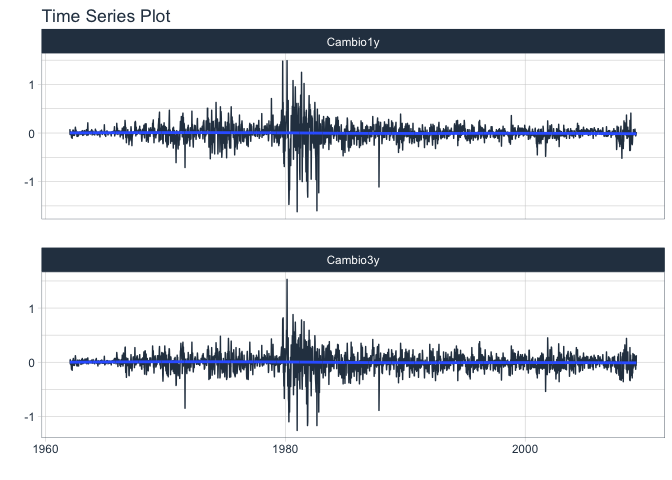

IntroSerieUnivariadas
================

## Introducción a las Series Univariadas

Vamos a cargar los datos de las series de las tasas de interés.

``` r
r1=read.table("w-gs1yr.txt",header=T)[,4] 

r3=read.table("w-gs3yr.txt",header=T)[,4]
head(r1)
```

    ## [1] 3.24 3.32 3.29 3.26 3.29 3.29

``` r
head(r3)
```

    ## [1] 3.70 3.75 3.80 3.77 3.80 3.76

``` r
str(r1)
```

    ##  num [1:2467] 3.24 3.32 3.29 3.26 3.29 3.29 3.31 3.29 3.2 3.15 ...

## Gráficas de las Series

Note que como los datos son semanales, debemos darles ese formato:

<!-- -->

    ##  Time-Series [1:2467] from 1962 to 2009: 3.24 3.32 3.29 3.26 3.29 3.29 3.31 3.29 3.2 3.15 ...

Vamos a hacer la gráficas de dispersión de las variables directamente, y
de las variables en cambios(transformadas). La ccf o función de
autocorrelación cruzada se define como las correlaciones entre

y

para


``` r
plot(r1,r3,type='p',pch=16,sub = "(a) Variables Originales")
```

<!-- -->

``` r
acf(r1)
```

<!-- -->

``` r
acf(r3)


library(forecast)
```

    ## Registered S3 method overwritten by 'quantmod':
    ##   method            from
    ##   as.zoo.data.frame zoo

<!-- -->

``` r
forecast::Ccf(r1, r3, lag.max = 48) 
```

<!-- -->

``` r
library(astsa)
```

    ## 
    ## Attaching package: 'astsa'

    ## The following object is masked from 'package:forecast':
    ## 
    ##     gas

``` r
lag2.plot(r1, r3, max.lag = 4)
```

<!-- -->

Primer ajuste de regresión para las series originales asumiendo que los
ruidos son IID, es decir vamos a ajustar el modelo


``` r
m1=lm(r3~r1)
summary(m1)
```

    ## 
    ## Call:
    ## lm(formula = r3 ~ r1)
    ## 
    ## Residuals:
    ##      Min       1Q   Median       3Q      Max 
    ## -1.82319 -0.37691 -0.01462  0.38661  1.35679 
    ## 
    ## Coefficients:
    ##             Estimate Std. Error t value Pr(>|t|)    
    ## (Intercept)  0.83214    0.02417   34.43   <2e-16 ***
    ## r1           0.92955    0.00357  260.40   <2e-16 ***
    ## ---
    ## Signif. codes:  0 '***' 0.001 '**' 0.01 '*' 0.05 '.' 0.1 ' ' 1
    ## 
    ## Residual standard error: 0.5228 on 2465 degrees of freedom
    ## Multiple R-squared:  0.9649, Adjusted R-squared:  0.9649 
    ## F-statistic: 6.781e+04 on 1 and 2465 DF,  p-value: < 2.2e-16

``` r
###Residuales del modelo
plot(m1$residuals,type='l')
```

<!-- -->

``` r
acf(m1$residuals,lag=36)
```

<!-- -->

Note que en el ajuste del modelo, las pruebas sobre los parámetros
resultan significativas, es decir son diferentes de cero. Vale la pena
notar también que los residuales del modelo paracen no ser IID, en el
sentido que no todos presentan la misma distribución, por ejemplo, la
media de las observaciones antes del tiempo t=1000 parece ser muy
distinta a la medias después del tiempo t=1000. Adicionalmente, al ver
la estructural de autocorrelación temporal, podemos ver que los
residuales resultan altamente autocorrelacionados violando el supuesto
de independencia. En términos de econometría, lo que quiere decir esto
es que las dos variables no están cointegradas, es decir, no hay una
relación de equilibrio a largo plazo(estacionaria) entre las dos
variables.

``` r
tsc1=diff(tsr1)
tsc3=diff(tsr3)
ts.plot(tsc1,tsc3, gpars = list(col = c("black", "red")),ylab="porcentaje")
legend("topright", legend=c("tsc1", "tsc3"),
       col=c("black", "red"), lty=1, cex=0.8)
```

<!-- -->

``` r
plot(tsc1,tsc3,type='p',pch=16,sub="(b) Variables en Cambios")
```

<!-- -->

``` r
acf(tsc1)
```

<!-- -->

``` r
acf(tsc3)
```

<!-- -->

``` r
library(forecast)
forecast::Ccf(tsc1, tsc3, lag.max = 48) 
```

<!-- -->

``` r
library(astsa)
lag2.plot(tsc1, tsc3, max.lag = 4)
```

<!-- -->

Veamos ahora el ajuste de los cambios de las tasas.

``` r
m2=lm(tsc3 ~ -1+tsc1) 
summary(m2)
```

    ## 
    ## Call:
    ## lm(formula = tsc3 ~ -1 + tsc1)
    ## 
    ## Residuals:
    ##      Min       1Q   Median       3Q      Max 
    ## -0.42469 -0.03589 -0.00127  0.03456  0.48911 
    ## 
    ## Coefficients:
    ##      Estimate Std. Error t value Pr(>|t|)    
    ## tsc1 0.791935   0.007337   107.9   <2e-16 ***
    ## ---
    ## Signif. codes:  0 '***' 0.001 '**' 0.01 '*' 0.05 '.' 0.1 ' ' 1
    ## 
    ## Residual standard error: 0.06896 on 2465 degrees of freedom
    ## Multiple R-squared:  0.8253, Adjusted R-squared:  0.8253 
    ## F-statistic: 1.165e+04 on 1 and 2465 DF,  p-value: < 2.2e-16

``` r
plot(m2$residuals,type='l')
```

<!-- -->

``` r
acf(m2$residuals,lag.max =48,ci.type="ma")
```

<!-- -->

``` r
pacf(m2$residuals,lag.max =48)
```

<!-- -->

Note que la pendiente de la regresión resulta significativa, y ahora los
residuales parecen estables y aunque persiste la autocorrelación, ésta
no es tan fuerte. Como persiste la autocorrelación, usaremos un modelo
de series de tiempo para que tenga en cuenta la estructura de
autcorrelación presente en los residuales.

``` r
m3=arima(tsc3,order=c(0,0,1),xreg=tsc1,include.mean=F)
m3
```

    ## 
    ## Call:
    ## arima(x = tsc3, order = c(0, 0, 1), xreg = tsc1, include.mean = F)
    ## 
    ## Coefficients:
    ##          ma1    tsc1
    ##       0.1823  0.7936
    ## s.e.  0.0196  0.0075
    ## 
    ## sigma^2 estimated as 0.0046:  log likelihood = 3136.62,  aic = -6267.23

``` r
library(lmtest)
```

    ## Loading required package: zoo

    ## 
    ## Attaching package: 'zoo'

    ## The following objects are masked from 'package:base':
    ## 
    ##     as.Date, as.Date.numeric

``` r
coeftest(m3)
```

    ## 
    ## z test of coefficients:
    ## 
    ##       Estimate Std. Error  z value  Pr(>|z|)    
    ## ma1  0.1823359  0.0195882   9.3084 < 2.2e-16 ***
    ## tsc1 0.7935840  0.0075461 105.1652 < 2.2e-16 ***
    ## ---
    ## Signif. codes:  0 '***' 0.001 '**' 0.01 '*' 0.05 '.' 0.1 ' ' 1

``` r
plot(m3$residuals)
```

<!-- -->

``` r
acf(m3$residuals,lag.max = 48)
```

<!-- -->

``` r
pacf(m3$residuals,lag.max = 48)
```

<!-- -->

Note que ahora los residuales son prácticamente no autcorrelacionados.
Vale la pena decir que aún hay una característica que sigue presente y
es la heterocedasticidad condicional, la cual estudiaremos mas adelante.
Esta alternativa de diferenciar las series fue muy popular, pero tiene
multiples dificultades, por ejemplo la interpretabilidad, la baja
eficiencia de los estimadores, entre otros, ver Libro de Peña(2010)
Página 542.

``` r
library(timetk)
library(tidyverse)
```

    ## ── Attaching packages ─────────────────────────────────────── tidyverse 1.3.1 ──

    ## ✓ ggplot2 3.3.5     ✓ purrr   0.3.4
    ## ✓ tibble  3.1.6     ✓ dplyr   1.0.8
    ## ✓ tidyr   1.2.0     ✓ stringr 1.4.0
    ## ✓ readr   2.1.2     ✓ forcats 0.5.1

    ## ── Conflicts ────────────────────────────────────────── tidyverse_conflicts() ──
    ## x dplyr::filter() masks stats::filter()
    ## x dplyr::lag()    masks stats::lag()

``` r
library(tsibble)
```

    ## 
    ## Attaching package: 'tsibble'

    ## The following object is masked from 'package:zoo':
    ## 
    ##     index

    ## The following objects are masked from 'package:base':
    ## 
    ##     intersect, setdiff, union

``` r
library(lmtest)
indice_semanal=as.Date(seq.Date(from = as.Date("1962-01-12"), # Starting date
                           length.out=2466,
                           by = "week") )
df_semanal_cambios=data.frame(Cambio1y=diff(r1),Cambio3y=diff(r3),Fechas=indice_semanal)
tstibble_semanal_cambios=as_tsibble(df_semanal_cambios) ##Detecta automáticamente la variable de fecha
```

    ## Using `Fechas` as index variable.

``` r
tstibble_unificado_cambios=tstibble_semanal_cambios%>%pivot_longer(c(Cambio1y,Cambio3y),names_to="Serie",values_to = "Cambios")
tstibble_unificado_cambios%>%group_by(Serie)%>%timetk::plot_time_series(Fechas ,Cambios,.interactive  = FALSE)
```

    ## plot_time_series(...): Groups are previously detected. Grouping by: Serie

<!-- -->

``` r
summary(m2)
```

    ## 
    ## Call:
    ## lm(formula = tsc3 ~ -1 + tsc1)
    ## 
    ## Residuals:
    ##      Min       1Q   Median       3Q      Max 
    ## -0.42469 -0.03589 -0.00127  0.03456  0.48911 
    ## 
    ## Coefficients:
    ##      Estimate Std. Error t value Pr(>|t|)    
    ## tsc1 0.791935   0.007337   107.9   <2e-16 ***
    ## ---
    ## Signif. codes:  0 '***' 0.001 '**' 0.01 '*' 0.05 '.' 0.1 ' ' 1
    ## 
    ## Residual standard error: 0.06896 on 2465 degrees of freedom
    ## Multiple R-squared:  0.8253, Adjusted R-squared:  0.8253 
    ## F-statistic: 1.165e+04 on 1 and 2465 DF,  p-value: < 2.2e-16

``` r
plot(m2$residuals,type='l')
```

<!-- -->

``` r
acf(m2$residuals,lag.max =48,ci.type="ma")
```

<!-- -->

``` r
pacf(m2$residuals,lag.max =48)
```

<!-- -->

``` r
###Parece que que un MA(7) debería ser ajustado o un AR(7)
Ajuste_arima_res=Arima(m2$residuals,order=c(0,0,1),include.mean = F)#,fixed=c(NA,0,0,NA,NA,NA,NA)
coeftest(Ajuste_arima_res)
```

    ## 
    ## z test of coefficients:
    ## 
    ##     Estimate Std. Error z value  Pr(>|z|)    
    ## ma1  0.18226    0.01959  9.3039 < 2.2e-16 ***
    ## ---
    ## Signif. codes:  0 '***' 0.001 '**' 0.01 '*' 0.05 '.' 0.1 ' ' 1

``` r
corr = nlme::corARMA(value=c(0.18),p = 0, q = 1)
salida_concorrelacion=nlme::gls(Cambio3y ~-1+ Cambio1y,tstibble_semanal_cambios,correlation = corr)
salida_concorrelacion
```

    ## Generalized least squares fit by REML
    ##   Model: Cambio3y ~ -1 + Cambio1y 
    ##   Data: tstibble_semanal_cambios 
    ##   Log-restricted-likelihood: 3132.647
    ## 
    ## Coefficients:
    ##  Cambio1y 
    ## 0.7935854 
    ## 
    ## Correlation Structure: ARMA(0,1)
    ##  Formula: ~1 
    ##  Parameter estimate(s):
    ##    Theta1 
    ## 0.1823935 
    ## Degrees of freedom: 2466 total; 2465 residual
    ## Residual standard error: 0.06895341

``` r
coeftest(salida_concorrelacion)
```

    ## 
    ## z test of coefficients:
    ## 
    ##           Estimate Std. Error z value  Pr(>|z|)    
    ## Cambio1y 0.7935854  0.0075463  105.16 < 2.2e-16 ***
    ## ---
    ## Signif. codes:  0 '***' 0.001 '**' 0.01 '*' 0.05 '.' 0.1 ' ' 1

Note que este resultado es análogo al obtenido al hacer la regresión con
errores ARMA de la función Arima.
