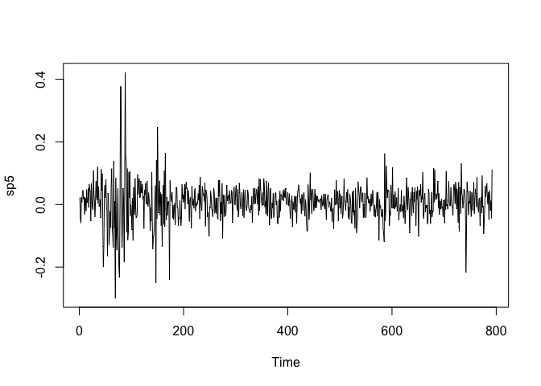
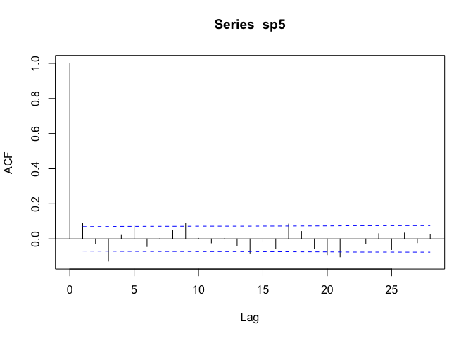
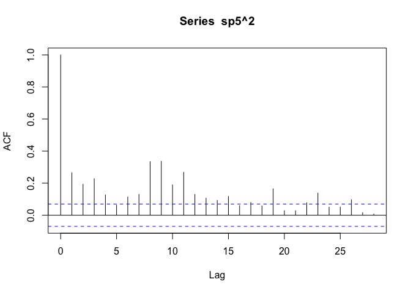
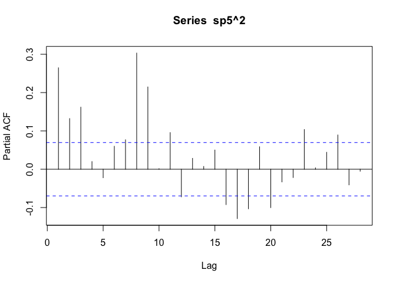

ARCH y GARCH en R
================

## Modelos ARCH y GARCH

Vamos a trabajar los modelos ARCH y GARCH. Sean {*r*<sub>*t*</sub>} la
serie de retornos tal que
*r*<sub>*t*</sub> = *μ*<sub>*t*</sub> + *a*<sub>*t*</sub>

donde
*μ*<sub>*t*</sub> = *E*\[*r*<sub>*t*</sub>\|*F*<sub>*t* − 1</sub>\],   *σ*<sub>*t*</sub><sup>2</sup> = *V**a**r*\[*r*<sub>*t*</sub>\|*F*<sub>*t* − 1</sub>\] = *E*\[(*r*<sub>*t*</sub> − *μ*<sub>*t*</sub>)<sup>2</sup>\|*F*<sub>*t* − 1</sub>\] = *V**a**r*(*a*<sub>*t*</sub>\|*F*<sub>*t* − 1</sub>)

donde *μ*<sub>*t*</sub> es un proceso estocástico estacionario que puede
ser modelado mediante un proceso ARMA(p,q), y
*a*<sub>*t*</sub> = *σ*<sub>*t*</sub>*ε*<sub>*t*</sub>     *σ*<sub>*t*</sub><sup>2</sup> = *α*<sub>0</sub> + *α*<sub>1</sub>*a*<sub>*t* − 1</sub><sup>2</sup> + ⋯ + *α*<sub>*t* − *m*</sub>*a*<sub>*t* − *m*</sub><sup>2</sup>.

``` r
library(fGarch)
```

    ## Loading required package: timeDate

    ## Loading required package: timeSeries

    ## Loading required package: fBasics

``` r
library(aTSA)
```

    ## 
    ## Attaching package: 'aTSA'

    ## The following object is masked from 'package:graphics':
    ## 
    ##     identify

``` r
library(forecast)
```

    ## Registered S3 method overwritten by 'quantmod':
    ##   method            from
    ##   as.zoo.data.frame zoo

    ## 
    ## Attaching package: 'forecast'

    ## The following object is masked from 'package:aTSA':
    ## 
    ##     forecast

## Simulación

Vamos a plantear un un ejemplo simulado. Vamos a simular un modelo
ARCH(2).
*a*<sub>*t*</sub> = *σ*<sub>*t*</sub>*ε*<sub>*t*</sub>     *σ*<sub>*t*</sub><sup>2</sup> = *α*<sub>0</sub> + *α*<sub>1</sub>*a*<sub>*t* − 1</sub><sup>2</sup> + *α*<sub>*t* − 2</sub>*a*<sub>*t* − 2</sub><sup>2</sup>.
con *α*<sub>1</sub> = 0.2, *α*<sub>2</sub> = 0.4 y *α*<sub>0</sub> = 0

``` r
set.seed(12)
spec = garchSpec(model = list(alpha = c(0.2, 0.4), beta = 0))
ARCH2=garchSim(spec, n = 500)
plot(ARCH2)
```

<!-- -->

``` r
acf(ARCH2)
```

<!-- -->

``` r
acf(ARCH2,ci.type="ma")
```

<!-- -->

``` r
pacf(ARCH2)
```

<!-- -->

``` r
acf(ARCH2^2)
```

<!-- -->

``` r
pacf(ARCH2^2)
```

<!-- -->

``` r
Box.test(ARCH2^2,lag=20,type='Ljung-Box')
```

    ## 
    ##  Box-Ljung test
    ## 
    ## data:  ARCH2^2
    ## X-squared = 71.733, df = 20, p-value = 9.469e-08

``` r
hist(ARCH2)
```

<!-- -->

``` r
salidaarima=arima(ARCH2,order = c(3,0,0),include.mean = FALSE,fixed=c(NA,NA,NA))
library(lmtest)
```

    ## Loading required package: zoo

    ## 
    ## Attaching package: 'zoo'

    ## The following object is masked from 'package:timeSeries':
    ## 
    ##     time<-

    ## The following objects are masked from 'package:base':
    ## 
    ##     as.Date, as.Date.numeric

``` r
coeftest(salidaarima)
```

    ## 
    ## z test of coefficients:
    ## 
    ##      Estimate Std. Error z value Pr(>|z|)  
    ## ar1 -0.061696   0.044760 -1.3784  0.16808  
    ## ar2 -0.096996   0.044714 -2.1693  0.03006 *
    ## ar3  0.098542   0.044809  2.1992  0.02787 *
    ## ---
    ## Signif. codes:  0 '***' 0.001 '**' 0.01 '*' 0.05 '.' 0.1 ' ' 1

``` r
salidaarima
```

    ## 
    ## Call:
    ## arima(x = ARCH2, order = c(3, 0, 0), include.mean = FALSE, fixed = c(NA, NA, 
    ##     NA))
    ## 
    ## Coefficients:
    ##           ar1      ar2     ar3
    ##       -0.0617  -0.0970  0.0985
    ## s.e.   0.0448   0.0447  0.0448
    ## 
    ## sigma^2 estimated as 1.848e-06:  log likelihood = 2590.85,  aic = -5173.69

``` r
####Pruebas Portmanteau#####
##Efectos ARCH
arch.test(salidaarima)
```

    ## ARCH heteroscedasticity test for residuals 
    ## alternative: heteroscedastic 
    ## 
    ## Portmanteau-Q test: 
    ##      order   PQ  p.value
    ## [1,]     4 44.7 4.55e-09
    ## [2,]     8 46.0 2.43e-07
    ## [3,]    12 47.8 3.40e-06
    ## [4,]    16 48.4 4.18e-05
    ## [5,]    20 53.3 7.43e-05
    ## [6,]    24 56.7 1.83e-04
    ## Lagrange-Multiplier test: 
    ##      order    LM  p.value
    ## [1,]     4 156.6 0.00e+00
    ## [2,]     8  75.5 1.14e-13
    ## [3,]    12  48.5 1.17e-06
    ## [4,]    16  35.6 1.99e-03
    ## [5,]    20  27.0 1.04e-01
    ## [6,]    24  21.6 5.45e-01

<!-- -->

``` r
resarma=residuals(salidaarima)^2

pacf(resarma,lag.max = 20)
```

<!-- -->

``` r
######Ajuste de la serie
m=fGarch::garchFit(formula=~arma(0,0)+garch(2,0),data=ARCH2$garch,trace=F,include.mean = FALSE)
```

    ## Warning: Using formula(x) is deprecated when x is a character vector of length > 1.
    ##   Consider formula(paste(x, collapse = " ")) instead.

``` r
m
```

    ## 
    ## Title:
    ##  GARCH Modelling 
    ## 
    ## Call:
    ##  fGarch::garchFit(formula = ~arma(0, 0) + garch(2, 0), data = ARCH2$garch, 
    ##     include.mean = FALSE, trace = F) 
    ## 
    ## Mean and Variance Equation:
    ##  data ~ arma(0, 0) + garch(2, 0)
    ## <environment: 0x7fa14c36da38>
    ##  [data = ARCH2$garch]
    ## 
    ## Conditional Distribution:
    ##  norm 
    ## 
    ## Coefficient(s):
    ##      omega      alpha1      alpha2  
    ## 9.8967e-07  1.3911e-01  3.5788e-01  
    ## 
    ## Std. Errors:
    ##  based on Hessian 
    ## 
    ## Error Analysis:
    ##         Estimate  Std. Error  t value Pr(>|t|)    
    ## omega  9.897e-07   1.187e-07    8.336  < 2e-16 ***
    ## alpha1 1.391e-01   5.484e-02    2.536   0.0112 *  
    ## alpha2 3.579e-01   7.996e-02    4.475 7.63e-06 ***
    ## ---
    ## Signif. codes:  0 '***' 0.001 '**' 0.01 '*' 0.05 '.' 0.1 ' ' 1
    ## 
    ## Log Likelihood:
    ##  2614.238    normalized:  5.228476 
    ## 
    ## Description:
    ##  Tue Jul 20 07:28:33 2021 by user:

## Ejemplo real S&P 500

``` r
sp5=as.ts(scan(file="/Users/macbook/Documents/GitHub/TimeSeries/Bases de Datos/SP500.txt"))

plot(sp5)
```

<!-- -->

``` r
acf(sp5)
```

<!-- -->

``` r
acf(sp5,ci.type="ma")
```

<!-- -->

``` r
pacf(sp5) 
```

<!-- -->

``` r
acf(sp5^2)
```

<!-- -->

``` r
pacf(sp5^2)
```

<!-- -->

``` r
coeftest(auto.arima(sp5)) ####Se podría ajustar un ARMA(2,3) con constante
```

    ## 
    ## z test of coefficients:
    ## 
    ##             Estimate Std. Error z value Pr(>|z|)    
    ## ar1       -0.1702494  0.1587912 -1.0722 0.283649    
    ## ar2       -0.6008847  0.1151817 -5.2168 1.82e-07 ***
    ## ma1        0.2657245  0.1608483  1.6520 0.098531 .  
    ## ma2        0.6261631  0.1301805  4.8100 1.51e-06 ***
    ## ma3       -0.0804203  0.0473898 -1.6970 0.089698 .  
    ## intercept  0.0061580  0.0020829  2.9565 0.003112 ** 
    ## ---
    ## Signif. codes:  0 '***' 0.001 '**' 0.01 '*' 0.05 '.' 0.1 ' ' 1

``` r
modeloarima=arima(sp5,order = c(2,0,2),include.mean = TRUE)
coeftest(modeloarima)
```

    ## 
    ## z test of coefficients:
    ## 
    ##             Estimate Std. Error z value  Pr(>|z|)    
    ## ar1       -0.3615738  0.1201389 -3.0096  0.002616 ** 
    ## ar2       -0.7183591  0.0804205 -8.9325 < 2.2e-16 ***
    ## ma1        0.4832025  0.1031864  4.6828  2.83e-06 ***
    ## ma2        0.7970222  0.0788931 10.1026 < 2.2e-16 ***
    ## intercept  0.0061644  0.0022354  2.7576  0.005822 ** 
    ## ---
    ## Signif. codes:  0 '***' 0.001 '**' 0.01 '*' 0.05 '.' 0.1 ' ' 1

``` r
arch.test(modeloarima)
```

    ## ARCH heteroscedasticity test for residuals 
    ## alternative: heteroscedastic 
    ## 
    ## Portmanteau-Q test: 
    ##      order  PQ p.value
    ## [1,]     4 118       0
    ## [2,]     8 226       0
    ## [3,]    12 393       0
    ## [4,]    16 436       0
    ## [5,]    20 470       0
    ## [6,]    24 496       0
    ## Lagrange-Multiplier test: 
    ##      order    LM  p.value
    ## [1,]     4 796.3 0.00e+00
    ## [2,]     8 365.1 0.00e+00
    ## [3,]    12 140.6 0.00e+00
    ## [4,]    16 102.7 4.00e-15
    ## [5,]    20  75.4 1.15e-08
    ## [6,]    24  56.4 1.25e-04

<!-- -->

``` r
acf(modeloarima$residual)
```

<!-- -->

``` r
pacf(modeloarima$residual)
```

<!-- -->

``` r
acf(modeloarima$residual^2)
```

<!-- -->

``` r
pacf(modeloarima$residual^2)
```

<!-- -->

``` r
modelosp5_1=garchFit(~arma(2,2)+garch(1,1),data=sp5,trace=F,include.mean=T)
```

    ## Warning: Using formula(x) is deprecated when x is a character vector of length > 1.
    ##   Consider formula(paste(x, collapse = " ")) instead.

``` r
summary(modelosp5_1)
```

    ## 
    ## Title:
    ##  GARCH Modelling 
    ## 
    ## Call:
    ##  garchFit(formula = ~arma(2, 2) + garch(1, 1), data = sp5, include.mean = T, 
    ##     trace = F) 
    ## 
    ## Mean and Variance Equation:
    ##  data ~ arma(2, 2) + garch(1, 1)
    ## <environment: 0x7fa14a0e1e38>
    ##  [data = sp5]
    ## 
    ## Conditional Distribution:
    ##  norm 
    ## 
    ## Coefficient(s):
    ##          mu          ar1          ar2          ma1          ma2        omega  
    ##  1.4173e-02  -1.1856e-01  -7.9138e-01   1.7198e-01   7.6272e-01   7.7978e-05  
    ##      alpha1        beta1  
    ##  1.1961e-01   8.5716e-01  
    ## 
    ## Std. Errors:
    ##  based on Hessian 
    ## 
    ## Error Analysis:
    ##          Estimate  Std. Error  t value Pr(>|t|)    
    ## mu      1.417e-02   3.156e-03    4.491 7.10e-06 ***
    ## ar1    -1.186e-01   1.188e-01   -0.998  0.31810    
    ## ar2    -7.914e-01   1.101e-01   -7.188 6.59e-13 ***
    ## ma1     1.720e-01   1.316e-01    1.307  0.19114    
    ## ma2     7.627e-01   1.142e-01    6.678 2.42e-11 ***
    ## omega   7.798e-05   2.755e-05    2.830  0.00465 ** 
    ## alpha1  1.196e-01   2.176e-02    5.497 3.87e-08 ***
    ## beta1   8.572e-01   2.151e-02   39.850  < 2e-16 ***
    ## ---
    ## Signif. codes:  0 '***' 0.001 '**' 0.01 '*' 0.05 '.' 0.1 ' ' 1
    ## 
    ## Log Likelihood:
    ##  1273.095    normalized:  1.607443 
    ## 
    ## Description:
    ##  Tue Jul 20 07:28:35 2021 by user:  
    ## 
    ## 
    ## Standardised Residuals Tests:
    ##                                 Statistic p-Value     
    ##  Jarque-Bera Test   R    Chi^2  72.64715  2.220446e-16
    ##  Shapiro-Wilk Test  R    W      0.9861062 7.819443e-07
    ##  Ljung-Box Test     R    Q(10)  8.159195  0.6132902   
    ##  Ljung-Box Test     R    Q(15)  12.96419  0.605064    
    ##  Ljung-Box Test     R    Q(20)  21.54717  0.3655789   
    ##  Ljung-Box Test     R^2  Q(10)  10.24997  0.4188431   
    ##  Ljung-Box Test     R^2  Q(15)  13.93336  0.5305891   
    ##  Ljung-Box Test     R^2  Q(20)  15.84599  0.7261316   
    ##  LM Arch Test       R    TR^2   12.85762  0.3794736   
    ## 
    ## Information Criterion Statistics:
    ##       AIC       BIC       SIC      HQIC 
    ## -3.194684 -3.147466 -3.194885 -3.176536

``` r
#plot(modelosp5_1)  ###Gráfico de volatilidad
prediccion=predict(modelosp5_1,n.ahead=10)
```

    ## Warning in a_vec[i] <- ar[1:min(u2, i - 1)] * a_vec[(i - 1):(i - u2)] + : number
    ## of items to replace is not a multiple of replacement length

    ## Warning in a_vec[i] <- ar[1:min(u2, i - 1)] * a_vec[(i - 1):(i - u2)] + : number
    ## of items to replace is not a multiple of replacement length

    ## Warning in a_vec[i] <- ar[1:min(u2, i - 1)] * a_vec[(i - 1):(i - u2)] + : number
    ## of items to replace is not a multiple of replacement length

    ## Warning in a_vec[i] <- ar[1:min(u2, i - 1)] * a_vec[(i - 1):(i - u2)] + : number
    ## of items to replace is not a multiple of replacement length

    ## Warning in a_vec[i] <- ar[1:min(u2, i - 1)] * a_vec[(i - 1):(i - u2)] + : number
    ## of items to replace is not a multiple of replacement length

    ## Warning in a_vec[i] <- ar[1:min(u2, i - 1)] * a_vec[(i - 1):(i - u2)] + : number
    ## of items to replace is not a multiple of replacement length

    ## Warning in a_vec[i] <- ar[1:min(u2, i - 1)] * a_vec[(i - 1):(i - u2)] + : number
    ## of items to replace is not a multiple of replacement length

``` r
library(rugarch)
```

    ## Loading required package: parallel

    ## 
    ## Attaching package: 'rugarch'

    ## The following object is masked from 'package:stats':
    ## 
    ##     sigma

``` r
spec1=ugarchspec(variance.model=list(model="sGARCH",garchOrder = c(3,0)),
                 mean.model=list(armaOrder=c(9,0),include.mean = TRUE),distribution.model = "norm",fixed.pars = list(ar1=0,ar2=0,ar3=0,ar4=0,
                                                                                                  alpha1=0))

fit1=ugarchfit(data=sp5,spec=spec1)
show(fit1)
```

    ## 
    ## *---------------------------------*
    ## *          GARCH Model Fit        *
    ## *---------------------------------*
    ## 
    ## Conditional Variance Dynamics    
    ## -----------------------------------
    ## GARCH Model  : sGARCH(3,0)
    ## Mean Model   : ARFIMA(9,0,0)
    ## Distribution : norm 
    ## 
    ## Optimal Parameters
    ## ------------------------------------
    ##         Estimate  Std. Error  t value Pr(>|t|)
    ## mu      0.006255    0.001723  3.63068 0.000283
    ## ar1     0.000000          NA       NA       NA
    ## ar2     0.000000          NA       NA       NA
    ## ar3     0.000000          NA       NA       NA
    ## ar4     0.000000          NA       NA       NA
    ## ar5     0.114630    0.033005  3.47308 0.000515
    ## ar6    -0.129274    0.031139 -4.15152 0.000033
    ## ar7     0.078756    0.027615  2.85192 0.004346
    ## ar8    -0.011029    0.029033 -0.37988 0.704032
    ## ar9     0.045571    0.030248  1.50658 0.131919
    ## omega   0.001226    0.000121 10.12579 0.000000
    ## alpha1  0.000000          NA       NA       NA
    ## alpha2  0.265648    0.056265  4.72138 0.000002
    ## alpha3  0.446247    0.076769  5.81283 0.000000
    ## 
    ## Robust Standard Errors:
    ##         Estimate  Std. Error  t value Pr(>|t|)
    ## mu      0.006255    0.001811   3.4531 0.000554
    ## ar1     0.000000          NA       NA       NA
    ## ar2     0.000000          NA       NA       NA
    ## ar3     0.000000          NA       NA       NA
    ## ar4     0.000000          NA       NA       NA
    ## ar5     0.114630    0.050552   2.2676 0.023355
    ## ar6    -0.129274    0.050104  -2.5801 0.009876
    ## ar7     0.078756    0.045215   1.7418 0.081542
    ## ar8    -0.011029    0.041984  -0.2627 0.792782
    ## ar9     0.045571    0.040026   1.1386 0.254890
    ## omega   0.001226    0.000142   8.6458 0.000000
    ## alpha1  0.000000          NA       NA       NA
    ## alpha2  0.265648    0.097769   2.7171 0.006586
    ## alpha3  0.446247    0.116788   3.8210 0.000133
    ## 
    ## LogLikelihood : 1244.19 
    ## 
    ## Information Criteria
    ## ------------------------------------
    ##                     
    ## Akaike       -3.1192
    ## Bayes        -3.0660
    ## Shibata      -3.1194
    ## Hannan-Quinn -3.0988
    ## 
    ## Weighted Ljung-Box Test on Standardized Residuals
    ## ------------------------------------
    ##                          statistic  p-value
    ## Lag[1]                     0.04428 0.833338
    ## Lag[2*(p+q)+(p+q)-1][26]  20.93023 0.000000
    ## Lag[4*(p+q)+(p+q)-1][44]  33.28526 0.003135
    ## d.o.f=9
    ## H0 : No serial correlation
    ## 
    ## Weighted Ljung-Box Test on Standardized Squared Residuals
    ## ------------------------------------
    ##                          statistic p-value
    ## Lag[1]                       5.884 0.01528
    ## Lag[2*(p+q)+(p+q)-1][8]     10.823 0.02257
    ## Lag[4*(p+q)+(p+q)-1][14]    19.052 0.00346
    ## d.o.f=3
    ## 
    ## Weighted ARCH LM Tests
    ## ------------------------------------
    ##             Statistic Shape Scale P-Value
    ## ARCH Lag[4]    0.2226 0.500 2.000 0.63705
    ## ARCH Lag[6]    2.1263 1.461 1.711 0.46357
    ## ARCH Lag[8]    8.8698 2.368 1.583 0.04034
    ## 
    ## Nyblom stability test
    ## ------------------------------------
    ## Joint Statistic:  2.8177
    ## Individual Statistics:              
    ## mu     0.09325
    ## ar5    0.01983
    ## ar6    0.02487
    ## ar7    0.43181
    ## ar8    0.12044
    ## ar9    0.32255
    ## omega  0.81991
    ## alpha2 0.68999
    ## alpha3 0.87714
    ## 
    ## Asymptotic Critical Values (10% 5% 1%)
    ## Joint Statistic:          2.1 2.32 2.82
    ## Individual Statistic:     0.35 0.47 0.75
    ## 
    ## Sign Bias Test
    ## ------------------------------------
    ##                    t-value     prob sig
    ## Sign Bias           0.5766 0.564352    
    ## Negative Sign Bias  2.7909 0.005383 ***
    ## Positive Sign Bias  0.2572 0.797084    
    ## Joint Effect       14.4726 0.002328 ***
    ## 
    ## 
    ## Adjusted Pearson Goodness-of-Fit Test:
    ## ------------------------------------
    ##   group statistic p-value(g-1)
    ## 1    20     30.22     0.049038
    ## 2    30     49.14     0.011171
    ## 3    40     54.87     0.047293
    ## 4    50     76.31     0.007512
    ## 
    ## 
    ## Elapsed time : 0.4795122
