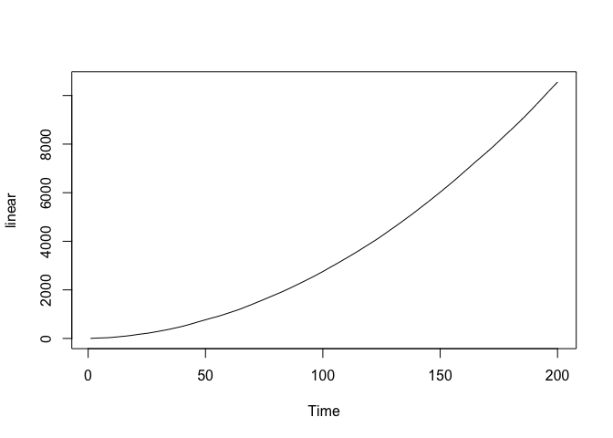
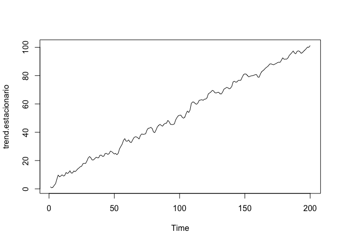
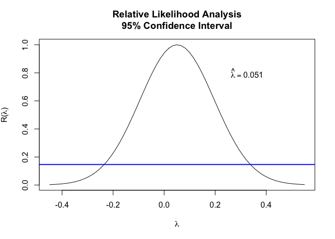
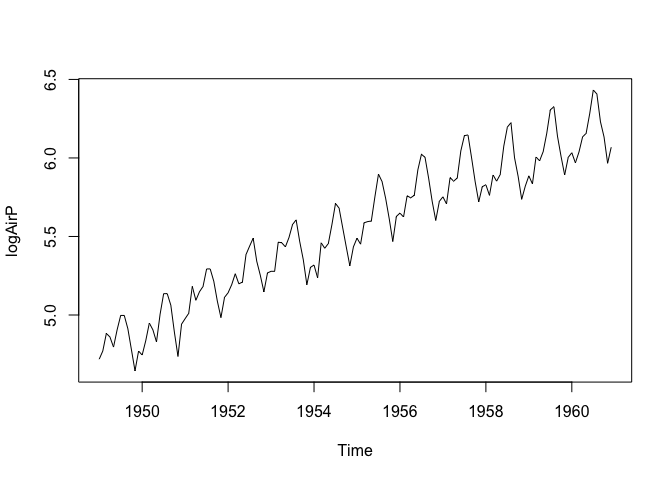

ARIMA
================

Ejercicio de Simulación Modelos ARIMA
-------------------------------------

Vamos a ver que existen varios escenarios de raíces unitarias en modelos
ARIMA

``` r
library(urca)
library(forecast)
```

    ## Registered S3 method overwritten by 'quantmod':
    ##   method            from
    ##   as.zoo.data.frame zoo

``` r
library(tseries)
library(lmtest)
```

    ## Loading required package: zoo

    ## 
    ## Attaching package: 'zoo'

    ## The following objects are masked from 'package:base':
    ## 
    ##     as.Date, as.Date.numeric

``` r
library(uroot)
library(fUnitRoots)
```

    ## Loading required package: timeDate

    ## Loading required package: timeSeries

    ## 
    ## Attaching package: 'timeSeries'

    ## The following object is masked from 'package:zoo':
    ## 
    ##     time<-

    ## Loading required package: fBasics

    ## 
    ## Attaching package: 'fUnitRoots'

    ## The following objects are masked from 'package:urca':
    ## 
    ##     punitroot, qunitroot, unitrootTable

``` r
######Ejercicios de Simulación#####
###################################
Tlength=200
a0=3
a1=0.5
tiempo=seq(1:Tlength)
xt=a1*tiempo
tendencia=a0+a1*tiempo
drift=a1*rep(1,Tlength)
arimaej=arima.sim(list(order = c(1,0,1), ar = 0.7,ma=0.6), n = Tlength)

plot(arimaej)
```

<!-- -->

``` r
drift=as.ts(cumsum(arimaej+a0))

plot(drift)   ###Caminata Aleatoria Con Drift
```

<!-- -->

``` r
linear=as.ts(cumsum(arimaej+a0+xt))

plot(linear)  ###Caminata Aleatoria alrededor de una linea recta.
```

<!-- -->

``` r
fUnitRoots::adfTest(arimaej,lags = 10,type='nc')   ####No hay presencia de Raíz Unitaria
```

    ## Warning in fUnitRoots::adfTest(arimaej, lags = 10, type = "nc"): p-value smaller
    ## than printed p-value

    ## 
    ## Title:
    ##  Augmented Dickey-Fuller Test
    ## 
    ## Test Results:
    ##   PARAMETER:
    ##     Lag Order: 10
    ##   STATISTIC:
    ##     Dickey-Fuller: -4.3262
    ##   P VALUE:
    ##     0.01 
    ## 
    ## Description:
    ##  Fri Nov 20 05:56:08 2020 by user:

``` r
tseries::adf.test(drift)   ####Note que hay Presencia de Raíz Unitaria
```

    ## 
    ##  Augmented Dickey-Fuller Test
    ## 
    ## data:  drift
    ## Dickey-Fuller = -3.0165, Lag order = 5, p-value = 0.1504
    ## alternative hypothesis: stationary

``` r
fUnitRoots::adfTest(drift,lags = 10,type='c')
```

    ## Warning in fUnitRoots::adfTest(drift, lags = 10, type = "c"): p-value greater
    ## than printed p-value

    ## 
    ## Title:
    ##  Augmented Dickey-Fuller Test
    ## 
    ## Test Results:
    ##   PARAMETER:
    ##     Lag Order: 10
    ##   STATISTIC:
    ##     Dickey-Fuller: 0.6841
    ##   P VALUE:
    ##     0.99 
    ## 
    ## Description:
    ##  Fri Nov 20 05:56:08 2020 by user:

``` r
###Otro Ejemplo

estacionario=arima.sim(list(order = c(1,0,1), ar = 0.7,ma=0.6), n = Tlength)
trend.estacionario=tendencia+estacionario
#x11()
plot(trend.estacionario)
```

<!-- -->

``` r
fUnitRoots::adfTest(trend.estacionario,lags=10)
```

    ## Warning in fUnitRoots::adfTest(trend.estacionario, lags = 10): p-value greater
    ## than printed p-value

    ## 
    ## Title:
    ##  Augmented Dickey-Fuller Test
    ## 
    ## Test Results:
    ##   PARAMETER:
    ##     Lag Order: 10
    ##   STATISTIC:
    ##     Dickey-Fuller: 3.3168
    ##   P VALUE:
    ##     0.99 
    ## 
    ## Description:
    ##  Fri Nov 20 05:56:08 2020 by user:

``` r
fUnitRoots::adfTest(trend.estacionario,lags=1,type='ct')   ###Cambie 11 rezago hasta 
```

    ## Warning in fUnitRoots::adfTest(trend.estacionario, lags = 1, type = "ct"): p-
    ## value smaller than printed p-value

    ## 
    ## Title:
    ##  Augmented Dickey-Fuller Test
    ## 
    ## Test Results:
    ##   PARAMETER:
    ##     Lag Order: 1
    ##   STATISTIC:
    ##     Dickey-Fuller: -6.3428
    ##   P VALUE:
    ##     0.01 
    ## 
    ## Description:
    ##  Fri Nov 20 05:56:08 2020 by user:

Serie de Pasajeros
------------------

Vamos a Analizar la Serie de Pasajeros.Iniciamos con las gráficas y
transformaicón de Box-Cox

<!-- -->

    ## [1] 4.102259e-05

    ## [1] 0.2

    ##           Jan      Feb      Mar      Apr      May      Jun      Jul      Aug
    ## 1949 2.548484 2.561375 2.588408 2.582937 2.567506 2.593720 2.615089 2.615089
    ## 1950 2.555038 2.577299 2.603899 2.593720 2.575381 2.616631 2.646225 2.646225
    ## 1951 2.610379 2.618160 2.656279 2.636912 2.648795 2.656279 2.680103 2.680103
    ## 1952 2.647515 2.658701 2.673640 2.659900 2.662270 2.699009 2.709884 2.720049
    ## 1953 2.676904 2.676904 2.715050 2.714201 2.709007 2.720866 2.737089 2.742835
    ## 1954 2.685298 2.668053 2.714201 2.707236 2.713347 2.737089 2.762580 2.756933
    ## 1955 2.720049 2.712489 2.739270 2.740706 2.741419 2.770363 2.796341 2.787869
    ## 1956 2.751056 2.746317 2.771524 2.769193 2.772100 2.801088 2.818144 2.814820
    ## 1957 2.770363 2.761963 2.792420 2.788382 2.791921 2.821786 2.837892 2.838594
    ## 1958 2.784223 2.772100 2.795371 2.788382 2.795857 2.826872 2.846724 2.851232
    ## 1959 2.794394 2.785275 2.815241 2.810978 2.820985 2.840332 2.864126 2.867216
    ## 1960 2.819775 2.808794 2.820583 2.836477 2.840332 2.860370 2.883509 2.879580
    ##           Sep      Oct      Nov      Dec
    ## 1949 2.595457 2.563441 2.529834 2.561375
    ## 1950 2.629937 2.590196 2.552878 2.602242
    ## 1951 2.663443 2.635540 2.611963 2.640966
    ## 1952 2.690331 2.671428 2.648795 2.674735
    ## 1953 2.715895 2.692301 2.658701 2.682201
    ## 1954 2.733382 2.709007 2.684272 2.709007
    ## 1955 2.768604 2.744238 2.715895 2.747003
    ## 1956 2.791921 2.765020 2.742129 2.765020
    ## 1957 2.814399 2.787869 2.764414 2.782096
    ## 1958 2.814399 2.793903 2.767420 2.782631
    ## 1959 2.837187 2.815659 2.795371 2.814820
    ## 1960 2.852177 2.836477 2.808352 2.825716

<!-- --><!-- -->
\#\# Prueba de Raíz Unitaria Ahora avanzamos en el setido de verificar
si la serie muestra la presencia de una o varias raíces unitarias

``` r
adf.test(log(AirPassengers))
```

    ## Warning in adf.test(log(AirPassengers)): p-value smaller than printed p-value

    ## 
    ##  Augmented Dickey-Fuller Test
    ## 
    ## data:  log(AirPassengers)
    ## Dickey-Fuller = -6.4215, Lag order = 5, p-value = 0.01
    ## alternative hypothesis: stationary

``` r
adf.test(log(AirPassengers),k=12)
```

    ## 
    ##  Augmented Dickey-Fuller Test
    ## 
    ## data:  log(AirPassengers)
    ## Dickey-Fuller = -1.5325, Lag order = 12, p-value = 0.7711
    ## alternative hypothesis: stationary

``` r
summary(ur.df(log(AirPassengers),type="none"))
```

    ## 
    ## ############################################### 
    ## # Augmented Dickey-Fuller Test Unit Root Test # 
    ## ############################################### 
    ## 
    ## Test regression none 
    ## 
    ## 
    ## Call:
    ## lm(formula = z.diff ~ z.lag.1 - 1 + z.diff.lag)
    ## 
    ## Residuals:
    ##      Min       1Q   Median       3Q      Max 
    ## -0.23549 -0.08367 -0.01237  0.09522  0.23398 
    ## 
    ## Coefficients:
    ##            Estimate Std. Error t value Pr(>|t|)  
    ## z.lag.1    0.001074   0.001593   0.674   0.5014  
    ## z.diff.lag 0.201544   0.083094   2.425   0.0166 *
    ## ---
    ## Signif. codes:  0 '***' 0.001 '**' 0.01 '*' 0.05 '.' 0.1 ' ' 1
    ## 
    ## Residual standard error: 0.1052 on 140 degrees of freedom
    ## Multiple R-squared:  0.04554,    Adjusted R-squared:  0.03191 
    ## F-statistic:  3.34 on 2 and 140 DF,  p-value: 0.03828
    ## 
    ## 
    ## Value of test-statistic is: 0.674 
    ## 
    ## Critical values for test statistics: 
    ##       1pct  5pct 10pct
    ## tau1 -2.58 -1.95 -1.62

``` r
summary(ur.df(log(AirPassengers),type="drift"))
```

    ## 
    ## ############################################### 
    ## # Augmented Dickey-Fuller Test Unit Root Test # 
    ## ############################################### 
    ## 
    ## Test regression drift 
    ## 
    ## 
    ## Call:
    ## lm(formula = z.diff ~ z.lag.1 + 1 + z.diff.lag)
    ## 
    ## Residuals:
    ##      Min       1Q   Median       3Q      Max 
    ## -0.20882 -0.09145 -0.01097  0.09113  0.22095 
    ## 
    ## Coefficients:
    ##             Estimate Std. Error t value Pr(>|t|)  
    ## (Intercept)  0.23228    0.11177   2.078   0.0395 *
    ## z.lag.1     -0.04059    0.02011  -2.018   0.0455 *
    ## z.diff.lag   0.21487    0.08238   2.608   0.0101 *
    ## ---
    ## Signif. codes:  0 '***' 0.001 '**' 0.01 '*' 0.05 '.' 0.1 ' ' 1
    ## 
    ## Residual standard error: 0.1039 on 139 degrees of freedom
    ## Multiple R-squared:  0.06749,    Adjusted R-squared:  0.05407 
    ## F-statistic:  5.03 on 2 and 139 DF,  p-value: 0.00778
    ## 
    ## 
    ## Value of test-statistic is: -2.0185 2.3921 
    ## 
    ## Critical values for test statistics: 
    ##       1pct  5pct 10pct
    ## tau2 -3.46 -2.88 -2.57
    ## phi1  6.52  4.63  3.81

``` r
######SE debe chequear si hay que difereciar de nuevo!!!
dlogAirPass=diff(logAirP)
plot(dlogAirPass)
```

<!-- -->

``` r
#####Transformación requrida para los datos(transformación Box-Cox y diferencia ordinaria)
```

Identificación del Modelo Usando ACF y PACF
-------------------------------------------

``` r
####Identificación de los Órdenes Autoregresivos
acf(dlogAirPass,lag.max = 24)  ###Se requiere un MA de orden muy grande
```

<!-- -->

``` r
pacf(dlogAirPass,lag.max = 24)  ####Puede ser un autoregresivo de orden 12
```

<!-- -->

Ajuste del Modelo
-----------------

``` r
#####Ajuste del Modelo
####Note que entramos la serie original
library(TSA)
```

    ## Registered S3 methods overwritten by 'TSA':
    ##   method       from    
    ##   fitted.Arima forecast
    ##   plot.Arima   forecast

    ## 
    ## Attaching package: 'TSA'

    ## The following objects are masked from 'package:timeDate':
    ## 
    ##     kurtosis, skewness

    ## The following objects are masked from 'package:stats':
    ## 
    ##     acf, arima

    ## The following object is masked from 'package:utils':
    ## 
    ##     tar

``` r
AjusteArima=forecast::Arima(AirPassengers,order = c(12,1,0),lambda = 0,include.constant = TRUE)
summary(AjusteArima)
```

    ## Series: AirPassengers 
    ## ARIMA(12,1,0) with drift 
    ## Box Cox transformation: lambda= 0 
    ## 
    ## Coefficients:
    ##           ar1      ar2      ar3      ar4      ar5      ar6     ar7      ar8
    ##       -0.2212  -0.2835  -0.2550  -0.2973  -0.2299  -0.2622  -0.257  -0.3274
    ## s.e.   0.0670   0.0679   0.0673   0.0699   0.0679   0.0657   0.066   0.0679
    ##           ar9     ar10    ar11    ar12   drift
    ##       -0.2194  -0.2934  -0.198  0.6020  0.0098
    ## s.e.   0.0684   0.0681   0.068  0.0683  0.0011
    ## 
    ## sigma^2 estimated as 0.001807:  log likelihood=246.66
    ## AIC=-465.31   AICc=-462.03   BIC=-423.83
    ## 
    ## Training set error measures:
    ##                      ME     RMSE      MAE          MPE     MAPE      MASE
    ## Training set -0.1137697 10.82763 8.086473 -0.007108351 3.093656 0.2524632
    ##                    ACF1
    ## Training set -0.2063749

``` r
coeftest(AjusteArima)
```

    ## 
    ## z test of coefficients:
    ## 
    ##         Estimate Std. Error z value  Pr(>|z|)    
    ## ar1   -0.2212162  0.0669842 -3.3025 0.0009582 ***
    ## ar2   -0.2834744  0.0679448 -4.1721 3.018e-05 ***
    ## ar3   -0.2549912  0.0672627 -3.7910 0.0001501 ***
    ## ar4   -0.2973403  0.0698594 -4.2563 2.079e-05 ***
    ## ar5   -0.2298510  0.0679217 -3.3841 0.0007142 ***
    ## ar6   -0.2621654  0.0657330 -3.9883 6.654e-05 ***
    ## ar7   -0.2570036  0.0660119 -3.8933 9.889e-05 ***
    ## ar8   -0.3274286  0.0679449 -4.8190 1.443e-06 ***
    ## ar9   -0.2194360  0.0684078 -3.2078 0.0013377 ** 
    ## ar10  -0.2934215  0.0680902 -4.3093 1.638e-05 ***
    ## ar11  -0.1979913  0.0680155 -2.9110 0.0036031 ** 
    ## ar12   0.6020203  0.0682917  8.8154 < 2.2e-16 ***
    ## drift  0.0097712  0.0010737  9.1003 < 2.2e-16 ***
    ## ---
    ## Signif. codes:  0 '***' 0.001 '**' 0.01 '*' 0.05 '.' 0.1 ' ' 1

Análisis de Residuales
----------------------

``` r
residuales=AjusteArima$residuals
SDresiduales=rstandard(AjusteArima)
plot(residuales)
```

<!-- -->

``` r
plot(SDresiduales)
```

<!-- -->

``` r
acf(residuales)
```

<!-- -->

``` r
pacf(residuales)
```

<!-- -->

``` r
acf(SDresiduales)
```

<!-- -->

``` r
pacf(SDresiduales)
```

<!-- -->

``` r
#Test de normalidad
jarque.bera.test(residuales)
```

    ## 
    ##  Jarque Bera Test
    ## 
    ## data:  residuales
    ## X-squared = 7.0597, df = 2, p-value = 0.02931

``` r
#Test de autocorrelación
length(residuales)/4
```

    ## [1] 36

``` r
sqrt(length(residuales))
```

    ## [1] 12

``` r
Box.test(residuales, lag =36 , type = "Ljung-Box", fitdf = 13)
```

    ## 
    ##  Box-Ljung test
    ## 
    ## data:  residuales
    ## X-squared = 64.81, df = 23, p-value = 7.487e-06

``` r
###Estad?sticas CUSUM
res=residuales
cum=cumsum(res)/sd(res)
N=length(res)
cumq=cumsum(res^2)/sum(res^2)
Af=0.948 ###Cuantil del 95% para la estad?stica cusum
co=0.14013####Valor del cuantil aproximado para cusumsq para n/2
####Para el caso de la serie de pasajeros es aprox (144-12)/2=66
LS=Af*sqrt(N)+2*Af*c(1:length(res))/sqrt(N)
LI=-LS
LQS=co+(1:length(res))/N
LQI=-co+(1:length(res))/N
plot(cum,type="l",ylim=c(min(LI),max(LS)),xlab="t",ylab="",main="CUSUM")
lines(LS,type="S",col="red")
lines(LI,type="S",col="red")
```

<!-- -->

``` r
#CUSUMSQ
plot(cumq,type="l",xlab="t",ylab="",main="CUSUMSQ")                      
lines(LQS,type="S",col="red")                                                                           
lines(LQI,type="S",col="red")
```

<!-- -->

``` r
#####Fase de Pronósticos
pronosticos12=forecast::forecast(AjusteArima,h=12,level=0.95)
plot(pronosticos12)
```

<!-- -->
